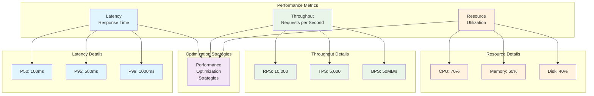

---
# Auto-generated front matter
Title: Performance Engineering Comprehensive Guide
LastUpdated: 2025-11-06T20:45:59.169653
Tags: []
Status: draft
---

# ⚡ Performance Engineering Comprehensive Guide

> **Complete guide to performance optimization, monitoring, and scaling for backend systems**

## 📚 Table of Contents

1. [Performance Fundamentals](#-performance-fundamentals)
2. [Profiling & Monitoring](#-profiling--monitoring)
3. [Database Performance](#-database-performance)
4. [Caching Strategies](#-caching-strategies)
5. [Memory Optimization](#-memory-optimization)
6. [Concurrency & Parallelism](#-concurrency--parallelism)
7. [Network Optimization](#-network-optimization)
8. [Load Testing](#-load-testing)
9. [Performance Patterns](#-performance-patterns)
10. [Real-world Case Studies](#-real-world-case-studies)

---

## 🎯 Performance Fundamentals

> **What is Performance Engineering?**
> 
> Performance engineering is the discipline of designing, implementing, and optimizing systems to achieve optimal performance, scalability, and resource utilization. It involves measuring, analyzing, and improving system performance throughout the entire software development lifecycle.

> **Why Performance Matters:**
> - **User Experience**: Fast applications provide better user satisfaction
> - **Business Impact**: Performance directly affects revenue and user retention
> - **Resource Efficiency**: Optimized systems use fewer resources and cost less
> - **Scalability**: Good performance enables systems to handle growth
> - **Competitive Advantage**: Performance can be a key differentiator

### Key Performance Metrics

> **Understanding Performance Metrics:**
> 
> These three categories of metrics provide a comprehensive view of system performance. Each metric tells a different story about how your system is performing.



> **Performance Metrics Visualization:**
> 
> This diagram illustrates the three fundamental categories of performance metrics and how they work together to provide a complete picture of system performance.

> **Metric Categories Explained:**
> 
> **🔵 Latency (Response Time)**
> - **P50 (Median)**: 50% of requests complete within this time
> - **P95 (95th Percentile)**: 95% of requests complete within this time  
> - **P99 (99th Percentile)**: 99% of requests complete within this time
> - **Why Important**: Shows user experience quality and system responsiveness

> **🟢 Throughput (Processing Rate)**
> - **RPS (Requests Per Second)**: How many requests the system can handle
> - **TPS (Transactions Per Second)**: Business transactions processed per second
> - **BPS (Bytes Per Second)**: Data transfer rate
> - **Why Important**: Indicates system capacity and scalability

> **🟡 Resource Utilization (System Usage)**
> - **CPU Usage**: Percentage of CPU capacity being used
> - **Memory Usage**: Amount of RAM being consumed
> - **Disk I/O**: Disk read/write operations and space usage
> - **Why Important**: Shows system health and potential bottlenecks

> **Performance Optimization Strategies:**
> The bottom section represents the various techniques and approaches used to improve these metrics, including code optimization, caching, load balancing, and monitoring.

#### **Latency Metrics Explained:**
- **P50 (Median)**: 50% of requests complete within this time
- **P95 (95th Percentile)**: 95% of requests complete within this time
- **P99 (99th Percentile)**: 99% of requests complete within this time
- **Why Percentiles Matter**: P99 latency shows worst-case performance for most users

#### **Throughput Metrics Explained:**
- **RPS (Requests Per Second)**: How many requests the system can handle
- **TPS (Transactions Per Second)**: Business transactions processed per second
- **BPS (Bytes Per Second)**: Data transfer rate
- **Why Throughput Matters**: Higher throughput means the system can serve more users

#### **Resource Utilization Explained:**
- **CPU Usage**: Percentage of CPU capacity being used
- **Memory Usage**: Amount of RAM being consumed
- **Disk I/O**: Disk read/write operations and space usage
- **Why Resource Usage Matters**: High utilization can indicate bottlenecks or inefficiencies

### Performance Optimization Principles

1. **Measure First**: Always profile before optimizing
2. **Bottleneck Identification**: Find the slowest component
3. **Incremental Improvement**: Optimize one area at a time
4. **Trade-off Analysis**: Balance performance vs complexity
5. **Continuous Monitoring**: Track performance over time

---

## 🔍 Profiling & Monitoring

> **What is Profiling?**
> 
> Profiling is the process of measuring and analyzing the performance characteristics of your application. It helps you understand where your application spends time and resources, identify bottlenecks, and make data-driven optimization decisions.

> **Types of Profiling:**
> 1. **CPU Profiling**: Identifies which functions consume the most CPU time
> 2. **Memory Profiling**: Tracks memory allocation and identifies memory leaks
> 3. **I/O Profiling**: Monitors disk and network operations
> 4. **Concurrency Profiling**: Analyzes goroutine/thread behavior
> 5. **Block Profiling**: Identifies blocking operations

> **Profiling Tools by Language:**
> - **Go**: pprof, go tool trace, go test -bench
> - **Node.js**: clinic.js, 0x, node --prof
> - **Rust**: perf, flamegraph, cargo bench
> - **Python**: cProfile, py-spy, memory_profiler

### Node.js Profiling

> **Node.js Profiling Considerations:**
> 
> Node.js has unique characteristics that affect profiling:
> - **Single-threaded Event Loop**: Most operations are asynchronous
> - **V8 Engine**: JavaScript execution and garbage collection
> - **Memory Management**: Automatic garbage collection with potential leaks
> - **I/O Operations**: Non-blocking I/O with callbacks and promises

```javascript
// CPU Profiling with clinic.js - A comprehensive Node.js profiling tool
const clinic = require('@nearform/clinic');

// Memory profiling using V8's built-in profiling capabilities
const v8 = require('v8');

// startMemoryProfiling demonstrates how to profile memory usage in Node.js
// This function shows how to capture heap statistics and create memory snapshots
function startMemoryProfiling() {
    // Get current heap statistics from V8 engine
    const heapStats = v8.getHeapStatistics();
    console.log('Heap Statistics:', heapStats);
    
    // Create a heap snapshot for detailed memory analysis
    // This snapshot can be loaded in Chrome DevTools for analysis
    const fs = require('fs');
    const snapshot = v8.getHeapSnapshot();
    const fileName = `heap-${Date.now()}.heapsnapshot`;
    const fileStream = fs.createWriteStream(fileName);
    snapshot.pipe(fileStream);
    
    console.log(`Heap snapshot saved to: ${fileName}`);
}

// Performance monitoring middleware for Express.js applications
// This middleware measures request duration and logs performance metrics
const performanceMiddleware = (req, res, next) => {
    // Capture high-resolution timestamp at request start
    // process.hrtime.bigint() provides nanosecond precision
    const start = process.hrtime.bigint();
    
    // Set up event listener for when response is finished
    res.on('finish', () => {
        // Calculate total request duration
        const end = process.hrtime.bigint();
        const duration = Number(end - start) / 1000000; // Convert nanoseconds to milliseconds
        
        // Log basic request metrics
        console.log(`${req.method} ${req.url} - ${res.statusCode} - ${duration}ms`);
        
        // Alert on slow requests (over 1 second)
        // This helps identify performance bottlenecks
        if (duration > 1000) {
            console.warn(`Slow request detected: ${req.method} ${req.url} - ${duration}ms`);
        }
    });
    
    // Continue to next middleware
    next();
};

// MemoryLeakDetector helps identify potential memory leaks in Node.js applications
// This class monitors memory usage over time and alerts when memory grows unexpectedly
class MemoryLeakDetector {
    constructor() {
        // Capture initial memory state for comparison
        this.initialMemory = process.memoryUsage();
        
        // Set up periodic memory monitoring
        // Check every 30 seconds for memory growth patterns
        this.interval = setInterval(() => {
            this.checkMemoryUsage();
        }, 30000);
    }
    
    // checkMemoryUsage compares current memory usage with initial state
    // This helps identify if memory is growing over time (potential leak)
    checkMemoryUsage() {
        const currentMemory = process.memoryUsage();
        const memoryIncrease = currentMemory.heapUsed - this.initialMemory.heapUsed;
        
        // Alert if memory has grown by more than 100MB
        // This threshold can be adjusted based on your application's needs
        if (memoryIncrease > 100 * 1024 * 1024) { // 100MB increase
            console.warn('Potential memory leak detected:', {
                initial: this.initialMemory.heapUsed,
                current: currentMemory.heapUsed,
                increase: memoryIncrease
            });
        }
    }
    
    // stop terminates the memory monitoring
    // Call this when shutting down the application
    stop() {
        clearInterval(this.interval);
    }
}

// Usage
const leakDetector = new MemoryLeakDetector();
```

### Go Profiling

> **Go Profiling Advantages:**
> 
> Go has excellent built-in profiling tools that make performance analysis straightforward:
> - **pprof Package**: Built-in profiling with HTTP endpoints
> - **Runtime Integration**: Profiling is part of the standard library
> - **Multiple Profile Types**: CPU, memory, goroutine, and block profiling
> - **Web Interface**: Easy-to-use web interface for profile analysis
> - **Low Overhead**: Minimal performance impact during profiling

> **Go Profiling Types:**
> 1. **CPU Profiling**: Shows which functions consume the most CPU time
> 2. **Memory Profiling**: Tracks memory allocation and identifies leaks
> 3. **Goroutine Profiling**: Analyzes goroutine usage and blocking
> 4. **Block Profiling**: Identifies blocking operations
> 5. **Trace Profiling**: Detailed execution trace for complex analysis

> **How to Use Go Profiling:**
> 1. Import `_ "net/http/pprof"` to enable HTTP endpoints
> 2. Start profiling with `pprof.StartCPUProfile()`
> 3. Stop profiling with `pprof.StopCPUProfile()`
> 4. Access profiles at `http://localhost:6060/debug/pprof/`
> 5. Analyze with `go tool pprof` command

```go
package main

import (
    "fmt"
    "log"
    "net/http"
    _ "net/http/pprof"  // Enables pprof HTTP endpoints
    "runtime"
    "time"
)

// startCPUProfile demonstrates how to start CPU profiling in Go
// This function creates a CPU profile file and starts profiling
func startCPUProfile() {
    // Create a file to store the CPU profile
    f, err := os.Create("cpu.prof")
    if err != nil {
        log.Fatal(err)
    }
    defer f.Close()  // Ensure file is closed when function returns
    
    // Start CPU profiling and write to the file
    if err := pprof.StartCPUProfile(f); err != nil {
        log.Fatal(err)
    }
    defer pprof.StopCPUProfile()  // Ensure profiling stops when function returns
}

// startMemoryProfile demonstrates how to create a memory profile in Go
// This function captures the current heap state and writes it to a file
func startMemoryProfile() {
    // Create a file to store the memory profile
    f, err := os.Create("mem.prof")
    if err != nil {
        log.Fatal(err)
    }
    defer f.Close()  // Ensure file is closed when function returns
    
    // Force garbage collection to get up-to-date memory statistics
    // This ensures the profile reflects the current memory state
    runtime.GC()
    
    // Write the current heap profile to the file
    if err := pprof.WriteHeapProfile(f); err != nil {
        log.Fatal(err)
    }
}

// PerformanceMiddleware creates HTTP middleware for performance monitoring
// This middleware measures request duration and logs performance metrics
func PerformanceMiddleware(next http.Handler) http.Handler {
    return http.HandlerFunc(func(w http.ResponseWriter, r *http.Request) {
        // Capture start time for duration calculation
        start := time.Now()
        
        // Wrap response writer to capture status code
        // This allows us to log the HTTP status code along with timing
        ww := &responseWriter{ResponseWriter: w, statusCode: 200}
        
        // Call the next handler in the chain
        next.ServeHTTP(ww, r)
        
        // Calculate total request duration
        duration := time.Since(start)
        
        // Log basic performance metrics
        // Format: METHOD PATH - STATUS_CODE - DURATION
        log.Printf("%s %s - %d - %v", r.Method, r.URL.Path, ww.statusCode, duration)
        
        // Alert on slow requests (over 1 second)
        // This helps identify performance bottlenecks
        if duration > time.Second {
            log.Printf("Slow request: %s %s - %v", r.Method, r.URL.Path, duration)
        }
    })
}

// responseWriter wraps http.ResponseWriter to capture the status code
// This is necessary because the standard ResponseWriter doesn't expose the status code
type responseWriter struct {
    http.ResponseWriter  // Embed the original ResponseWriter
    statusCode int       // Store the status code for logging
}

// WriteHeader overrides the WriteHeader method to capture the status code
// This allows us to log the HTTP status code along with performance metrics
func (rw *responseWriter) WriteHeader(code int) {
    rw.statusCode = code                    // Store the status code
    rw.ResponseWriter.WriteHeader(code)     // Call the original WriteHeader
}

// monitorMemory demonstrates continuous memory monitoring in Go
// This function runs in a goroutine and logs memory statistics every 30 seconds
func monitorMemory() {
    // Create a ticker that fires every 30 seconds
    ticker := time.NewTicker(30 * time.Second)
    defer ticker.Stop()  // Ensure ticker is stopped when function returns
    
    // Monitor memory usage in a loop
    for range ticker.C {
        var m runtime.MemStats
        runtime.ReadMemStats(&m)  // Get current memory statistics
        
        // Log key memory metrics
        // Alloc: Currently allocated memory
        // TotalAlloc: Total memory allocated since program start
        // Sys: Total memory obtained from OS
        // NumGC: Number of garbage collection cycles
        log.Printf("Memory usage: Alloc=%d KB, TotalAlloc=%d KB, Sys=%d KB, NumGC=%d",
            m.Alloc/1024, m.TotalAlloc/1024, m.Sys/1024, m.NumGC)
        
        // Alert on high memory usage (over 100MB)
        // This helps identify potential memory leaks
        if m.Alloc > 100*1024*1024 { // 100MB
            log.Printf("High memory usage detected: %d KB", m.Alloc/1024)
        }
    }
}

func main() {
    // Start pprof server in a goroutine
    // This enables profiling endpoints at http://localhost:6060/debug/pprof/
    go func() {
        log.Println("Starting pprof server on :6060")
        log.Println(http.ListenAndServe("localhost:6060", nil))
    }()
    
    // Start memory monitoring in a goroutine
    // This will log memory usage every 30 seconds
    go monitorMemory()
    
    // Set up your application routes
    mux := http.NewServeMux()
    mux.HandleFunc("/", func(w http.ResponseWriter, r *http.Request) {
        w.Write([]byte("Hello World"))
    })
    
    // Wrap the mux with performance middleware
    // This will measure and log performance metrics for all requests
    handler := PerformanceMiddleware(mux)
    
    // Start the main HTTP server
    log.Fatal(http.ListenAndServe(":8080", handler))
}
```

### Rust Profiling

```rust
use std::time::Instant;
use std::sync::Arc;
use std::sync::atomic::{AtomicU64, Ordering};

// Performance monitoring
pub struct PerformanceMonitor {
    request_count: AtomicU64,
    total_duration: AtomicU64,
    slow_requests: AtomicU64,
}

impl PerformanceMonitor {
    pub fn new() -> Self {
        Self {
            request_count: AtomicU64::new(0),
            total_duration: AtomicU64::new(0),
            slow_requests: AtomicU64::new(0),
        }
    }
    
    pub fn record_request(&self, duration: u64) {
        self.request_count.fetch_add(1, Ordering::Relaxed);
        self.total_duration.fetch_add(duration, Ordering::Relaxed);
        
        if duration > 1000 { // 1 second
            self.slow_requests.fetch_add(1, Ordering::Relaxed);
        }
    }
    
    pub fn get_stats(&self) -> (u64, u64, u64) {
        let count = self.request_count.load(Ordering::Relaxed);
        let total = self.total_duration.load(Ordering::Relaxed);
        let slow = self.slow_requests.load(Ordering::Relaxed);
        
        (count, total, slow)
    }
}

// Memory profiling
use std::alloc::{GlobalAlloc, Layout, System};
use std::sync::atomic::{AtomicUsize, Ordering};

struct ProfilingAllocator;

unsafe impl GlobalAlloc for ProfilingAllocator {
    unsafe fn alloc(&self, layout: Layout) -> *mut u8 {
        let ptr = System.alloc(layout);
        if !ptr.is_null() {
            ALLOCATED_BYTES.fetch_add(layout.size(), Ordering::Relaxed);
        }
        ptr
    }
    
    unsafe fn dealloc(&self, ptr: *mut u8, layout: Layout) {
        ALLOCATED_BYTES.fetch_sub(layout.size(), Ordering::Relaxed);
        System.dealloc(ptr, layout);
    }
}

static ALLOCATED_BYTES: AtomicUsize = AtomicUsize::new(0);

#[global_allocator]
static GLOBAL: ProfilingAllocator = ProfilingAllocator;

// Performance middleware
use actix_web::{web, App, HttpServer, middleware, HttpResponse};

async fn performance_middleware(
    req: actix_web::HttpRequest,
    next: actix_web::middleware::Next,
) -> Result<actix_web::HttpResponse, actix_web::Error> {
    let start = Instant::now();
    let res = next.run(req).await?;
    let duration = start.elapsed().as_millis() as u64;
    
    // Record performance metrics
    let monitor = req.app_data::<Arc<PerformanceMonitor>>().unwrap();
    monitor.record_request(duration);
    
    Ok(res)
}

#[actix_web::main]
async fn main() -> std::io::Result<()> {
    let monitor = Arc::new(PerformanceMonitor::new());
    
    HttpServer::new(move || {
        App::new()
            .app_data(web::Data::new(monitor.clone()))
            .wrap(performance_middleware)
            .route("/", web::get().to(handler))
    })
    .bind("127.0.0.1:8080")?
    .run()
    .await
}

async fn handler() -> Result<HttpResponse, actix_web::Error> {
    Ok(HttpResponse::Ok().json(serde_json::json!({
        "message": "Hello World"
    })))
}
```

---

## 🗄️ Database Performance

> **Why Database Performance Matters:**
> 
> Database operations are often the biggest bottleneck in web applications. Poor database performance can lead to:
> - Slow response times and poor user experience
> - High resource usage and increased costs
> - System timeouts and failures
> - Difficulty scaling the application
> - Poor developer productivity

> **Common Database Performance Issues:**
> 1. **Missing Indexes**: Queries scan entire tables instead of using indexes
> 2. **Poor Query Design**: Inefficient SQL queries with unnecessary operations
> 3. **Connection Pool Exhaustion**: Too many database connections
> 4. **N+1 Query Problem**: Multiple queries instead of joins
> 5. **Lock Contention**: Queries blocking each other
> 6. **Resource Limits**: CPU, memory, or disk I/O bottlenecks

> **Database Optimization Strategies:**
> 1. **Query Optimization**: Write efficient SQL queries
> 2. **Indexing**: Create appropriate indexes for common queries
> 3. **Connection Pooling**: Reuse database connections
> 4. **Query Caching**: Cache frequently executed queries
> 5. **Database Sharding**: Distribute data across multiple databases
> 6. **Read Replicas**: Use read-only copies for queries
> 7. **Partitioning**: Split large tables into smaller pieces

### Query Optimization

> **What is Query Optimization?**
> 
> Query optimization is the process of improving the performance of database queries by:
> - Analyzing query execution plans
> - Creating appropriate indexes
> - Rewriting queries for better performance
> - Using query hints and optimizations
> - Monitoring query performance over time

> **Key Optimization Techniques:**
> 1. **Index Usage**: Ensure queries use indexes effectively
> 2. **Join Optimization**: Use appropriate join types and order
> 3. **Subquery Elimination**: Replace subqueries with joins when possible
> 4. **Query Rewriting**: Simplify complex queries
> 5. **Statistics Updates**: Keep database statistics current
> 6. **Query Plan Analysis**: Use EXPLAIN to understand query execution

#### SQL Query Optimization

> **Index Optimization Strategy:**
> 
> Indexes are crucial for database performance. They speed up data retrieval by providing a fast path to data. However, they also slow down writes and consume storage space.

> **Types of Indexes:**
> - **Single-column Index**: Index on one column
> - **Composite Index**: Index on multiple columns
> - **Partial Index**: Index on a subset of rows
> - **Covering Index**: Index that includes all needed columns
> - **Unique Index**: Ensures uniqueness and provides fast lookups

```sql
-- Index optimization examples
-- Single-column indexes for individual field lookups
CREATE INDEX idx_user_email ON users(email);
CREATE INDEX idx_order_user_id ON orders(user_id);
CREATE INDEX idx_order_created_at ON orders(created_at);

-- Composite indexes for multi-column queries
-- These are more efficient than separate indexes for combined queries
CREATE INDEX idx_user_status_created ON users(status, created_at);

-- Partial indexes for specific conditions
-- These indexes only include rows that meet certain criteria
CREATE INDEX idx_active_users ON users(email) WHERE status = 'active';

-- Query optimization examples
-- These examples show common performance problems and their solutions

-- PROBLEM: Full table scan due to leading wildcard
-- This query scans every row in the users table
SELECT * FROM users WHERE email LIKE '%@gmail.com';

-- SOLUTION: Use index-friendly pattern
-- This query can use an index on the email column
SELECT * FROM users WHERE email LIKE 'user%@gmail.com';

-- PROBLEM: N+1 query problem
-- This approach makes one query for orders, then one query per order
SELECT * FROM orders;
-- Then for each order: SELECT * FROM order_items WHERE order_id = ?

-- SOLUTION: Single query with JOIN
-- This approach makes only one database round trip
SELECT o.*, oi.* 
FROM orders o 
LEFT JOIN order_items oi ON o.id = oi.order_id;

-- PROBLEM: Inefficient subquery
-- This query executes the subquery for each row in the outer query
SELECT * FROM users 
WHERE id IN (SELECT user_id FROM orders WHERE total > 1000);

-- SOLUTION: Use JOIN instead of subquery
-- This approach is typically more efficient
SELECT DISTINCT u.* 
FROM users u 
INNER JOIN orders o ON u.id = o.user_id 
WHERE o.total > 1000;
```

#### Database Connection Pooling

> **What is Connection Pooling?**
> 
> Connection pooling is a technique that maintains a cache of database connections that can be reused across multiple requests. Instead of creating a new connection for each database operation, the application borrows a connection from the pool, uses it, and returns it to the pool.

> **Why Connection Pooling Matters:**
> - **Performance**: Reusing connections is much faster than creating new ones
> - **Resource Management**: Limits the number of concurrent database connections
> - **Scalability**: Allows the application to handle more concurrent users
> - **Reliability**: Reduces connection failures and timeouts
> - **Cost Efficiency**: Fewer database connections mean lower resource usage

> **Connection Pool Configuration:**
> - **Max Open Connections**: Maximum number of open connections to the database
> - **Max Idle Connections**: Maximum number of idle connections in the pool
> - **Connection Max Lifetime**: Maximum time a connection can be reused
> - **Connection Max Idle Time**: Maximum time a connection can be idle before being closed
> - **Connection Timeout**: Maximum time to wait for a connection from the pool

> **Best Practices:**
> 1. **Size the Pool Appropriately**: Too small causes waiting, too large wastes resources
> 2. **Monitor Pool Metrics**: Track connection usage and pool health
> 3. **Handle Pool Exhaustion**: Implement proper error handling when pool is full
> 4. **Use Context for Timeouts**: Implement request timeouts to prevent hanging
> 5. **Graceful Shutdown**: Properly close connections when shutting down

```go
// Go database connection pooling implementation
// This example shows how to configure and use connection pooling in Go
package main

import (
    "database/sql"
    "fmt"
    "time"
    _ "github.com/lib/pq"  // PostgreSQL driver
)

// DatabaseConfig holds configuration for database connection pooling
// This struct encapsulates all the parameters needed to configure a database connection pool
type DatabaseConfig struct {
    Host            string        // Database host address
    Port            int           // Database port number
    User            string        // Database username
    Password        string        // Database password
    Database        string        // Database name
    MaxOpenConns    int           // Maximum number of open connections to the database
    MaxIdleConns    int           // Maximum number of idle connections in the pool
    ConnMaxLifetime time.Duration // Maximum time a connection can be reused
    ConnMaxIdleTime time.Duration // Maximum time a connection can be idle before being closed
}

// NewDatabase creates a new database connection with connection pooling configured
// This function sets up a database connection pool with the specified configuration
func NewDatabase(config DatabaseConfig) (*sql.DB, error) {
    // Build the database connection string (DSN)
    dsn := fmt.Sprintf("host=%s port=%d user=%s password=%s dbname=%s sslmode=disable",
        config.Host, config.Port, config.User, config.Password, config.Database)
    
    // Open the database connection
    // Note: sql.Open doesn't actually connect to the database yet
    db, err := sql.Open("postgres", dsn)
    if err != nil {
        return nil, err
    }
    
    // Configure connection pool settings
    // These settings control how the connection pool behaves
    db.SetMaxOpenConns(config.MaxOpenConns)    // Maximum open connections
    db.SetMaxIdleConns(config.MaxIdleConns)    // Maximum idle connections
    db.SetConnMaxLifetime(config.ConnMaxLifetime) // Connection lifetime
    db.SetConnMaxIdleTime(config.ConnMaxIdleTime) // Idle connection timeout
    
    // Test the connection to ensure it's working
    // This actually establishes a connection to the database
    if err := db.Ping(); err != nil {
        return nil, err
    }
    
    return db, nil
}

// Usage example demonstrating how to configure and use database connection pooling
func main() {
    // Configure database connection pool
    // These settings should be tuned based on your application's needs
    config := DatabaseConfig{
        Host:            "localhost",        // Database host
        Port:            5432,              // PostgreSQL default port
        User:            "user",            // Database username
        Password:        "password",        // Database password
        Database:        "mydb",            // Database name
        MaxOpenConns:    25,                // Allow up to 25 concurrent connections
        MaxIdleConns:    5,                 // Keep 5 connections idle in the pool
        ConnMaxLifetime: 5 * time.Minute,   // Connections expire after 5 minutes
        ConnMaxIdleTime: 1 * time.Minute,   // Idle connections close after 1 minute
    }
    
    // Create database connection with pooling
    db, err := NewDatabase(config)
    if err != nil {
        log.Fatal(err)
    }
    defer db.Close()  // Ensure database connection is closed when program exits
}
```

### Database Sharding

> **What is Database Sharding?**
> 
> Database sharding is a technique for distributing data across multiple databases to improve performance and scalability. Instead of storing all data in a single database, the data is partitioned across multiple "shards" based on a sharding key.

> **Why Use Database Sharding?**
> - **Scalability**: Distribute load across multiple databases
> - **Performance**: Smaller databases are faster to query
> - **Availability**: Failure of one shard doesn't affect others
> - **Geographic Distribution**: Place data closer to users
> - **Resource Limits**: Overcome single database limitations

> **Sharding Strategies:**
> 1. **Range Sharding**: Partition data by value ranges (e.g., user_id 1-1000 in shard 1)
> 2. **Hash Sharding**: Use hash function to distribute data evenly
> 3. **Directory Sharding**: Use a lookup table to determine shard
> 4. **Geographic Sharding**: Partition by geographic location
> 5. **Functional Sharding**: Partition by business function

> **Sharding Challenges:**
> - **Cross-shard Queries**: Queries spanning multiple shards are complex
> - **Data Rebalancing**: Moving data between shards is difficult
> - **Transaction Management**: ACID properties across shards are challenging
> - **Schema Changes**: Updating schema across all shards
> - **Monitoring**: Tracking performance across multiple databases

> **Best Practices:**
> 1. **Choose Sharding Key Carefully**: Should distribute data evenly
> 2. **Avoid Cross-shard Queries**: Design queries to stay within one shard
> 3. **Plan for Growth**: Design sharding strategy for future scale
> 4. **Monitor Shard Health**: Track performance and usage of each shard
> 5. **Implement Shard Routing**: Efficiently route queries to correct shard

```go
// Database sharding implementation
// This example shows how to implement hash-based sharding in Go
package main

import (
    "hash/fnv"  // Fast hash function for sharding
    "strconv"
)

// ShardConfig holds configuration for a single database shard
// This struct defines the connection details for each shard in the cluster
type ShardConfig struct {
    Host     string // Database host address
    Port     int    // Database port number
    Database string // Database name
    Weight   int    // Shard weight for load balancing
}

// ShardedDatabase manages multiple database shards
// This struct provides a unified interface for working with sharded data
type ShardedDatabase struct {
    shards  []*sql.DB      // Array of database connections (one per shard)
    configs []ShardConfig  // Configuration for each shard
}

// NewShardedDatabase creates a new sharded database instance
// This function initializes connections to all shards in the cluster
func NewShardedDatabase(configs []ShardConfig) (*ShardedDatabase, error) {
    var shards []*sql.DB
    
    // Initialize connection to each shard
    for _, config := range configs {
        db, err := NewDatabase(DatabaseConfig{
            Host:     config.Host,
            Port:     config.Port,
            Database: config.Database,
        })
        if err != nil {
            return nil, err
        }
        shards = append(shards, db)
    }
    
    return &ShardedDatabase{
        shards:  shards,
        configs: configs,
    }, nil
}

// GetShard determines which shard to use for a given key
// This function uses consistent hashing to ensure the same key always goes to the same shard
func (sd *ShardedDatabase) GetShard(key string) *sql.DB {
    // Create a hash of the key
    hash := fnv.New32a()
    hash.Write([]byte(key))
    
    // Use modulo to determine shard index
    // This ensures even distribution across all shards
    shardIndex := int(hash.Sum32()) % len(sd.shards)
    
    return sd.shards[shardIndex]
}

// Query executes a query on the appropriate shard
// This function automatically routes the query to the correct shard based on the key
func (sd *ShardedDatabase) Query(key string, query string, args ...interface{}) (*sql.Rows, error) {
    // Get the appropriate shard for this key
    shard := sd.GetShard(key)
    
    // Execute the query on the selected shard
    return shard.Query(query, args...)
}
```

---

## 🚀 Caching Strategies

### Multi-Level Caching

```go
// Multi-level cache implementation
package main

import (
    "context"
    "time"
    "github.com/go-redis/redis/v8"
)

type CacheLevel int

const (
    L1Cache CacheLevel = iota // Memory cache
    L2Cache                   // Redis cache
    L3Cache                   // Database
)

type MultiLevelCache struct {
    l1Cache map[string]interface{}
    l2Cache *redis.Client
    l3Cache *sql.DB
    ttl     time.Duration
}

func NewMultiLevelCache(redisClient *redis.Client, db *sql.DB, ttl time.Duration) *MultiLevelCache {
    return &MultiLevelCache{
        l1Cache: make(map[string]interface{}),
        l2Cache: redisClient,
        l3Cache: db,
        ttl:     ttl,
    }
}

func (mlc *MultiLevelCache) Get(ctx context.Context, key string) (interface{}, error) {
    // Try L1 cache first
    if value, exists := mlc.l1Cache[key]; exists {
        return value, nil
    }
    
    // Try L2 cache (Redis)
    value, err := mlc.l2Cache.Get(ctx, key).Result()
    if err == nil {
        // Store in L1 cache
        mlc.l1Cache[key] = value
        return value, nil
    }
    
    // Try L3 cache (Database)
    var result interface{}
    err = mlc.l3Cache.QueryRowContext(ctx, "SELECT data FROM cache WHERE key = $1", key).Scan(&result)
    if err == nil {
        // Store in L2 and L1 caches
        mlc.l2Cache.Set(ctx, key, result, mlc.ttl)
        mlc.l1Cache[key] = result
        return result, nil
    }
    
    return nil, err
}

func (mlc *MultiLevelCache) Set(ctx context.Context, key string, value interface{}) error {
    // Store in all levels
    mlc.l1Cache[key] = value
    mlc.l2Cache.Set(ctx, key, value, mlc.ttl)
    
    _, err := mlc.l3Cache.ExecContext(ctx, 
        "INSERT INTO cache (key, data) VALUES ($1, $2) ON CONFLICT (key) DO UPDATE SET data = $2",
        key, value)
    
    return err
}
```

### Cache-Aside Pattern

```go
// Cache-aside pattern implementation
type CacheAsideService struct {
    cache  *MultiLevelCache
    db     *sql.DB
    logger *log.Logger
}

func (cas *CacheAsideService) GetUser(ctx context.Context, userID string) (*User, error) {
    // Try cache first
    cacheKey := fmt.Sprintf("user:%s", userID)
    cached, err := cas.cache.Get(ctx, cacheKey)
    if err == nil {
        if user, ok := cached.(*User); ok {
            cas.logger.Printf("Cache hit for user %s", userID)
            return user, nil
        }
    }
    
    // Cache miss - get from database
    cas.logger.Printf("Cache miss for user %s", userID)
    user, err := cas.getUserFromDB(ctx, userID)
    if err != nil {
        return nil, err
    }
    
    // Store in cache
    cas.cache.Set(ctx, cacheKey, user)
    
    return user, nil
}

func (cas *CacheAsideService) UpdateUser(ctx context.Context, user *User) error {
    // Update database
    err := cas.updateUserInDB(ctx, user)
    if err != nil {
        return err
    }
    
    // Invalidate cache
    cacheKey := fmt.Sprintf("user:%s", user.ID)
    cas.cache.Delete(ctx, cacheKey)
    
    return nil
}
```

---

## 💾 Memory Optimization

### Memory Pool Pattern

```go
// Memory pool for reducing GC pressure
package main

import (
    "sync"
)

type ObjectPool struct {
    pool sync.Pool
}

func NewObjectPool() *ObjectPool {
    return &ObjectPool{
        pool: sync.Pool{
            New: func() interface{} {
                return &Buffer{
                    data: make([]byte, 0, 1024),
                }
            },
        },
    }
}

type Buffer struct {
    data []byte
}

func (b *Buffer) Reset() {
    b.data = b.data[:0]
}

func (b *Buffer) Write(p []byte) (n int, err error) {
    b.data = append(b.data, p...)
    return len(p), nil
}

func (b *Buffer) Bytes() []byte {
    return b.data
}

func (op *ObjectPool) Get() *Buffer {
    return op.pool.Get().(*Buffer)
}

func (op *ObjectPool) Put(buf *Buffer) {
    buf.Reset()
    op.pool.Put(buf)
}

// Usage
func processRequest(pool *ObjectPool, data []byte) {
    buf := pool.Get()
    defer pool.Put(buf)
    
    // Use buffer
    buf.Write(data)
    result := buf.Bytes()
    
    // Process result...
    _ = result
}
```

### String Interning

```go
// String interning to reduce memory usage
package main

import (
    "sync"
)

type StringInterner struct {
    strings map[string]string
    mutex   sync.RWMutex
}

func NewStringInterner() *StringInterner {
    return &StringInterner{
        strings: make(map[string]string),
    }
}

func (si *StringInterner) Intern(s string) string {
    si.mutex.RLock()
    if interned, exists := si.strings[s]; exists {
        si.mutex.RUnlock()
        return interned
    }
    si.mutex.RUnlock()
    
    si.mutex.Lock()
    defer si.mutex.Unlock()
    
    // Double-check after acquiring write lock
    if interned, exists := si.strings[s]; exists {
        return interned
    }
    
    si.strings[s] = s
    return s
}

// Usage
func main() {
    interner := NewStringInterner()
    
    // These will return the same string reference
    s1 := interner.Intern("hello")
    s2 := interner.Intern("hello")
    
    // s1 and s2 are the same string reference
    fmt.Println(s1 == s2) // true
}
```

---

## ⚡ Concurrency & Parallelism

### Worker Pool Pattern

```go
// Worker pool for concurrent processing
package main

import (
    "context"
    "sync"
)

type Job struct {
    ID   int
    Data interface{}
}

type Result struct {
    JobID int
    Data  interface{}
    Error error
}

type WorkerPool struct {
    workerCount int
    jobQueue    chan Job
    resultQueue chan Result
    ctx         context.Context
    cancel      context.CancelFunc
}

func NewWorkerPool(workerCount int) *WorkerPool {
    ctx, cancel := context.WithCancel(context.Background())
    
    return &WorkerPool{
        workerCount: workerCount,
        jobQueue:    make(chan Job, workerCount*2),
        resultQueue: make(chan Result, workerCount*2),
        ctx:         ctx,
        cancel:      cancel,
    }
}

func (wp *WorkerPool) Start() {
    var wg sync.WaitGroup
    
    for i := 0; i < wp.workerCount; i++ {
        wg.Add(1)
        go wp.worker(&wg)
    }
    
    go func() {
        wg.Wait()
        close(wp.resultQueue)
    }()
}

func (wp *WorkerPool) worker(wg *sync.WaitGroup) {
    defer wg.Done()
    
    for {
        select {
        case job := <-wp.jobQueue:
            result := wp.processJob(job)
            wp.resultQueue <- result
        case <-wp.ctx.Done():
            return
        }
    }
}

func (wp *WorkerPool) processJob(job Job) Result {
    // Process job
    return Result{
        JobID: job.ID,
        Data:  job.Data,
        Error: nil,
    }
}

func (wp *WorkerPool) Submit(job Job) {
    select {
    case wp.jobQueue <- job:
    case <-wp.ctx.Done():
    }
}

func (wp *WorkerPool) GetResult() <-chan Result {
    return wp.resultQueue
}

func (wp *WorkerPool) Stop() {
    wp.cancel()
}
```

### Pipeline Pattern

```go
// Pipeline for data processing
package main

import (
    "context"
    "sync"
)

type Pipeline struct {
    stages []Stage
    ctx    context.Context
    cancel context.CancelFunc
}

type Stage interface {
    Process(ctx context.Context, input <-chan interface{}) <-chan interface{}
}

type FilterStage struct {
    filter func(interface{}) bool
}

func (fs *FilterStage) Process(ctx context.Context, input <-chan interface{}) <-chan interface{} {
    output := make(chan interface{})
    
    go func() {
        defer close(output)
        for {
            select {
            case data, ok := <-input:
                if !ok {
                    return
                }
                if fs.filter(data) {
                    select {
                    case output <- data:
                    case <-ctx.Done():
                        return
                    }
                }
            case <-ctx.Done():
                return
            }
        }
    }()
    
    return output
}

type TransformStage struct {
    transform func(interface{}) interface{}
}

func (ts *TransformStage) Process(ctx context.Context, input <-chan interface{}) <-chan interface{} {
    output := make(chan interface{})
    
    go func() {
        defer close(output)
        for {
            select {
            case data, ok := <-input:
                if !ok {
                    return
                }
                transformed := ts.transform(data)
                select {
                case output <- transformed:
                case <-ctx.Done():
                    return
                }
            case <-ctx.Done():
                return
            }
        }
    }()
    
    return output
}

func NewPipeline(stages ...Stage) *Pipeline {
    ctx, cancel := context.WithCancel(context.Background())
    return &Pipeline{
        stages: stages,
        ctx:    ctx,
        cancel: cancel,
    }
}

func (p *Pipeline) Process(input <-chan interface{}) <-chan interface{} {
    current := input
    
    for _, stage := range p.stages {
        current = stage.Process(p.ctx, current)
    }
    
    return current
}

func (p *Pipeline) Stop() {
    p.cancel()
}
```

---

## 🌐 Network Optimization

### Connection Pooling

```go
// HTTP connection pooling
package main

import (
    "net/http"
    "time"
)

func NewHTTPClient() *http.Client {
    transport := &http.Transport{
        MaxIdleConns:        100,
        MaxIdleConnsPerHost: 10,
        IdleConnTimeout:     90 * time.Second,
        DisableKeepAlives:   false,
    }
    
    return &http.Client{
        Transport: transport,
        Timeout:   30 * time.Second,
    }
}

// Connection reuse
type HTTPClientPool struct {
    clients []*http.Client
    current int
    mutex   sync.Mutex
}

func NewHTTPClientPool(size int) *HTTPClientPool {
    clients := make([]*http.Client, size)
    for i := 0; i < size; i++ {
        clients[i] = NewHTTPClient()
    }
    
    return &HTTPClientPool{
        clients: clients,
    }
}

func (hcp *HTTPClientPool) Get() *http.Client {
    hcp.mutex.Lock()
    defer hcp.mutex.Unlock()
    
    client := hcp.clients[hcp.current]
    hcp.current = (hcp.current + 1) % len(hcp.clients)
    return client
}
```

### Compression

```go
// Response compression
package main

import (
    "compress/gzip"
    "net/http"
    "strings"
)

func CompressionMiddleware(next http.Handler) http.Handler {
    return http.HandlerFunc(func(w http.ResponseWriter, r *http.Request) {
        if !strings.Contains(r.Header.Get("Accept-Encoding"), "gzip") {
            next.ServeHTTP(w, r)
            return
        }
        
        w.Header().Set("Content-Encoding", "gzip")
        w.Header().Set("Vary", "Accept-Encoding")
        
        gz := gzip.NewWriter(w)
        defer gz.Close()
        
        gzw := &gzipResponseWriter{ResponseWriter: w, Writer: gz}
        next.ServeHTTP(gzw, r)
    })
}

type gzipResponseWriter struct {
    http.ResponseWriter
    *gzip.Writer
}

func (gzw *gzipResponseWriter) Write(data []byte) (int, error) {
    return gzw.Writer.Write(data)
}
```

---

## 🧪 Load Testing

### Load Testing with Go

```go
// Load testing implementation
package main

import (
    "context"
    "fmt"
    "net/http"
    "sync"
    "time"
)

type LoadTest struct {
    URL         string
    Concurrency int
    Duration    time.Duration
    Rate        int // requests per second
}

type LoadTestResult struct {
    TotalRequests    int
    SuccessfulRequests int
    FailedRequests   int
    AverageLatency   time.Duration
    P95Latency       time.Duration
    P99Latency       time.Duration
    RPS              float64
}

func (lt *LoadTest) Run() *LoadTestResult {
    ctx, cancel := context.WithTimeout(context.Background(), lt.Duration)
    defer cancel()
    
    var wg sync.WaitGroup
    results := make(chan time.Duration, lt.Concurrency*1000)
    
    // Start workers
    for i := 0; i < lt.Concurrency; i++ {
        wg.Add(1)
        go lt.worker(ctx, &wg, results)
    }
    
    // Collect results
    go func() {
        wg.Wait()
        close(results)
    }()
    
    var latencies []time.Duration
    for latency := range results {
        latencies = append(latencies, latency)
    }
    
    return lt.calculateResults(latencies)
}

func (lt *LoadTest) worker(ctx context.Context, wg *sync.WaitGroup, results chan<- time.Duration) {
    defer wg.Done()
    
    ticker := time.NewTicker(time.Second / time.Duration(lt.Rate/lt.Concurrency))
    defer ticker.Stop()
    
    client := &http.Client{Timeout: 10 * time.Second}
    
    for {
        select {
        case <-ctx.Done():
            return
        case <-ticker.C:
            start := time.Now()
            resp, err := client.Get(lt.URL)
            latency := time.Since(start)
            
            if err == nil {
                resp.Body.Close()
            }
            
            results <- latency
        }
    }
}

func (lt *LoadTest) calculateResults(latencies []time.Duration) *LoadTestResult {
    if len(latencies) == 0 {
        return &LoadTestResult{}
    }
    
    // Sort latencies
    sort.Slice(latencies, func(i, j int) bool {
        return latencies[i] < latencies[j]
    })
    
    total := len(latencies)
    var sum time.Duration
    
    for _, latency := range latencies {
        sum += latency
    }
    
    return &LoadTestResult{
        TotalRequests:    total,
        SuccessfulRequests: total, // Simplified
        FailedRequests:   0,
        AverageLatency:   sum / time.Duration(total),
        P95Latency:       latencies[int(float64(total)*0.95)],
        P99Latency:       latencies[int(float64(total)*0.99)],
        RPS:              float64(total) / lt.Duration.Seconds(),
    }
}

// Usage
func main() {
    test := &LoadTest{
        URL:         "http://localhost:8080/api/data",
        Concurrency: 10,
        Duration:    30 * time.Second,
        Rate:        100,
    }
    
    result := test.Run()
    fmt.Printf("Load Test Results:\n")
    fmt.Printf("Total Requests: %d\n", result.TotalRequests)
    fmt.Printf("Average Latency: %v\n", result.AverageLatency)
    fmt.Printf("P95 Latency: %v\n", result.P95Latency)
    fmt.Printf("P99 Latency: %v\n", result.P99Latency)
    fmt.Printf("RPS: %.2f\n", result.RPS)
}
```

---

## 🎯 Performance Patterns

### Circuit Breaker Pattern

```go
// Circuit breaker for fault tolerance
package main

import (
    "context"
    "errors"
    "sync"
    "time"
)

type CircuitState int

const (
    StateClosed CircuitState = iota
    StateOpen
    StateHalfOpen
)

type CircuitBreaker struct {
    maxFailures   int
    resetTimeout  time.Duration
    state         CircuitState
    failures      int
    lastFailTime  time.Time
    mutex         sync.RWMutex
}

func NewCircuitBreaker(maxFailures int, resetTimeout time.Duration) *CircuitBreaker {
    return &CircuitBreaker{
        maxFailures:  maxFailures,
        resetTimeout: resetTimeout,
        state:        StateClosed,
    }
}

func (cb *CircuitBreaker) Execute(fn func() error) error {
    cb.mutex.Lock()
    defer cb.mutex.Unlock()
    
    if cb.state == StateOpen {
        if time.Since(cb.lastFailTime) > cb.resetTimeout {
            cb.state = StateHalfOpen
        } else {
            return errors.New("circuit breaker is open")
        }
    }
    
    err := fn()
    if err != nil {
        cb.failures++
        cb.lastFailTime = time.Now()
        
        if cb.failures >= cb.maxFailures {
            cb.state = StateOpen
        }
        return err
    }
    
    // Success
    cb.failures = 0
    cb.state = StateClosed
    return nil
}
```

### Bulkhead Pattern

```go
// Bulkhead pattern for resource isolation
package main

import (
    "context"
    "sync"
    "time"
)

type Bulkhead struct {
    maxConcurrency int
    semaphore      chan struct{}
    timeout        time.Duration
}

func NewBulkhead(maxConcurrency int, timeout time.Duration) *Bulkhead {
    return &Bulkhead{
        maxConcurrency: maxConcurrency,
        semaphore:      make(chan struct{}, maxConcurrency),
        timeout:        timeout,
    }
}

func (b *Bulkhead) Execute(ctx context.Context, fn func() error) error {
    select {
    case b.semaphore <- struct{}{}:
        defer func() { <-b.semaphore }()
        
        done := make(chan error, 1)
        go func() {
            done <- fn()
        }()
        
        select {
        case err := <-done:
            return err
        case <-ctx.Done():
            return ctx.Err()
        case <-time.After(b.timeout):
            return errors.New("bulkhead timeout")
        }
    case <-ctx.Done():
        return ctx.Err()
    case <-time.After(b.timeout):
        return errors.New("bulkhead full")
    }
}
```

---

## 📊 Real-world Case Studies

### Case Study 1: E-commerce API Optimization

**Problem**: API response time was 2-3 seconds, causing poor user experience.

**Solution**:
1. **Database Optimization**: Added indexes, optimized queries
2. **Caching**: Implemented Redis caching for product data
3. **Connection Pooling**: Optimized database connection pool
4. **Response Compression**: Added gzip compression

**Results**:
- Response time reduced to 200-300ms
- 90% reduction in database load
- 50% reduction in server resources

### Case Study 2: Payment Processing System

**Problem**: High latency during peak hours (Black Friday).

**Solution**:
1. **Horizontal Scaling**: Added more servers
2. **Load Balancing**: Implemented intelligent load balancing
3. **Caching**: Cached payment gateway responses
4. **Async Processing**: Moved non-critical operations to background

**Results**:
- 99.9% uptime during peak hours
- 60% reduction in response time
- 3x increase in throughput

---

## 🎯 Performance Best Practices

### 1. Measurement First
- Always profile before optimizing
- Set performance baselines
- Monitor continuously

### 2. Identify Bottlenecks
- Use profiling tools
- Monitor key metrics
- Test under load

### 3. Optimize Incrementally
- One component at a time
- Measure impact of each change
- A/B test optimizations

### 4. Consider Trade-offs
- Performance vs complexity
- Memory vs CPU
- Latency vs throughput

### 5. Plan for Scale
- Design for horizontal scaling
- Use appropriate data structures
- Implement proper caching

---

## 🔧 **Performance Tools and Resources**

### **Profiling Tools**

#### **Go Profiling Tools**
- **pprof**: Built-in Go profiling tool
- **go-torch**: Flame graph generation
- **go-trace**: Execution tracing
- **benchstat**: Benchmark comparison

#### **Node.js Profiling Tools**
- **clinic.js**: Comprehensive Node.js profiling
- **0x**: Flame graph profiler
- **node --prof**: Built-in V8 profiler
- **autocannon**: HTTP benchmarking

#### **Database Profiling Tools**
- **EXPLAIN ANALYZE**: PostgreSQL query analysis
- **pt-query-digest**: MySQL slow query analysis
- **mongostat**: MongoDB performance monitoring
- **Redis MONITOR**: Redis command monitoring

### **Monitoring and Alerting**

#### **APM (Application Performance Monitoring)**
- **New Relic**: Full-stack monitoring
- **Datadog**: Infrastructure and application monitoring
- **AppDynamics**: Enterprise APM
- **Prometheus + Grafana**: Open-source monitoring

#### **Custom Monitoring**
- **Metrics Collection**: Prometheus, InfluxDB
- **Log Aggregation**: ELK Stack, Splunk
- **Distributed Tracing**: Jaeger, Zipkin
- **Alerting**: PagerDuty, OpsGenie

### **Load Testing Tools**

#### **HTTP Load Testing**
- **Apache Bench (ab)**: Simple HTTP benchmarking
- **wrk**: High-performance HTTP benchmarking
- **Artillery**: Modern load testing
- **k6**: Developer-centric load testing

#### **Database Load Testing**
- **sysbench**: Database benchmarking
- **pgbench**: PostgreSQL benchmarking
- **mysqlslap**: MySQL benchmarking
- **YCSB**: NoSQL benchmarking

### **Performance Optimization Checklist**

#### **Before Optimization**
- [ ] Establish performance baselines
- [ ] Identify key performance metrics
- [ ] Set performance goals and SLAs
- [ ] Implement monitoring and alerting
- [ ] Create performance test suite

#### **During Optimization**
- [ ] Profile before making changes
- [ ] Make one change at a time
- [ ] Measure impact of each change
- [ ] Document performance improvements
- [ ] Test under realistic load

#### **After Optimization**
- [ ] Validate performance improvements
- [ ] Update performance baselines
- [ ] Monitor for regressions
- [ ] Document lessons learned
- [ ] Share knowledge with team

### **Common Performance Anti-patterns**

#### **Database Anti-patterns**
- **N+1 Queries**: Making multiple queries instead of joins
- **Missing Indexes**: Queries without proper indexing
- **Over-fetching**: Selecting more data than needed
- **Under-fetching**: Making too many small queries

#### **Caching Anti-patterns**
- **Cache Stampede**: Multiple requests for same data
- **Cache Invalidation**: Inconsistent cache state
- **Over-caching**: Caching data that changes frequently
- **Under-caching**: Not caching expensive operations

#### **Concurrency Anti-patterns**
- **Goroutine Leaks**: Not properly cleaning up goroutines
- **Deadlocks**: Circular dependencies in locks
- **Race Conditions**: Unsafe concurrent access
- **Resource Starvation**: Not limiting concurrent operations

### **Performance Interview Questions**

#### **Beginner Level**
1. What is the difference between latency and throughput?
2. How do you measure application performance?
3. What is caching and why is it important?
4. How do you identify performance bottlenecks?

#### **Intermediate Level**
1. How would you optimize a slow database query?
2. What are the trade-offs of different caching strategies?
3. How do you handle memory leaks in your application?
4. What is connection pooling and why is it important?

#### **Advanced Level**
1. How would you design a high-performance caching system?
2. How do you optimize for different types of workloads?
3. What are the challenges of distributed performance monitoring?
4. How would you scale a system from 1K to 1M requests per second?

### **Performance Metrics Glossary**

#### **Latency Metrics**
- **P50 (Median)**: 50th percentile response time
- **P95**: 95th percentile response time
- **P99**: 99th percentile response time
- **P99.9**: 99.9th percentile response time

#### **Throughput Metrics**
- **RPS**: Requests per second
- **TPS**: Transactions per second
- **QPS**: Queries per second
- **BPS**: Bytes per second

#### **Resource Metrics**
- **CPU Usage**: Percentage of CPU utilization
- **Memory Usage**: RAM consumption
- **Disk I/O**: Disk read/write operations
- **Network I/O**: Network traffic

#### **Error Metrics**
- **Error Rate**: Percentage of failed requests
- **Timeout Rate**: Percentage of timed-out requests
- **Availability**: System uptime percentage
- **MTTR**: Mean time to recovery

---

**⚡ Master these performance engineering techniques to build fast, scalable, and efficient backend systems! 🚀**
