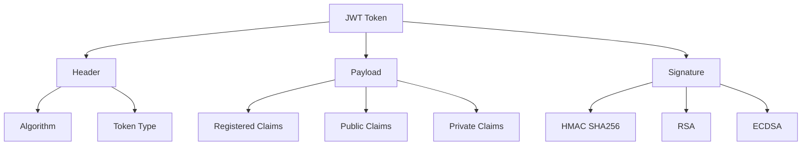

# JWT Implementation - JSON Web Tokens for Authentication

## Overview

JSON Web Tokens (JWT) are a compact, URL-safe means of representing claims to be transferred between parties. They are commonly used for authentication and information exchange in web applications, especially in microservices architectures.

## Key Concepts

- **Header**: Contains metadata about the token
- **Payload**: Contains the claims (user data)
- **Signature**: Ensures token integrity and authenticity
- **Claims**: Statements about an entity and additional metadata
- **Secret Key**: Used to sign and verify tokens
- **Expiration**: Token lifetime management

## JWT Structure



## Go Implementation

```go
package main

import (
    "crypto/hmac"
    "crypto/rand"
    "crypto/rsa"
    "crypto/sha256"
    "crypto/x509"
    "encoding/base64"
    "encoding/json"
    "encoding/pem"
    "fmt"
    "log"
    "math/big"
    "net/http"
    "strings"
    "time"
)

// JWTHeader represents the JWT header
type JWTHeader struct {
    Algorithm string `json:"alg"`
    Type      string `json:"typ"`
}

// JWTPayload represents the JWT payload
type JWTPayload struct {
    Issuer     string `json:"iss,omitempty"`
    Subject    string `json:"sub,omitempty"`
    Audience   string `json:"aud,omitempty"`
    ExpiresAt  int64  `json:"exp,omitempty"`
    NotBefore  int64  `json:"nbf,omitempty"`
    IssuedAt   int64  `json:"iat,omitempty"`
    JWTID      string `json:"jti,omitempty"`
    
    // Custom claims
    UserID     string   `json:"user_id,omitempty"`
    Username   string   `json:"username,omitempty"`
    Email      string   `json:"email,omitempty"`
    Roles      []string `json:"roles,omitempty"`
    Permissions []string `json:"permissions,omitempty"`
}

// JWTClaims represents JWT claims
type JWTClaims struct {
    StandardClaims JWTPayload
    CustomClaims   map[string]interface{}
}

// JWTManager manages JWT operations
type JWTManager struct {
    secretKey     []byte
    privateKey    *rsa.PrivateKey
    publicKey     *rsa.PublicKey
    issuer        string
    audience      string
    tokenLifetime time.Duration
}

// NewJWTManager creates a new JWT manager
func NewJWTManager(secretKey string, issuer, audience string, tokenLifetime time.Duration) *JWTManager {
    return &JWTManager{
        secretKey:     []byte(secretKey),
        issuer:        issuer,
        audience:      audience,
        tokenLifetime: tokenLifetime,
    }
}

// NewJWTManagerWithRSA creates a new JWT manager with RSA keys
func NewJWTManagerWithRSA(privateKey, publicKey []byte, issuer, audience string, tokenLifetime time.Duration) (*JWTManager, error) {
    // Parse private key
    block, _ := pem.Decode(privateKey)
    if block == nil {
        return nil, fmt.Errorf("failed to parse private key")
    }
    
    privKey, err := x509.ParsePKCS1PrivateKey(block.Bytes)
    if err != nil {
        return nil, fmt.Errorf("failed to parse private key: %v", err)
    }
    
    // Parse public key
    block, _ = pem.Decode(publicKey)
    if block == nil {
        return nil, fmt.Errorf("failed to parse public key")
    }
    
    pubKey, err := x509.ParsePKIXPublicKey(block.Bytes)
    if err != nil {
        return nil, fmt.Errorf("failed to parse public key: %v", err)
    }
    
    rsaPubKey, ok := pubKey.(*rsa.PublicKey)
    if !ok {
        return nil, fmt.Errorf("not an RSA public key")
    }
    
    return &JWTManager{
        privateKey:    privKey,
        publicKey:     rsaPubKey,
        issuer:        issuer,
        audience:      audience,
        tokenLifetime: tokenLifetime,
    }, nil
}

// base64URLEncode encodes data using base64 URL encoding
func base64URLEncode(data []byte) string {
    return strings.TrimRight(base64.URLEncoding.EncodeToString(data), "=")
}

// base64URLDecode decodes base64 URL encoded data
func base64URLDecode(data string) ([]byte, error) {
    // Add padding if needed
    if len(data)%4 != 0 {
        data += strings.Repeat("=", 4-len(data)%4)
    }
    return base64.URLEncoding.DecodeString(data)
}

// CreateToken creates a new JWT token
func (jm *JWTManager) CreateToken(claims JWTPayload) (string, error) {
    // Set standard claims
    now := time.Now()
    claims.Issuer = jm.issuer
    claims.Audience = jm.audience
    claims.IssuedAt = now.Unix()
    claims.ExpiresAt = now.Add(jm.tokenLifetime).Unix()
    claims.NotBefore = now.Unix()
    
    // Generate JWT ID
    jti := make([]byte, 16)
    rand.Read(jti)
    claims.JWTID = fmt.Sprintf("%x", jti)
    
    // Encode header
    header := JWTHeader{
        Algorithm: "HS256",
        Type:      "JWT",
    }
    
    headerJSON, err := json.Marshal(header)
    if err != nil {
        return "", fmt.Errorf("failed to marshal header: %v", err)
    }
    
    headerEncoded := base64URLEncode(headerJSON)
    
    // Encode payload
    payloadJSON, err := json.Marshal(claims)
    if err != nil {
        return "", fmt.Errorf("failed to marshal payload: %v", err)
    }
    
    payloadEncoded := base64URLEncode(payloadJSON)
    
    // Create signature
    message := headerEncoded + "." + payloadEncoded
    signature := jm.createHMACSignature([]byte(message))
    signatureEncoded := base64URLEncode(signature)
    
    return message + "." + signatureEncoded, nil
}

// createHMACSignature creates HMAC signature
func (jm *JWTManager) createHMACSignature(message []byte) []byte {
    h := hmac.New(sha256.New, jm.secretKey)
    h.Write(message)
    return h.Sum(nil)
}

// VerifyToken verifies a JWT token
func (jm *JWTManager) VerifyToken(tokenString string) (*JWTPayload, error) {
    // Split token into parts
    parts := strings.Split(tokenString, ".")
    if len(parts) != 3 {
        return nil, fmt.Errorf("invalid token format")
    }
    
    // Decode header
    headerJSON, err := base64URLDecode(parts[0])
    if err != nil {
        return nil, fmt.Errorf("failed to decode header: %v", err)
    }
    
    var header JWTHeader
    if err := json.Unmarshal(headerJSON, &header); err != nil {
        return nil, fmt.Errorf("failed to unmarshal header: %v", err)
    }
    
    // Verify algorithm
    if header.Algorithm != "HS256" {
        return nil, fmt.Errorf("unsupported algorithm: %s", header.Algorithm)
    }
    
    // Verify signature
    message := parts[0] + "." + parts[1]
    expectedSignature := jm.createHMACSignature([]byte(message))
    
    signature, err := base64URLDecode(parts[2])
    if err != nil {
        return nil, fmt.Errorf("failed to decode signature: %v", err)
    }
    
    if !hmac.Equal(expectedSignature, signature) {
        return nil, fmt.Errorf("invalid signature")
    }
    
    // Decode payload
    payloadJSON, err := base64URLDecode(parts[1])
    if err != nil {
        return nil, fmt.Errorf("failed to decode payload: %v", err)
    }
    
    var payload JWTPayload
    if err := json.Unmarshal(payloadJSON, &payload); err != nil {
        return nil, fmt.Errorf("failed to unmarshal payload: %v", err)
    }
    
    // Validate claims
    if err := jm.validateClaims(&payload); err != nil {
        return nil, err
    }
    
    return &payload, nil
}

// validateClaims validates JWT claims
func (jm *JWTManager) validateClaims(payload *JWTPayload) error {
    now := time.Now().Unix()
    
    // Check expiration
    if payload.ExpiresAt > 0 && now > payload.ExpiresAt {
        return fmt.Errorf("token expired")
    }
    
    // Check not before
    if payload.NotBefore > 0 && now < payload.NotBefore {
        return fmt.Errorf("token not yet valid")
    }
    
    // Check issuer
    if payload.Issuer != "" && payload.Issuer != jm.issuer {
        return fmt.Errorf("invalid issuer")
    }
    
    // Check audience
    if payload.Audience != "" && payload.Audience != jm.audience {
        return fmt.Errorf("invalid audience")
    }
    
    return nil
}

// RefreshToken creates a new token from an existing one
func (jm *JWTManager) RefreshToken(tokenString string) (string, error) {
    // Verify the existing token
    claims, err := jm.VerifyToken(tokenString)
    if err != nil {
        return "", fmt.Errorf("invalid token: %v", err)
    }
    
    // Create new token with same claims but new expiration
    newClaims := *claims
    return jm.CreateToken(newClaims)
}

// ExtractClaims extracts claims from a token without verification
func (jm *JWTManager) ExtractClaims(tokenString string) (*JWTPayload, error) {
    parts := strings.Split(tokenString, ".")
    if len(parts) != 3 {
        return nil, fmt.Errorf("invalid token format")
    }
    
    payloadJSON, err := base64URLDecode(parts[1])
    if err != nil {
        return nil, fmt.Errorf("failed to decode payload: %v", err)
    }
    
    var payload JWTPayload
    if err := json.Unmarshal(payloadJSON, &payload); err != nil {
        return nil, fmt.Errorf("failed to unmarshal payload: %v", err)
    }
    
    return &payload, nil
}

// User represents a user
type User struct {
    ID          string   `json:"id"`
    Username    string   `json:"username"`
    Email       string   `json:"email"`
    Roles       []string `json:"roles"`
    Permissions []string `json:"permissions"`
}

// AuthService represents an authentication service
type AuthService struct {
    jwtManager *JWTManager
    users      map[string]*User
}

// NewAuthService creates a new authentication service
func NewAuthService(jwtManager *JWTManager) *AuthService {
    return &AuthService{
        jwtManager: jwtManager,
        users:      make(map[string]*User),
    }
}

// RegisterUser registers a new user
func (as *AuthService) RegisterUser(user *User) {
    as.users[user.ID] = user
}

// Login authenticates a user and returns a JWT token
func (as *AuthService) Login(username, password string) (string, error) {
    // Find user (in real app, validate password hash)
    var user *User
    for _, u := range as.users {
        if u.Username == username {
            user = u
            break
        }
    }
    
    if user == nil {
        return "", fmt.Errorf("invalid credentials")
    }
    
    // Create JWT claims
    claims := JWTPayload{
        Subject:    user.ID,
        UserID:     user.ID,
        Username:   user.Username,
        Email:      user.Email,
        Roles:      user.Roles,
        Permissions: user.Permissions,
    }
    
    // Create token
    token, err := as.jwtManager.CreateToken(claims)
    if err != nil {
        return "", fmt.Errorf("failed to create token: %v", err)
    }
    
    return token, nil
}

// ValidateToken validates a JWT token
func (as *AuthService) ValidateToken(tokenString string) (*User, error) {
    claims, err := as.jwtManager.VerifyToken(tokenString)
    if err != nil {
        return nil, err
    }
    
    user, exists := as.users[claims.UserID]
    if !exists {
        return nil, fmt.Errorf("user not found")
    }
    
    return user, nil
}

// HasRole checks if user has a specific role
func (as *AuthService) HasRole(tokenString, role string) (bool, error) {
    claims, err := as.jwtManager.VerifyToken(tokenString)
    if err != nil {
        return false, err
    }
    
    for _, r := range claims.Roles {
        if r == role {
            return true, nil
        }
    }
    
    return false, nil
}

// HasPermission checks if user has a specific permission
func (as *AuthService) HasPermission(tokenString, permission string) (bool, error) {
    claims, err := as.jwtManager.VerifyToken(tokenString)
    if err != nil {
        return false, err
    }
    
    for _, p := range claims.Permissions {
        if p == permission {
            return true, nil
        }
    }
    
    return false, nil
}

// Middleware for JWT authentication
func (as *AuthService) JWTMiddleware(next http.HandlerFunc) http.HandlerFunc {
    return func(w http.ResponseWriter, r *http.Request) {
        // Get token from Authorization header
        authHeader := r.Header.Get("Authorization")
        if !strings.HasPrefix(authHeader, "Bearer ") {
            http.Error(w, "Missing or invalid authorization header", http.StatusUnauthorized)
            return
        }
        
        token := strings.TrimPrefix(authHeader, "Bearer ")
        
        // Validate token
        user, err := as.ValidateToken(token)
        if err != nil {
            http.Error(w, "Invalid token", http.StatusUnauthorized)
            return
        }
        
        // Add user to request context
        ctx := context.WithValue(r.Context(), "user", user)
        next.ServeHTTP(w, r.WithContext(ctx))
    }
}

// Example usage
func main() {
    // Create JWT manager
    jwtManager := NewJWTManager("your-secret-key", "my-app", "my-audience", 1*time.Hour)
    
    // Create auth service
    authService := NewAuthService(jwtManager)
    
    // Register users
    authService.RegisterUser(&User{
        ID:          "user1",
        Username:    "john_doe",
        Email:       "john@example.com",
        Roles:       []string{"user", "admin"},
        Permissions: []string{"read", "write", "delete"},
    })
    
    authService.RegisterUser(&User{
        ID:          "user2",
        Username:    "jane_smith",
        Email:       "jane@example.com",
        Roles:       []string{"user"},
        Permissions: []string{"read"},
    })
    
    // Test login
    token, err := authService.Login("john_doe", "password")
    if err != nil {
        log.Printf("Login failed: %v", err)
    } else {
        fmt.Printf("Login successful. Token: %s\n", token)
        
        // Test token validation
        user, err := authService.ValidateToken(token)
        if err != nil {
            log.Printf("Token validation failed: %v", err)
        } else {
            fmt.Printf("Token valid. User: %+v\n", user)
        }
        
        // Test role check
        hasAdminRole, err := authService.HasRole(token, "admin")
        if err != nil {
            log.Printf("Role check failed: %v", err)
        } else {
            fmt.Printf("Has admin role: %v\n", hasAdminRole)
        }
        
        // Test permission check
        hasWritePermission, err := authService.HasPermission(token, "write")
        if err != nil {
            log.Printf("Permission check failed: %v", err)
        } else {
            fmt.Printf("Has write permission: %v\n", hasWritePermission)
        }
        
        // Test token refresh
        newToken, err := jwtManager.RefreshToken(token)
        if err != nil {
            log.Printf("Token refresh failed: %v", err)
        } else {
            fmt.Printf("Token refreshed: %s\n", newToken)
        }
    }
    
    // Test with invalid token
    invalidToken := "invalid.token.here"
    _, err = authService.ValidateToken(invalidToken)
    if err != nil {
        fmt.Printf("Invalid token correctly rejected: %v\n", err)
    }
}
```

## JWT Claims

### 1. Registered Claims
- **iss**: Issuer
- **sub**: Subject
- **aud**: Audience
- **exp**: Expiration time
- **nbf**: Not before
- **iat**: Issued at
- **jti**: JWT ID

### 2. Public Claims
- **Defined**: In IANA registry
- **Examples**: email, name, picture
- **Usage**: Standardized across applications

### 3. Private Claims
- **Custom**: Application-specific
- **Examples**: user_id, roles, permissions
- **Usage**: Internal application logic

## JWT Algorithms

### 1. HMAC (Symmetric)
- **Algorithm**: HS256, HS384, HS512
- **Key**: Same secret for signing and verification
- **Use Case**: Single service or trusted environment

### 2. RSA (Asymmetric)
- **Algorithm**: RS256, RS384, RS512
- **Key**: Private key for signing, public key for verification
- **Use Case**: Multiple services or untrusted environment

### 3. ECDSA (Elliptic Curve)
- **Algorithm**: ES256, ES384, ES512
- **Key**: Private key for signing, public key for verification
- **Use Case**: High security requirements

## Benefits

1. **Stateless**: No server-side session storage
2. **Compact**: Small token size
3. **Self-contained**: Contains all necessary information
4. **Cross-domain**: Works across different domains
5. **Standardized**: Industry-standard format

## Security Considerations

### 1. Token Storage
- **Client-side**: Secure storage (httpOnly cookies)
- **Server-side**: Secure transmission
- **Mobile**: Keychain or secure storage

### 2. Token Expiration
- **Short-lived**: Access tokens (15-60 minutes)
- **Long-lived**: Refresh tokens (days to weeks)
- **Rotation**: Regular token refresh

### 3. Token Validation
- **Signature**: Verify token integrity
- **Expiration**: Check token lifetime
- **Claims**: Validate all claims

### 4. Token Revocation
- **Blacklist**: Maintain revoked token list
- **Short Expiration**: Use short-lived tokens
- **Refresh Tokens**: Implement token refresh

## Common Pitfalls

1. **Secret Key Exposure**: Exposing secret keys
2. **Long-lived Tokens**: Using tokens that don't expire
3. **Insecure Storage**: Storing tokens in localStorage
4. **Missing Validation**: Not validating all claims
5. **Algorithm Confusion**: Using wrong algorithm

## Interview Questions

1. **What is JWT?**
   - JSON Web Token - compact, URL-safe token for information exchange

2. **What are the three parts of JWT?**
   - Header, Payload, Signature

3. **What's the difference between JWT and session tokens?**
   - JWT is stateless and self-contained, sessions require server-side storage

4. **How do you secure JWT?**
   - Use HTTPS, short expiration, secure storage, proper validation

## Time Complexity

- **Token Creation**: O(1) for HMAC, O(log n) for RSA
- **Token Verification**: O(1) for HMAC, O(log n) for RSA
- **Claims Validation**: O(1) for standard claims

## Space Complexity

- **Token Storage**: O(n) where n is token size
- **Claims Storage**: O(m) where m is number of claims
- **Key Storage**: O(1) for symmetric, O(1) for asymmetric

The optimal solution uses:
1. **Secure Implementation**: Follow JWT security best practices
2. **Proper Validation**: Validate all claims and signatures
3. **Token Management**: Implement proper token lifecycle
4. **Error Handling**: Handle all error scenarios gracefully
