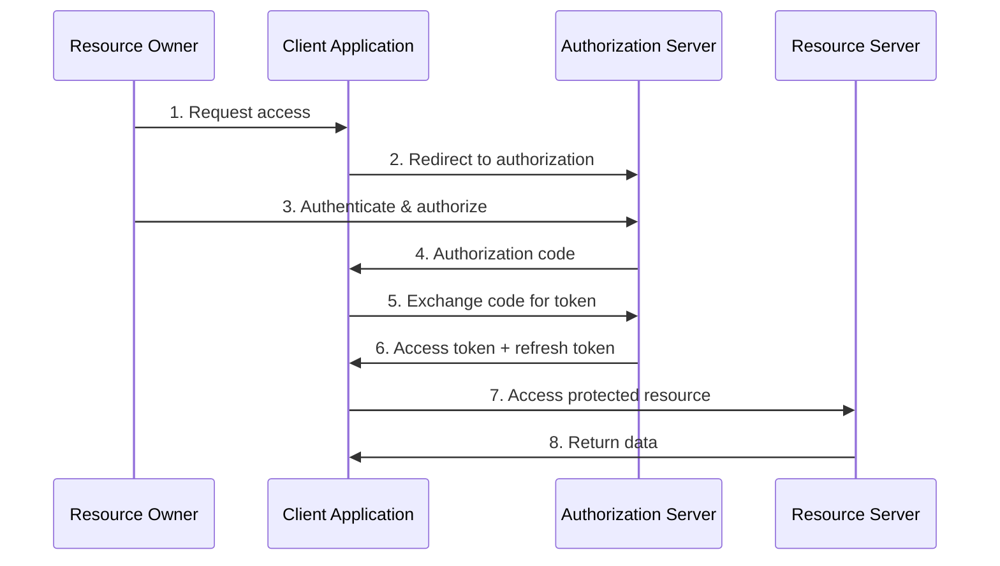

# OAuth 2.0 Implementation - Secure Authentication and Authorization

## Overview

OAuth 2.0 is an authorization framework that enables applications to obtain limited access to user accounts. It's widely used for secure authentication and authorization in modern web applications, especially in fintech and payment systems.

## Key Concepts

- **Authorization Server**: Issues access tokens
- **Resource Server**: Hosts protected resources
- **Client**: Application requesting access
- **Resource Owner**: User who owns the data
- **Access Token**: Credential used to access protected resources
- **Refresh Token**: Used to obtain new access tokens

## OAuth 2.0 Flow



## Go Implementation

```go
package main

import (
    "crypto/rand"
    "crypto/sha256"
    "encoding/base64"
    "encoding/json"
    "fmt"
    "log"
    "math/big"
    "net/http"
    "net/url"
    "strings"
    "time"
)

// OAuth2Config represents OAuth 2.0 configuration
type OAuth2Config struct {
    ClientID     string
    ClientSecret string
    RedirectURI  string
    AuthURL      string
    TokenURL     string
    Scope        string
}

// TokenResponse represents the token response
type TokenResponse struct {
    AccessToken  string `json:"access_token"`
    TokenType    string `json:"token_type"`
    ExpiresIn    int    `json:"expires_in"`
    RefreshToken string `json:"refresh_token"`
    Scope        string `json:"scope"`
}

// AuthorizationCode represents an authorization code
type AuthorizationCode struct {
    Code        string
    ClientID    string
    RedirectURI string
    Scope       string
    UserID      string
    ExpiresAt   time.Time
}

// AccessToken represents an access token
type AccessToken struct {
    Token     string
    ClientID  string
    UserID    string
    Scope     string
    ExpiresAt time.Time
}

// RefreshToken represents a refresh token
type RefreshToken struct {
    Token     string
    ClientID  string
    UserID    string
    Scope     string
    ExpiresAt time.Time
}

// User represents a user
type User struct {
    ID       string `json:"id"`
    Username string `json:"username"`
    Email    string `json:"email"`
    Name     string `json:"name"`
}

// OAuth2Server represents an OAuth 2.0 server
type OAuth2Server struct {
    config              OAuth2Config
    authorizationCodes  map[string]*AuthorizationCode
    accessTokens        map[string]*AccessToken
    refreshTokens       map[string]*RefreshToken
    users               map[string]*User
    clients             map[string]string // client_id -> client_secret
}

// NewOAuth2Server creates a new OAuth 2.0 server
func NewOAuth2Server(config OAuth2Config) *OAuth2Server {
    return &OAuth2Server{
        config:             config,
        authorizationCodes: make(map[string]*AuthorizationCode),
        accessTokens:       make(map[string]*AccessToken),
        refreshTokens:      make(map[string]*RefreshToken),
        users:              make(map[string]*User),
        clients:            make(map[string]string),
    }
}

// RegisterClient registers a new client
func (s *OAuth2Server) RegisterClient(clientID, clientSecret string) {
    s.clients[clientID] = clientSecret
}

// RegisterUser registers a new user
func (s *OAuth2Server) RegisterUser(user *User) {
    s.users[user.ID] = user
}

// generateRandomString generates a random string
func generateRandomString(length int) string {
    const charset = "ABCDEFGHIJKLMNOPQRSTUVWXYZabcdefghijklmnopqrstuvwxyz0123456789"
    b := make([]byte, length)
    for i := range b {
        num, _ := rand.Int(rand.Reader, big.NewInt(int64(len(charset))))
        b[i] = charset[num.Int64()]
    }
    return string(b)
}

// generateCodeChallenge generates PKCE code challenge
func generateCodeChallenge(codeVerifier string) string {
    hash := sha256.Sum256([]byte(codeVerifier))
    return base64.URLEncoding.WithPadding(base64.NoPadding).EncodeToString(hash[:])
}

// HandleAuthorization handles the authorization endpoint
func (s *OAuth2Server) HandleAuthorization(w http.ResponseWriter, r *http.Request) {
    // Parse query parameters
    clientID := r.URL.Query().Get("client_id")
    redirectURI := r.URL.Query().Get("redirect_uri")
    responseType := r.URL.Query().Get("response_type")
    scope := r.URL.Query().Get("scope")
    state := r.URL.Query().Get("state")
    codeChallenge := r.URL.Query().Get("code_challenge")
    codeChallengeMethod := r.URL.Query().Get("code_challenge_method")

    // Validate client
    if _, exists := s.clients[clientID]; !exists {
        http.Error(w, "Invalid client_id", http.StatusBadRequest)
        return
    }

    // Validate response type
    if responseType != "code" {
        http.Error(w, "Unsupported response_type", http.StatusBadRequest)
        return
    }

    // Check if user is authenticated (simplified)
    userID := r.Header.Get("X-User-ID")
    if userID == "" {
        // Redirect to login page
        loginURL := fmt.Sprintf("/login?redirect_uri=%s&state=%s", 
            url.QueryEscape(redirectURI), url.QueryEscape(state))
        http.Redirect(w, r, loginURL, http.StatusFound)
        return
    }

    // Generate authorization code
    code := generateRandomString(32)
    authCode := &AuthorizationCode{
        Code:        code,
        ClientID:    clientID,
        RedirectURI: redirectURI,
        Scope:       scope,
        UserID:      userID,
        ExpiresAt:   time.Now().Add(10 * time.Minute),
    }
    s.authorizationCodes[code] = authCode

    // Build redirect URI with authorization code
    redirectURL, _ := url.Parse(redirectURI)
    query := redirectURL.Query()
    query.Set("code", code)
    if state != "" {
        query.Set("state", state)
    }
    redirectURL.RawQuery = query.Encode()

    // Redirect to client with authorization code
    http.Redirect(w, r, redirectURL.String(), http.StatusFound)
}

// HandleToken handles the token endpoint
func (s *OAuth2Server) HandleToken(w http.ResponseWriter, r *http.Request) {
    // Parse form data
    if err := r.ParseForm(); err != nil {
        http.Error(w, "Invalid request", http.StatusBadRequest)
        return
    }

    grantType := r.FormValue("grant_type")
    clientID := r.FormValue("client_id")
    clientSecret := r.FormValue("client_secret")

    // Validate client credentials
    if secret, exists := s.clients[clientID]; !exists || secret != clientSecret {
        http.Error(w, "Invalid client credentials", http.StatusUnauthorized)
        return
    }

    switch grantType {
    case "authorization_code":
        s.handleAuthorizationCodeGrant(w, r)
    case "refresh_token":
        s.handleRefreshTokenGrant(w, r)
    case "client_credentials":
        s.handleClientCredentialsGrant(w, r)
    default:
        http.Error(w, "Unsupported grant_type", http.StatusBadRequest)
    }
}

// handleAuthorizationCodeGrant handles authorization code grant
func (s *OAuth2Server) handleAuthorizationCodeGrant(w http.ResponseWriter, r *http.Request) {
    code := r.FormValue("code")
    redirectURI := r.FormValue("redirect_uri")
    codeVerifier := r.FormValue("code_verifier")

    // Validate authorization code
    authCode, exists := s.authorizationCodes[code]
    if !exists {
        http.Error(w, "Invalid authorization code", http.StatusBadRequest)
        return
    }

    // Check expiration
    if time.Now().After(authCode.ExpiresAt) {
        delete(s.authorizationCodes, code)
        http.Error(w, "Authorization code expired", http.StatusBadRequest)
        return
    }

    // Validate redirect URI
    if authCode.RedirectURI != redirectURI {
        http.Error(w, "Invalid redirect_uri", http.StatusBadRequest)
        return
    }

    // Validate PKCE (if provided)
    if codeVerifier != "" {
        codeChallenge := generateCodeChallenge(codeVerifier)
        // In real implementation, store and validate code_challenge
    }

    // Generate access token
    accessToken := generateRandomString(32)
    refreshToken := generateRandomString(32)

    // Store tokens
    s.accessTokens[accessToken] = &AccessToken{
        Token:     accessToken,
        ClientID:  authCode.ClientID,
        UserID:    authCode.UserID,
        Scope:     authCode.Scope,
        ExpiresAt: time.Now().Add(1 * time.Hour),
    }

    s.refreshTokens[refreshToken] = &RefreshToken{
        Token:     refreshToken,
        ClientID:  authCode.ClientID,
        UserID:    authCode.UserID,
        Scope:     authCode.Scope,
        ExpiresAt: time.Now().Add(30 * 24 * time.Hour), // 30 days
    }

    // Delete authorization code (one-time use)
    delete(s.authorizationCodes, code)

    // Return token response
    response := TokenResponse{
        AccessToken:  accessToken,
        TokenType:    "Bearer",
        ExpiresIn:    3600, // 1 hour
        RefreshToken: refreshToken,
        Scope:        authCode.Scope,
    }

    w.Header().Set("Content-Type", "application/json")
    json.NewEncoder(w).Encode(response)
}

// handleRefreshTokenGrant handles refresh token grant
func (s *OAuth2Server) handleRefreshTokenGrant(w http.ResponseWriter, r *http.Request) {
    refreshToken := r.FormValue("refresh_token")

    // Validate refresh token
    token, exists := s.refreshTokens[refreshToken]
    if !exists {
        http.Error(w, "Invalid refresh token", http.StatusBadRequest)
        return
    }

    // Check expiration
    if time.Now().After(token.ExpiresAt) {
        delete(s.refreshTokens, refreshToken)
        http.Error(w, "Refresh token expired", http.StatusBadRequest)
        return
    }

    // Generate new access token
    newAccessToken := generateRandomString(32)
    s.accessTokens[newAccessToken] = &AccessToken{
        Token:     newAccessToken,
        ClientID:  token.ClientID,
        UserID:    token.UserID,
        Scope:     token.Scope,
        ExpiresAt: time.Now().Add(1 * time.Hour),
    }

    // Return token response
    response := TokenResponse{
        AccessToken: newAccessToken,
        TokenType:   "Bearer",
        ExpiresIn:   3600,
        Scope:       token.Scope,
    }

    w.Header().Set("Content-Type", "application/json")
    json.NewEncoder(w).Encode(response)
}

// handleClientCredentialsGrant handles client credentials grant
func (s *OAuth2Server) handleClientCredentialsGrant(w http.ResponseWriter, r *http.Request) {
    scope := r.FormValue("scope")

    // Generate access token for client
    accessToken := generateRandomString(32)
    s.accessTokens[accessToken] = &AccessToken{
        Token:     accessToken,
        ClientID:  r.FormValue("client_id"),
        UserID:    "", // No user for client credentials
        Scope:     scope,
        ExpiresAt: time.Now().Add(1 * time.Hour),
    }

    // Return token response
    response := TokenResponse{
        AccessToken: accessToken,
        TokenType:   "Bearer",
        ExpiresIn:   3600,
        Scope:       scope,
    }

    w.Header().Set("Content-Type", "application/json")
    json.NewEncoder(w).Encode(response)
}

// ValidateToken validates an access token
func (s *OAuth2Server) ValidateToken(token string) (*AccessToken, error) {
    accessToken, exists := s.accessTokens[token]
    if !exists {
        return nil, fmt.Errorf("invalid token")
    }

    // Check expiration
    if time.Now().After(accessToken.ExpiresAt) {
        delete(s.accessTokens, token)
        return nil, fmt.Errorf("token expired")
    }

    return accessToken, nil
}

// GetUserInfo returns user information for a valid token
func (s *OAuth2Server) GetUserInfo(token string) (*User, error) {
    accessToken, err := s.ValidateToken(token)
    if err != nil {
        return nil, err
    }

    user, exists := s.users[accessToken.UserID]
    if !exists {
        return nil, fmt.Errorf("user not found")
    }

    return user, nil
}

// HandleUserInfo handles the userinfo endpoint
func (s *OAuth2Server) HandleUserInfo(w http.ResponseWriter, r *http.Request) {
    // Get token from Authorization header
    authHeader := r.Header.Get("Authorization")
    if !strings.HasPrefix(authHeader, "Bearer ") {
        http.Error(w, "Invalid authorization header", http.StatusUnauthorized)
        return
    }

    token := strings.TrimPrefix(authHeader, "Bearer ")
    user, err := s.GetUserInfo(token)
    if err != nil {
        http.Error(w, "Invalid token", http.StatusUnauthorized)
        return
    }

    w.Header().Set("Content-Type", "application/json")
    json.NewEncoder(w).Encode(user)
}

// OAuth2Client represents an OAuth 2.0 client
type OAuth2Client struct {
    config     OAuth2Config
    httpClient *http.Client
}

// NewOAuth2Client creates a new OAuth 2.0 client
func NewOAuth2Client(config OAuth2Config) *OAuth2Client {
    return &OAuth2Client{
        config:     config,
        httpClient: &http.Client{Timeout: 30 * time.Second},
    }
}

// GetAuthorizationURL generates authorization URL
func (c *OAuth2Client) GetAuthorizationURL(state string) string {
    params := url.Values{}
    params.Set("response_type", "code")
    params.Set("client_id", c.config.ClientID)
    params.Set("redirect_uri", c.config.RedirectURI)
    params.Set("scope", c.config.Scope)
    params.Set("state", state)

    return c.config.AuthURL + "?" + params.Encode()
}

// ExchangeCodeForToken exchanges authorization code for access token
func (c *OAuth2Client) ExchangeCodeForToken(code string) (*TokenResponse, error) {
    data := url.Values{}
    data.Set("grant_type", "authorization_code")
    data.Set("code", code)
    data.Set("redirect_uri", c.config.RedirectURI)
    data.Set("client_id", c.config.ClientID)
    data.Set("client_secret", c.config.ClientSecret)

    resp, err := c.httpClient.PostForm(c.config.TokenURL, data)
    if err != nil {
        return nil, err
    }
    defer resp.Body.Close()

    if resp.StatusCode != http.StatusOK {
        return nil, fmt.Errorf("token exchange failed: %d", resp.StatusCode)
    }

    var tokenResp TokenResponse
    if err := json.NewDecoder(resp.Body).Decode(&tokenResp); err != nil {
        return nil, err
    }

    return &tokenResp, nil
}

// RefreshAccessToken refreshes an access token
func (c *OAuth2Client) RefreshAccessToken(refreshToken string) (*TokenResponse, error) {
    data := url.Values{}
    data.Set("grant_type", "refresh_token")
    data.Set("refresh_token", refreshToken)
    data.Set("client_id", c.config.ClientID)
    data.Set("client_secret", c.config.ClientSecret)

    resp, err := c.httpClient.PostForm(c.config.TokenURL, data)
    if err != nil {
        return nil, err
    }
    defer resp.Body.Close()

    if resp.StatusCode != http.StatusOK {
        return nil, fmt.Errorf("token refresh failed: %d", resp.StatusCode)
    }

    var tokenResp TokenResponse
    if err := json.NewDecoder(resp.Body).Decode(&tokenResp); err != nil {
        return nil, err
    }

    return &tokenResp, nil
}

// GetUserInfo gets user information using access token
func (c *OAuth2Client) GetUserInfo(accessToken string) (*User, error) {
    req, err := http.NewRequest("GET", c.config.AuthURL+"/userinfo", nil)
    if err != nil {
        return nil, err
    }

    req.Header.Set("Authorization", "Bearer "+accessToken)

    resp, err := c.httpClient.Do(req)
    if err != nil {
        return nil, err
    }
    defer resp.Body.Close()

    if resp.StatusCode != http.StatusOK {
        return nil, fmt.Errorf("userinfo request failed: %d", resp.StatusCode)
    }

    var user User
    if err := json.NewDecoder(resp.Body).Decode(&user); err != nil {
        return nil, err
    }

    return &user, nil
}

// Example usage
func main() {
    // Create OAuth 2.0 server
    serverConfig := OAuth2Config{
        ClientID:     "test-client",
        ClientSecret: "test-secret",
        RedirectURI:  "http://localhost:8080/callback",
        AuthURL:      "http://localhost:8080/oauth/authorize",
        TokenURL:     "http://localhost:8080/oauth/token",
        Scope:        "read write",
    }

    server := NewOAuth2Server(serverConfig)
    server.RegisterClient("test-client", "test-secret")
    server.RegisterUser(&User{
        ID:       "user1",
        Username: "john_doe",
        Email:    "john@example.com",
        Name:     "John Doe",
    })

    // Set up routes
    http.HandleFunc("/oauth/authorize", server.HandleAuthorization)
    http.HandleFunc("/oauth/token", server.HandleToken)
    http.HandleFunc("/oauth/userinfo", server.HandleUserInfo)

    // Start server
    go func() {
        log.Println("OAuth 2.0 server starting on :8080")
        log.Fatal(http.ListenAndServe(":8080", nil))
    }()

    // Wait for server to start
    time.Sleep(1 * time.Second)

    // Create OAuth 2.0 client
    client := NewOAuth2Client(serverConfig)

    // Generate authorization URL
    authURL := client.GetAuthorizationURL("random-state")
    fmt.Printf("Authorization URL: %s\n", authURL)

    // Simulate authorization code (in real app, user would be redirected)
    authCode := "simulated-auth-code"
    
    // Exchange code for token
    tokenResp, err := client.ExchangeCodeForToken(authCode)
    if err != nil {
        log.Printf("Token exchange failed: %v", err)
    } else {
        fmt.Printf("Access Token: %s\n", tokenResp.AccessToken)
        fmt.Printf("Refresh Token: %s\n", tokenResp.RefreshToken)
    }

    // Keep server running
    select {}
}
```

## OAuth 2.0 Grant Types

### 1. Authorization Code Grant
- **Use Case**: Web applications
- **Security**: Most secure
- **Flow**: User redirected to authorization server

### 2. Implicit Grant
- **Use Case**: Single-page applications
- **Security**: Less secure (no refresh token)
- **Flow**: Access token returned directly

### 3. Client Credentials Grant
- **Use Case**: Server-to-server communication
- **Security**: No user involved
- **Flow**: Client authenticates directly

### 4. Resource Owner Password Credentials Grant
- **Use Case**: Trusted applications
- **Security**: Least secure
- **Flow**: Client collects user credentials

### 5. Refresh Token Grant
- **Use Case**: Obtaining new access tokens
- **Security**: Extends session without re-authentication
- **Flow**: Exchange refresh token for new access token

## Security Best Practices

### 1. PKCE (Proof Key for Code Exchange)
- **Purpose**: Prevent authorization code interception
- **Implementation**: Code verifier and challenge
- **Use Case**: Mobile and single-page applications

### 2. State Parameter
- **Purpose**: Prevent CSRF attacks
- **Implementation**: Random state value
- **Use Case**: All authorization flows

### 3. Token Expiration
- **Purpose**: Limit token lifetime
- **Implementation**: Short-lived access tokens
- **Use Case**: All token types

### 4. Scope Limitation
- **Purpose**: Limit access to resources
- **Implementation**: Request only needed permissions
- **Use Case**: All authorization flows

### 5. HTTPS Only
- **Purpose**: Prevent token interception
- **Implementation**: Enforce HTTPS
- **Use Case**: All OAuth 2.0 communications

## Benefits

1. **Security**: Secure authentication and authorization
2. **Standardization**: Industry-standard protocol
3. **Flexibility**: Multiple grant types
4. **Scalability**: Works with distributed systems
5. **User Experience**: Single sign-on capabilities

## Common Pitfalls

1. **Insecure Storage**: Storing tokens in plain text
2. **Missing Validation**: Not validating tokens properly
3. **Scope Creep**: Requesting unnecessary permissions
4. **Token Leakage**: Exposing tokens in logs
5. **Insecure Redirects**: Not validating redirect URIs

## Interview Questions

1. **What is OAuth 2.0?**
   - Authorization framework for secure API access

2. **What are the main components?**
   - Authorization server, resource server, client, resource owner

3. **What's the difference between OAuth 2.0 and OAuth 1.0?**
   - OAuth 2.0 is simpler, more secure, and supports more use cases

4. **How do you secure OAuth 2.0?**
   - Use HTTPS, validate tokens, implement PKCE, use short-lived tokens

## Time Complexity

- **Token Generation**: O(1) for random generation
- **Token Validation**: O(1) for hash lookup
- **Authorization**: O(1) for code generation

## Space Complexity

- **Token Storage**: O(n) where n is number of active tokens
- **Code Storage**: O(m) where m is number of pending codes
- **User Data**: O(u) where u is number of users

The optimal solution uses:
1. **Secure Implementation**: Follow OAuth 2.0 security best practices
2. **Proper Validation**: Validate all tokens and parameters
3. **Token Management**: Implement proper token lifecycle
4. **Error Handling**: Handle all error scenarios gracefully
