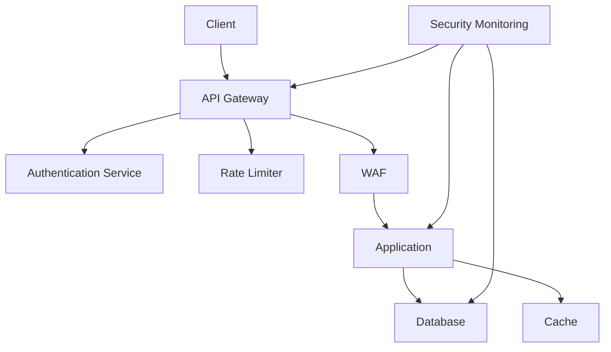
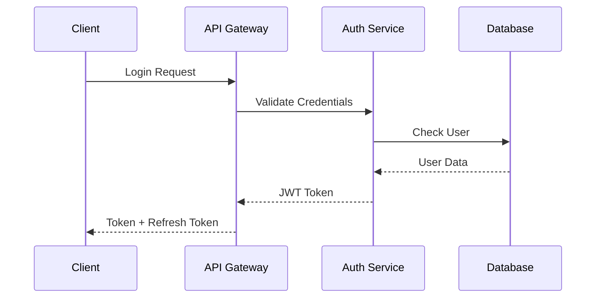

# 🔒 **Security Comprehensive Guide**

## 📘 **Theory**

Security is paramount in fintech and payment systems. A comprehensive security strategy protects sensitive data, ensures compliance, and maintains user trust.

### **Why Security Matters**

- **Data Protection**: Safeguard sensitive financial and personal data
- **Compliance**: Meet regulatory requirements (PCI DSS, GDPR, SOX)
- **Trust**: Maintain user confidence and business reputation
- **Financial Impact**: Prevent costly breaches and regulatory fines
- **Business Continuity**: Ensure uninterrupted service operations
- **Risk Management**: Identify and mitigate security threats

### **Key Concepts**

1. **Authentication**: Verifying user identity
2. **Authorization**: Controlling access to resources
3. **Encryption**: Protecting data at rest and in transit
4. **Security Headers**: HTTP security headers
5. **Input Validation**: Preventing injection attacks
6. **Rate Limiting**: Preventing abuse and DoS attacks
7. **Audit Logging**: Tracking security events
8. **Vulnerability Management**: Identifying and patching vulnerabilities

## 📊 **Diagrams**

### **Security Architecture**



### **Authentication Flow**



## 💻 **Implementation (Golang)**

### **JWT Authentication**

```go
package main

import (
    "crypto/rand"
    "encoding/hex"
    "fmt"
    "net/http"
    "time"

    "github.com/golang-jwt/jwt/v5"
    "golang.org/x/crypto/bcrypt"
)

// User represents a user
type User struct {
    ID       string `json:"id"`
    Username string `json:"username"`
    Email    string `json:"email"`
    Password string `json:"-"`
    Role     string `json:"role"`
}

// Claims represents JWT claims
type Claims struct {
    UserID   string `json:"user_id"`
    Username string `json:"username"`
    Role     string `json:"role"`
    jwt.RegisteredClaims
}

// AuthService handles authentication
type AuthService struct {
    jwtSecret []byte
    users     map[string]*User
}

// NewAuthService creates a new auth service
func NewAuthService() *AuthService {
    secret := make([]byte, 32)
    rand.Read(secret)
    
    return &AuthService{
        jwtSecret: secret,
        users:     make(map[string]*User),
    }
}

// HashPassword hashes a password
func (as *AuthService) HashPassword(password string) (string, error) {
    hash, err := bcrypt.GenerateFromPassword([]byte(password), bcrypt.DefaultCost)
    return string(hash), err
}

// VerifyPassword verifies a password
func (as *AuthService) VerifyPassword(hashedPassword, password string) error {
    return bcrypt.CompareHashAndPassword([]byte(hashedPassword), []byte(password))
}

// GenerateToken generates a JWT token
func (as *AuthService) GenerateToken(user *User) (string, error) {
    claims := Claims{
        UserID:   user.ID,
        Username: user.Username,
        Role:     user.Role,
        RegisteredClaims: jwt.RegisteredClaims{
            ExpiresAt: jwt.NewNumericDate(time.Now().Add(24 * time.Hour)),
            IssuedAt:  jwt.NewNumericDate(time.Now()),
            NotBefore: jwt.NewNumericDate(time.Now()),
        },
    }

    token := jwt.NewWithClaims(jwt.SigningMethodHS256, claims)
    return token.SignedString(as.jwtSecret)
}

// ValidateToken validates a JWT token
func (as *AuthService) ValidateToken(tokenString string) (*Claims, error) {
    token, err := jwt.ParseWithClaims(tokenString, &Claims{}, func(token *jwt.Token) (interface{}, error) {
        return as.jwtSecret, nil
    })

    if err != nil {
        return nil, err
    }

    if claims, ok := token.Claims.(*Claims); ok && token.Valid {
        return claims, nil
    }

    return nil, fmt.Errorf("invalid token")
}

// RegisterUser registers a new user
func (as *AuthService) RegisterUser(username, email, password, role string) (*User, error) {
    hashedPassword, err := as.HashPassword(password)
    if err != nil {
        return nil, err
    }

    user := &User{
        ID:       generateID(),
        Username: username,
        Email:    email,
        Password: hashedPassword,
        Role:     role,
    }

    as.users[user.ID] = user
    return user, nil
}

// LoginUser authenticates a user
func (as *AuthService) LoginUser(username, password string) (*User, string, error) {
    // Find user by username
    var user *User
    for _, u := range as.users {
        if u.Username == username {
            user = u
            break
        }
    }

    if user == nil {
        return nil, "", fmt.Errorf("user not found")
    }

    // Verify password
    if err := as.VerifyPassword(user.Password, password); err != nil {
        return nil, "", fmt.Errorf("invalid password")
    }

    // Generate token
    token, err := as.GenerateToken(user)
    if err != nil {
        return nil, "", err
    }

    return user, token, nil
}

// generateID generates a random ID
func generateID() string {
    bytes := make([]byte, 16)
    rand.Read(bytes)
    return hex.EncodeToString(bytes)
}

// AuthMiddleware validates JWT tokens
func AuthMiddleware(authService *AuthService) func(http.Handler) http.Handler {
    return func(next http.Handler) http.Handler {
        return http.HandlerFunc(func(w http.ResponseWriter, r *http.Request) {
            token := r.Header.Get("Authorization")
            if token == "" {
                http.Error(w, "Authorization header required", http.StatusUnauthorized)
                return
            }

            // Remove "Bearer " prefix
            if len(token) > 7 && token[:7] == "Bearer " {
                token = token[7:]
            }

            claims, err := authService.ValidateToken(token)
            if err != nil {
                http.Error(w, "Invalid token", http.StatusUnauthorized)
                return
            }

            // Add user info to context
            ctx := context.WithValue(r.Context(), "user_id", claims.UserID)
            ctx = context.WithValue(ctx, "username", claims.Username)
            ctx = context.WithValue(ctx, "role", claims.Role)

            next.ServeHTTP(w, r.WithContext(ctx))
        })
    }
}

// RoleMiddleware checks user roles
func RoleMiddleware(requiredRole string) func(http.Handler) http.Handler {
    return func(next http.Handler) http.Handler {
        return http.HandlerFunc(func(w http.ResponseWriter, r *http.Request) {
            userRole := r.Context().Value("role").(string)
            if userRole != requiredRole {
                http.Error(w, "Insufficient permissions", http.StatusForbidden)
                return
            }
            next.ServeHTTP(w, r)
        })
    }
}

func main() {
    authService := NewAuthService()

    // Register test user
    user, err := authService.RegisterUser("admin", "admin@example.com", "password123", "admin")
    if err != nil {
        log.Fatal(err)
    }

    mux := http.NewServeMux()

    // Public endpoints
    mux.HandleFunc("/login", func(w http.ResponseWriter, r *http.Request) {
        if r.Method != http.MethodPost {
            http.Error(w, "Method not allowed", http.StatusMethodNotAllowed)
            return
        }

        var loginReq struct {
            Username string `json:"username"`
            Password string `json:"password"`
        }

        if err := json.NewDecoder(r.Body).Decode(&loginReq); err != nil {
            http.Error(w, "Invalid JSON", http.StatusBadRequest)
            return
        }

        user, token, err := authService.LoginUser(loginReq.Username, loginReq.Password)
        if err != nil {
            http.Error(w, "Invalid credentials", http.StatusUnauthorized)
            return
        }

        w.Header().Set("Content-Type", "application/json")
        json.NewEncoder(w).Encode(map[string]interface{}{
            "user":  user,
            "token": token,
        })
    })

    // Protected endpoints
    mux.Handle("/protected", AuthMiddleware(authService)(http.HandlerFunc(func(w http.ResponseWriter, r *http.Request) {
        userID := r.Context().Value("user_id").(string)
        w.Header().Set("Content-Type", "application/json")
        json.NewEncoder(w).Encode(map[string]string{
            "message": "Access granted",
            "user_id": userID,
        })
    })))

    // Admin only endpoint
    mux.Handle("/admin", AuthMiddleware(authService)(RoleMiddleware("admin")(http.HandlerFunc(func(w http.ResponseWriter, r *http.Request) {
        w.Header().Set("Content-Type", "application/json")
        json.NewEncoder(w).Encode(map[string]string{
            "message": "Admin access granted",
        })
    }))))

    log.Println("Server starting on :8080")
    log.Fatal(http.ListenAndServe(":8080", mux))
}
```

### **Rate Limiting**

```go
package main

import (
    "context"
    "fmt"
    "net/http"
    "sync"
    "time"

    "golang.org/x/time/rate"
)

// RateLimiter handles rate limiting
type RateLimiter struct {
    limiters map[string]*rate.Limiter
    mu       sync.RWMutex
    rate     rate.Limit
    burst    int
}

// NewRateLimiter creates a new rate limiter
func NewRateLimiter(rate rate.Limit, burst int) *RateLimiter {
    return &RateLimiter{
        limiters: make(map[string]*rate.Limiter),
        rate:     rate,
        burst:    burst,
    }
}

// GetLimiter gets or creates a limiter for a key
func (rl *RateLimiter) GetLimiter(key string) *rate.Limiter {
    rl.mu.Lock()
    defer rl.mu.Unlock()

    limiter, exists := rl.limiters[key]
    if !exists {
        limiter = rate.NewLimiter(rl.rate, rl.burst)
        rl.limiters[key] = limiter
    }

    return limiter
}

// Allow checks if a request is allowed
func (rl *RateLimiter) Allow(key string) bool {
    limiter := rl.GetLimiter(key)
    return limiter.Allow()
}

// RateLimitMiddleware implements rate limiting
func RateLimitMiddleware(limiter *RateLimiter) func(http.Handler) http.Handler {
    return func(next http.Handler) http.Handler {
        return http.HandlerFunc(func(w http.ResponseWriter, r *http.Request) {
            // Get client IP
            clientIP := r.RemoteAddr
            if forwarded := r.Header.Get("X-Forwarded-For"); forwarded != "" {
                clientIP = forwarded
            }

            // Check rate limit
            if !limiter.Allow(clientIP) {
                http.Error(w, "Rate limit exceeded", http.StatusTooManyRequests)
                return
            }

            next.ServeHTTP(w, r)
        })
    }
}

func main() {
    // Create rate limiter: 10 requests per second, burst of 20
    limiter := NewRateLimiter(10, 20)

    mux := http.NewServeMux()
    mux.HandleFunc("/api", func(w http.ResponseWriter, r *http.Request) {
        w.Header().Set("Content-Type", "application/json")
        json.NewEncoder(w).Encode(map[string]string{
            "message": "API response",
            "time":    time.Now().Format(time.RFC3339),
        })
    })

    // Apply rate limiting
    handler := RateLimitMiddleware(limiter)(mux)

    log.Println("Server starting on :8080")
    log.Fatal(http.ListenAndServe(":8080", handler))
}
```

### **Input Validation & Sanitization**

```go
package main

import (
    "net/http"
    "regexp"
    "strings"
)

// Validator handles input validation
type Validator struct {
    emailRegex *regexp.Regexp
}

// NewValidator creates a new validator
func NewValidator() *Validator {
    emailRegex := regexp.MustCompile(`^[a-zA-Z0-9._%+-]+@[a-zA-Z0-9.-]+\.[a-zA-Z]{2,}$`)
    return &Validator{
        emailRegex: emailRegex,
    }
}

// ValidateEmail validates email format
func (v *Validator) ValidateEmail(email string) error {
    if !v.emailRegex.MatchString(email) {
        return fmt.Errorf("invalid email format")
    }
    return nil
}

// SanitizeString sanitizes a string
func (v *Validator) SanitizeString(input string) string {
    // Remove potentially dangerous characters
    input = strings.TrimSpace(input)
    input = strings.ReplaceAll(input, "<", "&lt;")
    input = strings.ReplaceAll(input, ">", "&gt;")
    input = strings.ReplaceAll(input, "\"", "&quot;")
    input = strings.ReplaceAll(input, "'", "&#x27;")
    input = strings.ReplaceAll(input, "&", "&amp;")
    return input
}

// ValidatePayment validates payment data
func (v *Validator) ValidatePayment(payment map[string]interface{}) error {
    // Validate amount
    if amount, ok := payment["amount"].(float64); !ok || amount <= 0 {
        return fmt.Errorf("invalid amount")
    }

    // Validate currency
    if currency, ok := payment["currency"].(string); !ok || len(currency) != 3 {
        return fmt.Errorf("invalid currency")
    }

    // Validate user ID
    if userID, ok := payment["user_id"].(string); !ok || len(userID) == 0 {
        return fmt.Errorf("invalid user ID")
    }

    return nil
}

// ValidationMiddleware validates request data
func ValidationMiddleware(validator *Validator) func(http.Handler) http.Handler {
    return func(next http.Handler) http.Handler {
        return http.HandlerFunc(func(w http.ResponseWriter, r *http.Request) {
            // Parse and validate JSON
            var data map[string]interface{}
            if err := json.NewDecoder(r.Body).Decode(&data); err != nil {
                http.Error(w, "Invalid JSON", http.StatusBadRequest)
                return
            }

            // Validate payment data
            if err := validator.ValidatePayment(data); err != nil {
                http.Error(w, err.Error(), http.StatusBadRequest)
                return
            }

            // Sanitize string inputs
            for key, value := range data {
                if str, ok := value.(string); ok {
                    data[key] = validator.SanitizeString(str)
                }
            }

            // Add validated data to context
            ctx := context.WithValue(r.Context(), "validated_data", data)
            next.ServeHTTP(w, r.WithContext(ctx))
        })
    }
}
```

## 💻 **Implementation (Node.js)**

```javascript
const express = require('express');
const jwt = require('jsonwebtoken');
const bcrypt = require('bcrypt');
const rateLimit = require('express-rate-limit');
const helmet = require('helmet');
const cors = require('cors');
const validator = require('validator');

// Security middleware
app.use(helmet());
app.use(cors({
  origin: process.env.ALLOWED_ORIGINS?.split(',') || ['http://localhost:3000'],
  credentials: true
}));

// Rate limiting
const limiter = rateLimit({
  windowMs: 15 * 60 * 1000, // 15 minutes
  max: 100, // limit each IP to 100 requests per windowMs
  message: 'Too many requests from this IP'
});
app.use('/api/', limiter);

// JWT authentication
const authenticateToken = (req, res, next) => {
  const authHeader = req.headers['authorization'];
  const token = authHeader && authHeader.split(' ')[1];

  if (!token) {
    return res.status(401).json({ error: 'Access token required' });
  }

  jwt.verify(token, process.env.JWT_SECRET, (err, user) => {
    if (err) {
      return res.status(403).json({ error: 'Invalid token' });
    }
    req.user = user;
    next();
  });
};

// Input validation
const validatePayment = (req, res, next) => {
  const { amount, currency, userId } = req.body;

  if (!amount || amount <= 0) {
    return res.status(400).json({ error: 'Invalid amount' });
  }

  if (!currency || !validator.isLength(currency, { min: 3, max: 3 })) {
    return res.status(400).json({ error: 'Invalid currency' });
  }

  if (!userId || !validator.isUUID(userId)) {
    return res.status(400).json({ error: 'Invalid user ID' });
  }

  next();
};

// Routes
app.post('/api/payments', authenticateToken, validatePayment, (req, res) => {
  // Process payment
  res.json({ status: 'success' });
});
```

## ⏱ **Complexity Analysis**

- **Authentication**: O(1) for token validation
- **Authorization**: O(1) for role checking
- **Encryption**: O(n) where n is data size
- **Rate Limiting**: O(1) for rate limit checks

## 🚀 **Best Practices**

1. **Use HTTPS**: Encrypt all communications
2. **Implement Proper Authentication**: JWT with secure secrets
3. **Role-Based Access Control**: Granular permissions
4. **Input Validation**: Sanitize all inputs
5. **Rate Limiting**: Prevent abuse
6. **Security Headers**: Use security headers
7. **Audit Logging**: Track security events
8. **Regular Updates**: Keep dependencies updated

## ❓ **Follow-up Questions**

### **How would this scale with X users?**

- **Authentication**: Use stateless JWT tokens
- **Rate Limiting**: Use Redis for distributed rate limiting
- **Authorization**: Cache permissions and roles
- **Encryption**: Use hardware security modules for key management

### **How can we optimize further if Y changes?**

- **Performance**: Use caching for authentication checks
- **Security**: Implement multi-factor authentication
- **Compliance**: Add audit trails and compliance reporting
- **Monitoring**: Implement security event monitoring
