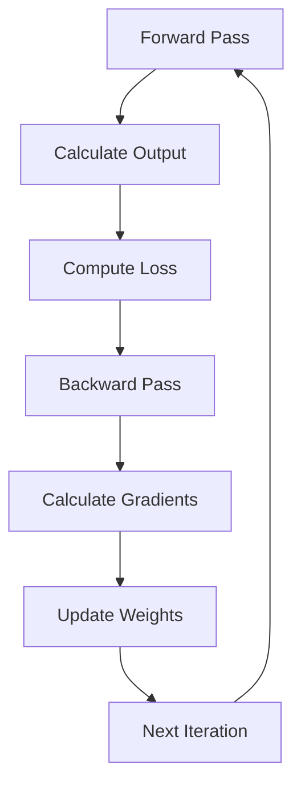

---
# Auto-generated front matter
Title: Backpropagation
LastUpdated: 2025-11-06T20:45:58.320887
Tags: []
Status: draft
---

# Backpropagation - Neural Network Training Algorithm

## Overview

Backpropagation is the core algorithm for training neural networks. It efficiently computes gradients by propagating errors backward through the network, enabling the network to learn from data.

## Key Concepts

- **Gradient Descent**: Optimization algorithm
- **Chain Rule**: Mathematical foundation
- **Error Propagation**: Backward flow of errors
- **Weight Updates**: Adjusting connection strengths
- **Learning Rate**: Step size for updates
- **Loss Function**: Measures prediction error

## Backpropagation Process



## Go Implementation

```go
package main

import (
    "fmt"
    "math"
    "math/rand"
    "time"
)

// LossFunction represents a loss function
type LossFunction func([]float64, []float64) float64

// LossDerivative represents the derivative of a loss function
type LossDerivative func([]float64, []float64) []float64

// MeanSquaredError calculates mean squared error
func MeanSquaredError(predictions, targets []float64) float64 {
    if len(predictions) != len(targets) {
        panic("predictions and targets must have same length")
    }
    
    sum := 0.0
    for i := range predictions {
        diff := predictions[i] - targets[i]
        sum += diff * diff
    }
    return sum / float64(len(predictions))
}

// MeanSquaredErrorDerivative calculates derivative of MSE
func MeanSquaredErrorDerivative(predictions, targets []float64) []float64 {
    if len(predictions) != len(targets) {
        panic("predictions and targets must have same length")
    }
    
    derivatives := make([]float64, len(predictions))
    for i := range predictions {
        derivatives[i] = 2.0 * (predictions[i] - targets[i]) / float64(len(predictions))
    }
    return derivatives
}

// CrossEntropyLoss calculates cross-entropy loss
func CrossEntropyLoss(predictions, targets []float64) float64 {
    if len(predictions) != len(targets) {
        panic("predictions and targets must have same length")
    }
    
    sum := 0.0
    for i := range predictions {
        // Add small epsilon to prevent log(0)
        pred := math.Max(predictions[i], 1e-15)
        sum += targets[i] * math.Log(pred)
    }
    return -sum
}

// CrossEntropyLossDerivative calculates derivative of cross-entropy
func CrossEntropyLossDerivative(predictions, targets []float64) []float64 {
    if len(predictions) != len(targets) {
        panic("predictions and targets must have same length")
    }
    
    derivatives := make([]float64, len(predictions))
    for i := range predictions {
        // Add small epsilon to prevent division by zero
        pred := math.Max(predictions[i], 1e-15)
        derivatives[i] = -targets[i] / pred
    }
    return derivatives
}

// Neuron represents a single neuron
type Neuron struct {
    Weights []float64
    Bias    float64
    Output  float64
    Delta   float64
    Inputs  []float64
}

// NewNeuron creates a new neuron
func NewNeuron(inputSize int) *Neuron {
    weights := make([]float64, inputSize)
    for i := range weights {
        weights[i] = rand.Float64()*2 - 1 // Random weight between -1 and 1
    }
    
    return &Neuron{
        Weights: weights,
        Bias:    rand.Float64()*2 - 1,
        Output:  0,
        Delta:   0,
        Inputs:  make([]float64, inputSize),
    }
}

// Forward computes the forward pass
func (n *Neuron) Forward(inputs []float64, activation ActivationFunction) float64 {
    copy(n.Inputs, inputs)
    
    sum := n.Bias
    for i, input := range inputs {
        sum += n.Weights[i] * input
    }
    n.Output = activation(sum)
    return n.Output
}

// Layer represents a layer of neurons
type Layer struct {
    Neurons []*Neuron
    Size    int
}

// NewLayer creates a new layer
func NewLayer(size, inputSize int) *Layer {
    neurons := make([]*Neuron, size)
    for i := range neurons {
        neurons[i] = NewNeuron(inputSize)
    }
    
    return &Layer{
        Neurons: neurons,
        Size:    size,
    }
}

// Forward computes the forward pass for the layer
func (l *Layer) Forward(inputs []float64, activation ActivationFunction) []float64 {
    outputs := make([]float64, l.Size)
    for i, neuron := range l.Neurons {
        outputs[i] = neuron.Forward(inputs, activation)
    }
    return outputs
}

// NeuralNetwork represents a neural network with backpropagation
type NeuralNetwork struct {
    Layers           []*Layer
    ActivationFunc   ActivationFunction
    ActivationDeriv  ActivationDerivative
    LossFunc         LossFunction
    LossDeriv        LossDerivative
    LearningRate     float64
    InputSize        int
    OutputSize       int
}

// NewNeuralNetwork creates a new neural network
func NewNeuralNetwork(inputSize, outputSize int, hiddenSizes []int, learningRate float64) *NeuralNetwork {
    layers := make([]*Layer, 0)
    
    currentSize := inputSize
    
    // Hidden layers
    for _, size := range hiddenSizes {
        layer := NewLayer(size, currentSize)
        layers = append(layers, layer)
        currentSize = size
    }
    
    // Output layer
    outputLayer := NewLayer(outputSize, currentSize)
    layers = append(layers, outputLayer)
    
    return &NeuralNetwork{
        Layers:          layers,
        ActivationFunc:  Sigmoid,
        ActivationDeriv: SigmoidDerivative,
        LossFunc:        MeanSquaredError,
        LossDeriv:       MeanSquaredErrorDerivative,
        LearningRate:    learningRate,
        InputSize:       inputSize,
        OutputSize:      outputSize,
    }
}

// Forward computes the forward pass for the entire network
func (nn *NeuralNetwork) Forward(inputs []float64) []float64 {
    currentInputs := inputs
    
    for _, layer := range nn.Layers {
        currentInputs = layer.Forward(currentInputs, nn.ActivationFunc)
    }
    
    return currentInputs
}

// Backward computes the backward pass for training
func (nn *NeuralNetwork) Backward(inputs []float64, targets []float64) {
    // Forward pass
    outputs := nn.Forward(inputs)
    
    // Calculate output layer deltas
    outputLayer := nn.Layers[len(nn.Layers)-1]
    lossDerivatives := nn.LossDeriv(outputs, targets)
    
    for i, neuron := range outputLayer.Neurons {
        neuron.Delta = lossDerivatives[i] * nn.ActivationDeriv(neuron.Output)
    }
    
    // Calculate hidden layer deltas (backpropagation)
    for layerIdx := len(nn.Layers) - 2; layerIdx >= 0; layerIdx-- {
        currentLayer := nn.Layers[layerIdx]
        nextLayer := nn.Layers[layerIdx+1]
        
        for i, neuron := range currentLayer.Neurons {
            error := 0.0
            for _, nextNeuron := range nextLayer.Neurons {
                error += nextNeuron.Weights[i] * nextNeuron.Delta
            }
            neuron.Delta = error * nn.ActivationDeriv(neuron.Output)
        }
    }
    
    // Update weights and biases
    nn.updateWeights(inputs)
}

// updateWeights updates the weights and biases
func (nn *NeuralNetwork) updateWeights(inputs []float64) {
    currentInputs := inputs
    
    for _, layer := range nn.Layers {
        for _, neuron := range layer.Neurons {
            // Update weights
            for i, input := range currentInputs {
                neuron.Weights[i] += nn.LearningRate * neuron.Delta * input
            }
            
            // Update bias
            neuron.Bias += nn.LearningRate * neuron.Delta
        }
        
        // Update inputs for next layer
        currentInputs = make([]float64, layer.Size)
        for i, neuron := range layer.Neurons {
            currentInputs[i] = neuron.Output
        }
    }
}

// Train trains the neural network
func (nn *NeuralNetwork) Train(inputs [][]float64, targets [][]float64, epochs int) {
    for epoch := 0; epoch < epochs; epoch++ {
        totalError := 0.0
        
        for i, input := range inputs {
            nn.Backward(input, targets[i])
            
            // Calculate error for monitoring
            outputs := nn.Forward(input)
            error := nn.LossFunc(outputs, targets[i])
            totalError += error
        }
        
        if epoch%1000 == 0 {
            avgError := totalError / float64(len(inputs))
            fmt.Printf("Epoch %d, Average Error: %.6f\n", epoch, avgError)
        }
    }
}

// Predict makes a prediction
func (nn *NeuralNetwork) Predict(inputs []float64) []float64 {
    return nn.Forward(inputs)
}

// CalculateGradients calculates gradients for a single example
func (nn *NeuralNetwork) CalculateGradients(inputs []float64, targets []float64) map[string][]float64 {
    // Forward pass
    outputs := nn.Forward(inputs)
    
    // Calculate output layer deltas
    outputLayer := nn.Layers[len(nn.Layers)-1]
    lossDerivatives := nn.LossDeriv(outputs, targets)
    
    for i, neuron := range outputLayer.Neurons {
        neuron.Delta = lossDerivatives[i] * nn.ActivationDeriv(neuron.Output)
    }
    
    // Calculate hidden layer deltas
    for layerIdx := len(nn.Layers) - 2; layerIdx >= 0; layerIdx-- {
        currentLayer := nn.Layers[layerIdx]
        nextLayer := nn.Layers[layerIdx+1]
        
        for i, neuron := range currentLayer.Neurons {
            error := 0.0
            for _, nextNeuron := range nextLayer.Neurons {
                error += nextNeuron.Weights[i] * nextNeuron.Delta
            }
            neuron.Delta = error * nn.ActivationDeriv(neuron.Output)
        }
    }
    
    // Calculate gradients
    gradients := make(map[string][]float64)
    currentInputs := inputs
    
    for layerIdx, layer := range nn.Layers {
        layerGradients := make([]float64, 0)
        
        for _, neuron := range layer.Neurons {
            // Weight gradients
            for _, input := range currentInputs {
                layerGradients = append(layerGradients, neuron.Delta*input)
            }
            // Bias gradient
            layerGradients = append(layerGradients, neuron.Delta)
        }
        
        gradients[fmt.Sprintf("layer_%d", layerIdx)] = layerGradients
        
        // Update inputs for next layer
        currentInputs = make([]float64, layer.Size)
        for i, neuron := range layer.Neurons {
            currentInputs[i] = neuron.Output
        }
    }
    
    return gradients
}

// GradientChecking verifies gradients using numerical approximation
func (nn *NeuralNetwork) GradientChecking(inputs []float64, targets []float64, epsilon float64) bool {
    // Calculate analytical gradients
    analyticalGradients := nn.CalculateGradients(inputs, targets)
    
    // Calculate numerical gradients
    numericalGradients := make(map[string][]float64)
    
    currentInputs := inputs
    for layerIdx, layer := range nn.Layers {
        layerGradients := make([]float64, 0)
        
        for _, neuron := range layer.Neurons {
            // Weight gradients
            for i, input := range currentInputs {
                // Calculate numerical gradient
                originalWeight := neuron.Weights[i]
                
                // Forward pass with weight + epsilon
                neuron.Weights[i] = originalWeight + epsilon
                outputs1 := nn.Forward(inputs)
                loss1 := nn.LossFunc(outputs1, targets)
                
                // Forward pass with weight - epsilon
                neuron.Weights[i] = originalWeight - epsilon
                outputs2 := nn.Forward(inputs)
                loss2 := nn.LossFunc(outputs2, targets)
                
                // Numerical gradient
                numericalGrad := (loss1 - loss2) / (2 * epsilon)
                layerGradients = append(layerGradients, numericalGrad)
                
                // Restore original weight
                neuron.Weights[i] = originalWeight
            }
            
            // Bias gradient
            originalBias := neuron.Bias
            
            neuron.Bias = originalBias + epsilon
            outputs1 := nn.Forward(inputs)
            loss1 := nn.LossFunc(outputs1, targets)
            
            neuron.Bias = originalBias - epsilon
            outputs2 := nn.Forward(inputs)
            loss2 := nn.LossFunc(outputs2, targets)
            
            numericalGrad := (loss1 - loss2) / (2 * epsilon)
            layerGradients = append(layerGradients, numericalGrad)
            
            neuron.Bias = originalBias
        }
        
        numericalGradients[fmt.Sprintf("layer_%d", layerIdx)] = layerGradients
        
        // Update inputs for next layer
        currentInputs = make([]float64, layer.Size)
        for i, neuron := range layer.Neurons {
            currentInputs[i] = neuron.Output
        }
    }
    
    // Compare gradients
    for layerName, analyticalGrads := range analyticalGradients {
        numericalGrads := numericalGradients[layerName]
        
        if len(analyticalGrads) != len(numericalGrads) {
            return false
        }
        
        for i, analyticalGrad := range analyticalGrads {
            numericalGrad := numericalGrads[i]
            diff := math.Abs(analyticalGrad - numericalGrad)
            
            if diff > 1e-7 {
                fmt.Printf("Gradient mismatch at %s[%d]: analytical=%.6f, numerical=%.6f, diff=%.6f\n",
                    layerName, i, analyticalGrad, numericalGrad, diff)
                return false
            }
        }
    }
    
    return true
}

// Example usage
func main() {
    // Set random seed
    rand.Seed(time.Now().UnixNano())
    
    // Create neural network
    nn := NewNeuralNetwork(2, 1, []int{4, 3}, 0.1)
    
    // XOR training data
    inputs := [][]float64{
        {0, 0},
        {0, 1},
        {1, 0},
        {1, 1},
    }
    
    targets := [][]float64{
        {0},
        {1},
        {1},
        {0},
    }
    
    fmt.Println("Training XOR neural network with backpropagation...")
    nn.Train(inputs, targets, 10000)
    
    fmt.Println("\nTesting XOR neural network:")
    for i, input := range inputs {
        prediction := nn.Predict(input)
        fmt.Printf("Input: [%.0f, %.0f], Target: %.0f, Prediction: %.6f\n",
            input[0], input[1], targets[i][0], prediction[0])
    }
    
    // Test gradient checking
    fmt.Println("\nTesting gradient checking...")
    if nn.GradientChecking(inputs[0], targets[0], 1e-5) {
        fmt.Println("Gradient checking passed!")
    } else {
        fmt.Println("Gradient checking failed!")
    }
    
    // Test with different loss functions
    fmt.Println("\nTesting with Cross-Entropy Loss:")
    nn.LossFunc = CrossEntropyLoss
    nn.LossDeriv = CrossEntropyLossDerivative
    
    nn.Train(inputs, targets, 5000)
    
    fmt.Println("Testing with Cross-Entropy Loss:")
    for i, input := range inputs {
        prediction := nn.Predict(input)
        fmt.Printf("Input: [%.0f, %.0f], Target: %.0f, Prediction: %.6f\n",
            input[0], input[1], targets[i][0], prediction[0])
    }
}
```

## Mathematical Foundation

### 1. Chain Rule
The chain rule is the mathematical foundation of backpropagation:
```
∂L/∂w = ∂L/∂y * ∂y/∂z * ∂z/∂w
```

### 2. Gradient Descent
Weight updates using gradient descent:
```
w_new = w_old - learning_rate * ∂L/∂w
```

### 3. Error Propagation
Errors are propagated backward through the network:
```
δ_j = f'(z_j) * Σ(δ_k * w_jk)
```

## Optimization Techniques

### 1. Momentum
Adds momentum to weight updates:
```
v = βv + α∇w
w = w - v
```

### 2. Adam
Adaptive learning rate optimization:
```
m = β₁m + (1-β₁)∇w
v = β₂v + (1-β₂)(∇w)²
w = w - α * m / (√v + ε)
```

### 3. Learning Rate Scheduling
Adjust learning rate during training:
- Step decay
- Exponential decay
- Cosine annealing

## Benefits

1. **Efficient**: Computes all gradients in one pass
2. **Scalable**: Works with large networks
3. **Flexible**: Works with any differentiable function
4. **Automatic**: No manual gradient calculation
5. **Proven**: Widely used and tested

## Trade-offs

1. **Vanishing Gradients**: Gradients can become very small
2. **Exploding Gradients**: Gradients can become very large
3. **Local Minima**: Can get stuck in local minima
4. **Computational**: Requires forward and backward passes
5. **Memory**: Stores intermediate values

## Use Cases

- **Supervised Learning**: Classification and regression
- **Deep Learning**: Training deep networks
- **Computer Vision**: Image recognition
- **Natural Language Processing**: Text analysis
- **Time Series**: Forecasting

## Best Practices

1. **Gradient Checking**: Verify gradients numerically
2. **Learning Rate**: Choose appropriate learning rate
3. **Initialization**: Use proper weight initialization
4. **Regularization**: Prevent overfitting
5. **Monitoring**: Track training progress

## Common Pitfalls

1. **Vanishing Gradients**: Use ReLU or LSTM
2. **Exploding Gradients**: Use gradient clipping
3. **Poor Initialization**: Use Xavier or He initialization
4. **Learning Rate**: Too high or too low
5. **Overfitting**: Use dropout or regularization

## Interview Questions

1. **What is backpropagation?**
   - Algorithm for training neural networks by propagating errors backward

2. **How does it work?**
   - Uses chain rule to calculate gradients and update weights

3. **What is the chain rule?**
   - Mathematical rule for calculating derivatives of composite functions

4. **What are vanishing gradients?**
   - Problem where gradients become very small in deep networks

## Time Complexity

- **Forward Pass**: O(n) where n is number of connections
- **Backward Pass**: O(n) where n is number of connections
- **Training**: O(n * epochs) where n is number of connections

## Space Complexity

- **Memory**: O(n) where n is number of parameters
- **Gradients**: O(n) where n is number of parameters

The optimal solution uses:
1. **Proper Implementation**: Correct chain rule application
2. **Gradient Checking**: Verify gradients numerically
3. **Optimization**: Use appropriate optimization techniques
4. **Monitoring**: Track training progress and performance
