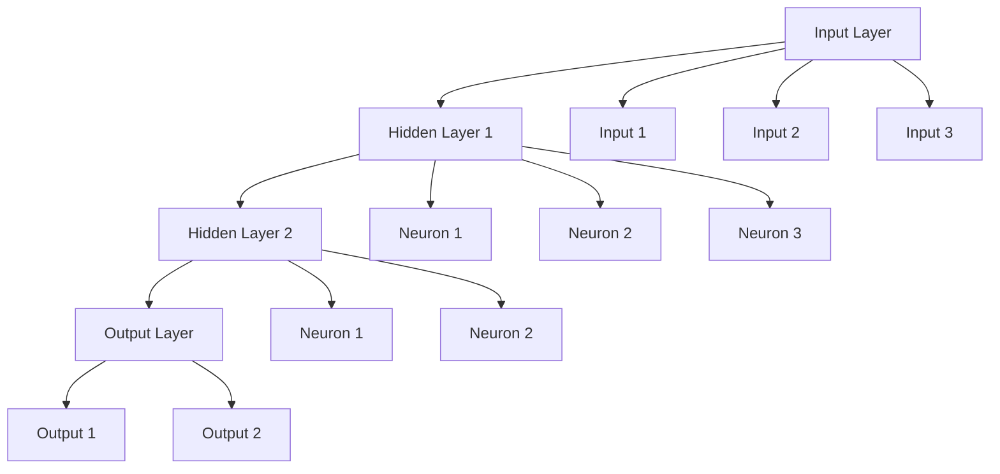

---
# Auto-generated front matter
Title: Neural Networks
LastUpdated: 2025-11-06T20:45:58.320579
Tags: []
Status: draft
---

# Neural Networks - Deep Learning Fundamentals

## Overview

Neural networks are computing systems inspired by biological neural networks. They consist of interconnected nodes (neurons) that process information and learn patterns from data through training.

## Key Concepts

- **Neuron**: Basic processing unit
- **Layer**: Collection of neurons
- **Weight**: Connection strength between neurons
- **Bias**: Additional parameter for each neuron
- **Activation Function**: Non-linear function applied to neuron output
- **Forward Propagation**: Data flow from input to output
- **Backpropagation**: Error propagation for weight updates

## Neural Network Architecture



## Go Implementation

```go
package main

import (
    "fmt"
    "math"
    "math/rand"
    "time"
)

// ActivationFunction represents an activation function
type ActivationFunction func(float64) float64

// ActivationDerivative represents the derivative of an activation function
type ActivationDerivative func(float64) float64

// Sigmoid activation function
func Sigmoid(x float64) float64 {
    return 1.0 / (1.0 + math.Exp(-x))
}

// SigmoidDerivative derivative of sigmoid
func SigmoidDerivative(x float64) float64 {
    s := Sigmoid(x)
    return s * (1.0 - s)
}

// ReLU activation function
func ReLU(x float64) float64 {
    if x > 0 {
        return x
    }
    return 0
}

// ReLUDerivative derivative of ReLU
func ReLUDerivative(x float64) float64 {
    if x > 0 {
        return 1
    }
    return 0
}

// Tanh activation function
func Tanh(x float64) float64 {
    return math.Tanh(x)
}

// TanhDerivative derivative of tanh
func TanhDerivative(x float64) float64 {
    t := math.Tanh(x)
    return 1 - t*t
}

// Neuron represents a single neuron
type Neuron struct {
    Weights []float64
    Bias    float64
    Output  float64
    Delta   float64
}

// NewNeuron creates a new neuron
func NewNeuron(inputSize int) *Neuron {
    weights := make([]float64, inputSize)
    for i := range weights {
        weights[i] = rand.Float64()*2 - 1 // Random weight between -1 and 1
    }
    
    return &Neuron{
        Weights: weights,
        Bias:    rand.Float64()*2 - 1,
        Output:  0,
        Delta:   0,
    }
}

// Forward computes the forward pass
func (n *Neuron) Forward(inputs []float64, activation ActivationFunction) float64 {
    sum := n.Bias
    for i, input := range inputs {
        sum += n.Weights[i] * input
    }
    n.Output = activation(sum)
    return n.Output
}

// Layer represents a layer of neurons
type Layer struct {
    Neurons []*Neuron
    Size    int
}

// NewLayer creates a new layer
func NewLayer(size, inputSize int) *Layer {
    neurons := make([]*Neuron, size)
    for i := range neurons {
        neurons[i] = NewNeuron(inputSize)
    }
    
    return &Layer{
        Neurons: neurons,
        Size:    size,
    }
}

// Forward computes the forward pass for the layer
func (l *Layer) Forward(inputs []float64, activation ActivationFunction) []float64 {
    outputs := make([]float64, l.Size)
    for i, neuron := range l.Neurons {
        outputs[i] = neuron.Forward(inputs, activation)
    }
    return outputs
}

// NeuralNetwork represents a neural network
type NeuralNetwork struct {
    Layers           []*Layer
    ActivationFunc   ActivationFunction
    ActivationDeriv  ActivationDerivative
    LearningRate     float64
    InputSize        int
    OutputSize       int
}

// NewNeuralNetwork creates a new neural network
func NewNeuralNetwork(inputSize, outputSize int, hiddenSizes []int, learningRate float64) *NeuralNetwork {
    layers := make([]*Layer, 0)
    
    // Input layer (no neurons, just passes data)
    currentSize := inputSize
    
    // Hidden layers
    for _, size := range hiddenSizes {
        layer := NewLayer(size, currentSize)
        layers = append(layers, layer)
        currentSize = size
    }
    
    // Output layer
    outputLayer := NewLayer(outputSize, currentSize)
    layers = append(layers, outputLayer)
    
    return &NeuralNetwork{
        Layers:          layers,
        ActivationFunc:  Sigmoid,
        ActivationDeriv: SigmoidDerivative,
        LearningRate:    learningRate,
        InputSize:       inputSize,
        OutputSize:      outputSize,
    }
}

// Forward computes the forward pass for the entire network
func (nn *NeuralNetwork) Forward(inputs []float64) []float64 {
    currentInputs := inputs
    
    for _, layer := range nn.Layers {
        currentInputs = layer.Forward(currentInputs, nn.ActivationFunc)
    }
    
    return currentInputs
}

// Backward computes the backward pass for training
func (nn *NeuralNetwork) Backward(inputs []float64, targets []float64) {
    // Forward pass
    outputs := nn.Forward(inputs)
    
    // Calculate output layer deltas
    outputLayer := nn.Layers[len(nn.Layers)-1]
    for i, neuron := range outputLayer.Neurons {
        error := targets[i] - outputs[i]
        neuron.Delta = error * nn.ActivationDeriv(neuron.Output)
    }
    
    // Calculate hidden layer deltas (backpropagation)
    for layerIdx := len(nn.Layers) - 2; layerIdx >= 0; layerIdx-- {
        currentLayer := nn.Layers[layerIdx]
        nextLayer := nn.Layers[layerIdx+1]
        
        for i, neuron := range currentLayer.Neurons {
            error := 0.0
            for _, nextNeuron := range nextLayer.Neurons {
                error += nextNeuron.Weights[i] * nextNeuron.Delta
            }
            neuron.Delta = error * nn.ActivationDeriv(neuron.Output)
        }
    }
    
    // Update weights and biases
    nn.updateWeights(inputs)
}

// updateWeights updates the weights and biases
func (nn *NeuralNetwork) updateWeights(inputs []float64) {
    currentInputs := inputs
    
    for _, layer := range nn.Layers {
        for _, neuron := range layer.Neurons {
            // Update weights
            for i, input := range currentInputs {
                neuron.Weights[i] += nn.LearningRate * neuron.Delta * input
            }
            
            // Update bias
            neuron.Bias += nn.LearningRate * neuron.Delta
        }
        
        // Update inputs for next layer
        currentInputs = make([]float64, layer.Size)
        for i, neuron := range layer.Neurons {
            currentInputs[i] = neuron.Output
        }
    }
}

// Train trains the neural network
func (nn *NeuralNetwork) Train(inputs [][]float64, targets [][]float64, epochs int) {
    for epoch := 0; epoch < epochs; epoch++ {
        totalError := 0.0
        
        for i, input := range inputs {
            nn.Backward(input, targets[i])
            
            // Calculate error for monitoring
            outputs := nn.Forward(input)
            for j, output := range outputs {
                error := targets[i][j] - output
                totalError += error * error
            }
        }
        
        if epoch%1000 == 0 {
            fmt.Printf("Epoch %d, Error: %.6f\n", epoch, totalError/float64(len(inputs)))
        }
    }
}

// Predict makes a prediction
func (nn *NeuralNetwork) Predict(inputs []float64) []float64 {
    return nn.Forward(inputs)
}

// Save saves the neural network to a file
func (nn *NeuralNetwork) Save(filename string) error {
    // Implementation would save weights and biases to file
    fmt.Printf("Saving neural network to %s\n", filename)
    return nil
}

// Load loads the neural network from a file
func (nn *NeuralNetwork) Load(filename string) error {
    // Implementation would load weights and biases from file
    fmt.Printf("Loading neural network from %s\n", filename)
    return nil
}

// Example usage
func main() {
    // Set random seed
    rand.Seed(time.Now().UnixNano())
    
    // Create neural network
    nn := NewNeuralNetwork(2, 1, []int{4, 3}, 0.1)
    
    // XOR training data
    inputs := [][]float64{
        {0, 0},
        {0, 1},
        {1, 0},
        {1, 1},
    }
    
    targets := [][]float64{
        {0},
        {1},
        {1},
        {0},
    }
    
    fmt.Println("Training XOR neural network...")
    nn.Train(inputs, targets, 10000)
    
    fmt.Println("\nTesting XOR neural network:")
    for i, input := range inputs {
        prediction := nn.Predict(input)
        fmt.Printf("Input: [%.0f, %.0f], Target: %.0f, Prediction: %.6f\n",
            input[0], input[1], targets[i][0], prediction[0])
    }
    
    // Test with different activation functions
    fmt.Println("\nTesting with ReLU activation:")
    nn.ActivationFunc = ReLU
    nn.ActivationDeriv = ReLUDerivative
    
    nn.Train(inputs, targets, 5000)
    
    fmt.Println("Testing with ReLU:")
    for i, input := range inputs {
        prediction := nn.Predict(input)
        fmt.Printf("Input: [%.0f, %.0f], Target: %.0f, Prediction: %.6f\n",
            input[0], input[1], targets[i][0], prediction[0])
    }
}
```

## Types of Neural Networks

### 1. Feedforward Neural Networks
- Data flows in one direction
- No cycles or loops
- Most common type

### 2. Recurrent Neural Networks (RNN)
- Have cycles and memory
- Good for sequential data
- Can process variable-length sequences

### 3. Convolutional Neural Networks (CNN)
- Designed for image processing
- Use convolutional layers
- Good for spatial data

### 4. Long Short-Term Memory (LSTM)
- Special type of RNN
- Addresses vanishing gradient problem
- Good for long sequences

### 5. Gated Recurrent Unit (GRU)
- Simpler than LSTM
- Similar performance
- Fewer parameters

## Activation Functions

### 1. Sigmoid
- Range: (0, 1)
- Smooth gradient
- Can cause vanishing gradient

### 2. ReLU (Rectified Linear Unit)
- Range: [0, ∞)
- Simple and fast
- Can cause dead neurons

### 3. Tanh
- Range: (-1, 1)
- Zero-centered
- Can cause vanishing gradient

### 4. Leaky ReLU
- Range: (-∞, ∞)
- Addresses dead neuron problem
- Small negative slope

### 5. Softmax
- Range: (0, 1)
- Sum of outputs = 1
- Good for classification

## Training Process

### 1. Forward Propagation
- Calculate outputs
- Apply activation functions
- Compute loss

### 2. Backpropagation
- Calculate gradients
- Update weights
- Adjust biases

### 3. Optimization
- Gradient descent
- Adam optimizer
- Learning rate scheduling

### 4. Regularization
- Dropout
- L1/L2 regularization
- Batch normalization

## Benefits

1. **Pattern Recognition**: Learn complex patterns
2. **Non-linear**: Handle non-linear relationships
3. **Adaptive**: Learn from data
4. **Generalization**: Work on unseen data
5. **Versatility**: Many applications

## Trade-offs

1. **Black Box**: Hard to interpret
2. **Data Hungry**: Need lots of data
3. **Computational**: Resource intensive
4. **Overfitting**: Can memorize training data
5. **Tuning**: Many hyperparameters

## Use Cases

- **Image Recognition**: Computer vision
- **Natural Language Processing**: Text analysis
- **Speech Recognition**: Audio processing
- **Recommendation Systems**: Personalization
- **Time Series**: Forecasting

## Best Practices

1. **Data Preprocessing**: Normalize and clean data
2. **Architecture Design**: Choose appropriate layers
3. **Hyperparameter Tuning**: Optimize learning rate, etc.
4. **Regularization**: Prevent overfitting
5. **Monitoring**: Track training progress

## Common Pitfalls

1. **Overfitting**: Model memorizes training data
2. **Underfitting**: Model too simple
3. **Vanishing Gradients**: Gradients become too small
4. **Exploding Gradients**: Gradients become too large
5. **Poor Initialization**: Bad starting weights

## Interview Questions

1. **What is a neural network?**
   - A computing system inspired by biological neural networks

2. **What is backpropagation?**
   - Algorithm for training neural networks by propagating errors backward

3. **What are activation functions?**
   - Non-linear functions applied to neuron outputs

4. **What is the difference between RNN and CNN?**
   - RNN for sequential data, CNN for spatial data

## Time Complexity

- **Forward Pass**: O(n) where n is number of connections
- **Backward Pass**: O(n) where n is number of connections
- **Training**: O(n * epochs) where n is number of connections

## Space Complexity

- **Storage**: O(n) where n is number of parameters
- **Memory**: O(n) where n is number of neurons

The optimal solution uses:
1. **Proper Architecture**: Choose appropriate network structure
2. **Activation Functions**: Use suitable activation functions
3. **Regularization**: Implement proper regularization
4. **Monitoring**: Track training progress and performance