# 🤖 **Transformers Architecture**

## 📘 **Theory**

Transformers are a revolutionary neural network architecture introduced in "Attention Is All You Need" (2017) that relies entirely on attention mechanisms, eliminating the need for recurrent or convolutional layers. They have become the foundation for modern language models like GPT, BERT, and T5.

### **Why Transformers Matter**

- **Parallelization**: Can process entire sequences simultaneously
- **Long-range Dependencies**: Effectively capture relationships across long distances
- **Scalability**: Scale well with more data and parameters
- **Versatility**: Work well for various NLP and computer vision tasks
- **State-of-the-art**: Achieve best results on many benchmarks
- **Foundation**: Basis for modern LLMs and AI systems

### **Key Concepts**

1. **Self-Attention**: Mechanism to relate different positions in a sequence
2. **Multi-Head Attention**: Multiple attention heads for different representation subspaces
3. **Positional Encoding**: Information about position of tokens in sequence
4. **Feed-Forward Networks**: Point-wise fully connected layers
5. **Layer Normalization**: Normalization technique for training stability
6. **Residual Connections**: Skip connections to help with gradient flow
7. **Encoder-Decoder**: Architecture for sequence-to-sequence tasks

## 📊 **Diagrams**

### **Transformer Architecture**


### **Self-Attention Mechanism**

```mermaid
graph LR
    A[Input] --> B[Query Q]
    A --> C[Key K]
    A --> D[Value V]

    B --> E[Q × K^T]
    C --> E
    E --> F[Softmax]
    F --> G[Attention Weights]
    G --> H[Weighted Sum]
    D --> H
    H --> I[Output]
```



## 🧩 **Example**

**Scenario**: Implement a simplified Transformer for text classification

**Input**: Text sequences for sentiment analysis
**Expected Output**: Sentiment predictions (positive/negative)

**Step-by-step**:

1. Tokenize input text
2. Create embeddings and positional encoding
3. Apply multi-head self-attention
4. Process through feed-forward networks
5. Generate classification output

## 💻 **Implementation (Golang)**

```go
package main

import (
    "fmt"
    "math"
    "math/rand"
)

// Transformer implementation
type Transformer struct {
    EmbeddingDim    int
    NumHeads        int
    NumLayers       int
    VocabSize       int
    MaxSeqLength    int
    Layers          []TransformerLayer
    Embedding       *Embedding
    PositionalEnc   *PositionalEncoding
    Classifier      *Classifier
}

type TransformerLayer struct {
    SelfAttention   *MultiHeadAttention
    FeedForward     *FeedForward
    LayerNorm1      *LayerNorm
    LayerNorm2      *LayerNorm
}

type MultiHeadAttention struct {
    NumHeads    int
    HeadDim     int
    QLinear     *Linear
    KLinear     *Linear
    VLinear     *Linear
    OutLinear   *Linear
}

type FeedForward struct {
    Linear1     *Linear
    Linear2     *Linear
    Activation  func(float64) float64
}

type LayerNorm struct {
    Gamma   []float64
    Beta    []float64
    Eps     float64
}

type Embedding struct {
    Weights [][]float64
}

type PositionalEncoding struct {
    Encoding [][]float64
}

type Classifier struct {
    Linear *Linear
}

type Linear struct {
    Weight [][]float64
    Bias   []float64
}

// NewTransformer creates a new transformer
func NewTransformer(embeddingDim, numHeads, numLayers, vocabSize, maxSeqLength int) *Transformer {
    layers := make([]TransformerLayer, numLayers)
    for i := 0; i < numLayers; i++ {
        layers[i] = TransformerLayer{
            SelfAttention: NewMultiHeadAttention(embeddingDim, numHeads),
            FeedForward:   NewFeedForward(embeddingDim),
            LayerNorm1:    NewLayerNorm(embeddingDim),
            LayerNorm2:    NewLayerNorm(embeddingDim),
        }
    }

    return &Transformer{
        EmbeddingDim:  embeddingDim,
        NumHeads:      numHeads,
        NumLayers:     numLayers,
        VocabSize:     vocabSize,
        MaxSeqLength:  maxSeqLength,
        Layers:        layers,
        Embedding:     NewEmbedding(vocabSize, embeddingDim),
        PositionalEnc: NewPositionalEncoding(maxSeqLength, embeddingDim),
        Classifier:    NewClassifier(embeddingDim, 2), // Binary classification
    }
}

// Forward pass through transformer
func (t *Transformer) Forward(input []int) []float64 {
    // Convert input to embeddings
    seqLen := len(input)
    embeddings := make([][]float64, seqLen)
    for i, token := range input {
        embeddings[i] = t.Embedding.Forward(token)
    }

    // Add positional encoding
    for i := 0; i < seqLen; i++ {
        for j := 0; j < t.EmbeddingDim; j++ {
            embeddings[i][j] += t.PositionalEnc.Encoding[i][j]
        }
    }

    // Pass through transformer layers
    x := embeddings
    for _, layer := range t.Layers {
        x = layer.Forward(x)
    }

    // Global average pooling
    pooled := make([]float64, t.EmbeddingDim)
    for i := 0; i < t.EmbeddingDim; i++ {
        sum := 0.0
        for j := 0; j < seqLen; j++ {
            sum += x[j][i]
        }
        pooled[i] = sum / float64(seqLen)
    }

    // Classification
    return t.Classifier.Forward(pooled)
}

// Forward pass through transformer layer
func (tl *TransformerLayer) Forward(x [][]float64) [][]float64 {
    // Self-attention with residual connection
    attnOut := tl.SelfAttention.Forward(x)
    for i := range x {
        for j := range x[i] {
            x[i][j] += attnOut[i][j]
        }
    }
    x = tl.LayerNorm1.Forward(x)

    // Feed-forward with residual connection
    ffOut := tl.FeedForward.Forward(x)
    for i := range x {
        for j := range x[i] {
            x[i][j] += ffOut[i][j]
        }
    }
    x = tl.LayerNorm2.Forward(x)

    return x
}

// Multi-head attention forward pass
func (mha *MultiHeadAttention) Forward(x [][]float64) [][]float64 {
    seqLen := len(x)
    headDim := mha.HeadDim

    // Compute Q, K, V
    Q := mha.QLinear.Forward(x)
    K := mha.KLinear.Forward(x)
    V := mha.VLinear.Forward(x)

    // Reshape for multi-head attention
    Q = mha.reshapeForHeads(Q, seqLen, headDim)
    K = mha.reshapeForHeads(K, seqLen, headDim)
    V = mha.reshapeForHeads(V, seqLen, headDim)

    // Scaled dot-product attention
    attention := mha.scaledDotProductAttention(Q, K, V)

    // Reshape back
    attention = mha.reshapeFromHeads(attention, seqLen, mha.NumHeads*headDim)

    // Output projection
    return mha.OutLinear.Forward(attention)
}

// Scaled dot-product attention
func (mha *MultiHeadAttention) scaledDotProductAttention(Q, K, V [][]float64) [][]float64 {
    seqLen := len(Q)
    headDim := mha.HeadDim

    // Compute attention scores
    scores := make([][]float64, seqLen)
    for i := 0; i < seqLen; i++ {
        scores[i] = make([]float64, seqLen)
        for j := 0; j < seqLen; j++ {
            sum := 0.0
            for k := 0; k < headDim; k++ {
                sum += Q[i][k] * K[j][k]
            }
            scores[i][j] = sum / math.Sqrt(float64(headDim))
        }
    }

    // Apply softmax
    for i := 0; i < seqLen; i++ {
        scores[i] = softmax(scores[i])
    }

    // Apply attention to values
    output := make([][]float64, seqLen)
    for i := 0; i < seqLen; i++ {
        output[i] = make([]float64, headDim)
        for j := 0; j < headDim; j++ {
            sum := 0.0
            for k := 0; k < seqLen; k++ {
                sum += scores[i][k] * V[k][j]
            }
            output[i][j] = sum
        }
    }

    return output
}

// Helper functions
func NewMultiHeadAttention(embeddingDim, numHeads int) *MultiHeadAttention {
    headDim := embeddingDim / numHeads
    return &MultiHeadAttention{
        NumHeads:  numHeads,
        HeadDim:   headDim,
        QLinear:   NewLinear(embeddingDim, embeddingDim),
        KLinear:   NewLinear(embeddingDim, embeddingDim),
        VLinear:   NewLinear(embeddingDim, embeddingDim),
        OutLinear: NewLinear(embeddingDim, embeddingDim),
    }
}

func NewFeedForward(embeddingDim int) *FeedForward {
    hiddenDim := embeddingDim * 4
    return &FeedForward{
        Linear1:    NewLinear(embeddingDim, hiddenDim),
        Linear2:    NewLinear(hiddenDim, embeddingDim),
        Activation: relu,
    }
}

func NewLayerNorm(embeddingDim int) *LayerNorm {
    gamma := make([]float64, embeddingDim)
    beta := make([]float64, embeddingDim)
    for i := range gamma {
        gamma[i] = 1.0
        beta[i] = 0.0
    }
    return &LayerNorm{
        Gamma: gamma,
        Beta:  beta,
        Eps:   1e-6,
    }
}

func NewEmbedding(vocabSize, embeddingDim int) *Embedding {
    weights := make([][]float64, vocabSize)
    for i := range weights {
        weights[i] = make([]float64, embeddingDim)
        for j := range weights[i] {
            weights[i][j] = rand.Float64()*2 - 1
        }
    }
    return &Embedding{Weights: weights}
}

func NewPositionalEncoding(maxSeqLength, embeddingDim int) *PositionalEncoding {
    encoding := make([][]float64, maxSeqLength)
    for pos := 0; pos < maxSeqLength; pos++ {
        encoding[pos] = make([]float64, embeddingDim)
        for i := 0; i < embeddingDim; i += 2 {
            encoding[pos][i] = math.Sin(float64(pos) / math.Pow(10000, float64(i)/float64(embeddingDim)))
            if i+1 < embeddingDim {
                encoding[pos][i+1] = math.Cos(float64(pos) / math.Pow(10000, float64(i)/float64(embeddingDim)))
            }
        }
    }
    return &PositionalEncoding{Encoding: encoding}
}

func NewClassifier(embeddingDim, numClasses int) *Classifier {
    return &Classifier{
        Linear: NewLinear(embeddingDim, numClasses),
    }
}

func NewLinear(inputDim, outputDim int) *Linear {
    weight := make([][]float64, inputDim)
    for i := range weight {
        weight[i] = make([]float64, outputDim)
        for j := range weight[i] {
            weight[i][j] = rand.Float64()*2 - 1
        }
    }
    bias := make([]float64, outputDim)
    return &Linear{Weight: weight, Bias: bias}
}

// Forward pass implementations
func (e *Embedding) Forward(token int) []float64 {
    return e.Weights[token]
}

func (pe *PositionalEncoding) Forward(pos int) []float64 {
    return pe.Encoding[pos]
}

func (ff *FeedForward) Forward(x [][]float64) [][]float64 {
    // First linear layer
    hidden := ff.Linear1.Forward(x)

    // Apply activation
    for i := range hidden {
        for j := range hidden[i] {
            hidden[i][j] = ff.Activation(hidden[i][j])
        }
    }

    // Second linear layer
    return ff.Linear2.Forward(hidden)
}

func (ln *LayerNorm) Forward(x [][]float64) [][]float64 {
    output := make([][]float64, len(x))
    for i := range x {
        output[i] = make([]float64, len(x[i]))

        // Compute mean and variance
        mean := 0.0
        for _, val := range x[i] {
            mean += val
        }
        mean /= float64(len(x[i]))

        variance := 0.0
        for _, val := range x[i] {
            variance += (val - mean) * (val - mean)
        }
        variance /= float64(len(x[i]))

        // Normalize
        std := math.Sqrt(variance + ln.Eps)
        for j, val := range x[i] {
            normalized := (val - mean) / std
            output[i][j] = ln.Gamma[j]*normalized + ln.Beta[j]
        }
    }
    return output
}

func (c *Classifier) Forward(x []float64) []float64 {
    return c.Linear.Forward([][]float64{x})[0]
}

func (l *Linear) Forward(x [][]float64) [][]float64 {
    output := make([][]float64, len(x))
    for i := range x {
        output[i] = make([]float64, len(l.Bias))
        for j := range l.Bias {
            sum := l.Bias[j]
            for k := range x[i] {
                sum += x[i][k] * l.Weight[k][j]
            }
            output[i][j] = sum
        }
    }
    return output
}

// Utility functions
func (mha *MultiHeadAttention) reshapeForHeads(x [][]float64, seqLen, headDim int) [][]float64 {
    // Simplified reshaping - in practice, this would be more complex
    return x
}

func (mha *MultiHeadAttention) reshapeFromHeads(x [][]float64, seqLen, embeddingDim int) [][]float64 {
    // Simplified reshaping - in practice, this would be more complex
    return x
}

func softmax(x []float64) []float64 {
    max := x[0]
    for _, val := range x {
        if val > max {
            max = val
        }
    }

    exp := make([]float64, len(x))
    sum := 0.0
    for i, val := range x {
        exp[i] = math.Exp(val - max)
        sum += exp[i]
    }

    for i := range exp {
        exp[i] /= sum
    }
    return exp
}

func relu(x float64) float64 {
    if x > 0 {
        return x
    }
    return 0
}

// Example usage
func main() {
    // Create transformer
    transformer := NewTransformer(
        512,  // embedding dimension
        8,    // number of heads
        6,    // number of layers
        10000, // vocabulary size
        128,  // maximum sequence length
    )

    // Example input (tokenized text)
    input := []int{1, 2, 3, 4, 5, 6, 7, 8, 9, 10}

    // Forward pass
    output := transformer.Forward(input)

    fmt.Printf("Input: %v\n", input)
    fmt.Printf("Output: %v\n", output)

    // Apply softmax to get probabilities
    probabilities := softmax(output)
    fmt.Printf("Probabilities: %v\n", probabilities)

    // Get prediction
    maxIdx := 0
    for i, prob := range probabilities {
        if prob > probabilities[maxIdx] {
            maxIdx = i
        }
    }

    sentiment := "negative"
    if maxIdx == 1 {
        sentiment = "positive"
    }

    fmt.Printf("Predicted sentiment: %s\n", sentiment)
}
```

## 💻 **Implementation (Node.js)**

```javascript
// Transformer implementation
class Transformer {
  constructor(embeddingDim, numHeads, numLayers, vocabSize, maxSeqLength) {
    this.embeddingDim = embeddingDim;
    this.numHeads = numHeads;
    this.numLayers = numLayers;
    this.vocabSize = vocabSize;
    this.maxSeqLength = maxSeqLength;

    this.layers = [];
    for (let i = 0; i < numLayers; i++) {
      this.layers.push(new TransformerLayer(embeddingDim, numHeads));
    }

    this.embedding = new Embedding(vocabSize, embeddingDim);
    this.positionalEnc = new PositionalEncoding(maxSeqLength, embeddingDim);
    this.classifier = new Classifier(embeddingDim, 2);
  }

  forward(input) {
    const seqLen = input.length;

    // Convert input to embeddings
    let embeddings = input.map((token) => this.embedding.forward(token));

    // Add positional encoding
    for (let i = 0; i < seqLen; i++) {
      for (let j = 0; j < this.embeddingDim; j++) {
        embeddings[i][j] += this.positionalEnc.encoding[i][j];
      }
    }

    // Pass through transformer layers
    let x = embeddings;
    for (const layer of this.layers) {
      x = layer.forward(x);
    }

    // Global average pooling
    const pooled = new Array(this.embeddingDim).fill(0);
    for (let i = 0; i < this.embeddingDim; i++) {
      let sum = 0;
      for (let j = 0; j < seqLen; j++) {
        sum += x[j][i];
      }
      pooled[i] = sum / seqLen;
    }

    // Classification
    return this.classifier.forward(pooled);
  }
}

class TransformerLayer {
  constructor(embeddingDim, numHeads) {
    this.selfAttention = new MultiHeadAttention(embeddingDim, numHeads);
    this.feedForward = new FeedForward(embeddingDim);
    this.layerNorm1 = new LayerNorm(embeddingDim);
    this.layerNorm2 = new LayerNorm(embeddingDim);
  }

  forward(x) {
    // Self-attention with residual connection
    const attnOut = this.selfAttention.forward(x);
    for (let i = 0; i < x.length; i++) {
      for (let j = 0; j < x[i].length; j++) {
        x[i][j] += attnOut[i][j];
      }
    }
    x = this.layerNorm1.forward(x);

    // Feed-forward with residual connection
    const ffOut = this.feedForward.forward(x);
    for (let i = 0; i < x.length; i++) {
      for (let j = 0; j < x[i].length; j++) {
        x[i][j] += ffOut[i][j];
      }
    }
    x = this.layerNorm2.forward(x);

    return x;
  }
}

class MultiHeadAttention {
  constructor(embeddingDim, numHeads) {
    this.numHeads = numHeads;
    this.headDim = embeddingDim / numHeads;
    this.qLinear = new Linear(embeddingDim, embeddingDim);
    this.kLinear = new Linear(embeddingDim, embeddingDim);
    this.vLinear = new Linear(embeddingDim, embeddingDim);
    this.outLinear = new Linear(embeddingDim, embeddingDim);
  }

  forward(x) {
    const seqLen = x.length;
    const headDim = this.headDim;

    // Compute Q, K, V
    const Q = this.qLinear.forward(x);
    const K = this.kLinear.forward(x);
    const V = this.vLinear.forward(x);

    // Reshape for multi-head attention
    const QReshaped = this.reshapeForHeads(Q, seqLen, headDim);
    const KReshaped = this.reshapeForHeads(K, seqLen, headDim);
    const VReshaped = this.reshapeForHeads(V, seqLen, headDim);

    // Scaled dot-product attention
    const attention = this.scaledDotProductAttention(
      QReshaped,
      KReshaped,
      VReshaped
    );

    // Reshape back
    const attentionReshaped = this.reshapeFromHeads(
      attention,
      seqLen,
      this.numHeads * headDim
    );

    // Output projection
    return this.outLinear.forward(attentionReshaped);
  }

  scaledDotProductAttention(Q, K, V) {
    const seqLen = Q.length;
    const headDim = this.headDim;

    // Compute attention scores
    const scores = [];
    for (let i = 0; i < seqLen; i++) {
      scores[i] = [];
      for (let j = 0; j < seqLen; j++) {
        let sum = 0;
        for (let k = 0; k < headDim; k++) {
          sum += Q[i][k] * K[j][k];
        }
        scores[i][j] = sum / Math.sqrt(headDim);
      }
    }

    // Apply softmax
    for (let i = 0; i < seqLen; i++) {
      scores[i] = this.softmax(scores[i]);
    }

    // Apply attention to values
    const output = [];
    for (let i = 0; i < seqLen; i++) {
      output[i] = [];
      for (let j = 0; j < headDim; j++) {
        let sum = 0;
        for (let k = 0; k < seqLen; k++) {
          sum += scores[i][k] * V[k][j];
        }
        output[i][j] = sum;
      }
    }

    return output;
  }

  reshapeForHeads(x, seqLen, headDim) {
    // Simplified reshaping
    return x;
  }

  reshapeFromHeads(x, seqLen, embeddingDim) {
    // Simplified reshaping
    return x;
  }

  softmax(x) {
    const max = Math.max(...x);
    const exp = x.map((val) => Math.exp(val - max));
    const sum = exp.reduce((a, b) => a + b, 0);
    return exp.map((val) => val / sum);
  }
}

class FeedForward {
  constructor(embeddingDim) {
    const hiddenDim = embeddingDim * 4;
    this.linear1 = new Linear(embeddingDim, hiddenDim);
    this.linear2 = new Linear(hiddenDim, embeddingDim);
  }

  forward(x) {
    // First linear layer
    let hidden = this.linear1.forward(x);

    // Apply ReLU activation
    for (let i = 0; i < hidden.length; i++) {
      for (let j = 0; j < hidden[i].length; j++) {
        hidden[i][j] = Math.max(0, hidden[i][j]);
      }
    }

    // Second linear layer
    return this.linear2.forward(hidden);
  }
}

class LayerNorm {
  constructor(embeddingDim) {
    this.gamma = new Array(embeddingDim).fill(1);
    this.beta = new Array(embeddingDim).fill(0);
    this.eps = 1e-6;
  }

  forward(x) {
    const output = [];
    for (let i = 0; i < x.length; i++) {
      output[i] = [];

      // Compute mean and variance
      const mean = x[i].reduce((a, b) => a + b, 0) / x[i].length;
      const variance =
        x[i].reduce((a, b) => a + Math.pow(b - mean, 2), 0) / x[i].length;

      // Normalize
      const std = Math.sqrt(variance + this.eps);
      for (let j = 0; j < x[i].length; j++) {
        const normalized = (x[i][j] - mean) / std;
        output[i][j] = this.gamma[j] * normalized + this.beta[j];
      }
    }
    return output;
  }
}

class Embedding {
  constructor(vocabSize, embeddingDim) {
    this.weights = [];
    for (let i = 0; i < vocabSize; i++) {
      this.weights[i] = [];
      for (let j = 0; j < embeddingDim; j++) {
        this.weights[i][j] = Math.random() * 2 - 1;
      }
    }
  }

  forward(token) {
    return this.weights[token];
  }
}

class PositionalEncoding {
  constructor(maxSeqLength, embeddingDim) {
    this.encoding = [];
    for (let pos = 0; pos < maxSeqLength; pos++) {
      this.encoding[pos] = [];
      for (let i = 0; i < embeddingDim; i += 2) {
        this.encoding[pos][i] = Math.sin(
          pos / Math.pow(10000, i / embeddingDim)
        );
        if (i + 1 < embeddingDim) {
          this.encoding[pos][i + 1] = Math.cos(
            pos / Math.pow(10000, i / embeddingDim)
          );
        }
      }
    }
  }
}

class Classifier {
  constructor(embeddingDim, numClasses) {
    this.linear = new Linear(embeddingDim, numClasses);
  }

  forward(x) {
    return this.linear.forward([x])[0];
  }
}

class Linear {
  constructor(inputDim, outputDim) {
    this.weight = [];
    for (let i = 0; i < inputDim; i++) {
      this.weight[i] = [];
      for (let j = 0; j < outputDim; j++) {
        this.weight[i][j] = Math.random() * 2 - 1;
      }
    }
    this.bias = new Array(outputDim).fill(0);
  }

  forward(x) {
    const output = [];
    for (let i = 0; i < x.length; i++) {
      output[i] = [];
      for (let j = 0; j < this.bias.length; j++) {
        let sum = this.bias[j];
        for (let k = 0; k < x[i].length; k++) {
          sum += x[i][k] * this.weight[k][j];
        }
        output[i][j] = sum;
      }
    }
    return output;
  }
}

// Example usage
function main() {
  // Create transformer
  const transformer = new Transformer(
    512, // embedding dimension
    8, // number of heads
    6, // number of layers
    10000, // vocabulary size
    128 // maximum sequence length
  );

  // Example input (tokenized text)
  const input = [1, 2, 3, 4, 5, 6, 7, 8, 9, 10];

  // Forward pass
  const output = transformer.forward(input);

  console.log("Input:", input);
  console.log("Output:", output);

  // Apply softmax to get probabilities
  const max = Math.max(...output);
  const exp = output.map((val) => Math.exp(val - max));
  const sum = exp.reduce((a, b) => a + b, 0);
  const probabilities = exp.map((val) => val / sum);

  console.log("Probabilities:", probabilities);

  // Get prediction
  const maxIdx = probabilities.indexOf(Math.max(...probabilities));
  const sentiment = maxIdx === 1 ? "positive" : "negative";

  console.log("Predicted sentiment:", sentiment);
}

// Run the example
main();
```

## ⏱ **Complexity Analysis**

### **Time Complexity**

- **Self-Attention**: O(n²d) where n is sequence length, d is embedding dimension
- **Multi-Head Attention**: O(n²d) with parallelization across heads
- **Feed-Forward**: O(nd²) where d is embedding dimension
- **Overall**: O(n²d + nd²) per layer

### **Space Complexity**

- **Attention Matrices**: O(n²) for attention scores
- **Model Parameters**: O(d²) for linear layers
- **Overall**: O(n² + d²) per layer

## 🚀 **Optimal Solution**

The optimal Transformer solution includes:

1. **Efficient Attention**: Use optimized attention implementations
2. **Model Parallelism**: Distribute computation across multiple devices
3. **Memory Optimization**: Use gradient checkpointing and mixed precision
4. **Architecture Tuning**: Optimize hyperparameters for specific tasks
5. **Pre-training**: Use large-scale pre-training for better performance
6. **Fine-tuning**: Adapt pre-trained models for specific tasks

### **Production Considerations**

- Use appropriate model size for your use case
- Implement efficient attention mechanisms
- Use proper data preprocessing and tokenization
- Monitor model performance and memory usage
- Consider using pre-trained models when possible
- Implement proper error handling and validation

## ❓ **Follow-up Questions**

### **How would this scale with X?**

- **Longer Sequences**: Use efficient attention mechanisms or sparse attention
- **Larger Models**: Use model parallelism and distributed training
- **More Data**: Use efficient data loading and preprocessing

### **How can we optimize further if Y changes?**

- **Memory Constraints**: Use gradient checkpointing and model compression
- **Speed Requirements**: Use quantization and optimized implementations
- **Accuracy Requirements**: Use larger models and more training data

### **What trade-offs exist in different approaches?**

- **Model Size vs Performance**: Larger models vs Better performance
- **Training Time vs Accuracy**: Faster training vs Better accuracy
- **Memory vs Speed**: More memory vs Faster inference
