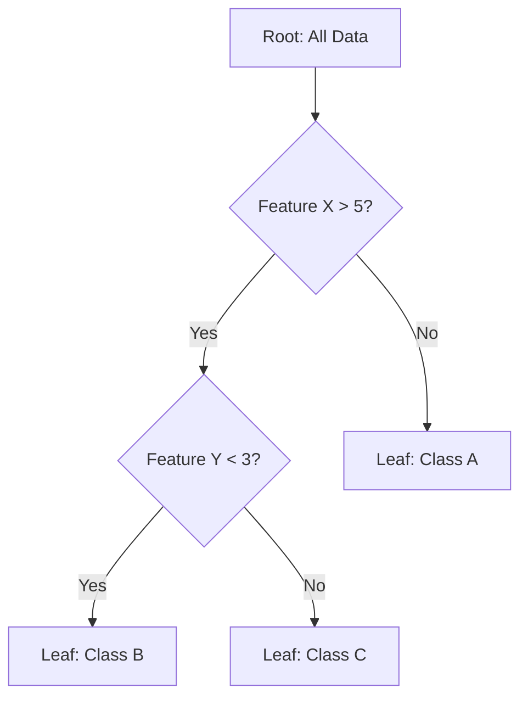
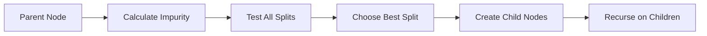

# Decision Trees

## 📘 Theory

Decision trees are non-parametric supervised learning algorithms that create a model predicting target values by learning simple decision rules inferred from data features. They're intuitive, interpretable, and can handle both classification and regression tasks.

### Key Concepts:

- **Root Node**: Topmost node containing all data
- **Internal Nodes**: Decision nodes that split data based on features
- **Leaf Nodes**: Terminal nodes containing final predictions
- **Splitting Criteria**: Methods to determine best splits (Gini, Entropy, Information Gain)
- **Pruning**: Technique to prevent overfitting by removing unnecessary branches

### Mathematical Foundation:

**Information Gain (IG):**

```
IG(S, A) = H(S) - Σ(|Sv|/|S|) × H(Sv)
```

**Gini Impurity:**

```
Gini(S) = 1 - Σ(pi)²
```

**Entropy:**

```
H(S) = -Σ(pi × log₂(pi))
```

Where:

- S is the dataset
- A is the attribute
- pi is the proportion of class i in the dataset

## 📊 Diagrams

### Decision Tree Structure



### Splitting Process



## 🧩 Example

Classifying whether to play tennis based on weather conditions:

**Dataset:**

- Outlook: Sunny, Rainy, Overcast
- Temperature: Hot, Mild, Cool
- Humidity: High, Normal
- Wind: Strong, Weak
- Play: Yes, No

**Step-by-step:**

1. Calculate entropy of entire dataset
2. Test each feature for best split
3. Choose feature with highest information gain
4. Split data and recurse on child nodes
5. Stop when pure nodes or max depth reached

## 💻 Implementation (Golang)

```go
package main

import (
    "fmt"
    "math"
    "sort"
)

type DecisionTree struct {
    Root *Node
    MaxDepth int
    MinSamplesSplit int
}

type Node struct {
    Feature     int
    Threshold   float64
    Left        *Node
    Right       *Node
    Prediction  string
    IsLeaf      bool
}

type DataPoint struct {
    Features []float64
    Label    string
}

func NewDecisionTree(maxDepth, minSamplesSplit int) *DecisionTree {
    return &DecisionTree{
        MaxDepth: maxDepth,
        MinSamplesSplit: minSamplesSplit,
    }
}

func (dt *DecisionTree) Fit(data []DataPoint) {
    dt.Root = dt.buildTree(data, 0)
}

func (dt *DecisionTree) buildTree(data []DataPoint, depth int) *Node {
    // Check stopping criteria
    if depth >= dt.MaxDepth || len(data) < dt.MinSamplesSplit || dt.isPure(data) {
        return &Node{
            Prediction: dt.majorityClass(data),
            IsLeaf: true,
        }
    }

    // Find best split
    bestFeature, bestThreshold := dt.findBestSplit(data)
    if bestFeature == -1 {
        return &Node{
            Prediction: dt.majorityClass(data),
            IsLeaf: true,
        }
    }

    // Split data
    leftData, rightData := dt.splitData(data, bestFeature, bestThreshold)

    // Create internal node
    node := &Node{
        Feature:   bestFeature,
        Threshold: bestThreshold,
        IsLeaf:    false,
    }

    // Recursively build children
    node.Left = dt.buildTree(leftData, depth+1)
    node.Right = dt.buildTree(rightData, depth+1)

    return node
}

func (dt *DecisionTree) findBestSplit(data []DataPoint) (int, float64) {
    bestGain := 0.0
    bestFeature := -1
    bestThreshold := 0.0

    currentEntropy := dt.calculateEntropy(data)

    for feature := 0; feature < len(data[0].Features); feature++ {
        // Get unique values for this feature
        values := dt.getUniqueValues(data, feature)

        for _, threshold := range values {
            leftData, rightData := dt.splitData(data, feature, threshold)

            if len(leftData) == 0 || len(rightData) == 0 {
                continue
            }

            // Calculate information gain
            leftEntropy := dt.calculateEntropy(leftData)
            rightEntropy := dt.calculateEntropy(rightData)

            weightedEntropy := (float64(len(leftData))/float64(len(data)))*leftEntropy +
                              (float64(len(rightData))/float64(len(data)))*rightEntropy

            gain := currentEntropy - weightedEntropy

            if gain > bestGain {
                bestGain = gain
                bestFeature = feature
                bestThreshold = threshold
            }
        }
    }

    return bestFeature, bestThreshold
}

func (dt *DecisionTree) calculateEntropy(data []DataPoint) float64 {
    if len(data) == 0 {
        return 0
    }

    classCounts := make(map[string]int)
    for _, point := range data {
        classCounts[point.Label]++
    }

    entropy := 0.0
    for _, count := range classCounts {
        p := float64(count) / float64(len(data))
        if p > 0 {
            entropy -= p * math.Log2(p)
        }
    }

    return entropy
}

func (dt *DecisionTree) splitData(data []DataPoint, feature int, threshold float64) ([]DataPoint, []DataPoint) {
    var leftData, rightData []DataPoint

    for _, point := range data {
        if point.Features[feature] <= threshold {
            leftData = append(leftData, point)
        } else {
            rightData = append(rightData, point)
        }
    }

    return leftData, rightData
}

func (dt *DecisionTree) getUniqueValues(data []DataPoint, feature int) []float64 {
    valueMap := make(map[float64]bool)
    for _, point := range data {
        valueMap[point.Features[feature]] = true
    }

    var values []float64
    for value := range valueMap {
        values = append(values, value)
    }

    sort.Float64s(values)
    return values
}

func (dt *DecisionTree) isPure(data []DataPoint) bool {
    if len(data) == 0 {
        return true
    }

    firstLabel := data[0].Label
    for _, point := range data {
        if point.Label != firstLabel {
            return false
        }
    }
    return true
}

func (dt *DecisionTree) majorityClass(data []DataPoint) string {
    if len(data) == 0 {
        return ""
    }

    classCounts := make(map[string]int)
    for _, point := range data {
        classCounts[point.Label]++
    }

    maxCount := 0
    majorityClass := ""
    for class, count := range classCounts {
        if count > maxCount {
            maxCount = count
            majorityClass = class
        }
    }

    return majorityClass
}

func (dt *DecisionTree) Predict(features []float64) string {
    return dt.predict(dt.Root, features)
}

func (dt *DecisionTree) predict(node *Node, features []float64) string {
    if node.IsLeaf {
        return node.Prediction
    }

    if features[node.Feature] <= node.Threshold {
        return dt.predict(node.Left, features)
    } else {
        return dt.predict(node.Right, features)
    }
}

func main() {
    // Sample data: [outlook, temperature, humidity, wind] -> play
    data := []DataPoint{
        {[]float64{1, 1, 1, 1}, "No"},  // Sunny, Hot, High, Strong
        {[]float64{1, 1, 1, 0}, "No"},  // Sunny, Hot, High, Weak
        {[]float64{2, 1, 1, 0}, "Yes"}, // Overcast, Hot, High, Weak
        {[]float64{0, 2, 1, 0}, "Yes"}, // Rainy, Mild, High, Weak
        {[]float64{0, 0, 0, 0}, "Yes"}, // Rainy, Cool, Normal, Weak
        {[]float64{0, 0, 0, 1}, "No"},  // Rainy, Cool, Normal, Strong
        {[]float64{2, 0, 0, 1}, "Yes"}, // Overcast, Cool, Normal, Strong
        {[]float64{1, 2, 1, 0}, "No"},  // Sunny, Mild, High, Weak
        {[]float64{1, 0, 0, 0}, "Yes"}, // Sunny, Cool, Normal, Weak
        {[]float64{0, 2, 0, 0}, "Yes"}, // Rainy, Mild, Normal, Weak
    }

    // Create and train model
    dt := NewDecisionTree(3, 2)
    dt.Fit(data)

    // Test prediction
    testFeatures := []float64{1, 2, 0, 0} // Sunny, Mild, Normal, Weak
    prediction := dt.Predict(testFeatures)
    fmt.Printf("Prediction for [Sunny, Mild, Normal, Weak]: %s\n", prediction)
}
```

## 💻 Implementation (Node.js)

```javascript
class DecisionTree {
  constructor(maxDepth = 3, minSamplesSplit = 2) {
    this.maxDepth = maxDepth;
    this.minSamplesSplit = minSamplesSplit;
    this.root = null;
  }

  fit(data) {
    this.root = this.buildTree(data, 0);
  }

  buildTree(data, depth) {
    // Check stopping criteria
    if (
      depth >= this.maxDepth ||
      data.length < this.minSamplesSplit ||
      this.isPure(data)
    ) {
      return {
        prediction: this.majorityClass(data),
        isLeaf: true,
      };
    }

    // Find best split
    const { feature, threshold } = this.findBestSplit(data);
    if (feature === -1) {
      return {
        prediction: this.majorityClass(data),
        isLeaf: true,
      };
    }

    // Split data
    const { leftData, rightData } = this.splitData(data, feature, threshold);

    // Create internal node
    const node = {
      feature,
      threshold,
      isLeaf: false,
      left: this.buildTree(leftData, depth + 1),
      right: this.buildTree(rightData, depth + 1),
    };

    return node;
  }

  findBestSplit(data) {
    let bestGain = 0;
    let bestFeature = -1;
    let bestThreshold = 0;

    const currentEntropy = this.calculateEntropy(data);

    for (let feature = 0; feature < data[0].features.length; feature++) {
      const values = this.getUniqueValues(data, feature);

      for (const threshold of values) {
        const { leftData, rightData } = this.splitData(
          data,
          feature,
          threshold
        );

        if (leftData.length === 0 || rightData.length === 0) {
          continue;
        }

        // Calculate information gain
        const leftEntropy = this.calculateEntropy(leftData);
        const rightEntropy = this.calculateEntropy(rightData);

        const weightedEntropy =
          (leftData.length / data.length) * leftEntropy +
          (rightData.length / data.length) * rightEntropy;

        const gain = currentEntropy - weightedEntropy;

        if (gain > bestGain) {
          bestGain = gain;
          bestFeature = feature;
          bestThreshold = threshold;
        }
      }
    }

    return { feature: bestFeature, threshold: bestThreshold };
  }

  calculateEntropy(data) {
    if (data.length === 0) return 0;

    const classCounts = {};
    for (const point of data) {
      classCounts[point.label] = (classCounts[point.label] || 0) + 1;
    }

    let entropy = 0;
    for (const count of Object.values(classCounts)) {
      const p = count / data.length;
      if (p > 0) {
        entropy -= p * Math.log2(p);
      }
    }

    return entropy;
  }

  splitData(data, feature, threshold) {
    const leftData = [];
    const rightData = [];

    for (const point of data) {
      if (point.features[feature] <= threshold) {
        leftData.push(point);
      } else {
        rightData.push(point);
      }
    }

    return { leftData, rightData };
  }

  getUniqueValues(data, feature) {
    const values = new Set();
    for (const point of data) {
      values.add(point.features[feature]);
    }
    return Array.from(values).sort((a, b) => a - b);
  }

  isPure(data) {
    if (data.length === 0) return true;

    const firstLabel = data[0].label;
    return data.every((point) => point.label === firstLabel);
  }

  majorityClass(data) {
    if (data.length === 0) return "";

    const classCounts = {};
    for (const point of data) {
      classCounts[point.label] = (classCounts[point.label] || 0) + 1;
    }

    let maxCount = 0;
    let majorityClass = "";
    for (const [label, count] of Object.entries(classCounts)) {
      if (count > maxCount) {
        maxCount = count;
        majorityClass = label;
      }
    }

    return majorityClass;
  }

  predict(features) {
    return this.predictNode(this.root, features);
  }

  predictNode(node, features) {
    if (node.isLeaf) {
      return node.prediction;
    }

    if (features[node.feature] <= node.threshold) {
      return this.predictNode(node.left, features);
    } else {
      return this.predictNode(node.right, features);
    }
  }
}

// Sample data: [outlook, temperature, humidity, wind] -> play
const data = [
  { features: [1, 1, 1, 1], label: "No" }, // Sunny, Hot, High, Strong
  { features: [1, 1, 1, 0], label: "No" }, // Sunny, Hot, High, Weak
  { features: [2, 1, 1, 0], label: "Yes" }, // Overcast, Hot, High, Weak
  { features: [0, 2, 1, 0], label: "Yes" }, // Rainy, Mild, High, Weak
  { features: [0, 0, 0, 0], label: "Yes" }, // Rainy, Cool, Normal, Weak
  { features: [0, 0, 0, 1], label: "No" }, // Rainy, Cool, Normal, Strong
  { features: [2, 0, 0, 1], label: "Yes" }, // Overcast, Cool, Normal, Strong
  { features: [1, 2, 1, 0], label: "No" }, // Sunny, Mild, High, Weak
  { features: [1, 0, 0, 0], label: "Yes" }, // Sunny, Cool, Normal, Weak
  { features: [0, 2, 0, 0], label: "Yes" }, // Rainy, Mild, Normal, Weak
];

// Create and train model
const dt = new DecisionTree(3, 2);
dt.fit(data);

// Test prediction
const testFeatures = [1, 2, 0, 0]; // Sunny, Mild, Normal, Weak
const prediction = dt.predict(testFeatures);
console.log(`Prediction for [Sunny, Mild, Normal, Weak]: ${prediction}`);
```

## ⏱ Complexity Analysis

**Time Complexity:**

- Training: O(n × m × log n) where n is samples, m is features
- Prediction: O(log n) for balanced trees
- Space Complexity: O(n) for storing the tree

## 🚀 Optimal Solution

The optimal solution uses:

1. **Pruning**: Remove unnecessary branches to prevent overfitting
2. **Feature Selection**: Use information gain ratio or Gini importance
3. **Ensemble Methods**: Random Forest or Gradient Boosting
4. **Cross-validation**: For better model evaluation
5. **Handling Missing Values**: Use surrogate splits or imputation

## ❓ Follow-up Questions

1. **How would this scale with 1 million data points?**

   - Use Random Forest for parallelization
   - Implement online learning algorithms
   - Consider distributed training

2. **How can we optimize further if features are categorical?**

   - Use one-hot encoding
   - Implement categorical splitting strategies
   - Consider target encoding

3. **What trade-offs exist in different approaches?**
   - Single Tree vs Random Forest: Single tree is interpretable but prone to overfitting
   - Gini vs Entropy: Gini is faster, Entropy is more sensitive to class distribution
   - Pre-pruning vs Post-pruning: Pre-pruning is faster, post-pruning is more effective
