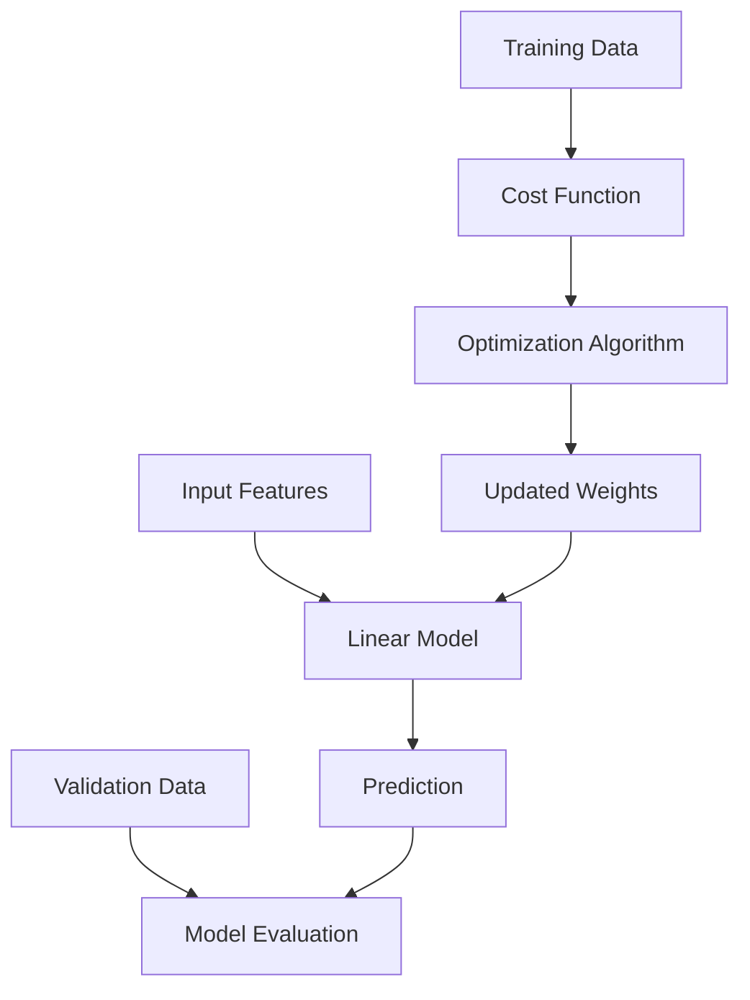
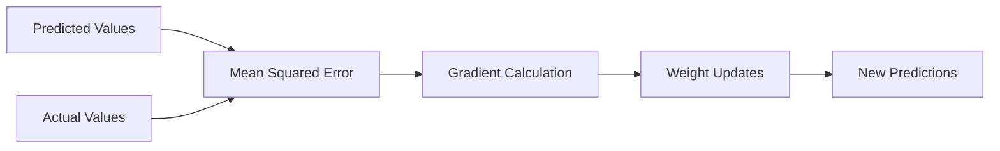

---
# Auto-generated front matter
Title: Linear Regression
LastUpdated: 2025-11-06T20:45:58.317214
Tags: []
Status: draft
---

# Linear Regression

## 📘 Theory

Linear regression is a fundamental supervised learning algorithm that models the relationship between a dependent variable (target) and one or more independent variables (features) using a linear equation. It's the foundation of many machine learning algorithms and provides interpretable results.

### Key Concepts:

- **Simple Linear Regression**: One feature, one target
- **Multiple Linear Regression**: Multiple features, one target
- **Ordinary Least Squares (OLS)**: Method to find the best-fitting line
- **Gradient Descent**: Iterative optimization method
- **Regularization**: L1 (Lasso) and L2 (Ridge) to prevent overfitting

### Mathematical Foundation:

The linear regression model is represented as:

```
y = β₀ + β₁x₁ + β₂x₂ + ... + βₙxₙ + ε
```

Where:

- `y` is the target variable
- `β₀` is the intercept (bias)
- `β₁, β₂, ..., βₙ` are the coefficients (weights)
- `x₁, x₂, ..., xₙ` are the features
- `ε` is the error term

## 📊 Diagrams

### High-level Architecture



### Cost Function Visualization



## 🧩 Example

Let's predict house prices based on size and number of bedrooms:

**Input:**

- House size: 1500 sq ft
- Bedrooms: 3
- Target: $250,000

**Step-by-step:**

1. Initialize weights: w₀ = 0, w₁ = 100, w₂ = 50
2. Calculate prediction: y = 0 + 100(1500) + 50(3) = 150,150
3. Calculate error: 250,000 - 150,150 = 99,850
4. Update weights using gradient descent
5. Repeat until convergence

## 💻 Implementation (Golang)

```go
package main

import (
    "fmt"
    "math"
    "math/rand"
    "time"
)

type LinearRegression struct {
    weights []float64
    bias    float64
    lr      float64 // learning rate
    epochs  int
}

type DataPoint struct {
    features []float64
    target   float64
}

func NewLinearRegression(featureCount int, learningRate float64, epochs int) *LinearRegression {
    weights := make([]float64, featureCount)
    for i := range weights {
        weights[i] = rand.Float64() * 0.01
    }

    return &LinearRegression{
        weights: weights,
        bias:    rand.Float64() * 0.01,
        lr:      learningRate,
        epochs:  epochs,
    }
}

func (lr *LinearRegression) predict(features []float64) float64 {
    prediction := lr.bias
    for i, feature := range features {
        prediction += lr.weights[i] * feature
    }
    return prediction
}

func (lr *LinearRegression) train(data []DataPoint) {
    for epoch := 0; epoch < lr.epochs; epoch++ {
        totalError := 0.0

        for _, point := range data {
            prediction := lr.predict(point.features)
            error := point.target - prediction
            totalError += error * error

            // Update bias
            lr.bias += lr.lr * error

            // Update weights
            for i, feature := range point.features {
                lr.weights[i] += lr.lr * error * feature
            }
        }

        // Print progress every 100 epochs
        if epoch%100 == 0 {
            mse := totalError / float64(len(data))
            fmt.Printf("Epoch %d, MSE: %.4f\n", epoch, mse)
        }
    }
}

func (lr *LinearRegression) evaluate(data []DataPoint) (float64, float64) {
    var totalError, totalSquaredError float64

    for _, point := range data {
        prediction := lr.predict(point.features)
        error := point.target - prediction
        totalError += error
        totalSquaredError += error * error
    }

    mse := totalSquaredError / float64(len(data))
    rmse := math.Sqrt(mse)

    return mse, rmse
}

func main() {
    rand.Seed(time.Now().UnixNano())

    // Sample data: [size, bedrooms] -> price
    data := []DataPoint{
        {[]float64{1000, 2}, 200000},
        {[]float64{1500, 3}, 250000},
        {[]float64{2000, 4}, 300000},
        {[]float64{1200, 2}, 220000},
        {[]float64{1800, 3}, 280000},
    }

    // Create and train model
    lr := NewLinearRegression(2, 0.01, 1000)
    lr.train(data)

    // Test prediction
    testFeatures := []float64{1600, 3}
    prediction := lr.predict(testFeatures)
    fmt.Printf("Predicted price for 1600 sq ft, 3 bedrooms: $%.2f\n", prediction)

    // Evaluate model
    mse, rmse := lr.evaluate(data)
    fmt.Printf("MSE: %.2f, RMSE: %.2f\n", mse, rmse)

    // Print learned parameters
    fmt.Printf("Learned weights: [%.4f, %.4f]\n", lr.weights[0], lr.weights[1])
    fmt.Printf("Learned bias: %.4f\n", lr.bias)
}
```

## 💻 Implementation (Node.js)

```javascript
class LinearRegression {
  constructor(featureCount, learningRate = 0.01, epochs = 1000) {
    this.weights = new Array(featureCount)
      .fill(0)
      .map(() => Math.random() * 0.01);
    this.bias = Math.random() * 0.01;
    this.lr = learningRate;
    this.epochs = epochs;
  }

  predict(features) {
    let prediction = this.bias;
    for (let i = 0; i < features.length; i++) {
      prediction += this.weights[i] * features[i];
    }
    return prediction;
  }

  train(data) {
    for (let epoch = 0; epoch < this.epochs; epoch++) {
      let totalError = 0;

      for (const point of data) {
        const prediction = this.predict(point.features);
        const error = point.target - prediction;
        totalError += error * error;

        // Update bias
        this.bias += this.lr * error;

        // Update weights
        for (let i = 0; i < point.features.length; i++) {
          this.weights[i] += this.lr * error * point.features[i];
        }
      }

      // Print progress every 100 epochs
      if (epoch % 100 === 0) {
        const mse = totalError / data.length;
        console.log(`Epoch ${epoch}, MSE: ${mse.toFixed(4)}`);
      }
    }
  }

  evaluate(data) {
    let totalError = 0;
    let totalSquaredError = 0;

    for (const point of data) {
      const prediction = this.predict(point.features);
      const error = point.target - prediction;
      totalError += error;
      totalSquaredError += error * error;
    }

    const mse = totalSquaredError / data.length;
    const rmse = Math.sqrt(mse);

    return { mse, rmse };
  }
}

// Sample data: [size, bedrooms] -> price
const data = [
  { features: [1000, 2], target: 200000 },
  { features: [1500, 3], target: 250000 },
  { features: [2000, 4], target: 300000 },
  { features: [1200, 2], target: 220000 },
  { features: [1800, 3], target: 280000 },
];

// Create and train model
const lr = new LinearRegression(2, 0.01, 1000);
lr.train(data);

// Test prediction
const testFeatures = [1600, 3];
const prediction = lr.predict(testFeatures);
console.log(
  `Predicted price for 1600 sq ft, 3 bedrooms: $${prediction.toFixed(2)}`
);

// Evaluate model
const { mse, rmse } = lr.evaluate(data);
console.log(`MSE: ${mse.toFixed(2)}, RMSE: ${rmse.toFixed(2)}`);

// Print learned parameters
console.log(
  `Learned weights: [${lr.weights[0].toFixed(4)}, ${lr.weights[1].toFixed(4)}]`
);
console.log(`Learned bias: ${lr.bias.toFixed(4)}`);
```

## ⏱ Complexity Analysis

**Time Complexity:**

- Training: O(n × m × epochs) where n is number of samples, m is number of features
- Prediction: O(m) for each prediction
- Space Complexity: O(m) for storing weights

## 🚀 Optimal Solution

The optimal solution uses:

1. **Feature Scaling**: Normalize features to prevent gradient explosion
2. **Regularization**: L1 (Lasso) or L2 (Ridge) to prevent overfitting
3. **Cross-validation**: For better model evaluation
4. **Early Stopping**: Stop training when validation error stops improving
5. **Batch Gradient Descent**: Process all data at once for stability

## ❓ Follow-up Questions

1. **How would this scale with 1 million data points?**

   - Use mini-batch gradient descent
   - Implement online learning
   - Consider distributed training

2. **How can we optimize further if features are highly correlated?**

   - Use Principal Component Analysis (PCA)
   - Apply L1 regularization for feature selection
   - Use Ridge regression for multicollinearity

3. **What trade-offs exist in different approaches?**
   - OLS vs Gradient Descent: OLS is faster but doesn't scale
   - L1 vs L2 regularization: L1 for feature selection, L2 for stability
   - Batch vs Mini-batch: Batch is stable but slow, mini-batch is faster but noisy
