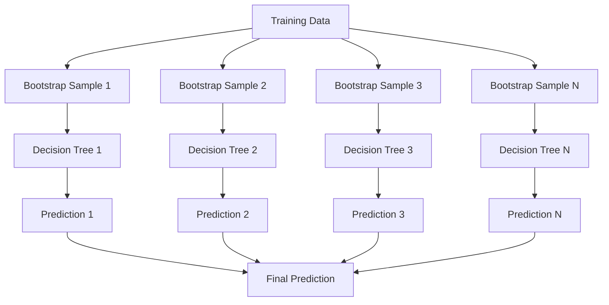

---
# Auto-generated front matter
Title: Random Forest
LastUpdated: 2025-11-06T20:45:58.316879
Tags: []
Status: draft
---

# Random Forest - Ensemble Learning Algorithm

## Overview

Random Forest is an ensemble learning method that combines multiple decision trees to create a more robust and accurate model. It's one of the most popular machine learning algorithms due to its simplicity, effectiveness, and resistance to overfitting.

## Key Concepts

- **Ensemble Learning**: Combining multiple models to improve performance
- **Bootstrap Aggregating (Bagging)**: Training models on different subsets of data
- **Feature Randomness**: Random selection of features for each tree
- **Voting**: Combining predictions from multiple trees
- **Out-of-Bag (OOB) Error**: Error estimation using unused samples

## Random Forest Algorithm

### 1. Bootstrap Sampling
- Create multiple bootstrap samples from training data
- Each sample is same size as original dataset
- Some samples may appear multiple times, others not at all

### 2. Tree Construction
- For each bootstrap sample, build a decision tree
- At each split, randomly select subset of features
- Use best feature from subset for splitting

### 3. Prediction
- For classification: majority voting
- For regression: average of predictions
- Use all trees to make final prediction

## Random Forest Architecture



## Go Implementation

```go
package main

import (
    "fmt"
    "log"
    "math"
    "math/rand"
    "sort"
    "time"
)

// Sample represents a training sample
type Sample struct {
    Features []float64
    Label    int
}

// DecisionTree represents a decision tree
type DecisionTree struct {
    Root *Node
    MaxDepth int
    MinSamplesSplit int
    MinSamplesLeaf int
    MaxFeatures int
}

// Node represents a node in the decision tree
type Node struct {
    FeatureIndex int
    Threshold    float64
    Left         *Node
    Right        *Node
    Label        int
    IsLeaf       bool
    Samples      []Sample
}

// RandomForest represents a random forest
type RandomForest struct {
    Trees        []*DecisionTree
    NumTrees     int
    MaxDepth     int
    MinSamplesSplit int
    MinSamplesLeaf int
    MaxFeatures  int
    RandomState  int64
}

// NewRandomForest creates a new random forest
func NewRandomForest(numTrees, maxDepth, minSamplesSplit, minSamplesLeaf, maxFeatures int, randomState int64) *RandomForest {
    return &RandomForest{
        NumTrees:        numTrees,
        MaxDepth:        maxDepth,
        MinSamplesSplit: minSamplesSplit,
        MinSamplesLeaf:  minSamplesLeaf,
        MaxFeatures:     maxFeatures,
        RandomState:     randomState,
    }
}

// Fit trains the random forest
func (rf *RandomForest) Fit(samples []Sample) {
    rand.Seed(rf.RandomState)
    
    rf.Trees = make([]*DecisionTree, rf.NumTrees)
    
    for i := 0; i < rf.NumTrees; i++ {
        // Create bootstrap sample
        bootstrapSample := rf.createBootstrapSample(samples)
        
        // Create decision tree
        tree := &DecisionTree{
            MaxDepth:        rf.MaxDepth,
            MinSamplesSplit: rf.MinSamplesSplit,
            MinSamplesLeaf:  rf.MinSamplesLeaf,
            MaxFeatures:     rf.MaxFeatures,
        }
        
        // Build tree
        tree.Root = rf.buildTree(bootstrapSample, 0)
        rf.Trees[i] = tree
    }
}

// createBootstrapSample creates a bootstrap sample
func (rf *RandomForest) createBootstrapSample(samples []Sample) []Sample {
    n := len(samples)
    bootstrapSample := make([]Sample, n)
    
    for i := 0; i < n; i++ {
        idx := rand.Intn(n)
        bootstrapSample[i] = samples[idx]
    }
    
    return bootstrapSample
}

// buildTree builds a decision tree
func (rf *RandomForest) buildTree(samples []Sample, depth int) *Node {
    if len(samples) == 0 {
        return nil
    }
    
    // Check stopping criteria
    if depth >= rf.MaxDepth || len(samples) < rf.MinSamplesSplit {
        return rf.createLeafNode(samples)
    }
    
    // Find best split
    bestSplit := rf.findBestSplit(samples)
    if bestSplit == nil {
        return rf.createLeafNode(samples)
    }
    
    // Split samples
    leftSamples, rightSamples := rf.splitSamples(samples, bestSplit.FeatureIndex, bestSplit.Threshold)
    
    // Check minimum samples per leaf
    if len(leftSamples) < rf.MinSamplesLeaf || len(rightSamples) < rf.MinSamplesLeaf {
        return rf.createLeafNode(samples)
    }
    
    // Create internal node
    node := &Node{
        FeatureIndex: bestSplit.FeatureIndex,
        Threshold:    bestSplit.Threshold,
        IsLeaf:       false,
        Samples:      samples,
    }
    
    // Recursively build left and right subtrees
    node.Left = rf.buildTree(leftSamples, depth+1)
    node.Right = rf.buildTree(rightSamples, depth+1)
    
    return node
}

// Split represents a split in the tree
type Split struct {
    FeatureIndex int
    Threshold    float64
    GiniGain     float64
}

// findBestSplit finds the best split for the samples
func (rf *RandomForest) findBestSplit(samples []Sample) *Split {
    if len(samples) == 0 {
        return nil
    }
    
    numFeatures := len(samples[0].Features)
    maxFeatures := rf.MaxFeatures
    
    if maxFeatures <= 0 || maxFeatures > numFeatures {
        maxFeatures = numFeatures
    }
    
    // Randomly select features
    featureIndices := rf.randomFeatureSelection(numFeatures, maxFeatures)
    
    var bestSplit *Split
    
    for _, featureIdx := range featureIndices {
        // Get unique values for this feature
        values := rf.getUniqueValues(samples, featureIdx)
        
        for _, value := range values {
            giniGain := rf.calculateGiniGain(samples, featureIdx, value)
            
            if bestSplit == nil || giniGain > bestSplit.GiniGain {
                bestSplit = &Split{
                    FeatureIndex: featureIdx,
                    Threshold:    value,
                    GiniGain:     giniGain,
                }
            }
        }
    }
    
    return bestSplit
}

// randomFeatureSelection randomly selects features
func (rf *RandomForest) randomFeatureSelection(numFeatures, maxFeatures int) []int {
    indices := make([]int, numFeatures)
    for i := 0; i < numFeatures; i++ {
        indices[i] = i
    }
    
    // Shuffle and take first maxFeatures
    for i := len(indices) - 1; i > 0; i-- {
        j := rand.Intn(i + 1)
        indices[i], indices[j] = indices[j], indices[i]
    }
    
    return indices[:maxFeatures]
}

// getUniqueValues gets unique values for a feature
func (rf *RandomForest) getUniqueValues(samples []Sample, featureIdx int) []float64 {
    valueMap := make(map[float64]bool)
    
    for _, sample := range samples {
        valueMap[sample.Features[featureIdx]] = true
    }
    
    values := make([]float64, 0, len(valueMap))
    for value := range valueMap {
        values = append(values, value)
    }
    
    sort.Float64s(values)
    return values
}

// calculateGiniGain calculates the Gini gain for a split
func (rf *RandomForest) calculateGiniGain(samples []Sample, featureIdx int, threshold float64) float64 {
    // Split samples
    leftSamples, rightSamples := rf.splitSamples(samples, featureIdx, threshold)
    
    if len(leftSamples) == 0 || len(rightSamples) == 0 {
        return 0
    }
    
    // Calculate Gini impurity
    leftGini := rf.calculateGiniImpurity(leftSamples)
    rightGini := rf.calculateGiniImpurity(rightSamples)
    
    // Calculate weighted average
    totalSamples := len(samples)
    weightedGini := (float64(len(leftSamples))/float64(totalSamples))*leftGini +
                   (float64(len(rightSamples))/float64(totalSamples))*rightGini
    
    // Calculate Gini gain
    parentGini := rf.calculateGiniImpurity(samples)
    return parentGini - weightedGini
}

// calculateGiniImpurity calculates the Gini impurity
func (rf *RandomForest) calculateGiniImpurity(samples []Sample) float64 {
    if len(samples) == 0 {
        return 0
    }
    
    // Count labels
    labelCounts := make(map[int]int)
    for _, sample := range samples {
        labelCounts[sample.Label]++
    }
    
    // Calculate Gini impurity
    gini := 1.0
    totalSamples := float64(len(samples))
    
    for _, count := range labelCounts {
        proportion := float64(count) / totalSamples
        gini -= proportion * proportion
    }
    
    return gini
}

// splitSamples splits samples based on feature and threshold
func (rf *RandomForest) splitSamples(samples []Sample, featureIdx int, threshold float64) ([]Sample, []Sample) {
    var leftSamples, rightSamples []Sample
    
    for _, sample := range samples {
        if sample.Features[featureIdx] <= threshold {
            leftSamples = append(leftSamples, sample)
        } else {
            rightSamples = append(rightSamples, sample)
        }
    }
    
    return leftSamples, rightSamples
}

// createLeafNode creates a leaf node
func (rf *RandomForest) createLeafNode(samples []Sample) *Node {
    if len(samples) == 0 {
        return nil
    }
    
    // Find most common label
    labelCounts := make(map[int]int)
    for _, sample := range samples {
        labelCounts[sample.Label]++
    }
    
    maxCount := 0
    mostCommonLabel := 0
    for label, count := range labelCounts {
        if count > maxCount {
            maxCount = count
            mostCommonLabel = label
        }
    }
    
    return &Node{
        Label:   mostCommonLabel,
        IsLeaf:  true,
        Samples: samples,
    }
}

// Predict predicts the label for a sample
func (rf *RandomForest) Predict(sample Sample) int {
    if len(rf.Trees) == 0 {
        return 0
    }
    
    // Collect predictions from all trees
    predictions := make([]int, len(rf.Trees))
    for i, tree := range rf.Trees {
        predictions[i] = rf.predictTree(tree.Root, sample)
    }
    
    // Return most common prediction
    return rf.mostCommon(predictions)
}

// predictTree predicts using a single tree
func (rf *RandomForest) predictTree(node *Node, sample Sample) int {
    if node.IsLeaf {
        return node.Label
    }
    
    if sample.Features[node.FeatureIndex] <= node.Threshold {
        return rf.predictTree(node.Left, sample)
    } else {
        return rf.predictTree(node.Right, sample)
    }
}

// mostCommon finds the most common element in a slice
func (rf *RandomForest) mostCommon(elements []int) int {
    counts := make(map[int]int)
    for _, element := range elements {
        counts[element]++
    }
    
    maxCount := 0
    mostCommon := 0
    for element, count := range counts {
        if count > maxCount {
            maxCount = count
            mostCommon = element
        }
    }
    
    return mostCommon
}

// PredictBatch predicts labels for multiple samples
func (rf *RandomForest) PredictBatch(samples []Sample) []int {
    predictions := make([]int, len(samples))
    for i, sample := range samples {
        predictions[i] = rf.Predict(sample)
    }
    return predictions
}

// CalculateAccuracy calculates the accuracy of predictions
func (rf *RandomForest) CalculateAccuracy(samples []Sample, predictions []int) float64 {
    if len(samples) != len(predictions) {
        return 0
    }
    
    correct := 0
    for i, sample := range samples {
        if sample.Label == predictions[i] {
            correct++
        }
    }
    
    return float64(correct) / float64(len(samples))
}

// GetFeatureImportance calculates feature importance
func (rf *RandomForest) GetFeatureImportance() []float64 {
    if len(rf.Trees) == 0 {
        return nil
    }
    
    numFeatures := len(rf.Trees[0].Root.Samples[0].Features)
    importance := make([]float64, numFeatures)
    
    // Calculate importance for each tree
    for _, tree := range rf.Trees {
        treeImportance := rf.calculateTreeImportance(tree.Root)
        for i := 0; i < numFeatures; i++ {
            importance[i] += treeImportance[i]
        }
    }
    
    // Average across all trees
    for i := range importance {
        importance[i] /= float64(len(rf.Trees))
    }
    
    return importance
}

// calculateTreeImportance calculates feature importance for a single tree
func (rf *RandomForest) calculateTreeImportance(node *Node) []float64 {
    if node.IsLeaf {
        return make([]float64, len(node.Samples[0].Features))
    }
    
    // Calculate importance for this split
    importance := make([]float64, len(node.Samples[0].Features))
    if node.FeatureIndex < len(importance) {
        importance[node.FeatureIndex] = float64(len(node.Samples))
    }
    
    // Recursively calculate importance for subtrees
    if node.Left != nil {
        leftImportance := rf.calculateTreeImportance(node.Left)
        for i := range importance {
            importance[i] += leftImportance[i]
        }
    }
    
    if node.Right != nil {
        rightImportance := rf.calculateTreeImportance(node.Right)
        for i := range importance {
            importance[i] += rightImportance[i]
        }
    }
    
    return importance
}

// Example usage
func main() {
    // Create sample data
    samples := []Sample{
        {Features: []float64{1.0, 2.0}, Label: 0},
        {Features: []float64{2.0, 3.0}, Label: 0},
        {Features: []float64{3.0, 4.0}, Label: 1},
        {Features: []float64{4.0, 5.0}, Label: 1},
        {Features: []float64{5.0, 6.0}, Label: 1},
        {Features: []float64{6.0, 7.0}, Label: 0},
        {Features: []float64{7.0, 8.0}, Label: 0},
        {Features: []float64{8.0, 9.0}, Label: 1},
    }
    
    // Create random forest
    rf := NewRandomForest(10, 5, 2, 1, 2, 42)
    
    // Train the model
    rf.Fit(samples)
    
    // Make predictions
    testSamples := []Sample{
        {Features: []float64{1.5, 2.5}, Label: 0},
        {Features: []float64{3.5, 4.5}, Label: 1},
        {Features: []float64{5.5, 6.5}, Label: 0},
    }
    
    predictions := rf.PredictBatch(testSamples)
    
    // Calculate accuracy
    accuracy := rf.CalculateAccuracy(testSamples, predictions)
    fmt.Printf("Accuracy: %.2f%%\n", accuracy*100)
    
    // Get feature importance
    importance := rf.GetFeatureImportance()
    fmt.Printf("Feature importance: %v\n", importance)
    
    // Make single prediction
    singleSample := Sample{Features: []float64{2.5, 3.5}, Label: 0}
    prediction := rf.Predict(singleSample)
    fmt.Printf("Prediction for [2.5, 3.5]: %d\n", prediction)
}
```

## Node.js Implementation

```javascript
class Sample {
  constructor(features, label) {
    this.features = features;
    this.label = label;
  }
}

class Node {
  constructor() {
    this.featureIndex = -1;
    this.threshold = 0;
    this.left = null;
    this.right = null;
    this.label = 0;
    this.isLeaf = false;
    this.samples = [];
  }
}

class DecisionTree {
  constructor(maxDepth, minSamplesSplit, minSamplesLeaf, maxFeatures) {
    this.root = null;
    this.maxDepth = maxDepth;
    this.minSamplesSplit = minSamplesSplit;
    this.minSamplesLeaf = minSamplesLeaf;
    this.maxFeatures = maxFeatures;
  }
}

class RandomForest {
  constructor(numTrees, maxDepth, minSamplesSplit, minSamplesLeaf, maxFeatures, randomState) {
    this.trees = [];
    this.numTrees = numTrees;
    this.maxDepth = maxDepth;
    this.minSamplesSplit = minSamplesSplit;
    this.minSamplesLeaf = minSamplesLeaf;
    this.maxFeatures = maxFeatures;
    this.randomState = randomState;
  }

  fit(samples) {
    Math.seedrandom(this.randomState);
    
    this.trees = [];
    
    for (let i = 0; i < this.numTrees; i++) {
      // Create bootstrap sample
      const bootstrapSample = this.createBootstrapSample(samples);
      
      // Create decision tree
      const tree = new DecisionTree(
        this.maxDepth,
        this.minSamplesSplit,
        this.minSamplesLeaf,
        this.maxFeatures
      );
      
      // Build tree
      tree.root = this.buildTree(bootstrapSample, 0);
      this.trees.push(tree);
    }
  }

  createBootstrapSample(samples) {
    const n = samples.length;
    const bootstrapSample = [];
    
    for (let i = 0; i < n; i++) {
      const idx = Math.floor(Math.random() * n);
      bootstrapSample.push(samples[idx]);
    }
    
    return bootstrapSample;
  }

  buildTree(samples, depth) {
    if (samples.length === 0) {
      return null;
    }
    
    // Check stopping criteria
    if (depth >= this.maxDepth || samples.length < this.minSamplesSplit) {
      return this.createLeafNode(samples);
    }
    
    // Find best split
    const bestSplit = this.findBestSplit(samples);
    if (!bestSplit) {
      return this.createLeafNode(samples);
    }
    
    // Split samples
    const [leftSamples, rightSamples] = this.splitSamples(
      samples,
      bestSplit.featureIndex,
      bestSplit.threshold
    );
    
    // Check minimum samples per leaf
    if (leftSamples.length < this.minSamplesLeaf || rightSamples.length < this.minSamplesLeaf) {
      return this.createLeafNode(samples);
    }
    
    // Create internal node
    const node = new Node();
    node.featureIndex = bestSplit.featureIndex;
    node.threshold = bestSplit.threshold;
    node.isLeaf = false;
    node.samples = samples;
    
    // Recursively build left and right subtrees
    node.left = this.buildTree(leftSamples, depth + 1);
    node.right = this.buildTree(rightSamples, depth + 1);
    
    return node;
  }

  findBestSplit(samples) {
    if (samples.length === 0) {
      return null;
    }
    
    const numFeatures = samples[0].features.length;
    let maxFeatures = this.maxFeatures;
    
    if (maxFeatures <= 0 || maxFeatures > numFeatures) {
      maxFeatures = numFeatures;
    }
    
    // Randomly select features
    const featureIndices = this.randomFeatureSelection(numFeatures, maxFeatures);
    
    let bestSplit = null;
    
    for (const featureIdx of featureIndices) {
      // Get unique values for this feature
      const values = this.getUniqueValues(samples, featureIdx);
      
      for (const value of values) {
        const giniGain = this.calculateGiniGain(samples, featureIdx, value);
        
        if (!bestSplit || giniGain > bestSplit.giniGain) {
          bestSplit = {
            featureIndex: featureIdx,
            threshold: value,
            giniGain: giniGain,
          };
        }
      }
    }
    
    return bestSplit;
  }

  randomFeatureSelection(numFeatures, maxFeatures) {
    const indices = Array.from({ length: numFeatures }, (_, i) => i);
    
    // Shuffle and take first maxFeatures
    for (let i = indices.length - 1; i > 0; i--) {
      const j = Math.floor(Math.random() * (i + 1));
      [indices[i], indices[j]] = [indices[j], indices[i]];
    }
    
    return indices.slice(0, maxFeatures);
  }

  getUniqueValues(samples, featureIdx) {
    const valueSet = new Set();
    
    for (const sample of samples) {
      valueSet.add(sample.features[featureIdx]);
    }
    
    return Array.from(valueSet).sort((a, b) => a - b);
  }

  calculateGiniGain(samples, featureIdx, threshold) {
    // Split samples
    const [leftSamples, rightSamples] = this.splitSamples(samples, featureIdx, threshold);
    
    if (leftSamples.length === 0 || rightSamples.length === 0) {
      return 0;
    }
    
    // Calculate Gini impurity
    const leftGini = this.calculateGiniImpurity(leftSamples);
    const rightGini = this.calculateGiniImpurity(rightSamples);
    
    // Calculate weighted average
    const totalSamples = samples.length;
    const weightedGini = (leftSamples.length / totalSamples) * leftGini +
                        (rightSamples.length / totalSamples) * rightGini;
    
    // Calculate Gini gain
    const parentGini = this.calculateGiniImpurity(samples);
    return parentGini - weightedGini;
  }

  calculateGiniImpurity(samples) {
    if (samples.length === 0) {
      return 0;
    }
    
    // Count labels
    const labelCounts = {};
    for (const sample of samples) {
      labelCounts[sample.label] = (labelCounts[sample.label] || 0) + 1;
    }
    
    // Calculate Gini impurity
    let gini = 1.0;
    const totalSamples = samples.length;
    
    for (const count of Object.values(labelCounts)) {
      const proportion = count / totalSamples;
      gini -= proportion * proportion;
    }
    
    return gini;
  }

  splitSamples(samples, featureIdx, threshold) {
    const leftSamples = [];
    const rightSamples = [];
    
    for (const sample of samples) {
      if (sample.features[featureIdx] <= threshold) {
        leftSamples.push(sample);
      } else {
        rightSamples.push(sample);
      }
    }
    
    return [leftSamples, rightSamples];
  }

  createLeafNode(samples) {
    if (samples.length === 0) {
      return null;
    }
    
    // Find most common label
    const labelCounts = {};
    for (const sample of samples) {
      labelCounts[sample.label] = (labelCounts[sample.label] || 0) + 1;
    }
    
    let maxCount = 0;
    let mostCommonLabel = 0;
    for (const [label, count] of Object.entries(labelCounts)) {
      if (count > maxCount) {
        maxCount = count;
        mostCommonLabel = parseInt(label);
      }
    }
    
    const node = new Node();
    node.label = mostCommonLabel;
    node.isLeaf = true;
    node.samples = samples;
    
    return node;
  }

  predict(sample) {
    if (this.trees.length === 0) {
      return 0;
    }
    
    // Collect predictions from all trees
    const predictions = [];
    for (const tree of this.trees) {
      predictions.push(this.predictTree(tree.root, sample));
    }
    
    // Return most common prediction
    return this.mostCommon(predictions);
  }

  predictTree(node, sample) {
    if (node.isLeaf) {
      return node.label;
    }
    
    if (sample.features[node.featureIndex] <= node.threshold) {
      return this.predictTree(node.left, sample);
    } else {
      return this.predictTree(node.right, sample);
    }
  }

  mostCommon(elements) {
    const counts = {};
    for (const element of elements) {
      counts[element] = (counts[element] || 0) + 1;
    }
    
    let maxCount = 0;
    let mostCommon = 0;
    for (const [element, count] of Object.entries(counts)) {
      if (count > maxCount) {
        maxCount = count;
        mostCommon = parseInt(element);
      }
    }
    
    return mostCommon;
  }

  predictBatch(samples) {
    const predictions = [];
    for (const sample of samples) {
      predictions.push(this.predict(sample));
    }
    return predictions;
  }

  calculateAccuracy(samples, predictions) {
    if (samples.length !== predictions.length) {
      return 0;
    }
    
    let correct = 0;
    for (let i = 0; i < samples.length; i++) {
      if (samples[i].label === predictions[i]) {
        correct++;
      }
    }
    
    return correct / samples.length;
  }

  getFeatureImportance() {
    if (this.trees.length === 0) {
      return null;
    }
    
    const numFeatures = this.trees[0].root.samples[0].features.length;
    const importance = new Array(numFeatures).fill(0);
    
    // Calculate importance for each tree
    for (const tree of this.trees) {
      const treeImportance = this.calculateTreeImportance(tree.root);
      for (let i = 0; i < numFeatures; i++) {
        importance[i] += treeImportance[i];
      }
    }
    
    // Average across all trees
    for (let i = 0; i < importance.length; i++) {
      importance[i] /= this.trees.length;
    }
    
    return importance;
  }

  calculateTreeImportance(node) {
    if (node.isLeaf) {
      return new Array(node.samples[0].features.length).fill(0);
    }
    
    // Calculate importance for this split
    const importance = new Array(node.samples[0].features.length).fill(0);
    if (node.featureIndex < importance.length) {
      importance[node.featureIndex] = node.samples.length;
    }
    
    // Recursively calculate importance for subtrees
    if (node.left) {
      const leftImportance = this.calculateTreeImportance(node.left);
      for (let i = 0; i < importance.length; i++) {
        importance[i] += leftImportance[i];
      }
    }
    
    if (node.right) {
      const rightImportance = this.calculateTreeImportance(node.right);
      for (let i = 0; i < importance.length; i++) {
        importance[i] += rightImportance[i];
      }
    }
    
    return importance;
  }
}

// Example usage
function main() {
  // Create sample data
  const samples = [
    new Sample([1.0, 2.0], 0),
    new Sample([2.0, 3.0], 0),
    new Sample([3.0, 4.0], 1),
    new Sample([4.0, 5.0], 1),
    new Sample([5.0, 6.0], 1),
    new Sample([6.0, 7.0], 0),
    new Sample([7.0, 8.0], 0),
    new Sample([8.0, 9.0], 1),
  ];
  
  // Create random forest
  const rf = new RandomForest(10, 5, 2, 1, 2, 42);
  
  // Train the model
  rf.fit(samples);
  
  // Make predictions
  const testSamples = [
    new Sample([1.5, 2.5], 0),
    new Sample([3.5, 4.5], 1),
    new Sample([5.5, 6.5], 0),
  ];
  
  const predictions = rf.predictBatch(testSamples);
  
  // Calculate accuracy
  const accuracy = rf.calculateAccuracy(testSamples, predictions);
  console.log(`Accuracy: ${(accuracy * 100).toFixed(2)}%`);
  
  // Get feature importance
  const importance = rf.getFeatureImportance();
  console.log(`Feature importance: ${importance}`);
  
  // Make single prediction
  const singleSample = new Sample([2.5, 3.5], 0);
  const prediction = rf.predict(singleSample);
  console.log(`Prediction for [2.5, 3.5]: ${prediction}`);
}

if (require.main === module) {
  main();
}
```

## Benefits

1. **High Accuracy**: Often achieves high accuracy on various datasets
2. **Resistance to Overfitting**: Less prone to overfitting than single trees
3. **Feature Importance**: Provides feature importance rankings
4. **Handles Missing Data**: Can handle missing values well
5. **No Feature Scaling**: Doesn't require feature scaling

## Trade-offs

1. **Memory Usage**: Requires more memory than single trees
2. **Training Time**: Slower training than single trees
3. **Interpretability**: Less interpretable than single trees
4. **Hyperparameter Tuning**: Requires tuning multiple parameters

## Use Cases

- **Classification**: Binary and multi-class classification
- **Regression**: Continuous value prediction
- **Feature Selection**: Identifying important features
- **Anomaly Detection**: Detecting outliers
- **Medical Diagnosis**: Disease prediction

## Best Practices

1. **Tree Count**: Use 100-500 trees typically
2. **Feature Selection**: Use sqrt(n_features) for classification
3. **Cross-Validation**: Use cross-validation for parameter tuning
4. **Out-of-Bag Error**: Use OOB error for model evaluation
5. **Feature Importance**: Use feature importance for feature selection

## Common Pitfalls

1. **Overfitting**: Still possible with too many trees
2. **Memory Issues**: Large datasets can cause memory problems
3. **Slow Training**: Can be slow for large datasets
4. **Hyperparameter Tuning**: Requires careful parameter tuning

## Interview Questions

1. **What's the difference between Random Forest and Decision Tree?**
   - Random Forest uses multiple trees with bagging and feature randomness

2. **How does Random Forest prevent overfitting?**
   - Uses bagging, feature randomness, and averaging predictions

3. **What's the time complexity of Random Forest?**
   - O(n log n * m * k) where n is samples, m is features, k is trees

4. **How do you choose the number of trees?**
   - Use cross-validation, monitor performance vs. training time

## Time Complexity

- **Training**: O(n log n * m * k) where n is samples, m is features, k is trees
- **Prediction**: O(log n * k) where n is samples, k is trees
- **Feature Importance**: O(n * m * k) where n is samples, m is features, k is trees

## Space Complexity

- **Storage**: O(n * m * k) where n is samples, m is features, k is trees
- **Memory**: O(n * m) for training, O(k) for prediction

The optimal solution uses:
1. **Appropriate Tree Count**: Balance accuracy and performance
2. **Feature Selection**: Use appropriate number of features
3. **Cross-Validation**: Use CV for parameter tuning
4. **Feature Importance**: Use for feature selection and interpretation
