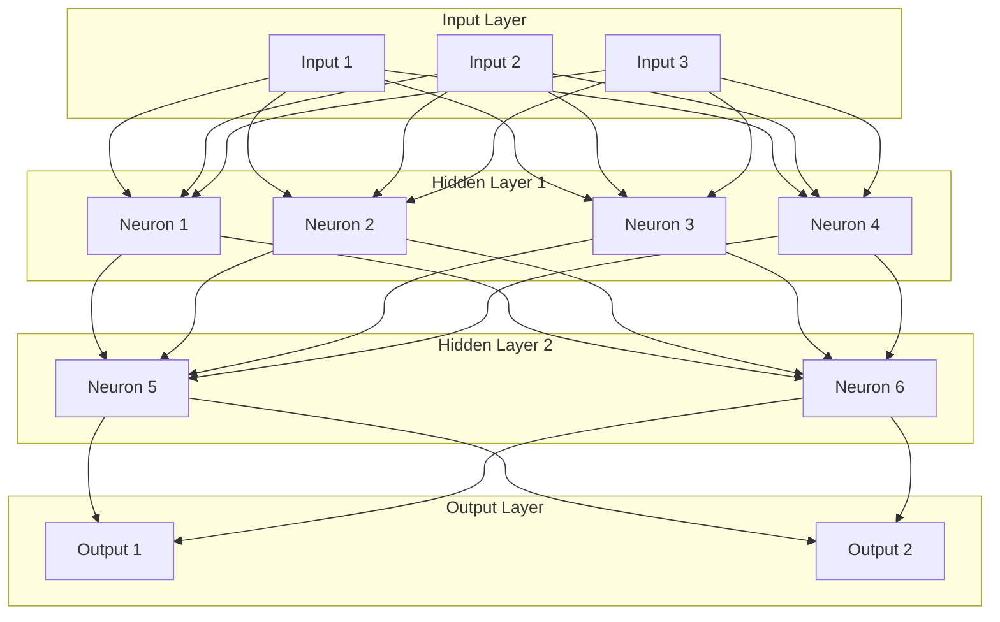
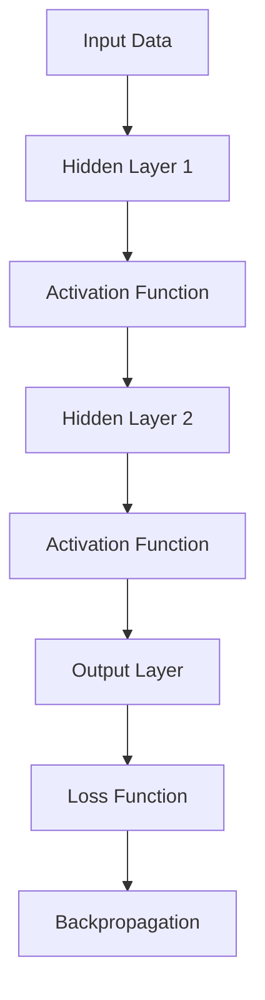

# 🧠 **Neural Networks**

## 📘 **Theory**

Neural networks are computing systems inspired by biological neural networks. They consist of interconnected nodes (neurons) that process information using a connectionist approach to computation. Neural networks are the foundation of deep learning and are particularly powerful for pattern recognition, classification, and regression tasks.

### **Why Neural Networks Matter**

- **Universal Approximation**: Can approximate any continuous function
- **Pattern Recognition**: Excel at identifying complex patterns in data
- **Non-linear Relationships**: Can model non-linear relationships between inputs and outputs
- **Feature Learning**: Automatically learn relevant features from raw data
- **Scalability**: Can be scaled to handle large datasets and complex problems

### **Key Components**

1. **Neurons**: Basic processing units that receive inputs, process them, and produce outputs
2. **Weights**: Parameters that determine the strength of connections between neurons
3. **Biases**: Additional parameters that shift the activation function
4. **Activation Functions**: Non-linear functions that introduce non-linearity
5. **Layers**: Groups of neurons that process information at the same level

### **Common Pitfalls and Best Practices**

- **Overfitting**: Use regularization techniques like dropout and weight decay
- **Vanishing Gradients**: Use proper activation functions and weight initialization
- **Exploding Gradients**: Use gradient clipping and proper initialization
- **Learning Rate**: Choose appropriate learning rates for convergence
- **Data Preprocessing**: Normalize inputs and handle missing data properly

## 📊 **Diagrams**

### **Neural Network Architecture**



### **Neuron Structure**

```mermaid
graph LR
    subgraph "Neuron"
        X1[x1] --> W1[w1]
        X2[x2] --> W2[w2]
        X3[x3] --> W3[w3]
        Xn[xn] --> Wn[wn]

        W1 --> Sum[Σ]
        W2 --> Sum
        W3 --> Sum
        Wn --> Sum

        B[bias] --> Sum
        Sum --> AF[Activation Function]
        AF --> Output[Output]
    end
```



### **Forward Propagation Flow**



## 🧩 **Example**

**Scenario**: Binary classification problem - predicting whether a customer will buy a product based on age, income, and browsing time

**Input**: Customer features (age, income, browsing_time)
**Expected Output**: Probability of purchase (0-1)

**Step-by-step**:

1. Initialize network with random weights and biases
2. Forward pass: Calculate outputs for each layer
3. Calculate loss using binary cross-entropy
4. Backward pass: Calculate gradients using chain rule
5. Update weights and biases using gradient descent
6. Repeat until convergence

## 💻 **Implementation (Golang)**

```go
package main

import (
    "fmt"
    "math"
    "math/rand"
    "time"
)

// Activation functions
type ActivationFunction interface {
    Forward(x float64) float64
    Backward(x float64) float64
}

type Sigmoid struct{}

func (s Sigmoid) Forward(x float64) float64 {
    return 1.0 / (1.0 + math.Exp(-x))
}

func (s Sigmoid) Backward(x float64) float64 {
    sig := s.Forward(x)
    return sig * (1.0 - sig)
}

type ReLU struct{}

func (r ReLU) Forward(x float64) float64 {
    if x > 0 {
        return x
    }
    return 0
}

func (r ReLU) Backward(x float64) float64 {
    if x > 0 {
        return 1.0
    }
    return 0
}

type Tanh struct{}

func (t Tanh) Forward(x float64) float64 {
    return math.Tanh(x)
}

func (t Tanh) Backward(x float64) float64 {
    tanh := t.Forward(x)
    return 1.0 - tanh*tanh
}

// Neuron structure
type Neuron struct {
    Weights []float64
    Bias    float64
    Activation ActivationFunction
    Inputs  []float64
    Output  float64
    Delta   float64
}

func NewNeuron(inputSize int, activation ActivationFunction) *Neuron {
    weights := make([]float64, inputSize)
    for i := range weights {
        weights[i] = rand.Float64()*2 - 1 // Random initialization between -1 and 1
    }

    return &Neuron{
        Weights:    weights,
        Bias:       rand.Float64()*2 - 1,
        Activation: activation,
        Inputs:     make([]float64, inputSize),
    }
}

func (n *Neuron) Forward(inputs []float64) float64 {
    n.Inputs = inputs
    sum := n.Bias

    for i, input := range inputs {
        sum += input * n.Weights[i]
    }

    n.Output = n.Activation.Forward(sum)
    return n.Output
}

func (n *Neuron) Backward(error float64) {
    n.Delta = error * n.Activation.Backward(n.Output)
}

func (n *Neuron) UpdateWeights(learningRate float64) {
    for i := range n.Weights {
        n.Weights[i] -= learningRate * n.Delta * n.Inputs[i]
    }
    n.Bias -= learningRate * n.Delta
}

// Layer structure
type Layer struct {
    Neurons []*Neuron
    Size    int
}

func NewLayer(inputSize, size int, activation ActivationFunction) *Layer {
    neurons := make([]*Neuron, size)
    for i := range neurons {
        neurons[i] = NewNeuron(inputSize, activation)
    }

    return &Layer{
        Neurons: neurons,
        Size:    size,
    }
}

func (l *Layer) Forward(inputs []float64) []float64 {
    outputs := make([]float64, l.Size)
    for i, neuron := range l.Neurons {
        outputs[i] = neuron.Forward(inputs)
    }
    return outputs
}

func (l *Layer) Backward(errors []float64) []float64 {
    inputErrors := make([]float64, len(l.Neurons[0].Weights))

    for i, neuron := range l.Neurons {
        neuron.Backward(errors[i])

        // Calculate input errors for previous layer
        for j := range inputErrors {
            inputErrors[j] += neuron.Weights[j] * neuron.Delta
        }
    }

    return inputErrors
}

func (l *Layer) UpdateWeights(learningRate float64) {
    for _, neuron := range l.Neurons {
        neuron.UpdateWeights(learningRate)
    }
}

// Neural Network
type NeuralNetwork struct {
    Layers []*Layer
    LearningRate float64
}

func NewNeuralNetwork(layerSizes []int, learningRate float64) *NeuralNetwork {
    if len(layerSizes) < 2 {
        panic("At least 2 layers required (input and output)")
    }

    layers := make([]*Layer, len(layerSizes)-1)

    for i := 0; i < len(layerSizes)-1; i++ {
        inputSize := layerSizes[i]
        outputSize := layerSizes[i+1]

        var activation ActivationFunction
        if i == len(layerSizes)-2 {
            // Output layer
            activation = Sigmoid{}
        } else {
            // Hidden layers
            activation = ReLU{}
        }

        layers[i] = NewLayer(inputSize, outputSize, activation)
    }

    return &NeuralNetwork{
        Layers:       layers,
        LearningRate: learningRate,
    }
}

func (nn *NeuralNetwork) Forward(inputs []float64) []float64 {
    currentInputs := inputs

    for _, layer := range nn.Layers {
        currentInputs = layer.Forward(currentInputs)
    }

    return currentInputs
}

func (nn *NeuralNetwork) Backward(targets []float64) {
    // Calculate output layer errors
    outputLayer := nn.Layers[len(nn.Layers)-1]
    errors := make([]float64, len(outputLayer.Neurons))

    for i, neuron := range outputLayer.Neurons {
        errors[i] = neuron.Output - targets[i]
    }

    // Backpropagate through layers
    currentErrors := errors
    for i := len(nn.Layers) - 1; i >= 0; i-- {
        currentErrors = nn.Layers[i].Backward(currentErrors)
    }
}

func (nn *NeuralNetwork) UpdateWeights() {
    for _, layer := range nn.Layers {
        layer.UpdateWeights(nn.LearningRate)
    }
}

func (nn *NeuralNetwork) Train(inputs [][]float64, targets [][]float64, epochs int) {
    for epoch := 0; epoch < epochs; epoch++ {
        totalLoss := 0.0

        for i, input := range inputs {
            // Forward pass
            outputs := nn.Forward(input)

            // Calculate loss (MSE)
            loss := 0.0
            for j, output := range outputs {
                diff := output - targets[i][j]
                loss += diff * diff
            }
            totalLoss += loss / float64(len(outputs))

            // Backward pass
            nn.Backward(targets[i])

            // Update weights
            nn.UpdateWeights()
        }

        avgLoss := totalLoss / float64(len(inputs))
        if epoch%100 == 0 {
            fmt.Printf("Epoch %d, Average Loss: %.6f\n", epoch, avgLoss)
        }
    }
}

func (nn *NeuralNetwork) Predict(inputs []float64) []float64 {
    return nn.Forward(inputs)
}

// Loss functions
func BinaryCrossEntropy(predicted, actual float64) float64 {
    if actual == 1 {
        return -math.Log(predicted + 1e-15) // Add small epsilon to avoid log(0)
    }
    return -math.Log(1 - predicted + 1e-15)
}

func MeanSquaredError(predicted, actual float64) float64 {
    diff := predicted - actual
    return diff * diff
}

// Data preprocessing
func NormalizeData(data [][]float64) [][]float64 {
    if len(data) == 0 {
        return data
    }

    numFeatures := len(data[0])
    normalized := make([][]float64, len(data))

    // Calculate mean and std for each feature
    means := make([]float64, numFeatures)
    stds := make([]float64, numFeatures)

    for i := 0; i < numFeatures; i++ {
        sum := 0.0
        for _, row := range data {
            sum += row[i]
        }
        means[i] = sum / float64(len(data))

        sumSquaredDiff := 0.0
        for _, row := range data {
            diff := row[i] - means[i]
            sumSquaredDiff += diff * diff
        }
        stds[i] = math.Sqrt(sumSquaredDiff / float64(len(data)))
    }

    // Normalize data
    for i, row := range data {
        normalized[i] = make([]float64, numFeatures)
        for j, value := range row {
            normalized[i][j] = (value - means[j]) / stds[j]
        }
    }

    return normalized
}

// Example usage
func main() {
    // Set random seed for reproducibility
    rand.Seed(time.Now().UnixNano())

    // Sample data: [age, income, browsing_time] -> [purchase_probability]
    inputs := [][]float64{
        {25, 30000, 5.2},
        {35, 50000, 8.1},
        {45, 70000, 3.4},
        {28, 40000, 6.7},
        {52, 80000, 2.1},
        {31, 45000, 7.3},
        {38, 60000, 4.8},
        {42, 65000, 5.9},
        {29, 35000, 8.5},
        {48, 75000, 3.2},
    }

    targets := [][]float64{
        {0.8}, // High probability
        {0.9}, // High probability
        {0.3}, // Low probability
        {0.7}, // Medium-high probability
        {0.2}, // Low probability
        {0.8}, // High probability
        {0.4}, // Low-medium probability
        {0.6}, // Medium probability
        {0.9}, // High probability
        {0.3}, // Low probability
    }

    // Normalize input data
    normalizedInputs := NormalizeData(inputs)

    // Create neural network: 3 inputs -> 4 hidden -> 2 hidden -> 1 output
    nn := NewNeuralNetwork([]int{3, 4, 2, 1}, 0.01)

    // Train the network
    fmt.Println("Training neural network...")
    nn.Train(normalizedInputs, targets, 1000)

    // Test predictions
    fmt.Println("\nTesting predictions:")
    for i, input := range normalizedInputs {
        prediction := nn.Predict(input)
        actual := targets[i][0]
        fmt.Printf("Input: %v, Predicted: %.3f, Actual: %.3f, Error: %.3f\n",
            inputs[i], prediction[0], actual, math.Abs(prediction[0]-actual))
    }

    // Test with new data
    fmt.Println("\nTesting with new data:")
    newInputs := [][]float64{
        {30, 55000, 6.0},
        {40, 60000, 4.5},
        {26, 32000, 9.0},
    }

    normalizedNewInputs := NormalizeData(newInputs)
    for i, input := range normalizedNewInputs {
        prediction := nn.Predict(input)
        fmt.Printf("New Input: %v, Predicted Purchase Probability: %.3f\n",
            newInputs[i], prediction[0])
    }
}
```

## 💻 **Implementation (Node.js)**

```javascript
const fs = require("fs");

// Activation functions
class ActivationFunction {
  static sigmoid(x) {
    return 1 / (1 + Math.exp(-x));
  }

  static sigmoidDerivative(x) {
    const sig = this.sigmoid(x);
    return sig * (1 - sig);
  }

  static relu(x) {
    return Math.max(0, x);
  }

  static reluDerivative(x) {
    return x > 0 ? 1 : 0;
  }

  static tanh(x) {
    return Math.tanh(x);
  }

  static tanhDerivative(x) {
    const tanh = this.tanh(x);
    return 1 - tanh * tanh;
  }
}

// Neuron class
class Neuron {
  constructor(inputSize, activationFunction) {
    this.weights = Array(inputSize)
      .fill(0)
      .map(() => Math.random() * 2 - 1);
    this.bias = Math.random() * 2 - 1;
    this.activationFunction = activationFunction;
    this.inputs = [];
    this.output = 0;
    this.delta = 0;
  }

  forward(inputs) {
    this.inputs = inputs;
    let sum = this.bias;

    for (let i = 0; i < inputs.length; i++) {
      sum += inputs[i] * this.weights[i];
    }

    this.output = this.activationFunction.forward(sum);
    return this.output;
  }

  backward(error) {
    this.delta = error * this.activationFunction.backward(this.output);
  }

  updateWeights(learningRate) {
    for (let i = 0; i < this.weights.length; i++) {
      this.weights[i] -= learningRate * this.delta * this.inputs[i];
    }
    this.bias -= learningRate * this.delta;
  }
}

// Layer class
class Layer {
  constructor(inputSize, size, activationFunction) {
    this.neurons = Array(size)
      .fill(0)
      .map(() => new Neuron(inputSize, activationFunction));
    this.size = size;
  }

  forward(inputs) {
    return this.neurons.map((neuron) => neuron.forward(inputs));
  }

  backward(errors) {
    const inputErrors = Array(this.neurons[0].weights.length).fill(0);

    for (let i = 0; i < this.neurons.length; i++) {
      this.neurons[i].backward(errors[i]);

      for (let j = 0; j < inputErrors.length; j++) {
        inputErrors[j] += this.neurons[i].weights[j] * this.neurons[i].delta;
      }
    }

    return inputErrors;
  }

  updateWeights(learningRate) {
    this.neurons.forEach((neuron) => neuron.updateWeights(learningRate));
  }
}

// Neural Network class
class NeuralNetwork {
  constructor(layerSizes, learningRate = 0.01) {
    if (layerSizes.length < 2) {
      throw new Error("At least 2 layers required (input and output)");
    }

    this.layers = [];
    this.learningRate = learningRate;

    for (let i = 0; i < layerSizes.length - 1; i++) {
      const inputSize = layerSizes[i];
      const outputSize = layerSizes[i + 1];

      let activationFunction;
      if (i === layerSizes.length - 2) {
        // Output layer
        activationFunction = {
          forward: ActivationFunction.sigmoid,
          backward: ActivationFunction.sigmoidDerivative,
        };
      } else {
        // Hidden layers
        activationFunction = {
          forward: ActivationFunction.relu,
          backward: ActivationFunction.reluDerivative,
        };
      }

      this.layers.push(new Layer(inputSize, outputSize, activationFunction));
    }
  }

  forward(inputs) {
    let currentInputs = inputs;

    for (const layer of this.layers) {
      currentInputs = layer.forward(currentInputs);
    }

    return currentInputs;
  }

  backward(targets) {
    // Calculate output layer errors
    const outputLayer = this.layers[this.layers.length - 1];
    const errors = outputLayer.neurons.map(
      (neuron, i) => neuron.output - targets[i]
    );

    // Backpropagate through layers
    let currentErrors = errors;
    for (let i = this.layers.length - 1; i >= 0; i--) {
      currentErrors = this.layers[i].backward(currentErrors);
    }
  }

  updateWeights() {
    this.layers.forEach((layer) => layer.updateWeights(this.learningRate));
  }

  train(inputs, targets, epochs = 1000) {
    for (let epoch = 0; epoch < epochs; epoch++) {
      let totalLoss = 0;

      for (let i = 0; i < inputs.length; i++) {
        // Forward pass
        const outputs = this.forward(inputs[i]);

        // Calculate loss (MSE)
        let loss = 0;
        for (let j = 0; j < outputs.length; j++) {
          const diff = outputs[j] - targets[i][j];
          loss += diff * diff;
        }
        totalLoss += loss / outputs.length;

        // Backward pass
        this.backward(targets[i]);

        // Update weights
        this.updateWeights();
      }

      const avgLoss = totalLoss / inputs.length;
      if (epoch % 100 === 0) {
        console.log(`Epoch ${epoch}, Average Loss: ${avgLoss.toFixed(6)}`);
      }
    }
  }

  predict(inputs) {
    return this.forward(inputs);
  }

  // Save model to file
  saveModel(filename) {
    const modelData = {
      layers: this.layers.map((layer) => ({
        neurons: layer.neurons.map((neuron) => ({
          weights: neuron.weights,
          bias: neuron.bias,
        })),
      })),
      learningRate: this.learningRate,
    };

    fs.writeFileSync(filename, JSON.stringify(modelData, null, 2));
  }

  // Load model from file
  static loadModel(filename) {
    const modelData = JSON.parse(fs.readFileSync(filename, "utf8"));
    const layerSizes = modelData.layers.map((layer) => layer.neurons.length);
    layerSizes.unshift(modelData.layers[0].neurons[0].weights.length);

    const nn = new NeuralNetwork(layerSizes, modelData.learningRate);

    for (let i = 0; i < nn.layers.length; i++) {
      for (let j = 0; j < nn.layers[i].neurons.length; j++) {
        nn.layers[i].neurons[j].weights =
          modelData.layers[i].neurons[j].weights;
        nn.layers[i].neurons[j].bias = modelData.layers[i].neurons[j].bias;
      }
    }

    return nn;
  }
}

// Data preprocessing functions
function normalizeData(data) {
  if (data.length === 0) return data;

  const numFeatures = data[0].length;
  const normalized = Array(data.length)
    .fill(0)
    .map(() => Array(numFeatures).fill(0));

  // Calculate mean and std for each feature
  const means = Array(numFeatures).fill(0);
  const stds = Array(numFeatures).fill(0);

  for (let i = 0; i < numFeatures; i++) {
    let sum = 0;
    for (const row of data) {
      sum += row[i];
    }
    means[i] = sum / data.length;

    let sumSquaredDiff = 0;
    for (const row of data) {
      const diff = row[i] - means[i];
      sumSquaredDiff += diff * diff;
    }
    stds[i] = Math.sqrt(sumSquaredDiff / data.length);
  }

  // Normalize data
  for (let i = 0; i < data.length; i++) {
    for (let j = 0; j < numFeatures; j++) {
      normalized[i][j] = (data[i][j] - means[j]) / stds[j];
    }
  }

  return normalized;
}

// Loss functions
function binaryCrossEntropy(predicted, actual) {
  if (actual === 1) {
    return -Math.log(predicted + 1e-15); // Add small epsilon to avoid log(0)
  }
  return -Math.log(1 - predicted + 1e-15);
}

function meanSquaredError(predicted, actual) {
  const diff = predicted - actual;
  return diff * diff;
}

// Example usage
function main() {
  // Sample data: [age, income, browsing_time] -> [purchase_probability]
  const inputs = [
    [25, 30000, 5.2],
    [35, 50000, 8.1],
    [45, 70000, 3.4],
    [28, 40000, 6.7],
    [52, 80000, 2.1],
    [31, 45000, 7.3],
    [38, 60000, 4.8],
    [42, 65000, 5.9],
    [29, 35000, 8.5],
    [48, 75000, 3.2],
  ];

  const targets = [
    [0.8], // High probability
    [0.9], // High probability
    [0.3], // Low probability
    [0.7], // Medium-high probability
    [0.2], // Low probability
    [0.8], // High probability
    [0.4], // Low-medium probability
    [0.6], // Medium probability
    [0.9], // High probability
    [0.3], // Low probability
  ];

  // Normalize input data
  const normalizedInputs = normalizeData(inputs);

  // Create neural network: 3 inputs -> 4 hidden -> 2 hidden -> 1 output
  const nn = new NeuralNetwork([3, 4, 2, 1], 0.01);

  // Train the network
  console.log("Training neural network...");
  nn.train(normalizedInputs, targets, 1000);

  // Test predictions
  console.log("\nTesting predictions:");
  for (let i = 0; i < normalizedInputs.length; i++) {
    const prediction = nn.predict(normalizedInputs[i]);
    const actual = targets[i][0];
    console.log(
      `Input: ${inputs[i]}, Predicted: ${prediction[0].toFixed(
        3
      )}, Actual: ${actual}, Error: ${Math.abs(prediction[0] - actual).toFixed(
        3
      )}`
    );
  }

  // Test with new data
  console.log("\nTesting with new data:");
  const newInputs = [
    [30, 55000, 6.0],
    [40, 60000, 4.5],
    [26, 32000, 9.0],
  ];

  const normalizedNewInputs = normalizeData(newInputs);
  for (let i = 0; i < normalizedNewInputs.length; i++) {
    const prediction = nn.predict(normalizedNewInputs[i]);
    console.log(
      `New Input: ${
        newInputs[i]
      }, Predicted Purchase Probability: ${prediction[0].toFixed(3)}`
    );
  }

  // Save model
  nn.saveModel("neural_network_model.json");
  console.log("\nModel saved to neural_network_model.json");

  // Load and test model
  const loadedNN = NeuralNetwork.loadModel("neural_network_model.json");
  console.log("\nTesting loaded model:");
  const testInput = normalizeData([[30, 55000, 6.0]])[0];
  const loadedPrediction = loadedNN.predict(testInput);
  console.log(`Loaded model prediction: ${loadedPrediction[0].toFixed(3)}`);
}

// Run the example
main();
```

## ⏱ **Complexity Analysis**

### **Time Complexity**

- **Forward Pass**: O(n×m) where n is number of neurons and m is number of inputs
- **Backward Pass**: O(n×m) for gradient calculation
- **Training**: O(epochs × samples × n×m) for full training
- **Prediction**: O(n×m) for single prediction

### **Space Complexity**

- **Network Storage**: O(n×m) where n is total neurons and m is average connections
- **Training**: O(n×m) for storing gradients and intermediate values
- **Prediction**: O(n) for storing activations

## 🚀 **Optimal Solution**

The optimal neural network solution includes:

1. **Proper Initialization**: Use Xavier/He initialization for weights
2. **Regularization**: Implement dropout, weight decay, and early stopping
3. **Optimization**: Use Adam or RMSprop optimizers
4. **Architecture**: Choose appropriate network depth and width
5. **Data Preprocessing**: Normalize inputs and handle missing data
6. **Monitoring**: Track training and validation loss

### **Production Considerations**

- Implement model versioning and deployment pipelines
- Use proper data validation and preprocessing
- Implement model monitoring and retraining
- Use appropriate hardware (GPU/TPU) for training
- Implement proper error handling and logging

## ❓ **Follow-up Questions**

### **How would this scale with X?**

- **Large Datasets**: Use mini-batch training and data parallelism
- **Deep Networks**: Use residual connections and proper initialization
- **Real-time Predictions**: Use model optimization and caching

### **How can we optimize further if Y changes?**

- **Overfitting**: Use more regularization and data augmentation
- **Slow Training**: Use better optimizers and learning rate scheduling
- **Memory Usage**: Use gradient checkpointing and model compression

### **What trade-offs exist in different approaches?**

- **Network Depth vs Width**: Representational power vs Training difficulty
- **Activation Functions**: Non-linearity vs Gradient flow
- **Optimization Algorithms**: Convergence speed vs Stability
