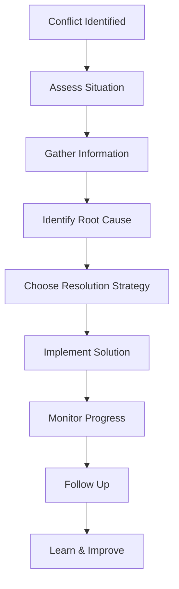
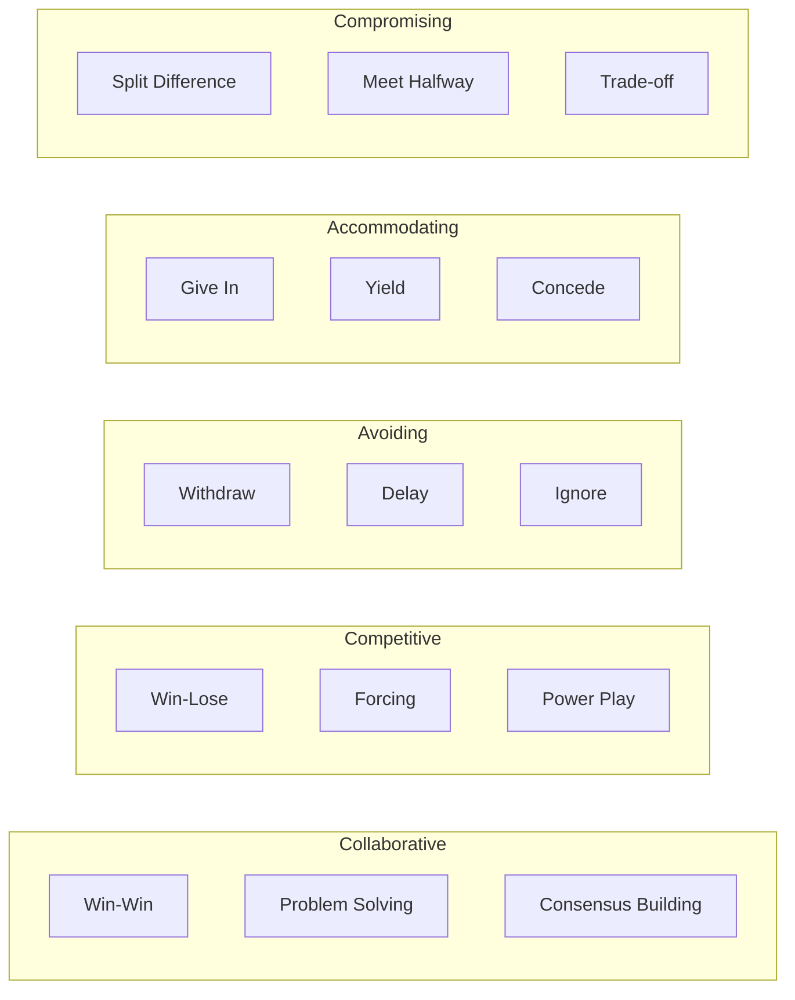

---
# Auto-generated front matter
Title: Conflict Resolution
LastUpdated: 2025-11-06T20:45:58.646150
Tags: []
Status: draft
---

# 🤝 **Conflict Resolution**

## 📘 **Theory**

Conflict resolution is a critical skill in professional environments, especially in high-stakes technical roles. It involves identifying, addressing, and resolving disagreements between team members, stakeholders, or departments in a constructive manner.

### **Why Conflict Resolution Matters**

- **Team Productivity**: Unresolved conflicts can significantly impact team performance
- **Innovation**: Healthy conflict can lead to better solutions and innovation
- **Retention**: Poor conflict resolution leads to high turnover
- **Project Success**: Conflicts can derail projects and timelines
- **Company Culture**: Sets the tone for how disagreements are handled
- **Leadership Development**: Essential skill for technical leaders

### **Types of Conflicts**

1. **Interpersonal**: Personal differences between team members
2. **Technical**: Disagreements about technical approaches or solutions
3. **Resource**: Competition for limited resources or budget
4. **Process**: Disagreements about workflows or methodologies
5. **Priority**: Different views on what should be prioritized
6. **Communication**: Misunderstandings or communication breakdowns

### **Common Pitfalls and Best Practices**

- **Avoiding Conflict**: Can lead to resentment and bigger issues
- **Escalating Too Quickly**: Should try to resolve at the lowest level first
- **Taking Sides**: Should remain neutral and focus on solutions
- **Personal Attacks**: Keep discussions professional and solution-focused
- **Ignoring Root Causes**: Address underlying issues, not just symptoms
- **Poor Communication**: Use active listening and clear communication

## 📊 **Diagrams**

### **Conflict Resolution Process**



### **Conflict Resolution Strategies**



## 🧩 **Example**

**Scenario**: Two senior engineers disagree on the database technology for a new microservice

**Input**:

- Engineer A wants to use PostgreSQL
- Engineer B wants to use MongoDB
- Project deadline is approaching
- Team is divided on the decision

**Expected Output**:

- Consensus on database choice
- Clear rationale for decision
- Team alignment on implementation
- Improved collaboration going forward

**Step-by-step**:

1. Schedule a meeting with both engineers
2. Understand each position and underlying concerns
3. Identify common goals and constraints
4. Explore alternative solutions
5. Make a data-driven decision
6. Communicate decision and rationale
7. Follow up on implementation

## 💻 **Implementation (Golang)**

```go
package main

import (
    "context"
    "fmt"
    "log"
    "time"
)

// Conflict represents a conflict between parties
type Conflict struct {
    ID          string
    Type        string
    Description string
    Parties     []string
    Severity    string
    Status      string
    CreatedAt   time.Time
    ResolvedAt  *time.Time
}

// ConflictResolutionStrategy defines how to resolve conflicts
type ConflictResolutionStrategy interface {
    Resolve(conflict *Conflict) (*Resolution, error)
    GetName() string
}

// Resolution represents a conflict resolution
type Resolution struct {
    ConflictID    string
    Strategy      string
    Solution      string
    Rationale     string
    Implementation string
    Success       bool
    LessonsLearned []string
}

// CollaborativeStrategy uses win-win approach
type CollaborativeStrategy struct {
    mediator *Mediator
}

func (cs *CollaborativeStrategy) Resolve(conflict *Conflict) (*Resolution, error) {
    // Gather information from all parties
    perspectives, err := cs.mediator.GatherPerspectives(conflict)
    if err != nil {
        return nil, err
    }

    // Identify common interests
    commonInterests := cs.mediator.IdentifyCommonInterests(perspectives)

    // Generate creative solutions
    solutions := cs.mediator.GenerateSolutions(conflict, commonInterests)

    // Evaluate solutions
    bestSolution := cs.mediator.EvaluateSolutions(solutions)

    return &Resolution{
        ConflictID:    conflict.ID,
        Strategy:      "Collaborative",
        Solution:      bestSolution.Description,
        Rationale:     bestSolution.Rationale,
        Implementation: bestSolution.Implementation,
        Success:       true,
        LessonsLearned: []string{
            "Collaborative approach led to better solution",
            "All parties felt heard and valued",
            "Solution addressed underlying concerns",
        },
    }, nil
}

func (cs *CollaborativeStrategy) GetName() string {
    return "Collaborative"
}

// CompromisingStrategy uses meet-in-the-middle approach
type CompromisingStrategy struct {
    mediator *Mediator
}

func (cs *CompromisingStrategy) Resolve(conflict *Conflict) (*Resolution, error) {
    // Identify key requirements from each party
    requirements := cs.mediator.IdentifyRequirements(conflict)

    // Find middle ground
    compromise := cs.mediator.FindCompromise(requirements)

    return &Resolution{
        ConflictID:    conflict.ID,
        Strategy:      "Compromising",
        Solution:      compromise.Description,
        Rationale:     compromise.Rationale,
        Implementation: compromise.Implementation,
        Success:       true,
        LessonsLearned: []string{
            "Compromise was necessary due to time constraints",
            "Solution partially satisfies all parties",
            "Future conflicts should be addressed earlier",
        },
    }, nil
}

func (cs *CompromisingStrategy) GetName() string {
    return "Compromising"
}

// Mediator helps resolve conflicts
type Mediator struct {
    strategies map[string]ConflictResolutionStrategy
}

func NewMediator() *Mediator {
    mediator := &Mediator{
        strategies: make(map[string]ConflictResolutionStrategy),
    }

    // Register strategies
    mediator.RegisterStrategy(&CollaborativeStrategy{mediator: mediator})
    mediator.RegisterStrategy(&CompromisingStrategy{mediator: mediator})

    return mediator
}

func (m *Mediator) RegisterStrategy(strategy ConflictResolutionStrategy) {
    m.strategies[strategy.GetName()] = strategy
}

func (m *Mediator) GatherPerspectives(conflict *Conflict) ([]Perspective, error) {
    // Simulate gathering perspectives from all parties
    perspectives := []Perspective{
        {
            Party:       conflict.Parties[0],
            Viewpoint:   "PostgreSQL provides ACID compliance and relational integrity",
            Concerns:    []string{"MongoDB lacks ACID compliance", "Schema changes are complex"},
            Interests:   []string{"Data consistency", "Performance", "Team expertise"},
        },
        {
            Party:       conflict.Parties[1],
            Viewpoint:   "MongoDB provides flexibility and horizontal scaling",
            Concerns:    []string{"PostgreSQL scaling limitations", "Schema rigidity"},
            Interests:   []string{"Scalability", "Flexibility", "Development speed"},
        },
    }

    return perspectives, nil
}

func (m *Mediator) IdentifyCommonInterests(perspectives []Perspective) []string {
    // Find common interests across all perspectives
    commonInterests := []string{
        "System performance",
        "Team productivity",
        "Project success",
        "Maintainability",
    }

    return commonInterests
}

func (m *Mediator) GenerateSolutions(conflict *Conflict, commonInterests []string) []Solution {
    // Generate creative solutions based on common interests
    solutions := []Solution{
        {
            Description: "Use PostgreSQL with read replicas for scaling",
            Rationale:   "Provides ACID compliance with horizontal scaling",
            Implementation: "Implement master-slave replication with read replicas",
            Score:       8,
        },
        {
            Description: "Use MongoDB with transactions for consistency",
            Rationale:   "Provides flexibility with ACID-like consistency",
            Implementation: "Use MongoDB 4.0+ with multi-document transactions",
            Score:       7,
        },
        {
            Description: "Hybrid approach: PostgreSQL for core data, MongoDB for analytics",
            Rationale:   "Best of both worlds for different use cases",
            Implementation: "Use PostgreSQL for transactional data, MongoDB for analytics",
            Score:       9,
        },
    }

    return solutions
}

func (m *Mediator) EvaluateSolutions(solutions []Solution) Solution {
    // Find the best solution based on score
    best := solutions[0]
    for _, solution := range solutions[1:] {
        if solution.Score > best.Score {
            best = solution
        }
    }

    return best
}

func (m *Mediator) IdentifyRequirements(conflict *Conflict) []Requirement {
    // Identify key requirements from each party
    requirements := []Requirement{
        {
            Party:      conflict.Parties[0],
            Priority:   "High",
            Description: "ACID compliance for financial data",
            NonNegotiable: true,
        },
        {
            Party:      conflict.Parties[1],
            Priority:   "High",
            Description: "Horizontal scaling capability",
            NonNegotiable: true,
        },
        {
            Party:      "Project",
            Priority:   "Medium",
            Description: "Implementation within 2 weeks",
            NonNegotiable: false,
        },
    }

    return requirements
}

func (m *Mediator) FindCompromise(requirements []Requirement) Solution {
    // Find a compromise that satisfies most requirements
    return Solution{
        Description: "Use PostgreSQL with connection pooling and caching",
        Rationale:   "Provides ACID compliance with performance optimizations",
        Implementation: "Implement connection pooling, Redis caching, and query optimization",
        Score:       6,
    }
}

// Perspective represents a party's viewpoint
type Perspective struct {
    Party     string
    Viewpoint string
    Concerns  []string
    Interests []string
}

// Solution represents a potential solution
type Solution struct {
    Description    string
    Rationale      string
    Implementation string
    Score          int
}

// Requirement represents a party's requirement
type Requirement struct {
    Party         string
    Priority      string
    Description   string
    NonNegotiable bool
}

// ConflictResolver manages conflict resolution
type ConflictResolver struct {
    mediator *Mediator
    conflicts map[string]*Conflict
}

func NewConflictResolver() *ConflictResolver {
    return &ConflictResolver{
        mediator:  NewMediator(),
        conflicts: make(map[string]*Conflict),
    }
}

func (cr *ConflictResolver) CreateConflict(id, conflictType, description string, parties []string, severity string) *Conflict {
    conflict := &Conflict{
        ID:          id,
        Type:        conflictType,
        Description: description,
        Parties:     parties,
        Severity:    severity,
        Status:      "Open",
        CreatedAt:   time.Now(),
    }

    cr.conflicts[id] = conflict
    return conflict
}

func (cr *ConflictResolver) ResolveConflict(conflictID string, strategyName string) (*Resolution, error) {
    conflict, exists := cr.conflicts[conflictID]
    if !exists {
        return nil, fmt.Errorf("conflict not found: %s", conflictID)
    }

    strategy, exists := cr.mediator.strategies[strategyName]
    if !exists {
        return nil, fmt.Errorf("strategy not found: %s", strategyName)
    }

    resolution, err := strategy.Resolve(conflict)
    if err != nil {
        return nil, err
    }

    // Update conflict status
    conflict.Status = "Resolved"
    now := time.Now()
    conflict.ResolvedAt = &now

    return resolution, nil
}

func (cr *ConflictResolver) GetConflicts() []*Conflict {
    conflicts := make([]*Conflict, 0, len(cr.conflicts))
    for _, conflict := range cr.conflicts {
        conflicts = append(conflicts, conflict)
    }
    return conflicts
}

func (cr *ConflictResolver) GetConflictsByStatus(status string) []*Conflict {
    var filtered []*Conflict
    for _, conflict := range cr.conflicts {
        if conflict.Status == status {
            filtered = append(filtered, conflict)
        }
    }
    return filtered
}

// Example usage
func main() {
    // Create conflict resolver
    resolver := NewConflictResolver()

    // Create a technical conflict
    conflict := resolver.CreateConflict(
        "tech-001",
        "Technical",
        "Database technology choice for new microservice",
        []string{"Engineer A", "Engineer B"},
        "Medium",
    )

    fmt.Printf("Created conflict: %s\n", conflict.ID)

    // Resolve using collaborative strategy
    resolution, err := resolver.ResolveConflict(conflict.ID, "Collaborative")
    if err != nil {
        log.Fatal(err)
    }

    fmt.Printf("Resolution: %s\n", resolution.Solution)
    fmt.Printf("Strategy: %s\n", resolution.Strategy)
    fmt.Printf("Success: %t\n", resolution.Success)

    // Resolve using compromising strategy
    conflict2 := resolver.CreateConflict(
        "tech-002",
        "Technical",
        "API design approach",
        []string{"Frontend Team", "Backend Team"},
        "Low",
    )

    resolution2, err := resolver.ResolveConflict(conflict2.ID, "Compromising")
    if err != nil {
        log.Fatal(err)
    }

    fmt.Printf("Resolution 2: %s\n", resolution2.Solution)
    fmt.Printf("Strategy 2: %s\n", resolution2.Strategy)

    // Get all conflicts
    conflicts := resolver.GetConflicts()
    fmt.Printf("Total conflicts: %d\n", len(conflicts))

    // Get open conflicts
    openConflicts := resolver.GetConflictsByStatus("Open")
    fmt.Printf("Open conflicts: %d\n", len(openConflicts))
}
```

## 💻 **Implementation (Node.js)**

```javascript
const EventEmitter = require("events");

// Conflict represents a conflict between parties
class Conflict {
  constructor(id, type, description, parties, severity) {
    this.id = id;
    this.type = type;
    this.description = description;
    this.parties = parties;
    this.severity = severity;
    this.status = "Open";
    this.createdAt = new Date();
    this.resolvedAt = null;
  }
}

// Resolution represents a conflict resolution
class Resolution {
  constructor(
    conflictId,
    strategy,
    solution,
    rationale,
    implementation,
    success,
    lessonsLearned
  ) {
    this.conflictId = conflictId;
    this.strategy = strategy;
    this.solution = solution;
    this.rationale = rationale;
    this.implementation = implementation;
    this.success = success;
    this.lessonsLearned = lessonsLearned;
  }
}

// ConflictResolutionStrategy defines how to resolve conflicts
class ConflictResolutionStrategy {
  resolve(conflict) {
    throw new Error("Must implement resolve method");
  }

  getName() {
    throw new Error("Must implement getName method");
  }
}

// CollaborativeStrategy uses win-win approach
class CollaborativeStrategy extends ConflictResolutionStrategy {
  constructor(mediator) {
    super();
    this.mediator = mediator;
  }

  async resolve(conflict) {
    // Gather information from all parties
    const perspectives = await this.mediator.gatherPerspectives(conflict);

    // Identify common interests
    const commonInterests = this.mediator.identifyCommonInterests(perspectives);

    // Generate creative solutions
    const solutions = this.mediator.generateSolutions(
      conflict,
      commonInterests
    );

    // Evaluate solutions
    const bestSolution = this.mediator.evaluateSolutions(solutions);

    return new Resolution(
      conflict.id,
      "Collaborative",
      bestSolution.description,
      bestSolution.rationale,
      bestSolution.implementation,
      true,
      [
        "Collaborative approach led to better solution",
        "All parties felt heard and valued",
        "Solution addressed underlying concerns",
      ]
    );
  }

  getName() {
    return "Collaborative";
  }
}

// CompromisingStrategy uses meet-in-the-middle approach
class CompromisingStrategy extends ConflictResolutionStrategy {
  constructor(mediator) {
    super();
    this.mediator = mediator;
  }

  async resolve(conflict) {
    // Identify key requirements from each party
    const requirements = this.mediator.identifyRequirements(conflict);

    // Find middle ground
    const compromise = this.mediator.findCompromise(requirements);

    return new Resolution(
      conflict.id,
      "Compromising",
      compromise.description,
      compromise.rationale,
      compromise.implementation,
      true,
      [
        "Compromise was necessary due to time constraints",
        "Solution partially satisfies all parties",
        "Future conflicts should be addressed earlier",
      ]
    );
  }

  getName() {
    return "Compromising";
  }
}

// Mediator helps resolve conflicts
class Mediator {
  constructor() {
    this.strategies = new Map();
  }

  registerStrategy(strategy) {
    this.strategies.set(strategy.getName(), strategy);
  }

  async gatherPerspectives(conflict) {
    // Simulate gathering perspectives from all parties
    const perspectives = [
      {
        party: conflict.parties[0],
        viewpoint:
          "PostgreSQL provides ACID compliance and relational integrity",
        concerns: [
          "MongoDB lacks ACID compliance",
          "Schema changes are complex",
        ],
        interests: ["Data consistency", "Performance", "Team expertise"],
      },
      {
        party: conflict.parties[1],
        viewpoint: "MongoDB provides flexibility and horizontal scaling",
        concerns: ["PostgreSQL scaling limitations", "Schema rigidity"],
        interests: ["Scalability", "Flexibility", "Development speed"],
      },
    ];

    return perspectives;
  }

  identifyCommonInterests(perspectives) {
    // Find common interests across all perspectives
    const commonInterests = [
      "System performance",
      "Team productivity",
      "Project success",
      "Maintainability",
    ];

    return commonInterests;
  }

  generateSolutions(conflict, commonInterests) {
    // Generate creative solutions based on common interests
    const solutions = [
      {
        description: "Use PostgreSQL with read replicas for scaling",
        rationale: "Provides ACID compliance with horizontal scaling",
        implementation: "Implement master-slave replication with read replicas",
        score: 8,
      },
      {
        description: "Use MongoDB with transactions for consistency",
        rationale: "Provides flexibility with ACID-like consistency",
        implementation: "Use MongoDB 4.0+ with multi-document transactions",
        score: 7,
      },
      {
        description:
          "Hybrid approach: PostgreSQL for core data, MongoDB for analytics",
        rationale: "Best of both worlds for different use cases",
        implementation:
          "Use PostgreSQL for transactional data, MongoDB for analytics",
        score: 9,
      },
    ];

    return solutions;
  }

  evaluateSolutions(solutions) {
    // Find the best solution based on score
    let best = solutions[0];
    for (const solution of solutions.slice(1)) {
      if (solution.score > best.score) {
        best = solution;
      }
    }

    return best;
  }

  identifyRequirements(conflict) {
    // Identify key requirements from each party
    const requirements = [
      {
        party: conflict.parties[0],
        priority: "High",
        description: "ACID compliance for financial data",
        nonNegotiable: true,
      },
      {
        party: conflict.parties[1],
        priority: "High",
        description: "Horizontal scaling capability",
        nonNegotiable: true,
      },
      {
        party: "Project",
        priority: "Medium",
        description: "Implementation within 2 weeks",
        nonNegotiable: false,
      },
    ];

    return requirements;
  }

  findCompromise(requirements) {
    // Find a compromise that satisfies most requirements
    return {
      description: "Use PostgreSQL with connection pooling and caching",
      rationale: "Provides ACID compliance with performance optimizations",
      implementation:
        "Implement connection pooling, Redis caching, and query optimization",
      score: 6,
    };
  }
}

// ConflictResolver manages conflict resolution
class ConflictResolver extends EventEmitter {
  constructor() {
    super();
    this.mediator = new Mediator();
    this.conflicts = new Map();

    // Register strategies
    this.mediator.registerStrategy(new CollaborativeStrategy(this.mediator));
    this.mediator.registerStrategy(new CompromisingStrategy(this.mediator));
  }

  createConflict(id, type, description, parties, severity) {
    const conflict = new Conflict(id, type, description, parties, severity);
    this.conflicts.set(id, conflict);

    this.emit("conflictCreated", conflict);
    return conflict;
  }

  async resolveConflict(conflictId, strategyName) {
    const conflict = this.conflicts.get(conflictId);
    if (!conflict) {
      throw new Error(`Conflict not found: ${conflictId}`);
    }

    const strategy = this.mediator.strategies.get(strategyName);
    if (!strategy) {
      throw new Error(`Strategy not found: ${strategyName}`);
    }

    try {
      const resolution = await strategy.resolve(conflict);

      // Update conflict status
      conflict.status = "Resolved";
      conflict.resolvedAt = new Date();

      this.emit("conflictResolved", { conflict, resolution });
      return resolution;
    } catch (error) {
      this.emit("conflictResolutionFailed", { conflict, error });
      throw error;
    }
  }

  getConflicts() {
    return Array.from(this.conflicts.values());
  }

  getConflictsByStatus(status) {
    return Array.from(this.conflicts.values()).filter(
      (conflict) => conflict.status === status
    );
  }

  getConflictsByType(type) {
    return Array.from(this.conflicts.values()).filter(
      (conflict) => conflict.type === type
    );
  }

  getConflictsBySeverity(severity) {
    return Array.from(this.conflicts.values()).filter(
      (conflict) => conflict.severity === severity
    );
  }
}

// Example usage
async function main() {
  // Create conflict resolver
  const resolver = new ConflictResolver();

  // Listen for events
  resolver.on("conflictCreated", (conflict) => {
    console.log(`Conflict created: ${conflict.id} - ${conflict.description}`);
  });

  resolver.on("conflictResolved", ({ conflict, resolution }) => {
    console.log(`Conflict resolved: ${conflict.id} - ${resolution.solution}`);
  });

  resolver.on("conflictResolutionFailed", ({ conflict, error }) => {
    console.error(
      `Conflict resolution failed: ${conflict.id} - ${error.message}`
    );
  });

  // Create a technical conflict
  const conflict = resolver.createConflict(
    "tech-001",
    "Technical",
    "Database technology choice for new microservice",
    ["Engineer A", "Engineer B"],
    "Medium"
  );

  // Resolve using collaborative strategy
  try {
    const resolution = await resolver.resolveConflict(
      conflict.id,
      "Collaborative"
    );
    console.log("Resolution:", resolution.solution);
    console.log("Strategy:", resolution.strategy);
    console.log("Success:", resolution.success);
  } catch (error) {
    console.error("Error resolving conflict:", error.message);
  }

  // Create another conflict
  const conflict2 = resolver.createConflict(
    "tech-002",
    "Technical",
    "API design approach",
    ["Frontend Team", "Backend Team"],
    "Low"
  );

  // Resolve using compromising strategy
  try {
    const resolution2 = await resolver.resolveConflict(
      conflict2.id,
      "Compromising"
    );
    console.log("Resolution 2:", resolution2.solution);
    console.log("Strategy 2:", resolution2.strategy);
  } catch (error) {
    console.error("Error resolving conflict 2:", error.message);
  }

  // Get all conflicts
  const conflicts = resolver.getConflicts();
  console.log(`Total conflicts: ${conflicts.length}`);

  // Get open conflicts
  const openConflicts = resolver.getConflictsByStatus("Open");
  console.log(`Open conflicts: ${openConflicts.length}`);
}

// Run the example
main().catch(console.error);
```

## ⏱ **Complexity Analysis**

### **Time Complexity**

- **Conflict Creation**: O(1)
- **Perspective Gathering**: O(n) where n is number of parties
- **Solution Generation**: O(m) where m is number of potential solutions
- **Solution Evaluation**: O(m) where m is number of solutions
- **Conflict Resolution**: O(n + m) where n is parties, m is solutions

### **Space Complexity**

- **Conflict Storage**: O(n) where n is number of conflicts
- **Perspective Storage**: O(p) where p is number of parties
- **Solution Storage**: O(s) where s is number of solutions
- **Resolution Storage**: O(r) where r is number of resolutions

## 🚀 **Optimal Solution**

The optimal conflict resolution approach includes:

1. **Early Detection**: Identify conflicts before they escalate
2. **Structured Process**: Use a consistent approach for all conflicts
3. **Multiple Strategies**: Have different approaches for different situations
4. **Documentation**: Record resolutions and lessons learned
5. **Follow-up**: Monitor implementation and outcomes
6. **Continuous Improvement**: Learn from each conflict resolution

### **Production Considerations**

- Use appropriate strategy for each conflict type
- Document all resolutions and outcomes
- Train team members on conflict resolution
- Establish clear escalation procedures
- Monitor conflict patterns and trends
- Implement preventive measures

## ❓ **Follow-up Questions**

### **How would this scale with X?**

- **Large Teams**: Use hierarchical conflict resolution
- **Remote Teams**: Use virtual mediation and communication tools
- **Multiple Projects**: Use project-specific conflict resolution processes

### **How can we optimize further if Y changes?**

- **Time Constraints**: Use faster resolution strategies
- **Resource Limitations**: Use more efficient mediation approaches
- **Cultural Differences**: Adapt strategies to different cultures

### **What trade-offs exist in different approaches?**

- **Speed vs Quality**: Quick resolution vs thorough analysis
- **Consensus vs Decision**: Team agreement vs leadership decision
- **Formal vs Informal**: Structured process vs casual discussion
