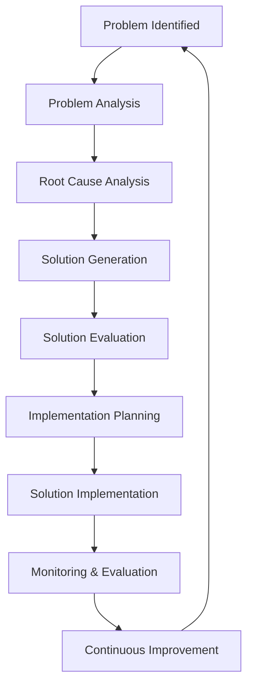
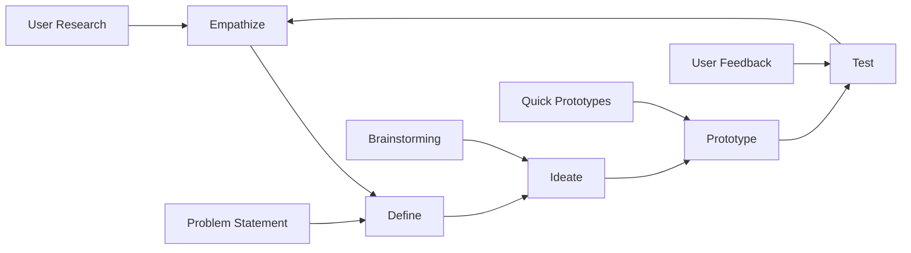
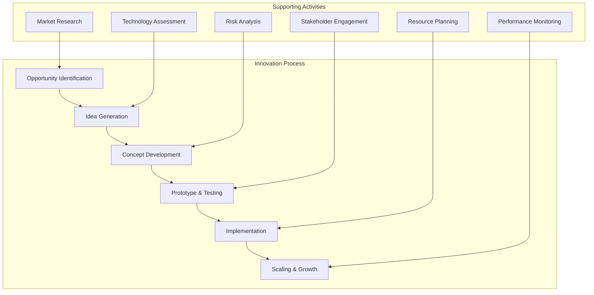

---
# Auto-generated front matter
Title: Problem Solving Innovation
LastUpdated: 2025-11-06T20:45:58.650481
Tags: []
Status: draft
---

# 🧩 **Problem Solving & Innovation**

## 📘 **Theory**

Problem solving and innovation are critical skills in technical leadership roles. They involve identifying challenges, analyzing root causes, generating creative solutions, and implementing effective strategies to drive business value and technical excellence.

### **Why Problem Solving & Innovation Matter**

- **Business Value**: Drive innovation that creates competitive advantage
- **Technical Excellence**: Solve complex technical challenges effectively
- **Team Growth**: Develop problem-solving capabilities in team members
- **Process Improvement**: Continuously improve development processes
- **Customer Satisfaction**: Deliver solutions that meet customer needs
- **Cost Optimization**: Find efficient solutions that reduce costs
- **Risk Mitigation**: Proactively identify and address potential issues
- **Strategic Thinking**: Align technical solutions with business strategy

### **Key Concepts**

1. **Problem Identification**: Recognizing and defining problems clearly
2. **Root Cause Analysis**: Understanding underlying causes of problems
3. **Creative Thinking**: Generating innovative solutions
4. **Solution Design**: Designing effective and feasible solutions
5. **Implementation Planning**: Planning and executing solutions
6. **Risk Assessment**: Evaluating potential risks and mitigation strategies
7. **Stakeholder Management**: Engaging relevant stakeholders
8. **Continuous Improvement**: Learning from solutions and iterating

### **Problem-Solving Frameworks**

1. **5 Whys**: Asking "why" five times to find root cause
2. **Fishbone Diagram**: Visualizing cause-and-effect relationships
3. **SWOT Analysis**: Analyzing strengths, weaknesses, opportunities, threats
4. **Design Thinking**: Human-centered approach to innovation
5. **Lean Startup**: Build-measure-learn cycle for innovation
6. **Agile Problem Solving**: Iterative and collaborative approach
7. **Systems Thinking**: Understanding interconnections and dependencies
8. **TRIZ**: Theory of Inventive Problem Solving

### **Common Pitfalls and Best Practices**

- **Jumping to Solutions**: Take time to understand the problem
- **Ignoring Stakeholders**: Involve relevant stakeholders early
- **Over-engineering**: Keep solutions simple and practical
- **Poor Communication**: Communicate clearly and regularly
- **Lack of Testing**: Test solutions before full implementation
- **Ignoring Feedback**: Incorporate feedback and iterate
- **Scope Creep**: Manage scope and stay focused
- **Insufficient Planning**: Plan thoroughly before implementation

## 📊 **Diagrams**

### **Problem-Solving Process**



### **Design Thinking Process**



### **Innovation Framework**



## 🧩 **Example**

**Scenario**: Solve a performance issue in a microservices architecture

**Input**:

- System experiencing high latency
- Multiple microservices involved
- Complex dependencies between services
- Business impact: Customer complaints and revenue loss

**Expected Output**:

- Root cause analysis
- Innovative solution design
- Implementation plan
- Risk mitigation strategy
- Success metrics and monitoring

**Step-by-step**:

1. Identify and analyze the performance problem
2. Conduct root cause analysis
3. Generate innovative solutions
4. Evaluate and select best solution
5. Plan implementation strategy
6. Implement solution with monitoring
7. Evaluate results and iterate

## 💻 **Implementation (Golang)**

```go
package main

import (
    "context"
    "fmt"
    "log"
    "time"
)

// Problem represents a problem to be solved
type Problem struct {
    ID          string
    Title       string
    Description string
    Priority    string
    Impact      string
    Stakeholders []string
    Status      string
    CreatedAt   time.Time
    UpdatedAt   time.Time
}

// Solution represents a solution to a problem
type Solution struct {
    ID          string
    ProblemID   string
    Title       string
    Description string
    Approach    string
    Benefits    []string
    Risks       []string
    Effort      string
    Timeline    string
    Status      string
    CreatedAt   time.Time
}

// Innovation represents an innovation initiative
type Innovation struct {
    ID          string
    Title       string
    Description string
    Category    string
    Status      string
    Owner       string
    Team        []string
    Budget      float64
    Timeline    string
    CreatedAt   time.Time
}

// ProblemSolver handles problem solving and innovation
type ProblemSolver struct {
    problems   map[string]*Problem
    solutions  map[string]*Solution
    innovations map[string]*Innovation
    metrics    *InnovationMetrics
}

// InnovationMetrics tracks innovation metrics
type InnovationMetrics struct {
    ProblemsSolved    int
    SolutionsImplemented int
    InnovationsLaunched int
    SuccessRate       float64
    AverageTimeToSolve time.Duration
    CostSavings       float64
    RevenueGenerated  float64
}

// NewProblemSolver creates a new problem solver
func NewProblemSolver() *ProblemSolver {
    return &ProblemSolver{
        problems:    make(map[string]*Problem),
        solutions:   make(map[string]*Solution),
        innovations: make(map[string]*Innovation),
        metrics:     &InnovationMetrics{},
    }
}

// IdentifyProblem identifies a new problem
func (ps *ProblemSolver) IdentifyProblem(title, description, priority, impact string, stakeholders []string) *Problem {
    problem := &Problem{
        ID:          generateID(),
        Title:       title,
        Description: description,
        Priority:    priority,
        Impact:      impact,
        Stakeholders: stakeholders,
        Status:      "Identified",
        CreatedAt:   time.Now(),
        UpdatedAt:   time.Now(),
    }

    ps.problems[problem.ID] = problem
    return problem
}

// AnalyzeProblem analyzes a problem using various frameworks
func (ps *ProblemSolver) AnalyzeProblem(problemID string) (*ProblemAnalysis, error) {
    problem, exists := ps.problems[problemID]
    if !exists {
        return nil, fmt.Errorf("problem not found: %s", problemID)
    }

    analysis := &ProblemAnalysis{
        ProblemID:    problemID,
        RootCauses:   ps.performRootCauseAnalysis(problem),
        Impact:       ps.assessImpact(problem),
        Constraints:  ps.identifyConstraints(problem),
        Opportunities: ps.identifyOpportunities(problem),
        Stakeholders: ps.analyzeStakeholders(problem),
    }

    return analysis, nil
}

// GenerateSolutions generates solutions for a problem
func (ps *ProblemSolver) GenerateSolutions(problemID string) ([]*Solution, error) {
    problem, exists := ps.problems[problemID]
    if !exists {
        return nil, fmt.Errorf("problem not found: %s", problemID)
    }

    solutions := []*Solution{
        ps.generateQuickFix(problem),
        ps.generateSystematicSolution(problem),
        ps.generateInnovativeSolution(problem),
        ps.generateLongTermSolution(problem),
    }

    // Store solutions
    for _, solution := range solutions {
        ps.solutions[solution.ID] = solution
    }

    return solutions, nil
}

// generateQuickFix generates a quick fix solution
func (ps *ProblemSolver) generateQuickFix(problem *Problem) *Solution {
    return &Solution{
        ID:          generateID(),
        ProblemID:   problem.ID,
        Title:       "Quick Fix",
        Description: "Immediate solution to address the problem",
        Approach:    "Band-aid approach with minimal changes",
        Benefits:    []string{"Fast implementation", "Immediate relief", "Low cost"},
        Risks:       []string{"May not address root cause", "Technical debt", "Temporary solution"},
        Effort:      "Low",
        Timeline:    "1-2 days",
        Status:      "Proposed",
        CreatedAt:   time.Now(),
    }
}

// generateSystematicSolution generates a systematic solution
func (ps *ProblemSolver) generateSystematicSolution(problem *Problem) *Solution {
    return &Solution{
        ID:          generateID(),
        ProblemID:   problem.ID,
        Title:       "Systematic Solution",
        Description: "Comprehensive solution addressing root causes",
        Approach:    "Structured approach with proper analysis",
        Benefits:    []string{"Addresses root cause", "Sustainable solution", "Improves system"},
        Risks:       []string{"Higher cost", "Longer timeline", "More complex"},
        Effort:      "Medium",
        Timeline:    "2-4 weeks",
        Status:      "Proposed",
        CreatedAt:   time.Now(),
    }
}

// generateInnovativeSolution generates an innovative solution
func (ps *ProblemSolver) generateInnovativeSolution(problem *Problem) *Solution {
    return &Solution{
        ID:          generateID(),
        ProblemID:   problem.ID,
        Title:       "Innovative Solution",
        Description: "Creative solution using new technologies or approaches",
        Approach:    "Innovative approach with cutting-edge technology",
        Benefits:    []string{"Competitive advantage", "Future-proof", "Scalable"},
        Risks:       []string{"Unproven technology", "Higher risk", "Learning curve"},
        Effort:      "High",
        Timeline:    "1-3 months",
        Status:      "Proposed",
        CreatedAt:   time.Now(),
    }
}

// generateLongTermSolution generates a long-term solution
func (ps *ProblemSolver) generateLongTermSolution(problem *Problem) *Solution {
    return &Solution{
        ID:          generateID(),
        ProblemID:   problem.ID,
        Title:       "Long-term Solution",
        Description: "Strategic solution with long-term benefits",
        Approach:    "Strategic approach with architectural changes",
        Benefits:    []string{"Long-term benefits", "Strategic alignment", "Scalable architecture"},
        Risks:       []string{"High cost", "Long timeline", "Complex implementation"},
        Effort:      "Very High",
        Timeline:    "3-6 months",
        Status:      "Proposed",
        CreatedAt:   time.Now(),
    }
}

// EvaluateSolution evaluates a solution
func (ps *ProblemSolver) EvaluateSolution(solutionID string) (*SolutionEvaluation, error) {
    solution, exists := ps.solutions[solutionID]
    if !exists {
        return nil, fmt.Errorf("solution not found: %s", solutionID)
    }

    evaluation := &SolutionEvaluation{
        SolutionID:     solutionID,
        Feasibility:    ps.assessFeasibility(solution),
        CostBenefit:    ps.assessCostBenefit(solution),
        RiskLevel:      ps.assessRisk(solution),
        Timeline:       ps.assessTimeline(solution),
        ResourceNeeds:  ps.assessResourceNeeds(solution),
        Dependencies:   ps.assessDependencies(solution),
        SuccessFactors: ps.identifySuccessFactors(solution),
    }

    return evaluation, nil
}

// ImplementSolution implements a solution
func (ps *ProblemSolver) ImplementSolution(solutionID string) error {
    solution, exists := ps.solutions[solutionID]
    if !exists {
        return fmt.Errorf("solution not found: %s", solutionID)
    }

    // Update solution status
    solution.Status = "In Progress"

    // Simulate implementation
    time.Sleep(100 * time.Millisecond)

    // Update solution status
    solution.Status = "Implemented"

    // Update metrics
    ps.metrics.SolutionsImplemented++

    return nil
}

// CreateInnovation creates a new innovation initiative
func (ps *ProblemSolver) CreateInnovation(title, description, category, owner string, team []string, budget float64, timeline string) *Innovation {
    innovation := &Innovation{
        ID:          generateID(),
        Title:       title,
        Description: description,
        Category:    category,
        Status:      "Proposed",
        Owner:       owner,
        Team:        team,
        Budget:      budget,
        Timeline:    timeline,
        CreatedAt:   time.Now(),
    }

    ps.innovations[innovation.ID] = innovation
    return innovation
}

// LaunchInnovation launches an innovation initiative
func (ps *ProblemSolver) LaunchInnovation(innovationID string) error {
    innovation, exists := ps.innovations[innovationID]
    if !exists {
        return fmt.Errorf("innovation not found: %s", innovationID)
    }

    innovation.Status = "Launched"
    ps.metrics.InnovationsLaunched++

    return nil
}

// GetInnovationMetrics returns innovation metrics
func (ps *ProblemSolver) GetInnovationMetrics() *InnovationMetrics {
    return ps.metrics
}

// Helper methods for problem analysis
func (ps *ProblemSolver) performRootCauseAnalysis(problem *Problem) []string {
    // Simulate root cause analysis
    return []string{
        "Insufficient performance monitoring",
        "Inefficient database queries",
        "Lack of caching strategy",
        "Poor resource allocation",
    }
}

func (ps *ProblemSolver) assessImpact(problem *Problem) string {
    // Simulate impact assessment
    return "High - Affects customer experience and revenue"
}

func (ps *ProblemSolver) identifyConstraints(problem *Problem) []string {
    // Simulate constraint identification
    return []string{
        "Limited budget",
        "Tight timeline",
        "Resource constraints",
        "Technical limitations",
    }
}

func (ps *ProblemSolver) identifyOpportunities(problem *Problem) []string {
    // Simulate opportunity identification
    return []string{
        "Improve system architecture",
        "Implement better monitoring",
        "Optimize database performance",
        "Enhance user experience",
    }
}

func (ps *ProblemSolver) analyzeStakeholders(problem *Problem) map[string]string {
    // Simulate stakeholder analysis
    return map[string]string{
        "Customers": "High impact, high influence",
        "Development Team": "High impact, high influence",
        "Management": "Medium impact, high influence",
        "Support Team": "Medium impact, medium influence",
    }
}

// Helper methods for solution evaluation
func (ps *ProblemSolver) assessFeasibility(solution *Solution) string {
    // Simulate feasibility assessment
    switch solution.Effort {
    case "Low":
        return "High"
    case "Medium":
        return "Medium"
    case "High":
        return "Low"
    default:
        return "Very Low"
    }
}

func (ps *ProblemSolver) assessCostBenefit(solution *Solution) string {
    // Simulate cost-benefit assessment
    return "Positive ROI expected"
}

func (ps *ProblemSolver) assessRisk(solution *Solution) string {
    // Simulate risk assessment
    switch solution.Effort {
    case "Low":
        return "Low"
    case "Medium":
        return "Medium"
    case "High":
        return "High"
    default:
        return "Very High"
    }
}

func (ps *ProblemSolver) assessTimeline(solution *Solution) string {
    return solution.Timeline
}

func (ps *ProblemSolver) assessResourceNeeds(solution *Solution) []string {
    // Simulate resource needs assessment
    return []string{
        "Development team",
        "Infrastructure resources",
        "Testing resources",
        "Project management",
    }
}

func (ps *ProblemSolver) assessDependencies(solution *Solution) []string {
    // Simulate dependencies assessment
    return []string{
        "Database migration",
        "Infrastructure changes",
        "Third-party integrations",
        "Team training",
    }
}

func (ps *ProblemSolver) identifySuccessFactors(solution *Solution) []string {
    // Simulate success factors identification
    return []string{
        "Strong project management",
        "Adequate resources",
        "Stakeholder buy-in",
        "Technical expertise",
        "Clear communication",
    }
}

// Data structures for analysis results
type ProblemAnalysis struct {
    ProblemID     string
    RootCauses    []string
    Impact        string
    Constraints   []string
    Opportunities []string
    Stakeholders  map[string]string
}

type SolutionEvaluation struct {
    SolutionID     string
    Feasibility    string
    CostBenefit    string
    RiskLevel      string
    Timeline       string
    ResourceNeeds  []string
    Dependencies   []string
    SuccessFactors []string
}

// Helper function to generate IDs
func generateID() string {
    return fmt.Sprintf("%d", time.Now().UnixNano())
}

// Example usage
func main() {
    // Create problem solver
    solver := NewProblemSolver()

    // Identify a problem
    problem := solver.IdentifyProblem(
        "High Latency in Microservices",
        "Customer-facing services experiencing high latency causing poor user experience",
        "High",
        "Revenue loss and customer complaints",
        []string{"Customers", "Development Team", "Management"},
    )

    fmt.Printf("Identified problem: %s\n", problem.Title)

    // Analyze the problem
    analysis, err := solver.AnalyzeProblem(problem.ID)
    if err != nil {
        log.Fatal(err)
    }

    fmt.Printf("Root causes: %v\n", analysis.RootCauses)
    fmt.Printf("Impact: %s\n", analysis.Impact)

    // Generate solutions
    solutions, err := solver.GenerateSolutions(problem.ID)
    if err != nil {
        log.Fatal(err)
    }

    fmt.Printf("Generated %d solutions:\n", len(solutions))
    for _, solution := range solutions {
        fmt.Printf("- %s (%s effort, %s timeline)\n", solution.Title, solution.Effort, solution.Timeline)
    }

    // Evaluate solutions
    for _, solution := range solutions {
        evaluation, err := solver.EvaluateSolution(solution.ID)
        if err != nil {
            log.Fatal(err)
        }

        fmt.Printf("\nSolution: %s\n", solution.Title)
        fmt.Printf("Feasibility: %s\n", evaluation.Feasibility)
        fmt.Printf("Risk Level: %s\n", evaluation.RiskLevel)
        fmt.Printf("Timeline: %s\n", evaluation.Timeline)
    }

    // Implement a solution
    if len(solutions) > 0 {
        err := solver.ImplementSolution(solutions[0].ID)
        if err != nil {
            log.Fatal(err)
        }
        fmt.Printf("\nImplemented solution: %s\n", solutions[0].Title)
    }

    // Create innovation initiative
    innovation := solver.CreateInnovation(
        "AI-Powered Performance Optimization",
        "Use machine learning to predict and prevent performance issues",
        "Technology",
        "Tech Lead",
        []string{"ML Engineer", "DevOps Engineer", "Backend Developer"},
        100000.0,
        "6 months",
    )

    fmt.Printf("\nCreated innovation: %s\n", innovation.Title)

    // Launch innovation
    err = solver.LaunchInnovation(innovation.ID)
    if err != nil {
        log.Fatal(err)
    }
    fmt.Printf("Launched innovation: %s\n", innovation.Title)

    // Get metrics
    metrics := solver.GetInnovationMetrics()
    fmt.Printf("\nInnovation Metrics:\n")
    fmt.Printf("Problems Solved: %d\n", metrics.ProblemsSolved)
    fmt.Printf("Solutions Implemented: %d\n", metrics.SolutionsImplemented)
    fmt.Printf("Innovations Launched: %d\n", metrics.InnovationsLaunched)
}
```

## 💻 **Implementation (Node.js)**

```javascript
class Problem {
  constructor(id, title, description, priority, impact, stakeholders) {
    this.id = id;
    this.title = title;
    this.description = description;
    this.priority = priority;
    this.impact = impact;
    this.stakeholders = stakeholders;
    this.status = "Identified";
    this.createdAt = new Date();
    this.updatedAt = new Date();
  }
}

class Solution {
  constructor(
    id,
    problemId,
    title,
    description,
    approach,
    benefits,
    risks,
    effort,
    timeline
  ) {
    this.id = id;
    this.problemId = problemId;
    this.title = title;
    this.description = description;
    this.approach = approach;
    this.benefits = benefits;
    this.risks = risks;
    this.effort = effort;
    this.timeline = timeline;
    this.status = "Proposed";
    this.createdAt = new Date();
  }
}

class Innovation {
  constructor(id, title, description, category, owner, team, budget, timeline) {
    this.id = id;
    this.title = title;
    this.description = description;
    this.category = category;
    this.status = "Proposed";
    this.owner = owner;
    this.team = team;
    this.budget = budget;
    this.timeline = timeline;
    this.createdAt = new Date();
  }
}

class InnovationMetrics {
  constructor() {
    this.problemsSolved = 0;
    this.solutionsImplemented = 0;
    this.innovationsLaunched = 0;
    this.successRate = 0;
    this.averageTimeToSolve = 0;
    this.costSavings = 0;
    this.revenueGenerated = 0;
  }
}

class ProblemSolver {
  constructor() {
    this.problems = new Map();
    this.solutions = new Map();
    this.innovations = new Map();
    this.metrics = new InnovationMetrics();
  }

  identifyProblem(title, description, priority, impact, stakeholders) {
    const problem = new Problem(
      this.generateID(),
      title,
      description,
      priority,
      impact,
      stakeholders
    );

    this.problems.set(problem.id, problem);
    return problem;
  }

  analyzeProblem(problemId) {
    const problem = this.problems.get(problemId);
    if (!problem) {
      throw new Error(`Problem not found: ${problemId}`);
    }

    return {
      problemId,
      rootCauses: this.performRootCauseAnalysis(problem),
      impact: this.assessImpact(problem),
      constraints: this.identifyConstraints(problem),
      opportunities: this.identifyOpportunities(problem),
      stakeholders: this.analyzeStakeholders(problem),
    };
  }

  generateSolutions(problemId) {
    const problem = this.problems.get(problemId);
    if (!problem) {
      throw new Error(`Problem not found: ${problemId}`);
    }

    const solutions = [
      this.generateQuickFix(problem),
      this.generateSystematicSolution(problem),
      this.generateInnovativeSolution(problem),
      this.generateLongTermSolution(problem),
    ];

    // Store solutions
    solutions.forEach((solution) => {
      this.solutions.set(solution.id, solution);
    });

    return solutions;
  }

  generateQuickFix(problem) {
    return new Solution(
      this.generateID(),
      problem.id,
      "Quick Fix",
      "Immediate solution to address the problem",
      "Band-aid approach with minimal changes",
      ["Fast implementation", "Immediate relief", "Low cost"],
      ["May not address root cause", "Technical debt", "Temporary solution"],
      "Low",
      "1-2 days"
    );
  }

  generateSystematicSolution(problem) {
    return new Solution(
      this.generateID(),
      problem.id,
      "Systematic Solution",
      "Comprehensive solution addressing root causes",
      "Structured approach with proper analysis",
      ["Addresses root cause", "Sustainable solution", "Improves system"],
      ["Higher cost", "Longer timeline", "More complex"],
      "Medium",
      "2-4 weeks"
    );
  }

  generateInnovativeSolution(problem) {
    return new Solution(
      this.generateID(),
      problem.id,
      "Innovative Solution",
      "Creative solution using new technologies or approaches",
      "Innovative approach with cutting-edge technology",
      ["Competitive advantage", "Future-proof", "Scalable"],
      ["Unproven technology", "Higher risk", "Learning curve"],
      "High",
      "1-3 months"
    );
  }

  generateLongTermSolution(problem) {
    return new Solution(
      this.generateID(),
      problem.id,
      "Long-term Solution",
      "Strategic solution with long-term benefits",
      "Strategic approach with architectural changes",
      ["Long-term benefits", "Strategic alignment", "Scalable architecture"],
      ["High cost", "Long timeline", "Complex implementation"],
      "Very High",
      "3-6 months"
    );
  }

  evaluateSolution(solutionId) {
    const solution = this.solutions.get(solutionId);
    if (!solution) {
      throw new Error(`Solution not found: ${solutionId}`);
    }

    return {
      solutionId,
      feasibility: this.assessFeasibility(solution),
      costBenefit: this.assessCostBenefit(solution),
      riskLevel: this.assessRisk(solution),
      timeline: this.assessTimeline(solution),
      resourceNeeds: this.assessResourceNeeds(solution),
      dependencies: this.assessDependencies(solution),
      successFactors: this.identifySuccessFactors(solution),
    };
  }

  implementSolution(solutionId) {
    const solution = this.solutions.get(solutionId);
    if (!solution) {
      throw new Error(`Solution not found: ${solutionId}`);
    }

    // Update solution status
    solution.status = "In Progress";

    // Simulate implementation
    return new Promise((resolve) => {
      setTimeout(() => {
        solution.status = "Implemented";
        this.metrics.solutionsImplemented++;
        resolve();
      }, 100);
    });
  }

  createInnovation(
    title,
    description,
    category,
    owner,
    team,
    budget,
    timeline
  ) {
    const innovation = new Innovation(
      this.generateID(),
      title,
      description,
      category,
      owner,
      team,
      budget,
      timeline
    );

    this.innovations.set(innovation.id, innovation);
    return innovation;
  }

  launchInnovation(innovationId) {
    const innovation = this.innovations.get(innovationId);
    if (!innovation) {
      throw new Error(`Innovation not found: ${innovationId}`);
    }

    innovation.status = "Launched";
    this.metrics.innovationsLaunched++;
  }

  getInnovationMetrics() {
    return this.metrics;
  }

  // Helper methods for problem analysis
  performRootCauseAnalysis(problem) {
    return [
      "Insufficient performance monitoring",
      "Inefficient database queries",
      "Lack of caching strategy",
      "Poor resource allocation",
    ];
  }

  assessImpact(problem) {
    return "High - Affects customer experience and revenue";
  }

  identifyConstraints(problem) {
    return [
      "Limited budget",
      "Tight timeline",
      "Resource constraints",
      "Technical limitations",
    ];
  }

  identifyOpportunities(problem) {
    return [
      "Improve system architecture",
      "Implement better monitoring",
      "Optimize database performance",
      "Enhance user experience",
    ];
  }

  analyzeStakeholders(problem) {
    return {
      Customers: "High impact, high influence",
      "Development Team": "High impact, high influence",
      Management: "Medium impact, high influence",
      "Support Team": "Medium impact, medium influence",
    };
  }

  // Helper methods for solution evaluation
  assessFeasibility(solution) {
    switch (solution.effort) {
      case "Low":
        return "High";
      case "Medium":
        return "Medium";
      case "High":
        return "Low";
      default:
        return "Very Low";
    }
  }

  assessCostBenefit(solution) {
    return "Positive ROI expected";
  }

  assessRisk(solution) {
    switch (solution.effort) {
      case "Low":
        return "Low";
      case "Medium":
        return "Medium";
      case "High":
        return "High";
      default:
        return "Very High";
    }
  }

  assessTimeline(solution) {
    return solution.timeline;
  }

  assessResourceNeeds(solution) {
    return [
      "Development team",
      "Infrastructure resources",
      "Testing resources",
      "Project management",
    ];
  }

  assessDependencies(solution) {
    return [
      "Database migration",
      "Infrastructure changes",
      "Third-party integrations",
      "Team training",
    ];
  }

  identifySuccessFactors(solution) {
    return [
      "Strong project management",
      "Adequate resources",
      "Stakeholder buy-in",
      "Technical expertise",
      "Clear communication",
    ];
  }

  generateID() {
    return Date.now().toString();
  }
}

// Example usage
async function main() {
  // Create problem solver
  const solver = new ProblemSolver();

  // Identify a problem
  const problem = solver.identifyProblem(
    "High Latency in Microservices",
    "Customer-facing services experiencing high latency causing poor user experience",
    "High",
    "Revenue loss and customer complaints",
    ["Customers", "Development Team", "Management"]
  );

  console.log(`Identified problem: ${problem.title}`);

  // Analyze the problem
  const analysis = solver.analyzeProblem(problem.id);
  console.log(`Root causes: ${analysis.rootCauses.join(", ")}`);
  console.log(`Impact: ${analysis.impact}`);

  // Generate solutions
  const solutions = solver.generateSolutions(problem.id);
  console.log(`Generated ${solutions.length} solutions:`);
  solutions.forEach((solution) => {
    console.log(
      `- ${solution.title} (${solution.effort} effort, ${solution.timeline} timeline)`
    );
  });

  // Evaluate solutions
  for (const solution of solutions) {
    const evaluation = solver.evaluateSolution(solution.id);
    console.log(`\nSolution: ${solution.title}`);
    console.log(`Feasibility: ${evaluation.feasibility}`);
    console.log(`Risk Level: ${evaluation.riskLevel}`);
    console.log(`Timeline: ${evaluation.timeline}`);
  }

  // Implement a solution
  if (solutions.length > 0) {
    await solver.implementSolution(solutions[0].id);
    console.log(`\nImplemented solution: ${solutions[0].title}`);
  }

  // Create innovation initiative
  const innovation = solver.createInnovation(
    "AI-Powered Performance Optimization",
    "Use machine learning to predict and prevent performance issues",
    "Technology",
    "Tech Lead",
    ["ML Engineer", "DevOps Engineer", "Backend Developer"],
    100000.0,
    "6 months"
  );

  console.log(`\nCreated innovation: ${innovation.title}`);

  // Launch innovation
  solver.launchInnovation(innovation.id);
  console.log(`Launched innovation: ${innovation.title}`);

  // Get metrics
  const metrics = solver.getInnovationMetrics();
  console.log("\nInnovation Metrics:");
  console.log(`Problems Solved: ${metrics.problemsSolved}`);
  console.log(`Solutions Implemented: ${metrics.solutionsImplemented}`);
  console.log(`Innovations Launched: ${metrics.innovationsLaunched}`);
}

// Run the example
main().catch(console.error);
```

## ⏱ **Complexity Analysis**

### **Time Complexity**

- **Problem Analysis**: O(n) where n is number of factors
- **Solution Generation**: O(m) where m is number of solution types
- **Solution Evaluation**: O(k) where k is number of evaluation criteria
- **Implementation**: O(t) where t is implementation time

### **Space Complexity**

- **Problem Storage**: O(p) where p is number of problems
- **Solution Storage**: O(s) where s is number of solutions
- **Innovation Storage**: O(i) where i is number of innovations
- **Metrics Storage**: O(1) for fixed-size metrics

## 🚀 **Optimal Solution**

The optimal problem-solving and innovation solution includes:

1. **Structured Approach**: Use proven frameworks and methodologies
2. **Stakeholder Engagement**: Involve relevant stakeholders throughout
3. **Data-Driven Decisions**: Base decisions on data and evidence
4. **Iterative Process**: Continuously improve and iterate
5. **Risk Management**: Proactively identify and mitigate risks
6. **Resource Optimization**: Use resources efficiently
7. **Performance Monitoring**: Track and measure success
8. **Knowledge Management**: Capture and share learnings

### **Production Considerations**

- Use appropriate problem-solving frameworks
- Engage stakeholders effectively
- Implement proper risk management
- Monitor and measure success
- Continuously improve processes
- Share knowledge and learnings
- Align with business strategy
- Consider long-term implications

## ❓ **Follow-up Questions**

### **How would this scale with X?**

- **Large Teams**: Use collaborative tools and processes
- **Complex Problems**: Use advanced frameworks and methodologies
- **Multiple Projects**: Use portfolio management approaches

### **How can we optimize further if Y changes?**

- **Resource Constraints**: Use lean and agile approaches
- **Time Constraints**: Use rapid prototyping and iteration
- **Budget Constraints**: Use cost-effective solutions

### **What trade-offs exist in different approaches?**

- **Speed vs Quality**: Fast solutions vs thorough analysis
- **Innovation vs Risk**: Creative solutions vs proven approaches
- **Individual vs Team**: Solo problem solving vs collaborative approach
