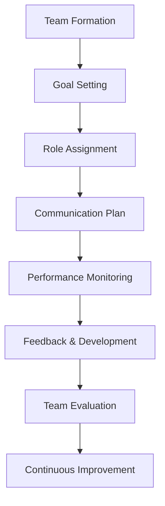

---
# Auto-generated front matter
Title: Team Management
LastUpdated: 2025-11-06T20:45:58.650142
Tags: []
Status: draft
---

# Team Management - Leading High-Performance Teams

## Overview

Team management involves leading, coordinating, and developing a group of individuals to achieve common goals. Effective team management is crucial for project success, team productivity, and organizational growth.

## Key Concepts

- **Leadership Styles**: Autocratic, democratic, laissez-faire, transformational
- **Team Development**: Forming, storming, norming, performing, adjourning
- **Motivation**: Intrinsic and extrinsic motivation factors
- **Communication**: Clear, consistent, and effective communication
- **Delegation**: Assigning tasks and responsibilities appropriately
- **Performance Management**: Setting goals, providing feedback, and evaluating performance

## Team Management Framework

## Leadership Styles

### 1. Autocratic Leadership
- **Characteristics**: Centralized decision-making, strict control
- **When to use**: Crisis situations, clear direction needed
- **Pros**: Quick decisions, clear direction
- **Cons**: Low team engagement, limited creativity

### 2. Democratic Leadership
- **Characteristics**: Collaborative decision-making, team input
- **When to use**: Complex problems, team expertise needed
- **Pros**: High engagement, diverse perspectives
- **Cons**: Slower decisions, potential conflicts

### 3. Laissez-Faire Leadership
- **Characteristics**: Minimal supervision, team autonomy
- **When to use**: Highly skilled teams, creative projects
- **Pros**: High creativity, team ownership
- **Cons**: Lack of direction, potential chaos

### 4. Transformational Leadership
- **Characteristics**: Inspiring vision, individual development
- **When to use**: Change initiatives, team growth
- **Pros**: High motivation, innovation
- **Cons**: Requires strong leadership skills

## Team Development Stages

### 1. Forming
- **Characteristics**: Team members getting to know each other
- **Manager Role**: Provide clear direction, establish ground rules
- **Challenges**: Uncertainty, politeness, testing boundaries

### 2. Storming
- **Characteristics**: Conflicts emerge, power struggles
- **Manager Role**: Facilitate conflict resolution, maintain focus
- **Challenges**: Disagreements, resistance, competition

### 3. Norming
- **Characteristics**: Team cohesion develops, roles established
- **Manager Role**: Support collaboration, reinforce positive behaviors
- **Challenges**: Maintaining momentum, avoiding groupthink

### 4. Performing
- **Characteristics**: High productivity, effective collaboration
- **Manager Role**: Provide resources, remove obstacles
- **Challenges**: Maintaining performance, preventing burnout

### 5. Adjourning
- **Characteristics**: Project completion, team dissolution
- **Manager Role**: Celebrate achievements, facilitate transitions
- **Challenges**: Knowledge transfer, team member transitions

## Motivation Strategies

### 1. Intrinsic Motivation
- **Purpose**: Meaningful work that aligns with values
- **Autonomy**: Freedom to make decisions and control work
- **Mastery**: Opportunities to develop skills and expertise
- **Progress**: Visible advancement and achievement

### 2. Extrinsic Motivation
- **Recognition**: Acknowledgment of contributions
- **Rewards**: Financial incentives, bonuses, promotions
- **Benefits**: Health insurance, flexible work arrangements
- **Career Development**: Training, mentoring, advancement opportunities

## Communication Best Practices

### 1. Clear Communication
- Use simple, direct language
- Avoid jargon and technical terms
- Provide context and background
- Confirm understanding

### 2. Consistent Communication
- Regular team meetings
- Consistent messaging across channels
- Document important decisions
- Follow up on commitments

### 3. Effective Communication
- Active listening
- Ask clarifying questions
- Provide constructive feedback
- Encourage open dialogue

## Delegation Strategies

### 1. Task Assignment
- Match tasks to team member skills
- Provide clear instructions and expectations
- Set deadlines and milestones
- Offer support and resources

### 2. Responsibility Transfer
- Transfer decision-making authority
- Hold team members accountable
- Provide necessary training
- Monitor progress without micromanaging

### 3. Empowerment
- Encourage initiative and creativity
- Support calculated risks
- Celebrate successes and learn from failures
- Build confidence and competence

## Performance Management

### 1. Goal Setting
- SMART goals (Specific, Measurable, Achievable, Relevant, Time-bound)
- Align individual goals with team objectives
- Regular goal reviews and adjustments
- Clear success criteria

### 2. Feedback Delivery
- Regular one-on-one meetings
- Constructive and specific feedback
- Focus on behavior and results
- Provide both positive and improvement feedback

### 3. Performance Evaluation
- Objective performance metrics
- 360-degree feedback
- Development planning
- Career progression discussions

## Team Building Activities

### 1. Ice Breakers
- Team introductions
- Fun facts sharing
- Personality assessments
- Team values discussion

### 2. Problem-Solving Activities
- Brainstorming sessions
- Design thinking workshops
- Hackathons
- Case study discussions

### 3. Social Activities
- Team lunches
- Off-site retreats
- Volunteer activities
- Sports and games

## Benefits

1. **Increased Productivity**: Better coordination and efficiency
2. **Higher Quality**: Collaborative problem-solving
3. **Innovation**: Diverse perspectives and creativity
4. **Employee Satisfaction**: Engagement and motivation
5. **Knowledge Sharing**: Learning and development

## Common Challenges

1. **Communication Issues**: Misunderstandings and conflicts
2. **Role Confusion**: Unclear responsibilities
3. **Personality Conflicts**: Different working styles
4. **Resource Constraints**: Limited time and budget
5. **Remote Work**: Virtual team management

## Interview Questions

1. **How do you motivate your team?**
   - Use intrinsic and extrinsic motivation, provide recognition, create growth opportunities

2. **Describe your leadership style.**
   - Adapt style to situation, focus on team development, maintain clear communication

3. **How do you handle underperforming team members?**
   - Provide feedback, identify root causes, create improvement plans, offer support

4. **How do you build team cohesion?**
   - Regular team building, clear communication, shared goals, celebrate successes

## Best Practices

1. **Lead by Example**: Demonstrate desired behaviors
2. **Communicate Clearly**: Ensure understanding and alignment
3. **Provide Support**: Remove obstacles and provide resources
4. **Recognize Contributions**: Acknowledge and celebrate achievements
5. **Continuous Learning**: Invest in team development

## Time Complexity

- **Team Formation**: O(n) where n is team size
- **Communication**: O(n²) for full team communication
- **Performance Management**: O(n) for individual reviews

## Space Complexity

- **Team Data**: O(n) where n is team size
- **Communication**: O(n²) for relationship tracking
- **Documentation**: O(n) for individual records

The optimal solution uses:
1. **Adaptive Leadership**: Adjust style to situation and team needs
2. **Clear Communication**: Ensure understanding and alignment
3. **Regular Feedback**: Provide ongoing guidance and support
4. **Team Development**: Invest in individual and collective growth
