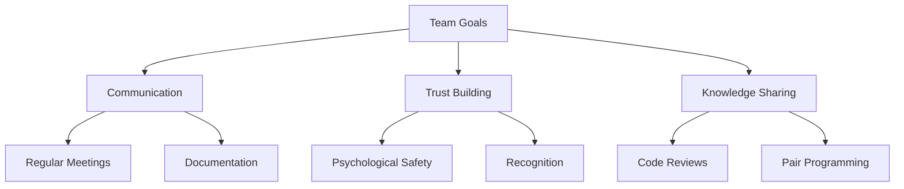
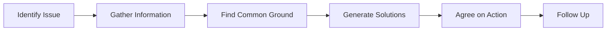

---
# Auto-generated front matter
Title: Teamwork Collaboration
LastUpdated: 2025-11-06T20:45:58.643216
Tags: []
Status: draft
---

# Teamwork & Collaboration

## 📘 Theory

Teamwork and collaboration are essential skills for software engineers, especially in leadership roles. Effective collaboration involves communication, conflict resolution, knowledge sharing, and building trust within teams.

### Key Concepts:

- **Psychological Safety**: Creating an environment where team members feel safe to express ideas
- **Active Listening**: Fully concentrating on and understanding what others are saying
- **Constructive Feedback**: Providing helpful, specific, and actionable feedback
- **Cross-functional Collaboration**: Working effectively with different teams and disciplines
- **Knowledge Sharing**: Documenting and sharing expertise across the team
- **Mentoring**: Guiding and developing junior team members

### Collaboration Models:

1. **Waterfall**: Sequential, phase-based approach
2. **Agile**: Iterative, collaborative approach
3. **DevOps**: Cross-functional collaboration for faster delivery
4. **Remote-First**: Distributed team collaboration

## 📊 Diagrams

### Team Collaboration Framework



### Conflict Resolution Process



## 🧩 Example

**Scenario**: You're leading a team of 5 engineers working on a critical feature. Two senior engineers have conflicting approaches to the architecture, and the deadline is approaching.

**Collaboration Approach:**

1. Schedule a technical discussion meeting
2. Have each engineer present their approach with pros/cons
3. Facilitate a collaborative design session
4. Document the agreed-upon solution
5. Assign implementation tasks based on expertise

## 💻 Implementation (Golang)

```go
package main

import (
    "fmt"
    "log"
    "sync"
    "time"
)

// Team represents a development team
type Team struct {
    ID          string
    Name        string
    Members     []TeamMember
    Projects    []Project
    Meetings    []Meeting
    Retrospectives []Retrospective
}

// TeamMember represents a team member
type TeamMember struct {
    ID          string
    Name        string
    Role        string
    Skills      []string
    Availability float64
    PerformanceScore float64
}

// Project represents a team project
type Project struct {
    ID          string
    Name        string
    Description string
    Status      string
    Assignees   []string
    Dependencies []string
    Deadline    time.Time
}

// Meeting represents a team meeting
type Meeting struct {
    ID          string
    Type        string
    Participants []string
    Agenda      []string
    Duration    time.Duration
    StartTime   time.Time
    EndTime     time.Time
    ActionItems []ActionItem
}

// ActionItem represents a meeting action item
type ActionItem struct {
    ID          string
    Description string
    Assignee    string
    DueDate     time.Time
    Status      string
}

// Retrospective represents a team retrospective
type Retrospective struct {
    ID          string
    Date        time.Time
    Participants []string
    WhatWentWell []string
    WhatWentWrong []string
    ActionItems []ActionItem
}

// CollaborationManager manages team collaboration
type CollaborationManager struct {
    teams       map[string]*Team
    conflicts   []Conflict
    resolutions []ConflictResolution
    mutex       sync.RWMutex
}

// Conflict represents a team conflict
type Conflict struct {
    ID          string
    Type        string
    Description string
    Participants []string
    Severity    string
    Status      string
    CreatedAt   time.Time
}

// ConflictResolution represents a conflict resolution
type ConflictResolution struct {
    ConflictID  string
    Resolution  string
    Mediator    string
    ResolvedAt  time.Time
    FollowUp    []string
}

// NewCollaborationManager creates a new collaboration manager
func NewCollaborationManager() *CollaborationManager {
    return &CollaborationManager{
        teams:       make(map[string]*Team),
        conflicts:   make([]Conflict, 0),
        resolutions: make([]ConflictResolution, 0),
    }
}

// CreateTeam creates a new team
func (cm *CollaborationManager) CreateTeam(id, name string, members []TeamMember) *Team {
    team := &Team{
        ID:          id,
        Name:        name,
        Members:     members,
        Projects:    make([]Project, 0),
        Meetings:    make([]Meeting, 0),
        Retrospectives: make([]Retrospective, 0),
    }

    cm.mutex.Lock()
    cm.teams[id] = team
    cm.mutex.Unlock()

    return team
}

// ScheduleMeeting schedules a team meeting
func (cm *CollaborationManager) ScheduleMeeting(teamID, meetingType string, participants []string, agenda []string, duration time.Duration) *Meeting {
    meeting := &Meeting{
        ID:          fmt.Sprintf("meeting_%d", time.Now().UnixNano()),
        Type:        meetingType,
        Participants: participants,
        Agenda:      agenda,
        Duration:    duration,
        StartTime:   time.Now(),
        EndTime:     time.Now().Add(duration),
        ActionItems: make([]ActionItem, 0),
    }

    cm.mutex.Lock()
    if team, exists := cm.teams[teamID]; exists {
        team.Meetings = append(team.Meetings, *meeting)
    }
    cm.mutex.Unlock()

    return meeting
}

// ConductRetrospective conducts a team retrospective
func (cm *CollaborationManager) ConductRetrospective(teamID string, participants []string) *Retrospective {
    retrospective := &Retrospective{
        ID:          fmt.Sprintf("retro_%d", time.Now().UnixNano()),
        Date:        time.Now(),
        Participants: participants,
        WhatWentWell: make([]string, 0),
        WhatWentWrong: make([]string, 0),
        ActionItems: make([]ActionItem, 0),
    }

    cm.mutex.Lock()
    if team, exists := cm.teams[teamID]; exists {
        team.Retrospectives = append(team.Retrospectives, *retrospective)
    }
    cm.mutex.Unlock()

    return retrospective
}

// AddRetrospectiveFeedback adds feedback to a retrospective
func (cm *CollaborationManager) AddRetrospectiveFeedback(retrospectiveID, feedback string, category string) error {
    cm.mutex.Lock()
    defer cm.mutex.Unlock()

    for teamID := range cm.teams {
        team := cm.teams[teamID]
        for i := range team.Retrospectives {
            if team.Retrospectives[i].ID == retrospectiveID {
                if category == "well" {
                    team.Retrospectives[i].WhatWentWell = append(team.Retrospectives[i].WhatWentWell, feedback)
                } else if category == "wrong" {
                    team.Retrospectives[i].WhatWentWrong = append(team.Retrospectives[i].WhatWentWrong, feedback)
                }
                return nil
            }
        }
    }

    return fmt.Errorf("retrospective not found")
}

// CreateConflict creates a new conflict
func (cm *CollaborationManager) CreateConflict(conflictType, description string, participants []string, severity string) *Conflict {
    conflict := &Conflict{
        ID:          fmt.Sprintf("conflict_%d", time.Now().UnixNano()),
        Type:        conflictType,
        Description: description,
        Participants: participants,
        Severity:    severity,
        Status:      "open",
        CreatedAt:   time.Now(),
    }

    cm.mutex.Lock()
    cm.conflicts = append(cm.conflicts, *conflict)
    cm.mutex.Unlock()

    return conflict
}

// ResolveConflict resolves a conflict
func (cm *CollaborationManager) ResolveConflict(conflictID, resolution string, mediator string, followUp []string) error {
    cm.mutex.Lock()
    defer cm.mutex.Unlock()

    // Find and update conflict
    for i := range cm.conflicts {
        if cm.conflicts[i].ID == conflictID {
            cm.conflicts[i].Status = "resolved"

            // Create resolution record
            resolution := ConflictResolution{
                ConflictID:  conflictID,
                Resolution:  resolution,
                Mediator:    mediator,
                ResolvedAt:  time.Now(),
                FollowUp:    followUp,
            }

            cm.resolutions = append(cm.resolutions, resolution)
            return nil
        }
    }

    return fmt.Errorf("conflict not found")
}

// FacilitateTechnicalDiscussion facilitates a technical discussion
func (cm *CollaborationManager) FacilitateTechnicalDiscussion(teamID, topic string, participants []string) *Meeting {
    agenda := []string{
        "Problem statement and requirements",
        "Technical approach presentations",
        "Pros and cons discussion",
        "Collaborative design session",
        "Decision and next steps",
    }

    meeting := cm.ScheduleMeeting(teamID, "technical_discussion", participants, agenda, 2*time.Hour)

    log.Printf("Facilitating technical discussion: %s", topic)
    log.Printf("Participants: %v", participants)

    return meeting
}

// ConductCodeReview conducts a code review
func (cm *CollaborationManager) ConductCodeReview(teamID, reviewerID, authorID, pullRequestID string) error {
    log.Printf("Conducting code review for PR %s", pullRequestID)
    log.Printf("Reviewer: %s, Author: %s", reviewerID, authorID)

    // Simulate code review process
    time.Sleep(1 * time.Second)

    // In a real implementation, this would integrate with Git platforms
    log.Printf("Code review completed for PR %s", pullRequestID)

    return nil
}

// PairProgramming facilitates pair programming
func (cm *CollaborationManager) PairProgramming(teamID, driverID, navigatorID, task string) error {
    log.Printf("Starting pair programming session")
    log.Printf("Driver: %s, Navigator: %s", driverID, navigatorID)
    log.Printf("Task: %s", task)

    // Simulate pair programming session
    time.Sleep(2 * time.Second)

    log.Printf("Pair programming session completed")

    return nil
}

// ShareKnowledge shares knowledge within the team
func (cm *CollaborationManager) ShareKnowledge(teamID, sharerID, topic, content string) error {
    log.Printf("Knowledge sharing session: %s", topic)
    log.Printf("Shared by: %s", sharerID)
    log.Printf("Content: %s", content)

    // In a real implementation, this would update a knowledge base
    log.Printf("Knowledge shared successfully")

    return nil
}

// MentorTeamMember mentors a team member
func (cm *CollaborationManager) MentorTeamMember(teamID, mentorID, menteeID string, goals []string) error {
    log.Printf("Starting mentoring relationship")
    log.Printf("Mentor: %s, Mentee: %s", mentorID, menteeID)
    log.Printf("Goals: %v", goals)

    // In a real implementation, this would create a mentoring plan
    log.Printf("Mentoring relationship established")

    return nil
}

// GetTeamCollaborationMetrics returns team collaboration metrics
func (cm *CollaborationManager) GetTeamCollaborationMetrics(teamID string) map[string]interface{} {
    cm.mutex.RLock()
    defer cm.mutex.RUnlock()

    team, exists := cm.teams[teamID]
    if !exists {
        return nil
    }

    // Calculate metrics
    totalMeetings := len(team.Meetings)
    totalRetrospectives := len(team.Retrospectives)
    activeConflicts := 0

    for _, conflict := range cm.conflicts {
        if conflict.Status == "open" {
            activeConflicts++
        }
    }

    return map[string]interface{}{
        "team_id":            teamID,
        "total_meetings":     totalMeetings,
        "total_retrospectives": totalRetrospectives,
        "active_conflicts":   activeConflicts,
        "team_size":          len(team.Members),
        "collaboration_score": cm.calculateCollaborationScore(teamID),
    }
}

// calculateCollaborationScore calculates a collaboration score for the team
func (cm *CollaborationManager) calculateCollaborationScore(teamID string) float64 {
    // Simple scoring algorithm
    // In a real implementation, this would be more sophisticated
    team := cm.teams[teamID]

    score := 0.0

    // Meeting frequency score
    if len(team.Meetings) > 0 {
        score += 20.0
    }

    // Retrospective frequency score
    if len(team.Retrospectives) > 0 {
        score += 20.0
    }

    // Conflict resolution score
    resolvedConflicts := 0
    for _, resolution := range cm.resolutions {
        if resolution.ConflictID != "" {
            resolvedConflicts++
        }
    }

    if resolvedConflicts > 0 {
        score += 30.0
    }

    // Team size score (optimal size is 5-7)
    teamSize := len(team.Members)
    if teamSize >= 5 && teamSize <= 7 {
        score += 30.0
    } else if teamSize >= 3 && teamSize <= 9 {
        score += 20.0
    } else {
        score += 10.0
    }

    return score
}

// GetConflictResolutionSuggestions returns suggestions for resolving conflicts
func (cm *CollaborationManager) GetConflictResolutionSuggestions(conflictID string) []string {
    suggestions := []string{
        "Schedule a one-on-one meeting with each participant",
        "Identify common goals and interests",
        "Use active listening techniques",
        "Focus on the problem, not the person",
        "Generate multiple solutions together",
        "Agree on specific actions and timelines",
        "Schedule follow-up meetings to monitor progress",
    }

    return suggestions
}

// GenerateTeamReport generates a comprehensive team report
func (cm *CollaborationManager) GenerateTeamReport(teamID string) map[string]interface{} {
    cm.mutex.RLock()
    defer cm.mutex.RUnlock()

    team, exists := cm.teams[teamID]
    if !exists {
        return nil
    }

    metrics := cm.GetTeamCollaborationMetrics(teamID)

    report := map[string]interface{}{
        "team_info": map[string]interface{}{
            "id":   team.ID,
            "name": team.Name,
            "size": len(team.Members),
        },
        "metrics": metrics,
        "recent_meetings": team.Meetings,
        "recent_retrospectives": team.Retrospectives,
        "recommendations": cm.generateRecommendations(teamID),
    }

    return report
}

// generateRecommendations generates recommendations for improving team collaboration
func (cm *CollaborationManager) generateRecommendations(teamID string) []string {
    recommendations := []string{
        "Schedule regular team retrospectives",
        "Implement pair programming sessions",
        "Create a team knowledge base",
        "Establish clear communication channels",
        "Set up regular one-on-one meetings",
        "Define team working agreements",
        "Implement conflict resolution processes",
    }

    return recommendations
}

func main() {
    // Create collaboration manager
    cm := NewCollaborationManager()

    // Create team members
    members := []TeamMember{
        {ID: "1", Name: "Alice", Role: "Senior Engineer", Skills: []string{"Go", "Kubernetes"}, Availability: 1.0, PerformanceScore: 9.0},
        {ID: "2", Name: "Bob", Role: "Engineer", Skills: []string{"Python", "Docker"}, Availability: 1.0, PerformanceScore: 8.0},
        {ID: "3", Name: "Charlie", Role: "Tech Lead", Skills: []string{"Architecture", "Leadership"}, Availability: 0.8, PerformanceScore: 9.5},
        {ID: "4", Name: "Diana", Role: "Engineer", Skills: []string{"React", "Node.js"}, Availability: 1.0, PerformanceScore: 8.5},
        {ID: "5", Name: "Eve", Role: "Junior Engineer", Skills: []string{"JavaScript", "CSS"}, Availability: 1.0, PerformanceScore: 7.0},
    }

    // Create team
    team := cm.CreateTeam("team1", "Backend Team", members)
    log.Printf("Created team: %s", team.Name)

    // Schedule a technical discussion
    participants := []string{"1", "2", "3"}
    meeting := cm.FacilitateTechnicalDiscussion("team1", "Microservices Architecture", participants)
    log.Printf("Scheduled meeting: %s", meeting.ID)

    // Conduct retrospective
    retro := cm.ConductRetrospective("team1", []string{"1", "2", "3", "4", "5"})
    cm.AddRetrospectiveFeedback(retro.ID, "Great communication during the sprint", "well")
    cm.AddRetrospectiveFeedback(retro.ID, "Need better documentation", "wrong")
    log.Printf("Conducted retrospective: %s", retro.ID)

    // Create and resolve a conflict
    conflict := cm.CreateConflict("technical", "Disagreement on database choice", []string{"1", "2"}, "medium")
    log.Printf("Created conflict: %s", conflict.ID)

    err := cm.ResolveConflict(conflict.ID, "Agreed to use PostgreSQL for consistency", "3", []string{"Document decision", "Update architecture docs"})
    if err != nil {
        log.Printf("Error resolving conflict: %v", err)
    } else {
        log.Printf("Resolved conflict: %s", conflict.ID)
    }

    // Conduct code review
    err = cm.ConductCodeReview("team1", "1", "2", "PR-123")
    if err != nil {
        log.Printf("Error conducting code review: %v", err)
    }

    // Pair programming session
    err = cm.PairProgramming("team1", "1", "5", "Implement authentication middleware")
    if err != nil {
        log.Printf("Error in pair programming: %v", err)
    }

    // Share knowledge
    err = cm.ShareKnowledge("team1", "3", "Kubernetes Best Practices", "Documentation on pod security and resource limits")
    if err != nil {
        log.Printf("Error sharing knowledge: %v", err)
    }

    // Mentor team member
    err = cm.MentorTeamMember("team1", "3", "5", []string{"Improve system design skills", "Learn Go concurrency patterns"})
    if err != nil {
        log.Printf("Error in mentoring: %v", err)
    }

    // Get team metrics
    metrics := cm.GetTeamCollaborationMetrics("team1")
    log.Printf("Team metrics: %+v", metrics)

    // Generate team report
    report := cm.GenerateTeamReport("team1")
    log.Printf("Team report: %+v", report)

    // Get conflict resolution suggestions
    suggestions := cm.GetConflictResolutionSuggestions(conflict.ID)
    log.Printf("Conflict resolution suggestions: %v", suggestions)
}
```

## 💻 Implementation (Node.js)

```javascript
class CollaborationManager {
  constructor() {
    this.teams = new Map();
    this.conflicts = [];
    this.resolutions = [];
  }

  createTeam(id, name, members) {
    const team = {
      id,
      name,
      members,
      projects: [],
      meetings: [],
      retrospectives: [],
    };

    this.teams.set(id, team);
    return team;
  }

  scheduleMeeting(teamId, meetingType, participants, agenda, duration) {
    const meeting = {
      id: `meeting_${Date.now()}`,
      type: meetingType,
      participants,
      agenda,
      duration,
      startTime: new Date(),
      endTime: new Date(Date.now() + duration),
      actionItems: [],
    };

    const team = this.teams.get(teamId);
    if (team) {
      team.meetings.push(meeting);
    }

    return meeting;
  }

  conductRetrospective(teamId, participants) {
    const retrospective = {
      id: `retro_${Date.now()}`,
      date: new Date(),
      participants,
      whatWentWell: [],
      whatWentWrong: [],
      actionItems: [],
    };

    const team = this.teams.get(teamId);
    if (team) {
      team.retrospectives.push(retrospective);
    }

    return retrospective;
  }

  addRetrospectiveFeedback(retrospectiveId, feedback, category) {
    for (const team of this.teams.values()) {
      const retro = team.retrospectives.find((r) => r.id === retrospectiveId);
      if (retro) {
        if (category === "well") {
          retro.whatWentWell.push(feedback);
        } else if (category === "wrong") {
          retro.whatWentWrong.push(feedback);
        }
        return;
      }
    }
    throw new Error("Retrospective not found");
  }

  createConflict(conflictType, description, participants, severity) {
    const conflict = {
      id: `conflict_${Date.now()}`,
      type: conflictType,
      description,
      participants,
      severity,
      status: "open",
      createdAt: new Date(),
    };

    this.conflicts.push(conflict);
    return conflict;
  }

  resolveConflict(conflictId, resolution, mediator, followUp) {
    const conflict = this.conflicts.find((c) => c.id === conflictId);
    if (!conflict) {
      throw new Error("Conflict not found");
    }

    conflict.status = "resolved";

    const resolutionRecord = {
      conflictId,
      resolution,
      mediator,
      resolvedAt: new Date(),
      followUp,
    };

    this.resolutions.push(resolutionRecord);
  }

  facilitateTechnicalDiscussion(teamId, topic, participants) {
    const agenda = [
      "Problem statement and requirements",
      "Technical approach presentations",
      "Pros and cons discussion",
      "Collaborative design session",
      "Decision and next steps",
    ];

    const meeting = this.scheduleMeeting(
      teamId,
      "technical_discussion",
      participants,
      agenda,
      2 * 60 * 60 * 1000 // 2 hours
    );

    console.log(`Facilitating technical discussion: ${topic}`);
    console.log(`Participants: ${participants.join(", ")}`);

    return meeting;
  }

  async conductCodeReview(teamId, reviewerId, authorId, pullRequestId) {
    console.log(`Conducting code review for PR ${pullRequestId}`);
    console.log(`Reviewer: ${reviewerId}, Author: ${authorId}`);

    // Simulate code review process
    await new Promise((resolve) => setTimeout(resolve, 1000));

    console.log(`Code review completed for PR ${pullRequestId}`);
  }

  async pairProgramming(teamId, driverId, navigatorId, task) {
    console.log("Starting pair programming session");
    console.log(`Driver: ${driverId}, Navigator: ${navigatorId}`);
    console.log(`Task: ${task}`);

    // Simulate pair programming session
    await new Promise((resolve) => setTimeout(resolve, 2000));

    console.log("Pair programming session completed");
  }

  async shareKnowledge(teamId, sharerId, topic, content) {
    console.log(`Knowledge sharing session: ${topic}`);
    console.log(`Shared by: ${sharerId}`);
    console.log(`Content: ${content}`);

    console.log("Knowledge shared successfully");
  }

  async mentorTeamMember(teamId, mentorId, menteeId, goals) {
    console.log("Starting mentoring relationship");
    console.log(`Mentor: ${mentorId}, Mentee: ${menteeId}`);
    console.log(`Goals: ${goals.join(", ")}`);

    console.log("Mentoring relationship established");
  }

  getTeamCollaborationMetrics(teamId) {
    const team = this.teams.get(teamId);
    if (!team) {
      return null;
    }

    const totalMeetings = team.meetings.length;
    const totalRetrospectives = team.retrospectives.length;
    const activeConflicts = this.conflicts.filter(
      (c) => c.status === "open"
    ).length;

    return {
      team_id: teamId,
      total_meetings: totalMeetings,
      total_retrospectives: totalRetrospectives,
      active_conflicts: activeConflicts,
      team_size: team.members.length,
      collaboration_score: this.calculateCollaborationScore(teamId),
    };
  }

  calculateCollaborationScore(teamId) {
    const team = this.teams.get(teamId);
    if (!team) {
      return 0;
    }

    let score = 0;

    // Meeting frequency score
    if (team.meetings.length > 0) {
      score += 20;
    }

    // Retrospective frequency score
    if (team.retrospectives.length > 0) {
      score += 20;
    }

    // Conflict resolution score
    const resolvedConflicts = this.resolutions.length;
    if (resolvedConflicts > 0) {
      score += 30;
    }

    // Team size score (optimal size is 5-7)
    const teamSize = team.members.length;
    if (teamSize >= 5 && teamSize <= 7) {
      score += 30;
    } else if (teamSize >= 3 && teamSize <= 9) {
      score += 20;
    } else {
      score += 10;
    }

    return score;
  }

  getConflictResolutionSuggestions(conflictId) {
    return [
      "Schedule a one-on-one meeting with each participant",
      "Identify common goals and interests",
      "Use active listening techniques",
      "Focus on the problem, not the person",
      "Generate multiple solutions together",
      "Agree on specific actions and timelines",
      "Schedule follow-up meetings to monitor progress",
    ];
  }

  generateTeamReport(teamId) {
    const team = this.teams.get(teamId);
    if (!team) {
      return null;
    }

    const metrics = this.getTeamCollaborationMetrics(teamId);

    return {
      team_info: {
        id: team.id,
        name: team.name,
        size: team.members.length,
      },
      metrics,
      recent_meetings: team.meetings,
      recent_retrospectives: team.retrospectives,
      recommendations: this.generateRecommendations(teamId),
    };
  }

  generateRecommendations(teamId) {
    return [
      "Schedule regular team retrospectives",
      "Implement pair programming sessions",
      "Create a team knowledge base",
      "Establish clear communication channels",
      "Set up regular one-on-one meetings",
      "Define team working agreements",
      "Implement conflict resolution processes",
    ];
  }
}

// Example usage
async function main() {
  const cm = new CollaborationManager();

  // Create team members
  const members = [
    {
      id: "1",
      name: "Alice",
      role: "Senior Engineer",
      skills: ["Go", "Kubernetes"],
      availability: 1.0,
      performanceScore: 9.0,
    },
    {
      id: "2",
      name: "Bob",
      role: "Engineer",
      skills: ["Python", "Docker"],
      availability: 1.0,
      performanceScore: 8.0,
    },
    {
      id: "3",
      name: "Charlie",
      role: "Tech Lead",
      skills: ["Architecture", "Leadership"],
      availability: 0.8,
      performanceScore: 9.5,
    },
    {
      id: "4",
      name: "Diana",
      role: "Engineer",
      skills: ["React", "Node.js"],
      availability: 1.0,
      performanceScore: 8.5,
    },
    {
      id: "5",
      name: "Eve",
      role: "Junior Engineer",
      skills: ["JavaScript", "CSS"],
      availability: 1.0,
      performanceScore: 7.0,
    },
  ];

  // Create team
  const team = cm.createTeam("team1", "Backend Team", members);
  console.log(`Created team: ${team.name}`);

  // Schedule a technical discussion
  const participants = ["1", "2", "3"];
  const meeting = cm.facilitateTechnicalDiscussion(
    "team1",
    "Microservices Architecture",
    participants
  );
  console.log(`Scheduled meeting: ${meeting.id}`);

  // Conduct retrospective
  const retro = cm.conductRetrospective("team1", ["1", "2", "3", "4", "5"]);
  cm.addRetrospectiveFeedback(
    retro.id,
    "Great communication during the sprint",
    "well"
  );
  cm.addRetrospectiveFeedback(retro.id, "Need better documentation", "wrong");
  console.log(`Conducted retrospective: ${retro.id}`);

  // Create and resolve a conflict
  const conflict = cm.createConflict(
    "technical",
    "Disagreement on database choice",
    ["1", "2"],
    "medium"
  );
  console.log(`Created conflict: ${conflict.id}`);

  cm.resolveConflict(
    conflict.id,
    "Agreed to use PostgreSQL for consistency",
    "3",
    ["Document decision", "Update architecture docs"]
  );
  console.log(`Resolved conflict: ${conflict.id}`);

  // Conduct code review
  await cm.conductCodeReview("team1", "1", "2", "PR-123");

  // Pair programming session
  await cm.pairProgramming(
    "team1",
    "1",
    "5",
    "Implement authentication middleware"
  );

  // Share knowledge
  await cm.shareKnowledge(
    "team1",
    "3",
    "Kubernetes Best Practices",
    "Documentation on pod security and resource limits"
  );

  // Mentor team member
  await cm.mentorTeamMember("team1", "3", "5", [
    "Improve system design skills",
    "Learn Go concurrency patterns",
  ]);

  // Get team metrics
  const metrics = cm.getTeamCollaborationMetrics("team1");
  console.log("Team metrics:", metrics);

  // Generate team report
  const report = cm.generateTeamReport("team1");
  console.log("Team report:", report);

  // Get conflict resolution suggestions
  const suggestions = cm.getConflictResolutionSuggestions(conflict.id);
  console.log("Conflict resolution suggestions:", suggestions);
}

if (require.main === module) {
  main().catch(console.error);
}

module.exports = CollaborationManager;
```

## ⏱ Complexity Analysis

**Time Complexity:**

- Team Operations: O(1) for most operations
- Conflict Resolution: O(n) where n is number of conflicts
- Metrics Calculation: O(m) where m is team size
- Space Complexity: O(t + c) where t is teams, c is conflicts

## 🚀 Optimal Solution

The optimal solution uses:

1. **Psychological Safety**: Create safe spaces for open communication
2. **Regular Feedback**: Implement continuous feedback loops
3. **Clear Communication**: Establish clear communication protocols
4. **Conflict Resolution**: Implement structured conflict resolution processes
5. **Knowledge Sharing**: Create systematic knowledge sharing mechanisms

## ❓ Follow-up Questions

1. **How would this scale with 100+ team members?**

   - Implement team hierarchies
   - Use distributed communication tools
   - Consider team-of-teams models

2. **How can we optimize further if conflicts are frequent?**

   - Implement early conflict detection
   - Use mediation techniques
   - Consider team restructuring

3. **What trade-offs exist in different approaches?**
   - Centralized vs Decentralized: Centralized is easier to manage but less scalable
   - Formal vs Informal: Formal processes are structured but may feel rigid
   - Synchronous vs Asynchronous: Synchronous is more engaging but harder to schedule
