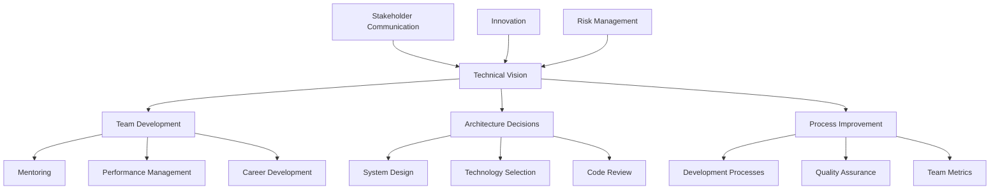

# Technical Leadership - Leading Engineering Teams

## Overview

Technical leadership involves guiding engineering teams to deliver high-quality software while fostering innovation, collaboration, and professional growth. It combines technical expertise with people management skills to drive successful outcomes.

## Key Concepts

- **Technical Vision**: Setting and communicating technical direction
- **Team Development**: Mentoring and growing team members
- **Architecture Decisions**: Making informed technical choices
- **Code Quality**: Ensuring high standards and best practices
- **Innovation**: Encouraging experimentation and learning
- **Stakeholder Management**: Communicating with non-technical stakeholders

## Technical Leadership Areas

### 1. Technical Strategy
- Define technical roadmap and vision
- Align technology choices with business goals
- Evaluate and adopt new technologies
- Plan for scalability and maintainability

### 2. Team Management
- Hire and onboard new team members
- Conduct performance reviews and feedback
- Facilitate career development
- Resolve conflicts and build team culture

### 3. Architecture and Design
- Make architectural decisions
- Review and approve technical designs
- Ensure system scalability and reliability
- Balance technical debt and feature delivery

### 4. Process Improvement
- Implement development processes
- Establish coding standards and practices
- Optimize team productivity
- Measure and improve team performance

## Technical Leadership Framework



## Go Implementation - Technical Leadership System

```go
package main

import (
    "context"
    "fmt"
    "log"
    "sync"
    "time"
)

// TeamMember represents a team member
type TeamMember struct {
    ID           string
    Name         string
    Role         string
    Level        string
    Skills       []string
    Performance  float64
    Goals        []string
    MentorID     string
    JoinDate     time.Time
    LastReview   time.Time
}

// Project represents a project
type Project struct {
    ID          string
    Name        string
    Description string
    Status      string
    Priority    int
    StartDate   time.Time
    EndDate     time.Time
    TeamMembers []string
    TechStack   []string
    Metrics     map[string]interface{}
}

// TechnicalDecision represents a technical decision
type TechnicalDecision struct {
    ID          string
    Title       string
    Description string
    Context     string
    Options     []string
    Decision    string
    Rationale   string
    Impact      string
    Author      string
    Date        time.Time
    Status      string
}

// CodeReview represents a code review
type CodeReview struct {
    ID          string
    PRNumber    string
    Author      string
    Reviewer    string
    Status      string
    Comments    []string
    Metrics     map[string]interface{}
    CreatedAt   time.Time
    UpdatedAt   time.Time
}

// TechnicalLeader represents a technical leader
type TechnicalLeader struct {
    ID          string
    Name        string
    Team        []*TeamMember
    Projects    []*Project
    Decisions   []*TechnicalDecision
    Reviews     []*CodeReview
    mutex       sync.RWMutex
}

// NewTechnicalLeader creates a new technical leader
func NewTechnicalLeader(id, name string) *TechnicalLeader {
    return &TechnicalLeader{
        ID:        id,
        Name:      name,
        Team:      make([]*TeamMember, 0),
        Projects:  make([]*Project, 0),
        Decisions: make([]*TechnicalDecision, 0),
        Reviews:   make([]*CodeReview, 0),
    }
}

// AddTeamMember adds a team member
func (tl *TechnicalLeader) AddTeamMember(member *TeamMember) {
    tl.mutex.Lock()
    defer tl.mutex.Unlock()
    
    tl.Team = append(tl.Team, member)
    log.Printf("Added team member: %s (%s)", member.Name, member.Role)
}

// RemoveTeamMember removes a team member
func (tl *TechnicalLeader) RemoveTeamMember(memberID string) {
    tl.mutex.Lock()
    defer tl.mutex.Unlock()
    
    for i, member := range tl.Team {
        if member.ID == memberID {
            tl.Team = append(tl.Team[:i], tl.Team[i+1:]...)
            log.Printf("Removed team member: %s", member.Name)
            return
        }
    }
}

// GetTeamMember gets a team member by ID
func (tl *TechnicalLeader) GetTeamMember(memberID string) *TeamMember {
    tl.mutex.RLock()
    defer tl.mutex.RUnlock()
    
    for _, member := range tl.Team {
        if member.ID == memberID {
            return member
        }
    }
    return nil
}

// SetMentor sets a mentor for a team member
func (tl *TechnicalLeader) SetMentor(memberID, mentorID string) error {
    tl.mutex.Lock()
    defer tl.mutex.Unlock()
    
    member := tl.getTeamMemberByID(memberID)
    if member == nil {
        return fmt.Errorf("team member %s not found", memberID)
    }
    
    mentor := tl.getTeamMemberByID(mentorID)
    if mentor == nil {
        return fmt.Errorf("mentor %s not found", mentorID)
    }
    
    member.MentorID = mentorID
    log.Printf("Set mentor %s for team member %s", mentor.Name, member.Name)
    
    return nil
}

// getTeamMemberByID gets a team member by ID (internal method)
func (tl *TechnicalLeader) getTeamMemberByID(memberID string) *TeamMember {
    for _, member := range tl.Team {
        if member.ID == memberID {
            return member
        }
    }
    return nil
}

// ConductPerformanceReview conducts a performance review
func (tl *TechnicalLeader) ConductPerformanceReview(memberID string, performance float64, feedback string) error {
    tl.mutex.Lock()
    defer tl.mutex.Unlock()
    
    member := tl.getTeamMemberByID(memberID)
    if member == nil {
        return fmt.Errorf("team member %s not found", memberID)
    }
    
    member.Performance = performance
    member.LastReview = time.Now()
    
    log.Printf("Conducted performance review for %s: %.2f", member.Name, performance)
    
    return nil
}

// SetGoals sets goals for a team member
func (tl *TechnicalLeader) SetGoals(memberID string, goals []string) error {
    tl.mutex.Lock()
    defer tl.mutex.Unlock()
    
    member := tl.getTeamMemberByID(memberID)
    if member == nil {
        return fmt.Errorf("team member %s not found", memberID)
    }
    
    member.Goals = goals
    log.Printf("Set goals for %s: %v", member.Name, goals)
    
    return nil
}

// CreateProject creates a new project
func (tl *TechnicalLeader) CreateProject(project *Project) {
    tl.mutex.Lock()
    defer tl.mutex.Unlock()
    
    tl.Projects = append(tl.Projects, project)
    log.Printf("Created project: %s", project.Name)
}

// UpdateProjectStatus updates project status
func (tl *TechnicalLeader) UpdateProjectStatus(projectID, status string) error {
    tl.mutex.Lock()
    defer tl.mutex.Unlock()
    
    for _, project := range tl.Projects {
        if project.ID == projectID {
            project.Status = status
            log.Printf("Updated project %s status to: %s", project.Name, status)
            return nil
        }
    }
    
    return fmt.Errorf("project %s not found", projectID)
}

// MakeTechnicalDecision makes a technical decision
func (tl *TechnicalLeader) MakeTechnicalDecision(decision *TechnicalDecision) {
    tl.mutex.Lock()
    defer tl.mutex.Unlock()
    
    tl.Decisions = append(tl.Decisions, decision)
    log.Printf("Made technical decision: %s", decision.Title)
}

// ReviewCode reviews code
func (tl *TechnicalLeader) ReviewCode(review *CodeReview) {
    tl.mutex.Lock()
    defer tl.mutex.Unlock()
    
    tl.Reviews = append(tl.Reviews, review)
    log.Printf("Code review created: PR #%s", review.PRNumber)
}

// GetTeamMetrics gets team metrics
func (tl *TechnicalLeader) GetTeamMetrics() map[string]interface{} {
    tl.mutex.RLock()
    defer tl.mutex.RUnlock()
    
    metrics := map[string]interface{}{
        "team_size":        len(tl.Team),
        "active_projects":  len(tl.Projects),
        "total_decisions":  len(tl.Decisions),
        "total_reviews":    len(tl.Reviews),
    }
    
    // Calculate average performance
    if len(tl.Team) > 0 {
        totalPerformance := 0.0
        for _, member := range tl.Team {
            totalPerformance += member.Performance
        }
        metrics["avg_performance"] = totalPerformance / float64(len(tl.Team))
    }
    
    // Calculate project status distribution
    statusCounts := make(map[string]int)
    for _, project := range tl.Projects {
        statusCounts[project.Status]++
    }
    metrics["project_status"] = statusCounts
    
    return metrics
}

// GetTeamMemberPerformance gets performance for a team member
func (tl *TechnicalLeader) GetTeamMemberPerformance(memberID string) (float64, error) {
    tl.mutex.RLock()
    defer tl.mutex.RUnlock()
    
    member := tl.getTeamMemberByID(memberID)
    if member == nil {
        return 0, fmt.Errorf("team member %s not found", memberID)
    }
    
    return member.Performance, nil
}

// GetProjectMetrics gets metrics for a project
func (tl *TechnicalLeader) GetProjectMetrics(projectID string) (map[string]interface{}, error) {
    tl.mutex.RLock()
    defer tl.mutex.RUnlock()
    
    for _, project := range tl.Projects {
        if project.ID == projectID {
            return project.Metrics, nil
        }
    }
    
    return nil, fmt.Errorf("project %s not found", projectID)
}

// GetTechnicalDecisions gets technical decisions
func (tl *TechnicalLeader) GetTechnicalDecisions() []*TechnicalDecision {
    tl.mutex.RLock()
    defer tl.mutex.RUnlock()
    
    return tl.Decisions
}

// GetCodeReviews gets code reviews
func (tl *TechnicalLeader) GetCodeReviews() []*CodeReview {
    tl.mutex.RLock()
    defer tl.mutex.RUnlock()
    
    return tl.Reviews
}

// PlanSprint plans a sprint
func (tl *TechnicalLeader) PlanSprint(sprintID string, goals []string, teamMembers []string) *Sprint {
    sprint := &Sprint{
        ID:           sprintID,
        Goals:        goals,
        TeamMembers:  teamMembers,
        StartDate:    time.Now(),
        EndDate:      time.Now().Add(2 * 7 * 24 * time.Hour), // 2 weeks
        Status:       "planned",
        CreatedAt:    time.Now(),
    }
    
    log.Printf("Planned sprint %s with goals: %v", sprintID, goals)
    
    return sprint
}

// Sprint represents a sprint
type Sprint struct {
    ID          string
    Goals       []string
    TeamMembers []string
    StartDate   time.Time
    EndDate     time.Time
    Status      string
    CreatedAt   time.Time
}

// ConductOneOnOne conducts a one-on-one meeting
func (tl *TechnicalLeader) ConductOneOnOne(memberID string, agenda []string) *OneOnOne {
    oneOnOne := &OneOnOne{
        ID:        fmt.Sprintf("1on1_%s_%d", memberID, time.Now().Unix()),
        MemberID:  memberID,
        Agenda:    agenda,
        StartTime: time.Now(),
        Status:    "in_progress",
    }
    
    log.Printf("Conducted one-on-one with team member %s", memberID)
    
    return oneOnOne
}

// OneOnOne represents a one-on-one meeting
type OneOnOne struct {
    ID        string
    MemberID  string
    Agenda    []string
    StartTime time.Time
    EndTime   time.Time
    Status    string
    Notes     []string
    ActionItems []string
}

// CreateTechnicalRoadmap creates a technical roadmap
func (tl *TechnicalLeader) CreateTechnicalRoadmap(roadmap *TechnicalRoadmap) {
    tl.mutex.Lock()
    defer tl.mutex.Unlock()
    
    log.Printf("Created technical roadmap: %s", roadmap.Title)
}

// TechnicalRoadmap represents a technical roadmap
type TechnicalRoadmap struct {
    ID          string
    Title       string
    Description string
    Timeline    []RoadmapItem
    CreatedAt   time.Time
    UpdatedAt   time.Time
}

// RoadmapItem represents a roadmap item
type RoadmapItem struct {
    ID          string
    Title       string
    Description string
    Priority    int
    Status      string
    DueDate     time.Time
    Dependencies []string
}

// Example usage
func main() {
    // Create technical leader
    leader := NewTechnicalLeader("leader1", "Alice Johnson")
    
    // Add team members
    members := []*TeamMember{
        {
            ID:          "member1",
            Name:        "Bob Smith",
            Role:        "Senior Engineer",
            Level:       "L5",
            Skills:      []string{"Go", "Kubernetes", "Microservices"},
            Performance: 8.5,
            Goals:       []string{"Learn Rust", "Improve system design skills"},
            JoinDate:    time.Now().Add(-365 * 24 * time.Hour),
        },
        {
            ID:          "member2",
            Name:        "Charlie Brown",
            Role:        "Engineer",
            Level:       "L4",
            Skills:      []string{"Python", "Docker", "AWS"},
            Performance: 7.8,
            Goals:       []string{"Learn Go", "Improve testing skills"},
            JoinDate:    time.Now().Add(-180 * 24 * time.Hour),
        },
        {
            ID:          "member3",
            Name:        "Diana Prince",
            Role:        "Staff Engineer",
            Level:       "L6",
            Skills:      []string{"Architecture", "Leadership", "Go"},
            Performance: 9.2,
            Goals:       []string{"Mentor junior engineers", "Lead technical initiatives"},
            JoinDate:    time.Now().Add(-730 * 24 * time.Hour),
        },
    }
    
    for _, member := range members {
        leader.AddTeamMember(member)
    }
    
    // Set up mentoring relationships
    leader.SetMentor("member1", "member3")
    leader.SetMentor("member2", "member1")
    
    // Create projects
    projects := []*Project{
        {
            ID:          "project1",
            Name:        "Microservices Migration",
            Description: "Migrate monolith to microservices",
            Status:      "in_progress",
            Priority:    1,
            StartDate:   time.Now().Add(-30 * 24 * time.Hour),
            EndDate:     time.Now().Add(60 * 24 * time.Hour),
            TeamMembers: []string{"member1", "member2", "member3"},
            TechStack:   []string{"Go", "Kubernetes", "Docker"},
            Metrics: map[string]interface{}{
                "completion": 0.3,
                "velocity":   15,
                "quality":    8.5,
            },
        },
        {
            ID:          "project2",
            Name:        "API Gateway",
            Description: "Implement API gateway for microservices",
            Status:      "planned",
            Priority:    2,
            StartDate:   time.Now().Add(30 * 24 * time.Hour),
            EndDate:     time.Now().Add(90 * 24 * time.Hour),
            TeamMembers: []string{"member1", "member3"},
            TechStack:   []string{"Go", "Kong", "Redis"},
            Metrics: map[string]interface{}{
                "completion": 0.0,
                "velocity":   0,
                "quality":    0,
            },
        },
    }
    
    for _, project := range projects {
        leader.CreateProject(project)
    }
    
    // Make technical decisions
    decisions := []*TechnicalDecision{
        {
            ID:          "decision1",
            Title:       "Choose API Gateway Solution",
            Description: "Select between Kong, Istio, and custom solution",
            Context:     "Need to implement API gateway for microservices",
            Options:     []string{"Kong", "Istio", "Custom Solution"},
            Decision:    "Kong",
            Rationale:   "Kong provides better performance and easier maintenance",
            Impact:      "High - affects all microservices communication",
            Author:      "leader1",
            Date:        time.Now(),
            Status:      "approved",
        },
        {
            ID:          "decision2",
            Title:       "Database Sharding Strategy",
            Description: "Choose between horizontal and vertical sharding",
            Context:     "Database performance issues with growing data",
            Options:     []string{"Horizontal Sharding", "Vertical Sharding", "Read Replicas"},
            Decision:    "Horizontal Sharding",
            Rationale:   "Better scalability for our use case",
            Impact:      "Medium - affects data access patterns",
            Author:      "leader1",
            Date:        time.Now().Add(-7 * 24 * time.Hour),
            Status:      "implemented",
        },
    }
    
    for _, decision := range decisions {
        leader.MakeTechnicalDecision(decision)
    }
    
    // Conduct code reviews
    reviews := []*CodeReview{
        {
            ID:       "review1",
            PRNumber: "PR-123",
            Author:   "member1",
            Reviewer: "member3",
            Status:   "approved",
            Comments: []string{"Good implementation", "Consider adding error handling"},
            Metrics: map[string]interface{}{
                "lines_changed": 150,
                "files_changed": 5,
                "review_time":   "2 hours",
            },
            CreatedAt: time.Now().Add(-2 * 24 * time.Hour),
            UpdatedAt: time.Now().Add(-1 * 24 * time.Hour),
        },
        {
            ID:       "review2",
            PRNumber: "PR-124",
            Author:   "member2",
            Reviewer: "member1",
            Status:   "in_progress",
            Comments: []string{"Need to fix unit tests"},
            Metrics: map[string]interface{}{
                "lines_changed": 80,
                "files_changed": 3,
                "review_time":   "1 hour",
            },
            CreatedAt: time.Now().Add(-1 * 24 * time.Hour),
            UpdatedAt: time.Now(),
        },
    }
    
    for _, review := range reviews {
        leader.ReviewCode(review)
    }
    
    // Conduct performance reviews
    leader.ConductPerformanceReview("member1", 8.5, "Excellent work on microservices migration")
    leader.ConductPerformanceReview("member2", 7.8, "Good progress, needs improvement in testing")
    leader.ConductPerformanceReview("member3", 9.2, "Outstanding leadership and technical skills")
    
    // Set goals
    leader.SetGoals("member1", []string{"Learn Rust", "Improve system design skills", "Mentor junior engineers"})
    leader.SetGoals("member2", []string{"Learn Go", "Improve testing skills", "Contribute to architecture decisions"})
    leader.SetGoals("member3", []string{"Mentor junior engineers", "Lead technical initiatives", "Improve team processes"})
    
    // Get team metrics
    metrics := leader.GetTeamMetrics()
    fmt.Printf("Team metrics: %+v\n", metrics)
    
    // Get team member performance
    performance, err := leader.GetTeamMemberPerformance("member1")
    if err != nil {
        log.Printf("Error getting performance: %v", err)
    } else {
        fmt.Printf("Member1 performance: %.2f\n", performance)
    }
    
    // Get project metrics
    projectMetrics, err := leader.GetProjectMetrics("project1")
    if err != nil {
        log.Printf("Error getting project metrics: %v", err)
    } else {
        fmt.Printf("Project1 metrics: %+v\n", projectMetrics)
    }
    
    // Get technical decisions
    decisions = leader.GetTechnicalDecisions()
    fmt.Printf("Technical decisions: %d\n", len(decisions))
    
    // Get code reviews
    reviews = leader.GetCodeReviews()
    fmt.Printf("Code reviews: %d\n", len(reviews))
    
    // Plan sprint
    sprint := leader.PlanSprint("sprint1", []string{"Complete API gateway", "Improve testing coverage"}, []string{"member1", "member2"})
    fmt.Printf("Planned sprint: %s\n", sprint.ID)
    
    // Conduct one-on-one
    oneOnOne := leader.ConductOneOnOne("member1", []string{"Performance review", "Career goals", "Project updates"})
    fmt.Printf("Conducted one-on-one: %s\n", oneOnOne.ID)
    
    // Create technical roadmap
    roadmap := &TechnicalRoadmap{
        ID:          "roadmap1",
        Title:       "Q1 2024 Technical Roadmap",
        Description: "Technical initiatives for Q1 2024",
        Timeline: []RoadmapItem{
            {
                ID:          "item1",
                Title:       "Microservices Migration",
                Description: "Complete migration to microservices",
                Priority:    1,
                Status:      "in_progress",
                DueDate:     time.Now().Add(60 * 24 * time.Hour),
            },
            {
                ID:          "item2",
                Title:       "API Gateway Implementation",
                Description: "Implement API gateway for microservices",
                Priority:    2,
                Status:      "planned",
                DueDate:     time.Now().Add(90 * 24 * time.Hour),
            },
        },
        CreatedAt: time.Now(),
        UpdatedAt: time.Now(),
    }
    
    leader.CreateTechnicalRoadmap(roadmap)
    fmt.Printf("Created technical roadmap: %s\n", roadmap.Title)
}
```

## Node.js Implementation

```javascript
class TeamMember {
  constructor(id, name, role, level, skills, performance, goals, joinDate) {
    this.id = id;
    this.name = name;
    this.role = role;
    this.level = level;
    this.skills = skills;
    this.performance = performance;
    this.goals = goals;
    this.mentorId = null;
    this.joinDate = joinDate;
    this.lastReview = null;
  }
}

class Project {
  constructor(id, name, description, status, priority, startDate, endDate, teamMembers, techStack, metrics) {
    this.id = id;
    this.name = name;
    this.description = description;
    this.status = status;
    this.priority = priority;
    this.startDate = startDate;
    this.endDate = endDate;
    this.teamMembers = teamMembers;
    this.techStack = techStack;
    this.metrics = metrics;
  }
}

class TechnicalDecision {
  constructor(id, title, description, context, options, decision, rationale, impact, author, date, status) {
    this.id = id;
    this.title = title;
    this.description = description;
    this.context = context;
    this.options = options;
    this.decision = decision;
    this.rationale = rationale;
    this.impact = impact;
    this.author = author;
    this.date = date;
    this.status = status;
  }
}

class CodeReview {
  constructor(id, prNumber, author, reviewer, status, comments, metrics, createdAt, updatedAt) {
    this.id = id;
    this.prNumber = prNumber;
    this.author = author;
    this.reviewer = reviewer;
    this.status = status;
    this.comments = comments;
    this.metrics = metrics;
    this.createdAt = createdAt;
    this.updatedAt = updatedAt;
  }
}

class TechnicalLeader {
  constructor(id, name) {
    this.id = id;
    this.name = name;
    this.team = [];
    this.projects = [];
    this.decisions = [];
    this.reviews = [];
  }

  addTeamMember(member) {
    this.team.push(member);
    console.log(`Added team member: ${member.name} (${member.role})`);
  }

  removeTeamMember(memberId) {
    const index = this.team.findIndex(member => member.id === memberId);
    if (index !== -1) {
      const member = this.team[index];
      this.team.splice(index, 1);
      console.log(`Removed team member: ${member.name}`);
    }
  }

  getTeamMember(memberId) {
    return this.team.find(member => member.id === memberId);
  }

  setMentor(memberId, mentorId) {
    const member = this.getTeamMember(memberId);
    const mentor = this.getTeamMember(mentorId);
    
    if (!member) {
      throw new Error(`Team member ${memberId} not found`);
    }
    
    if (!mentor) {
      throw new Error(`Mentor ${mentorId} not found`);
    }
    
    member.mentorId = mentorId;
    console.log(`Set mentor ${mentor.name} for team member ${member.name}`);
  }

  conductPerformanceReview(memberId, performance, feedback) {
    const member = this.getTeamMember(memberId);
    if (!member) {
      throw new Error(`Team member ${memberId} not found`);
    }
    
    member.performance = performance;
    member.lastReview = new Date();
    
    console.log(`Conducted performance review for ${member.name}: ${performance}`);
  }

  setGoals(memberId, goals) {
    const member = this.getTeamMember(memberId);
    if (!member) {
      throw new Error(`Team member ${memberId} not found`);
    }
    
    member.goals = goals;
    console.log(`Set goals for ${member.name}: ${goals.join(', ')}`);
  }

  createProject(project) {
    this.projects.push(project);
    console.log(`Created project: ${project.name}`);
  }

  updateProjectStatus(projectId, status) {
    const project = this.projects.find(p => p.id === projectId);
    if (!project) {
      throw new Error(`Project ${projectId} not found`);
    }
    
    project.status = status;
    console.log(`Updated project ${project.name} status to: ${status}`);
  }

  makeTechnicalDecision(decision) {
    this.decisions.push(decision);
    console.log(`Made technical decision: ${decision.title}`);
  }

  reviewCode(review) {
    this.reviews.push(review);
    console.log(`Code review created: PR #${review.prNumber}`);
  }

  getTeamMetrics() {
    const metrics = {
      teamSize: this.team.length,
      activeProjects: this.projects.length,
      totalDecisions: this.decisions.length,
      totalReviews: this.reviews.length,
    };
    
    // Calculate average performance
    if (this.team.length > 0) {
      const totalPerformance = this.team.reduce((sum, member) => sum + member.performance, 0);
      metrics.avgPerformance = totalPerformance / this.team.length;
    }
    
    // Calculate project status distribution
    const statusCounts = {};
    for (const project of this.projects) {
      statusCounts[project.status] = (statusCounts[project.status] || 0) + 1;
    }
    metrics.projectStatus = statusCounts;
    
    return metrics;
  }

  getTeamMemberPerformance(memberId) {
    const member = this.getTeamMember(memberId);
    if (!member) {
      throw new Error(`Team member ${memberId} not found`);
    }
    
    return member.performance;
  }

  getProjectMetrics(projectId) {
    const project = this.projects.find(p => p.id === projectId);
    if (!project) {
      throw new Error(`Project ${projectId} not found`);
    }
    
    return project.metrics;
  }

  getTechnicalDecisions() {
    return this.decisions;
  }

  getCodeReviews() {
    return this.reviews;
  }

  planSprint(sprintId, goals, teamMembers) {
    const sprint = {
      id: sprintId,
      goals: goals,
      teamMembers: teamMembers,
      startDate: new Date(),
      endDate: new Date(Date.now() + 14 * 24 * 60 * 60 * 1000), // 2 weeks
      status: 'planned',
      createdAt: new Date(),
    };
    
    console.log(`Planned sprint ${sprintId} with goals: ${goals.join(', ')}`);
    
    return sprint;
  }

  conductOneOnOne(memberId, agenda) {
    const oneOnOne = {
      id: `1on1_${memberId}_${Date.now()}`,
      memberId: memberId,
      agenda: agenda,
      startTime: new Date(),
      status: 'in_progress',
    };
    
    console.log(`Conducted one-on-one with team member ${memberId}`);
    
    return oneOnOne;
  }

  createTechnicalRoadmap(roadmap) {
    console.log(`Created technical roadmap: ${roadmap.title}`);
  }
}

// Example usage
function main() {
  // Create technical leader
  const leader = new TechnicalLeader('leader1', 'Alice Johnson');
  
  // Add team members
  const members = [
    new TeamMember(
      'member1',
      'Bob Smith',
      'Senior Engineer',
      'L5',
      ['Go', 'Kubernetes', 'Microservices'],
      8.5,
      ['Learn Rust', 'Improve system design skills'],
      new Date(Date.now() - 365 * 24 * 60 * 60 * 1000)
    ),
    new TeamMember(
      'member2',
      'Charlie Brown',
      'Engineer',
      'L4',
      ['Python', 'Docker', 'AWS'],
      7.8,
      ['Learn Go', 'Improve testing skills'],
      new Date(Date.now() - 180 * 24 * 60 * 60 * 1000)
    ),
    new TeamMember(
      'member3',
      'Diana Prince',
      'Staff Engineer',
      'L6',
      ['Architecture', 'Leadership', 'Go'],
      9.2,
      ['Mentor junior engineers', 'Lead technical initiatives'],
      new Date(Date.now() - 730 * 24 * 60 * 60 * 1000)
    ),
  ];
  
  for (const member of members) {
    leader.addTeamMember(member);
  }
  
  // Set up mentoring relationships
  leader.setMentor('member1', 'member3');
  leader.setMentor('member2', 'member1');
  
  // Create projects
  const projects = [
    new Project(
      'project1',
      'Microservices Migration',
      'Migrate monolith to microservices',
      'in_progress',
      1,
      new Date(Date.now() - 30 * 24 * 60 * 60 * 1000),
      new Date(Date.now() + 60 * 24 * 60 * 60 * 1000),
      ['member1', 'member2', 'member3'],
      ['Go', 'Kubernetes', 'Docker'],
      {
        completion: 0.3,
        velocity: 15,
        quality: 8.5,
      }
    ),
    new Project(
      'project2',
      'API Gateway',
      'Implement API gateway for microservices',
      'planned',
      2,
      new Date(Date.now() + 30 * 24 * 60 * 60 * 1000),
      new Date(Date.now() + 90 * 24 * 60 * 60 * 1000),
      ['member1', 'member3'],
      ['Go', 'Kong', 'Redis'],
      {
        completion: 0.0,
        velocity: 0,
        quality: 0,
      }
    ),
  ];
  
  for (const project of projects) {
    leader.createProject(project);
  }
  
  // Make technical decisions
  const decisions = [
    new TechnicalDecision(
      'decision1',
      'Choose API Gateway Solution',
      'Select between Kong, Istio, and custom solution',
      'Need to implement API gateway for microservices',
      ['Kong', 'Istio', 'Custom Solution'],
      'Kong',
      'Kong provides better performance and easier maintenance',
      'High - affects all microservices communication',
      'leader1',
      new Date(),
      'approved'
    ),
    new TechnicalDecision(
      'decision2',
      'Database Sharding Strategy',
      'Choose between horizontal and vertical sharding',
      'Database performance issues with growing data',
      ['Horizontal Sharding', 'Vertical Sharding', 'Read Replicas'],
      'Horizontal Sharding',
      'Better scalability for our use case',
      'Medium - affects data access patterns',
      'leader1',
      new Date(Date.now() - 7 * 24 * 60 * 60 * 1000),
      'implemented'
    ),
  ];
  
  for (const decision of decisions) {
    leader.makeTechnicalDecision(decision);
  }
  
  // Conduct code reviews
  const reviews = [
    new CodeReview(
      'review1',
      'PR-123',
      'member1',
      'member3',
      'approved',
      ['Good implementation', 'Consider adding error handling'],
      {
        linesChanged: 150,
        filesChanged: 5,
        reviewTime: '2 hours',
      },
      new Date(Date.now() - 2 * 24 * 60 * 60 * 1000),
      new Date(Date.now() - 1 * 24 * 60 * 60 * 1000)
    ),
    new CodeReview(
      'review2',
      'PR-124',
      'member2',
      'member1',
      'in_progress',
      ['Need to fix unit tests'],
      {
        linesChanged: 80,
        filesChanged: 3,
        reviewTime: '1 hour',
      },
      new Date(Date.now() - 1 * 24 * 60 * 60 * 1000),
      new Date()
    ),
  ];
  
  for (const review of reviews) {
    leader.reviewCode(review);
  }
  
  // Conduct performance reviews
  leader.conductPerformanceReview('member1', 8.5, 'Excellent work on microservices migration');
  leader.conductPerformanceReview('member2', 7.8, 'Good progress, needs improvement in testing');
  leader.conductPerformanceReview('member3', 9.2, 'Outstanding leadership and technical skills');
  
  // Set goals
  leader.setGoals('member1', ['Learn Rust', 'Improve system design skills', 'Mentor junior engineers']);
  leader.setGoals('member2', ['Learn Go', 'Improve testing skills', 'Contribute to architecture decisions']);
  leader.setGoals('member3', ['Mentor junior engineers', 'Lead technical initiatives', 'Improve team processes']);
  
  // Get team metrics
  const metrics = leader.getTeamMetrics();
  console.log('Team metrics:', metrics);
  
  // Get team member performance
  try {
    const performance = leader.getTeamMemberPerformance('member1');
    console.log(`Member1 performance: ${performance}`);
  } catch (error) {
    console.log('Error getting performance:', error.message);
  }
  
  // Get project metrics
  try {
    const projectMetrics = leader.getProjectMetrics('project1');
    console.log('Project1 metrics:', projectMetrics);
  } catch (error) {
    console.log('Error getting project metrics:', error.message);
  }
  
  // Get technical decisions
  const decisionsList = leader.getTechnicalDecisions();
  console.log(`Technical decisions: ${decisionsList.length}`);
  
  // Get code reviews
  const reviewsList = leader.getCodeReviews();
  console.log(`Code reviews: ${reviewsList.length}`);
  
  // Plan sprint
  const sprint = leader.planSprint('sprint1', ['Complete API gateway', 'Improve testing coverage'], ['member1', 'member2']);
  console.log(`Planned sprint: ${sprint.id}`);
  
  // Conduct one-on-one
  const oneOnOne = leader.conductOneOnOne('member1', ['Performance review', 'Career goals', 'Project updates']);
  console.log(`Conducted one-on-one: ${oneOnOne.id}`);
  
  // Create technical roadmap
  const roadmap = {
    id: 'roadmap1',
    title: 'Q1 2024 Technical Roadmap',
    description: 'Technical initiatives for Q1 2024',
    timeline: [
      {
        id: 'item1',
        title: 'Microservices Migration',
        description: 'Complete migration to microservices',
        priority: 1,
        status: 'in_progress',
        dueDate: new Date(Date.now() + 60 * 24 * 60 * 60 * 1000),
      },
      {
        id: 'item2',
        title: 'API Gateway Implementation',
        description: 'Implement API gateway for microservices',
        priority: 2,
        status: 'planned',
        dueDate: new Date(Date.now() + 90 * 24 * 60 * 60 * 1000),
      },
    ],
    createdAt: new Date(),
    updatedAt: new Date(),
  };
  
  leader.createTechnicalRoadmap(roadmap);
  console.log(`Created technical roadmap: ${roadmap.title}`);
}

if (require.main === module) {
  main();
}
```

## Benefits

1. **Team Growth**: Develops team members' skills and careers
2. **Technical Excellence**: Ensures high-quality technical decisions
3. **Innovation**: Encourages experimentation and learning
4. **Collaboration**: Fosters teamwork and knowledge sharing
5. **Business Alignment**: Aligns technical work with business goals

## Trade-offs

1. **Time Management**: Balancing technical and management responsibilities
2. **Decision Making**: Making difficult technical choices
3. **Team Dynamics**: Managing different personalities and skills
4. **Technical Debt**: Balancing speed and quality

## Use Cases

- **Engineering Teams**: Leading software development teams
- **Technical Projects**: Managing complex technical initiatives
- **Architecture Decisions**: Making system design choices
- **Team Development**: Growing and mentoring engineers

## Best Practices

1. **Regular Communication**: Maintain open communication with team
2. **Technical Vision**: Set clear technical direction
3. **Mentoring**: Invest in team member development
4. **Code Quality**: Maintain high standards
5. **Innovation**: Encourage experimentation

## Common Pitfalls

1. **Micromanagement**: Over-controlling team members
2. **Technical Isolation**: Losing touch with hands-on work
3. **Poor Communication**: Not communicating effectively
4. **Inconsistent Standards**: Not maintaining consistent quality

## Interview Questions

1. **How do you balance technical and management responsibilities?**
   - Prioritize based on impact, delegate effectively, maintain technical skills

2. **How do you handle technical disagreements in your team?**
   - Facilitate discussions, gather data, make informed decisions

3. **How do you ensure your team stays current with technology?**
   - Encourage learning, provide resources, lead by example

4. **How do you measure team performance?**
   - Use multiple metrics, focus on outcomes, provide regular feedback

## Time Complexity

- **Team Management**: O(n) where n is team size
- **Project Management**: O(m) where m is number of projects
- **Decision Making**: O(1) for simple decisions

## Space Complexity

- **Team Storage**: O(n) where n is team size
- **Project Storage**: O(m) where m is number of projects
- **Decision Storage**: O(d) where d is number of decisions

The optimal solution uses:
1. **Clear Communication**: Maintain open and honest communication
2. **Technical Vision**: Set and communicate clear technical direction
3. **Team Development**: Invest in team member growth
4. **Quality Focus**: Maintain high standards and best practices
