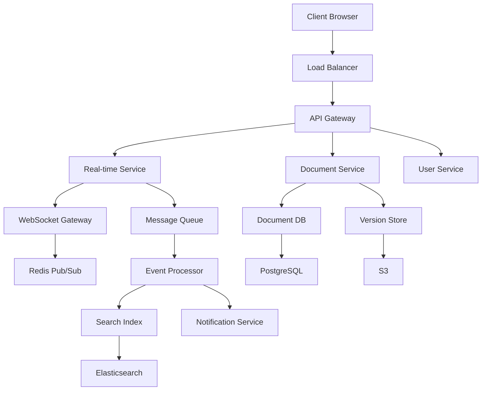
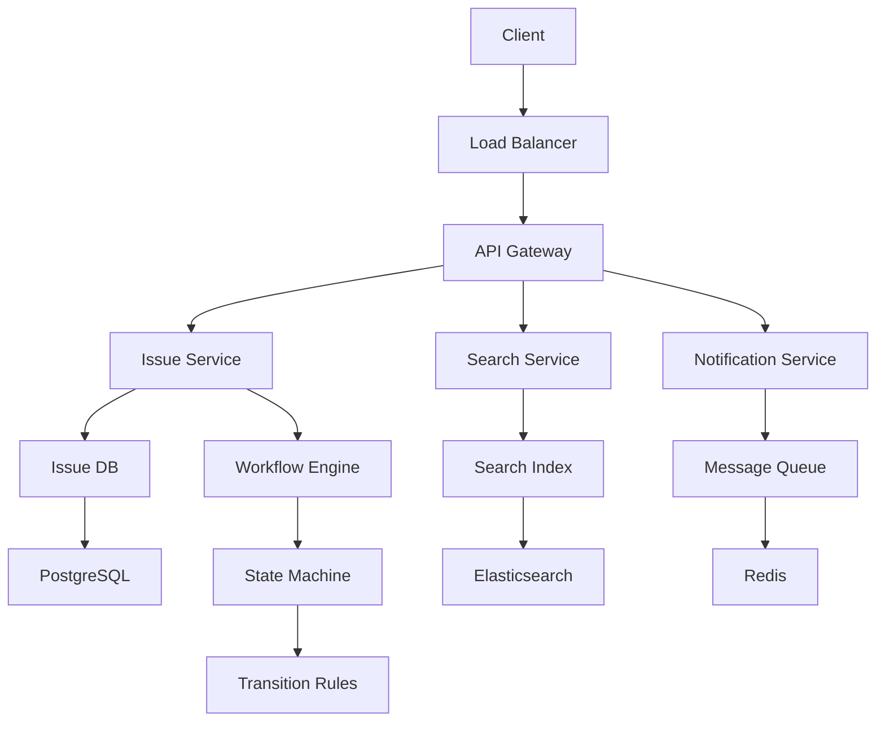
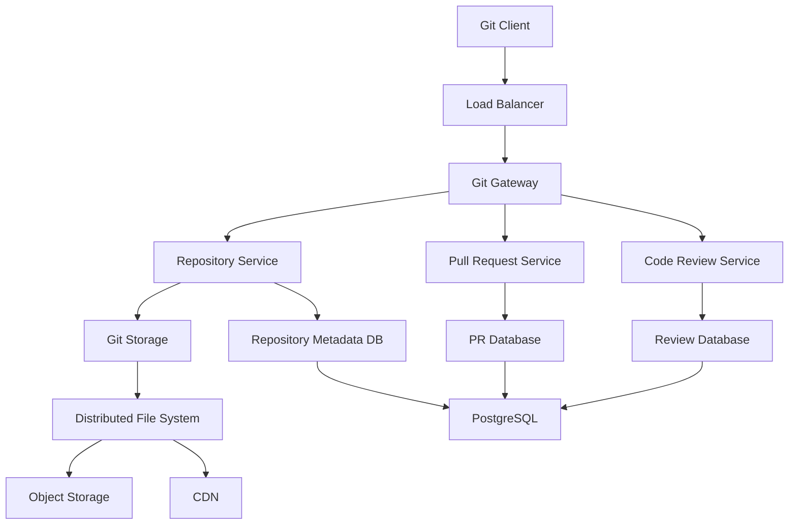

# Atlassian Round 2: System Design Interview

## 📋 Interview Format

- **Duration**: 45-60 minutes
- **Format**: Whiteboard/online drawing tool + discussion
- **Focus**: Scalability, collaboration features, and Atlassian-specific challenges
- **Level**: Senior Software Engineer / Staff Engineer

## 🎯 Atlassian-Specific Focus Areas

### Core Products Understanding

- **Jira**: Issue tracking, project management, workflow automation
- **Confluence**: Knowledge management, documentation, collaboration
- **Bitbucket**: Git repository management, code collaboration
- **Bamboo**: CI/CD pipeline management
- **Trello**: Kanban board management

### Key Challenges

- **Real-time Collaboration**: Multiple users editing simultaneously
- **Scale**: Millions of users, billions of issues
- **Integration**: Third-party app ecosystem
- **Data Consistency**: Across distributed systems
- **Performance**: Fast search and filtering

## 🔥 Common System Design Problems

### 1. Design a Real-time Document Collaboration System (Confluence-like)

#### Requirements Clarification

```
Functional Requirements:
- Multiple users can edit the same document simultaneously
- Real-time updates visible to all users
- Version history and conflict resolution
- Support for rich text, images, tables
- Comments and mentions

Non-functional Requirements:
- 10M+ active users
- 100K+ concurrent editors
- <100ms latency for updates
- 99.9% availability
- Support for documents up to 10MB
```

#### High-Level Design



#### Detailed Components

**1. Document Service (Golang)**

```go
type DocumentService struct {
    db          DocumentDB
    versionStore VersionStore
    eventBus    EventBus
    mutex       sync.RWMutex
}

type Document struct {
    ID          string    `json:"id"`
    Title       string    `json:"title"`
    Content     string    `json:"content"`
    Version     int       `json:"version"`
    LastUpdated time.Time `json:"last_updated"`
    CreatedBy   string    `json:"created_by"`
    SpaceID     string    `json:"space_id"`
}

func (ds *DocumentService) UpdateDocument(docID string, userID string, changes []Change) error {
    ds.mutex.Lock()
    defer ds.mutex.Unlock()

    // Get current document
    doc, err := ds.db.GetDocument(docID)
    if err != nil {
        return err
    }

    // Apply operational transforms
    transformedChanges, err := ds.applyOperationalTransform(doc, changes)
    if err != nil {
        return err
    }

    // Update document
    doc.Content = ds.applyChanges(doc.Content, transformedChanges)
    doc.Version++
    doc.LastUpdated = time.Now()

    // Save to database
    if err := ds.db.UpdateDocument(doc); err != nil {
        return err
    }

    // Save version
    version := &DocumentVersion{
        DocumentID: docID,
        Version:    doc.Version,
        Content:    doc.Content,
        Changes:    transformedChanges,
        UserID:     userID,
        Timestamp:  time.Now(),
    }

    if err := ds.versionStore.SaveVersion(version); err != nil {
        return err
    }

    // Publish event
    event := DocumentUpdatedEvent{
        DocumentID: docID,
        Changes:    transformedChanges,
        UserID:     userID,
        Version:    doc.Version,
        Timestamp:  time.Now(),
    }

    ds.eventBus.Publish("document.updated", event)

    return nil
}

func (ds *DocumentService) applyOperationalTransform(doc *Document, changes []Change) ([]Change, error) {
    // Implement operational transform algorithm
    // This ensures consistency when multiple users edit simultaneously

    var transformedChanges []Change
    for _, change := range changes {
        // Transform change based on concurrent changes
        transformed := ds.transformChange(change, doc.Version)
        transformedChanges = append(transformedChanges, transformed)
    }

    return transformedChanges, nil
}
```

**2. Real-time Service (WebSocket)**

```go
type RealTimeService struct {
    connections map[string]*Connection
    rooms       map[string][]*Connection
    mutex       sync.RWMutex
    eventBus    EventBus
}

type Connection struct {
    ID       string
    UserID   string
    DocumentID string
    WS       *websocket.Conn
    Send     chan []byte
}

func (rts *RealTimeService) HandleConnection(ws *websocket.Conn, userID, documentID string) {
    conn := &Connection{
        ID:         generateID(),
        UserID:     userID,
        DocumentID: documentID,
        WS:         ws,
        Send:       make(chan []byte, 256),
    }

    rts.mutex.Lock()
    rts.connections[conn.ID] = conn
    rts.rooms[documentID] = append(rts.rooms[documentID], conn)
    rts.mutex.Unlock()

    // Start goroutines for reading and writing
    go rts.readPump(conn)
    go rts.writePump(conn)

    // Subscribe to document events
    rts.eventBus.Subscribe(fmt.Sprintf("document.%s.updated", documentID), func(event DocumentUpdatedEvent) {
        rts.broadcastToRoom(documentID, event)
    })
}

func (rts *RealTimeService) broadcastToRoom(documentID string, event interface{}) {
    rts.mutex.RLock()
    connections := rts.rooms[documentID]
    rts.mutex.RUnlock()

    data, _ := json.Marshal(event)

    for _, conn := range connections {
        select {
        case conn.Send <- data:
        default:
            // Connection is slow, close it
            close(conn.Send)
            rts.removeConnection(conn)
        }
    }
}
```

**3. Operational Transform Implementation**

```go
type Change struct {
    Type      string `json:"type"` // "insert", "delete", "retain"
    Position  int    `json:"position"`
    Content   string `json:"content,omitempty"`
    Length    int    `json:"length,omitempty"`
    UserID    string `json:"user_id"`
    Timestamp int64  `json:"timestamp"`
}

func (ds *DocumentService) transformChange(change Change, baseVersion int) Change {
    // Get concurrent changes since baseVersion
    concurrentChanges := ds.getConcurrentChanges(change.DocumentID, baseVersion)

    // Apply operational transform
    transformed := change
    for _, concurrent := range concurrentChanges {
        transformed = ds.transformAgainst(transformed, concurrent)
    }

    return transformed
}

func (ds *DocumentService) transformAgainst(change1, change2 Change) Change {
    // Implement operational transform algorithm
    // This is a simplified version - real implementation is more complex

    if change1.Position <= change2.Position {
        if change1.Type == "insert" {
            // change1 is before change2, no transformation needed
            return change1
        } else if change1.Type == "delete" {
            // Adjust position based on change2
            if change2.Type == "insert" {
                return Change{
                    Type:     change1.Type,
                    Position: change1.Position,
                    Length:   change1.Length,
                    UserID:   change1.UserID,
                    Timestamp: change1.Timestamp,
                }
            }
        }
    }

    // More complex transformation logic here
    return change1
}
```

#### Database Design

```sql
-- Documents table
CREATE TABLE documents (
    id VARCHAR(36) PRIMARY KEY,
    title VARCHAR(255) NOT NULL,
    content TEXT NOT NULL,
    version INTEGER NOT NULL DEFAULT 1,
    space_id VARCHAR(36) NOT NULL,
    created_by VARCHAR(36) NOT NULL,
    created_at TIMESTAMP DEFAULT CURRENT_TIMESTAMP,
    updated_at TIMESTAMP DEFAULT CURRENT_TIMESTAMP,
    INDEX idx_space_id (space_id),
    INDEX idx_created_by (created_by)
);

-- Document versions table
CREATE TABLE document_versions (
    id VARCHAR(36) PRIMARY KEY,
    document_id VARCHAR(36) NOT NULL,
    version INTEGER NOT NULL,
    content TEXT NOT NULL,
    changes JSON NOT NULL,
    user_id VARCHAR(36) NOT NULL,
    created_at TIMESTAMP DEFAULT CURRENT_TIMESTAMP,
    FOREIGN KEY (document_id) REFERENCES documents(id),
    INDEX idx_document_version (document_id, version)
);

-- Document collaborators table
CREATE TABLE document_collaborators (
    document_id VARCHAR(36) NOT NULL,
    user_id VARCHAR(36) NOT NULL,
    permission ENUM('read', 'write', 'admin') NOT NULL,
    joined_at TIMESTAMP DEFAULT CURRENT_TIMESTAMP,
    PRIMARY KEY (document_id, user_id),
    FOREIGN KEY (document_id) REFERENCES documents(id)
);
```

### 2. Design a Scalable Issue Tracking System (Jira-like)

#### Requirements Clarification

```
Functional Requirements:
- Create, read, update, delete issues
- Workflow management with states and transitions
- Custom fields and issue types
- Search and filtering
- Comments and attachments
- Notifications and subscriptions

Non-functional Requirements:
- 50M+ issues
- 1M+ users
- 10K+ requests per second
- <200ms response time
- 99.9% availability
```

#### High-Level Design



#### Core Components

**1. Issue Service**

```go
type IssueService struct {
    db          IssueDB
    searchIndex SearchIndex
    workflow    WorkflowEngine
    eventBus    EventBus
}

type Issue struct {
    ID          string                 `json:"id"`
    Key         string                 `json:"key"` // e.g., "PROJ-123"
    Summary     string                 `json:"summary"`
    Description string                 `json:"description"`
    Type        string                 `json:"type"`
    Status      string                 `json:"status"`
    Priority    string                 `json:"priority"`
    Assignee    string                 `json:"assignee"`
    Reporter    string                 `json:"reporter"`
    ProjectID   string                 `json:"project_id"`
    CustomFields map[string]interface{} `json:"custom_fields"`
    CreatedAt   time.Time              `json:"created_at"`
    UpdatedAt   time.Time              `json:"updated_at"`
}

func (is *IssueService) CreateIssue(issue *Issue) error {
    // Generate issue key
    issue.Key = is.generateIssueKey(issue.ProjectID)

    // Set initial status based on workflow
    workflow, err := is.workflow.GetWorkflow(issue.ProjectID, issue.Type)
    if err != nil {
        return err
    }

    issue.Status = workflow.GetInitialStatus()

    // Save to database
    if err := is.db.CreateIssue(issue); err != nil {
        return err
    }

    // Index for search
    if err := is.searchIndex.IndexIssue(issue); err != nil {
        log.Printf("Failed to index issue %s: %v", issue.ID, err)
    }

    // Publish event
    event := IssueCreatedEvent{
        Issue:     issue,
        Timestamp: time.Now(),
    }
    is.eventBus.Publish("issue.created", event)

    return nil
}

func (is *IssueService) TransitionIssue(issueID, newStatus, userID string) error {
    issue, err := is.db.GetIssue(issueID)
    if err != nil {
        return err
    }

    // Check if transition is valid
    workflow, err := is.workflow.GetWorkflow(issue.ProjectID, issue.Type)
    if err != nil {
        return err
    }

    if !workflow.IsValidTransition(issue.Status, newStatus) {
        return errors.New("invalid transition")
    }

    // Update issue
    oldStatus := issue.Status
    issue.Status = newStatus
    issue.UpdatedAt = time.Now()

    if err := is.db.UpdateIssue(issue); err != nil {
        return err
    }

    // Publish event
    event := IssueTransitionedEvent{
        IssueID:    issueID,
        OldStatus:  oldStatus,
        NewStatus:  newStatus,
        UserID:     userID,
        Timestamp:  time.Now(),
    }
    is.eventBus.Publish("issue.transitioned", event)

    return nil
}
```

**2. Workflow Engine**

```go
type WorkflowEngine struct {
    workflows map[string]*Workflow
    mutex     sync.RWMutex
}

type Workflow struct {
    ID          string
    ProjectID   string
    IssueType   string
    States      []State
    Transitions []Transition
}

type State struct {
    Name        string
    Description string
    Category    string // "TODO", "IN_PROGRESS", "DONE"
}

type Transition struct {
    From      string
    To        string
    Name      string
    Conditions []Condition
    Actions   []Action
}

func (we *WorkflowEngine) IsValidTransition(workflowID, fromStatus, toStatus string) bool {
    we.mutex.RLock()
    defer we.mutex.RUnlock()

    workflow, exists := we.workflows[workflowID]
    if !exists {
        return false
    }

    for _, transition := range workflow.Transitions {
        if transition.From == fromStatus && transition.To == toStatus {
            return true
        }
    }

    return false
}

func (we *WorkflowEngine) GetValidTransitions(workflowID, currentStatus string) []Transition {
    we.mutex.RLock()
    defer we.mutex.RUnlock()

    workflow, exists := we.workflows[workflowID]
    if !exists {
        return nil
    }

    var validTransitions []Transition
    for _, transition := range workflow.Transitions {
        if transition.From == currentStatus {
            validTransitions = append(validTransitions, transition)
        }
    }

    return validTransitions
}
```

**3. Search Service**

```go
type SearchService struct {
    index SearchIndex
    cache Cache
}

func (ss *SearchService) SearchIssues(query SearchQuery) (*SearchResult, error) {
    // Check cache first
    cacheKey := ss.generateCacheKey(query)
    if cached, found := ss.cache.Get(cacheKey); found {
        return cached.(*SearchResult), nil
    }

    // Build Elasticsearch query
    esQuery := ss.buildElasticsearchQuery(query)

    // Execute search
    result, err := ss.index.Search(esQuery)
    if err != nil {
        return nil, err
    }

    // Cache result
    ss.cache.Set(cacheKey, result, 5*time.Minute)

    return result, nil
}

func (ss *SearchService) buildElasticsearchQuery(query SearchQuery) map[string]interface{} {
    esQuery := map[string]interface{}{
        "query": map[string]interface{}{
            "bool": map[string]interface{}{
                "must": []map[string]interface{}{},
            },
        },
        "from": query.Offset,
        "size": query.Limit,
    }

    // Add text search
    if query.Text != "" {
        textQuery := map[string]interface{}{
            "multi_match": map[string]interface{}{
                "query":  query.Text,
                "fields": []string{"summary^2", "description", "comments"},
            },
        }
        esQuery["query"].(map[string]interface{})["bool"].(map[string]interface{})["must"] =
            append(esQuery["query"].(map[string]interface{})["bool"].(map[string]interface{})["must"].([]map[string]interface{}), textQuery)
    }

    // Add filters
    if len(query.Filters) > 0 {
        filters := []map[string]interface{}{}
        for field, value := range query.Filters {
            filter := map[string]interface{}{
                "term": map[string]interface{}{
                    field: value,
                },
            }
            filters = append(filters, filter)
        }
        esQuery["query"].(map[string]interface{})["bool"].(map[string]interface{})["filter"] = filters
    }

    return esQuery
}
```

### 3. Design a Git Repository Management System (Bitbucket-like)

#### Requirements Clarification

```
Functional Requirements:
- Git repository hosting
- Branch and merge management
- Pull request workflow
- Code review system
- CI/CD integration
- Access control and permissions

Non-functional Requirements:
- 100M+ repositories
- 1TB+ storage per repository
- 50K+ concurrent operations
- <100ms response time for metadata
- 99.99% availability
```

#### High-Level Design



#### Core Components

**1. Git Gateway**

```go
type GitGateway struct {
    repositoryService RepositoryService
    authService      AuthService
    rateLimiter      RateLimiter
}

func (gg *GitGateway) HandleGitOperation(req *GitRequest) (*GitResponse, error) {
    // Authenticate user
    user, err := gg.authService.Authenticate(req.Token)
    if err != nil {
        return nil, err
    }

    // Check rate limits
    if !gg.rateLimiter.Allow(user.ID) {
        return nil, errors.New("rate limit exceeded")
    }

    // Check repository permissions
    if !gg.repositoryService.HasPermission(req.RepositoryID, user.ID, req.Operation) {
        return nil, errors.New("permission denied")
    }

    // Route to appropriate service
    switch req.Operation {
    case "git-upload-pack":
        return gg.handleGitUploadPack(req)
    case "git-receive-pack":
        return gg.handleGitReceivePack(req)
    default:
        return nil, errors.New("unsupported operation")
    }
}

func (gg *GitGateway) handleGitUploadPack(req *GitRequest) (*GitResponse, error) {
    // Handle git fetch/clone operations
    repository, err := gg.repositoryService.GetRepository(req.RepositoryID)
    if err != nil {
        return nil, err
    }

    // Stream git objects
    objects, err := gg.repositoryService.GetGitObjects(repository, req.Want, req.Have)
    if err != nil {
        return nil, err
    }

    return &GitResponse{
        Objects: objects,
        Type:    "git-upload-pack",
    }, nil
}
```

**2. Pull Request Service**

```go
type PullRequestService struct {
    db          PRDatabase
    gitService  GitService
    eventBus    EventBus
}

type PullRequest struct {
    ID           string    `json:"id"`
    Title        string    `json:"title"`
    Description  string    `json:"description"`
    SourceBranch string    `json:"source_branch"`
    TargetBranch string    `json:"target_branch"`
    AuthorID     string    `json:"author_id"`
    RepositoryID string    `json:"repository_id"`
    Status       string    `json:"status"` // "open", "merged", "closed"
    CreatedAt    time.Time `json:"created_at"`
    UpdatedAt    time.Time `json:"updated_at"`
}

func (prs *PullRequestService) CreatePullRequest(pr *PullRequest) error {
    // Validate branches exist
    if !prs.gitService.BranchExists(pr.RepositoryID, pr.SourceBranch) {
        return errors.New("source branch does not exist")
    }

    if !prs.gitService.BranchExists(pr.RepositoryID, pr.TargetBranch) {
        return errors.New("target branch does not exist")
    }

    // Set initial status
    pr.Status = "open"
    pr.CreatedAt = time.Now()
    pr.UpdatedAt = time.Now()

    // Save to database
    if err := prs.db.CreatePullRequest(pr); err != nil {
        return err
    }

    // Publish event
    event := PullRequestCreatedEvent{
        PullRequest: pr,
        Timestamp:   time.Now(),
    }
    prs.eventBus.Publish("pull_request.created", event)

    return nil
}

func (prs *PullRequestService) MergePullRequest(prID, userID string) error {
    pr, err := prs.db.GetPullRequest(prID)
    if err != nil {
        return err
    }

    if pr.Status != "open" {
        return errors.New("pull request is not open")
    }

    // Perform merge
    mergeCommit, err := prs.gitService.MergeBranches(
        pr.RepositoryID,
        pr.SourceBranch,
        pr.TargetBranch,
        userID,
    )
    if err != nil {
        return err
    }

    // Update pull request
    pr.Status = "merged"
    pr.UpdatedAt = time.Now()

    if err := prs.db.UpdatePullRequest(pr); err != nil {
        return err
    }

    // Publish event
    event := PullRequestMergedEvent{
        PullRequestID: prID,
        MergeCommit:   mergeCommit,
        UserID:        userID,
        Timestamp:     time.Now(),
    }
    prs.eventBus.Publish("pull_request.merged", event)

    return nil
}
```

## 🎯 Interview Tips

### Before the Interview

1. **Study Atlassian Products**: Understand Jira, Confluence, Bitbucket workflows
2. **Practice Real-time Systems**: WebSockets, operational transforms
3. **Review Collaboration Patterns**: Conflict resolution, version control
4. **Understand Scale**: Atlassian serves millions of users

### During the Interview

1. **Start with Requirements**: Clarify functional and non-functional requirements
2. **Draw High-Level Architecture**: Show main components and data flow
3. **Deep Dive into Components**: Focus on 2-3 core components
4. **Discuss Trade-offs**: Performance vs consistency, availability vs consistency
5. **Address Scale**: How to handle 10x, 100x traffic

### Common Follow-up Questions

1. **How do you handle conflicts in real-time collaboration?**
2. **How would you implement search across millions of issues?**
3. **How do you ensure data consistency across services?**
4. **How would you handle a database failure?**
5. **How do you monitor and debug distributed systems?**

## 📚 Preparation Resources

### System Design Resources

- [System Design Patterns](../../shared/system-design-patterns.md)
- [System Design Videos](../../shared/system-design-videos.md)
- [Designing Data-Intensive Applications](https://dataintensive.net/)

### Atlassian-Specific

- [Atlassian Architecture](https://www.atlassian.com/engineering)
- [Jira Architecture](https://developer.atlassian.com/cloud/jira/platform/rest/v2/)
- [Confluence Architecture](https://developer.atlassian.com/cloud/confluence/rest/v1/)

### Real-time Collaboration

- [Operational Transform](https://en.wikipedia.org/wiki/Operational_transformation)
- [Conflict-free Replicated Data Types](https://en.wikipedia.org/wiki/Conflict-free_replicated_data_type)
- [WebSocket Best Practices](https://tools.ietf.org/html/rfc6455)

## 🔗 Related Content

- [Coding Round 1](../atlassian/round1-coding.md) - For coding problems
- [Behavioral Round 3](../atlassian/round3-behavioral.md) - For behavioral questions
- [Golang Patterns](../../shared/golang-coding-patterns.md) - For implementation details
