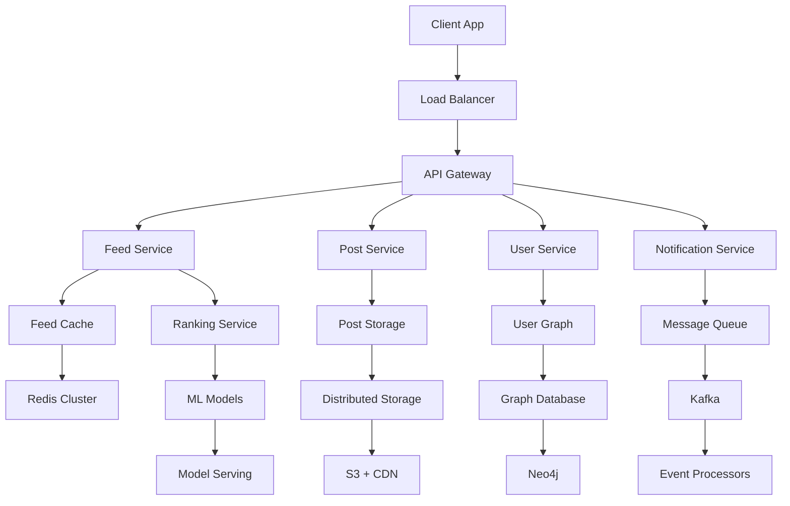
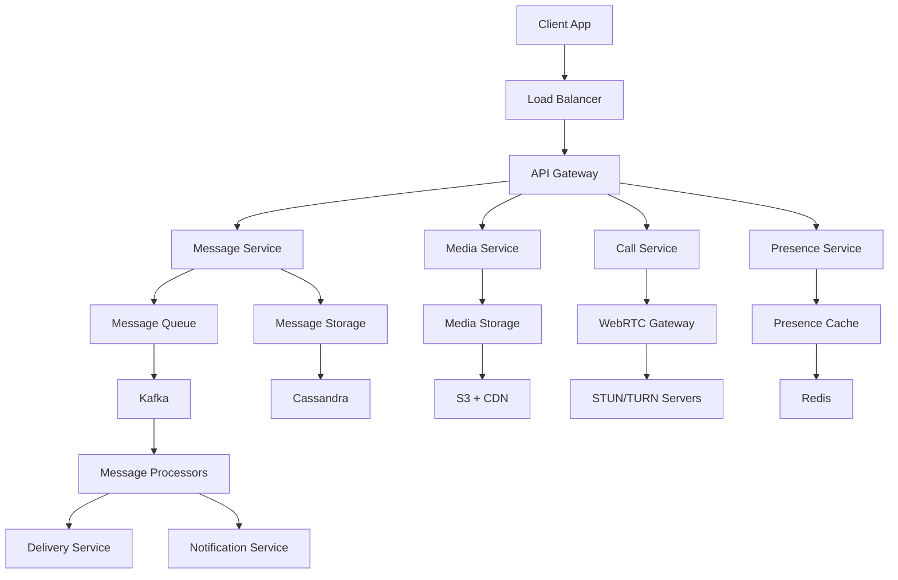
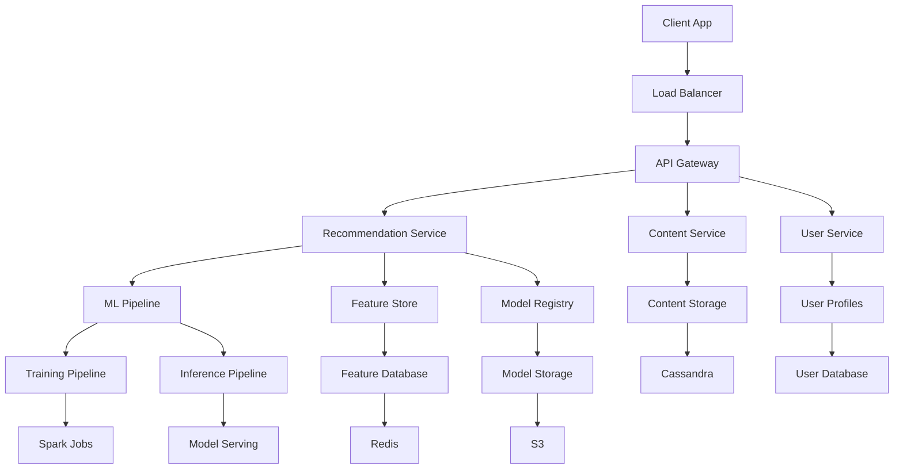

# Meta Round 2: System Design Interview

## 📋 Interview Format
- **Duration**: 45-60 minutes
- **Format**: Whiteboard/online drawing tool + discussion
- **Focus**: Scalability, social networks, and Meta-specific challenges
- **Level**: Senior Software Engineer / Staff Engineer

## 🎯 Meta-Specific Focus Areas

### Core Products Understanding
- **Facebook**: Social networking, news feed, messaging
- **Instagram**: Photo/video sharing, stories, reels
- **WhatsApp**: Messaging, voice/video calls, status
- **Messenger**: Real-time messaging, video calls
- **Oculus**: VR/AR experiences and platforms

### Key Challenges
- **Massive Scale**: Billions of users, trillions of interactions
- **Real-time Systems**: Instant messaging, live streaming
- **Content Moderation**: AI-powered content filtering
- **Recommendation Systems**: Personalized content feeds
- **Data Privacy**: User data protection and compliance

## 🔥 Common System Design Problems

### 1. Design a Social Media News Feed (Facebook-like)

#### Requirements Clarification
```
Functional Requirements:
- Users can post text, images, videos
- News feed shows posts from friends/pages user follows
- Like, comment, share functionality
- Real-time updates in feed
- Personalized content ranking

Non-functional Requirements:
- 2B+ active users
- 1M+ posts per second
- <200ms feed generation time
- 99.9% availability
- Support for 10+ content types
```

#### High-Level Design



#### Detailed Components

**1. Feed Service (Golang)**
```go
package main

import (
    "context"
    "encoding/json"
    "fmt"
    "sync"
    "time"
)

type FeedService struct {
    userService    UserService
    postService    PostService
    rankingService RankingService
    cache         Cache
    eventBus      EventBus
    mutex         sync.RWMutex
}

type FeedRequest struct {
    UserID    string `json:"user_id"`
    PageSize  int    `json:"page_size"`
    Cursor    string `json:"cursor"`
    Timestamp int64  `json:"timestamp"`
}

type FeedResponse struct {
    Posts    []Post `json:"posts"`
    NextCursor string `json:"next_cursor"`
    HasMore  bool   `json:"has_more"`
}

type Post struct {
    ID          string    `json:"id"`
    UserID      string    `json:"user_id"`
    Content     string    `json:"content"`
    MediaURLs   []string  `json:"media_urls"`
    Type        string    `json:"type"`
    CreatedAt   time.Time `json:"created_at"`
    UpdatedAt   time.Time `json:"updated_at"`
    Likes       int       `json:"likes"`
    Comments    int       `json:"comments"`
    Shares      int       `json:"shares"`
    Score       float64   `json:"score"`
}

func (fs *FeedService) GetFeed(ctx context.Context, req *FeedRequest) (*FeedResponse, error) {
    // Check cache first
    cacheKey := fmt.Sprintf("feed:%s:%s", req.UserID, req.Cursor)
    if cached, found := fs.cache.Get(cacheKey); found {
        return cached.(*FeedResponse), nil
    }
    
    // Get user's social graph
    friends, err := fs.userService.GetFriends(req.UserID)
    if err != nil {
        return nil, fmt.Errorf("failed to get friends: %w", err)
    }
    
    // Get posts from friends
    posts, err := fs.postService.GetPostsByUsers(friends, req.PageSize, req.Cursor)
    if err != nil {
        return nil, fmt.Errorf("failed to get posts: %w", err)
    }
    
    // Rank posts using ML models
    rankedPosts, err := fs.rankingService.RankPosts(req.UserID, posts)
    if err != nil {
        return nil, fmt.Errorf("failed to rank posts: %w", err)
    }
    
    // Generate next cursor
    nextCursor := fs.generateNextCursor(rankedPosts)
    
    response := &FeedResponse{
        Posts:      rankedPosts,
        NextCursor: nextCursor,
        HasMore:    len(rankedPosts) == req.PageSize,
    }
    
    // Cache the response
    fs.cache.Set(cacheKey, response, 5*time.Minute)
    
    return response, nil
}

func (fs *FeedService) generateNextCursor(posts []Post) string {
    if len(posts) == 0 {
        return ""
    }
    
    lastPost := posts[len(posts)-1]
    return fmt.Sprintf("%d_%s", lastPost.CreatedAt.Unix(), lastPost.ID)
}

func (fs *FeedService) InvalidateFeedCache(userID string) {
    // Invalidate all cached feeds for this user
    pattern := fmt.Sprintf("feed:%s:*", userID)
    fs.cache.DeletePattern(pattern)
}
```

**2. Ranking Service (ML Integration)**
```go
type RankingService struct {
    mlClient    MLClient
    userService UserService
    cache       Cache
}

type RankingFeatures struct {
    UserID           string            `json:"user_id"`
    PostID           string            `json:"post_id"`
    PostType         string            `json:"post_type"`
    PostAge          float64           `json:"post_age_hours"`
    UserEngagement   float64           `json:"user_engagement_score"`
    PostEngagement   float64           `json:"post_engagement_score"`
    SocialSignals    SocialSignals     `json:"social_signals"`
    ContentFeatures  ContentFeatures   `json:"content_features"`
}

type SocialSignals struct {
    LikesCount    int     `json:"likes_count"`
    CommentsCount int     `json:"comments_count"`
    SharesCount   int     `json:"shares_count"`
    ViewCount     int     `json:"view_count"`
    LikeRate      float64 `json:"like_rate"`
    CommentRate   float64 `json:"comment_rate"`
    ShareRate     float64 `json:"share_rate"`
}

type ContentFeatures struct {
    TextLength     int     `json:"text_length"`
    HasImage       bool    `json:"has_image"`
    HasVideo       bool    `json:"has_video"`
    HasLink        bool    `json:"has_link"`
    SentimentScore float64 `json:"sentiment_score"`
    TopicCategory  string  `json:"topic_category"`
}

func (rs *RankingService) RankPosts(userID string, posts []Post) ([]Post, error) {
    // Get user features
    userFeatures, err := rs.getUserFeatures(userID)
    if err != nil {
        return nil, err
    }
    
    // Prepare features for each post
    var features []RankingFeatures
    for _, post := range posts {
        feature := rs.extractPostFeatures(userID, post, userFeatures)
        features = append(features, feature)
    }
    
    // Get ML predictions
    scores, err := rs.mlClient.Predict(features)
    if err != nil {
        return nil, err
    }
    
    // Sort posts by score
    for i, post := range posts {
        post.Score = scores[i]
    }
    
    // Sort by score (descending)
    sort.Slice(posts, func(i, j int) bool {
        return posts[i].Score > posts[j].Score
    })
    
    return posts, nil
}

func (rs *RankingService) extractPostFeatures(userID string, post Post, userFeatures UserFeatures) RankingFeatures {
    postAge := time.Since(post.CreatedAt).Hours()
    
    return RankingFeatures{
        UserID:         userID,
        PostID:         post.ID,
        PostType:       post.Type,
        PostAge:        postAge,
        UserEngagement: userFeatures.EngagementScore,
        PostEngagement: rs.calculatePostEngagement(post),
        SocialSignals: SocialSignals{
            LikesCount:    post.Likes,
            CommentsCount: post.Comments,
            SharesCount:   post.Shares,
            LikeRate:      float64(post.Likes) / float64(post.Likes+1),
            CommentRate:   float64(post.Comments) / float64(post.Likes+1),
            ShareRate:     float64(post.Shares) / float64(post.Likes+1),
        },
        ContentFeatures: ContentFeatures{
            TextLength:     len(post.Content),
            HasImage:       len(post.MediaURLs) > 0 && rs.hasImage(post.MediaURLs),
            HasVideo:       len(post.MediaURLs) > 0 && rs.hasVideo(post.MediaURLs),
            HasLink:        rs.hasLink(post.Content),
            SentimentScore: rs.analyzeSentiment(post.Content),
            TopicCategory:  rs.classifyTopic(post.Content),
        },
    }
}
```

**3. Real-time Updates (WebSocket)**
```go
type FeedUpdateService struct {
    connections map[string]*Connection
    mutex       sync.RWMutex
    eventBus    EventBus
}

type Connection struct {
    ID       string
    UserID   string
    WS       *websocket.Conn
    Send     chan []byte
    LastSeen time.Time
}

type FeedUpdate struct {
    Type      string      `json:"type"` // "new_post", "like", "comment", "share"
    PostID    string      `json:"post_id"`
    UserID    string      `json:"user_id"`
    Data      interface{} `json:"data"`
    Timestamp time.Time   `json:"timestamp"`
}

func (fus *FeedUpdateService) HandleConnection(ws *websocket.Conn, userID string) {
    conn := &Connection{
        ID:       generateID(),
        UserID:   userID,
        WS:       ws,
        Send:     make(chan []byte, 256),
        LastSeen: time.Now(),
    }
    
    fus.mutex.Lock()
    fus.connections[conn.ID] = conn
    fus.mutex.Unlock()
    
    // Start goroutines
    go fus.writePump(conn)
    go fus.readPump(conn)
    
    // Subscribe to user's feed updates
    fus.eventBus.Subscribe(fmt.Sprintf("feed_updates:%s", userID), func(update FeedUpdate) {
        fus.sendToConnection(conn, update)
    })
}

func (fus *FeedUpdateService) sendToConnection(conn *Connection, update FeedUpdate) {
    data, _ := json.Marshal(update)
    
    select {
    case conn.Send <- data:
    default:
        // Connection is slow, close it
        close(conn.Send)
        fus.removeConnection(conn)
    }
}

func (fus *FeedUpdateService) writePump(conn *Connection) {
    ticker := time.NewTicker(54 * time.Second)
    defer ticker.Stop()
    
    for {
        select {
        case message := <-conn.Send:
            conn.WS.SetWriteDeadline(time.Now().Add(10 * time.Second))
            if err := conn.WS.WriteMessage(websocket.TextMessage, message); err != nil {
                return
            }
        case <-ticker.C:
            conn.WS.SetWriteDeadline(time.Now().Add(10 * time.Second))
            if err := conn.WS.WriteMessage(websocket.PingMessage, nil); err != nil {
                return
            }
        }
    }
}
```

#### Database Design
```sql
-- Posts table
CREATE TABLE posts (
    id VARCHAR(36) PRIMARY KEY,
    user_id VARCHAR(36) NOT NULL,
    content TEXT NOT NULL,
    post_type ENUM('text', 'image', 'video', 'link') NOT NULL,
    media_urls JSON,
    created_at TIMESTAMP DEFAULT CURRENT_TIMESTAMP,
    updated_at TIMESTAMP DEFAULT CURRENT_TIMESTAMP,
    likes_count INT DEFAULT 0,
    comments_count INT DEFAULT 0,
    shares_count INT DEFAULT 0,
    score FLOAT DEFAULT 0.0,
    INDEX idx_user_created (user_id, created_at),
    INDEX idx_created_score (created_at, score),
    INDEX idx_type_created (post_type, created_at)
);

-- User relationships table
CREATE TABLE user_relationships (
    follower_id VARCHAR(36) NOT NULL,
    following_id VARCHAR(36) NOT NULL,
    created_at TIMESTAMP DEFAULT CURRENT_TIMESTAMP,
    PRIMARY KEY (follower_id, following_id),
    INDEX idx_follower (follower_id),
    INDEX idx_following (following_id)
);

-- Feed cache table
CREATE TABLE feed_cache (
    user_id VARCHAR(36) NOT NULL,
    cursor VARCHAR(100) NOT NULL,
    posts JSON NOT NULL,
    created_at TIMESTAMP DEFAULT CURRENT_TIMESTAMP,
    expires_at TIMESTAMP NOT NULL,
    PRIMARY KEY (user_id, cursor),
    INDEX idx_expires (expires_at)
);
```

### 2. Design a Real-time Messaging System (WhatsApp-like)

#### Requirements Clarification
```
Functional Requirements:
- Send/receive text messages, images, videos, documents
- Group messaging with up to 256 members
- Message status (sent, delivered, read)
- Voice and video calls
- Message encryption
- Message search and history

Non-functional Requirements:
- 2B+ users
- 100B+ messages per day
- <100ms message delivery time
- 99.99% availability
- End-to-end encryption
```

#### High-Level Design



#### Core Components

**1. Message Service (Golang)**
```go
type MessageService struct {
    messageQueue MessageQueue
    messageStore MessageStore
    mediaService MediaService
    encryption   EncryptionService
    presence     PresenceService
    mutex        sync.RWMutex
}

type Message struct {
    ID          string    `json:"id"`
    SenderID    string    `json:"sender_id"`
    ReceiverID  string    `json:"receiver_id"`
    GroupID     string    `json:"group_id,omitempty"`
    Content     string    `json:"content"`
    Type        string    `json:"type"` // text, image, video, document
    MediaURL    string    `json:"media_url,omitempty"`
    Encrypted   bool      `json:"encrypted"`
    CreatedAt   time.Time `json:"created_at"`
    Status      string    `json:"status"` // sent, delivered, read
}

type GroupMessage struct {
    ID        string    `json:"id"`
    SenderID  string    `json:"sender_id"`
    GroupID   string    `json:"group_id"`
    Content   string    `json:"content"`
    Type      string    `json:"type"`
    MediaURL  string    `json:"media_url,omitempty"`
    CreatedAt time.Time `json:"created_at"`
    Status    string    `json:"status"`
}

func (ms *MessageService) SendMessage(ctx context.Context, msg *Message) error {
    // Encrypt message content
    if msg.Encrypted {
        encryptedContent, err := ms.encryption.Encrypt(msg.Content, msg.ReceiverID)
        if err != nil {
            return fmt.Errorf("failed to encrypt message: %w", err)
        }
        msg.Content = encryptedContent
    }
    
    // Store message
    if err := ms.messageStore.StoreMessage(msg); err != nil {
        return fmt.Errorf("failed to store message: %w", err)
    }
    
    // Queue message for delivery
    deliveryEvent := MessageDeliveryEvent{
        MessageID:   msg.ID,
        SenderID:    msg.SenderID,
        ReceiverID:  msg.ReceiverID,
        GroupID:     msg.GroupID,
        Content:     msg.Content,
        Type:        msg.Type,
        MediaURL:    msg.MediaURL,
        Encrypted:   msg.Encrypted,
        Timestamp:   time.Now(),
    }
    
    if err := ms.messageQueue.Publish("message.delivery", deliveryEvent); err != nil {
        return fmt.Errorf("failed to queue message: %w", err)
    }
    
    return nil
}

func (ms *MessageService) SendGroupMessage(ctx context.Context, msg *GroupMessage) error {
    // Get group members
    members, err := ms.getGroupMembers(msg.GroupID)
    if err != nil {
        return fmt.Errorf("failed to get group members: %w", err)
    }
    
    // Send message to each member
    for _, memberID := range members {
        if memberID == msg.SenderID {
            continue // Skip sender
        }
        
        individualMsg := &Message{
            ID:         generateID(),
            SenderID:   msg.SenderID,
            ReceiverID: memberID,
            GroupID:    msg.GroupID,
            Content:    msg.Content,
            Type:       msg.Type,
            MediaURL:   msg.MediaURL,
            Encrypted:  true, // Group messages are always encrypted
            CreatedAt:  msg.CreatedAt,
            Status:     "sent",
        }
        
        if err := ms.SendMessage(ctx, individualMsg); err != nil {
            log.Printf("Failed to send group message to %s: %v", memberID, err)
        }
    }
    
    return nil
}

func (ms *MessageService) GetMessages(ctx context.Context, userID, otherUserID string, limit int, cursor string) ([]Message, error) {
    // Get messages between two users
    messages, err := ms.messageStore.GetMessages(userID, otherUserID, limit, cursor)
    if err != nil {
        return nil, fmt.Errorf("failed to get messages: %w", err)
    }
    
    // Decrypt messages if needed
    for i, msg := range messages {
        if msg.Encrypted {
            decryptedContent, err := ms.encryption.Decrypt(msg.Content, userID)
            if err != nil {
                log.Printf("Failed to decrypt message %s: %v", msg.ID, err)
                continue
            }
            messages[i].Content = decryptedContent
        }
    }
    
    return messages, nil
}
```

**2. Media Service (Node.js)**
```javascript
const AWS = require('aws-sdk');
const sharp = require('sharp');
const crypto = require('crypto');

class MediaService {
  constructor() {
    this.s3 = new AWS.S3({
      region: process.env.AWS_REGION,
      accessKeyId: process.env.AWS_ACCESS_KEY_ID,
      secretAccessKey: process.env.AWS_SECRET_ACCESS_KEY
    });
    this.cloudFront = new AWS.CloudFront();
    this.maxFileSize = 100 * 1024 * 1024; // 100MB
    this.allowedTypes = ['image/jpeg', 'image/png', 'image/gif', 'video/mp4', 'video/avi'];
  }

  async uploadMedia(file, userID, messageID) {
    // Validate file
    if (!this.validateFile(file)) {
      throw new Error('Invalid file type or size');
    }

    // Generate unique filename
    const fileExtension = this.getFileExtension(file.originalname);
    const fileName = `${userID}/${messageID}/${Date.now()}.${fileExtension}`;

    try {
      // Process file based on type
      let processedBuffer = file.buffer;
      if (file.mimetype.startsWith('image/')) {
        processedBuffer = await this.processImage(file.buffer);
      } else if (file.mimetype.startsWith('video/')) {
        processedBuffer = await this.processVideo(file.buffer);
      }

      // Upload to S3
      const uploadParams = {
        Bucket: process.env.S3_BUCKET,
        Key: fileName,
        Body: processedBuffer,
        ContentType: file.mimetype,
        ACL: 'private'
      };

      const result = await this.s3.upload(uploadParams).promise();

      // Generate signed URL for access
      const signedUrl = this.generateSignedUrl(fileName);

      return {
        fileName,
        url: signedUrl,
        size: processedBuffer.length,
        type: file.mimetype
      };
    } catch (error) {
      throw new Error(`Failed to upload media: ${error.message}`);
    }
  }

  async processImage(buffer) {
    // Resize and optimize image
    return await sharp(buffer)
      .resize(1920, 1080, { fit: 'inside', withoutEnlargement: true })
      .jpeg({ quality: 85 })
      .toBuffer();
  }

  async processVideo(buffer) {
    // For now, return original buffer
    // In production, use FFmpeg for video processing
    return buffer;
  }

  validateFile(file) {
    if (file.size > this.maxFileSize) {
      return false;
    }

    if (!this.allowedTypes.includes(file.mimetype)) {
      return false;
    }

    return true;
  }

  generateSignedUrl(fileName) {
    const params = {
      Bucket: process.env.S3_BUCKET,
      Key: fileName,
      Expires: 3600 // 1 hour
    };

    return this.s3.getSignedUrl('getObject', params);
  }

  async deleteMedia(fileName) {
    const params = {
      Bucket: process.env.S3_BUCKET,
      Key: fileName
    };

    try {
      await this.s3.deleteObject(params).promise();
      return true;
    } catch (error) {
      console.error('Failed to delete media:', error);
      return false;
    }
  }
}
```

**3. Call Service (WebRTC)**
```javascript
class CallService {
  constructor() {
    this.activeCalls = new Map();
    this.stunServers = [
      'stun:stun.l.google.com:19302',
      'stun:stun1.l.google.com:19302'
    ];
    this.turnServers = [
      'turn:turnserver.com:3478'
    ];
  }

  async initiateCall(callerID, receiverID, callType) {
    const callID = this.generateCallID();
    
    const call = {
      id: callID,
      callerID,
      receiverID,
      type: callType, // 'audio' or 'video'
      status: 'initiating',
      startTime: new Date(),
      participants: [callerID, receiverID]
    };

    this.activeCalls.set(callID, call);

    // Send call invitation
    await this.sendCallInvitation(call);

    return callID;
  }

  async answerCall(callID, answererID, accepted) {
    const call = this.activeCalls.get(callID);
    if (!call) {
      throw new Error('Call not found');
    }

    if (call.receiverID !== answererID) {
      throw new Error('Unauthorized to answer this call');
    }

    if (accepted) {
      call.status = 'active';
      call.answerTime = new Date();
      
      // Notify caller that call was accepted
      await this.notifyCallAccepted(call);
    } else {
      call.status = 'rejected';
      call.endTime = new Date();
      
      // Notify caller that call was rejected
      await this.notifyCallRejected(call);
    }

    this.activeCalls.set(callID, call);
  }

  async endCall(callID, userID) {
    const call = this.activeCalls.get(callID);
    if (!call) {
      throw new Error('Call not found');
    }

    if (!call.participants.includes(userID)) {
      throw new Error('Unauthorized to end this call');
    }

    call.status = 'ended';
    call.endTime = new Date();
    call.duration = call.endTime - call.startTime;

    // Notify all participants
    await this.notifyCallEnded(call);

    // Store call record
    await this.storeCallRecord(call);

    this.activeCalls.delete(callID);
  }

  async getCallHistory(userID, limit = 50, offset = 0) {
    // Get call history from database
    const calls = await this.db.query(`
      SELECT * FROM call_history 
      WHERE caller_id = ? OR receiver_id = ? 
      ORDER BY start_time DESC 
      LIMIT ? OFFSET ?
    `, [userID, userID, limit, offset]);

    return calls;
  }

  generateCallID() {
    return crypto.randomBytes(16).toString('hex');
  }
}
```

### 3. Design a Recommendation System (Instagram-like)

#### Requirements Clarification
```
Functional Requirements:
- Recommend posts based on user interests
- Recommend users to follow
- Recommend stories and reels
- Personalized content ranking
- A/B testing for recommendation algorithms

Non-functional Requirements:
- 1B+ users
- 100M+ posts per day
- <50ms recommendation generation
- 99.9% availability
- Support for multiple ML models
```

#### High-Level Design



#### Core Components

**1. Recommendation Service (Golang)**
```go
type RecommendationService struct {
    featureStore    FeatureStore
    modelRegistry   ModelRegistry
    contentService  ContentService
    userService     UserService
    cache          Cache
    mutex          sync.RWMutex
}

type RecommendationRequest struct {
    UserID    string `json:"user_id"`
    Type      string `json:"type"` // "posts", "users", "stories"
    Limit     int    `json:"limit"`
    Context   map[string]interface{} `json:"context"`
}

type RecommendationResponse struct {
    Items     []RecommendedItem `json:"items"`
    Model     string            `json:"model"`
    Timestamp time.Time         `json:"timestamp"`
}

type RecommendedItem struct {
    ID          string  `json:"id"`
    Type        string  `json:"type"`
    Score       float64 `json:"score"`
    Reason      string  `json:"reason"`
    Metadata    map[string]interface{} `json:"metadata"`
}

func (rs *RecommendationService) GetRecommendations(ctx context.Context, req *RecommendationRequest) (*RecommendationResponse, error) {
    // Get user features
    userFeatures, err := rs.getUserFeatures(req.UserID)
    if err != nil {
        return nil, fmt.Errorf("failed to get user features: %w", err)
    }
    
    // Get candidate items
    candidates, err := rs.getCandidateItems(req.UserID, req.Type, req.Limit*3)
    if err != nil {
        return nil, fmt.Errorf("failed to get candidates: %w", err)
    }
    
    // Get model for recommendation type
    model, err := rs.modelRegistry.GetModel(req.Type)
    if err != nil {
        return nil, fmt.Errorf("failed to get model: %w", err)
    }
    
    // Score candidates
    scoredItems, err := rs.scoreCandidates(model, userFeatures, candidates)
    if err != nil {
        return nil, fmt.Errorf("failed to score candidates: %w", err)
    }
    
    // Rank and filter
    rankedItems := rs.rankItems(scoredItems, req.Limit)
    
    // Apply business rules
    filteredItems := rs.applyBusinessRules(rankedItems, req.UserID)
    
    return &RecommendationResponse{
        Items:     filteredItems,
        Model:     model.Name,
        Timestamp: time.Now(),
    }, nil
}

func (rs *RecommendationService) scoreCandidates(model Model, userFeatures UserFeatures, candidates []CandidateItem) ([]ScoredItem, error) {
    var scoredItems []ScoredItem
    
    for _, candidate := range candidates {
        // Extract features for this candidate
        features := rs.extractFeatures(userFeatures, candidate)
        
        // Get model prediction
        score, err := model.Predict(features)
        if err != nil {
            log.Printf("Failed to predict score for candidate %s: %v", candidate.ID, err)
            continue
        }
        
        scoredItems = append(scoredItems, ScoredItem{
            Item:  candidate,
            Score: score,
        })
    }
    
    return scoredItems, nil
}

func (rs *RecommendationService) extractFeatures(userFeatures UserFeatures, candidate CandidateItem) map[string]interface{} {
    features := make(map[string]interface{})
    
    // User features
    features["user_age"] = userFeatures.Age
    features["user_gender"] = userFeatures.Gender
    features["user_interests"] = userFeatures.Interests
    features["user_activity_level"] = userFeatures.ActivityLevel
    
    // Candidate features
    features["candidate_type"] = candidate.Type
    features["candidate_popularity"] = candidate.Popularity
    features["candidate_freshness"] = candidate.Freshness
    features["candidate_quality"] = candidate.Quality
    
    // Interaction features
    features["user_candidate_interaction"] = rs.getUserCandidateInteraction(userFeatures.UserID, candidate.ID)
    features["similarity_score"] = rs.calculateSimilarity(userFeatures, candidate)
    
    return features
}
```

**2. Feature Store (Node.js)**
```javascript
class FeatureStore {
  constructor() {
    this.redis = new Redis(process.env.REDIS_URL);
    this.db = new Database(process.env.DATABASE_URL);
    this.cache = new Map();
  }

  async getUserFeatures(userID) {
    // Check cache first
    const cacheKey = `user_features:${userID}`;
    if (this.cache.has(cacheKey)) {
      return this.cache.get(cacheKey);
    }

    // Check Redis
    const cached = await this.redis.get(cacheKey);
    if (cached) {
      const features = JSON.parse(cached);
      this.cache.set(cacheKey, features);
      return features;
    }

    // Get from database
    const features = await this.db.query(`
      SELECT 
        u.id,
        u.age,
        u.gender,
        u.created_at,
        u.last_active,
        COUNT(DISTINCT p.id) as post_count,
        COUNT(DISTINCT f.following_id) as following_count,
        COUNT(DISTINCT f2.follower_id) as follower_count,
        AVG(p.likes_count) as avg_likes,
        AVG(p.comments_count) as avg_comments
      FROM users u
      LEFT JOIN posts p ON u.id = p.user_id
      LEFT JOIN follows f ON u.id = f.follower_id
      LEFT JOIN follows f2 ON u.id = f2.following_id
      WHERE u.id = ?
      GROUP BY u.id
    `, [userID]);

    if (features.length === 0) {
      throw new Error('User not found');
    }

    const userFeatures = {
      userID: features[0].id,
      age: features[0].age,
      gender: features[0].gender,
      createdAt: features[0].created_at,
      lastActive: features[0].last_active,
      postCount: features[0].post_count || 0,
      followingCount: features[0].following_count || 0,
      followerCount: features[0].follower_count || 0,
      avgLikes: features[0].avg_likes || 0,
      avgComments: features[0].avg_comments || 0,
      interests: await this.getUserInterests(userID),
      activityLevel: this.calculateActivityLevel(features[0])
    };

    // Cache the result
    await this.redis.setex(cacheKey, 3600, JSON.stringify(userFeatures));
    this.cache.set(cacheKey, userFeatures);

    return userFeatures;
  }

  async getContentFeatures(contentID) {
    const cacheKey = `content_features:${contentID}`;
    
    if (this.cache.has(cacheKey)) {
      return this.cache.get(cacheKey);
    }

    const cached = await this.redis.get(cacheKey);
    if (cached) {
      const features = JSON.parse(cached);
      this.cache.set(cacheKey, features);
      return features;
    }

    const content = await this.db.query(`
      SELECT 
        p.id,
        p.user_id,
        p.content,
        p.type,
        p.created_at,
        p.likes_count,
        p.comments_count,
        p.shares_count,
        p.views_count,
        u.follower_count,
        u.verified
      FROM posts p
      JOIN users u ON p.user_id = u.id
      WHERE p.id = ?
    `, [contentID]);

    if (content.length === 0) {
      throw new Error('Content not found');
    }

    const contentFeatures = {
      contentID: content[0].id,
      userID: content[0].user_id,
      content: content[0].content,
      type: content[0].type,
      createdAt: content[0].created_at,
      likesCount: content[0].likes_count,
      commentsCount: content[0].comments_count,
      sharesCount: content[0].shares_count,
      viewsCount: content[0].views_count,
      authorFollowerCount: content[0].follower_count,
      authorVerified: content[0].verified,
      freshness: this.calculateFreshness(content[0].created_at),
      engagement: this.calculateEngagement(content[0]),
      sentiment: await this.analyzeSentiment(content[0].content),
      topics: await this.extractTopics(content[0].content)
    };

    await this.redis.setex(cacheKey, 1800, JSON.stringify(contentFeatures));
    this.cache.set(cacheKey, contentFeatures);

    return contentFeatures;
  }

  calculateActivityLevel(user) {
    const now = new Date();
    const lastActive = new Date(user.last_active);
    const daysSinceActive = (now - lastActive) / (1000 * 60 * 60 * 24);

    if (daysSinceActive < 1) return 'high';
    if (daysSinceActive < 7) return 'medium';
    return 'low';
  }

  calculateFreshness(createdAt) {
    const now = new Date();
    const created = new Date(createdAt);
    const hoursSinceCreated = (now - created) / (1000 * 60 * 60);

    return Math.exp(-hoursSinceCreated / 24); // Exponential decay
  }

  calculateEngagement(post) {
    const totalInteractions = post.likes_count + post.comments_count + post.shares_count;
    const views = Math.max(post.views_count, 1);
    
    return totalInteractions / views;
  }
}
```

## 🎯 Interview Tips

### Before the Interview
1. **Study Meta's Scale**: Understand billions of users, massive data
2. **Review Social Networks**: News feeds, messaging, recommendations
3. **Practice Real-time Systems**: WebSockets, event streaming
4. **Study ML Integration**: Recommendation systems, content ranking

### During the Interview
1. **Start with Scale**: Always consider Meta's massive scale
2. **Focus on Real-time**: Emphasize real-time features
3. **Discuss ML**: Show understanding of ML integration
4. **Address Privacy**: Consider data privacy and security
5. **Think Global**: Consider international users and regulations

### Common Follow-up Questions
1. **How do you handle 1 billion concurrent users?**
2. **How would you implement real-time messaging?**
3. **How do you ensure data privacy and security?**
4. **How would you handle content moderation at scale?**
5. **How do you optimize for mobile performance?**

## 📚 Preparation Resources

### System Design Resources
- [System Design Patterns](../../shared/system-design-patterns.md)
- [System Design Videos](../../shared/system-design-videos.md)
- [Meta Engineering Blog](https://engineering.fb.com/)

### Meta-Specific
- [Meta Scale](https://engineering.fb.com/data-infrastructure/)
- [Meta AI/ML](https://ai.facebook.com/)
- [Meta Open Source](https://opensource.fb.com/)

## 🔗 Related Content
- [Coding Round 1](./round1-coding.md) - For coding problems
- [Product Sense Round 3](./round3-product-sense.md) - For product thinking
- [Behavioral Round 4](./round4-behavioral.md) - For behavioral questions

