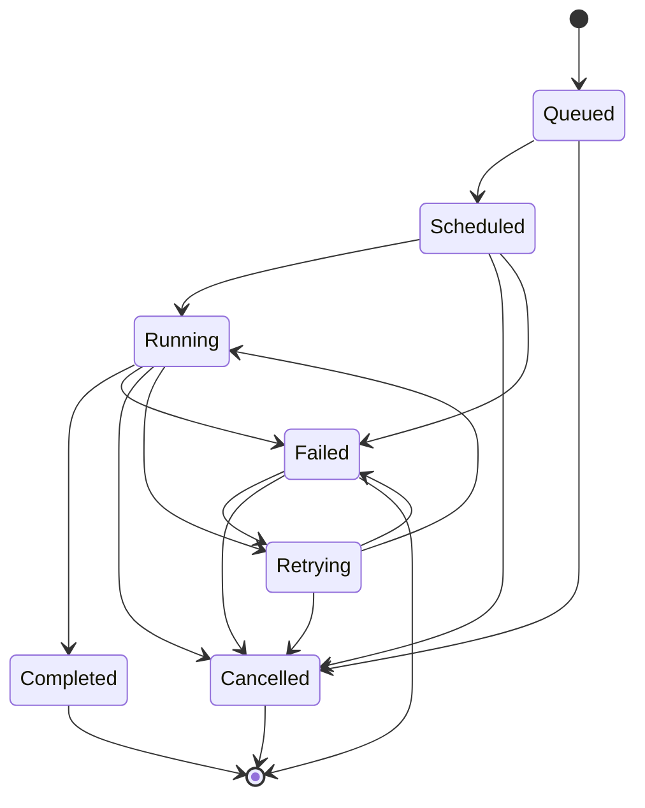
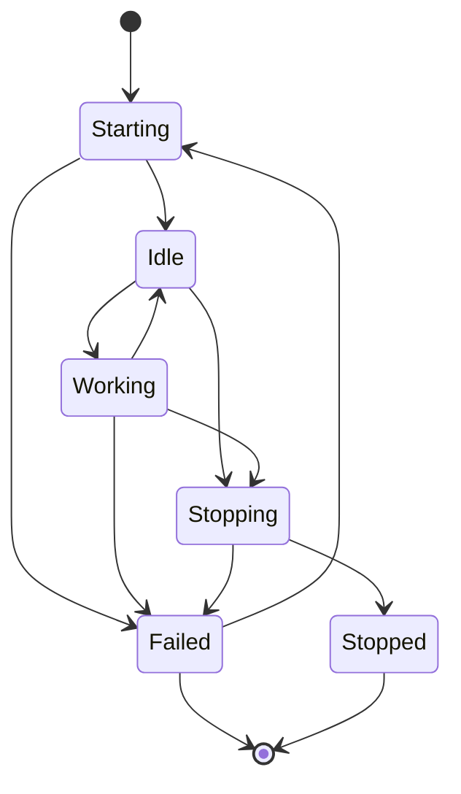

# 08. Batch Job Scheduler - Background Job Processing System

## Title & Summary
Design and implement a distributed batch job scheduler that handles job queuing, execution, monitoring, and failure recovery with priority-based scheduling and resource management.

## Problem Statement

Build a batch job scheduler that:

1. **Job Management**: Submit, schedule, and manage background jobs
2. **Priority Scheduling**: Handle jobs with different priorities and deadlines
3. **Resource Management**: Allocate and manage worker resources
4. **Failure Recovery**: Handle job failures with retry mechanisms
5. **Monitoring**: Real-time job status monitoring and metrics
6. **Scaling**: Auto-scale workers based on job queue depth

## Requirements & Constraints

### Functional Requirements
- Job submission with priority and scheduling
- Worker pool management and job distribution
- Job retry and failure handling
- Real-time job status tracking
- Resource utilization monitoring
- Job dependency management

### Non-Functional Requirements
- **Latency**: < 100ms for job scheduling
- **Consistency**: Eventually consistent job state
- **Memory**: Support 1M queued jobs
- **Scalability**: Handle 10K jobs per minute
- **Reliability**: 99.9% job execution success rate

## API / Interfaces

### REST Endpoints

```go
// Job Management
POST   /api/jobs/submit
GET    /api/jobs/{jobID}
GET    /api/jobs/status/{status}
DELETE /api/jobs/{jobID}/cancel

// Worker Management
GET    /api/workers
POST   /api/workers/scale
GET    /api/workers/{workerID}/status

// Monitoring
GET    /api/metrics/jobs
GET    /api/metrics/workers
GET    /api/health
```

### Request/Response Examples

```json
// Submit Job
POST /api/jobs/submit
{
  "jobType": "email_send",
  "priority": 5,
  "payload": {
    "to": "user@example.com",
    "subject": "Welcome",
    "body": "Welcome to our service"
  },
  "scheduleAt": "2024-01-15T10:30:00Z",
  "retryCount": 3,
  "timeout": 300
}

// Job Response
{
  "jobID": "job_123",
  "status": "queued",
  "priority": 5,
  "createdAt": "2024-01-15T10:25:00Z",
  "scheduledAt": "2024-01-15T10:30:00Z",
  "estimatedExecutionTime": "2024-01-15T10:30:05Z"
}
```

## Data Model

### Core Entities

```go
type Job struct {
    ID                  string        `json:"id"`
    Type                string        `json:"type"`
    Priority            int           `json:"priority"`
    Status              JobStatus     `json:"status"`
    Payload             interface{}   `json:"payload"`
    ScheduleAt          time.Time     `json:"scheduleAt"`
    CreatedAt           time.Time     `json:"createdAt"`
    StartedAt           *time.Time    `json:"startedAt,omitempty"`
    CompletedAt         *time.Time    `json:"completedAt,omitempty"`
    RetryCount          int           `json:"retryCount"`
    MaxRetries          int           `json:"maxRetries"`
    Timeout             int           `json:"timeout"`
    WorkerID            *string       `json:"workerID,omitempty"`
    Error               *JobError     `json:"error,omitempty"`
    Dependencies        []string      `json:"dependencies"`
    Result              interface{}   `json:"result,omitempty"`
}

type Worker struct {
    ID              string        `json:"id"`
    Status          WorkerStatus  `json:"status"`
    Capacity        int           `json:"capacity"`
    CurrentJobs     int           `json:"currentJobs"`
    LastHeartbeat   time.Time     `json:"lastHeartbeat"`
    CreatedAt       time.Time     `json:"createdAt"`
}

type JobQueue struct {
    Jobs            []*Job        `json:"jobs"`
    Priority        int           `json:"priority"`
    WorkerCount     int           `json:"workerCount"`
    LastProcessed   time.Time     `json:"lastProcessed"`
}
```

## State Machine

### Job State Machine



### Worker State Machine



## Approach Overview

### Simple Solution (MVP)
1. In-memory job queue with simple priority
2. Basic worker pool with job distribution
3. Simple retry mechanism
4. No persistence or monitoring

### Production-Ready Design
1. **Distributed Architecture**: Redis-based job queue with persistence
2. **Priority Scheduling**: Multiple priority queues with deadline handling
3. **Worker Management**: Dynamic worker scaling and health monitoring
4. **Failure Recovery**: Comprehensive retry and error handling
5. **Monitoring**: Real-time metrics and alerting
6. **Resource Management**: CPU and memory-based resource allocation

## Detailed Design

### Modular Decomposition

```go
batchscheduler/
├── scheduler/     # Job scheduling logic
├── workers/       # Worker pool management
├── queue/         # Job queue management
├── storage/       # Job persistence
├── monitoring/    # Metrics and monitoring
└── api/           # REST API handlers
```

### Concurrency Model

```go
type JobScheduler struct {
    queues         map[int]*JobQueue
    workers        map[string]*Worker
    jobs           map[string]*Job
    storage        StorageInterface
    mutex          sync.RWMutex
    jobChan        chan *Job
    workerChan     chan WorkerEvent
    metricsChan    chan MetricsEvent
}

// Goroutines for:
// 1. Job scheduling
// 2. Worker management
// 3. Job execution
// 4. Metrics collection
```

## Optimal Golang Implementation

```go
package main

import (
    "context"
    "container/heap"
    "encoding/json"
    "fmt"
    "log"
    "net/http"
    "sync"
    "time"

    "github.com/google/uuid"
)

type JobStatus string
const (
    StatusQueued     JobStatus = "queued"
    StatusScheduled  JobStatus = "scheduled"
    StatusRunning    JobStatus = "running"
    StatusCompleted  JobStatus = "completed"
    StatusFailed     JobStatus = "failed"
    StatusCancelled  JobStatus = "cancelled"
    StatusRetrying   JobStatus = "retrying"
)

type WorkerStatus string
const (
    WorkerIdle     WorkerStatus = "idle"
    WorkerWorking  WorkerStatus = "working"
    WorkerStopping WorkerStatus = "stopping"
    WorkerStopped  WorkerStatus = "stopped"
    WorkerFailed   WorkerStatus = "failed"
)

type Job struct {
    ID                  string        `json:"id"`
    Type                string        `json:"type"`
    Priority            int           `json:"priority"`
    Status              JobStatus     `json:"status"`
    Payload             interface{}   `json:"payload"`
    ScheduleAt          time.Time     `json:"scheduleAt"`
    CreatedAt           time.Time     `json:"createdAt"`
    StartedAt           *time.Time    `json:"startedAt,omitempty"`
    CompletedAt         *time.Time    `json:"completedAt,omitempty"`
    RetryCount          int           `json:"retryCount"`
    MaxRetries          int           `json:"maxRetries"`
    Timeout             int           `json:"timeout"`
    WorkerID            *string       `json:"workerID,omitempty"`
    Error               *JobError     `json:"error,omitempty"`
    Dependencies        []string      `json:"dependencies"`
    Result              interface{}   `json:"result,omitempty"`
}

type JobError struct {
    Message   string    `json:"message"`
    Code      string    `json:"code"`
    Timestamp time.Time `json:"timestamp"`
}

type Worker struct {
    ID              string        `json:"id"`
    Status          WorkerStatus  `json:"status"`
    Capacity        int           `json:"capacity"`
    CurrentJobs     int           `json:"currentJobs"`
    LastHeartbeat   time.Time     `json:"lastHeartbeat"`
    CreatedAt       time.Time     `json:"createdAt"`
}

type JobQueue struct {
    Jobs            []*Job        `json:"jobs"`
    Priority        int           `json:"priority"`
    WorkerCount     int           `json:"workerCount"`
    LastProcessed   time.Time     `json:"lastProcessed"`
    mutex           sync.RWMutex
}

type JobScheduler struct {
    queues         map[int]*JobQueue
    workers        map[string]*Worker
    jobs           map[string]*Job
    mutex          sync.RWMutex
    jobChan        chan *Job
    workerChan     chan WorkerEvent
    metricsChan    chan MetricsEvent
    stopChan       chan bool
}

type WorkerEvent struct {
    WorkerID string
    Event    string
    Data     interface{}
}

type MetricsEvent struct {
    Type      string
    JobID     string
    WorkerID  string
    Timestamp time.Time
    Data      interface{}
}

type StorageInterface interface {
    SaveJob(job *Job) error
    GetJob(jobID string) (*Job, error)
    UpdateJob(job *Job) error
    DeleteJob(jobID string) error
    GetJobsByStatus(status JobStatus) ([]*Job, error)
}

type InMemoryStorage struct {
    jobs map[string]*Job
    mutex sync.RWMutex
}

func (ims *InMemoryStorage) SaveJob(job *Job) error {
    ims.mutex.Lock()
    defer ims.mutex.Unlock()
    ims.jobs[job.ID] = job
    return nil
}

func (ims *InMemoryStorage) GetJob(jobID string) (*Job, error) {
    ims.mutex.RLock()
    defer ims.mutex.RUnlock()
    job, exists := ims.jobs[jobID]
    if !exists {
        return nil, fmt.Errorf("job not found")
    }
    return job, nil
}

func (ims *InMemoryStorage) UpdateJob(job *Job) error {
    ims.mutex.Lock()
    defer ims.mutex.Unlock()
    ims.jobs[job.ID] = job
    return nil
}

func (ims *InMemoryStorage) DeleteJob(jobID string) error {
    ims.mutex.Lock()
    defer ims.mutex.Unlock()
    delete(ims.jobs, jobID)
    return nil
}

func (ims *InMemoryStorage) GetJobsByStatus(status JobStatus) ([]*Job, error) {
    ims.mutex.RLock()
    defer ims.mutex.RUnlock()
    
    var result []*Job
    for _, job := range ims.jobs {
        if job.Status == status {
            result = append(result, job)
        }
    }
    return result, nil
}

func NewJobScheduler() *JobScheduler {
    return &JobScheduler{
        queues:      make(map[int]*JobQueue),
        workers:     make(map[string]*Worker),
        jobs:        make(map[string]*Job),
        jobChan:     make(chan *Job, 10000),
        workerChan:  make(chan WorkerEvent, 1000),
        metricsChan: make(chan MetricsEvent, 1000),
        stopChan:    make(chan bool),
    }
}

func (js *JobScheduler) SubmitJob(jobType string, priority int, payload interface{}, scheduleAt time.Time, maxRetries int, timeout int) (*Job, error) {
    job := &Job{
        ID:           uuid.New().String(),
        Type:         jobType,
        Priority:     priority,
        Status:       StatusQueued,
        Payload:      payload,
        ScheduleAt:   scheduleAt,
        CreatedAt:    time.Now(),
        RetryCount:   0,
        MaxRetries:   maxRetries,
        Timeout:      timeout,
        Dependencies: []string{},
    }

    js.mutex.Lock()
    js.jobs[job.ID] = job
    js.mutex.Unlock()

    // Send to job channel
    js.jobChan <- job

    // Record metrics
    js.metricsChan <- MetricsEvent{
        Type:      "job_submitted",
        JobID:     job.ID,
        Timestamp: time.Now(),
        Data:      job,
    }

    return job, nil
}

func (js *JobScheduler) GetJob(jobID string) (*Job, error) {
    js.mutex.RLock()
    defer js.mutex.RUnlock()

    job, exists := js.jobs[jobID]
    if !exists {
        return nil, fmt.Errorf("job not found")
    }

    return job, nil
}

func (js *JobScheduler) CancelJob(jobID string) error {
    js.mutex.Lock()
    defer js.mutex.Unlock()

    job, exists := js.jobs[jobID]
    if !exists {
        return fmt.Errorf("job not found")
    }

    if job.Status == StatusCompleted || job.Status == StatusCancelled {
        return fmt.Errorf("job cannot be cancelled")
    }

    job.Status = StatusCancelled
    job.CompletedAt = &[]time.Time{time.Now()}[0]

    // Remove from queue if queued
    if queue, exists := js.queues[job.Priority]; exists {
        queue.RemoveJob(jobID)
    }

    // Record metrics
    js.metricsChan <- MetricsEvent{
        Type:      "job_cancelled",
        JobID:     jobID,
        Timestamp: time.Now(),
        Data:      job,
    }

    return nil
}

func (js *JobScheduler) AddWorker(workerID string, capacity int) *Worker {
    worker := &Worker{
        ID:            workerID,
        Status:        WorkerIdle,
        Capacity:      capacity,
        CurrentJobs:   0,
        LastHeartbeat: time.Now(),
        CreatedAt:     time.Now(),
    }

    js.mutex.Lock()
    js.workers[workerID] = worker
    js.mutex.Unlock()

    // Record metrics
    js.metricsChan <- MetricsEvent{
        Type:      "worker_added",
        WorkerID:  workerID,
        Timestamp: time.Now(),
        Data:      worker,
    }

    return worker
}

func (js *JobScheduler) RemoveWorker(workerID string) error {
    js.mutex.Lock()
    defer js.mutex.Unlock()

    worker, exists := js.workers[workerID]
    if !exists {
        return fmt.Errorf("worker not found")
    }

    if worker.Status == WorkerWorking {
        return fmt.Errorf("worker is currently working")
    }

    worker.Status = WorkerStopping
    delete(js.workers, workerID)

    // Record metrics
    js.metricsChan <- MetricsEvent{
        Type:      "worker_removed",
        WorkerID:  workerID,
        Timestamp: time.Now(),
        Data:      worker,
    }

    return nil
}

func (js *JobScheduler) ProcessJobs() {
    for {
        select {
        case job := <-js.jobChan:
            js.scheduleJob(job)
        case <-js.stopChan:
            return
        }
    }
}

func (js *JobScheduler) scheduleJob(job *Job) {
    js.mutex.Lock()
    defer js.mutex.Unlock()

    // Check if job should be scheduled now
    if time.Now().Before(job.ScheduleAt) {
        job.Status = StatusScheduled
        // In production, this would use a timer or cron job
        go func() {
            time.Sleep(time.Until(job.ScheduleAt))
            js.jobChan <- job
        }()
        return
    }

    // Add to appropriate priority queue
    if js.queues[job.Priority] == nil {
        js.queues[job.Priority] = &JobQueue{
            Jobs:          make([]*Job, 0),
            Priority:      job.Priority,
            LastProcessed: time.Now(),
        }
    }

    js.queues[job.Priority].AddJob(job)
    js.assignJobToWorker(job)
}

func (js *JobScheduler) assignJobToWorker(job *Job) {
    // Find available worker
    var availableWorker *Worker
    for _, worker := range js.workers {
        if worker.Status == WorkerIdle && worker.CurrentJobs < worker.Capacity {
            availableWorker = worker
            break
        }
    }

    if availableWorker == nil {
        // No available worker, job remains in queue
        return
    }

    // Assign job to worker
    job.WorkerID = &availableWorker.ID
    job.Status = StatusRunning
    now := time.Now()
    job.StartedAt = &now

    availableWorker.Status = WorkerWorking
    availableWorker.CurrentJobs++

    // Execute job
    go js.executeJob(job, availableWorker)
}

func (js *JobScheduler) executeJob(job *Job, worker *Worker) {
    defer func() {
        js.mutex.Lock()
        worker.CurrentJobs--
        if worker.CurrentJobs == 0 {
            worker.Status = WorkerIdle
        }
        js.mutex.Unlock()
    }()

    // Simulate job execution
    ctx, cancel := context.WithTimeout(context.Background(), time.Duration(job.Timeout)*time.Second)
    defer cancel()

    // Execute job based on type
    result, err := js.executeJobByType(ctx, job)
    
    js.mutex.Lock()
    defer js.mutex.Unlock()

    if err != nil {
        js.handleJobFailure(job, err)
    } else {
        js.handleJobSuccess(job, result)
    }
}

func (js *JobScheduler) executeJobByType(ctx context.Context, job *Job) (interface{}, error) {
    switch job.Type {
    case "email_send":
        return js.executeEmailJob(ctx, job)
    case "data_processing":
        return js.executeDataProcessingJob(ctx, job)
    case "file_upload":
        return js.executeFileUploadJob(ctx, job)
    default:
        return nil, fmt.Errorf("unknown job type: %s", job.Type)
    }
}

func (js *JobScheduler) executeEmailJob(ctx context.Context, job *Job) (interface{}, error) {
    // Simulate email sending
    time.Sleep(100 * time.Millisecond)
    
    payload, ok := job.Payload.(map[string]interface{})
    if !ok {
        return nil, fmt.Errorf("invalid email payload")
    }

    to, _ := payload["to"].(string)
    subject, _ := payload["subject"].(string)
    
    if to == "" || subject == "" {
        return nil, fmt.Errorf("missing required email fields")
    }

    return map[string]interface{}{
        "messageID": uuid.New().String(),
        "to":        to,
        "subject":   subject,
        "status":    "sent",
    }, nil
}

func (js *JobScheduler) executeDataProcessingJob(ctx context.Context, job *Job) (interface{}, error) {
    // Simulate data processing
    time.Sleep(200 * time.Millisecond)
    
    return map[string]interface{}{
        "processedRecords": 1000,
        "status":          "completed",
    }, nil
}

func (js *JobScheduler) executeFileUploadJob(ctx context.Context, job *Job) (interface{}, error) {
    // Simulate file upload
    time.Sleep(300 * time.Millisecond)
    
    return map[string]interface{}{
        "fileID":   uuid.New().String(),
        "fileSize": 1024 * 1024,
        "status":   "uploaded",
    }, nil
}

func (js *JobScheduler) handleJobSuccess(job *Job, result interface{}) {
    job.Status = StatusCompleted
    job.Result = result
    now := time.Now()
    job.CompletedAt = &now

    // Record metrics
    js.metricsChan <- MetricsEvent{
        Type:      "job_completed",
        JobID:     job.ID,
        WorkerID:  *job.WorkerID,
        Timestamp: time.Now(),
        Data:      job,
    }
}

func (js *JobScheduler) handleJobFailure(job *Job, err error) {
    job.RetryCount++
    
    if job.RetryCount >= job.MaxRetries {
        job.Status = StatusFailed
        job.Error = &JobError{
            Message:   err.Error(),
            Code:      "EXECUTION_FAILED",
            Timestamp: time.Now(),
        }
        now := time.Now()
        job.CompletedAt = &now

        // Record metrics
        js.metricsChan <- MetricsEvent{
            Type:      "job_failed",
            JobID:     job.ID,
            WorkerID:  *job.WorkerID,
            Timestamp: time.Now(),
            Data:      job,
        }
    } else {
        job.Status = StatusRetrying
        job.Error = &JobError{
            Message:   err.Error(),
            Code:      "RETRY_REQUIRED",
            Timestamp: time.Now(),
        }

        // Retry job after delay
        go func() {
            time.Sleep(time.Duration(job.RetryCount) * time.Second)
            js.jobChan <- job
        }()

        // Record metrics
        js.metricsChan <- MetricsEvent{
            Type:      "job_retrying",
            JobID:     job.ID,
            WorkerID:  *job.WorkerID,
            Timestamp: time.Now(),
            Data:      job,
        }
    }
}

func (js *JobScheduler) ProcessWorkerEvents() {
    for event := range js.workerChan {
        switch event.Event {
        case "heartbeat":
            js.handleWorkerHeartbeat(event.WorkerID)
        case "status_change":
            js.handleWorkerStatusChange(event.WorkerID, event.Data)
        }
    }
}

func (js *JobScheduler) handleWorkerHeartbeat(workerID string) {
    js.mutex.Lock()
    defer js.mutex.Unlock()

    worker, exists := js.workers[workerID]
    if exists {
        worker.LastHeartbeat = time.Now()
    }
}

func (js *JobScheduler) handleWorkerStatusChange(workerID string, data interface{}) {
    js.mutex.Lock()
    defer js.mutex.Unlock()

    worker, exists := js.workers[workerID]
    if exists {
        if status, ok := data.(WorkerStatus); ok {
            worker.Status = status
        }
    }
}

func (js *JobScheduler) ProcessMetrics() {
    for event := range js.metricsChan {
        // In production, this would send to monitoring system
        log.Printf("Metrics: %s - %s", event.Type, event.JobID)
    }
}

func (js *JobScheduler) GetQueueStatus() map[string]interface{} {
    js.mutex.RLock()
    defer js.mutex.RUnlock()

    status := map[string]interface{}{
        "queues":  make(map[string]interface{}),
        "workers": make(map[string]interface{}),
        "jobs":    make(map[string]int),
    }

    // Queue status
    for priority, queue := range js.queues {
        status["queues"].(map[string]interface{})[fmt.Sprintf("priority_%d", priority)] = map[string]interface{}{
            "jobCount":     len(queue.Jobs),
            "lastProcessed": queue.LastProcessed,
        }
    }

    // Worker status
    for workerID, worker := range js.workers {
        status["workers"].(map[string]interface{})[workerID] = map[string]interface{}{
            "status":      worker.Status,
            "capacity":    worker.Capacity,
            "currentJobs": worker.CurrentJobs,
            "lastHeartbeat": worker.LastHeartbeat,
        }
    }

    // Job status counts
    jobCounts := make(map[string]int)
    for _, job := range js.jobs {
        jobCounts[string(job.Status)]++
    }
    status["jobs"] = jobCounts

    return status
}

// JobQueue methods
func (jq *JobQueue) AddJob(job *Job) {
    jq.mutex.Lock()
    defer jq.mutex.Unlock()
    jq.Jobs = append(jq.Jobs, job)
    jq.LastProcessed = time.Now()
}

func (jq *JobQueue) RemoveJob(jobID string) bool {
    jq.mutex.Lock()
    defer jq.mutex.Unlock()
    
    for i, job := range jq.Jobs {
        if job.ID == jobID {
            jq.Jobs = append(jq.Jobs[:i], jq.Jobs[i+1:]...)
            return true
        }
    }
    return false
}

func (jq *JobQueue) GetNextJob() *Job {
    jq.mutex.Lock()
    defer jq.mutex.Unlock()
    
    if len(jq.Jobs) == 0 {
        return nil
    }
    
    job := jq.Jobs[0]
    jq.Jobs = jq.Jobs[1:]
    return job
}

// HTTP Handlers
func (js *JobScheduler) SubmitJobHandler(w http.ResponseWriter, r *http.Request) {
    if r.Method != http.MethodPost {
        http.Error(w, "Method not allowed", http.StatusMethodNotAllowed)
        return
    }

    var req struct {
        JobType     string      `json:"jobType"`
        Priority    int         `json:"priority"`
        Payload     interface{} `json:"payload"`
        ScheduleAt  time.Time   `json:"scheduleAt"`
        MaxRetries  int         `json:"maxRetries"`
        Timeout     int         `json:"timeout"`
    }

    if err := json.NewDecoder(r.Body).Decode(&req); err != nil {
        http.Error(w, "Invalid request", http.StatusBadRequest)
        return
    }

    job, err := js.SubmitJob(req.JobType, req.Priority, req.Payload, req.ScheduleAt, req.MaxRetries, req.Timeout)
    if err != nil {
        http.Error(w, err.Error(), http.StatusBadRequest)
        return
    }

    w.Header().Set("Content-Type", "application/json")
    json.NewEncoder(w).Encode(job)
}

func (js *JobScheduler) GetJobHandler(w http.ResponseWriter, r *http.Request) {
    if r.Method != http.MethodGet {
        http.Error(w, "Method not allowed", http.StatusMethodNotAllowed)
        return
    }

    jobID := r.URL.Path[len("/api/jobs/"):]
    job, err := js.GetJob(jobID)
    if err != nil {
        http.Error(w, err.Error(), http.StatusNotFound)
        return
    }

    w.Header().Set("Content-Type", "application/json")
    json.NewEncoder(w).Encode(job)
}

func (js *JobScheduler) GetQueueStatusHandler(w http.ResponseWriter, r *http.Request) {
    if r.Method != http.MethodGet {
        http.Error(w, "Method not allowed", http.StatusMethodNotAllowed)
        return
    }

    status := js.GetQueueStatus()
    w.Header().Set("Content-Type", "application/json")
    json.NewEncoder(w).Encode(status)
}

func main() {
    scheduler := NewJobScheduler()

    // Start background workers
    go scheduler.ProcessJobs()
    go scheduler.ProcessWorkerEvents()
    go scheduler.ProcessMetrics()

    // Add some workers
    scheduler.AddWorker("worker1", 5)
    scheduler.AddWorker("worker2", 3)
    scheduler.AddWorker("worker3", 2)

    // HTTP routes
    http.HandleFunc("/api/jobs/submit", scheduler.SubmitJobHandler)
    http.HandleFunc("/api/jobs/", scheduler.GetJobHandler)
    http.HandleFunc("/api/status", scheduler.GetQueueStatusHandler)

    log.Println("Batch job scheduler starting on :8080")
    log.Fatal(http.ListenAndServe(":8080", nil))
}
```

## Unit Tests

```go
func TestJobScheduler_SubmitJob(t *testing.T) {
    scheduler := NewJobScheduler()

    job, err := scheduler.SubmitJob("email_send", 5, map[string]interface{}{
        "to":      "test@example.com",
        "subject": "Test",
        "body":    "Test message",
    }, time.Now(), 3, 300)

    if err != nil {
        t.Fatalf("SubmitJob() error = %v", err)
    }

    if job.ID == "" {
        t.Error("Job ID should not be empty")
    }

    if job.Status != StatusQueued {
        t.Errorf("Expected status %s, got %s", StatusQueued, job.Status)
    }

    if job.Type != "email_send" {
        t.Errorf("Expected type email_send, got %s", job.Type)
    }
}

func TestJobScheduler_JobExecution(t *testing.T) {
    scheduler := NewJobScheduler()
    scheduler.AddWorker("worker1", 1)

    job, err := scheduler.SubmitJob("email_send", 5, map[string]interface{}{
        "to":      "test@example.com",
        "subject": "Test",
        "body":    "Test message",
    }, time.Now(), 3, 300)

    if err != nil {
        t.Fatalf("SubmitJob() error = %v", err)
    }

    // Wait for job execution
    time.Sleep(500 * time.Millisecond)

    updatedJob, err := scheduler.GetJob(job.ID)
    if err != nil {
        t.Fatalf("GetJob() error = %v", err)
    }

    if updatedJob.Status != StatusCompleted {
        t.Errorf("Expected status %s, got %s", StatusCompleted, updatedJob.Status)
    }

    if updatedJob.Result == nil {
        t.Error("Job result should not be nil")
    }
}

func TestJobScheduler_JobRetry(t *testing.T) {
    scheduler := NewJobScheduler()
    scheduler.AddWorker("worker1", 1)

    // Submit job with invalid payload to trigger failure
    job, err := scheduler.SubmitJob("email_send", 5, map[string]interface{}{
        "to":      "", // Invalid - should cause failure
        "subject": "Test",
    }, time.Now(), 2, 300)

    if err != nil {
        t.Fatalf("SubmitJob() error = %v", err)
    }

    // Wait for job execution and retry
    time.Sleep(2 * time.Second)

    updatedJob, err := scheduler.GetJob(job.ID)
    if err != nil {
        t.Fatalf("GetJob() error = %v", err)
    }

    if updatedJob.RetryCount == 0 {
        t.Error("Job should have been retried")
    }
}
```

## Complexity Analysis

### Time Complexity
- **Submit Job**: O(1) - Hash map insertion
- **Schedule Job**: O(log n) - Priority queue insertion
- **Assign Job**: O(W) - Linear scan through workers
- **Execute Job**: O(1) - Job execution time

### Space Complexity
- **Job Storage**: O(J) where J is number of jobs
- **Worker Storage**: O(W) where W is number of workers
- **Queue Storage**: O(Q) where Q is total queued jobs
- **Total**: O(J + W + Q)

## Edge Cases & Validation

### Input Validation
- Invalid job types
- Negative priorities
- Invalid payload formats
- Past schedule times
- Invalid retry counts

### Error Scenarios
- Worker failures during job execution
- Job timeout handling
- Queue overflow scenarios
- Worker heartbeat failures
- Resource exhaustion

### Boundary Conditions
- Maximum job queue size
- Worker capacity limits
- Job timeout limits
- Retry count limits
- Priority range validation

## Extension Ideas (Scaling)

### Horizontal Scaling
1. **Load Balancing**: Multiple scheduler instances
2. **Job Sharding**: Distribute jobs across instances
3. **Worker Clustering**: Distributed worker pools
4. **Database Sharding**: Partition job storage

### Performance Optimization
1. **Job Batching**: Batch job processing
2. **Worker Pooling**: Optimize worker allocation
3. **Queue Optimization**: Efficient priority queues
4. **Caching**: Cache job metadata

### Advanced Features
1. **Job Dependencies**: Complex job workflows
2. **Resource Management**: CPU/memory-based scheduling
3. **Auto-scaling**: Dynamic worker scaling
4. **Job Templates**: Reusable job definitions

## 20 Follow-up Questions

### 1. How would you handle job dependencies and workflows?
**Answer**: Implement a directed acyclic graph (DAG) for job dependencies. Use topological sorting to determine execution order. Implement dependency resolution before job execution. Consider using workflow engines like Apache Airflow for complex workflows.

### 2. What's your strategy for handling worker failures?
**Answer**: Implement worker health checks with heartbeat monitoring. Use circuit breaker pattern for failed workers. Implement job reassignment for failed workers. Consider using worker redundancy and automatic failover.

### 3. How do you ensure job execution order for dependent jobs?
**Answer**: Use dependency graphs to determine execution order. Implement job state tracking for dependencies. Use event-driven architecture for dependency resolution. Consider using workflow orchestration tools.

### 4. What's your approach to handling job priority changes?
**Answer**: Implement dynamic priority updates with queue reordering. Use priority inheritance for dependent jobs. Implement priority-based preemption. Consider using priority queues with update capabilities.

### 5. How would you implement job resource management?
**Answer**: Implement resource allocation based on job requirements. Use resource pools for different job types. Implement resource monitoring and allocation. Consider using container orchestration for resource management.

### 6. What's your strategy for handling job timeouts?
**Answer**: Implement timeout handling with context cancellation. Use worker-level timeout monitoring. Implement job cancellation on timeout. Consider using timeout escalation and notification.

### 7. How do you handle job queue overflow?
**Answer**: Implement queue size limits with overflow handling. Use disk-based queuing for large queues. Implement job prioritization during overflow. Consider using external message queues for overflow.

### 8. What's your approach to handling job persistence?
**Answer**: Implement persistent storage for job state. Use database transactions for job updates. Implement job recovery after system failures. Consider using event sourcing for job state.

### 9. How would you implement job monitoring and alerting?
**Answer**: Implement real-time job status monitoring. Use metrics collection for job performance. Implement alerting for job failures and delays. Consider using APM tools for comprehensive monitoring.

### 10. What's your strategy for handling job scaling?
**Answer**: Implement auto-scaling based on queue depth. Use worker pool scaling algorithms. Implement load-based worker allocation. Consider using cloud auto-scaling services.

### 11. How do you handle job security and access control?
**Answer**: Implement job-level access controls. Use authentication and authorization for job submission. Implement job data encryption. Consider using RBAC for job management.

### 12. What's your approach to handling job data privacy?
**Answer**: Implement data anonymization for job payloads. Use encryption for sensitive job data. Implement data retention policies. Consider using privacy-preserving job execution.

### 13. How would you implement job versioning?
**Answer**: Implement job definition versioning. Use backward compatibility for job execution. Implement job migration for version updates. Consider using semantic versioning for job types.

### 14. What's your strategy for handling job testing?
**Answer**: Implement job testing frameworks. Use mock workers for job testing. Implement integration testing for job workflows. Consider using job simulation for testing.

### 15. How do you handle job compliance and auditing?
**Answer**: Implement comprehensive job audit trails. Use compliance monitoring for job execution. Implement regulatory reporting for jobs. Consider using compliance management tools.

### 16. What's your approach to handling job performance optimization?
**Answer**: Implement job performance monitoring. Use profiling for job execution optimization. Implement job caching for repeated tasks. Consider using performance optimization tools.

### 17. How would you implement job disaster recovery?
**Answer**: Implement job state backup and recovery. Use multi-region job replication. Implement disaster recovery procedures. Consider using cloud disaster recovery services.

### 18. What's your strategy for handling job cost optimization?
**Answer**: Implement job cost tracking and optimization. Use resource optimization for job execution. Implement cost-based job scheduling. Consider using cloud cost optimization tools.

### 19. How do you handle job integration with external systems?
**Answer**: Implement job integration frameworks. Use API gateways for external job integration. Implement job data transformation. Consider using integration platforms.

### 20. What's your approach to handling job analytics and reporting?
**Answer**: Implement job analytics and reporting. Use data warehouses for job analytics. Implement real-time job dashboards. Consider using business intelligence tools.

## Evaluation Checklist

### Code Quality (25%)
- [ ] Clean, readable Go code with proper error handling
- [ ] Appropriate use of interfaces and structs
- [ ] Proper concurrency patterns (goroutines, channels)
- [ ] Good separation of concerns

### Architecture (25%)
- [ ] Scalable design with worker pool management
- [ ] Proper job scheduling and queuing
- [ ] Efficient priority handling
- [ ] Comprehensive monitoring

### Functionality (25%)
- [ ] Job submission and execution working
- [ ] Worker management functional
- [ ] Priority scheduling implemented
- [ ] Failure handling and retry working

### Testing (15%)
- [ ] Unit tests for core functionality
- [ ] Integration tests for API endpoints
- [ ] Edge case testing
- [ ] Performance testing

### Discussion (10%)
- [ ] Clear explanation of design decisions
- [ ] Understanding of job scheduling concepts
- [ ] Knowledge of worker management
- [ ] Ability to discuss trade-offs

## Discussion Pointers

### Key Points to Highlight
1. **Job Scheduling Algorithm**: Explain the priority-based scheduling and queue management
2. **Worker Pool Management**: Discuss the worker allocation and health monitoring
3. **Failure Handling**: Explain the retry mechanisms and error handling
4. **State Management**: Discuss the job state machine and transitions
5. **Scalability**: Explain the horizontal scaling and load distribution strategies

### Trade-offs to Discuss
1. **Throughput vs Latency**: High throughput vs low latency trade-offs
2. **Resource Usage vs Performance**: Resource efficiency vs performance trade-offs
3. **Consistency vs Availability**: Strong consistency vs high availability trade-offs
4. **Simplicity vs Features**: Simple design vs advanced features trade-offs
5. **Cost vs Reliability**: Infrastructure cost vs system reliability trade-offs

### Extension Scenarios
1. **Multi-region Deployment**: How to handle geographic distribution
2. **Advanced Workflows**: Complex job dependencies and orchestration
3. **Real-time Analytics**: Live job monitoring and performance dashboards
4. **Compliance Integration**: Regulatory compliance and audit requirements
5. **Enterprise Features**: Multi-tenant and white-label solutions
