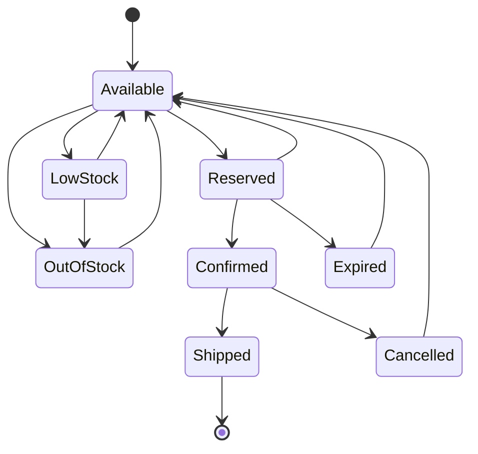
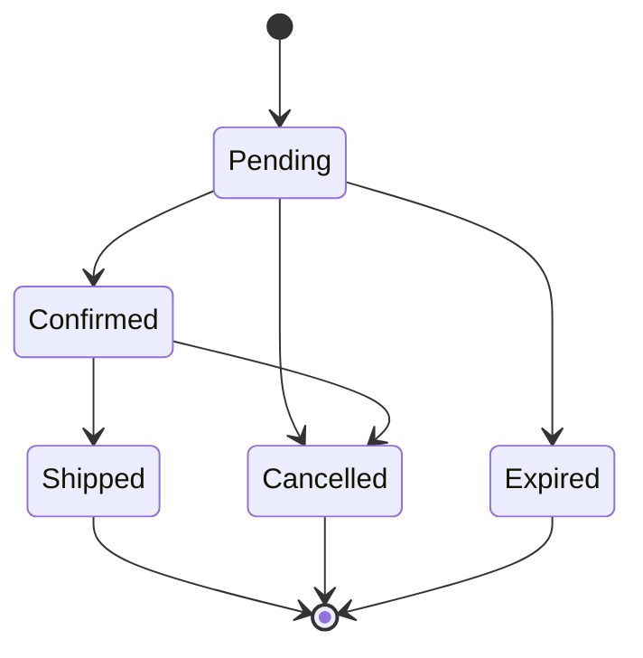

# 09. Inventory Service - Stock Management System

## Title & Summary

Design and implement an inventory management system that handles stock tracking, reservations, low-stock alerts, and multi-location inventory with real-time updates and conflict resolution.

## Problem Statement

Build an inventory management system that:

1. **Stock Tracking**: Track inventory levels across multiple locations
2. **Reservations**: Handle stock reservations and releases
3. **Low Stock Alerts**: Monitor and alert on low inventory levels
4. **Multi-location**: Support inventory across multiple warehouses
5. **Real-time Updates**: Provide real-time inventory updates
6. **Conflict Resolution**: Handle concurrent inventory modifications

## Requirements & Constraints

### Functional Requirements

- Track inventory levels by product and location
- Reserve and release stock for orders
- Monitor low stock levels with alerts
- Support multiple warehouse locations
- Handle stock transfers between locations
- Real-time inventory updates

### Non-Functional Requirements

- **Latency**: < 50ms for inventory checks
- **Consistency**: Strong consistency for stock levels
- **Memory**: Support 1M products across 100 locations
- **Scalability**: Handle 100K inventory updates per minute
- **Reliability**: 99.99% inventory accuracy

## API / Interfaces

### REST Endpoints

```go
// Inventory Management
GET    /api/inventory/{productID}
GET    /api/inventory/{productID}/location/{locationID}
POST   /api/inventory/{productID}/reserve
POST   /api/inventory/{productID}/release
POST   /api/inventory/{productID}/adjust

// Stock Operations
POST   /api/inventory/transfer
GET    /api/inventory/alerts
POST   /api/inventory/alerts/{alertID}/acknowledge

// Monitoring
GET    /api/inventory/metrics
GET    /api/inventory/health
```

### Request/Response Examples

```json
// Reserve Stock
POST /api/inventory/PROD123/reserve
{
  "locationID": "WH001",
  "quantity": 10,
  "orderID": "ORDER456",
  "expiresAt": "2024-01-15T12:00:00Z"
}

// Inventory Response
{
  "productID": "PROD123",
  "locationID": "WH001",
  "available": 50,
  "reserved": 10,
  "total": 60,
  "reservationID": "RES789",
  "expiresAt": "2024-01-15T12:00:00Z"
}
```

## Data Model

### Core Entities

```go
type Product struct {
    ID          string    `json:"id"`
    Name        string    `json:"name"`
    SKU         string    `json:"sku"`
    Category    string    `json:"category"`
    CreatedAt   time.Time `json:"createdAt"`
    UpdatedAt   time.Time `json:"updatedAt"`
}

type Location struct {
    ID          string    `json:"id"`
    Name        string    `json:"name"`
    Type        string    `json:"type"`
    Address     string    `json:"address"`
    IsActive    bool      `json:"isActive"`
    CreatedAt   time.Time `json:"createdAt"`
}

type Inventory struct {
    ProductID   string    `json:"productID"`
    LocationID  string    `json:"locationID"`
    Available   int64     `json:"available"`
    Reserved    int64     `json:"reserved"`
    Total       int64     `json:"total"`
    UpdatedAt   time.Time `json:"updatedAt"`
}

type Reservation struct {
    ID          string    `json:"id"`
    ProductID   string    `json:"productID"`
    LocationID  string    `json:"locationID"`
    Quantity    int64     `json:"quantity"`
    OrderID     string    `json:"orderID"`
    Status      string    `json:"status"`
    ExpiresAt   time.Time `json:"expiresAt"`
    CreatedAt   time.Time `json:"createdAt"`
}

type StockAlert struct {
    ID          string    `json:"id"`
    ProductID   string    `json:"productID"`
    LocationID  string    `json:"locationID"`
    AlertType   string    `json:"alertType"`
    Threshold   int64     `json:"threshold"`
    Current     int64     `json:"current"`
    Status      string    `json:"status"`
    CreatedAt   time.Time `json:"createdAt"`
}
```

## State Machine

### Inventory State Machine



### Reservation State Machine



## Approach Overview

### Simple Solution (MVP)

1. In-memory inventory tracking with basic operations
2. Simple reservation mechanism
3. Basic low stock alerts
4. No multi-location support

### Production-Ready Design

1. **Distributed Architecture**: Multi-location inventory with consistency
2. **Reservation System**: Time-based reservations with conflict resolution
3. **Alert System**: Real-time low stock monitoring and notifications
4. **Conflict Resolution**: Optimistic locking and retry mechanisms
5. **Event Sourcing**: Complete inventory change audit trail
6. **Caching**: Redis caching for high-performance reads

## Detailed Design

### Modular Decomposition

```go
inventory/
├── products/      # Product management
├── locations/     # Location management
├── inventory/     # Inventory tracking
├── reservations/  # Stock reservations
├── alerts/        # Low stock alerts
├── transfers/     # Stock transfers
└── events/        # Event sourcing
```

### Concurrency Model

```go
type InventoryService struct {
    products      map[string]*Product
    locations     map[string]*Location
    inventory     map[string]*Inventory
    reservations  map[string]*Reservation
    alerts        map[string]*StockAlert
    mutex         sync.RWMutex
    eventChan     chan InventoryEvent
    alertChan     chan AlertEvent
    transferChan  chan TransferEvent
}

// Goroutines for:
// 1. Event processing
// 2. Alert monitoring
// 3. Reservation cleanup
// 4. Transfer processing
```

## Optimal Golang Implementation

```go
package main

import (
    "context"
    "encoding/json"
    "fmt"
    "log"
    "net/http"
    "sync"
    "time"

    "github.com/google/uuid"
)

type Product struct {
    ID          string    `json:"id"`
    Name        string    `json:"name"`
    SKU         string    `json:"sku"`
    Category    string    `json:"category"`
    CreatedAt   time.Time `json:"createdAt"`
    UpdatedAt   time.Time `json:"updatedAt"`
}

type Location struct {
    ID          string    `json:"id"`
    Name        string    `json:"name"`
    Type        string    `json:"type"`
    Address     string    `json:"address"`
    IsActive    bool      `json:"isActive"`
    CreatedAt   time.Time `json:"createdAt"`
}

type Inventory struct {
    ProductID   string    `json:"productID"`
    LocationID  string    `json:"locationID"`
    Available   int64     `json:"available"`
    Reserved    int64     `json:"reserved"`
    Total       int64     `json:"total"`
    UpdatedAt   time.Time `json:"updatedAt"`
    mutex       sync.RWMutex
}

type Reservation struct {
    ID          string    `json:"id"`
    ProductID   string    `json:"productID"`
    LocationID  string    `json:"locationID"`
    Quantity    int64     `json:"quantity"`
    OrderID     string    `json:"orderID"`
    Status      string    `json:"status"`
    ExpiresAt   time.Time `json:"expiresAt"`
    CreatedAt   time.Time `json:"createdAt"`
}

type StockAlert struct {
    ID          string    `json:"id"`
    ProductID   string    `json:"productID"`
    LocationID  string    `json:"locationID"`
    AlertType   string    `json:"alertType"`
    Threshold   int64     `json:"threshold"`
    Current     int64     `json:"current"`
    Status      string    `json:"status"`
    CreatedAt   time.Time `json:"createdAt"`
}

type InventoryEvent struct {
    ID          string    `json:"id"`
    Type        string    `json:"type"`
    ProductID   string    `json:"productID"`
    LocationID  string    `json:"locationID"`
    Quantity    int64     `json:"quantity"`
    OrderID     string    `json:"orderID,omitempty"`
    Timestamp   time.Time `json:"timestamp"`
    Data        interface{} `json:"data"`
}

type AlertEvent struct {
    ProductID   string
    LocationID  string
    AlertType   string
    Threshold   int64
    Current     int64
    Timestamp   time.Time
}

type TransferEvent struct {
    ID          string
    ProductID   string
    FromLocation string
    ToLocation   string
    Quantity    int64
    Status      string
    Timestamp   time.Time
}

type InventoryService struct {
    products      map[string]*Product
    locations     map[string]*Location
    inventory     map[string]*Inventory
    reservations  map[string]*Reservation
    alerts        map[string]*StockAlert
    mutex         sync.RWMutex
    eventChan     chan InventoryEvent
    alertChan     chan AlertEvent
    transferChan  chan TransferEvent
}

func NewInventoryService() *InventoryService {
    return &InventoryService{
        products:     make(map[string]*Product),
        locations:    make(map[string]*Location),
        inventory:    make(map[string]*Inventory),
        reservations: make(map[string]*Reservation),
        alerts:       make(map[string]*StockAlert),
        eventChan:    make(chan InventoryEvent, 10000),
        alertChan:    make(chan AlertEvent, 1000),
        transferChan: make(chan TransferEvent, 1000),
    }
}

func (is *InventoryService) AddProduct(name, sku, category string) (*Product, error) {
    is.mutex.Lock()
    defer is.mutex.Unlock()

    // Check if SKU already exists
    for _, product := range is.products {
        if product.SKU == sku {
            return nil, fmt.Errorf("SKU already exists")
        }
    }

    product := &Product{
        ID:        uuid.New().String(),
        Name:      name,
        SKU:       sku,
        Category:  category,
        CreatedAt: time.Now(),
        UpdatedAt: time.Now(),
    }

    is.products[product.ID] = product
    return product, nil
}

func (is *InventoryService) AddLocation(name, locationType, address string) (*Location, error) {
    is.mutex.Lock()
    defer is.mutex.Unlock()

    location := &Location{
        ID:        uuid.New().String(),
        Name:      name,
        Type:      locationType,
        Address:   address,
        IsActive:  true,
        CreatedAt: time.Now(),
    }

    is.locations[location.ID] = location
    return location, nil
}

func (is *InventoryService) SetInventory(productID, locationID string, quantity int64) error {
    is.mutex.Lock()
    defer is.mutex.Unlock()

    // Validate product and location exist
    if _, exists := is.products[productID]; !exists {
        return fmt.Errorf("product not found")
    }
    if _, exists := is.locations[locationID]; !exists {
        return fmt.Errorf("location not found")
    }

    key := fmt.Sprintf("%s:%s", productID, locationID)
    inventory, exists := is.inventory[key]

    if !exists {
        inventory = &Inventory{
            ProductID:  productID,
            LocationID: locationID,
            Available:  0,
            Reserved:   0,
            Total:      0,
            UpdatedAt:  time.Now(),
        }
        is.inventory[key] = inventory
    }

    inventory.mutex.Lock()
    inventory.Total = quantity
    inventory.Available = quantity - inventory.Reserved
    inventory.UpdatedAt = time.Now()
    inventory.mutex.Unlock()

    // Record event
    is.eventChan <- InventoryEvent{
        ID:         uuid.New().String(),
        Type:       "inventory_set",
        ProductID:  productID,
        LocationID: locationID,
        Quantity:   quantity,
        Timestamp:  time.Now(),
        Data:       inventory,
    }

    // Check for alerts
    is.checkAlerts(productID, locationID, inventory.Available)

    return nil
}

func (is *InventoryService) GetInventory(productID, locationID string) (*Inventory, error) {
    is.mutex.RLock()
    defer is.mutex.RUnlock()

    key := fmt.Sprintf("%s:%s", productID, locationID)
    inventory, exists := is.inventory[key]
    if !exists {
        return nil, fmt.Errorf("inventory not found")
    }

    return inventory, nil
}

func (is *InventoryService) ReserveStock(productID, locationID string, quantity int64, orderID string, expiresAt time.Time) (*Reservation, error) {
    is.mutex.Lock()
    defer is.mutex.Unlock()

    key := fmt.Sprintf("%s:%s", productID, locationID)
    inventory, exists := is.inventory[key]
    if !exists {
        return nil, fmt.Errorf("inventory not found")
    }

    inventory.mutex.Lock()
    defer inventory.mutex.Unlock()

    if inventory.Available < quantity {
        return nil, fmt.Errorf("insufficient stock available")
    }

    reservation := &Reservation{
        ID:         uuid.New().String(),
        ProductID:  productID,
        LocationID: locationID,
        Quantity:   quantity,
        OrderID:    orderID,
        Status:     "active",
        ExpiresAt:  expiresAt,
        CreatedAt:  time.Now(),
    }

    is.reservations[reservation.ID] = reservation

    // Update inventory
    inventory.Reserved += quantity
    inventory.Available -= quantity
    inventory.UpdatedAt = time.Now()

    // Record event
    is.eventChan <- InventoryEvent{
        ID:         uuid.New().String(),
        Type:       "stock_reserved",
        ProductID:  productID,
        LocationID: locationID,
        Quantity:   quantity,
        OrderID:    orderID,
        Timestamp:  time.Now(),
        Data:       reservation,
    }

    // Check for alerts
    is.checkAlerts(productID, locationID, inventory.Available)

    return reservation, nil
}

func (is *InventoryService) ReleaseReservation(reservationID string) error {
    is.mutex.Lock()
    defer is.mutex.Unlock()

    reservation, exists := is.reservations[reservationID]
    if !exists {
        return fmt.Errorf("reservation not found")
    }

    if reservation.Status != "active" {
        return fmt.Errorf("reservation not active")
    }

    key := fmt.Sprintf("%s:%s", reservation.ProductID, reservation.LocationID)
    inventory, exists := is.inventory[key]
    if !exists {
        return fmt.Errorf("inventory not found")
    }

    inventory.mutex.Lock()
    defer inventory.mutex.Unlock()

    // Update inventory
    inventory.Reserved -= reservation.Quantity
    inventory.Available += reservation.Quantity
    inventory.UpdatedAt = time.Now()

    // Update reservation
    reservation.Status = "released"

    // Record event
    is.eventChan <- InventoryEvent{
        ID:         uuid.New().String(),
        Type:       "reservation_released",
        ProductID:  reservation.ProductID,
        LocationID: reservation.LocationID,
        Quantity:   reservation.Quantity,
        OrderID:    reservation.OrderID,
        Timestamp:  time.Now(),
        Data:       reservation,
    }

    // Check for alerts
    is.checkAlerts(reservation.ProductID, reservation.LocationID, inventory.Available)

    return nil
}

func (is *InventoryService) ConfirmReservation(reservationID string) error {
    is.mutex.Lock()
    defer is.mutex.Unlock()

    reservation, exists := is.reservations[reservationID]
    if !exists {
        return fmt.Errorf("reservation not found")
    }

    if reservation.Status != "active" {
        return fmt.Errorf("reservation not active")
    }

    key := fmt.Sprintf("%s:%s", reservation.ProductID, reservation.LocationID)
    inventory, exists := is.inventory[key]
    if !exists {
        return fmt.Errorf("inventory not found")
    }

    inventory.mutex.Lock()
    defer inventory.mutex.Unlock()

    // Update inventory
    inventory.Reserved -= reservation.Quantity
    inventory.Total -= reservation.Quantity
    inventory.UpdatedAt = time.Now()

    // Update reservation
    reservation.Status = "confirmed"

    // Record event
    is.eventChan <- InventoryEvent{
        ID:         uuid.New().String(),
        Type:       "reservation_confirmed",
        ProductID:  reservation.ProductID,
        LocationID: reservation.LocationID,
        Quantity:   reservation.Quantity,
        OrderID:    reservation.OrderID,
        Timestamp:  time.Now(),
        Data:       reservation,
    }

    // Check for alerts
    is.checkAlerts(reservation.ProductID, reservation.LocationID, inventory.Available)

    return nil
}

func (is *InventoryService) TransferStock(productID, fromLocationID, toLocationID string, quantity int64) error {
    is.mutex.Lock()
    defer is.mutex.Unlock()

    fromKey := fmt.Sprintf("%s:%s", productID, fromLocationID)
    toKey := fmt.Sprintf("%s:%s", productID, toLocationID)

    fromInventory, exists := is.inventory[fromKey]
    if !exists {
        return fmt.Errorf("source inventory not found")
    }

    toInventory, exists := is.inventory[toKey]
    if !exists {
        // Create destination inventory
        toInventory = &Inventory{
            ProductID:  productID,
            LocationID: toLocationID,
            Available:  0,
            Reserved:   0,
            Total:      0,
            UpdatedAt:  time.Now(),
        }
        is.inventory[toKey] = toInventory
    }

    fromInventory.mutex.Lock()
    toInventory.mutex.Lock()
    defer fromInventory.mutex.Unlock()
    defer toInventory.mutex.Unlock()

    if fromInventory.Available < quantity {
        return fmt.Errorf("insufficient stock for transfer")
    }

    // Update inventories
    fromInventory.Available -= quantity
    fromInventory.Total -= quantity
    fromInventory.UpdatedAt = time.Now()

    toInventory.Available += quantity
    toInventory.Total += quantity
    toInventory.UpdatedAt = time.Now()

    // Record transfer event
    transferEvent := TransferEvent{
        ID:           uuid.New().String(),
        ProductID:    productID,
        FromLocation: fromLocationID,
        ToLocation:   toLocationID,
        Quantity:     quantity,
        Status:       "completed",
        Timestamp:    time.Now(),
    }

    is.transferChan <- transferEvent

    // Record inventory events
    is.eventChan <- InventoryEvent{
        ID:         uuid.New().String(),
        Type:       "stock_transferred_out",
        ProductID:  productID,
        LocationID: fromLocationID,
        Quantity:   quantity,
        Timestamp:  time.Now(),
        Data:       transferEvent,
    }

    is.eventChan <- InventoryEvent{
        ID:         uuid.New().String(),
        Type:       "stock_transferred_in",
        ProductID:  productID,
        LocationID: toLocationID,
        Quantity:   quantity,
        Timestamp:  time.Now(),
        Data:       transferEvent,
    }

    // Check for alerts
    is.checkAlerts(productID, fromLocationID, fromInventory.Available)
    is.checkAlerts(productID, toLocationID, toInventory.Available)

    return nil
}

func (is *InventoryService) checkAlerts(productID, locationID string, currentStock int64) {
    // Simple low stock alert (threshold = 10)
    if currentStock <= 10 {
        alert := &StockAlert{
            ID:         uuid.New().String(),
            ProductID:  productID,
            LocationID: locationID,
            AlertType:  "low_stock",
            Threshold:  10,
            Current:    currentStock,
            Status:     "active",
            CreatedAt:  time.Now(),
        }

        is.alerts[alert.ID] = alert

        // Send alert event
        is.alertChan <- AlertEvent{
            ProductID:  productID,
            LocationID: locationID,
            AlertType:  "low_stock",
            Threshold:  10,
            Current:    currentStock,
            Timestamp:  time.Now(),
        }
    }
}

func (is *InventoryService) GetAlerts() []*StockAlert {
    is.mutex.RLock()
    defer is.mutex.RUnlock()

    var activeAlerts []*StockAlert
    for _, alert := range is.alerts {
        if alert.Status == "active" {
            activeAlerts = append(activeAlerts, alert)
        }
    }

    return activeAlerts
}

func (is *InventoryService) ProcessEvents() {
    for event := range is.eventChan {
        // In production, this would persist events to event store
        log.Printf("Inventory event: %s - %s:%s - %d",
            event.Type, event.ProductID, event.LocationID, event.Quantity)
    }
}

func (is *InventoryService) ProcessAlerts() {
    for alert := range is.alertChan {
        // In production, this would send notifications
        log.Printf("Stock alert: %s - %s:%s - Current: %d, Threshold: %d",
            alert.AlertType, alert.ProductID, alert.LocationID, alert.Current, alert.Threshold)
    }
}

func (is *InventoryService) ProcessTransfers() {
    for transfer := range is.transferChan {
        // In production, this would update transfer tracking
        log.Printf("Stock transfer: %s - %s -> %s - %d",
            transfer.ProductID, transfer.FromLocation, transfer.ToLocation, transfer.Quantity)
    }
}

func (is *InventoryService) CleanupExpiredReservations() {
    ticker := time.NewTicker(1 * time.Minute)
    defer ticker.Stop()

    for range ticker.C {
        is.mutex.Lock()
        now := time.Now()

        for _, reservation := range is.reservations {
            if reservation.Status == "active" && now.After(reservation.ExpiresAt) {
                is.ReleaseReservation(reservation.ID)
            }
        }
        is.mutex.Unlock()
    }
}

// HTTP Handlers
func (is *InventoryService) GetInventoryHandler(w http.ResponseWriter, r *http.Request) {
    if r.Method != http.MethodGet {
        http.Error(w, "Method not allowed", http.StatusMethodNotAllowed)
        return
    }

    productID := r.URL.Query().Get("productID")
    locationID := r.URL.Query().Get("locationID")

    if productID == "" || locationID == "" {
        http.Error(w, "productID and locationID required", http.StatusBadRequest)
        return
    }

    inventory, err := is.GetInventory(productID, locationID)
    if err != nil {
        http.Error(w, err.Error(), http.StatusNotFound)
        return
    }

    w.Header().Set("Content-Type", "application/json")
    json.NewEncoder(w).Encode(inventory)
}

func (is *InventoryService) ReserveStockHandler(w http.ResponseWriter, r *http.Request) {
    if r.Method != http.MethodPost {
        http.Error(w, "Method not allowed", http.StatusMethodNotAllowed)
        return
    }

    var req struct {
        LocationID string    `json:"locationID"`
        Quantity   int64     `json:"quantity"`
        OrderID    string    `json:"orderID"`
        ExpiresAt  time.Time `json:"expiresAt"`
    }

    if err := json.NewDecoder(r.Body).Decode(&req); err != nil {
        http.Error(w, "Invalid request", http.StatusBadRequest)
        return
    }

    productID := r.URL.Path[len("/api/inventory/") : len(r.URL.Path)-len("/reserve")]

    reservation, err := is.ReserveStock(productID, req.LocationID, req.Quantity, req.OrderID, req.ExpiresAt)
    if err != nil {
        http.Error(w, err.Error(), http.StatusBadRequest)
        return
    }

    w.Header().Set("Content-Type", "application/json")
    json.NewEncoder(w).Encode(reservation)
}

func (is *InventoryService) GetAlertsHandler(w http.ResponseWriter, r *http.Request) {
    if r.Method != http.MethodGet {
        http.Error(w, "Method not allowed", http.StatusMethodNotAllowed)
        return
    }

    alerts := is.GetAlerts()
    w.Header().Set("Content-Type", "application/json")
    json.NewEncoder(w).Encode(alerts)
}

func main() {
    service := NewInventoryService()

    // Start background workers
    go service.ProcessEvents()
    go service.ProcessAlerts()
    go service.ProcessTransfers()
    go service.CleanupExpiredReservations()

    // Add sample data
    product, _ := service.AddProduct("Laptop", "LAPTOP001", "Electronics")
    location, _ := service.AddLocation("Main Warehouse", "warehouse", "123 Main St")
    service.SetInventory(product.ID, location.ID, 100)

    // HTTP routes
    http.HandleFunc("/api/inventory", service.GetInventoryHandler)
    http.HandleFunc("/api/inventory/", service.ReserveStockHandler)
    http.HandleFunc("/api/inventory/alerts", service.GetAlertsHandler)

    log.Println("Inventory service starting on :8080")
    log.Fatal(http.ListenAndServe(":8080", nil))
}
```

## Unit Tests

```go
func TestInventoryService_ReserveStock(t *testing.T) {
    service := NewInventoryService()

    // Add product and location
    product, _ := service.AddProduct("Laptop", "LAPTOP001", "Electronics")
    location, _ := service.AddLocation("Main Warehouse", "warehouse", "123 Main St")

    // Set inventory
    err := service.SetInventory(product.ID, location.ID, 100)
    if err != nil {
        t.Fatalf("SetInventory() error = %v", err)
    }

    // Reserve stock
    reservation, err := service.ReserveStock(product.ID, location.ID, 10, "ORDER123", time.Now().Add(time.Hour))
    if err != nil {
        t.Fatalf("ReserveStock() error = %v", err)
    }

    if reservation.Quantity != 10 {
        t.Errorf("Expected quantity 10, got %d", reservation.Quantity)
    }

    // Check inventory updated
    inventory, _ := service.GetInventory(product.ID, location.ID)
    if inventory.Available != 90 {
        t.Errorf("Expected available 90, got %d", inventory.Available)
    }

    if inventory.Reserved != 10 {
        t.Errorf("Expected reserved 10, got %d", inventory.Reserved)
    }
}

func TestInventoryService_InsufficientStock(t *testing.T) {
    service := NewInventoryService()

    product, _ := service.AddProduct("Laptop", "LAPTOP001", "Electronics")
    location, _ := service.AddLocation("Main Warehouse", "warehouse", "123 Main St")
    service.SetInventory(product.ID, location.ID, 5)

    // Try to reserve more than available
    _, err := service.ReserveStock(product.ID, location.ID, 10, "ORDER123", time.Now().Add(time.Hour))
    if err == nil {
        t.Error("Expected error for insufficient stock")
    }
}

func TestInventoryService_StockTransfer(t *testing.T) {
    service := NewInventoryService()

    product, _ := service.AddProduct("Laptop", "LAPTOP001", "Electronics")
    location1, _ := service.AddLocation("Warehouse 1", "warehouse", "123 Main St")
    location2, _ := service.AddLocation("Warehouse 2", "warehouse", "456 Oak St")

    service.SetInventory(product.ID, location1.ID, 100)

    // Transfer stock
    err := service.TransferStock(product.ID, location1.ID, location2.ID, 20)
    if err != nil {
        t.Fatalf("TransferStock() error = %v", err)
    }

    // Check source inventory
    inventory1, _ := service.GetInventory(product.ID, location1.ID)
    if inventory1.Available != 80 {
        t.Errorf("Expected source available 80, got %d", inventory1.Available)
    }

    // Check destination inventory
    inventory2, _ := service.GetInventory(product.ID, location2.ID)
    if inventory2.Available != 20 {
        t.Errorf("Expected destination available 20, got %d", inventory2.Available)
    }
}
```

## Complexity Analysis

### Time Complexity

- **Reserve Stock**: O(1) - Hash map operations
- **Release Reservation**: O(1) - Hash map lookup and update
- **Transfer Stock**: O(1) - Hash map operations
- **Get Inventory**: O(1) - Hash map lookup

### Space Complexity

- **Product Storage**: O(P) where P is number of products
- **Location Storage**: O(L) where L is number of locations
- **Inventory Storage**: O(P × L) where P×L is product-location combinations
- **Reservation Storage**: O(R) where R is number of reservations
- **Total**: O(P + L + P×L + R)

## Edge Cases & Validation

### Input Validation

- Invalid product or location IDs
- Negative quantities
- Invalid reservation expiration times
- Duplicate SKUs
- Invalid transfer operations

### Error Scenarios

- Insufficient stock for reservation
- Expired reservations
- Concurrent inventory modifications
- Invalid stock transfers
- System failures during operations

### Boundary Conditions

- Zero inventory levels
- Maximum reservation quantities
- Transfer to non-existent locations
- Reservation expiration handling
- Alert threshold boundaries

## Extension Ideas (Scaling)

### Horizontal Scaling

1. **Load Balancing**: Multiple service instances
2. **Database Sharding**: Partition by product or location
3. **Event Streaming**: Kafka for inventory events
4. **Cache Clustering**: Redis cluster for high availability

### Performance Optimization

1. **Inventory Caching**: Redis for fast inventory reads
2. **Batch Operations**: Batch inventory updates
3. **Async Processing**: Background event processing
4. **Connection Pooling**: Database connection optimization

### Advanced Features

1. **Predictive Analytics**: Demand forecasting
2. **Automated Reordering**: Low stock auto-replenishment
3. **Multi-warehouse Optimization**: Optimal stock distribution
4. **Real-time Analytics**: Live inventory dashboards

## 20 Follow-up Questions

### 1. How would you handle concurrent inventory modifications?

**Answer**: Implement optimistic locking with version numbers. Use database transactions for atomic updates. Implement retry mechanisms for conflicts. Consider using distributed locks for critical sections.

### 2. What's your strategy for handling inventory discrepancies?

**Answer**: Implement regular inventory audits and reconciliation. Use cycle counting for accuracy. Implement discrepancy tracking and reporting. Consider using RFID or barcode scanning for accuracy.

### 3. How do you ensure inventory consistency across locations?

**Answer**: Implement distributed transactions for multi-location operations. Use event sourcing for consistency. Implement eventual consistency with conflict resolution. Consider using consensus algorithms.

### 4. What's your approach to handling inventory forecasting?

**Answer**: Implement demand forecasting algorithms. Use historical data for predictions. Implement seasonal adjustment factors. Consider using machine learning for demand prediction.

### 5. How would you implement inventory optimization?

**Answer**: Implement inventory optimization algorithms. Use economic order quantity (EOQ) calculations. Implement safety stock optimization. Consider using multi-objective optimization.

### 6. What's your strategy for handling inventory returns?

**Answer**: Implement return processing workflows. Use return authorization codes. Implement quality inspection for returns. Consider using automated return processing.

### 7. How do you handle inventory aging and obsolescence?

**Answer**: Implement inventory aging tracking. Use FIFO/LIFO costing methods. Implement obsolescence detection algorithms. Consider using automated disposal processes.

### 8. What's your approach to handling inventory costing?

**Answer**: Implement multiple costing methods (FIFO, LIFO, weighted average). Use standard costing for planning. Implement cost variance analysis. Consider using activity-based costing.

### 9. How would you implement inventory serialization?

**Answer**: Implement serial number tracking. Use unique identifiers for each item. Implement serial number validation. Consider using blockchain for serial number integrity.

### 10. What's your strategy for handling inventory lot tracking?

**Answer**: Implement lot number tracking. Use lot expiration date management. Implement lot traceability. Consider using lot-based quality control.

### 11. How do you handle inventory quality control?

**Answer**: Implement quality inspection workflows. Use quality standards and metrics. Implement quality hold and release processes. Consider using automated quality testing.

### 12. What's your approach to handling inventory compliance?

**Answer**: Implement regulatory compliance tracking. Use compliance reporting and auditing. Implement compliance monitoring and alerting. Consider using compliance management systems.

### 13. How would you implement inventory analytics?

**Answer**: Implement inventory analytics dashboards. Use data warehouse for analytics. Implement predictive analytics for inventory. Consider using business intelligence tools.

### 14. What's your strategy for handling inventory integration?

**Answer**: Implement API-based integration. Use message queues for integration. Implement data synchronization. Consider using integration platforms.

### 15. How do you handle inventory security?

**Answer**: Implement access controls for inventory. Use encryption for sensitive data. Implement audit trails for security. Consider using security monitoring tools.

### 16. What's your approach to handling inventory performance?

**Answer**: Implement performance monitoring. Use metrics and alerting. Implement performance optimization. Consider using APM tools.

### 17. How would you implement inventory disaster recovery?

**Answer**: Implement inventory backup and recovery. Use multi-region replication. Implement disaster recovery procedures. Consider using cloud disaster recovery services.

### 18. What's your strategy for handling inventory testing?

**Answer**: Implement comprehensive testing frameworks. Use mock data for testing. Implement integration testing. Consider using automated testing tools.

### 19. How do you handle inventory documentation?

**Answer**: Implement comprehensive documentation. Use API documentation tools. Implement user guides and training. Consider using documentation platforms.

### 20. What's your approach to handling inventory maintenance?

**Answer**: Implement maintenance scheduling. Use preventive maintenance. Implement maintenance tracking and reporting. Consider using maintenance management systems.

## Evaluation Checklist

### Code Quality (25%)

- [ ] Clean, readable Go code with proper error handling
- [ ] Appropriate use of interfaces and structs
- [ ] Proper concurrency patterns (goroutines, channels)
- [ ] Good separation of concerns

### Architecture (25%)

- [ ] Scalable design with multi-location support
- [ ] Proper reservation and conflict resolution
- [ ] Efficient inventory tracking
- [ ] Comprehensive event handling

### Functionality (25%)

- [ ] Inventory management working
- [ ] Stock reservation functional
- [ ] Transfer operations implemented
- [ ] Alert system working

### Testing (15%)

- [ ] Unit tests for core functionality
- [ ] Integration tests for API endpoints
- [ ] Edge case testing
- [ ] Performance testing

### Discussion (10%)

- [ ] Clear explanation of design decisions
- [ ] Understanding of inventory management
- [ ] Knowledge of concurrency challenges
- [ ] Ability to discuss trade-offs

## Discussion Pointers

### Key Points to Highlight

1. **Concurrency Management**: Explain the use of mutexes and optimistic locking for inventory operations
2. **Reservation System**: Discuss the time-based reservation mechanism and conflict resolution
3. **Event Sourcing**: Explain the event-driven architecture for inventory changes
4. **Multi-location Support**: Discuss the challenges of distributed inventory management
5. **Alert System**: Explain the real-time monitoring and notification system

### Trade-offs to Discuss

1. **Consistency vs Performance**: Strong consistency vs high performance trade-offs
2. **Accuracy vs Speed**: Inventory accuracy vs processing speed trade-offs
3. **Storage vs Computation**: Data storage vs computation trade-offs
4. **Simplicity vs Features**: Simple design vs advanced features trade-offs
5. **Cost vs Reliability**: Infrastructure cost vs system reliability trade-offs

### Extension Scenarios

1. **Multi-region Deployment**: How to handle geographic distribution
2. **Advanced Analytics**: Predictive analytics and demand forecasting
3. **Real-time Integration**: Integration with external systems and APIs
4. **Compliance Integration**: Regulatory compliance and audit requirements
5. **Enterprise Features**: Multi-tenant and white-label solutions
