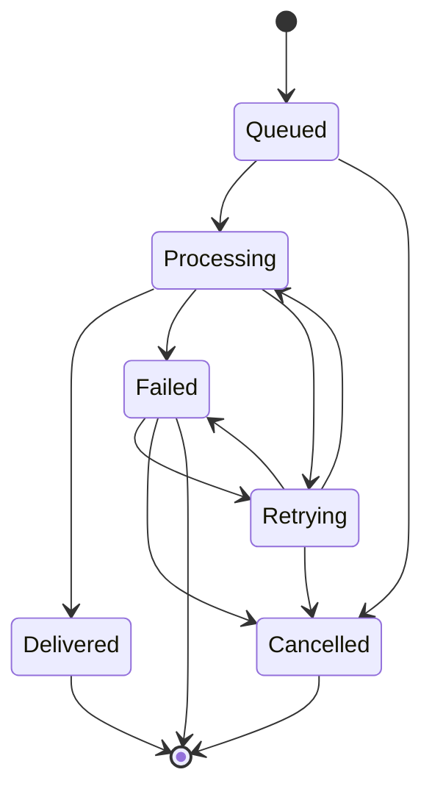
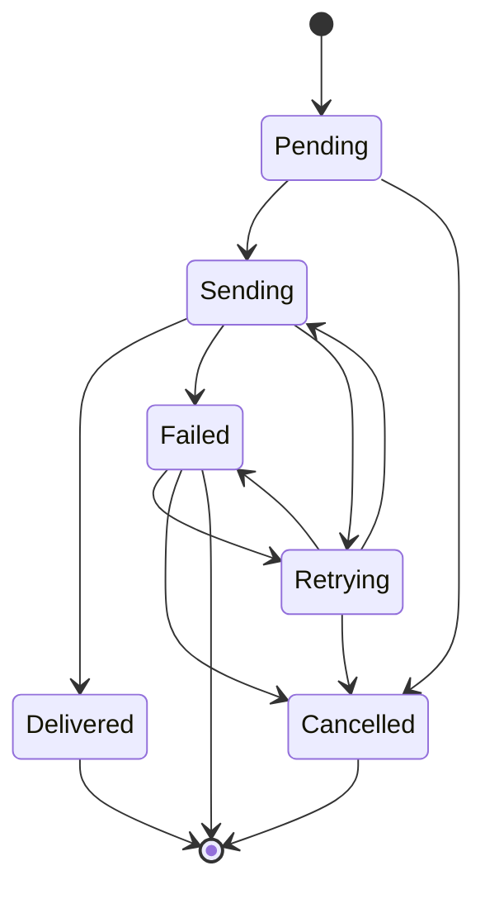

---
# Auto-generated front matter
Title: 10 Notificationservice
LastUpdated: 2025-11-06T20:45:58.510479
Tags: []
Status: draft
---

# 10. Notification Service - Multi-Channel Communication System

## Title & Summary

Design and implement a notification service that handles multi-channel messaging (email, SMS, push notifications, webhooks) with delivery tracking, retry mechanisms, and template management.

## Problem Statement

Build a notification service that:

1. **Multi-Channel Support**: Send notifications via email, SMS, push, and webhooks
2. **Template Management**: Manage notification templates with variable substitution
3. **Delivery Tracking**: Track notification delivery status and failures
4. **Retry Mechanisms**: Handle failed deliveries with intelligent retry logic
5. **User Preferences**: Respect user notification preferences and opt-outs
6. **Rate Limiting**: Implement channel-specific rate limiting

## Requirements & Constraints

### Functional Requirements

- Send notifications via multiple channels
- Template-based notification content
- Delivery status tracking and reporting
- Retry logic for failed deliveries
- User preference management
- Channel-specific rate limiting

### Non-Functional Requirements

- **Latency**: < 500ms for notification queuing
- **Consistency**: Eventually consistent delivery status
- **Memory**: Support 1M pending notifications
- **Scalability**: Handle 100K notifications per minute
- **Reliability**: 99.9% notification delivery success rate

## API / Interfaces

### REST Endpoints

```go
// Notification Management
POST   /api/notifications/send
GET    /api/notifications/{notificationID}
GET    /api/notifications/status/{status}

// Template Management
GET    /api/templates
POST   /api/templates
PUT    /api/templates/{templateID}

// User Preferences
GET    /api/users/{userID}/preferences
PUT    /api/users/{userID}/preferences

// Delivery Tracking
GET    /api/delivery/{notificationID}
POST   /api/delivery/{notificationID}/retry
```

### Request/Response Examples

```json
// Send Notification
POST /api/notifications/send
{
  "userID": "user123",
  "channels": ["email", "sms"],
  "templateID": "welcome_email",
  "variables": {
    "name": "John Doe",
    "verificationCode": "123456"
  },
  "priority": "high",
  "scheduleAt": "2024-01-15T10:30:00Z"
}

// Notification Response
{
  "notificationID": "notif_789",
  "status": "queued",
  "channels": ["email", "sms"],
  "estimatedDelivery": "2024-01-15T10:30:05Z",
  "trackingID": "track_456"
}
```

## Data Model

### Core Entities

```go
type Notification struct {
    ID              string            `json:"id"`
    UserID          string            `json:"userID"`
    Channels        []string          `json:"channels"`
    TemplateID      string            `json:"templateID"`
    Variables       map[string]string `json:"variables"`
    Priority        string            `json:"priority"`
    Status          NotificationStatus `json:"status"`
    ScheduleAt      time.Time         `json:"scheduleAt"`
    CreatedAt       time.Time         `json:"createdAt"`
    DeliveredAt     *time.Time        `json:"deliveredAt,omitempty"`
    RetryCount      int               `json:"retryCount"`
    MaxRetries      int               `json:"maxRetries"`
}

type Template struct {
    ID          string            `json:"id"`
    Name        string            `json:"name"`
    Type        string            `json:"type"`
    Subject     string            `json:"subject"`
    Content     string            `json:"content"`
    Variables   []string          `json:"variables"`
    IsActive    bool              `json:"isActive"`
    CreatedAt   time.Time         `json:"createdAt"`
    UpdatedAt   time.Time         `json:"updatedAt"`
}

type Delivery struct {
    ID              string        `json:"id"`
    NotificationID  string        `json:"notificationID"`
    Channel         string        `json:"channel"`
    Status          DeliveryStatus `json:"status"`
    ProviderID      string        `json:"providerID"`
    ErrorMessage    string        `json:"errorMessage,omitempty"`
    DeliveredAt     *time.Time    `json:"deliveredAt,omitempty"`
    RetryCount      int           `json:"retryCount"`
    CreatedAt       time.Time     `json:"createdAt"`
}

type UserPreferences struct {
    UserID      string            `json:"userID"`
    Channels    map[string]bool   `json:"channels"`
    Frequency   string            `json:"frequency"`
    OptOuts     []string          `json:"optOuts"`
    UpdatedAt   time.Time         `json:"updatedAt"`
}
```

## State Machine

### Notification State Machine



### Delivery State Machine



## Approach Overview

### Simple Solution (MVP)

1. In-memory notification queue with basic delivery
2. Simple template substitution
3. Basic retry mechanism
4. No user preferences or rate limiting

### Production-Ready Design

1. **Multi-Channel Architecture**: Plugin-based channel providers
2. **Template Engine**: Advanced template processing with validation
3. **Delivery Tracking**: Comprehensive delivery status monitoring
4. **Retry Engine**: Intelligent retry with exponential backoff
5. **User Management**: Preference management and opt-out handling
6. **Rate Limiting**: Channel-specific rate limiting and throttling

## Detailed Design

### Modular Decomposition

```go
notificationservice/
├── notifications/ # Notification management
├── templates/     # Template engine
├── channels/      # Channel providers
├── delivery/      # Delivery tracking
├── preferences/   # User preferences
├── retry/         # Retry engine
└── rate/          # Rate limiting
```

### Concurrency Model

```go
type NotificationService struct {
    notifications map[string]*Notification
    templates     map[string]*Template
    deliveries    map[string]*Delivery
    preferences   map[string]*UserPreferences
    channels      map[string]ChannelProvider
    mutex         sync.RWMutex
    notificationChan chan *Notification
    deliveryChan  chan *Delivery
    retryChan     chan RetryRequest
}

// Goroutines for:
// 1. Notification processing
// 2. Delivery processing
// 3. Retry processing
// 4. Template processing
```

## Optimal Golang Implementation

```go
package main

import (
    "bytes"
    "context"
    "encoding/json"
    "fmt"
    "html/template"
    "log"
    "net/http"
    "strings"
    "sync"
    "time"

    "github.com/google/uuid"
)

type NotificationStatus string
const (
    StatusQueued     NotificationStatus = "queued"
    StatusProcessing NotificationStatus = "processing"
    StatusDelivered  NotificationStatus = "delivered"
    StatusFailed     NotificationStatus = "failed"
    StatusCancelled  NotificationStatus = "cancelled"
    StatusRetrying   NotificationStatus = "retrying"
)

type DeliveryStatus string
const (
    DeliveryPending   DeliveryStatus = "pending"
    DeliverySending   DeliveryStatus = "sending"
    DeliveryDelivered DeliveryStatus = "delivered"
    DeliveryFailed    DeliveryStatus = "failed"
    DeliveryRetrying  DeliveryStatus = "retrying"
    DeliveryCancelled DeliveryStatus = "cancelled"
)

type Notification struct {
    ID              string            `json:"id"`
    UserID          string            `json:"userID"`
    Channels        []string          `json:"channels"`
    TemplateID      string            `json:"templateID"`
    Variables       map[string]string `json:"variables"`
    Priority        string            `json:"priority"`
    Status          NotificationStatus `json:"status"`
    ScheduleAt      time.Time         `json:"scheduleAt"`
    CreatedAt       time.Time         `json:"createdAt"`
    DeliveredAt     *time.Time        `json:"deliveredAt,omitempty"`
    RetryCount      int               `json:"retryCount"`
    MaxRetries      int               `json:"maxRetries"`
}

type Template struct {
    ID          string            `json:"id"`
    Name        string            `json:"name"`
    Type        string            `json:"type"`
    Subject     string            `json:"subject"`
    Content     string            `json:"content"`
    Variables   []string          `json:"variables"`
    IsActive    bool              `json:"isActive"`
    CreatedAt   time.Time         `json:"createdAt"`
    UpdatedAt   time.Time         `json:"updatedAt"`
}

type Delivery struct {
    ID              string        `json:"id"`
    NotificationID  string        `json:"notificationID"`
    Channel         string        `json:"channel"`
    Status          DeliveryStatus `json:"status"`
    ProviderID      string        `json:"providerID"`
    ErrorMessage    string        `json:"errorMessage,omitempty"`
    DeliveredAt     *time.Time    `json:"deliveredAt,omitempty"`
    RetryCount      int           `json:"retryCount"`
    CreatedAt       time.Time     `json:"createdAt"`
}

type UserPreferences struct {
    UserID      string            `json:"userID"`
    Channels    map[string]bool   `json:"channels"`
    Frequency   string            `json:"frequency"`
    OptOuts     []string          `json:"optOuts"`
    UpdatedAt   time.Time         `json:"updatedAt"`
}

type ChannelProvider interface {
    Send(ctx context.Context, delivery *Delivery, content string) error
    GetName() string
    GetRateLimit() int
}

type EmailProvider struct {
    name      string
    rateLimit int
}

func (ep *EmailProvider) Send(ctx context.Context, delivery *Delivery, content string) error {
    // Simulate email sending
    time.Sleep(100 * time.Millisecond)

    // Simulate occasional failures
    if delivery.RetryCount > 0 && delivery.RetryCount%3 == 0 {
        return fmt.Errorf("email provider temporarily unavailable")
    }

    log.Printf("Email sent to user %s: %s", delivery.NotificationID, content[:50])
    return nil
}

func (ep *EmailProvider) GetName() string {
    return ep.name
}

func (ep *EmailProvider) GetRateLimit() int {
    return ep.rateLimit
}

type SMSProvider struct {
    name      string
    rateLimit int
}

func (sp *SMSProvider) Send(ctx context.Context, delivery *Delivery, content string) error {
    // Simulate SMS sending
    time.Sleep(50 * time.Millisecond)

    // Simulate occasional failures
    if delivery.RetryCount > 0 && delivery.RetryCount%4 == 0 {
        return fmt.Errorf("SMS provider temporarily unavailable")
    }

    log.Printf("SMS sent to user %s: %s", delivery.NotificationID, content[:50])
    return nil
}

func (sp *SMSProvider) GetName() string {
    return sp.name
}

func (sp *SMSProvider) GetRateLimit() int {
    return sp.rateLimit
}

type PushProvider struct {
    name      string
    rateLimit int
}

func (pp *PushProvider) Send(ctx context.Context, delivery *Delivery, content string) error {
    // Simulate push notification sending
    time.Sleep(30 * time.Millisecond)

    log.Printf("Push notification sent to user %s: %s", delivery.NotificationID, content[:50])
    return nil
}

func (pp *PushProvider) GetName() string {
    return pp.name
}

func (pp *PushProvider) GetRateLimit() int {
    return pp.rateLimit
}

type RetryRequest struct {
    DeliveryID string
    Delay      time.Duration
    Reason     string
}

type NotificationService struct {
    notifications map[string]*Notification
    templates     map[string]*Template
    deliveries    map[string]*Delivery
    preferences   map[string]*UserPreferences
    channels      map[string]ChannelProvider
    mutex         sync.RWMutex
    notificationChan chan *Notification
    deliveryChan  chan *Delivery
    retryChan     chan RetryRequest
}

func NewNotificationService() *NotificationService {
    service := &NotificationService{
        notifications: make(map[string]*Notification),
        templates:     make(map[string]*Template),
        deliveries:    make(map[string]*Delivery),
        preferences:   make(map[string]*UserPreferences),
        channels:      make(map[string]ChannelProvider),
        notificationChan: make(chan *Notification, 10000),
        deliveryChan:  make(chan *Delivery, 10000),
        retryChan:     make(chan RetryRequest, 1000),
    }

    // Register channel providers
    service.channels["email"] = &EmailProvider{name: "email", rateLimit: 1000}
    service.channels["sms"] = &SMSProvider{name: "sms", rateLimit: 100}
    service.channels["push"] = &PushProvider{name: "push", rateLimit: 10000}

    return service
}

func (ns *NotificationService) SendNotification(userID string, channels []string, templateID string, variables map[string]string, priority string, scheduleAt time.Time) (*Notification, error) {
    // Check user preferences
    prefs, exists := ns.preferences[userID]
    if exists {
        // Filter channels based on user preferences
        var allowedChannels []string
        for _, channel := range channels {
            if prefs.Channels[channel] && !contains(prefs.OptOuts, channel) {
                allowedChannels = append(allowedChannels, channel)
            }
        }
        channels = allowedChannels
    }

    if len(channels) == 0 {
        return nil, fmt.Errorf("no allowed channels for user")
    }

    // Validate template exists
    template, exists := ns.templates[templateID]
    if !exists || !template.IsActive {
        return nil, fmt.Errorf("template not found or inactive")
    }

    notification := &Notification{
        ID:         uuid.New().String(),
        UserID:     userID,
        Channels:   channels,
        TemplateID: templateID,
        Variables:  variables,
        Priority:   priority,
        Status:     StatusQueued,
        ScheduleAt: scheduleAt,
        CreatedAt:  time.Now(),
        RetryCount: 0,
        MaxRetries: 3,
    }

    ns.mutex.Lock()
    ns.notifications[notification.ID] = notification
    ns.mutex.Unlock()

    // Send to processing channel
    ns.notificationChan <- notification

    return notification, nil
}

func (ns *NotificationService) GetNotification(notificationID string) (*Notification, error) {
    ns.mutex.RLock()
    defer ns.mutex.RUnlock()

    notification, exists := ns.notifications[notificationID]
    if !exists {
        return nil, fmt.Errorf("notification not found")
    }

    return notification, nil
}

func (ns *NotificationService) GetDeliveries(notificationID string) ([]*Delivery, error) {
    ns.mutex.RLock()
    defer ns.mutex.RUnlock()

    var deliveries []*Delivery
    for _, delivery := range ns.deliveries {
        if delivery.NotificationID == notificationID {
            deliveries = append(deliveries, delivery)
        }
    }

    return deliveries, nil
}

func (ns *NotificationService) CreateTemplate(name, templateType, subject, content string, variables []string) (*Template, error) {
    template := &Template{
        ID:        uuid.New().String(),
        Name:      name,
        Type:      templateType,
        Subject:   subject,
        Content:   content,
        Variables: variables,
        IsActive:  true,
        CreatedAt: time.Now(),
        UpdatedAt: time.Now(),
    }

    ns.mutex.Lock()
    ns.templates[template.ID] = template
    ns.mutex.Unlock()

    return template, nil
}

func (ns *NotificationService) SetUserPreferences(userID string, channels map[string]bool, frequency string, optOuts []string) error {
    prefs := &UserPreferences{
        UserID:    userID,
        Channels:  channels,
        Frequency: frequency,
        OptOuts:   optOuts,
        UpdatedAt: time.Now(),
    }

    ns.mutex.Lock()
    ns.preferences[userID] = prefs
    ns.mutex.Unlock()

    return nil
}

func (ns *NotificationService) ProcessNotifications() {
    for notification := range ns.notificationChan {
        // Check if notification should be processed now
        if time.Now().Before(notification.ScheduleAt) {
            // Schedule for later
            go func(n *Notification) {
                time.Sleep(time.Until(n.ScheduleAt))
                ns.notificationChan <- n
            }(notification)
            continue
        }

        ns.processNotification(notification)
    }
}

func (ns *NotificationService) processNotification(notification *Notification) {
    ns.mutex.Lock()
    notification.Status = StatusProcessing
    ns.mutex.Unlock()

    // Get template
    template, exists := ns.templates[notification.TemplateID]
    if !exists {
        ns.handleNotificationFailure(notification, fmt.Errorf("template not found"))
        return
    }

    // Process template
    content, err := ns.processTemplate(template, notification.Variables)
    if err != nil {
        ns.handleNotificationFailure(notification, err)
        return
    }

    // Create deliveries for each channel
    var deliveries []*Delivery
    for _, channel := range notification.Channels {
        delivery := &Delivery{
            ID:             uuid.New().String(),
            NotificationID: notification.ID,
            Channel:        channel,
            Status:         DeliveryPending,
            CreatedAt:      time.Now(),
        }

        ns.mutex.Lock()
        ns.deliveries[delivery.ID] = delivery
        ns.mutex.Unlock()

        deliveries = append(deliveries, delivery)

        // Send to delivery channel
        ns.deliveryChan <- delivery
    }

    // Wait for all deliveries to complete
    go ns.waitForDeliveries(notification, deliveries, content)
}

func (ns *NotificationService) processTemplate(template *Template, variables map[string]string) (string, error) {
    // Create template with variables
    tmpl, err := template.New("notification").Parse(template.Content)
    if err != nil {
        return "", err
    }

    var buf bytes.Buffer
    err = tmpl.Execute(&buf, variables)
    if err != nil {
        return "", err
    }

    return buf.String(), nil
}

func (ns *NotificationService) waitForDeliveries(notification *Notification, deliveries []*Delivery, content string) {
    // Wait for all deliveries to complete
    for _, delivery := range deliveries {
        // Wait for delivery status update
        for {
            ns.mutex.RLock()
            currentDelivery, exists := ns.deliveries[delivery.ID]
            ns.mutex.RUnlock()

            if !exists {
                break
            }

            if currentDelivery.Status == DeliveryDelivered ||
               currentDelivery.Status == DeliveryFailed ||
               currentDelivery.Status == DeliveryCancelled {
                break
            }

            time.Sleep(100 * time.Millisecond)
        }
    }

    // Check overall notification status
    ns.mutex.RLock()
    var allDelivered, anyFailed bool
    for _, delivery := range deliveries {
        currentDelivery, exists := ns.deliveries[delivery.ID]
        if exists {
            if currentDelivery.Status == DeliveryDelivered {
                allDelivered = true
            } else if currentDelivery.Status == DeliveryFailed {
                anyFailed = true
            }
        }
    }
    ns.mutex.RUnlock()

    ns.mutex.Lock()
    if allDelivered && !anyFailed {
        notification.Status = StatusDelivered
        now := time.Now()
        notification.DeliveredAt = &now
    } else if anyFailed {
        notification.Status = StatusFailed
    }
    ns.mutex.Unlock()
}

func (ns *NotificationService) ProcessDeliveries() {
    for delivery := range ns.deliveryChan {
        ns.processDelivery(delivery)
    }
}

func (ns *NotificationService) processDelivery(delivery *Delivery) {
    ns.mutex.Lock()
    delivery.Status = DeliverySending
    ns.mutex.Unlock()

    // Get channel provider
    provider, exists := ns.channels[delivery.Channel]
    if !exists {
        ns.handleDeliveryFailure(delivery, fmt.Errorf("channel provider not found"))
        return
    }

    // Get notification and template
    notification, exists := ns.notifications[delivery.NotificationID]
    if !exists {
        ns.handleDeliveryFailure(delivery, fmt.Errorf("notification not found"))
        return
    }

    template, exists := ns.templates[notification.TemplateID]
    if !exists {
        ns.handleDeliveryFailure(delivery, fmt.Errorf("template not found"))
        return
    }

    // Process template
    content, err := ns.processTemplate(template, notification.Variables)
    if err != nil {
        ns.handleDeliveryFailure(delivery, err)
        return
    }

    // Send via provider
    ctx, cancel := context.WithTimeout(context.Background(), 30*time.Second)
    defer cancel()

    err = provider.Send(ctx, delivery, content)
    if err != nil {
        ns.handleDeliveryFailure(delivery, err)
        return
    }

    // Mark as delivered
    ns.mutex.Lock()
    delivery.Status = DeliveryDelivered
    now := time.Now()
    delivery.DeliveredAt = &now
    ns.mutex.Unlock()
}

func (ns *NotificationService) handleDeliveryFailure(delivery *Delivery, err error) {
    delivery.RetryCount++

    if delivery.RetryCount >= 3 {
        ns.mutex.Lock()
        delivery.Status = DeliveryFailed
        delivery.ErrorMessage = err.Error()
        ns.mutex.Unlock()
    } else {
        ns.mutex.Lock()
        delivery.Status = DeliveryRetrying
        delivery.ErrorMessage = err.Error()
        ns.mutex.Unlock()

        // Schedule retry
        delay := time.Duration(delivery.RetryCount) * time.Minute
        ns.retryChan <- RetryRequest{
            DeliveryID: delivery.ID,
            Delay:      delay,
            Reason:     err.Error(),
        }
    }
}

func (ns *NotificationService) handleNotificationFailure(notification *Notification, err error) {
    notification.RetryCount++

    if notification.RetryCount >= notification.MaxRetries {
        ns.mutex.Lock()
        notification.Status = StatusFailed
        ns.mutex.Unlock()
    } else {
        ns.mutex.Lock()
        notification.Status = StatusRetrying
        ns.mutex.Unlock()

        // Schedule retry
        go func() {
            time.Sleep(time.Duration(notification.RetryCount) * time.Minute)
            ns.notificationChan <- notification
        }()
    }
}

func (ns *NotificationService) ProcessRetries() {
    for retryReq := range ns.retryChan {
        time.Sleep(retryReq.Delay)

        ns.mutex.RLock()
        delivery, exists := ns.deliveries[retryReq.DeliveryID]
        ns.mutex.RUnlock()

        if exists && delivery.Status == DeliveryRetrying {
            ns.deliveryChan <- delivery
        }
    }
}

func contains(slice []string, item string) bool {
    for _, s := range slice {
        if s == item {
            return true
        }
    }
    return false
}

// HTTP Handlers
func (ns *NotificationService) SendNotificationHandler(w http.ResponseWriter, r *http.Request) {
    if r.Method != http.MethodPost {
        http.Error(w, "Method not allowed", http.StatusMethodNotAllowed)
        return
    }

    var req struct {
        UserID     string            `json:"userID"`
        Channels   []string          `json:"channels"`
        TemplateID string            `json:"templateID"`
        Variables  map[string]string `json:"variables"`
        Priority   string            `json:"priority"`
        ScheduleAt time.Time         `json:"scheduleAt"`
    }

    if err := json.NewDecoder(r.Body).Decode(&req); err != nil {
        http.Error(w, "Invalid request", http.StatusBadRequest)
        return
    }

    notification, err := ns.SendNotification(req.UserID, req.Channels, req.TemplateID, req.Variables, req.Priority, req.ScheduleAt)
    if err != nil {
        http.Error(w, err.Error(), http.StatusBadRequest)
        return
    }

    w.Header().Set("Content-Type", "application/json")
    json.NewEncoder(w).Encode(notification)
}

func (ns *NotificationService) GetNotificationHandler(w http.ResponseWriter, r *http.Request) {
    if r.Method != http.MethodGet {
        http.Error(w, "Method not allowed", http.StatusMethodNotAllowed)
        return
    }

    notificationID := r.URL.Path[len("/api/notifications/"):]
    notification, err := ns.GetNotification(notificationID)
    if err != nil {
        http.Error(w, err.Error(), http.StatusNotFound)
        return
    }

    w.Header().Set("Content-Type", "application/json")
    json.NewEncoder(w).Encode(notification)
}

func (ns *NotificationService) GetDeliveriesHandler(w http.ResponseWriter, r *http.Request) {
    if r.Method != http.MethodGet {
        http.Error(w, "Method not allowed", http.StatusMethodNotAllowed)
        return
    }

    notificationID := r.URL.Query().Get("notificationID")
    if notificationID == "" {
        http.Error(w, "notificationID required", http.StatusBadRequest)
        return
    }

    deliveries, err := ns.GetDeliveries(notificationID)
    if err != nil {
        http.Error(w, err.Error(), http.StatusNotFound)
        return
    }

    w.Header().Set("Content-Type", "application/json")
    json.NewEncoder(w).Encode(deliveries)
}

func main() {
    service := NewNotificationService()

    // Start background workers
    go service.ProcessNotifications()
    go service.ProcessDeliveries()
    go service.ProcessRetries()

    // Create sample template
    service.CreateTemplate("welcome_email", "email", "Welcome to our service",
        "Hello {{.name}}, welcome to our service! Your verification code is {{.verificationCode}}.",
        []string{"name", "verificationCode"})

    // HTTP routes
    http.HandleFunc("/api/notifications/send", service.SendNotificationHandler)
    http.HandleFunc("/api/notifications/", service.GetNotificationHandler)
    http.HandleFunc("/api/delivery", service.GetDeliveriesHandler)

    log.Println("Notification service starting on :8080")
    log.Fatal(http.ListenAndServe(":8080", nil))
}
```

## Unit Tests

```go
func TestNotificationService_SendNotification(t *testing.T) {
    service := NewNotificationService()

    // Create template
    template, err := service.CreateTemplate("test_template", "email", "Test Subject",
        "Hello {{.name}}!", []string{"name"})
    if err != nil {
        t.Fatalf("CreateTemplate() error = %v", err)
    }

    // Send notification
    notification, err := service.SendNotification("user123", []string{"email"},
        template.ID, map[string]string{"name": "John"}, "normal", time.Now())
    if err != nil {
        t.Fatalf("SendNotification() error = %v", err)
    }

    if notification.UserID != "user123" {
        t.Errorf("Expected userID user123, got %s", notification.UserID)
    }

    if notification.Status != StatusQueued {
        t.Errorf("Expected status %s, got %s", StatusQueued, notification.Status)
    }
}

func TestNotificationService_UserPreferences(t *testing.T) {
    service := NewNotificationService()

    // Set user preferences
    err := service.SetUserPreferences("user123", map[string]bool{
        "email": true,
        "sms":   false,
    }, "normal", []string{})
    if err != nil {
        t.Fatalf("SetUserPreferences() error = %v", err)
    }

    // Create template
    template, _ := service.CreateTemplate("test_template", "email", "Test Subject",
        "Hello {{.name}}!", []string{"name"})

    // Send notification with multiple channels
    notification, err := service.SendNotification("user123", []string{"email", "sms"},
        template.ID, map[string]string{"name": "John"}, "normal", time.Now())
    if err != nil {
        t.Fatalf("SendNotification() error = %v", err)
    }

    // Should only include email channel
    if len(notification.Channels) != 1 || notification.Channels[0] != "email" {
        t.Errorf("Expected only email channel, got %v", notification.Channels)
    }
}

func TestNotificationService_TemplateProcessing(t *testing.T) {
    service := NewNotificationService()

    // Create template
    template, err := service.CreateTemplate("test_template", "email", "Test Subject",
        "Hello {{.name}}, your code is {{.code}}!", []string{"name", "code"})
    if err != nil {
        t.Fatalf("CreateTemplate() error = %v", err)
    }

    // Process template
    content, err := service.processTemplate(template, map[string]string{
        "name": "John",
        "code": "123456",
    })
    if err != nil {
        t.Fatalf("processTemplate() error = %v", err)
    }

    expected := "Hello John, your code is 123456!"
    if content != expected {
        t.Errorf("Expected %s, got %s", expected, content)
    }
}
```

## Complexity Analysis

### Time Complexity

- **Send Notification**: O(1) - Hash map operations
- **Process Template**: O(T) - Template processing time
- **Process Delivery**: O(1) - Channel provider call
- **Get Deliveries**: O(D) - Linear scan through deliveries

### Space Complexity

- **Notification Storage**: O(N) where N is number of notifications
- **Template Storage**: O(T) where T is number of templates
- **Delivery Storage**: O(D) where D is number of deliveries
- **Preference Storage**: O(U) where U is number of users
- **Total**: O(N + T + D + U)

## Edge Cases & Validation

### Input Validation

- Invalid template IDs
- Missing required variables
- Invalid channel names
- Invalid user preferences
- Malformed template content

### Error Scenarios

- Channel provider failures
- Template processing errors
- User preference conflicts
- Delivery timeout handling
- Retry limit exceeded

### Boundary Conditions

- Maximum notification size
- Template variable limits
- Channel rate limits
- Retry count limits
- User preference validation

## Extension Ideas (Scaling)

### Horizontal Scaling

1. **Load Balancing**: Multiple service instances
2. **Message Queue**: Kafka for notification processing
3. **Database Sharding**: Partition by user or template
4. **Channel Scaling**: Dedicated workers per channel

### Performance Optimization

1. **Template Caching**: Cache processed templates
2. **Batch Processing**: Batch notification processing
3. **Connection Pooling**: Optimize channel provider connections
4. **Async Processing**: Background delivery processing

### Advanced Features

1. **A/B Testing**: Template and channel testing
2. **Analytics**: Delivery analytics and reporting
3. **Personalization**: Dynamic content personalization
4. **Compliance**: GDPR and privacy compliance

## 20 Follow-up Questions

### 1. How would you handle notification delivery failures?

**Answer**: Implement exponential backoff retry mechanisms. Use circuit breaker pattern for provider failures. Implement dead letter queues for permanently failed notifications. Consider using alternative channels for critical notifications.

### 2. What's your strategy for handling notification spam prevention?

**Answer**: Implement rate limiting per user and channel. Use notification frequency controls. Implement user preference management. Consider using machine learning for spam detection.

### 3. How do you ensure notification delivery order?

**Answer**: Implement sequence numbers for ordered delivery. Use message queues with ordering guarantees. Implement delivery confirmation mechanisms. Consider using distributed consensus for ordering.

### 4. What's your approach to handling notification personalization?

**Answer**: Implement dynamic content generation. Use user profile data for personalization. Implement A/B testing for content optimization. Consider using machine learning for personalization.

### 5. How would you implement notification analytics?

**Answer**: Implement delivery tracking and metrics. Use data warehouse for analytics. Implement real-time dashboards. Consider using business intelligence tools.

### 6. What's your strategy for handling notification compliance?

**Answer**: Implement GDPR compliance features. Use opt-in/opt-out management. Implement data retention policies. Consider using compliance management tools.

### 7. How do you handle notification testing?

**Answer**: Implement notification testing frameworks. Use mock providers for testing. Implement integration testing. Consider using notification simulation tools.

### 8. What's your approach to handling notification security?

**Answer**: Implement encryption for sensitive content. Use secure communication protocols. Implement access controls. Consider using security monitoring tools.

### 9. How would you implement notification performance monitoring?

**Answer**: Implement performance monitoring and alerting. Use APM tools for tracking. Implement SLA monitoring. Consider using performance optimization tools.

### 10. What's your strategy for handling notification disaster recovery?

**Answer**: Implement notification backup and recovery. Use multi-region replication. Implement disaster recovery procedures. Consider using cloud disaster recovery services.

### 11. How do you handle notification integration?

**Answer**: Implement API-based integration. Use webhooks for real-time updates. Implement data synchronization. Consider using integration platforms.

### 12. What's your approach to handling notification versioning?

**Answer**: Implement notification template versioning. Use backward compatibility. Implement migration strategies. Consider using semantic versioning.

### 13. How would you implement notification caching?

**Answer**: Implement template caching for performance. Use Redis for caching. Implement cache invalidation strategies. Consider using CDN for content delivery.

### 14. What's your strategy for handling notification queuing?

**Answer**: Implement priority-based queuing. Use message queues for reliability. Implement queue monitoring. Consider using specialized queuing systems.

### 15. How do you handle notification batching?

**Answer**: Implement batch notification processing. Use batch optimization algorithms. Implement batch delivery tracking. Consider using batch processing frameworks.

### 16. What's your approach to handling notification scheduling?

**Answer**: Implement time-based scheduling. Use cron jobs for recurring notifications. Implement timezone handling. Consider using scheduling frameworks.

### 17. How would you implement notification templating?

**Answer**: Implement advanced template engines. Use variable substitution. Implement template validation. Consider using template management systems.

### 18. What's your strategy for handling notification channels?

**Answer**: Implement plugin-based channel architecture. Use channel-specific optimizations. Implement channel health monitoring. Consider using channel management platforms.

### 19. How do you handle notification user management?

**Answer**: Implement user preference management. Use opt-in/opt-out controls. Implement user segmentation. Consider using user management systems.

### 20. What's your approach to handling notification reporting?

**Answer**: Implement comprehensive reporting. Use data visualization tools. Implement automated reporting. Consider using business intelligence platforms.

## Evaluation Checklist

### Code Quality (25%)

- [ ] Clean, readable Go code with proper error handling
- [ ] Appropriate use of interfaces and structs
- [ ] Proper concurrency patterns (goroutines, channels)
- [ ] Good separation of concerns

### Architecture (25%)

- [ ] Scalable design with multi-channel support
- [ ] Proper template processing and management
- [ ] Efficient delivery tracking
- [ ] Comprehensive retry mechanisms

### Functionality (25%)

- [ ] Multi-channel notification sending working
- [ ] Template processing functional
- [ ] Delivery tracking implemented
- [ ] User preferences working

### Testing (15%)

- [ ] Unit tests for core functionality
- [ ] Integration tests for API endpoints
- [ ] Edge case testing
- [ ] Performance testing

### Discussion (10%)

- [ ] Clear explanation of design decisions
- [ ] Understanding of notification systems
- [ ] Knowledge of multi-channel delivery
- [ ] Ability to discuss trade-offs

## Discussion Pointers

### Key Points to Highlight

1. **Multi-Channel Architecture**: Explain the plugin-based channel provider system
2. **Template Processing**: Discuss the template engine and variable substitution
3. **Delivery Tracking**: Explain the comprehensive delivery status monitoring
4. **Retry Mechanisms**: Discuss the intelligent retry logic with exponential backoff
5. **User Preferences**: Explain the preference management and opt-out handling

### Trade-offs to Discuss

1. **Reliability vs Performance**: High reliability vs fast delivery trade-offs
2. **Consistency vs Availability**: Strong consistency vs high availability trade-offs
3. **Cost vs Features**: Infrastructure cost vs advanced features trade-offs
4. **Simplicity vs Flexibility**: Simple design vs flexible configuration trade-offs
5. **Speed vs Accuracy**: Fast delivery vs accurate tracking trade-offs

### Extension Scenarios

1. **Multi-region Deployment**: How to handle geographic distribution
2. **Advanced Analytics**: Real-time notification analytics and reporting
3. **Compliance Integration**: GDPR and regulatory compliance features
4. **Enterprise Features**: Multi-tenant and white-label solutions
5. **AI Integration**: Machine learning for personalization and optimization
