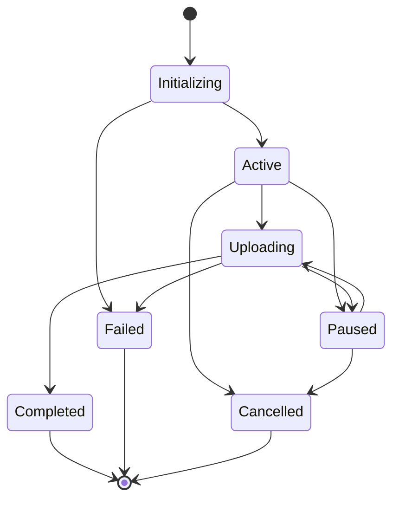
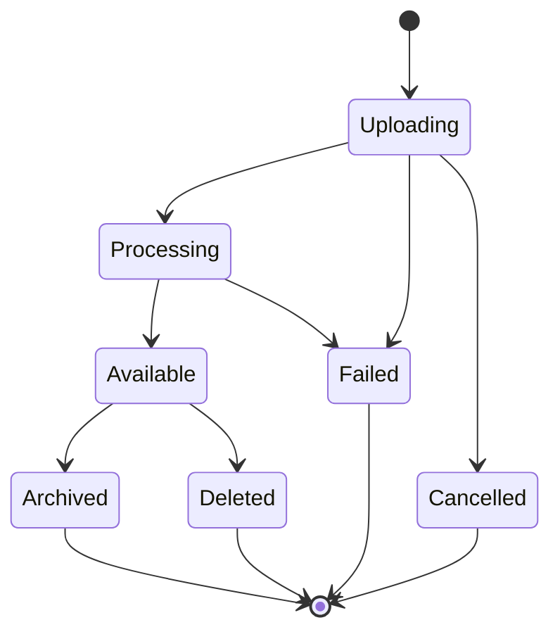

---
# Auto-generated front matter
Title: 11 Fileuploadservice
LastUpdated: 2025-11-06T20:45:58.503646
Tags: []
Status: draft
---

# 11. File Upload Service - Distributed File Management System

## Title & Summary
Design and implement a file upload service that handles file uploads with progress tracking, chunked uploads, resumable uploads, and distributed storage with metadata management.

## Problem Statement

Build a file upload service that:

1. **Chunked Uploads**: Handle large files with chunked upload mechanism
2. **Resumable Uploads**: Support resuming interrupted uploads
3. **Progress Tracking**: Real-time upload progress monitoring
4. **File Validation**: File type, size, and content validation
5. **Distributed Storage**: Support multiple storage backends
6. **Metadata Management**: File metadata and indexing

## Requirements & Constraints

### Functional Requirements
- Chunked file upload with progress tracking
- Resumable upload support
- File validation and security checks
- Multiple storage backend support
- File metadata management
- Upload session management

### Non-Functional Requirements
- **Latency**: < 100ms for upload initiation
- **Consistency**: Eventually consistent file metadata
- **Memory**: Support 10K concurrent uploads
- **Scalability**: Handle 1TB+ file uploads
- **Reliability**: 99.9% upload completion rate

## API / Interfaces

### REST Endpoints

```go
// Upload Management
POST   /api/upload/initiate
POST   /api/upload/{uploadID}/chunk
GET    /api/upload/{uploadID}/status
POST   /api/upload/{uploadID}/complete
DELETE /api/upload/{uploadID}/cancel

// File Management
GET    /api/files/{fileID}
DELETE /api/files/{fileID}
GET    /api/files/{fileID}/download

// WebSocket
WS     /ws/upload/{uploadID}
```

### Request/Response Examples

```json
// Initiate Upload
POST /api/upload/initiate
{
  "fileName": "large_video.mp4",
  "fileSize": 1073741824,
  "chunkSize": 1048576,
  "contentType": "video/mp4",
  "metadata": {
    "description": "Product demo video",
    "category": "marketing"
  }
}

// Upload Response
{
  "uploadID": "upload_123",
  "chunkSize": 1048576,
  "totalChunks": 1024,
  "uploadURL": "/api/upload/upload_123/chunk",
  "expiresAt": "2024-01-15T12:00:00Z"
}
```

## Data Model

### Core Entities

```go
type UploadSession struct {
    ID              string            `json:"id"`
    UserID          string            `json:"userID"`
    FileName        string            `json:"fileName"`
    FileSize        int64             `json:"fileSize"`
    ContentType     string            `json:"contentType"`
    ChunkSize       int64             `json:"chunkSize"`
    TotalChunks     int64             `json:"totalChunks"`
    UploadedChunks  []int64           `json:"uploadedChunks"`
    Status          UploadStatus      `json:"status"`
    Metadata        map[string]string `json:"metadata"`
    CreatedAt       time.Time         `json:"createdAt"`
    UpdatedAt       time.Time         `json:"updatedAt"`
    ExpiresAt       time.Time         `json:"expiresAt"`
}

type File struct {
    ID              string            `json:"id"`
    UploadID        string            `json:"uploadID"`
    UserID          string            `json:"userID"`
    FileName        string            `json:"fileName"`
    FileSize        int64             `json:"fileSize"`
    ContentType     string            `json:"contentType"`
    StorageBackend  string            `json:"storageBackend"`
    StoragePath     string            `json:"storagePath"`
    Checksum        string            `json:"checksum"`
    Metadata        map[string]string `json:"metadata"`
    CreatedAt       time.Time         `json:"createdAt"`
    UpdatedAt       time.Time         `json:"updatedAt"`
}

type Chunk struct {
    UploadID        string    `json:"uploadID"`
    ChunkNumber     int64     `json:"chunkNumber"`
    Size            int64     `json:"size"`
    Checksum        string    `json:"checksum"`
    StoragePath     string    `json:"storagePath"`
    UploadedAt      time.Time `json:"uploadedAt"`
}
```

## State Machine

### Upload Session State Machine



### File State Machine



## Approach Overview

### Simple Solution (MVP)
1. Basic file upload with single chunk
2. Simple progress tracking
3. Local file storage
4. Basic validation

### Production-Ready Design
1. **Chunked Upload**: Large file support with chunked uploads
2. **Resumable Uploads**: Resume interrupted uploads
3. **Distributed Storage**: Multiple storage backends (S3, GCS, etc.)
4. **Progress Tracking**: Real-time WebSocket progress updates
5. **File Validation**: Comprehensive file validation and security
6. **Metadata Management**: Rich file metadata and indexing

## Detailed Design

### Modular Decomposition

```go
fileupload/
├── upload/        # Upload session management
├── chunks/        # Chunk processing
├── storage/       # Storage backend abstraction
├── validation/    # File validation
├── metadata/      # File metadata management
├── websocket/     # Real-time progress updates
└── cleanup/       # Session cleanup
```

### Concurrency Model

```go
type FileUploadService struct {
    uploads         map[string]*UploadSession
    files           map[string]*File
    chunks          map[string][]*Chunk
    storageBackends map[string]StorageBackend
    mutex           sync.RWMutex
    uploadChan      chan UploadRequest
    chunkChan       chan ChunkRequest
    progressChan    chan ProgressUpdate
}

// Goroutines for:
// 1. Upload processing
// 2. Chunk processing
// 3. Progress broadcasting
// 4. Session cleanup
```

## Optimal Golang Implementation

```go
package main

import (
    "context"
    "crypto/md5"
    "encoding/hex"
    "encoding/json"
    "fmt"
    "io"
    "log"
    "mime/multipart"
    "net/http"
    "os"
    "path/filepath"
    "strconv"
    "strings"
    "sync"
    "time"

    "github.com/google/uuid"
    "github.com/gorilla/websocket"
)

type UploadStatus string
const (
    StatusInitializing UploadStatus = "initializing"
    StatusActive       UploadStatus = "active"
    StatusUploading    UploadStatus = "uploading"
    StatusCompleted    UploadStatus = "completed"
    StatusFailed       UploadStatus = "failed"
    StatusCancelled    UploadStatus = "cancelled"
    StatusPaused       UploadStatus = "paused"
)

type UploadSession struct {
    ID              string            `json:"id"`
    UserID          string            `json:"userID"`
    FileName        string            `json:"fileName"`
    FileSize        int64             `json:"fileSize"`
    ContentType     string            `json:"contentType"`
    ChunkSize       int64             `json:"chunkSize"`
    TotalChunks     int64             `json:"totalChunks"`
    UploadedChunks  []int64           `json:"uploadedChunks"`
    Status          UploadStatus      `json:"status"`
    Metadata        map[string]string `json:"metadata"`
    CreatedAt       time.Time         `json:"createdAt"`
    UpdatedAt       time.Time         `json:"updatedAt"`
    ExpiresAt       time.Time         `json:"expiresAt"`
    mutex           sync.RWMutex
}

type File struct {
    ID              string            `json:"id"`
    UploadID        string            `json:"uploadID"`
    UserID          string            `json:"userID"`
    FileName        string            `json:"fileName"`
    FileSize        int64             `json:"fileSize"`
    ContentType     string            `json:"contentType"`
    StorageBackend  string            `json:"storageBackend"`
    StoragePath     string            `json:"storagePath"`
    Checksum        string            `json:"checksum"`
    Metadata        map[string]string `json:"metadata"`
    CreatedAt       time.Time         `json:"createdAt"`
    UpdatedAt       time.Time         `json:"updatedAt"`
}

type Chunk struct {
    UploadID        string    `json:"uploadID"`
    ChunkNumber     int64     `json:"chunkNumber"`
    Size            int64     `json:"size"`
    Checksum        string    `json:"checksum"`
    StoragePath     string    `json:"storagePath"`
    UploadedAt      time.Time `json:"uploadedAt"`
}

type StorageBackend interface {
    StoreChunk(ctx context.Context, uploadID string, chunkNumber int64, data []byte) (string, error)
    RetrieveChunk(ctx context.Context, path string) ([]byte, error)
    StoreFile(ctx context.Context, fileID string, data []byte) (string, error)
    RetrieveFile(ctx context.Context, path string) ([]byte, error)
    DeleteFile(ctx context.Context, path string) error
}

type LocalStorage struct {
    basePath string
}

func (ls *LocalStorage) StoreChunk(ctx context.Context, uploadID string, chunkNumber int64, data []byte) (string, error) {
    chunkPath := filepath.Join(ls.basePath, "chunks", uploadID, fmt.Sprintf("chunk_%d", chunkNumber))
    
    if err := os.MkdirAll(filepath.Dir(chunkPath), 0755); err != nil {
        return "", err
    }
    
    if err := os.WriteFile(chunkPath, data, 0644); err != nil {
        return "", err
    }
    
    return chunkPath, nil
}

func (ls *LocalStorage) RetrieveChunk(ctx context.Context, path string) ([]byte, error) {
    return os.ReadFile(path)
}

func (ls *LocalStorage) StoreFile(ctx context.Context, fileID string, data []byte) (string, error) {
    filePath := filepath.Join(ls.basePath, "files", fileID)
    
    if err := os.MkdirAll(filepath.Dir(filePath), 0755); err != nil {
        return "", err
    }
    
    if err := os.WriteFile(filePath, data, 0644); err != nil {
        return "", err
    }
    
    return filePath, nil
}

func (ls *LocalStorage) RetrieveFile(ctx context.Context, path string) ([]byte, error) {
    return os.ReadFile(path)
}

func (ls *LocalStorage) DeleteFile(ctx context.Context, path string) error {
    return os.Remove(path)
}

type UploadRequest struct {
    Session *UploadSession
    Data    []byte
}

type ChunkRequest struct {
    UploadID    string
    ChunkNumber int64
    Data        []byte
}

type ProgressUpdate struct {
    UploadID    string
    Progress    float64
    ChunksDone  int64
    TotalChunks int64
    Status      UploadStatus
}

type FileUploadService struct {
    uploads         map[string]*UploadSession
    files           map[string]*File
    chunks          map[string][]*Chunk
    storageBackends map[string]StorageBackend
    connections     map[string]*websocket.Conn
    mutex           sync.RWMutex
    uploadChan      chan UploadRequest
    chunkChan       chan ChunkRequest
    progressChan    chan ProgressUpdate
    upgrader        websocket.Upgrader
}

func NewFileUploadService() *FileUploadService {
    service := &FileUploadService{
        uploads:         make(map[string]*UploadSession),
        files:           make(map[string]*File),
        chunks:          make(map[string][]*Chunk),
        storageBackends: make(map[string]StorageBackend),
        connections:     make(map[string]*websocket.Conn),
        uploadChan:      make(chan UploadRequest, 1000),
        chunkChan:       make(chan ChunkRequest, 1000),
        progressChan:    make(chan ProgressUpdate, 1000),
        upgrader: websocket.Upgrader{
            CheckOrigin: func(r *http.Request) bool {
                return true
            },
        },
    }
    
    // Register storage backends
    service.storageBackends["local"] = &LocalStorage{basePath: "./uploads"}
    
    return service
}

func (fus *FileUploadService) InitiateUpload(userID, fileName, contentType string, fileSize, chunkSize int64, metadata map[string]string) (*UploadSession, error) {
    // Validate file
    if err := fus.validateFile(fileName, contentType, fileSize); err != nil {
        return nil, err
    }
    
    // Calculate total chunks
    totalChunks := (fileSize + chunkSize - 1) / chunkSize
    
    session := &UploadSession{
        ID:             uuid.New().String(),
        UserID:         userID,
        FileName:       fileName,
        FileSize:       fileSize,
        ContentType:    contentType,
        ChunkSize:      chunkSize,
        TotalChunks:    totalChunks,
        UploadedChunks: make([]int64, 0),
        Status:         StatusInitializing,
        Metadata:       metadata,
        CreatedAt:      time.Now(),
        UpdatedAt:      time.Now(),
        ExpiresAt:      time.Now().Add(24 * time.Hour),
    }
    
    fus.mutex.Lock()
    fus.uploads[session.ID] = session
    fus.chunks[session.ID] = make([]*Chunk, 0)
    fus.mutex.Unlock()
    
    // Update status
    session.mutex.Lock()
    session.Status = StatusActive
    session.UpdatedAt = time.Now()
    session.mutex.Unlock()
    
    return session, nil
}

func (fus *FileUploadService) UploadChunk(uploadID string, chunkNumber int64, data []byte) error {
    fus.mutex.RLock()
    session, exists := fus.uploads[uploadID]
    fus.mutex.RUnlock()
    
    if !exists {
        return fmt.Errorf("upload session not found")
    }
    
    session.mutex.Lock()
    if session.Status != StatusActive && session.Status != StatusUploading {
        session.mutex.Unlock()
        return fmt.Errorf("upload session not active")
    }
    
    // Check if chunk already uploaded
    for _, uploadedChunk := range session.UploadedChunks {
        if uploadedChunk == chunkNumber {
            session.mutex.Unlock()
            return nil // Chunk already uploaded
        }
    }
    
    session.Status = StatusUploading
    session.UpdatedAt = time.Now()
    session.mutex.Unlock()
    
    // Calculate chunk checksum
    checksum := fus.calculateChecksum(data)
    
    // Store chunk
    storageBackend := fus.storageBackends["local"]
    storagePath, err := storageBackend.StoreChunk(context.Background(), uploadID, chunkNumber, data)
    if err != nil {
        return err
    }
    
    // Create chunk record
    chunk := &Chunk{
        UploadID:    uploadID,
        ChunkNumber: chunkNumber,
        Size:        int64(len(data)),
        Checksum:    checksum,
        StoragePath: storagePath,
        UploadedAt:  time.Now(),
    }
    
    fus.mutex.Lock()
    fus.chunks[uploadID] = append(fus.chunks[uploadID], chunk)
    fus.mutex.Unlock()
    
    // Update session
    session.mutex.Lock()
    session.UploadedChunks = append(session.UploadedChunks, chunkNumber)
    session.UpdatedAt = time.Now()
    session.mutex.Unlock()
    
    // Send progress update
    progress := float64(len(session.UploadedChunks)) / float64(session.TotalChunks) * 100
    fus.progressChan <- ProgressUpdate{
        UploadID:    uploadID,
        Progress:    progress,
        ChunksDone:  int64(len(session.UploadedChunks)),
        TotalChunks: session.TotalChunks,
        Status:      session.Status,
    }
    
    return nil
}

func (fus *FileUploadService) CompleteUpload(uploadID string) (*File, error) {
    fus.mutex.RLock()
    session, exists := fus.uploads[uploadID]
    chunks, chunksExist := fus.chunks[uploadID]
    fus.mutex.RUnlock()
    
    if !exists {
        return nil, fmt.Errorf("upload session not found")
    }
    
    if !chunksExist || len(chunks) == 0 {
        return nil, fmt.Errorf("no chunks uploaded")
    }
    
    session.mutex.Lock()
    if len(session.UploadedChunks) != int(session.TotalChunks) {
        session.mutex.Unlock()
        return nil, fmt.Errorf("not all chunks uploaded")
    }
    session.mutex.Unlock()
    
    // Assemble file from chunks
    fileData, err := fus.assembleFile(uploadID, chunks)
    if err != nil {
        return nil, err
    }
    
    // Calculate file checksum
    fileChecksum := fus.calculateChecksum(fileData)
    
    // Create file record
    file := &File{
        ID:             uuid.New().String(),
        UploadID:       uploadID,
        UserID:         session.UserID,
        FileName:       session.FileName,
        FileSize:       session.FileSize,
        ContentType:    session.ContentType,
        StorageBackend: "local",
        Checksum:       fileChecksum,
        Metadata:       session.Metadata,
        CreatedAt:      time.Now(),
        UpdatedAt:      time.Now(),
    }
    
    // Store file
    storageBackend := fus.storageBackends["local"]
    storagePath, err := storageBackend.StoreFile(context.Background(), file.ID, fileData)
    if err != nil {
        return nil, err
    }
    
    file.StoragePath = storagePath
    
    fus.mutex.Lock()
    fus.files[file.ID] = file
    session.Status = StatusCompleted
    session.UpdatedAt = time.Now()
    fus.mutex.Unlock()
    
    // Clean up chunks
    go fus.cleanupChunks(uploadID)
    
    // Send completion update
    fus.progressChan <- ProgressUpdate{
        UploadID:    uploadID,
        Progress:    100.0,
        ChunksDone:  session.TotalChunks,
        TotalChunks: session.TotalChunks,
        Status:      StatusCompleted,
    }
    
    return file, nil
}

func (fus *FileUploadService) GetUploadStatus(uploadID string) (*UploadSession, error) {
    fus.mutex.RLock()
    defer fus.mutex.RUnlock()
    
    session, exists := fus.uploads[uploadID]
    if !exists {
        return nil, fmt.Errorf("upload session not found")
    }
    
    return session, nil
}

func (fus *FileUploadService) GetFile(fileID string) (*File, error) {
    fus.mutex.RLock()
    defer fus.mutex.RUnlock()
    
    file, exists := fus.files[fileID]
    if !exists {
        return nil, fmt.Errorf("file not found")
    }
    
    return file, nil
}

func (fus *FileUploadService) assembleFile(uploadID string, chunks []*Chunk) ([]byte, error) {
    // Sort chunks by chunk number
    sortedChunks := make([]*Chunk, len(chunks))
    copy(sortedChunks, chunks)
    
    for i := 0; i < len(sortedChunks); i++ {
        for j := i + 1; j < len(sortedChunks); j++ {
            if sortedChunks[i].ChunkNumber > sortedChunks[j].ChunkNumber {
                sortedChunks[i], sortedChunks[j] = sortedChunks[j], sortedChunks[i]
            }
        }
    }
    
    // Read and assemble chunks
    var fileData []byte
    storageBackend := fus.storageBackends["local"]
    
    for _, chunk := range sortedChunks {
        chunkData, err := storageBackend.RetrieveChunk(context.Background(), chunk.StoragePath)
        if err != nil {
            return nil, err
        }
        
        fileData = append(fileData, chunkData...)
    }
    
    return fileData, nil
}

func (fus *FileUploadService) calculateChecksum(data []byte) string {
    hash := md5.Sum(data)
    return hex.EncodeToString(hash[:])
}

func (fus *FileUploadService) validateFile(fileName, contentType string, fileSize int64) error {
    // Check file size (max 1GB)
    if fileSize > 1024*1024*1024 {
        return fmt.Errorf("file too large")
    }
    
    // Check file extension
    ext := strings.ToLower(filepath.Ext(fileName))
    allowedExts := []string{".jpg", ".jpeg", ".png", ".gif", ".pdf", ".txt", ".mp4", ".mp3"}
    
    allowed := false
    for _, allowedExt := range allowedExts {
        if ext == allowedExt {
            allowed = true
            break
        }
    }
    
    if !allowed {
        return fmt.Errorf("file type not allowed")
    }
    
    return nil
}

func (fus *FileUploadService) cleanupChunks(uploadID string) {
    fus.mutex.Lock()
    chunks, exists := fus.chunks[uploadID]
    delete(fus.chunks, uploadID)
    fus.mutex.Unlock()
    
    if exists {
        storageBackend := fus.storageBackends["local"]
        for _, chunk := range chunks {
            storageBackend.DeleteFile(context.Background(), chunk.StoragePath)
        }
    }
}

func (fus *FileUploadService) ProcessUploads() {
    for req := range fus.uploadChan {
        // Process upload request
        log.Printf("Processing upload: %s", req.Session.ID)
    }
}

func (fus *FileUploadService) ProcessChunks() {
    for req := range fus.chunkChan {
        if err := fus.UploadChunk(req.UploadID, req.ChunkNumber, req.Data); err != nil {
            log.Printf("Chunk upload failed: %v", err)
        }
    }
}

func (fus *FileUploadService) ProcessProgressUpdates() {
    for update := range fus.progressChan {
        // Broadcast progress to WebSocket connections
        fus.mutex.RLock()
        conn, exists := fus.connections[update.UploadID]
        fus.mutex.RUnlock()
        
        if exists {
            conn.WriteJSON(update)
        }
    }
}

func (fus *FileUploadService) HandleWebSocket(w http.ResponseWriter, r *http.Request) {
    uploadID := r.URL.Path[len("/ws/upload/"):]
    
    conn, err := fus.upgrader.Upgrade(w, r, nil)
    if err != nil {
        log.Printf("WebSocket upgrade failed: %v", err)
        return
    }
    defer conn.Close()
    
    fus.mutex.Lock()
    fus.connections[uploadID] = conn
    fus.mutex.Unlock()
    
    defer func() {
        fus.mutex.Lock()
        delete(fus.connections, uploadID)
        fus.mutex.Unlock()
    }()
    
    // Keep connection alive
    for {
        _, _, err := conn.ReadMessage()
        if err != nil {
            break
        }
    }
}

// HTTP Handlers
func (fus *FileUploadService) InitiateUploadHandler(w http.ResponseWriter, r *http.Request) {
    if r.Method != http.MethodPost {
        http.Error(w, "Method not allowed", http.StatusMethodNotAllowed)
        return
    }

    var req struct {
        UserID      string            `json:"userID"`
        FileName    string            `json:"fileName"`
        FileSize    int64             `json:"fileSize"`
        ChunkSize   int64             `json:"chunkSize"`
        ContentType string            `json:"contentType"`
        Metadata    map[string]string `json:"metadata"`
    }

    if err := json.NewDecoder(r.Body).Decode(&req); err != nil {
        http.Error(w, "Invalid request", http.StatusBadRequest)
        return
    }

    session, err := fus.InitiateUpload(req.UserID, req.FileName, req.ContentType, req.FileSize, req.ChunkSize, req.Metadata)
    if err != nil {
        http.Error(w, err.Error(), http.StatusBadRequest)
        return
    }

    w.Header().Set("Content-Type", "application/json")
    json.NewEncoder(w).Encode(session)
}

func (fus *FileUploadService) UploadChunkHandler(w http.ResponseWriter, r *http.Request) {
    if r.Method != http.MethodPost {
        http.Error(w, "Method not allowed", http.StatusMethodNotAllowed)
        return
    }

    uploadID := r.URL.Path[len("/api/upload/") : len(r.URL.Path)-len("/chunk")]
    
    // Parse multipart form
    err := r.ParseMultipartForm(32 << 20) // 32 MB max
    if err != nil {
        http.Error(w, "Failed to parse form", http.StatusBadRequest)
        return
    }

    file, _, err := r.FormFile("chunk")
    if err != nil {
        http.Error(w, "Failed to get chunk file", http.StatusBadRequest)
        return
    }
    defer file.Close()

    chunkNumberStr := r.FormValue("chunkNumber")
    chunkNumber, err := strconv.ParseInt(chunkNumberStr, 10, 64)
    if err != nil {
        http.Error(w, "Invalid chunk number", http.StatusBadRequest)
        return
    }

    // Read chunk data
    chunkData, err := io.ReadAll(file)
    if err != nil {
        http.Error(w, "Failed to read chunk data", http.StatusBadRequest)
        return
    }

    if err := fus.UploadChunk(uploadID, chunkNumber, chunkData); err != nil {
        http.Error(w, err.Error(), http.StatusBadRequest)
        return
    }

    w.WriteHeader(http.StatusOK)
}

func (fus *FileUploadService) CompleteUploadHandler(w http.ResponseWriter, r *http.Request) {
    if r.Method != http.MethodPost {
        http.Error(w, "Method not allowed", http.StatusMethodNotAllowed)
        return
    }

    uploadID := r.URL.Path[len("/api/upload/") : len(r.URL.Path)-len("/complete")]

    file, err := fus.CompleteUpload(uploadID)
    if err != nil {
        http.Error(w, err.Error(), http.StatusBadRequest)
        return
    }

    w.Header().Set("Content-Type", "application/json")
    json.NewEncoder(w).Encode(file)
}

func (fus *FileUploadService) GetUploadStatusHandler(w http.ResponseWriter, r *http.Request) {
    if r.Method != http.MethodGet {
        http.Error(w, "Method not allowed", http.StatusMethodNotAllowed)
        return
    }

    uploadID := r.URL.Path[len("/api/upload/"):]
    session, err := fus.GetUploadStatus(uploadID)
    if err != nil {
        http.Error(w, err.Error(), http.StatusNotFound)
        return
    }

    w.Header().Set("Content-Type", "application/json")
    json.NewEncoder(w).Encode(session)
}

func main() {
    service := NewFileUploadService()

    // Start background workers
    go service.ProcessUploads()
    go service.ProcessChunks()
    go service.ProcessProgressUpdates()

    // HTTP routes
    http.HandleFunc("/api/upload/initiate", service.InitiateUploadHandler)
    http.HandleFunc("/api/upload/", service.UploadChunkHandler)
    http.HandleFunc("/api/upload/", service.CompleteUploadHandler)
    http.HandleFunc("/api/upload/", service.GetUploadStatusHandler)
    http.HandleFunc("/ws/upload/", service.HandleWebSocket)

    log.Println("File upload service starting on :8080")
    log.Fatal(http.ListenAndServe(":8080", nil))
}
```

## Unit Tests

```go
func TestFileUploadService_InitiateUpload(t *testing.T) {
    service := NewFileUploadService()

    session, err := service.InitiateUpload("user123", "test.txt", "text/plain", 1024, 512, map[string]string{
        "description": "Test file",
    })

    if err != nil {
        t.Fatalf("InitiateUpload() error = %v", err)
    }

    if session.FileName != "test.txt" {
        t.Errorf("Expected fileName test.txt, got %s", session.FileName)
    }

    if session.TotalChunks != 2 {
        t.Errorf("Expected 2 chunks, got %d", session.TotalChunks)
    }

    if session.Status != StatusActive {
        t.Errorf("Expected status %s, got %s", StatusActive, session.Status)
    }
}

func TestFileUploadService_UploadChunk(t *testing.T) {
    service := NewFileUploadService()

    // Initiate upload
    session, _ := service.InitiateUpload("user123", "test.txt", "text/plain", 1024, 512, nil)

    // Upload first chunk
    chunkData := make([]byte, 512)
    for i := range chunkData {
        chunkData[i] = byte(i % 256)
    }

    err := service.UploadChunk(session.ID, 0, chunkData)
    if err != nil {
        t.Fatalf("UploadChunk() error = %v", err)
    }

    // Check session updated
    updatedSession, _ := service.GetUploadStatus(session.ID)
    if len(updatedSession.UploadedChunks) != 1 {
        t.Errorf("Expected 1 uploaded chunk, got %d", len(updatedSession.UploadedChunks))
    }
}

func TestFileUploadService_CompleteUpload(t *testing.T) {
    service := NewFileUploadService()

    // Initiate upload
    session, _ := service.InitiateUpload("user123", "test.txt", "text/plain", 1024, 512, nil)

    // Upload all chunks
    for i := int64(0); i < session.TotalChunks; i++ {
        chunkData := make([]byte, 512)
        for j := range chunkData {
            chunkData[j] = byte((i*512 + int64(j)) % 256)
        }
        service.UploadChunk(session.ID, i, chunkData)
    }

    // Complete upload
    file, err := service.CompleteUpload(session.ID)
    if err != nil {
        t.Fatalf("CompleteUpload() error = %v", err)
    }

    if file.FileName != "test.txt" {
        t.Errorf("Expected fileName test.txt, got %s", file.FileName)
    }

    if file.FileSize != 1024 {
        t.Errorf("Expected fileSize 1024, got %d", file.FileSize)
    }
}
```

## Complexity Analysis

### Time Complexity
- **Initiate Upload**: O(1) - Hash map operations
- **Upload Chunk**: O(1) - Hash map operations and file I/O
- **Complete Upload**: O(C) - Linear scan through chunks
- **Get Status**: O(1) - Hash map lookup

### Space Complexity
- **Upload Storage**: O(U) where U is number of upload sessions
- **File Storage**: O(F) where F is number of files
- **Chunk Storage**: O(C) where C is total number of chunks
- **Total**: O(U + F + C)

## Edge Cases & Validation

### Input Validation
- Invalid file types and sizes
- Malformed chunk data
- Invalid chunk numbers
- Missing required fields
- File size mismatches

### Error Scenarios
- Chunk upload failures
- Storage backend failures
- Network interruptions
- Invalid upload sessions
- File assembly failures

### Boundary Conditions
- Maximum file size limits
- Chunk size boundaries
- Upload session expiration
- Concurrent chunk uploads
- Storage space limits

## Extension Ideas (Scaling)

### Horizontal Scaling
1. **Load Balancing**: Multiple service instances
2. **Storage Sharding**: Distribute files across storage backends
3. **Message Queue**: Kafka for upload processing
4. **Database Sharding**: Partition upload metadata

### Performance Optimization
1. **Chunk Parallelization**: Parallel chunk uploads
2. **Storage Optimization**: Compression and deduplication
3. **Caching**: Cache frequently accessed files
4. **CDN Integration**: Global file distribution

### Advanced Features
1. **Resumable Uploads**: Resume interrupted uploads
2. **File Deduplication**: Detect and handle duplicate files
3. **Virus Scanning**: File security scanning
4. **Analytics**: Upload analytics and reporting

## 20 Follow-up Questions

### 1. How would you handle resumable uploads?
**Answer**: Implement upload session persistence with chunk tracking. Use ETags for chunk validation. Implement client-side resume logic. Consider using range requests for partial uploads.

### 2. What's your strategy for handling large file uploads?
**Answer**: Implement chunked upload with configurable chunk sizes. Use streaming uploads for memory efficiency. Implement progress tracking and resumable uploads. Consider using multipart upload APIs.

### 3. How do you ensure file integrity during upload?
**Answer**: Implement checksum validation for each chunk. Use file-level checksums for verification. Implement corruption detection and recovery. Consider using cryptographic hashes for integrity.

### 4. What's your approach to handling concurrent uploads?
**Answer**: Implement upload session isolation. Use optimistic locking for chunk updates. Implement rate limiting per user. Consider using distributed locks for critical sections.

### 5. How would you implement file deduplication?
**Answer**: Implement content-based hashing for duplicate detection. Use storage optimization for duplicate files. Implement reference counting for shared files. Consider using content-addressed storage.

### 6. What's your strategy for handling storage failures?
**Answer**: Implement multiple storage backends with failover. Use replication for critical files. Implement storage health monitoring. Consider using distributed storage systems.

### 7. How do you handle file access control?
**Answer**: Implement user-based access controls. Use authentication and authorization. Implement file sharing permissions. Consider using RBAC for access management.

### 8. What's your approach to handling file versioning?
**Answer**: Implement file version management. Use versioned storage for file history. Implement version comparison and diff. Consider using Git-like versioning systems.

### 9. How would you implement file search and indexing?
**Answer**: Implement full-text search for file content. Use metadata indexing for file discovery. Implement content-based search. Consider using search engines like Elasticsearch.

### 10. What's your strategy for handling file compression?
**Answer**: Implement automatic file compression. Use different compression algorithms for different file types. Implement compression ratio optimization. Consider using adaptive compression.

### 11. How do you handle file encryption?
**Answer**: Implement client-side encryption for sensitive files. Use encryption at rest for storage. Implement key management for encryption. Consider using envelope encryption.

### 12. What's your approach to handling file streaming?
**Answer**: Implement streaming file uploads and downloads. Use range requests for partial file access. Implement adaptive streaming for media files. Consider using CDN for streaming.

### 13. How would you implement file analytics?
**Answer**: Implement file usage analytics. Use data warehouse for analytics. Implement file access patterns analysis. Consider using business intelligence tools.

### 14. What's your strategy for handling file backup?
**Answer**: Implement automated file backup. Use multiple backup locations. Implement backup verification and testing. Consider using cloud backup services.

### 15. How do you handle file migration?
**Answer**: Implement file migration between storage backends. Use data migration tools. Implement migration validation. Consider using migration orchestration.

### 16. What's your approach to handling file cleanup?
**Answer**: Implement automated file cleanup. Use retention policies for file lifecycle. Implement orphaned file detection. Consider using garbage collection.

### 17. How would you implement file monitoring?
**Answer**: Implement file access monitoring. Use metrics and alerting for file operations. Implement security monitoring for file access. Consider using APM tools.

### 18. What's your strategy for handling file compliance?
**Answer**: Implement compliance monitoring for file operations. Use audit trails for file access. Implement data retention policies. Consider using compliance management tools.

### 19. How do you handle file performance optimization?
**Answer**: Implement file caching strategies. Use compression for storage optimization. Implement lazy loading for large files. Consider using performance monitoring tools.

### 20. What's your approach to handling file disaster recovery?
**Answer**: Implement file backup and recovery procedures. Use multi-region file replication. Implement disaster recovery testing. Consider using cloud disaster recovery services.

## Evaluation Checklist

### Code Quality (25%)
- [ ] Clean, readable Go code with proper error handling
- [ ] Appropriate use of interfaces and structs
- [ ] Proper concurrency patterns (goroutines, channels)
- [ ] Good separation of concerns

### Architecture (25%)
- [ ] Scalable design with chunked uploads
- [ ] Proper storage backend abstraction
- [ ] Efficient file assembly and validation
- [ ] Comprehensive progress tracking

### Functionality (25%)
- [ ] Chunked upload working
- [ ] File assembly functional
- [ ] Progress tracking implemented
- [ ] WebSocket integration working

### Testing (15%)
- [ ] Unit tests for core functionality
- [ ] Integration tests for API endpoints
- [ ] Edge case testing
- [ ] Performance testing

### Discussion (10%)
- [ ] Clear explanation of design decisions
- [ ] Understanding of file upload challenges
- [ ] Knowledge of chunked upload mechanisms
- [ ] Ability to discuss trade-offs

## Discussion Pointers

### Key Points to Highlight
1. **Chunked Upload Design**: Explain the chunked upload mechanism and file assembly
2. **Storage Abstraction**: Discuss the storage backend interface and implementation
3. **Progress Tracking**: Explain the real-time progress monitoring with WebSockets
4. **File Validation**: Discuss the file validation and security measures
5. **Concurrency Management**: Explain the thread-safe upload session management

### Trade-offs to Discuss
1. **Memory vs Performance**: Memory usage vs upload performance trade-offs
2. **Reliability vs Speed**: Upload reliability vs upload speed trade-offs
3. **Storage vs Computation**: Storage cost vs computation cost trade-offs
4. **Simplicity vs Features**: Simple design vs advanced features trade-offs
5. **Consistency vs Availability**: Strong consistency vs high availability trade-offs

### Extension Scenarios
1. **Multi-region Deployment**: How to handle geographic distribution
2. **Advanced Storage**: Integration with cloud storage services
3. **Real-time Analytics**: Live upload monitoring and analytics
4. **Compliance Integration**: Regulatory compliance and audit requirements
5. **Enterprise Features**: Multi-tenant and white-label solutions
