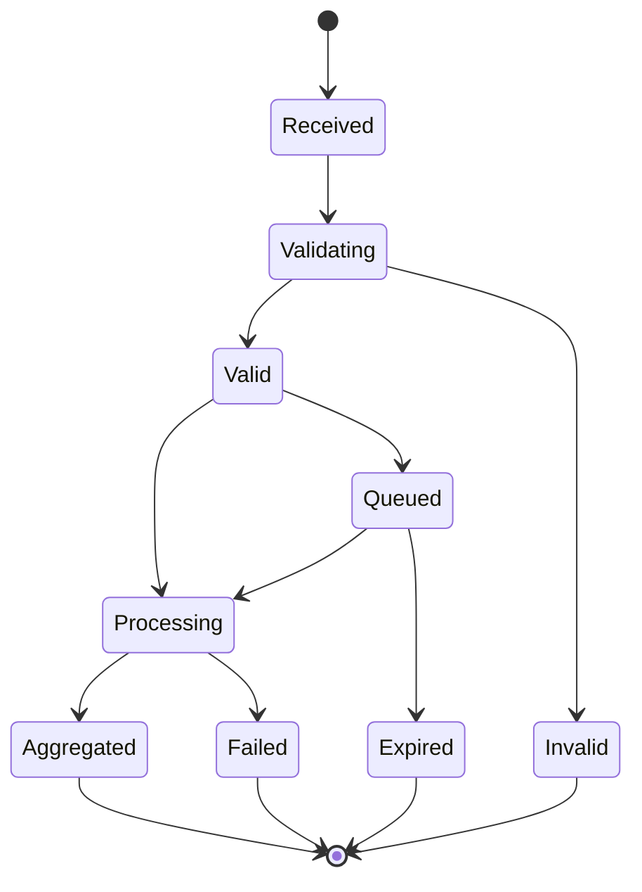
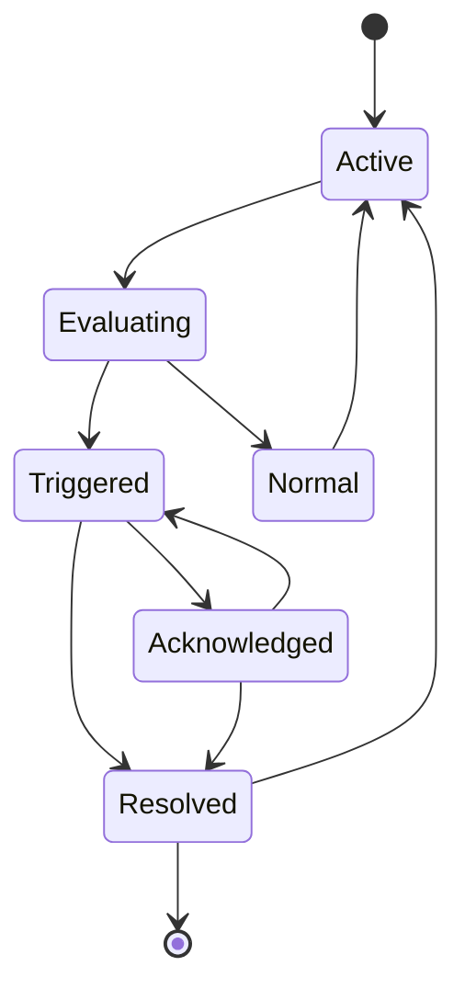

---
# Auto-generated front matter
Title: 12 Analyticsaggregator
LastUpdated: 2025-11-06T20:45:58.504367
Tags: []
Status: draft
---

# 12. Analytics Aggregator - Real-time Data Processing System

## Title & Summary

Design and implement a real-time analytics aggregator that processes streaming data, performs aggregations, and provides real-time dashboards with time-series data storage and querying.

## Problem Statement

Build an analytics aggregator that:

1. **Stream Processing**: Process real-time data streams from multiple sources
2. **Data Aggregation**: Perform time-based aggregations (sum, count, average, etc.)
3. **Time-Series Storage**: Store and query time-series data efficiently
4. **Real-time Dashboards**: Provide real-time analytics dashboards
5. **Data Validation**: Validate and clean incoming data
6. **Alerting**: Generate alerts based on data patterns and thresholds

## Requirements & Constraints

### Functional Requirements

- Process real-time data streams
- Perform time-based aggregations
- Store time-series data
- Provide real-time queries
- Generate alerts and notifications
- Support multiple data sources

### Non-Functional Requirements

- **Latency**: < 100ms for data processing
- **Consistency**: Eventually consistent aggregations
- **Memory**: Support 1M events per second
- **Scalability**: Handle 10TB+ data per day
- **Reliability**: 99.9% data processing success rate

## API / Interfaces

### REST Endpoints

```go
// Data Ingestion
POST   /api/events
POST   /api/events/batch
GET    /api/events/health

// Analytics Queries
GET    /api/analytics/query
GET    /api/analytics/metrics
GET    /api/analytics/dashboard

// Alerts
GET    /api/alerts
POST   /api/alerts
PUT    /api/alerts/{alertID}

// WebSocket
WS     /ws/analytics
```

### Request/Response Examples

```json
// Send Event
POST /api/events
{
  "eventType": "page_view",
  "userId": "user123",
  "timestamp": "2024-01-15T10:30:00Z",
  "properties": {
    "page": "/products",
    "category": "electronics",
    "value": 99.99
  }
}

// Analytics Query
GET /api/analytics/query?metric=page_views&start=2024-01-15T00:00:00Z&end=2024-01-15T23:59:59Z&granularity=1h
{
  "metric": "page_views",
  "data": [
    {
      "timestamp": "2024-01-15T00:00:00Z",
      "value": 1250
    },
    {
      "timestamp": "2024-01-15T01:00:00Z",
      "value": 1180
    }
  ]
}
```

## Data Model

### Core Entities

```go
type Event struct {
    ID          string                 `json:"id"`
    EventType   string                 `json:"eventType"`
    UserID      string                 `json:"userId"`
    Timestamp   time.Time              `json:"timestamp"`
    Properties  map[string]interface{} `json:"properties"`
    Source      string                 `json:"source"`
    CreatedAt   time.Time              `json:"createdAt"`
}

type Metric struct {
    Name        string    `json:"name"`
    Value       float64   `json:"value"`
    Timestamp   time.Time `json:"timestamp"`
    Dimensions  map[string]string `json:"dimensions"`
    Source      string    `json:"source"`
}

type Aggregation struct {
    Metric      string    `json:"metric"`
    Function    string    `json:"function"`
    Value       float64   `json:"value"`
    Timestamp   time.Time `json:"timestamp"`
    Granularity string    `json:"granularity"`
    Dimensions  map[string]string `json:"dimensions"`
}

type Alert struct {
    ID          string    `json:"id"`
    Name        string    `json:"name"`
    Metric      string    `json:"metric"`
    Condition   string    `json:"condition"`
    Threshold   float64   `json:"threshold"`
    Status      string    `json:"status"`
    CreatedAt   time.Time `json:"createdAt"`
    TriggeredAt *time.Time `json:"triggeredAt,omitempty"`
}
```

## State Machine

### Event Processing State Machine



### Alert State Machine



## Approach Overview

### Simple Solution (MVP)

1. In-memory event processing with basic aggregations
2. Simple time-series storage
3. Basic alerting mechanism
4. No real-time dashboards

### Production-Ready Design

1. **Stream Processing**: Apache Kafka for event streaming
2. **Time-Series Database**: InfluxDB or TimescaleDB for storage
3. **Real-time Processing**: Apache Flink or Apache Storm
4. **Dashboard**: Real-time WebSocket dashboards
5. **Alerting**: Rule-based alerting with notifications
6. **Scalability**: Horizontal scaling with data partitioning

## Detailed Design

### Modular Decomposition

```go
analyticsaggregator/
├── ingestion/     # Event ingestion
├── processing/    # Stream processing
├── storage/       # Time-series storage
├── aggregation/   # Data aggregation
├── query/         # Query engine
├── alerting/      # Alert system
└── dashboard/     # Real-time dashboards
```

### Concurrency Model

```go
type AnalyticsAggregator struct {
    events        map[string]*Event
    metrics       map[string][]*Metric
    aggregations  map[string][]*Aggregation
    alerts        map[string]*Alert
    mutex         sync.RWMutex
    eventChan     chan *Event
    metricChan    chan *Metric
    alertChan     chan AlertEvent
    queryChan     chan QueryRequest
}

// Goroutines for:
// 1. Event processing
// 2. Metric aggregation
// 3. Alert evaluation
// 4. Query processing
```

## Optimal Golang Implementation

```go
package main

import (
    "context"
    "encoding/json"
    "fmt"
    "log"
    "net/http"
    "sort"
    "sync"
    "time"

    "github.com/google/uuid"
    "github.com/gorilla/websocket"
)

type Event struct {
    ID          string                 `json:"id"`
    EventType   string                 `json:"eventType"`
    UserID      string                 `json:"userId"`
    Timestamp   time.Time              `json:"timestamp"`
    Properties  map[string]interface{} `json:"properties"`
    Source      string                 `json:"source"`
    CreatedAt   time.Time              `json:"createdAt"`
}

type Metric struct {
    Name        string            `json:"name"`
    Value       float64           `json:"value"`
    Timestamp   time.Time         `json:"timestamp"`
    Dimensions  map[string]string `json:"dimensions"`
    Source      string            `json:"source"`
}

type Aggregation struct {
    Metric      string            `json:"metric"`
    Function    string            `json:"function"`
    Value       float64           `json:"value"`
    Timestamp   time.Time         `json:"timestamp"`
    Granularity string            `json:"granularity"`
    Dimensions  map[string]string `json:"dimensions"`
}

type Alert struct {
    ID          string    `json:"id"`
    Name        string    `json:"name"`
    Metric      string    `json:"metric"`
    Condition   string    `json:"condition"`
    Threshold   float64   `json:"threshold"`
    Status      string    `json:"status"`
    CreatedAt   time.Time `json:"createdAt"`
    TriggeredAt *time.Time `json:"triggeredAt,omitempty"`
}

type AlertEvent struct {
    AlertID     string
    Metric      string
    Value       float64
    Threshold   float64
    Timestamp   time.Time
}

type QueryRequest struct {
    Metric      string
    StartTime   time.Time
    EndTime     time.Time
    Granularity string
    Dimensions  map[string]string
    Reply       chan QueryResponse
}

type QueryResponse struct {
    Data  []Aggregation
    Error error
}

type AnalyticsAggregator struct {
    events        map[string]*Event
    metrics       map[string][]*Metric
    aggregations  map[string][]*Aggregation
    alerts        map[string]*Alert
    connections   map[string]*websocket.Conn
    mutex         sync.RWMutex
    eventChan     chan *Event
    metricChan    chan *Metric
    alertChan     chan AlertEvent
    queryChan     chan QueryRequest
    upgrader      websocket.Upgrader
}

func NewAnalyticsAggregator() *AnalyticsAggregator {
    return &AnalyticsAggregator{
        events:       make(map[string]*Event),
        metrics:      make(map[string][]*Metric),
        aggregations: make(map[string][]*Aggregation),
        alerts:       make(map[string]*Alert),
        connections:  make(map[string]*websocket.Conn),
        eventChan:    make(chan *Event, 10000),
        metricChan:   make(chan *Metric, 10000),
        alertChan:    make(chan AlertEvent, 1000),
        queryChan:    make(chan QueryRequest, 1000),
        upgrader: websocket.Upgrader{
            CheckOrigin: func(r *http.Request) bool {
                return true
            },
        },
    }
}

func (aa *AnalyticsAggregator) IngestEvent(event *Event) error {
    // Validate event
    if err := aa.validateEvent(event); err != nil {
        return err
    }

    // Set event properties
    event.ID = uuid.New().String()
    event.CreatedAt = time.Now()

    // Store event
    aa.mutex.Lock()
    aa.events[event.ID] = event
    aa.mutex.Unlock()

    // Send to processing channel
    aa.eventChan <- event

    return nil
}

func (aa *AnalyticsAggregator) validateEvent(event *Event) error {
    if event.EventType == "" {
        return fmt.Errorf("event type required")
    }

    if event.Timestamp.IsZero() {
        return fmt.Errorf("timestamp required")
    }

    return nil
}

func (aa *AnalyticsAggregator) ProcessEvents() {
    for event := range aa.eventChan {
        // Extract metrics from event
        metrics := aa.extractMetrics(event)

        // Send metrics for aggregation
        for _, metric := range metrics {
            aa.metricChan <- metric
        }
    }
}

func (aa *AnalyticsAggregator) extractMetrics(event *Event) []*Metric {
    var metrics []*Metric

    // Extract basic metrics
    metrics = append(metrics, &Metric{
        Name:       fmt.Sprintf("%s_count", event.EventType),
        Value:      1,
        Timestamp:  event.Timestamp,
        Dimensions: map[string]string{"event_type": event.EventType},
        Source:     event.Source,
    })

    // Extract property-based metrics
    if value, ok := event.Properties["value"].(float64); ok {
        metrics = append(metrics, &Metric{
            Name:       fmt.Sprintf("%s_value", event.EventType),
            Value:      value,
            Timestamp:  event.Timestamp,
            Dimensions: map[string]string{"event_type": event.EventType},
            Source:     event.Source,
        })
    }

    // Extract dimension-based metrics
    for key, value := range event.Properties {
        if strValue, ok := value.(string); ok {
            metrics = append(metrics, &Metric{
                Name:       fmt.Sprintf("%s_%s", event.EventType, key),
                Value:      1,
                Timestamp:  event.Timestamp,
                Dimensions: map[string]string{key: strValue},
                Source:     event.Source,
            })
        }
    }

    return metrics
}

func (aa *AnalyticsAggregator) ProcessMetrics() {
    for metric := range aa.metricChan {
        // Store metric
        aa.mutex.Lock()
        aa.metrics[metric.Name] = append(aa.metrics[metric.Name], metric)
        aa.mutex.Unlock()

        // Perform real-time aggregation
        aa.performAggregation(metric)

        // Check alerts
        aa.checkAlerts(metric)
    }
}

func (aa *AnalyticsAggregator) performAggregation(metric *Metric) {
    // Perform different types of aggregations
    aggregations := []string{"sum", "count", "avg", "min", "max"}

    for _, aggType := range aggregations {
        aggregation := &Aggregation{
            Metric:      metric.Name,
            Function:    aggType,
            Value:       aa.calculateAggregation(metric.Name, aggType, metric.Timestamp),
            Timestamp:   metric.Timestamp.Truncate(time.Minute), // 1-minute granularity
            Granularity: "1m",
            Dimensions:  metric.Dimensions,
        }

        aa.mutex.Lock()
        key := fmt.Sprintf("%s_%s", metric.Name, aggType)
        aa.aggregations[key] = append(aa.aggregations[key], aggregation)
        aa.mutex.Unlock()
    }
}

func (aa *AnalyticsAggregator) calculateAggregation(metricName, function string, timestamp time.Time) float64 {
    aa.mutex.RLock()
    metrics, exists := aa.metrics[metricName]
    aa.mutex.RUnlock()

    if !exists || len(metrics) == 0 {
        return 0
    }

    // Filter metrics for the last hour
    cutoff := timestamp.Add(-time.Hour)
    var filteredMetrics []*Metric

    for _, metric := range metrics {
        if metric.Timestamp.After(cutoff) {
            filteredMetrics = append(filteredMetrics, metric)
        }
    }

    if len(filteredMetrics) == 0 {
        return 0
    }

    switch function {
    case "sum":
        sum := 0.0
        for _, metric := range filteredMetrics {
            sum += metric.Value
        }
        return sum
    case "count":
        return float64(len(filteredMetrics))
    case "avg":
        sum := 0.0
        for _, metric := range filteredMetrics {
            sum += metric.Value
        }
        return sum / float64(len(filteredMetrics))
    case "min":
        min := filteredMetrics[0].Value
        for _, metric := range filteredMetrics {
            if metric.Value < min {
                min = metric.Value
            }
        }
        return min
    case "max":
        max := filteredMetrics[0].Value
        for _, metric := range filteredMetrics {
            if metric.Value > max {
                max = metric.Value
            }
        }
        return max
    default:
        return 0
    }
}

func (aa *AnalyticsAggregator) checkAlerts(metric *Metric) {
    aa.mutex.RLock()
    defer aa.mutex.RUnlock()

    for _, alert := range aa.alerts {
        if alert.Metric == metric.Name && alert.Status == "active" {
            if aa.evaluateAlert(alert, metric.Value) {
                aa.alertChan <- AlertEvent{
                    AlertID:   alert.ID,
                    Metric:    metric.Name,
                    Value:     metric.Value,
                    Threshold: alert.Threshold,
                    Timestamp: time.Now(),
                }
            }
        }
    }
}

func (aa *AnalyticsAggregator) evaluateAlert(alert *Alert, value float64) bool {
    switch alert.Condition {
    case "greater_than":
        return value > alert.Threshold
    case "less_than":
        return value < alert.Threshold
    case "equals":
        return value == alert.Threshold
    default:
        return false
    }
}

func (aa *AnalyticsAggregator) CreateAlert(name, metric, condition string, threshold float64) (*Alert, error) {
    alert := &Alert{
        ID:        uuid.New().String(),
        Name:      name,
        Metric:    metric,
        Condition: condition,
        Threshold: threshold,
        Status:    "active",
        CreatedAt: time.Now(),
    }

    aa.mutex.Lock()
    aa.alerts[alert.ID] = alert
    aa.mutex.Unlock()

    return alert, nil
}

func (aa *AnalyticsAggregator) QueryAnalytics(metric, granularity string, startTime, endTime time.Time, dimensions map[string]string) ([]Aggregation, error) {
    reply := make(chan QueryResponse, 1)

    query := QueryRequest{
        Metric:      metric,
        StartTime:   startTime,
        EndTime:     endTime,
        Granularity: granularity,
        Dimensions:  dimensions,
        Reply:       reply,
    }

    aa.queryChan <- query

    response := <-reply
    return response.Data, response.Error
}

func (aa *AnalyticsAggregator) ProcessQueries() {
    for query := range aa.queryChan {
        aa.mutex.RLock()
        key := fmt.Sprintf("%s_%s", query.Metric, "sum") // Default to sum aggregation
        aggregations, exists := aa.aggregations[key]
        aa.mutex.RUnlock()

        if !exists {
            query.Reply <- QueryResponse{Data: []Aggregation{}, Error: nil}
            continue
        }

        // Filter aggregations by time range
        var filteredAggregations []Aggregation
        for _, agg := range aggregations {
            if agg.Timestamp.After(query.StartTime) && agg.Timestamp.Before(query.EndTime) {
                // Filter by dimensions if specified
                if aa.matchesDimensions(agg.Dimensions, query.Dimensions) {
                    filteredAggregations = append(filteredAggregations, *agg)
                }
            }
        }

        // Sort by timestamp
        sort.Slice(filteredAggregations, func(i, j int) bool {
            return filteredAggregations[i].Timestamp.Before(filteredAggregations[j].Timestamp)
        })

        query.Reply <- QueryResponse{Data: filteredAggregations, Error: nil}
    }
}

func (aa *AnalyticsAggregator) matchesDimensions(aggDims, queryDims map[string]string) bool {
    for key, value := range queryDims {
        if aggDims[key] != value {
            return false
        }
    }
    return true
}

func (aa *AnalyticsAggregator) ProcessAlerts() {
    for alertEvent := range aa.alertChan {
        aa.mutex.Lock()
        alert, exists := aa.alerts[alertEvent.AlertID]
        if exists {
            alert.Status = "triggered"
            now := time.Now()
            alert.TriggeredAt = &now
        }
        aa.mutex.Unlock()

        // Broadcast alert to WebSocket connections
        aa.broadcastAlert(alertEvent)

        log.Printf("Alert triggered: %s - %s: %.2f (threshold: %.2f)",
            alertEvent.AlertID, alertEvent.Metric, alertEvent.Value, alertEvent.Threshold)
    }
}

func (aa *AnalyticsAggregator) broadcastAlert(alertEvent AlertEvent) {
    aa.mutex.RLock()
    defer aa.mutex.RUnlock()

    for _, conn := range aa.connections {
        conn.WriteJSON(map[string]interface{}{
            "type": "alert",
            "data": alertEvent,
        })
    }
}

func (aa *AnalyticsAggregator) HandleWebSocket(w http.ResponseWriter, r *http.Request) {
    conn, err := aa.upgrader.Upgrade(w, r, nil)
    if err != nil {
        log.Printf("WebSocket upgrade failed: %v", err)
        return
    }
    defer conn.Close()

    connectionID := uuid.New().String()
    aa.mutex.Lock()
    aa.connections[connectionID] = conn
    aa.mutex.Unlock()

    defer func() {
        aa.mutex.Lock()
        delete(aa.connections, connectionID)
        aa.mutex.Unlock()
    }()

    // Keep connection alive and send periodic updates
    ticker := time.NewTicker(5 * time.Second)
    defer ticker.Stop()

    for {
        select {
        case <-ticker.C:
            // Send current metrics
            aa.mutex.RLock()
            metrics := make(map[string]float64)
            for name, metricList := range aa.metrics {
                if len(metricList) > 0 {
                    metrics[name] = metricList[len(metricList)-1].Value
                }
            }
            aa.mutex.RUnlock()

            conn.WriteJSON(map[string]interface{}{
                "type": "metrics",
                "data": metrics,
            })
        }
    }
}

// HTTP Handlers
func (aa *AnalyticsAggregator) IngestEventHandler(w http.ResponseWriter, r *http.Request) {
    if r.Method != http.MethodPost {
        http.Error(w, "Method not allowed", http.StatusMethodNotAllowed)
        return
    }

    var event Event
    if err := json.NewDecoder(r.Body).Decode(&event); err != nil {
        http.Error(w, "Invalid request", http.StatusBadRequest)
        return
    }

    if err := aa.IngestEvent(&event); err != nil {
        http.Error(w, err.Error(), http.StatusBadRequest)
        return
    }

    w.WriteHeader(http.StatusOK)
}

func (aa *AnalyticsAggregator) QueryHandler(w http.ResponseWriter, r *http.Request) {
    if r.Method != http.MethodGet {
        http.Error(w, "Method not allowed", http.StatusMethodNotAllowed)
        return
    }

    metric := r.URL.Query().Get("metric")
    granularity := r.URL.Query().Get("granularity")
    startTimeStr := r.URL.Query().Get("start")
    endTimeStr := r.URL.Query().Get("end")

    if metric == "" || startTimeStr == "" || endTimeStr == "" {
        http.Error(w, "metric, start, and end parameters required", http.StatusBadRequest)
        return
    }

    startTime, err := time.Parse(time.RFC3339, startTimeStr)
    if err != nil {
        http.Error(w, "Invalid start time", http.StatusBadRequest)
        return
    }

    endTime, err := time.Parse(time.RFC3339, endTimeStr)
    if err != nil {
        http.Error(w, "Invalid end time", http.StatusBadRequest)
        return
    }

    if granularity == "" {
        granularity = "1h"
    }

    data, err := aa.QueryAnalytics(metric, granularity, startTime, endTime, nil)
    if err != nil {
        http.Error(w, err.Error(), http.StatusInternalServerError)
        return
    }

    w.Header().Set("Content-Type", "application/json")
    json.NewEncoder(w).Encode(map[string]interface{}{
        "metric": metric,
        "data":   data,
    })
}

func (aa *AnalyticsAggregator) CreateAlertHandler(w http.ResponseWriter, r *http.Request) {
    if r.Method != http.MethodPost {
        http.Error(w, "Method not allowed", http.StatusMethodNotAllowed)
        return
    }

    var req struct {
        Name      string  `json:"name"`
        Metric    string  `json:"metric"`
        Condition string  `json:"condition"`
        Threshold float64 `json:"threshold"`
    }

    if err := json.NewDecoder(r.Body).Decode(&req); err != nil {
        http.Error(w, "Invalid request", http.StatusBadRequest)
        return
    }

    alert, err := aa.CreateAlert(req.Name, req.Metric, req.Condition, req.Threshold)
    if err != nil {
        http.Error(w, err.Error(), http.StatusBadRequest)
        return
    }

    w.Header().Set("Content-Type", "application/json")
    json.NewEncoder(w).Encode(alert)
}

func main() {
    aggregator := NewAnalyticsAggregator()

    // Start background workers
    go aggregator.ProcessEvents()
    go aggregator.ProcessMetrics()
    go aggregator.ProcessQueries()
    go aggregator.ProcessAlerts()

    // Create sample alert
    aggregator.CreateAlert("High Page Views", "page_view_count", "greater_than", 1000)

    // HTTP routes
    http.HandleFunc("/api/events", aggregator.IngestEventHandler)
    http.HandleFunc("/api/analytics/query", aggregator.QueryHandler)
    http.HandleFunc("/api/alerts", aggregator.CreateAlertHandler)
    http.HandleFunc("/ws/analytics", aggregator.HandleWebSocket)

    log.Println("Analytics aggregator starting on :8080")
    log.Fatal(http.ListenAndServe(":8080", nil))
}
```

## Unit Tests

```go
func TestAnalyticsAggregator_IngestEvent(t *testing.T) {
    aggregator := NewAnalyticsAggregator()

    event := &Event{
        EventType:  "page_view",
        UserID:     "user123",
        Timestamp:  time.Now(),
        Properties: map[string]interface{}{
            "page": "/products",
            "value": 99.99,
        },
        Source: "web",
    }

    err := aggregator.IngestEvent(event)
    if err != nil {
        t.Fatalf("IngestEvent() error = %v", err)
    }

    if event.ID == "" {
        t.Error("Event ID should not be empty")
    }
}

func TestAnalyticsAggregator_QueryAnalytics(t *testing.T) {
    aggregator := NewAnalyticsAggregator()

    // Ingest some events
    for i := 0; i < 10; i++ {
        event := &Event{
            EventType: "page_view",
            UserID:    "user123",
            Timestamp: time.Now().Add(-time.Duration(i) * time.Minute),
            Properties: map[string]interface{}{
                "page": "/products",
            },
            Source: "web",
        }
        aggregator.IngestEvent(event)
    }

    // Wait for processing
    time.Sleep(100 * time.Millisecond)

    // Query analytics
    startTime := time.Now().Add(-time.Hour)
    endTime := time.Now()

    data, err := aggregator.QueryAnalytics("page_view_count", "1m", startTime, endTime, nil)
    if err != nil {
        t.Fatalf("QueryAnalytics() error = %v", err)
    }

    if len(data) == 0 {
        t.Error("Expected some aggregation data")
    }
}

func TestAnalyticsAggregator_Alert(t *testing.T) {
    aggregator := NewAnalyticsAggregator()

    // Create alert
    alert, err := aggregator.CreateAlert("Test Alert", "page_view_count", "greater_than", 5)
    if err != nil {
        t.Fatalf("CreateAlert() error = %v", err)
    }

    if alert.Name != "Test Alert" {
        t.Errorf("Expected alert name 'Test Alert', got %s", alert.Name)
    }

    // Ingest events to trigger alert
    for i := 0; i < 10; i++ {
        event := &Event{
            EventType: "page_view",
            UserID:    "user123",
            Timestamp: time.Now(),
            Properties: map[string]interface{}{
                "page": "/products",
            },
            Source: "web",
        }
        aggregator.IngestEvent(event)
    }

    // Wait for processing
    time.Sleep(100 * time.Millisecond)

    // Check if alert was triggered
    aggregator.mutex.RLock()
    updatedAlert, exists := aggregator.alerts[alert.ID]
    aggregator.mutex.RUnlock()

    if !exists {
        t.Error("Alert should exist")
    }

    if updatedAlert.Status != "triggered" {
        t.Errorf("Expected alert status 'triggered', got %s", updatedAlert.Status)
    }
}
```

## Complexity Analysis

### Time Complexity

- **Ingest Event**: O(1) - Hash map operations
- **Process Event**: O(P) - Linear scan through properties
- **Calculate Aggregation**: O(M) - Linear scan through metrics
- **Query Analytics**: O(A) - Linear scan through aggregations

### Space Complexity

- **Event Storage**: O(E) where E is number of events
- **Metric Storage**: O(M) where M is number of metrics
- **Aggregation Storage**: O(A) where A is number of aggregations
- **Alert Storage**: O(AL) where AL is number of alerts
- **Total**: O(E + M + A + AL)

## Edge Cases & Validation

### Input Validation

- Invalid event types
- Missing required fields
- Invalid timestamps
- Malformed properties
- Invalid alert conditions

### Error Scenarios

- Event processing failures
- Aggregation calculation errors
- Alert evaluation failures
- Query timeout handling
- WebSocket connection failures

### Boundary Conditions

- Maximum event size limits
- Time range boundaries
- Aggregation granularity limits
- Alert threshold boundaries
- Memory usage limits

## Extension Ideas (Scaling)

### Horizontal Scaling

1. **Load Balancing**: Multiple aggregator instances
2. **Data Partitioning**: Partition by time or metric
3. **Message Queue**: Kafka for event streaming
4. **Database Sharding**: Distribute time-series data

### Performance Optimization

1. **Stream Processing**: Apache Flink or Apache Storm
2. **Time-Series Database**: InfluxDB or TimescaleDB
3. **Caching**: Redis for frequently accessed data
4. **Compression**: Data compression for storage

### Advanced Features

1. **Machine Learning**: Anomaly detection and prediction
2. **Real-time Dashboards**: Interactive analytics dashboards
3. **Data Pipeline**: ETL pipelines for data processing
4. **Compliance**: Data retention and privacy compliance

## 20 Follow-up Questions

### 1. How would you handle data retention and archival?

**Answer**: Implement time-based data retention policies. Use data archival to cold storage. Implement data lifecycle management. Consider using data compression for long-term storage.

### 2. What's your strategy for handling data quality issues?

**Answer**: Implement data validation and cleansing pipelines. Use data quality metrics and monitoring. Implement data lineage tracking. Consider using data quality frameworks.

### 3. How do you ensure data consistency across distributed systems?

**Answer**: Implement eventual consistency with conflict resolution. Use distributed consensus algorithms. Implement data replication strategies. Consider using distributed databases.

### 4. What's your approach to handling real-time data processing?

**Answer**: Implement stream processing with Apache Kafka. Use windowing for time-based aggregations. Implement backpressure handling. Consider using stream processing frameworks.

### 5. How would you implement data privacy and compliance?

**Answer**: Implement data anonymization and pseudonymization. Use encryption for sensitive data. Implement access controls and audit trails. Consider using privacy-preserving techniques.

### 6. What's your strategy for handling data schema evolution?

**Answer**: Implement schema registry for data validation. Use versioned schemas for backward compatibility. Implement schema migration strategies. Consider using schema evolution tools.

### 7. How do you handle data deduplication?

**Answer**: Implement content-based deduplication. Use distributed hashing for duplicate detection. Implement reference counting for shared data. Consider using content-addressed storage.

### 8. What's your approach to handling data compression?

**Answer**: Implement data compression algorithms. Use different compression for different data types. Implement compression ratio optimization. Consider using adaptive compression.

### 9. How would you implement data backup and recovery?

**Answer**: Implement automated data backup. Use multiple backup locations. Implement backup verification and testing. Consider using cloud backup services.

### 10. What's your strategy for handling data migration?

**Answer**: Implement data migration tools. Use data validation during migration. Implement rollback mechanisms. Consider using migration orchestration.

### 11. How do you handle data security?

**Answer**: Implement encryption for data at rest and in transit. Use access controls and authentication. Implement security monitoring. Consider using security frameworks.

### 12. What's your approach to handling data performance optimization?

**Answer**: Implement data indexing and partitioning. Use caching for frequently accessed data. Implement query optimization. Consider using performance monitoring tools.

### 13. How would you implement data analytics and reporting?

**Answer**: Implement data warehouse for analytics. Use business intelligence tools. Implement automated reporting. Consider using analytics platforms.

### 14. What's your strategy for handling data integration?

**Answer**: Implement API-based data integration. Use message queues for data synchronization. Implement data transformation. Consider using integration platforms.

### 15. How do you handle data versioning?

**Answer**: Implement data versioning strategies. Use versioned storage for data history. Implement version comparison and diff. Consider using version control systems.

### 16. What's your approach to handling data testing?

**Answer**: Implement data testing frameworks. Use mock data for testing. Implement data validation testing. Consider using data testing tools.

### 17. How would you implement data monitoring?

**Answer**: Implement data quality monitoring. Use metrics and alerting for data issues. Implement data lineage monitoring. Consider using monitoring tools.

### 18. What's your strategy for handling data governance?

**Answer**: Implement data governance frameworks. Use data catalog for data discovery. Implement data stewardship. Consider using governance tools.

### 19. How do you handle data compliance?

**Answer**: Implement compliance monitoring. Use audit trails for compliance. Implement regulatory reporting. Consider using compliance management tools.

### 20. What's your approach to handling data disaster recovery?

**Answer**: Implement disaster recovery procedures. Use data replication across regions. Implement automated failover. Consider using disaster recovery services.

## Evaluation Checklist

### Code Quality (25%)

- [ ] Clean, readable Go code with proper error handling
- [ ] Appropriate use of interfaces and structs
- [ ] Proper concurrency patterns (goroutines, channels)
- [ ] Good separation of concerns

### Architecture (25%)

- [ ] Scalable design with stream processing
- [ ] Proper time-series data handling
- [ ] Efficient aggregation algorithms
- [ ] Comprehensive alerting system

### Functionality (25%)

- [ ] Event ingestion working
- [ ] Real-time aggregation functional
- [ ] Query engine implemented
- [ ] Alert system working

### Testing (15%)

- [ ] Unit tests for core functionality
- [ ] Integration tests for API endpoints
- [ ] Edge case testing
- [ ] Performance testing

### Discussion (10%)

- [ ] Clear explanation of design decisions
- [ ] Understanding of analytics systems
- [ ] Knowledge of time-series data
- [ ] Ability to discuss trade-offs

## Discussion Pointers

### Key Points to Highlight

1. **Stream Processing**: Explain the real-time event processing and aggregation
2. **Time-Series Data**: Discuss the time-series data storage and querying
3. **Alert System**: Explain the rule-based alerting with real-time evaluation
4. **WebSocket Integration**: Discuss the real-time dashboard updates
5. **Data Aggregation**: Explain the different aggregation functions and granularities

### Trade-offs to Discuss

1. **Latency vs Throughput**: Low latency vs high throughput trade-offs
2. **Consistency vs Availability**: Strong consistency vs high availability trade-offs
3. **Storage vs Computation**: Storage cost vs computation cost trade-offs
4. **Accuracy vs Performance**: Data accuracy vs processing performance trade-offs
5. **Real-time vs Batch**: Real-time processing vs batch processing trade-offs

### Extension Scenarios

1. **Multi-region Deployment**: How to handle geographic distribution
2. **Advanced Analytics**: Machine learning and predictive analytics
3. **Real-time Dashboards**: Interactive analytics and visualization
4. **Compliance Integration**: Regulatory compliance and data governance
5. **Enterprise Features**: Multi-tenant and white-label solutions
