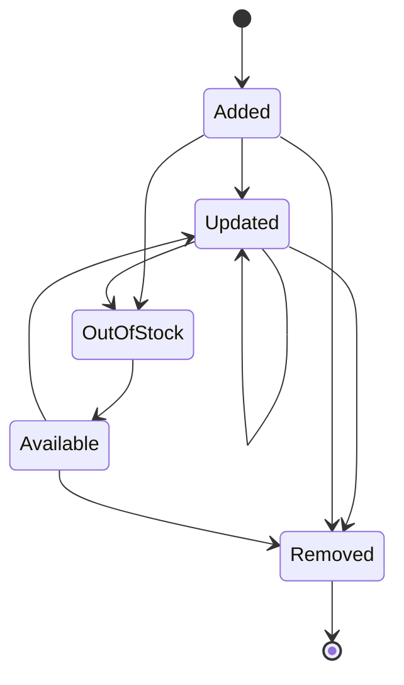
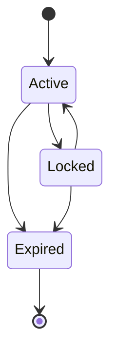

# 13. Shopping Cart - E-commerce Cart Management System

## Title & Summary
Design and implement a shopping cart system that manages user cart state, handles concurrent modifications, supports cart persistence, and provides real-time cart synchronization across multiple devices.

## Problem Statement

Build a shopping cart system that:

1. **Cart Management**: Add, remove, and update items in cart
2. **Concurrent Access**: Handle multiple users modifying the same cart
3. **Cart Persistence**: Save and restore cart state across sessions
4. **Real-time Sync**: Synchronize cart changes across devices
5. **Inventory Integration**: Check product availability and pricing
6. **Cart Expiration**: Handle cart timeout and cleanup

## Requirements & Constraints

### Functional Requirements
- Add/remove/update cart items
- Handle concurrent cart modifications
- Persist cart state across sessions
- Real-time cart synchronization
- Inventory and pricing validation
- Cart expiration management

### Non-Functional Requirements
- **Latency**: < 50ms for cart operations
- **Consistency**: Strong consistency for cart state
- **Scalability**: Support 100K concurrent users
- **Reliability**: 99.9% cart operation success rate
- **Memory**: Efficient memory usage for cart storage

## API / Interfaces

### REST Endpoints

```go
// Cart Operations
GET    /api/cart/{userID}
POST   /api/cart/{userID}/items
PUT    /api/cart/{userID}/items/{itemID}
DELETE /api/cart/{userID}/items/{itemID}
POST   /api/cart/{userID}/clear

// Cart State
GET    /api/cart/{userID}/state
POST   /api/cart/{userID}/merge
GET    /api/cart/{userID}/expiry

// WebSocket
WS     /ws/cart/{userID}
```

### Request/Response Examples

```json
// Add Item to Cart
POST /api/cart/user123/items
{
  "productID": "prod_456",
  "quantity": 2,
  "variant": "large-red"
}

// Cart Response
GET /api/cart/user123
{
  "userID": "user123",
  "items": [
    {
      "itemID": "item_789",
      "productID": "prod_456",
      "name": "T-Shirt",
      "price": 29.99,
      "quantity": 2,
      "variant": "large-red",
      "addedAt": "2024-01-15T10:30:00Z"
    }
  ],
  "total": 59.98,
  "itemCount": 2,
  "lastModified": "2024-01-15T10:30:00Z",
  "expiresAt": "2024-01-16T10:30:00Z"
}
```

## Data Model

### Core Entities

```go
type Cart struct {
    UserID        string    `json:"userID"`
    Items         []CartItem `json:"items"`
    Total         float64   `json:"total"`
    ItemCount     int       `json:"itemCount"`
    LastModified  time.Time `json:"lastModified"`
    ExpiresAt     time.Time `json:"expiresAt"`
    Version       int       `json:"version"`
    Locked        bool      `json:"locked"`
}

type CartItem struct {
    ItemID        string    `json:"itemID"`
    ProductID     string    `json:"productID"`
    Name          string    `json:"name"`
    Price         float64   `json:"price"`
    Quantity      int       `json:"quantity"`
    Variant       string    `json:"variant"`
    AddedAt       time.Time `json:"addedAt"`
    LastModified  time.Time `json:"lastModified"`
}

type Product struct {
    ID          string  `json:"id"`
    Name        string  `json:"name"`
    Price       float64 `json:"price"`
    Stock       int     `json:"stock"`
    Variants    []Variant `json:"variants"`
    Available   bool    `json:"available"`
}

type Variant struct {
    ID      string `json:"id"`
    Name    string `json:"name"`
    Price   float64 `json:"price"`
    Stock   int    `json:"stock"`
}

type CartEvent struct {
    Type      string    `json:"type"`
    UserID    string    `json:"userID"`
    ItemID    string    `json:"itemID,omitempty"`
    ProductID string    `json:"productID,omitempty"`
    Quantity  int       `json:"quantity,omitempty"`
    Timestamp time.Time `json:"timestamp"`
}
```

## State Machine

### Cart Item State Machine



### Cart State Machine



## Approach Overview

### Simple Solution (MVP)
1. In-memory cart storage with basic operations
2. Simple locking mechanism for concurrency
3. Basic cart persistence
4. No real-time synchronization

### Production-Ready Design
1. **Distributed Locking**: Redis-based distributed locks
2. **Event Sourcing**: Cart events for audit and replay
3. **Real-time Sync**: WebSocket-based cart synchronization
4. **Inventory Service**: Integration with product catalog
5. **Cart Analytics**: Cart abandonment and conversion tracking
6. **Multi-region**: Cross-region cart replication

## Detailed Design

### Modular Decomposition

```go
shoppingcart/
├── cart/         # Cart management
├── items/        # Item operations
├── inventory/    # Inventory integration
├── events/       # Event handling
├── sync/         # Real-time sync
├── persistence/  # Cart storage
└── analytics/    # Cart analytics
```

### Concurrency Model

```go
type ShoppingCart struct {
    carts        map[string]*Cart
    products     map[string]*Product
    locks        map[string]*sync.RWMutex
    events       chan CartEvent
    subscribers  map[string][]chan CartEvent
    mutex        sync.RWMutex
    redisClient  *redis.Client
}

// Concurrency handling:
// 1. Per-cart mutex for local operations
// 2. Redis distributed locks for cross-instance
// 3. Event-driven architecture for real-time sync
```

## Optimal Golang Implementation

```go
package main

import (
    "context"
    "encoding/json"
    "fmt"
    "log"
    "net/http"
    "sync"
    "time"

    "github.com/google/uuid"
    "github.com/gorilla/websocket"
    "github.com/go-redis/redis/v8"
)

type Cart struct {
    UserID        string     `json:"userID"`
    Items         []CartItem `json:"items"`
    Total         float64    `json:"total"`
    ItemCount     int        `json:"itemCount"`
    LastModified  time.Time  `json:"lastModified"`
    ExpiresAt     time.Time  `json:"expiresAt"`
    Version       int        `json:"version"`
    Locked        bool       `json:"locked"`
}

type CartItem struct {
    ItemID        string    `json:"itemID"`
    ProductID     string    `json:"productID"`
    Name          string    `json:"name"`
    Price         float64   `json:"price"`
    Quantity      int       `json:"quantity"`
    Variant       string    `json:"variant"`
    AddedAt       time.Time `json:"addedAt"`
    LastModified  time.Time `json:"lastModified"`
}

type Product struct {
    ID          string    `json:"id"`
    Name        string    `json:"name"`
    Price       float64   `json:"price"`
    Stock       int       `json:"stock"`
    Variants    []Variant `json:"variants"`
    Available   bool      `json:"available"`
}

type Variant struct {
    ID      string  `json:"id"`
    Name    string  `json:"name"`
    Price   float64 `json:"price"`
    Stock   int     `json:"stock"`
}

type CartEvent struct {
    Type      string    `json:"type"`
    UserID    string    `json:"userID"`
    ItemID    string    `json:"itemID,omitempty"`
    ProductID string    `json:"productID,omitempty"`
    Quantity  int       `json:"quantity,omitempty"`
    Timestamp time.Time `json:"timestamp"`
}

type ShoppingCart struct {
    carts        map[string]*Cart
    products     map[string]*Product
    locks        map[string]*sync.RWMutex
    events       chan CartEvent
    subscribers  map[string][]chan CartEvent
    mutex        sync.RWMutex
    redisClient  *redis.Client
    upgrader     websocket.Upgrader
}

func NewShoppingCart() *ShoppingCart {
    return &ShoppingCart{
        carts:       make(map[string]*Cart),
        products:    make(map[string]*Product),
        locks:       make(map[string]*sync.RWMutex),
        events:      make(chan CartEvent, 10000),
        subscribers: make(map[string][]chan CartEvent),
        upgrader: websocket.Upgrader{
            CheckOrigin: func(r *http.Request) bool {
                return true
            },
        },
    }
}

func (sc *ShoppingCart) GetCart(userID string) (*Cart, error) {
    sc.mutex.RLock()
    lock, exists := sc.locks[userID]
    sc.mutex.RUnlock()
    
    if !exists {
        sc.mutex.Lock()
        lock = &sync.RWMutex{}
        sc.locks[userID] = lock
        sc.mutex.Unlock()
    }
    
    lock.RLock()
    defer lock.RUnlock()
    
    cart, exists := sc.carts[userID]
    if !exists {
        cart = &Cart{
            UserID:       userID,
            Items:        []CartItem{},
            Total:        0,
            ItemCount:    0,
            LastModified: time.Now(),
            ExpiresAt:    time.Now().Add(24 * time.Hour),
            Version:      0,
            Locked:       false,
        }
        sc.carts[userID] = cart
    }
    
    // Check if cart has expired
    if time.Now().After(cart.ExpiresAt) {
        sc.clearExpiredCart(userID)
        return &Cart{
            UserID:       userID,
            Items:        []CartItem{},
            Total:        0,
            ItemCount:    0,
            LastModified: time.Now(),
            ExpiresAt:    time.Now().Add(24 * time.Hour),
            Version:      0,
            Locked:       false,
        }, nil
    }
    
    return cart, nil
}

func (sc *ShoppingCart) AddItem(userID, productID string, quantity int, variant string) error {
    // Get distributed lock
    lockKey := fmt.Sprintf("cart_lock:%s", userID)
    lock, err := sc.acquireLock(lockKey, 5*time.Second)
    if err != nil {
        return fmt.Errorf("failed to acquire lock: %v", err)
    }
    defer sc.releaseLock(lockKey, lock)
    
    // Get product information
    product, exists := sc.products[productID]
    if !exists {
        return fmt.Errorf("product not found: %s", productID)
    }
    
    if !product.Available {
        return fmt.Errorf("product not available: %s", productID)
    }
    
    // Check variant stock
    variantPrice := product.Price
    variantStock := product.Stock
    if variant != "" {
        for _, v := range product.Variants {
            if v.ID == variant {
                variantPrice = v.Price
                variantStock = v.Stock
                break
            }
        }
    }
    
    if variantStock < quantity {
        return fmt.Errorf("insufficient stock: requested %d, available %d", quantity, variantStock)
    }
    
    // Get or create cart
    cart, err := sc.GetCart(userID)
    if err != nil {
        return err
    }
    
    // Check if item already exists
    for i, item := range cart.Items {
        if item.ProductID == productID && item.Variant == variant {
            // Update existing item
            cart.Items[i].Quantity += quantity
            cart.Items[i].LastModified = time.Now()
            cart.Version++
            cart.LastModified = time.Now()
            sc.calculateCartTotal(cart)
            
            // Emit event
            sc.events <- CartEvent{
                Type:      "item_updated",
                UserID:    userID,
                ItemID:    item.ItemID,
                ProductID: productID,
                Quantity:  cart.Items[i].Quantity,
                Timestamp: time.Now(),
            }
            
            return nil
        }
    }
    
    // Add new item
    newItem := CartItem{
        ItemID:       uuid.New().String(),
        ProductID:    productID,
        Name:         product.Name,
        Price:        variantPrice,
        Quantity:     quantity,
        Variant:      variant,
        AddedAt:      time.Now(),
        LastModified: time.Now(),
    }
    
    cart.Items = append(cart.Items, newItem)
    cart.Version++
    cart.LastModified = time.Now()
    sc.calculateCartTotal(cart)
    
    // Emit event
    sc.events <- CartEvent{
        Type:      "item_added",
        UserID:    userID,
        ItemID:    newItem.ItemID,
        ProductID: productID,
        Quantity:  quantity,
        Timestamp: time.Now(),
    }
    
    return nil
}

func (sc *ShoppingCart) UpdateItem(userID, itemID string, quantity int) error {
    // Get distributed lock
    lockKey := fmt.Sprintf("cart_lock:%s", userID)
    lock, err := sc.acquireLock(lockKey, 5*time.Second)
    if err != nil {
        return fmt.Errorf("failed to acquire lock: %v", err)
    }
    defer sc.releaseLock(lockKey, lock)
    
    cart, err := sc.GetCart(userID)
    if err != nil {
        return err
    }
    
    // Find and update item
    for i, item := range cart.Items {
        if item.ItemID == itemID {
            if quantity <= 0 {
                // Remove item
                cart.Items = append(cart.Items[:i], cart.Items[i+1:]...)
                sc.events <- CartEvent{
                    Type:      "item_removed",
                    UserID:    userID,
                    ItemID:    itemID,
                    ProductID: item.ProductID,
                    Timestamp: time.Now(),
                }
            } else {
                // Update quantity
                cart.Items[i].Quantity = quantity
                cart.Items[i].LastModified = time.Now()
                sc.events <- CartEvent{
                    Type:      "item_updated",
                    UserID:    userID,
                    ItemID:    itemID,
                    ProductID: item.ProductID,
                    Quantity:  quantity,
                    Timestamp: time.Now(),
                }
            }
            
            cart.Version++
            cart.LastModified = time.Now()
            sc.calculateCartTotal(cart)
            return nil
        }
    }
    
    return fmt.Errorf("item not found: %s", itemID)
}

func (sc *ShoppingCart) RemoveItem(userID, itemID string) error {
    return sc.UpdateItem(userID, itemID, 0)
}

func (sc *ShoppingCart) ClearCart(userID string) error {
    // Get distributed lock
    lockKey := fmt.Sprintf("cart_lock:%s", userID)
    lock, err := sc.acquireLock(lockKey, 5*time.Second)
    if err != nil {
        return fmt.Errorf("failed to acquire lock: %v", err)
    }
    defer sc.releaseLock(lockKey, lock)
    
    cart, err := sc.GetCart(userID)
    if err != nil {
        return err
    }
    
    cart.Items = []CartItem{}
    cart.Total = 0
    cart.ItemCount = 0
    cart.Version++
    cart.LastModified = time.Now()
    
    // Emit event
    sc.events <- CartEvent{
        Type:      "cart_cleared",
        UserID:    userID,
        Timestamp: time.Now(),
    }
    
    return nil
}

func (sc *ShoppingCart) calculateCartTotal(cart *Cart) {
    total := 0.0
    itemCount := 0
    
    for _, item := range cart.Items {
        total += item.Price * float64(item.Quantity)
        itemCount += item.Quantity
    }
    
    cart.Total = total
    cart.ItemCount = itemCount
}

func (sc *ShoppingCart) clearExpiredCart(userID string) {
    sc.mutex.Lock()
    delete(sc.carts, userID)
    sc.mutex.Unlock()
}

func (sc *ShoppingCart) acquireLock(key string, timeout time.Duration) (string, error) {
    if sc.redisClient != nil {
        // Use Redis distributed lock
        lockValue := uuid.New().String()
        result := sc.redisClient.SetNX(context.Background(), key, lockValue, timeout)
        if result.Err() != nil {
            return "", result.Err()
        }
        if result.Val() {
            return lockValue, nil
        }
        return "", fmt.Errorf("failed to acquire lock")
    }
    
    // Fallback to local mutex
    sc.mutex.Lock()
    lock, exists := sc.locks[key]
    if !exists {
        lock = &sync.RWMutex{}
        sc.locks[key] = lock
    }
    sc.mutex.Unlock()
    
    lock.Lock()
    return "local", nil
}

func (sc *ShoppingCart) releaseLock(key, lockValue string) {
    if sc.redisClient != nil {
        // Use Redis distributed lock
        script := `
            if redis.call("get", KEYS[1]) == ARGV[1] then
                return redis.call("del", KEYS[1])
            else
                return 0
            end
        `
        sc.redisClient.Eval(context.Background(), script, []string{key}, lockValue)
    } else {
        // Fallback to local mutex
        sc.mutex.RLock()
        lock, exists := sc.locks[key]
        sc.mutex.RUnlock()
        
        if exists {
            lock.Unlock()
        }
    }
}

func (sc *ShoppingCart) ProcessEvents() {
    for event := range sc.events {
        // Broadcast to WebSocket subscribers
        sc.mutex.RLock()
        subscribers, exists := sc.subscribers[event.UserID]
        sc.mutex.RUnlock()
        
        if exists {
            for _, subscriber := range subscribers {
                select {
                case subscriber <- event:
                default:
                    // Subscriber channel is full, skip
                }
            }
        }
        
        log.Printf("Cart event: %s for user %s", event.Type, event.UserID)
    }
}

func (sc *ShoppingCart) HandleWebSocket(w http.ResponseWriter, r *http.Request) {
    userID := r.URL.Path[len("/ws/cart/"):]
    if userID == "" {
        http.Error(w, "User ID required", http.StatusBadRequest)
        return
    }
    
    conn, err := sc.upgrader.Upgrade(w, r, nil)
    if err != nil {
        log.Printf("WebSocket upgrade failed: %v", err)
        return
    }
    defer conn.Close()
    
    // Create subscriber channel
    subscriber := make(chan CartEvent, 100)
    
    sc.mutex.Lock()
    sc.subscribers[userID] = append(sc.subscribers[userID], subscriber)
    sc.mutex.Unlock()
    
    defer func() {
        sc.mutex.Lock()
        subscribers := sc.subscribers[userID]
        for i, sub := range subscribers {
            if sub == subscriber {
                sc.subscribers[userID] = append(subscribers[:i], subscribers[i+1:]...)
                break
            }
        }
        sc.mutex.Unlock()
        close(subscriber)
    }()
    
    // Send initial cart state
    cart, err := sc.GetCart(userID)
    if err == nil {
        conn.WriteJSON(map[string]interface{}{
            "type": "cart_state",
            "data": cart,
        })
    }
    
    // Handle incoming messages and send events
    go func() {
        for {
            _, _, err := conn.ReadMessage()
            if err != nil {
                break
            }
        }
    }()
    
    // Send cart events
    for event := range subscriber {
        if err := conn.WriteJSON(map[string]interface{}{
            "type": "cart_event",
            "data": event,
        }); err != nil {
            break
        }
    }
}

// HTTP Handlers
func (sc *ShoppingCart) GetCartHandler(w http.ResponseWriter, r *http.Request) {
    if r.Method != http.MethodGet {
        http.Error(w, "Method not allowed", http.StatusMethodNotAllowed)
        return
    }
    
    userID := r.URL.Path[len("/api/cart/"):]
    if userID == "" {
        http.Error(w, "User ID required", http.StatusBadRequest)
        return
    }
    
    cart, err := sc.GetCart(userID)
    if err != nil {
        http.Error(w, err.Error(), http.StatusInternalServerError)
        return
    }
    
    w.Header().Set("Content-Type", "application/json")
    json.NewEncoder(w).Encode(cart)
}

func (sc *ShoppingCart) AddItemHandler(w http.ResponseWriter, r *http.Request) {
    if r.Method != http.MethodPost {
        http.Error(w, "Method not allowed", http.StatusMethodNotAllowed)
        return
    }
    
    userID := r.URL.Path[len("/api/cart/"):]
    userID = userID[:len(userID)-len("/items")]
    
    var req struct {
        ProductID string `json:"productID"`
        Quantity  int    `json:"quantity"`
        Variant   string `json:"variant"`
    }
    
    if err := json.NewDecoder(r.Body).Decode(&req); err != nil {
        http.Error(w, "Invalid request", http.StatusBadRequest)
        return
    }
    
    if err := sc.AddItem(userID, req.ProductID, req.Quantity, req.Variant); err != nil {
        http.Error(w, err.Error(), http.StatusBadRequest)
        return
    }
    
    w.WriteHeader(http.StatusOK)
}

func (sc *ShoppingCart) UpdateItemHandler(w http.ResponseWriter, r *http.Request) {
    if r.Method != http.MethodPut {
        http.Error(w, "Method not allowed", http.StatusMethodNotAllowed)
        return
    }
    
    // Extract userID and itemID from path
    path := r.URL.Path[len("/api/cart/"):]
    parts := splitPath(path)
    if len(parts) < 3 {
        http.Error(w, "Invalid path", http.StatusBadRequest)
        return
    }
    
    userID := parts[0]
    itemID := parts[2]
    
    var req struct {
        Quantity int `json:"quantity"`
    }
    
    if err := json.NewDecoder(r.Body).Decode(&req); err != nil {
        http.Error(w, "Invalid request", http.StatusBadRequest)
        return
    }
    
    if err := sc.UpdateItem(userID, itemID, req.Quantity); err != nil {
        http.Error(w, err.Error(), http.StatusBadRequest)
        return
    }
    
    w.WriteHeader(http.StatusOK)
}

func (sc *ShoppingCart) RemoveItemHandler(w http.ResponseWriter, r *http.Request) {
    if r.Method != http.MethodDelete {
        http.Error(w, "Method not allowed", http.StatusMethodNotAllowed)
        return
    }
    
    // Extract userID and itemID from path
    path := r.URL.Path[len("/api/cart/"):]
    parts := splitPath(path)
    if len(parts) < 3 {
        http.Error(w, "Invalid path", http.StatusBadRequest)
        return
    }
    
    userID := parts[0]
    itemID := parts[2]
    
    if err := sc.RemoveItem(userID, itemID); err != nil {
        http.Error(w, err.Error(), http.StatusBadRequest)
        return
    }
    
    w.WriteHeader(http.StatusOK)
}

func (sc *ShoppingCart) ClearCartHandler(w http.ResponseWriter, r *http.Request) {
    if r.Method != http.MethodPost {
        http.Error(w, "Method not allowed", http.StatusMethodNotAllowed)
        return
    }
    
    userID := r.URL.Path[len("/api/cart/"):]
    userID = userID[:len(userID)-len("/clear")]
    
    if err := sc.ClearCart(userID); err != nil {
        http.Error(w, err.Error(), http.StatusBadRequest)
        return
    }
    
    w.WriteHeader(http.StatusOK)
}

func splitPath(path string) []string {
    var parts []string
    current := ""
    for _, char := range path {
        if char == '/' {
            if current != "" {
                parts = append(parts, current)
                current = ""
            }
        } else {
            current += string(char)
        }
    }
    if current != "" {
        parts = append(parts, current)
    }
    return parts
}

func main() {
    cart := NewShoppingCart()
    
    // Add sample products
    cart.products["prod_1"] = &Product{
        ID:        "prod_1",
        Name:      "T-Shirt",
        Price:     29.99,
        Stock:     100,
        Available: true,
        Variants: []Variant{
            {ID: "small-red", Name: "Small Red", Price: 29.99, Stock: 50},
            {ID: "large-red", Name: "Large Red", Price: 29.99, Stock: 50},
        },
    }
    
    cart.products["prod_2"] = &Product{
        ID:        "prod_2",
        Name:      "Jeans",
        Price:     79.99,
        Stock:     50,
        Available: true,
        Variants: []Variant{
            {ID: "32-blue", Name: "32 Blue", Price: 79.99, Stock: 25},
            {ID: "34-blue", Name: "34 Blue", Price: 79.99, Stock: 25},
        },
    }
    
    // Start event processor
    go cart.ProcessEvents()
    
    // HTTP routes
    http.HandleFunc("/api/cart/", cart.GetCartHandler)
    http.HandleFunc("/api/cart/", cart.AddItemHandler)
    http.HandleFunc("/api/cart/", cart.UpdateItemHandler)
    http.HandleFunc("/api/cart/", cart.RemoveItemHandler)
    http.HandleFunc("/api/cart/", cart.ClearCartHandler)
    http.HandleFunc("/ws/cart/", cart.HandleWebSocket)
    
    log.Println("Shopping cart service starting on :8080")
    log.Fatal(http.ListenAndServe(":8080", nil))
}
```

## Unit Tests

```go
func TestShoppingCart_AddItem(t *testing.T) {
    cart := NewShoppingCart()
    
    // Add sample product
    cart.products["prod_1"] = &Product{
        ID:        "prod_1",
        Name:      "T-Shirt",
        Price:     29.99,
        Stock:     100,
        Available: true,
    }
    
    err := cart.AddItem("user123", "prod_1", 2, "")
    if err != nil {
        t.Fatalf("AddItem() error = %v", err)
    }
    
    userCart, err := cart.GetCart("user123")
    if err != nil {
        t.Fatalf("GetCart() error = %v", err)
    }
    
    if len(userCart.Items) != 1 {
        t.Errorf("Expected 1 item, got %d", len(userCart.Items))
    }
    
    if userCart.Total != 59.98 {
        t.Errorf("Expected total 59.98, got %.2f", userCart.Total)
    }
}

func TestShoppingCart_UpdateItem(t *testing.T) {
    cart := NewShoppingCart()
    
    // Add sample product
    cart.products["prod_1"] = &Product{
        ID:        "prod_1",
        Name:      "T-Shirt",
        Price:     29.99,
        Stock:     100,
        Available: true,
    }
    
    // Add item
    err := cart.AddItem("user123", "prod_1", 2, "")
    if err != nil {
        t.Fatalf("AddItem() error = %v", err)
    }
    
    userCart, err := cart.GetCart("user123")
    if err != nil {
        t.Fatalf("GetCart() error = %v", err)
    }
    
    itemID := userCart.Items[0].ItemID
    
    // Update item quantity
    err = cart.UpdateItem("user123", itemID, 5)
    if err != nil {
        t.Fatalf("UpdateItem() error = %v", err)
    }
    
    updatedCart, err := cart.GetCart("user123")
    if err != nil {
        t.Fatalf("GetCart() error = %v", err)
    }
    
    if updatedCart.Items[0].Quantity != 5 {
        t.Errorf("Expected quantity 5, got %d", updatedCart.Items[0].Quantity)
    }
    
    if updatedCart.Total != 149.95 {
        t.Errorf("Expected total 149.95, got %.2f", updatedCart.Total)
    }
}

func TestShoppingCart_ConcurrentAccess(t *testing.T) {
    cart := NewShoppingCart()
    
    // Add sample product
    cart.products["prod_1"] = &Product{
        ID:        "prod_1",
        Name:      "T-Shirt",
        Price:     29.99,
        Stock:     100,
        Available: true,
    }
    
    // Concurrent access
    var wg sync.WaitGroup
    numGoroutines := 10
    
    for i := 0; i < numGoroutines; i++ {
        wg.Add(1)
        go func() {
            defer wg.Done()
            err := cart.AddItem("user123", "prod_1", 1, "")
            if err != nil {
                t.Errorf("AddItem() error = %v", err)
            }
        }()
    }
    
    wg.Wait()
    
    userCart, err := cart.GetCart("user123")
    if err != nil {
        t.Fatalf("GetCart() error = %v", err)
    }
    
    if userCart.ItemCount != numGoroutines {
        t.Errorf("Expected %d items, got %d", numGoroutines, userCart.ItemCount)
    }
}
```

## Complexity Analysis

### Time Complexity
- **Add Item**: O(N) - Linear scan through existing items
- **Update Item**: O(N) - Linear scan to find item
- **Remove Item**: O(N) - Linear scan to find item
- **Get Cart**: O(1) - Hash map lookup
- **Calculate Total**: O(N) - Linear scan through items

### Space Complexity
- **Cart Storage**: O(C * I) where C is number of carts, I is average items per cart
- **Product Storage**: O(P) where P is number of products
- **Event Storage**: O(E) where E is number of events
- **Total**: O(C * I + P + E)

## Edge Cases & Validation

### Input Validation
- Invalid user IDs
- Non-existent products
- Invalid quantities
- Insufficient stock
- Invalid variants

### Error Scenarios
- Concurrent modification conflicts
- Cart expiration during operation
- Product availability changes
- Network failures during sync
- Lock acquisition failures

### Boundary Conditions
- Maximum cart size limits
- Maximum item quantity limits
- Cart expiration boundaries
- Stock availability boundaries
- Memory usage limits

## Extension Ideas (Scaling)

### Horizontal Scaling
1. **Load Balancing**: Multiple cart service instances
2. **Data Partitioning**: Partition carts by user ID
3. **Distributed Caching**: Redis for cart state
4. **Message Queue**: Kafka for cart events

### Performance Optimization
1. **Caching**: Redis for frequently accessed carts
2. **Database**: PostgreSQL for cart persistence
3. **CDN**: Static product data caching
4. **Compression**: Data compression for storage

### Advanced Features
1. **Cart Analytics**: Abandonment and conversion tracking
2. **Recommendations**: Product recommendations
3. **Multi-currency**: International pricing
4. **Inventory Integration**: Real-time stock updates

## 20 Follow-up Questions

### 1. How would you handle cart abandonment and recovery?
**Answer**: Implement cart abandonment tracking with email reminders. Use cart recovery campaigns with discount codes. Implement cart persistence across sessions. Consider using cart analytics for optimization.

### 2. What's your strategy for handling inventory conflicts?
**Answer**: Implement optimistic locking for inventory updates. Use distributed locks for critical inventory operations. Implement inventory reservation system. Consider using event sourcing for inventory changes.

### 3. How do you ensure cart consistency across multiple devices?
**Answer**: Implement real-time cart synchronization using WebSockets. Use distributed locks for cross-device consistency. Implement conflict resolution strategies. Consider using operational transformation.

### 4. What's your approach to handling cart expiration?
**Answer**: Implement time-based cart expiration with cleanup jobs. Use Redis TTL for automatic expiration. Implement cart extension mechanisms. Consider using configurable expiration policies.

### 5. How would you implement cart analytics and insights?
**Answer**: Implement cart event tracking and analytics. Use data pipelines for cart behavior analysis. Implement cart abandonment metrics. Consider using machine learning for cart optimization.

### 6. What's your strategy for handling high-traffic scenarios?
**Answer**: Implement horizontal scaling with load balancing. Use caching for frequently accessed data. Implement rate limiting and throttling. Consider using auto-scaling mechanisms.

### 7. How do you handle cart data privacy and compliance?
**Answer**: Implement data encryption for sensitive cart data. Use access controls and audit trails. Implement data retention policies. Consider using privacy-preserving techniques.

### 8. What's your approach to handling cart performance optimization?
**Answer**: Implement efficient data structures for cart operations. Use caching for frequently accessed data. Implement query optimization. Consider using performance monitoring tools.

### 9. How would you implement cart testing and quality assurance?
**Answer**: Implement comprehensive unit and integration tests. Use mock services for external dependencies. Implement performance testing. Consider using automated testing frameworks.

### 10. What's your strategy for handling cart deployment and monitoring?
**Answer**: Implement CI/CD pipelines for cart deployment. Use monitoring and alerting for cart operations. Implement health checks and metrics. Consider using observability tools.

### 11. How do you handle cart security and authentication?
**Answer**: Implement secure authentication for cart access. Use authorization for cart operations. Implement security monitoring. Consider using security frameworks.

### 12. What's your approach to handling cart data migration?
**Answer**: Implement data migration tools for cart data. Use data validation during migration. Implement rollback mechanisms. Consider using migration orchestration.

### 13. How would you implement cart backup and recovery?
**Answer**: Implement automated cart data backup. Use multiple backup locations. Implement backup verification and testing. Consider using cloud backup services.

### 14. What's your strategy for handling cart internationalization?
**Answer**: Implement multi-language support for cart data. Use localization for cart content. Implement currency conversion. Consider using internationalization frameworks.

### 15. How do you handle cart integration with external systems?
**Answer**: Implement API-based integration with external systems. Use message queues for asynchronous integration. Implement data transformation. Consider using integration platforms.

### 16. What's your approach to handling cart data validation?
**Answer**: Implement comprehensive data validation for cart operations. Use schema validation for cart data. Implement business rule validation. Consider using validation frameworks.

### 17. How would you implement cart error handling and recovery?
**Answer**: Implement comprehensive error handling for cart operations. Use retry mechanisms for transient failures. Implement circuit breakers for external services. Consider using error monitoring tools.

### 18. What's your strategy for handling cart data archiving?
**Answer**: Implement data archiving for old cart data. Use data lifecycle management. Implement data compression for archived data. Consider using cloud storage for archives.

### 19. How do you handle cart data synchronization?
**Answer**: Implement real-time data synchronization using WebSockets. Use conflict resolution for data conflicts. Implement data consistency checks. Consider using synchronization frameworks.

### 20. What's your approach to handling cart data compression?
**Answer**: Implement data compression for cart storage. Use different compression for different data types. Implement compression ratio optimization. Consider using adaptive compression.

## Evaluation Checklist

### Code Quality (25%)
- [ ] Clean, readable Go code with proper error handling
- [ ] Appropriate use of interfaces and structs
- [ ] Proper concurrency patterns (goroutines, channels, mutexes)
- [ ] Good separation of concerns

### Architecture (25%)
- [ ] Scalable design with distributed locking
- [ ] Proper cart state management
- [ ] Efficient concurrency handling
- [ ] Comprehensive event system

### Functionality (25%)
- [ ] Cart operations working correctly
- [ ] Concurrent access handling
- [ ] Real-time synchronization functional
- [ ] Cart expiration working

### Testing (15%)
- [ ] Unit tests for core functionality
- [ ] Integration tests for API endpoints
- [ ] Concurrency testing
- [ ] Edge case testing

### Discussion (10%)
- [ ] Clear explanation of design decisions
- [ ] Understanding of e-commerce systems
- [ ] Knowledge of concurrency patterns
- [ ] Ability to discuss trade-offs

## Discussion Pointers

### Key Points to Highlight
1. **Concurrency Control**: Explain the distributed locking mechanism and conflict resolution
2. **Real-time Sync**: Discuss the WebSocket-based cart synchronization
3. **Cart State Management**: Explain the cart state machine and versioning
4. **Event-Driven Architecture**: Discuss the event system for cart changes
5. **Inventory Integration**: Explain the product availability and stock checking

### Trade-offs to Discuss
1. **Consistency vs Performance**: Strong consistency vs high performance trade-offs
2. **Memory vs Persistence**: In-memory vs persistent storage trade-offs
3. **Real-time vs Batch**: Real-time sync vs batch processing trade-offs
4. **Locking vs Lock-free**: Distributed locking vs lock-free algorithms trade-offs
5. **Eventual vs Strong Consistency**: Eventual consistency vs strong consistency trade-offs

### Extension Scenarios
1. **Multi-region Deployment**: How to handle geographic distribution
2. **Advanced Analytics**: Cart behavior analysis and optimization
3. **Inventory Integration**: Real-time inventory management
4. **Payment Integration**: Cart to checkout flow
5. **Enterprise Features**: Multi-tenant and white-label solutions
