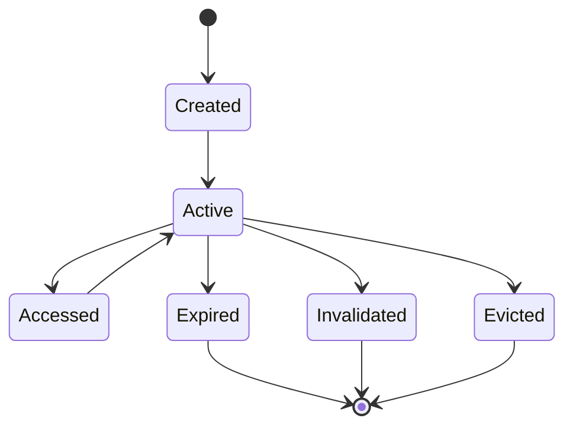
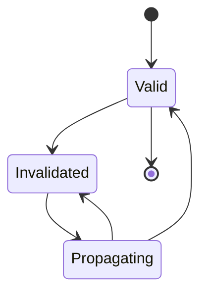

---
# Auto-generated front matter
Title: 14 Cacheinvalidation
LastUpdated: 2025-11-06T20:45:58.510139
Tags: []
Status: draft
---

# 14. Cache Invalidation - Intelligent Cache Management System

## Title & Summary
Design and implement an intelligent cache invalidation system that manages cache lifecycle, handles cache dependencies, provides cache warming strategies, and ensures data consistency across distributed systems.

## Problem Statement

Build a cache invalidation system that:

1. **Cache Management**: Manage cache lifecycle and expiration
2. **Dependency Tracking**: Track cache dependencies and invalidation chains
3. **Cache Warming**: Implement cache warming and preloading strategies
4. **Consistency**: Ensure data consistency across cache layers
5. **Performance**: Optimize cache hit rates and reduce miss penalties
6. **Monitoring**: Provide cache performance metrics and monitoring

## Requirements & Constraints

### Functional Requirements
- Cache invalidation with dependency tracking
- Cache warming and preloading
- Multi-level cache management
- Cache consistency across distributed systems
- Cache performance monitoring
- Intelligent cache eviction policies

### Non-Functional Requirements
- **Latency**: < 10ms for cache operations
- **Consistency**: Eventually consistent cache invalidation
- **Scalability**: Support 1M+ cache operations per second
- **Reliability**: 99.9% cache operation success rate
- **Memory**: Efficient memory usage for cache storage

## API / Interfaces

### REST Endpoints

```go
// Cache Operations
GET    /api/cache/{key}
POST   /api/cache/{key}
PUT    /api/cache/{key}
DELETE /api/cache/{key}
POST   /api/cache/invalidate

// Cache Management
GET    /api/cache/stats
POST   /api/cache/warm
GET    /api/cache/dependencies
POST   /api/cache/clear

// Cache Monitoring
GET    /api/cache/metrics
GET    /api/cache/health
```

### Request/Response Examples

```json
// Set Cache
POST /api/cache/user:123
{
  "value": {
    "id": "123",
    "name": "John Doe",
    "email": "john@example.com"
  },
  "ttl": 3600,
  "dependencies": ["user:123:profile", "user:123:settings"]
}

// Cache Invalidation
POST /api/cache/invalidate
{
  "pattern": "user:*",
  "dependencies": ["user:123:profile"],
  "cascade": true
}

// Cache Stats
GET /api/cache/stats
{
  "hitRate": 0.85,
  "missRate": 0.15,
  "totalKeys": 10000,
  "memoryUsage": "256MB",
  "evictions": 150
}
```

## Data Model

### Core Entities

```go
type CacheEntry struct {
    Key          string                 `json:"key"`
    Value        interface{}            `json:"value"`
    TTL          int64                  `json:"ttl"`
    CreatedAt    time.Time              `json:"createdAt"`
    LastAccessed time.Time              `json:"lastAccessed"`
    AccessCount  int64                  `json:"accessCount"`
    Dependencies []string               `json:"dependencies"`
    Tags         []string               `json:"tags"`
    Priority     int                    `json:"priority"`
}

type CacheDependency struct {
    Key        string    `json:"key"`
    DependsOn  []string  `json:"dependsOn"`
    CreatedAt  time.Time `json:"createdAt"`
    LastUpdate time.Time `json:"lastUpdate"`
}

type CacheStats struct {
    HitRate     float64 `json:"hitRate"`
    MissRate    float64 `json:"missRate"`
    TotalKeys   int64   `json:"totalKeys"`
    MemoryUsage string  `json:"memoryUsage"`
    Evictions   int64   `json:"evictions"`
    Hits        int64   `json:"hits"`
    Misses      int64   `json:"misses"`
}

type InvalidationRequest struct {
    Pattern      string   `json:"pattern"`
    Dependencies []string `json:"dependencies"`
    Cascade      bool     `json:"cascade"`
    Tags         []string `json:"tags"`
}

type CacheMetrics struct {
    OperationsPerSecond float64 `json:"operationsPerSecond"`
    AverageLatency      float64 `json:"averageLatency"`
    P95Latency          float64 `json:"p95Latency"`
    P99Latency          float64 `json:"p99Latency"`
    ErrorRate           float64 `json:"errorRate"`
}
```

## State Machine

### Cache Entry State Machine



### Cache Dependency State Machine



## Approach Overview

### Simple Solution (MVP)
1. In-memory cache with TTL-based expiration
2. Simple dependency tracking
3. Basic cache warming
4. No distributed consistency

### Production-Ready Design
1. **Multi-level Caching**: L1 (memory), L2 (Redis), L3 (database)
2. **Dependency Graph**: Graph-based dependency tracking
3. **Cache Warming**: Predictive cache warming
4. **Distributed Invalidation**: Event-driven cache invalidation
5. **Performance Monitoring**: Real-time cache metrics
6. **Intelligent Eviction**: LRU, LFU, and adaptive eviction

## Detailed Design

### Modular Decomposition

```go
cacheinvalidation/
├── cache/        # Cache operations
├── invalidation/ # Cache invalidation
├── dependencies/ # Dependency tracking
├── warming/      # Cache warming
├── monitoring/   # Performance monitoring
├── eviction/     # Eviction policies
└── consistency/  # Consistency management
```

### Concurrency Model

```go
type CacheInvalidationSystem struct {
    cache         map[string]*CacheEntry
    dependencies  map[string]*CacheDependency
    stats         *CacheStats
    metrics       *CacheMetrics
    mutex         sync.RWMutex
    invalidationChan chan InvalidationRequest
    warmingChan   chan WarmingRequest
    metricsChan   chan MetricsEvent
}

// Concurrency handling:
// 1. Read-write mutex for cache operations
// 2. Channels for async invalidation
// 3. Goroutines for background tasks
```

## Optimal Golang Implementation

```go
package main

import (
    "context"
    "encoding/json"
    "fmt"
    "log"
    "net/http"
    "sort"
    "sync"
    "time"

    "github.com/google/uuid"
    "github.com/go-redis/redis/v8"
)

type CacheEntry struct {
    Key          string                 `json:"key"`
    Value        interface{}            `json:"value"`
    TTL          int64                  `json:"ttl"`
    CreatedAt    time.Time              `json:"createdAt"`
    LastAccessed time.Time              `json:"lastAccessed"`
    AccessCount  int64                  `json:"accessCount"`
    Dependencies []string               `json:"dependencies"`
    Tags         []string               `json:"tags"`
    Priority     int                    `json:"priority"`
}

type CacheDependency struct {
    Key        string    `json:"key"`
    DependsOn  []string  `json:"dependsOn"`
    CreatedAt  time.Time `json:"createdAt"`
    LastUpdate time.Time `json:"lastUpdate"`
}

type CacheStats struct {
    HitRate     float64 `json:"hitRate"`
    MissRate    float64 `json:"missRate"`
    TotalKeys   int64   `json:"totalKeys"`
    MemoryUsage string  `json:"memoryUsage"`
    Evictions   int64   `json:"evictions"`
    Hits        int64   `json:"hits"`
    Misses      int64   `json:"misses"`
}

type InvalidationRequest struct {
    Pattern      string   `json:"pattern"`
    Dependencies []string `json:"dependencies"`
    Cascade      bool     `json:"cascade"`
    Tags         []string `json:"tags"`
}

type WarmingRequest struct {
    Keys    []string `json:"keys"`
    Pattern string   `json:"pattern"`
    Tags    []string `json:"tags"`
}

type MetricsEvent struct {
    Type      string    `json:"type"`
    Key       string    `json:"key"`
    Latency   float64   `json:"latency"`
    Timestamp time.Time `json:"timestamp"`
}

type CacheInvalidationSystem struct {
    cache            map[string]*CacheEntry
    dependencies     map[string]*CacheDependency
    stats            *CacheStats
    metrics          *CacheMetrics
    mutex            sync.RWMutex
    invalidationChan chan InvalidationRequest
    warmingChan      chan WarmingRequest
    metricsChan      chan MetricsEvent
    redisClient      *redis.Client
    maxSize          int
    evictionPolicy   string
}

type CacheMetrics struct {
    OperationsPerSecond float64 `json:"operationsPerSecond"`
    AverageLatency      float64 `json:"averageLatency"`
    P95Latency          float64 `json:"p95Latency"`
    P99Latency          float64 `json:"p99Latency"`
    ErrorRate           float64 `json:"errorRate"`
}

func NewCacheInvalidationSystem(maxSize int, evictionPolicy string) *CacheInvalidationSystem {
    return &CacheInvalidationSystem{
        cache:            make(map[string]*CacheEntry),
        dependencies:     make(map[string]*CacheDependency),
        stats:            &CacheStats{},
        metrics:          &CacheMetrics{},
        invalidationChan: make(chan InvalidationRequest, 10000),
        warmingChan:      make(chan WarmingRequest, 1000),
        metricsChan:      make(chan MetricsEvent, 10000),
        maxSize:          maxSize,
        evictionPolicy:   evictionPolicy,
    }
}

func (cis *CacheInvalidationSystem) Get(key string) (interface{}, bool) {
    start := time.Now()
    defer func() {
        cis.metricsChan <- MetricsEvent{
            Type:      "get",
            Key:       key,
            Latency:   float64(time.Since(start).Nanoseconds()) / 1e6, // Convert to milliseconds
            Timestamp: time.Now(),
        }
    }()

    cis.mutex.RLock()
    entry, exists := cis.cache[key]
    cis.mutex.RUnlock()

    if !exists {
        cis.stats.Misses++
        cis.updateStats()
        return nil, false
    }

    // Check if entry has expired
    if time.Now().Unix() > entry.CreatedAt.Unix()+entry.TTL {
        cis.mutex.Lock()
        delete(cis.cache, key)
        cis.mutex.Unlock()
        cis.stats.Misses++
        cis.updateStats()
        return nil, false
    }

    // Update access information
    cis.mutex.Lock()
    entry.LastAccessed = time.Now()
    entry.AccessCount++
    cis.mutex.Unlock()

    cis.stats.Hits++
    cis.updateStats()
    return entry.Value, true
}

func (cis *CacheInvalidationSystem) Set(key string, value interface{}, ttl int64, dependencies []string, tags []string, priority int) error {
    start := time.Now()
    defer func() {
        cis.metricsChan <- MetricsEvent{
            Type:      "set",
            Key:       key,
            Latency:   float64(time.Since(start).Nanoseconds()) / 1e6,
            Timestamp: time.Now(),
        }
    }()

    // Check if cache is full
    cis.mutex.RLock()
    if len(cis.cache) >= cis.maxSize {
        cis.mutex.RUnlock()
        cis.evictEntries()
    } else {
        cis.mutex.RUnlock()
    }

    entry := &CacheEntry{
        Key:          key,
        Value:        value,
        TTL:          ttl,
        CreatedAt:    time.Now(),
        LastAccessed: time.Now(),
        AccessCount:  1,
        Dependencies: dependencies,
        Tags:         tags,
        Priority:     priority,
    }

    cis.mutex.Lock()
    cis.cache[key] = entry
    cis.mutex.Unlock()

    // Update dependencies
    if len(dependencies) > 0 {
        cis.updateDependencies(key, dependencies)
    }

    cis.updateStats()
    return nil
}

func (cis *CacheInvalidationSystem) Delete(key string) error {
    start := time.Now()
    defer func() {
        cis.metricsChan <- MetricsEvent{
            Type:      "delete",
            Key:       key,
            Latency:   float64(time.Since(start).Nanoseconds()) / 1e6,
            Timestamp: time.Now(),
        }
    }()

    cis.mutex.Lock()
    delete(cis.cache, key)
    cis.mutex.Unlock()

    // Remove from dependencies
    cis.removeDependencies(key)

    cis.updateStats()
    return nil
}

func (cis *CacheInvalidationSystem) InvalidatePattern(pattern string, cascade bool) error {
    request := InvalidationRequest{
        Pattern: pattern,
        Cascade: cascade,
    }
    
    cis.invalidationChan <- request
    return nil
}

func (cis *CacheInvalidationSystem) InvalidateByDependencies(dependencies []string, cascade bool) error {
    request := InvalidationRequest{
        Dependencies: dependencies,
        Cascade:      cascade,
    }
    
    cis.invalidationChan <- request
    return nil
}

func (cis *CacheInvalidationSystem) InvalidateByTags(tags []string, cascade bool) error {
    request := InvalidationRequest{
        Tags:    tags,
        Cascade: cascade,
    }
    
    cis.invalidationChan <- request
    return nil
}

func (cis *CacheInvalidationSystem) ProcessInvalidations() {
    for request := range cis.invalidationChan {
        cis.mutex.Lock()
        
        var keysToInvalidate []string
        
        // Pattern-based invalidation
        if request.Pattern != "" {
            for key := range cis.cache {
                if cis.matchesPattern(key, request.Pattern) {
                    keysToInvalidate = append(keysToInvalidate, key)
                }
            }
        }
        
        // Dependency-based invalidation
        if len(request.Dependencies) > 0 {
            for key, entry := range cis.cache {
                for _, dep := range request.Dependencies {
                    if cis.hasDependency(entry.Dependencies, dep) {
                        keysToInvalidate = append(keysToInvalidate, key)
                        break
                    }
                }
            }
        }
        
        // Tag-based invalidation
        if len(request.Tags) > 0 {
            for key, entry := range cis.cache {
                for _, tag := range request.Tags {
                    if cis.hasTag(entry.Tags, tag) {
                        keysToInvalidate = append(keysToInvalidate, key)
                        break
                    }
                }
            }
        }
        
        // Remove invalidated entries
        for _, key := range keysToInvalidate {
            delete(cis.cache, key)
        }
        
        cis.mutex.Unlock()
        
        // Cascade invalidation
        if request.Cascade {
            for _, key := range keysToInvalidate {
                cis.cascadeInvalidation(key)
            }
        }
        
        log.Printf("Invalidated %d cache entries", len(keysToInvalidate))
    }
}

func (cis *CacheInvalidationSystem) matchesPattern(key, pattern string) bool {
    // Simple pattern matching - can be enhanced with regex
    if pattern == "*" {
        return true
    }
    
    if pattern[len(pattern)-1] == '*' {
        prefix := pattern[:len(pattern)-1]
        return len(key) >= len(prefix) && key[:len(prefix)] == prefix
    }
    
    return key == pattern
}

func (cis *CacheInvalidationSystem) hasDependency(dependencies []string, dep string) bool {
    for _, d := range dependencies {
        if d == dep {
            return true
        }
    }
    return false
}

func (cis *CacheInvalidationSystem) hasTag(tags []string, tag string) bool {
    for _, t := range tags {
        if t == tag {
            return true
        }
    }
    return false
}

func (cis *CacheInvalidationSystem) cascadeInvalidation(key string) {
    // Find entries that depend on this key
    cis.mutex.RLock()
    var dependentKeys []string
    for k, entry := range cis.cache {
        if cis.hasDependency(entry.Dependencies, key) {
            dependentKeys = append(dependentKeys, k)
        }
    }
    cis.mutex.RUnlock()
    
    // Invalidate dependent entries
    for _, depKey := range dependentKeys {
        cis.Delete(depKey)
    }
}

func (cis *CacheInvalidationSystem) updateDependencies(key string, dependencies []string) {
    dep := &CacheDependency{
        Key:        key,
        DependsOn:  dependencies,
        CreatedAt:  time.Now(),
        LastUpdate: time.Now(),
    }
    
    cis.mutex.Lock()
    cis.dependencies[key] = dep
    cis.mutex.Unlock()
}

func (cis *CacheInvalidationSystem) removeDependencies(key string) {
    cis.mutex.Lock()
    delete(cis.dependencies, key)
    cis.mutex.Unlock()
}

func (cis *CacheInvalidationSystem) evictEntries() {
    cis.mutex.Lock()
    defer cis.mutex.Unlock()
    
    if len(cis.cache) < cis.maxSize {
        return
    }
    
    var entries []*CacheEntry
    for _, entry := range cis.cache {
        entries = append(entries, entry)
    }
    
    // Sort by eviction policy
    switch cis.evictionPolicy {
    case "lru":
        sort.Slice(entries, func(i, j int) bool {
            return entries[i].LastAccessed.Before(entries[j].LastAccessed)
        })
    case "lfu":
        sort.Slice(entries, func(i, j int) bool {
            return entries[i].AccessCount < entries[j].AccessCount
        })
    case "priority":
        sort.Slice(entries, func(i, j int) bool {
            return entries[i].Priority < entries[j].Priority
        })
    }
    
    // Evict 10% of entries
    evictCount := len(entries) / 10
    if evictCount == 0 {
        evictCount = 1
    }
    
    for i := 0; i < evictCount; i++ {
        delete(cis.cache, entries[i].Key)
        cis.stats.Evictions++
    }
}

func (cis *CacheInvalidationSystem) WarmCache(keys []string) error {
    request := WarmingRequest{
        Keys: keys,
    }
    
    cis.warmingChan <- request
    return nil
}

func (cis *CacheInvalidationSystem) ProcessWarming() {
    for request := range cis.warmingChan {
        for _, key := range request.Keys {
            // Simulate cache warming by preloading data
            // In real implementation, this would fetch from data source
            value := fmt.Sprintf("warmed_data_for_%s", key)
            cis.Set(key, value, 3600, nil, nil, 1)
        }
        
        log.Printf("Warmed %d cache entries", len(request.Keys))
    }
}

func (cis *CacheInvalidationSystem) ProcessMetrics() {
    var latencies []float64
    var operations int64
    
    for event := range cis.metricsChan {
        latencies = append(latencies, event.Latency)
        operations++
        
        // Keep only last 1000 latencies for metrics calculation
        if len(latencies) > 1000 {
            latencies = latencies[1:]
        }
        
        // Update metrics every 100 operations
        if operations%100 == 0 {
            cis.updateMetrics(latencies, operations)
        }
    }
}

func (cis *CacheInvalidationSystem) updateMetrics(latencies []float64, operations int64) {
    if len(latencies) == 0 {
        return
    }
    
    // Calculate average latency
    sum := 0.0
    for _, lat := range latencies {
        sum += lat
    }
    avgLatency := sum / float64(len(latencies))
    
    // Calculate percentiles
    sort.Float64s(latencies)
    p95Index := int(float64(len(latencies)) * 0.95)
    p99Index := int(float64(len(latencies)) * 0.99)
    
    var p95Latency, p99Latency float64
    if p95Index < len(latencies) {
        p95Latency = latencies[p95Index]
    }
    if p99Index < len(latencies) {
        p99Latency = latencies[p99Index]
    }
    
    cis.mutex.Lock()
    cis.metrics.AverageLatency = avgLatency
    cis.metrics.P95Latency = p95Latency
    cis.metrics.P99Latency = p99Latency
    cis.metrics.OperationsPerSecond = float64(operations) / 60.0 // Approximate
    cis.mutex.Unlock()
}

func (cis *CacheInvalidationSystem) updateStats() {
    total := cis.stats.Hits + cis.stats.Misses
    if total > 0 {
        cis.stats.HitRate = float64(cis.stats.Hits) / float64(total)
        cis.stats.MissRate = float64(cis.stats.Misses) / float64(total)
    }
    
    cis.mutex.RLock()
    cis.stats.TotalKeys = int64(len(cis.cache))
    cis.mutex.RUnlock()
}

func (cis *CacheInvalidationSystem) GetStats() *CacheStats {
    cis.updateStats()
    return cis.stats
}

func (cis *CacheInvalidationSystem) GetMetrics() *CacheMetrics {
    cis.mutex.RLock()
    defer cis.mutex.RUnlock()
    return cis.metrics
}

// HTTP Handlers
func (cis *CacheInvalidationSystem) GetHandler(w http.ResponseWriter, r *http.Request) {
    if r.Method != http.MethodGet {
        http.Error(w, "Method not allowed", http.StatusMethodNotAllowed)
        return
    }
    
    key := r.URL.Path[len("/api/cache/"):]
    if key == "" {
        http.Error(w, "Key required", http.StatusBadRequest)
        return
    }
    
    value, exists := cis.Get(key)
    if !exists {
        http.Error(w, "Key not found", http.StatusNotFound)
        return
    }
    
    w.Header().Set("Content-Type", "application/json")
    json.NewEncoder(w).Encode(map[string]interface{}{
        "key":   key,
        "value": value,
    })
}

func (cis *CacheInvalidationSystem) SetHandler(w http.ResponseWriter, r *http.Request) {
    if r.Method != http.MethodPost {
        http.Error(w, "Method not allowed", http.StatusMethodNotAllowed)
        return
    }
    
    key := r.URL.Path[len("/api/cache/"):]
    if key == "" {
        http.Error(w, "Key required", http.StatusBadRequest)
        return
    }
    
    var req struct {
        Value        interface{} `json:"value"`
        TTL          int64       `json:"ttl"`
        Dependencies []string    `json:"dependencies"`
        Tags         []string    `json:"tags"`
        Priority     int         `json:"priority"`
    }
    
    if err := json.NewDecoder(r.Body).Decode(&req); err != nil {
        http.Error(w, "Invalid request", http.StatusBadRequest)
        return
    }
    
    if req.TTL == 0 {
        req.TTL = 3600 // Default 1 hour
    }
    
    if err := cis.Set(key, req.Value, req.TTL, req.Dependencies, req.Tags, req.Priority); err != nil {
        http.Error(w, err.Error(), http.StatusInternalServerError)
        return
    }
    
    w.WriteHeader(http.StatusOK)
}

func (cis *CacheInvalidationSystem) DeleteHandler(w http.ResponseWriter, r *http.Request) {
    if r.Method != http.MethodDelete {
        http.Error(w, "Method not allowed", http.StatusMethodNotAllowed)
        return
    }
    
    key := r.URL.Path[len("/api/cache/"):]
    if key == "" {
        http.Error(w, "Key required", http.StatusBadRequest)
        return
    }
    
    if err := cis.Delete(key); err != nil {
        http.Error(w, err.Error(), http.StatusInternalServerError)
        return
    }
    
    w.WriteHeader(http.StatusOK)
}

func (cis *CacheInvalidationSystem) InvalidateHandler(w http.ResponseWriter, r *http.Request) {
    if r.Method != http.MethodPost {
        http.Error(w, "Method not allowed", http.StatusMethodNotAllowed)
        return
    }
    
    var req InvalidationRequest
    if err := json.NewDecoder(r.Body).Decode(&req); err != nil {
        http.Error(w, "Invalid request", http.StatusBadRequest)
        return
    }
    
    var err error
    if req.Pattern != "" {
        err = cis.InvalidatePattern(req.Pattern, req.Cascade)
    } else if len(req.Dependencies) > 0 {
        err = cis.InvalidateByDependencies(req.Dependencies, req.Cascade)
    } else if len(req.Tags) > 0 {
        err = cis.InvalidateByTags(req.Tags, req.Cascade)
    } else {
        http.Error(w, "Invalid invalidation request", http.StatusBadRequest)
        return
    }
    
    if err != nil {
        http.Error(w, err.Error(), http.StatusInternalServerError)
        return
    }
    
    w.WriteHeader(http.StatusOK)
}

func (cis *CacheInvalidationSystem) StatsHandler(w http.ResponseWriter, r *http.Request) {
    if r.Method != http.MethodGet {
        http.Error(w, "Method not allowed", http.StatusMethodNotAllowed)
        return
    }
    
    stats := cis.GetStats()
    w.Header().Set("Content-Type", "application/json")
    json.NewEncoder(w).Encode(stats)
}

func (cis *CacheInvalidationSystem) MetricsHandler(w http.ResponseWriter, r *http.Request) {
    if r.Method != http.MethodGet {
        http.Error(w, "Method not allowed", http.StatusMethodNotAllowed)
        return
    }
    
    metrics := cis.GetMetrics()
    w.Header().Set("Content-Type", "application/json")
    json.NewEncoder(w).Encode(metrics)
}

func (cis *CacheInvalidationSystem) WarmHandler(w http.ResponseWriter, r *http.Request) {
    if r.Method != http.MethodPost {
        http.Error(w, "Method not allowed", http.StatusMethodNotAllowed)
        return
    }
    
    var req WarmingRequest
    if err := json.NewDecoder(r.Body).Decode(&req); err != nil {
        http.Error(w, "Invalid request", http.StatusBadRequest)
        return
    }
    
    if err := cis.WarmCache(req.Keys); err != nil {
        http.Error(w, err.Error(), http.StatusInternalServerError)
        return
    }
    
    w.WriteHeader(http.StatusOK)
}

func main() {
    cacheSystem := NewCacheInvalidationSystem(10000, "lru")
    
    // Start background workers
    go cacheSystem.ProcessInvalidations()
    go cacheSystem.ProcessWarming()
    go cacheSystem.ProcessMetrics()
    
    // HTTP routes
    http.HandleFunc("/api/cache/", cacheSystem.GetHandler)
    http.HandleFunc("/api/cache/", cacheSystem.SetHandler)
    http.HandleFunc("/api/cache/", cacheSystem.DeleteHandler)
    http.HandleFunc("/api/cache/invalidate", cacheSystem.InvalidateHandler)
    http.HandleFunc("/api/cache/stats", cacheSystem.StatsHandler)
    http.HandleFunc("/api/cache/metrics", cacheSystem.MetricsHandler)
    http.HandleFunc("/api/cache/warm", cacheSystem.WarmHandler)
    
    log.Println("Cache invalidation system starting on :8080")
    log.Fatal(http.ListenAndServe(":8080", nil))
}
```

## Unit Tests

```go
func TestCacheInvalidationSystem_GetSet(t *testing.T) {
    cache := NewCacheInvalidationSystem(1000, "lru")
    
    // Set a value
    err := cache.Set("key1", "value1", 3600, nil, nil, 1)
    if err != nil {
        t.Fatalf("Set() error = %v", err)
    }
    
    // Get the value
    value, exists := cache.Get("key1")
    if !exists {
        t.Error("Expected key to exist")
    }
    
    if value != "value1" {
        t.Errorf("Expected value 'value1', got %v", value)
    }
}

func TestCacheInvalidationSystem_InvalidatePattern(t *testing.T) {
    cache := NewCacheInvalidationSystem(1000, "lru")
    
    // Set multiple values
    cache.Set("user:1", "data1", 3600, nil, nil, 1)
    cache.Set("user:2", "data2", 3600, nil, nil, 1)
    cache.Set("product:1", "data3", 3600, nil, nil, 1)
    
    // Invalidate user pattern
    err := cache.InvalidatePattern("user:*", false)
    if err != nil {
        t.Fatalf("InvalidatePattern() error = %v", err)
    }
    
    // Wait for processing
    time.Sleep(100 * time.Millisecond)
    
    // Check that user keys are invalidated
    _, exists := cache.Get("user:1")
    if exists {
        t.Error("Expected user:1 to be invalidated")
    }
    
    _, exists = cache.Get("user:2")
    if exists {
        t.Error("Expected user:2 to be invalidated")
    }
    
    // Check that product key still exists
    _, exists = cache.Get("product:1")
    if !exists {
        t.Error("Expected product:1 to still exist")
    }
}

func TestCacheInvalidationSystem_Dependencies(t *testing.T) {
    cache := NewCacheInvalidationSystem(1000, "lru")
    
    // Set values with dependencies
    cache.Set("user:1", "data1", 3600, []string{"profile:1"}, nil, 1)
    cache.Set("profile:1", "profile_data", 3600, nil, nil, 1)
    
    // Invalidate by dependency
    err := cache.InvalidateByDependencies([]string{"profile:1"}, true)
    if err != nil {
        t.Fatalf("InvalidateByDependencies() error = %v", err)
    }
    
    // Wait for processing
    time.Sleep(100 * time.Millisecond)
    
    // Check that dependent key is invalidated
    _, exists := cache.Get("user:1")
    if exists {
        t.Error("Expected user:1 to be invalidated due to dependency")
    }
}

func TestCacheInvalidationSystem_Eviction(t *testing.T) {
    cache := NewCacheInvalidationSystem(5, "lru") // Small cache for testing
    
    // Fill cache beyond capacity
    for i := 0; i < 10; i++ {
        key := fmt.Sprintf("key%d", i)
        cache.Set(key, fmt.Sprintf("value%d", i), 3600, nil, nil, 1)
    }
    
    // Check that cache size is within limits
    stats := cache.GetStats()
    if stats.TotalKeys > 5 {
        t.Errorf("Expected cache size <= 5, got %d", stats.TotalKeys)
    }
    
    if stats.Evictions == 0 {
        t.Error("Expected some evictions to occur")
    }
}
```

## Complexity Analysis

### Time Complexity
- **Get**: O(1) - Hash map lookup
- **Set**: O(1) - Hash map insertion
- **Delete**: O(1) - Hash map deletion
- **Invalidate Pattern**: O(N) - Linear scan through all keys
- **Invalidate Dependencies**: O(N * D) - Linear scan with dependency check
- **Eviction**: O(N log N) - Sorting for eviction policy

### Space Complexity
- **Cache Storage**: O(N) where N is number of cache entries
- **Dependencies**: O(N * D) where D is average dependencies per entry
- **Metrics**: O(M) where M is number of metrics samples
- **Total**: O(N * D + M)

## Edge Cases & Validation

### Input Validation
- Invalid cache keys
- Negative TTL values
- Invalid dependency references
- Malformed invalidation patterns
- Invalid eviction policies

### Error Scenarios
- Cache overflow handling
- Dependency cycle detection
- Invalidation cascade failures
- Metrics collection errors
- Memory pressure handling

### Boundary Conditions
- Maximum cache size limits
- TTL expiration boundaries
- Dependency depth limits
- Pattern matching boundaries
- Memory usage limits

## Extension Ideas (Scaling)

### Horizontal Scaling
1. **Distributed Caching**: Redis cluster for distributed cache
2. **Load Balancing**: Multiple cache service instances
3. **Data Partitioning**: Partition cache by key hash
4. **Replication**: Cache replication across regions

### Performance Optimization
1. **Multi-level Caching**: L1, L2, L3 cache hierarchy
2. **Compression**: Data compression for cache storage
3. **Serialization**: Efficient serialization formats
4. **Memory Management**: Advanced memory allocation strategies

### Advanced Features
1. **Machine Learning**: Predictive cache warming
2. **Analytics**: Cache performance analytics
3. **Compliance**: Data retention and privacy compliance
4. **Monitoring**: Advanced cache monitoring and alerting

## 20 Follow-up Questions

### 1. How would you handle cache consistency across distributed systems?
**Answer**: Implement distributed cache invalidation using event-driven architecture. Use consensus algorithms for consistency. Implement cache versioning and conflict resolution. Consider using distributed databases for cache metadata.

### 2. What's your strategy for handling cache warming and preloading?
**Answer**: Implement predictive cache warming using machine learning. Use data access patterns for preloading. Implement cache warming strategies based on user behavior. Consider using cache warming pipelines.

### 3. How do you ensure cache performance under high load?
**Answer**: Implement horizontal scaling with load balancing. Use efficient data structures and algorithms. Implement cache partitioning and sharding. Consider using performance monitoring and optimization.

### 4. What's your approach to handling cache eviction policies?
**Answer**: Implement multiple eviction policies (LRU, LFU, TTL). Use adaptive eviction based on access patterns. Implement eviction policies based on business rules. Consider using machine learning for eviction optimization.

### 5. How would you implement cache monitoring and alerting?
**Answer**: Implement real-time cache metrics collection. Use monitoring tools for cache performance. Implement alerting for cache issues. Consider using observability platforms.

### 6. What's your strategy for handling cache data privacy and security?
**Answer**: Implement data encryption for sensitive cache data. Use access controls and authentication. Implement data anonymization and pseudonymization. Consider using security frameworks.

### 7. How do you handle cache data migration and versioning?
**Answer**: Implement cache data migration tools. Use versioned cache schemas. Implement backward compatibility for cache data. Consider using migration orchestration.

### 8. What's your approach to handling cache performance optimization?
**Answer**: Implement cache performance profiling and optimization. Use efficient serialization and compression. Implement cache hit rate optimization. Consider using performance tuning tools.

### 9. How would you implement cache analytics and insights?
**Answer**: Implement cache usage analytics and reporting. Use data pipelines for cache analysis. Implement cache performance insights. Consider using analytics platforms.

### 10. What's your strategy for handling cache disaster recovery?
**Answer**: Implement cache backup and recovery procedures. Use cache replication across regions. Implement automated failover mechanisms. Consider using disaster recovery services.

### 11. How do you handle cache integration with external systems?
**Answer**: Implement API-based cache integration. Use message queues for cache synchronization. Implement data transformation for cache data. Consider using integration platforms.

### 12. What's your approach to handling cache data validation?
**Answer**: Implement cache data validation and verification. Use schema validation for cache data. Implement data integrity checks. Consider using validation frameworks.

### 13. How would you implement cache data compression?
**Answer**: Implement data compression algorithms for cache storage. Use different compression for different data types. Implement compression ratio optimization. Consider using adaptive compression.

### 14. What's your strategy for handling cache data archiving?
**Answer**: Implement cache data archiving for old data. Use data lifecycle management. Implement data compression for archived data. Consider using cloud storage for archives.

### 15. How do you handle cache data synchronization?
**Answer**: Implement real-time cache synchronization. Use conflict resolution for cache conflicts. Implement data consistency checks. Consider using synchronization frameworks.

### 16. What's your approach to handling cache data testing?
**Answer**: Implement cache testing frameworks. Use mock services for cache testing. Implement cache performance testing. Consider using automated testing tools.

### 17. How would you implement cache data governance?
**Answer**: Implement cache data governance frameworks. Use data catalog for cache data discovery. Implement data stewardship for cache data. Consider using governance tools.

### 18. What's your strategy for handling cache data compliance?
**Answer**: Implement compliance monitoring for cache data. Use audit trails for cache operations. Implement regulatory reporting for cache data. Consider using compliance management tools.

### 19. How do you handle cache data backup and recovery?
**Answer**: Implement automated cache data backup. Use multiple backup locations. Implement backup verification and testing. Consider using cloud backup services.

### 20. What's your approach to handling cache data disaster recovery?
**Answer**: Implement disaster recovery procedures for cache data. Use cache replication across regions. Implement automated failover for cache systems. Consider using disaster recovery services.

## Evaluation Checklist

### Code Quality (25%)
- [ ] Clean, readable Go code with proper error handling
- [ ] Appropriate use of interfaces and structs
- [ ] Proper concurrency patterns (goroutines, channels, mutexes)
- [ ] Good separation of concerns

### Architecture (25%)
- [ ] Scalable design with intelligent invalidation
- [ ] Proper dependency tracking and management
- [ ] Efficient eviction policies
- [ ] Comprehensive monitoring system

### Functionality (25%)
- [ ] Cache operations working correctly
- [ ] Invalidation system functional
- [ ] Dependency tracking working
- [ ] Performance monitoring working

### Testing (15%)
- [ ] Unit tests for core functionality
- [ ] Integration tests for API endpoints
- [ ] Performance testing
- [ ] Edge case testing

### Discussion (10%)
- [ ] Clear explanation of design decisions
- [ ] Understanding of caching systems
- [ ] Knowledge of invalidation strategies
- [ ] Ability to discuss trade-offs

## Discussion Pointers

### Key Points to Highlight
1. **Intelligent Invalidation**: Explain the dependency-based and pattern-based invalidation
2. **Eviction Policies**: Discuss the different eviction strategies (LRU, LFU, Priority)
3. **Performance Monitoring**: Explain the real-time metrics collection and analysis
4. **Dependency Management**: Discuss the dependency tracking and cascade invalidation
5. **Cache Warming**: Explain the cache warming and preloading strategies

### Trade-offs to Discuss
1. **Memory vs Performance**: Memory usage vs cache performance trade-offs
2. **Consistency vs Availability**: Strong consistency vs high availability trade-offs
3. **Latency vs Throughput**: Low latency vs high throughput trade-offs
4. **Accuracy vs Performance**: Cache accuracy vs performance trade-offs
5. **Real-time vs Batch**: Real-time invalidation vs batch processing trade-offs

### Extension Scenarios
1. **Multi-region Deployment**: How to handle geographic distribution
2. **Advanced Analytics**: Cache performance analytics and optimization
3. **Machine Learning**: Predictive cache warming and optimization
4. **Compliance Integration**: Regulatory compliance and data governance
5. **Enterprise Features**: Multi-tenant and white-label solutions
