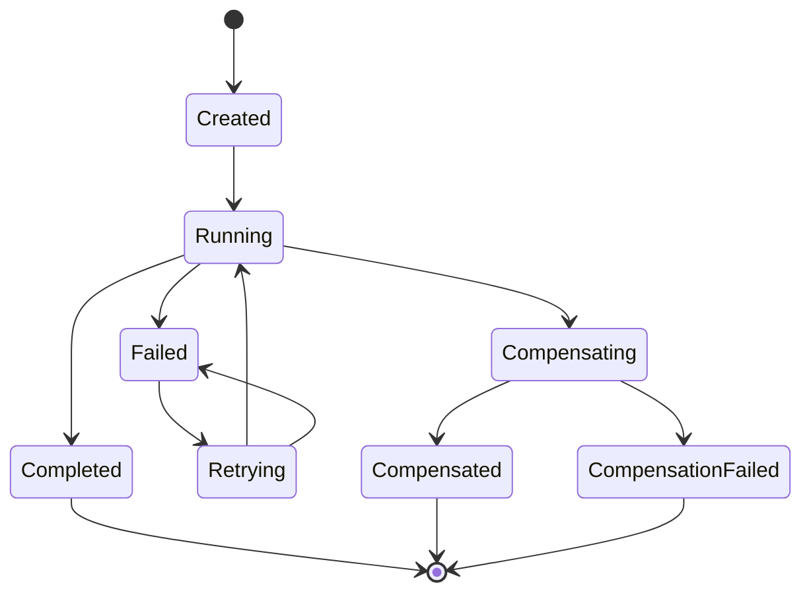
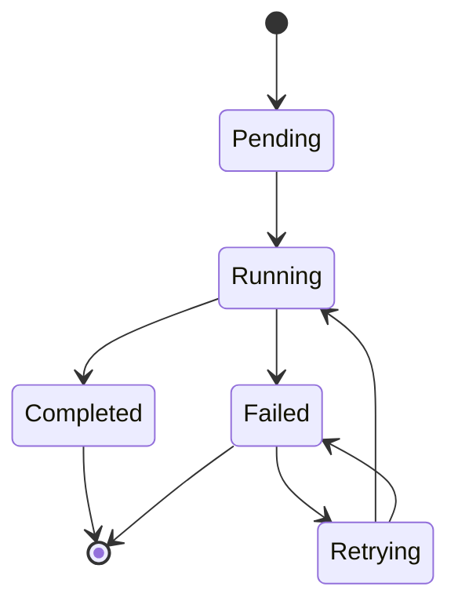

---
# Auto-generated front matter
Title: 15 Transactionalsaga
LastUpdated: 2025-11-06T20:45:58.504706
Tags: []
Status: draft
---

# 15. Transactional Saga - Distributed Transaction Management System

## Title & Summary
Design and implement a transactional saga system that manages distributed transactions across multiple services, handles compensation patterns, ensures eventual consistency, and provides transaction monitoring and recovery mechanisms.

## Problem Statement

Build a transactional saga system that:

1. **Saga Orchestration**: Orchestrate distributed transactions across services
2. **Compensation Logic**: Implement compensation patterns for rollback
3. **Event Sourcing**: Track transaction events and state changes
4. **Recovery Mechanisms**: Handle failures and provide recovery options
5. **Monitoring**: Monitor transaction health and performance
6. **Consistency**: Ensure eventual consistency across distributed systems

## Requirements & Constraints

### Functional Requirements
- Saga orchestration with compensation
- Event sourcing for transaction tracking
- Failure recovery and retry mechanisms
- Transaction monitoring and alerting
- Multi-service coordination
- Eventual consistency guarantees

### Non-Functional Requirements
- **Latency**: < 100ms for saga operations
- **Consistency**: Eventually consistent transactions
- **Scalability**: Support 10K+ concurrent sagas
- **Reliability**: 99.9% saga completion success rate
- **Recovery**: < 5 minutes for failure recovery

## API / Interfaces

### REST Endpoints

```go
// Saga Operations
POST   /api/sagas
GET    /api/sagas/{sagaID}
PUT    /api/sagas/{sagaID}/compensate
GET    /api/sagas/{sagaID}/status

// Saga Management
GET    /api/sagas
POST   /api/sagas/{sagaID}/retry
DELETE /api/sagas/{sagaID}
GET    /api/sagas/{sagaID}/events

// Monitoring
GET    /api/sagas/stats
GET    /api/sagas/health
GET    /api/sagas/metrics
```

### Request/Response Examples

```json
// Create Saga
POST /api/sagas
{
  "name": "order_processing",
  "steps": [
    {
      "id": "reserve_inventory",
      "service": "inventory",
      "action": "reserve",
      "compensation": "release",
      "payload": {
        "productId": "prod_123",
        "quantity": 2
      }
    },
    {
      "id": "process_payment",
      "service": "payment",
      "action": "charge",
      "compensation": "refund",
      "payload": {
        "amount": 99.99,
        "currency": "USD"
      }
    }
  ],
  "timeout": 300
}

// Saga Status
GET /api/sagas/saga_456
{
  "id": "saga_456",
  "name": "order_processing",
  "status": "running",
  "currentStep": "process_payment",
  "completedSteps": ["reserve_inventory"],
  "failedSteps": [],
  "createdAt": "2024-01-15T10:30:00Z",
  "updatedAt": "2024-01-15T10:31:00Z"
}
```

## Data Model

### Core Entities

```go
type Saga struct {
    ID            string    `json:"id"`
    Name          string    `json:"name"`
    Status        string    `json:"status"`
    CurrentStep   string    `json:"currentStep"`
    Steps         []SagaStep `json:"steps"`
    CompletedSteps []string `json:"completedSteps"`
    FailedSteps   []string  `json:"failedSteps"`
    CreatedAt     time.Time `json:"createdAt"`
    UpdatedAt     time.Time `json:"updatedAt"`
    Timeout       int       `json:"timeout"`
    RetryCount    int       `json:"retryCount"`
    MaxRetries    int       `json:"maxRetries"`
}

type SagaStep struct {
    ID           string                 `json:"id"`
    Service      string                 `json:"service"`
    Action       string                 `json:"action"`
    Compensation string                 `json:"compensation"`
    Payload      map[string]interface{} `json:"payload"`
    Status       string                 `json:"status"`
    RetryCount   int                    `json:"retryCount"`
    MaxRetries   int                    `json:"maxRetries"`
    Timeout      int                    `json:"timeout"`
}

type SagaEvent struct {
    ID        string                 `json:"id"`
    SagaID    string                 `json:"sagaID"`
    StepID    string                 `json:"stepID"`
    Type      string                 `json:"type"`
    Status    string                 `json:"status"`
    Payload   map[string]interface{} `json:"payload"`
    Timestamp time.Time              `json:"timestamp"`
    Error     string                 `json:"error,omitempty"`
}

type SagaStats struct {
    TotalSagas      int64   `json:"totalSagas"`
    RunningSagas    int64   `json:"runningSagas"`
    CompletedSagas  int64   `json:"completedSagas"`
    FailedSagas     int64   `json:"failedSagas"`
    SuccessRate     float64 `json:"successRate"`
    AverageDuration float64 `json:"averageDuration"`
}

type CompensationRequest struct {
    SagaID string `json:"sagaID"`
    StepID string `json:"stepID"`
    Reason string `json:"reason"`
}
```

## State Machine

### Saga State Machine



### Saga Step State Machine



## Approach Overview

### Simple Solution (MVP)
1. In-memory saga storage with basic orchestration
2. Simple compensation logic
3. Basic retry mechanism
4. No event sourcing

### Production-Ready Design
1. **Event Sourcing**: Complete event history for sagas
2. **Distributed Coordination**: Choreography vs orchestration patterns
3. **Compensation Patterns**: Saga pattern with compensation
4. **Recovery Mechanisms**: Automatic retry and manual recovery
5. **Monitoring**: Real-time saga monitoring and alerting
6. **Persistence**: Database persistence for saga state

## Detailed Design

### Modular Decomposition

```go
transactionalsaga/
├── saga/         # Saga orchestration
├── steps/        # Step execution
├── compensation/ # Compensation logic
├── events/       # Event sourcing
├── recovery/     # Recovery mechanisms
├── monitoring/   # Monitoring and metrics
└── persistence/  # Data persistence
```

### Concurrency Model

```go
type TransactionalSagaSystem struct {
    sagas         map[string]*Saga
    events        []SagaEvent
    stats         *SagaStats
    mutex         sync.RWMutex
    sagaChan      chan *Saga
    eventChan     chan SagaEvent
    recoveryChan  chan RecoveryRequest
    monitoringChan chan MonitoringEvent
}

// Concurrency handling:
// 1. Read-write mutex for saga operations
// 2. Channels for async processing
// 3. Goroutines for background tasks
```

## Optimal Golang Implementation

```go
package main

import (
    "context"
    "encoding/json"
    "fmt"
    "log"
    "net/http"
    "sync"
    "time"

    "github.com/google/uuid"
)

type Saga struct {
    ID            string     `json:"id"`
    Name          string     `json:"name"`
    Status        string     `json:"status"`
    CurrentStep   string     `json:"currentStep"`
    Steps         []SagaStep `json:"steps"`
    CompletedSteps []string  `json:"completedSteps"`
    FailedSteps   []string   `json:"failedSteps"`
    CreatedAt     time.Time  `json:"createdAt"`
    UpdatedAt     time.Time  `json:"updatedAt"`
    Timeout       int        `json:"timeout"`
    RetryCount    int        `json:"retryCount"`
    MaxRetries    int        `json:"maxRetries"`
}

type SagaStep struct {
    ID           string                 `json:"id"`
    Service      string                 `json:"service"`
    Action       string                 `json:"action"`
    Compensation string                 `json:"compensation"`
    Payload      map[string]interface{} `json:"payload"`
    Status       string                 `json:"status"`
    RetryCount   int                    `json:"retryCount"`
    MaxRetries   int                    `json:"maxRetries"`
    Timeout      int                    `json:"timeout"`
}

type SagaEvent struct {
    ID        string                 `json:"id"`
    SagaID    string                 `json:"sagaID"`
    StepID    string                 `json:"stepID"`
    Type      string                 `json:"type"`
    Status    string                 `json:"status"`
    Payload   map[string]interface{} `json:"payload"`
    Timestamp time.Time              `json:"timestamp"`
    Error     string                 `json:"error,omitempty"`
}

type SagaStats struct {
    TotalSagas      int64   `json:"totalSagas"`
    RunningSagas    int64   `json:"runningSagas"`
    CompletedSagas  int64   `json:"completedSagas"`
    FailedSagas     int64   `json:"failedSagas"`
    SuccessRate     float64 `json:"successRate"`
    AverageDuration float64 `json:"averageDuration"`
}

type CompensationRequest struct {
    SagaID string `json:"sagaID"`
    StepID string `json:"stepID"`
    Reason string `json:"reason"`
}

type RecoveryRequest struct {
    SagaID string `json:"sagaID"`
    Action string `json:"action"`
}

type MonitoringEvent struct {
    Type      string    `json:"type"`
    SagaID    string    `json:"sagaID"`
    StepID    string    `json:"stepID"`
    Status    string    `json:"status"`
    Timestamp time.Time `json:"timestamp"`
    Duration  float64   `json:"duration"`
}

type TransactionalSagaSystem struct {
    sagas         map[string]*Saga
    events        []SagaEvent
    stats         *SagaStats
    mutex         sync.RWMutex
    sagaChan      chan *Saga
    eventChan     chan SagaEvent
    recoveryChan  chan RecoveryRequest
    monitoringChan chan MonitoringEvent
    serviceClients map[string]ServiceClient
}

type ServiceClient interface {
    Execute(ctx context.Context, action string, payload map[string]interface{}) error
    Compensate(ctx context.Context, action string, payload map[string]interface{}) error
}

type MockServiceClient struct {
    name string
}

func (m *MockServiceClient) Execute(ctx context.Context, action string, payload map[string]interface{}) error {
    // Simulate service call
    time.Sleep(100 * time.Millisecond)
    
    // Simulate occasional failures
    if action == "fail" {
        return fmt.Errorf("service execution failed")
    }
    
    log.Printf("Service %s executed action %s", m.name, action)
    return nil
}

func (m *MockServiceClient) Compensate(ctx context.Context, action string, payload map[string]interface{}) error {
    // Simulate compensation call
    time.Sleep(50 * time.Millisecond)
    
    log.Printf("Service %s compensated action %s", m.name, action)
    return nil
}

func NewTransactionalSagaSystem() *TransactionalSagaSystem {
    system := &TransactionalSagaSystem{
        sagas:          make(map[string]*Saga),
        events:         []SagaEvent{},
        stats:          &SagaStats{},
        sagaChan:       make(chan *Saga, 1000),
        eventChan:      make(chan SagaEvent, 10000),
        recoveryChan:   make(chan RecoveryRequest, 1000),
        monitoringChan: make(chan MonitoringEvent, 10000),
        serviceClients: make(map[string]ServiceClient),
    }
    
    // Initialize mock service clients
    system.serviceClients["inventory"] = &MockServiceClient{name: "inventory"}
    system.serviceClients["payment"] = &MockServiceClient{name: "payment"}
    system.serviceClients["shipping"] = &MockServiceClient{name: "shipping"}
    
    return system
}

func (tss *TransactionalSagaSystem) CreateSaga(name string, steps []SagaStep, timeout, maxRetries int) (*Saga, error) {
    saga := &Saga{
        ID:            uuid.New().String(),
        Name:          name,
        Status:        "created",
        CurrentStep:   "",
        Steps:         steps,
        CompletedSteps: []string{},
        FailedSteps:   []string{},
        CreatedAt:     time.Now(),
        UpdatedAt:     time.Now(),
        Timeout:       timeout,
        RetryCount:    0,
        MaxRetries:    maxRetries,
    }
    
    // Set default values for steps
    for i := range saga.Steps {
        if saga.Steps[i].MaxRetries == 0 {
            saga.Steps[i].MaxRetries = 3
        }
        if saga.Steps[i].Timeout == 0 {
            saga.Steps[i].Timeout = 30
        }
        saga.Steps[i].Status = "pending"
    }
    
    tss.mutex.Lock()
    tss.sagas[saga.ID] = saga
    tss.mutex.Unlock()
    
    // Emit event
    tss.emitEvent(saga.ID, "", "saga_created", "success", map[string]interface{}{
        "name": name,
        "steps": len(steps),
    })
    
    // Start saga execution
    tss.sagaChan <- saga
    
    return saga, nil
}

func (tss *TransactionalSagaSystem) GetSaga(sagaID string) (*Saga, error) {
    tss.mutex.RLock()
    saga, exists := tss.sagas[sagaID]
    tss.mutex.RUnlock()
    
    if !exists {
        return nil, fmt.Errorf("saga not found: %s", sagaID)
    }
    
    return saga, nil
}

func (tss *TransactionalSagaSystem) ProcessSagas() {
    for saga := range tss.sagaChan {
        go tss.executeSaga(saga)
    }
}

func (tss *TransactionalSagaSystem) executeSaga(saga *Saga) {
    start := time.Now()
    
    tss.mutex.Lock()
    saga.Status = "running"
    saga.UpdatedAt = time.Now()
    tss.mutex.Unlock()
    
    tss.emitEvent(saga.ID, "", "saga_started", "success", nil)
    
    for i, step := range saga.Steps {
        stepStart := time.Now()
        
        // Check if step is already completed
        if tss.isStepCompleted(saga, step.ID) {
            continue
        }
        
        // Check if step has failed permanently
        if tss.isStepFailed(saga, step.ID) {
            tss.compensateSaga(saga)
            return
        }
        
        // Execute step
        err := tss.executeStep(saga, &saga.Steps[i])
        if err != nil {
            log.Printf("Step %s failed: %v", step.ID, err)
            
            // Retry step if possible
            if saga.Steps[i].RetryCount < saga.Steps[i].MaxRetries {
                saga.Steps[i].RetryCount++
                saga.Steps[i].Status = "retrying"
                tss.emitEvent(saga.ID, step.ID, "step_retry", "retry", map[string]interface{}{
                    "retryCount": saga.Steps[i].RetryCount,
                    "error": err.Error(),
                })
                
                // Wait before retry
                time.Sleep(time.Duration(saga.Steps[i].RetryCount) * time.Second)
                i-- // Retry current step
                continue
            } else {
                // Step failed permanently
                saga.Steps[i].Status = "failed"
                tss.mutex.Lock()
                saga.FailedSteps = append(saga.FailedSteps, step.ID)
                saga.Status = "failed"
                saga.UpdatedAt = time.Now()
                tss.mutex.Unlock()
                
                tss.emitEvent(saga.ID, step.ID, "step_failed", "error", map[string]interface{}{
                    "error": err.Error(),
                })
                
                // Compensate saga
                tss.compensateSaga(saga)
                return
            }
        } else {
            // Step completed successfully
            saga.Steps[i].Status = "completed"
            tss.mutex.Lock()
            saga.CompletedSteps = append(saga.CompletedSteps, step.ID)
            saga.CurrentStep = step.ID
            saga.UpdatedAt = time.Now()
            tss.mutex.Unlock()
            
            tss.emitEvent(saga.ID, step.ID, "step_completed", "success", nil)
        }
        
        // Emit monitoring event
        duration := time.Since(stepStart).Seconds()
        tss.monitoringChan <- MonitoringEvent{
            Type:      "step_execution",
            SagaID:    saga.ID,
            StepID:    step.ID,
            Status:    saga.Steps[i].Status,
            Timestamp: time.Now(),
            Duration:  duration,
        }
    }
    
    // All steps completed successfully
    tss.mutex.Lock()
    saga.Status = "completed"
    saga.UpdatedAt = time.Now()
    tss.mutex.Unlock()
    
    tss.emitEvent(saga.ID, "", "saga_completed", "success", nil)
    
    // Update stats
    duration := time.Since(start).Seconds()
    tss.updateStats("completed", duration)
}

func (tss *TransactionalSagaSystem) executeStep(saga *Saga, step *SagaStep) error {
    client, exists := tss.serviceClients[step.Service]
    if !exists {
        return fmt.Errorf("service client not found: %s", step.Service)
    }
    
    ctx, cancel := context.WithTimeout(context.Background(), time.Duration(step.Timeout)*time.Second)
    defer cancel()
    
    return client.Execute(ctx, step.Action, step.Payload)
}

func (tss *TransactionalSagaSystem) compensateSaga(saga *Saga) {
    tss.mutex.Lock()
    saga.Status = "compensating"
    saga.UpdatedAt = time.Now()
    tss.mutex.Unlock()
    
    tss.emitEvent(saga.ID, "", "saga_compensating", "info", nil)
    
    // Compensate completed steps in reverse order
    for i := len(saga.CompletedSteps) - 1; i >= 0; i-- {
        stepID := saga.CompletedSteps[i]
        step := tss.findStep(saga, stepID)
        if step == nil {
            continue
        }
        
        err := tss.compensateStep(saga, step)
        if err != nil {
            log.Printf("Compensation failed for step %s: %v", stepID, err)
            tss.mutex.Lock()
            saga.Status = "compensation_failed"
            saga.UpdatedAt = time.Now()
            tss.mutex.Unlock()
            
            tss.emitEvent(saga.ID, stepID, "compensation_failed", "error", map[string]interface{}{
                "error": err.Error(),
            })
            return
        }
        
        tss.emitEvent(saga.ID, stepID, "step_compensated", "success", nil)
    }
    
    tss.mutex.Lock()
    saga.Status = "compensated"
    saga.UpdatedAt = time.Now()
    tss.mutex.Unlock()
    
    tss.emitEvent(saga.ID, "", "saga_compensated", "success", nil)
    tss.updateStats("compensated", 0)
}

func (tss *TransactionalSagaSystem) compensateStep(saga *Saga, step *SagaStep) error {
    client, exists := tss.serviceClients[step.Service]
    if !exists {
        return fmt.Errorf("service client not found: %s", step.Service)
    }
    
    ctx, cancel := context.WithTimeout(context.Background(), time.Duration(step.Timeout)*time.Second)
    defer cancel()
    
    return client.Compensate(ctx, step.Compensation, step.Payload)
}

func (tss *TransactionalSagaSystem) findStep(saga *Saga, stepID string) *SagaStep {
    for i := range saga.Steps {
        if saga.Steps[i].ID == stepID {
            return &saga.Steps[i]
        }
    }
    return nil
}

func (tss *TransactionalSagaSystem) isStepCompleted(saga *Saga, stepID string) bool {
    for _, completed := range saga.CompletedSteps {
        if completed == stepID {
            return true
        }
    }
    return false
}

func (tss *TransactionalSagaSystem) isStepFailed(saga *Saga, stepID string) bool {
    for _, failed := range saga.FailedSteps {
        if failed == stepID {
            return true
        }
    }
    return false
}

func (tss *TransactionalSagaSystem) RetrySaga(sagaID string) error {
    saga, err := tss.GetSaga(sagaID)
    if err != nil {
        return err
    }
    
    if saga.Status != "failed" && saga.Status != "compensation_failed" {
        return fmt.Errorf("saga is not in a retryable state: %s", saga.Status)
    }
    
    if saga.RetryCount >= saga.MaxRetries {
        return fmt.Errorf("saga has exceeded maximum retry count")
    }
    
    // Reset saga state
    tss.mutex.Lock()
    saga.RetryCount++
    saga.Status = "created"
    saga.FailedSteps = []string{}
    saga.CurrentStep = ""
    saga.UpdatedAt = time.Now()
    
    // Reset step states
    for i := range saga.Steps {
        saga.Steps[i].Status = "pending"
        saga.Steps[i].RetryCount = 0
    }
    tss.mutex.Unlock()
    
    tss.emitEvent(saga.ID, "", "saga_retry", "info", map[string]interface{}{
        "retryCount": saga.RetryCount,
    })
    
    // Restart saga execution
    tss.sagaChan <- saga
    
    return nil
}

func (tss *TransactionalSagaSystem) emitEvent(sagaID, stepID, eventType, status string, payload map[string]interface{}) {
    event := SagaEvent{
        ID:        uuid.New().String(),
        SagaID:    sagaID,
        StepID:    stepID,
        Type:      eventType,
        Status:    status,
        Payload:   payload,
        Timestamp: time.Now(),
    }
    
    tss.eventChan <- event
}

func (tss *TransactionalSagaSystem) ProcessEvents() {
    for event := range tss.eventChan {
        tss.mutex.Lock()
        tss.events = append(tss.events, event)
        tss.mutex.Unlock()
        
        log.Printf("Saga event: %s - %s for saga %s", event.Type, event.Status, event.SagaID)
    }
}

func (tss *TransactionalSagaSystem) ProcessRecovery() {
    for request := range tss.recoveryChan {
        switch request.Action {
        case "retry":
            tss.RetrySaga(request.SagaID)
        case "compensate":
            saga, err := tss.GetSaga(request.SagaID)
            if err == nil {
                tss.compensateSaga(saga)
            }
        }
    }
}

func (tss *TransactionalSagaSystem) ProcessMonitoring() {
    for event := range tss.monitoringChan {
        // Process monitoring events
        log.Printf("Monitoring event: %s - %s for saga %s (duration: %.2fs)", 
            event.Type, event.Status, event.SagaID, event.Duration)
    }
}

func (tss *TransactionalSagaSystem) updateStats(status string, duration float64) {
    tss.mutex.Lock()
    defer tss.mutex.Unlock()
    
    switch status {
    case "completed":
        tss.stats.CompletedSagas++
    case "failed":
        tss.stats.FailedSagas++
    case "compensated":
        tss.stats.FailedSagas++
    }
    
    tss.stats.TotalSagas = tss.stats.RunningSagas + tss.stats.CompletedSagas + tss.stats.FailedSagas
    
    if tss.stats.TotalSagas > 0 {
        tss.stats.SuccessRate = float64(tss.stats.CompletedSagas) / float64(tss.stats.TotalSagas)
    }
    
    if duration > 0 {
        tss.stats.AverageDuration = (tss.stats.AverageDuration + duration) / 2
    }
}

func (tss *TransactionalSagaSystem) GetStats() *SagaStats {
    tss.mutex.RLock()
    defer tss.mutex.RUnlock()
    
    // Count running sagas
    runningCount := int64(0)
    for _, saga := range tss.sagas {
        if saga.Status == "running" || saga.Status == "compensating" {
            runningCount++
        }
    }
    tss.stats.RunningSagas = runningCount
    
    return tss.stats
}

func (tss *TransactionalSagaSystem) GetSagaEvents(sagaID string) ([]SagaEvent, error) {
    tss.mutex.RLock()
    defer tss.mutex.RUnlock()
    
    var sagaEvents []SagaEvent
    for _, event := range tss.events {
        if event.SagaID == sagaID {
            sagaEvents = append(sagaEvents, event)
        }
    }
    
    return sagaEvents, nil
}

// HTTP Handlers
func (tss *TransactionalSagaSystem) CreateSagaHandler(w http.ResponseWriter, r *http.Request) {
    if r.Method != http.MethodPost {
        http.Error(w, "Method not allowed", http.StatusMethodNotAllowed)
        return
    }
    
    var req struct {
        Name      string     `json:"name"`
        Steps     []SagaStep `json:"steps"`
        Timeout   int        `json:"timeout"`
        MaxRetries int       `json:"maxRetries"`
    }
    
    if err := json.NewDecoder(r.Body).Decode(&req); err != nil {
        http.Error(w, "Invalid request", http.StatusBadRequest)
        return
    }
    
    if req.Timeout == 0 {
        req.Timeout = 300 // Default 5 minutes
    }
    
    if req.MaxRetries == 0 {
        req.MaxRetries = 3 // Default 3 retries
    }
    
    saga, err := tss.CreateSaga(req.Name, req.Steps, req.Timeout, req.MaxRetries)
    if err != nil {
        http.Error(w, err.Error(), http.StatusInternalServerError)
        return
    }
    
    w.Header().Set("Content-Type", "application/json")
    json.NewEncoder(w).Encode(saga)
}

func (tss *TransactionalSagaSystem) GetSagaHandler(w http.ResponseWriter, r *http.Request) {
    if r.Method != http.MethodGet {
        http.Error(w, "Method not allowed", http.StatusMethodNotAllowed)
        return
    }
    
    sagaID := r.URL.Path[len("/api/sagas/"):]
    if sagaID == "" {
        http.Error(w, "Saga ID required", http.StatusBadRequest)
        return
    }
    
    saga, err := tss.GetSaga(sagaID)
    if err != nil {
        http.Error(w, err.Error(), http.StatusNotFound)
        return
    }
    
    w.Header().Set("Content-Type", "application/json")
    json.NewEncoder(w).Encode(saga)
}

func (tss *TransactionalSagaSystem) RetrySagaHandler(w http.ResponseWriter, r *http.Request) {
    if r.Method != http.MethodPost {
        http.Error(w, "Method not allowed", http.StatusMethodNotAllowed)
        return
    }
    
    sagaID := r.URL.Path[len("/api/sagas/"):]
    sagaID = sagaID[:len(sagaID)-len("/retry")]
    
    if err := tss.RetrySaga(sagaID); err != nil {
        http.Error(w, err.Error(), http.StatusBadRequest)
        return
    }
    
    w.WriteHeader(http.StatusOK)
}

func (tss *TransactionalSagaSystem) GetSagaEventsHandler(w http.ResponseWriter, r *http.Request) {
    if r.Method != http.MethodGet {
        http.Error(w, "Method not allowed", http.StatusMethodNotAllowed)
        return
    }
    
    sagaID := r.URL.Path[len("/api/sagas/"):]
    sagaID = sagaID[:len(sagaID)-len("/events")]
    
    events, err := tss.GetSagaEvents(sagaID)
    if err != nil {
        http.Error(w, err.Error(), http.StatusInternalServerError)
        return
    }
    
    w.Header().Set("Content-Type", "application/json")
    json.NewEncoder(w).Encode(events)
}

func (tss *TransactionalSagaSystem) StatsHandler(w http.ResponseWriter, r *http.Request) {
    if r.Method != http.MethodGet {
        http.Error(w, "Method not allowed", http.StatusMethodNotAllowed)
        return
    }
    
    stats := tss.GetStats()
    w.Header().Set("Content-Type", "application/json")
    json.NewEncoder(w).Encode(stats)
}

func main() {
    sagaSystem := NewTransactionalSagaSystem()
    
    // Start background workers
    go sagaSystem.ProcessSagas()
    go sagaSystem.ProcessEvents()
    go sagaSystem.ProcessRecovery()
    go sagaSystem.ProcessMonitoring()
    
    // HTTP routes
    http.HandleFunc("/api/sagas", sagaSystem.CreateSagaHandler)
    http.HandleFunc("/api/sagas/", sagaSystem.GetSagaHandler)
    http.HandleFunc("/api/sagas/", sagaSystem.RetrySagaHandler)
    http.HandleFunc("/api/sagas/", sagaSystem.GetSagaEventsHandler)
    http.HandleFunc("/api/sagas/stats", sagaSystem.StatsHandler)
    
    log.Println("Transactional saga system starting on :8080")
    log.Fatal(http.ListenAndServe(":8080", nil))
}
```

## Unit Tests

```go
func TestTransactionalSagaSystem_CreateSaga(t *testing.T) {
    system := NewTransactionalSagaSystem()
    
    steps := []SagaStep{
        {
            ID:           "step1",
            Service:      "inventory",
            Action:       "reserve",
            Compensation: "release",
            Payload:      map[string]interface{}{"productId": "prod_123"},
        },
        {
            ID:           "step2",
            Service:      "payment",
            Action:       "charge",
            Compensation: "refund",
            Payload:      map[string]interface{}{"amount": 99.99},
        },
    }
    
    saga, err := system.CreateSaga("test_saga", steps, 300, 3)
    if err != nil {
        t.Fatalf("CreateSaga() error = %v", err)
    }
    
    if saga.Name != "test_saga" {
        t.Errorf("Expected saga name 'test_saga', got %s", saga.Name)
    }
    
    if len(saga.Steps) != 2 {
        t.Errorf("Expected 2 steps, got %d", len(saga.Steps))
    }
}

func TestTransactionalSagaSystem_ExecuteSaga(t *testing.T) {
    system := NewTransactionalSagaSystem()
    
    steps := []SagaStep{
        {
            ID:           "step1",
            Service:      "inventory",
            Action:       "reserve",
            Compensation: "release",
            Payload:      map[string]interface{}{"productId": "prod_123"},
        },
    }
    
    saga, err := system.CreateSaga("test_saga", steps, 300, 3)
    if err != nil {
        t.Fatalf("CreateSaga() error = %v", err)
    }
    
    // Wait for saga execution
    time.Sleep(500 * time.Millisecond)
    
    // Check saga status
    updatedSaga, err := system.GetSaga(saga.ID)
    if err != nil {
        t.Fatalf("GetSaga() error = %v", err)
    }
    
    if updatedSaga.Status != "completed" {
        t.Errorf("Expected saga status 'completed', got %s", updatedSaga.Status)
    }
}

func TestTransactionalSagaSystem_Compensation(t *testing.T) {
    system := NewTransactionalSagaSystem()
    
    steps := []SagaStep{
        {
            ID:           "step1",
            Service:      "inventory",
            Action:       "reserve",
            Compensation: "release",
            Payload:      map[string]interface{}{"productId": "prod_123"},
        },
        {
            ID:           "step2",
            Service:      "payment",
            Action:       "fail", // This will fail
            Compensation: "refund",
            Payload:      map[string]interface{}{"amount": 99.99},
        },
    }
    
    saga, err := system.CreateSaga("test_saga", steps, 300, 1) // Only 1 retry
    if err != nil {
        t.Fatalf("CreateSaga() error = %v", err)
    }
    
    // Wait for saga execution and compensation
    time.Sleep(2 * time.Second)
    
    // Check saga status
    updatedSaga, err := system.GetSaga(saga.ID)
    if err != nil {
        t.Fatalf("GetSaga() error = %v", err)
    }
    
    if updatedSaga.Status != "compensated" {
        t.Errorf("Expected saga status 'compensated', got %s", updatedSaga.Status)
    }
}

func TestTransactionalSagaSystem_Retry(t *testing.T) {
    system := NewTransactionalSagaSystem()
    
    steps := []SagaStep{
        {
            ID:           "step1",
            Service:      "inventory",
            Action:       "fail", // This will fail
            Compensation: "release",
            Payload:      map[string]interface{}{"productId": "prod_123"},
        },
    }
    
    saga, err := system.CreateSaga("test_saga", steps, 300, 1) // Only 1 retry
    if err != nil {
        t.Fatalf("CreateSaga() error = %v", err)
    }
    
    // Wait for saga execution
    time.Sleep(2 * time.Second)
    
    // Retry saga
    err = system.RetrySaga(saga.ID)
    if err != nil {
        t.Fatalf("RetrySaga() error = %v", err)
    }
    
    // Wait for retry execution
    time.Sleep(500 * time.Millisecond)
    
    // Check saga status
    updatedSaga, err := system.GetSaga(saga.ID)
    if err != nil {
        t.Fatalf("GetSaga() error = %v", err)
    }
    
    if updatedSaga.RetryCount != 1 {
        t.Errorf("Expected retry count 1, got %d", updatedSaga.RetryCount)
    }
}
```

## Complexity Analysis

### Time Complexity
- **Create Saga**: O(S) where S is number of steps
- **Execute Saga**: O(S * T) where T is average step execution time
- **Compensate Saga**: O(C * T) where C is number of completed steps
- **Get Saga**: O(1) - Hash map lookup
- **Retry Saga**: O(1) - State reset

### Space Complexity
- **Saga Storage**: O(N * S) where N is number of sagas, S is average steps per saga
- **Event Storage**: O(E) where E is number of events
- **Stats Storage**: O(1) - Fixed size
- **Total**: O(N * S + E)

## Edge Cases & Validation

### Input Validation
- Invalid saga names
- Empty step lists
- Invalid service references
- Negative timeouts
- Invalid retry counts

### Error Scenarios
- Service unavailability
- Network timeouts
- Compensation failures
- Saga timeout handling
- Recovery mechanism failures

### Boundary Conditions
- Maximum saga timeout limits
- Maximum retry count limits
- Step timeout boundaries
- Memory usage limits
- Event storage limits

## Extension Ideas (Scaling)

### Horizontal Scaling
1. **Distributed Coordination**: Choreography vs orchestration patterns
2. **Load Balancing**: Multiple saga service instances
3. **Data Partitioning**: Partition sagas by ID hash
4. **Event Streaming**: Kafka for saga events

### Performance Optimization
1. **Parallel Execution**: Execute independent steps in parallel
2. **Caching**: Cache service responses
3. **Connection Pooling**: Reuse service connections
4. **Batch Processing**: Batch saga operations

### Advanced Features
1. **Saga Patterns**: Choreography and orchestration patterns
2. **Event Sourcing**: Complete event history
3. **CQRS**: Command Query Responsibility Segregation
4. **Monitoring**: Advanced saga monitoring and alerting

## 20 Follow-up Questions

### 1. How would you handle saga timeout and recovery?
**Answer**: Implement saga timeout monitoring with automatic recovery. Use heartbeat mechanisms for long-running sagas. Implement manual recovery procedures for failed sagas. Consider using saga timeout policies and escalation.

### 2. What's your strategy for handling compensation failures?
**Answer**: Implement compensation retry mechanisms with exponential backoff. Use compensation event sourcing for audit trails. Implement manual compensation procedures. Consider using compensation orchestration patterns.

### 3. How do you ensure saga consistency across distributed systems?
**Answer**: Implement distributed saga coordination using event-driven architecture. Use saga state machines for consistency. Implement saga versioning and conflict resolution. Consider using distributed consensus algorithms.

### 4. What's your approach to handling saga performance optimization?
**Answer**: Implement parallel step execution for independent steps. Use caching for service responses. Implement connection pooling for service calls. Consider using saga performance monitoring and optimization.

### 5. How would you implement saga monitoring and alerting?
**Answer**: Implement real-time saga monitoring with metrics collection. Use alerting for saga failures and timeouts. Implement saga performance dashboards. Consider using observability platforms.

### 6. What's your strategy for handling saga data persistence?
**Answer**: Implement saga state persistence using databases. Use event sourcing for saga history. Implement saga state snapshots for recovery. Consider using distributed databases for saga state.

### 7. How do you handle saga integration with external systems?
**Answer**: Implement service client interfaces for external systems. Use circuit breakers for external service calls. Implement retry mechanisms for external calls. Consider using service mesh for external integration.

### 8. What's your approach to handling saga testing and quality assurance?
**Answer**: Implement comprehensive saga testing frameworks. Use mock services for saga testing. Implement saga integration testing. Consider using automated testing tools.

### 9. How would you implement saga data migration and versioning?
**Answer**: Implement saga schema versioning for backward compatibility. Use data migration tools for saga data. Implement saga state transformation. Consider using migration orchestration.

### 10. What's your strategy for handling saga security and authentication?
**Answer**: Implement secure authentication for saga operations. Use authorization for saga access. Implement saga data encryption. Consider using security frameworks.

### 11. How do you handle saga data privacy and compliance?
**Answer**: Implement data encryption for sensitive saga data. Use access controls and audit trails. Implement data retention policies. Consider using privacy-preserving techniques.

### 12. What's your approach to handling saga disaster recovery?
**Answer**: Implement saga backup and recovery procedures. Use saga replication across regions. Implement automated failover mechanisms. Consider using disaster recovery services.

### 13. How would you implement saga analytics and insights?
**Answer**: Implement saga performance analytics and reporting. Use data pipelines for saga analysis. Implement saga behavior insights. Consider using analytics platforms.

### 14. What's your strategy for handling saga data compression?
**Answer**: Implement data compression for saga storage. Use different compression for different data types. Implement compression ratio optimization. Consider using adaptive compression.

### 15. How do you handle saga data archiving?
**Answer**: Implement saga data archiving for old sagas. Use data lifecycle management. Implement data compression for archived sagas. Consider using cloud storage for archives.

### 16. What's your approach to handling saga data synchronization?
**Answer**: Implement real-time saga synchronization. Use conflict resolution for saga conflicts. Implement data consistency checks. Consider using synchronization frameworks.

### 17. How would you implement saga data validation?
**Answer**: Implement saga data validation and verification. Use schema validation for saga data. Implement business rule validation. Consider using validation frameworks.

### 18. What's your strategy for handling saga error handling and recovery?
**Answer**: Implement comprehensive error handling for saga operations. Use retry mechanisms for transient failures. Implement circuit breakers for external services. Consider using error monitoring tools.

### 19. How do you handle saga data governance?
**Answer**: Implement saga data governance frameworks. Use data catalog for saga data discovery. Implement data stewardship for saga data. Consider using governance tools.

### 20. What's your approach to handling saga data compliance?
**Answer**: Implement compliance monitoring for saga data. Use audit trails for saga operations. Implement regulatory reporting for saga data. Consider using compliance management tools.

## Evaluation Checklist

### Code Quality (25%)
- [ ] Clean, readable Go code with proper error handling
- [ ] Appropriate use of interfaces and structs
- [ ] Proper concurrency patterns (goroutines, channels, mutexes)
- [ ] Good separation of concerns

### Architecture (25%)
- [ ] Scalable design with saga orchestration
- [ ] Proper compensation pattern implementation
- [ ] Efficient event sourcing
- [ ] Comprehensive recovery mechanisms

### Functionality (25%)
- [ ] Saga execution working correctly
- [ ] Compensation logic functional
- [ ] Retry mechanism working
- [ ] Event tracking working

### Testing (15%)
- [ ] Unit tests for core functionality
- [ ] Integration tests for API endpoints
- [ ] Saga execution testing
- [ ] Compensation testing

### Discussion (10%)
- [ ] Clear explanation of design decisions
- [ ] Understanding of distributed transactions
- [ ] Knowledge of saga patterns
- [ ] Ability to discuss trade-offs

## Discussion Pointers

### Key Points to Highlight
1. **Saga Orchestration**: Explain the saga execution and coordination
2. **Compensation Pattern**: Discuss the compensation logic and rollback
3. **Event Sourcing**: Explain the event tracking and history
4. **Recovery Mechanisms**: Discuss the retry and recovery strategies
5. **Monitoring**: Explain the saga monitoring and metrics

### Trade-offs to Discuss
1. **Consistency vs Performance**: Strong consistency vs high performance trade-offs
2. **Orchestration vs Choreography**: Centralized vs decentralized coordination trade-offs
3. **Synchronous vs Asynchronous**: Synchronous vs asynchronous execution trade-offs
4. **Retry vs Fail-fast**: Retry mechanisms vs fail-fast strategies trade-offs
5. **Eventual vs Strong Consistency**: Eventual consistency vs strong consistency trade-offs

### Extension Scenarios
1. **Multi-region Deployment**: How to handle geographic distribution
2. **Advanced Patterns**: Choreography and orchestration patterns
3. **Event Sourcing**: Complete event history and replay
4. **Compliance Integration**: Regulatory compliance and audit trails
5. **Enterprise Features**: Multi-tenant and white-label solutions
