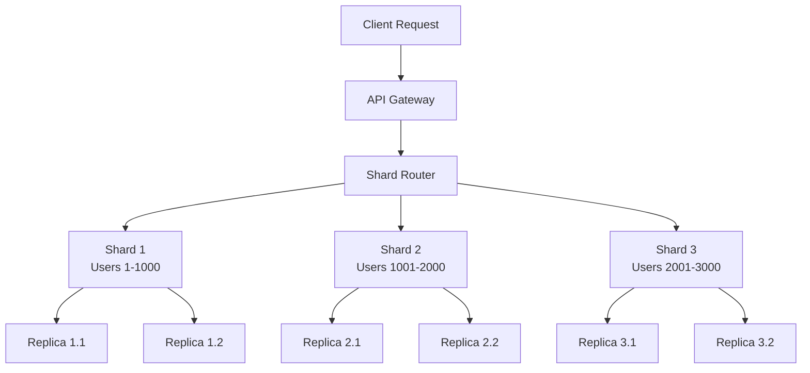
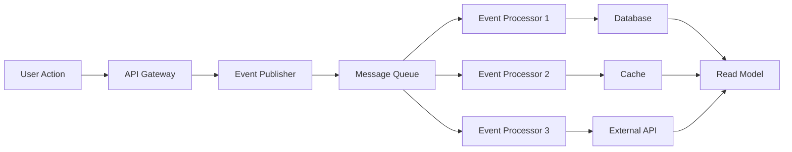

---
# Auto-generated front matter
Title: System-Design-Videos
LastUpdated: 2025-11-06T20:45:58.494035
Tags: []
Status: draft
---

# System Design Video Notes - Asli Engineering Channel

## 📚 Playlist Overview

This document contains comprehensive notes from the Asli Engineering YouTube channel, covering system design concepts, patterns, and implementations for interview preparation.

## 🎯 Core System Design Concepts

### 1. Scalability Fundamentals

**Video: "System Design Basics - Scalability Patterns"**

#### Key Takeaways

- **Horizontal vs Vertical Scaling**: Understanding when to scale out vs scale up
- **Load Balancing**: Different strategies (Round Robin, Weighted, Least Connections)
- **Database Sharding**: Horizontal partitioning strategies
- **Caching Strategies**: Multi-level caching (L1, L2, CDN)

#### Theory Explanation

```
Scalability = Ability to handle increased load by adding resources

Vertical Scaling (Scale Up):
- Add more CPU, RAM, Storage to existing machine
- Pros: Simple, no code changes
- Cons: Hardware limits, single point of failure

Horizontal Scaling (Scale Out):
- Add more machines to the system
- Pros: No hardware limits, fault tolerance
- Cons: Complex, requires load balancing
```

#### Implementation in Golang

```go
package main

import (
    "context"
    "fmt"
    "net/http"
    "sync"
    "time"
)

// LoadBalancer interface
type LoadBalancer interface {
    SelectServer(servers []Server) Server
}

// Round Robin Load Balancer
type RoundRobinLB struct {
    current int
    mutex   sync.Mutex
}

func (rr *RoundRobinLB) SelectServer(servers []Server) Server {
    rr.mutex.Lock()
    defer rr.mutex.Unlock()

    if len(servers) == 0 {
        return nil
    }

    server := servers[rr.current]
    rr.current = (rr.current + 1) % len(servers)
    return server
}

// Health Check for servers
type HealthChecker struct {
    interval time.Duration
    timeout  time.Duration
}

func (hc *HealthChecker) CheckHealth(server Server) bool {
    client := &http.Client{Timeout: hc.timeout}
    resp, err := client.Get(server.HealthEndpoint())
    return err == nil && resp.StatusCode == 200
}
```

#### Implementation in Node.js

```javascript
class LoadBalancer {
  constructor(strategy = "roundRobin") {
    this.strategy = strategy;
    this.servers = [];
    this.currentIndex = 0;
  }

  addServer(server) {
    this.servers.push(server);
  }

  selectServer() {
    switch (this.strategy) {
      case "roundRobin":
        return this.roundRobin();
      case "leastConnections":
        return this.leastConnections();
      case "weighted":
        return this.weighted();
      default:
        return this.roundRobin();
    }
  }

  roundRobin() {
    const server = this.servers[this.currentIndex];
    this.currentIndex = (this.currentIndex + 1) % this.servers.length;
    return server;
  }

  leastConnections() {
    return this.servers.reduce((min, server) =>
      server.connections < min.connections ? server : min
    );
  }
}
```

### 2. Database Design Patterns

**Video: "Database Design for Scale - Sharding, Replication, and Consistency"**

#### Key Takeaways

- **Database Sharding**: Horizontal partitioning strategies
- **Replication**: Master-slave, master-master patterns
- **Consistency Models**: Strong, eventual, causal consistency
- **CAP Theorem**: Trade-offs between Consistency, Availability, Partition tolerance

#### Theory Explanation

```
Database Sharding Strategies:

1. Range-based Sharding:
   - Partition by value ranges (e.g., user_id 1-1000 → shard1)
   - Pros: Simple, efficient range queries
   - Cons: Hot spots, uneven distribution

2. Hash-based Sharding:
   - Partition by hash of key (e.g., hash(user_id) % num_shards)
   - Pros: Even distribution, no hot spots
   - Cons: Difficult range queries, rebalancing

3. Directory-based Sharding:
   - Lookup table maps keys to shards
   - Pros: Flexible, easy rebalancing
   - Cons: Single point of failure, lookup overhead
```

#### Mermaid Diagram: Database Sharding Architecture



#### Implementation in Golang

```go
package main

import (
    "crypto/md5"
    "fmt"
    "strconv"
)

type ShardRouter struct {
    shards []Shard
    numShards int
}

func NewShardRouter(numShards int) *ShardRouter {
    shards := make([]Shard, numShards)
    for i := 0; i < numShards; i++ {
        shards[i] = NewShard(i)
    }

    return &ShardRouter{
        shards: shards,
        numShards: numShards,
    }
}

func (sr *ShardRouter) GetShard(key string) Shard {
    hash := md5.Sum([]byte(key))
    shardIndex := int(hash[0]) % sr.numShards
    return sr.shards[shardIndex]
}

func (sr *ShardRouter) Write(key string, value interface{}) error {
    shard := sr.GetShard(key)
    return shard.Write(key, value)
}

func (sr *ShardRouter) Read(key string) (interface{}, error) {
    shard := sr.GetShard(key)
    return shard.Read(key)
}
```

### 3. Caching Strategies

**Video: "Caching Patterns - From L1 to CDN"**

#### Key Takeaways

- **Cache Levels**: L1 (CPU), L2 (Memory), L3 (Distributed), CDN
- **Cache Patterns**: Cache-Aside, Write-Through, Write-Behind
- **Cache Eviction**: LRU, LFU, TTL-based
- **Cache Invalidation**: Time-based, Event-based, Manual

#### Theory Explanation

```
Cache Hierarchy:
L1 Cache (CPU) → L2 Cache (Memory) → L3 Cache (Distributed) → Database

Cache Patterns:

1. Cache-Aside (Lazy Loading):
   - Application manages cache
   - Check cache first, if miss, load from DB and cache
   - Pros: Simple, flexible
   - Cons: Cache miss penalty, potential inconsistency

2. Write-Through:
   - Write to both cache and DB simultaneously
   - Pros: Data consistency, cache always fresh
   - Cons: Higher latency, more DB writes

3. Write-Behind (Write-Back):
   - Write to cache immediately, DB asynchronously
   - Pros: Low latency, high throughput
   - Cons: Data loss risk, complex implementation
```

#### Implementation in Node.js

```javascript
class CacheManager {
  constructor() {
    this.l1Cache = new Map(); // In-memory cache
    this.l2Cache = new Redis(); // Distributed cache
    this.cacheLevels = ["l1", "l2", "database"];
  }

  async get(key) {
    // Try L1 cache first
    if (this.l1Cache.has(key)) {
      return this.l1Cache.get(key);
    }

    // Try L2 cache
    const l2Value = await this.l2Cache.get(key);
    if (l2Value) {
      this.l1Cache.set(key, l2Value);
      return l2Value;
    }

    // Load from database
    const dbValue = await this.loadFromDatabase(key);
    if (dbValue) {
      this.l1Cache.set(key, dbValue);
      await this.l2Cache.set(key, dbValue);
    }

    return dbValue;
  }

  async set(key, value, ttl = 3600) {
    // Write to all levels
    this.l1Cache.set(key, value);
    await this.l2Cache.setex(key, ttl, value);
    await this.writeToDatabase(key, value);
  }

  async invalidate(key) {
    this.l1Cache.delete(key);
    await this.l2Cache.del(key);
  }
}
```

### 4. Message Queues and Event Streaming

**Video: "Message Queues and Event-Driven Architecture"**

#### Key Takeaways

- **Message Queue Patterns**: Producer-Consumer, Pub-Sub, Request-Reply
- **Event Streaming**: Apache Kafka, AWS Kinesis
- **Message Ordering**: FIFO, Partition-based ordering
- **Dead Letter Queues**: Error handling and retry mechanisms

#### Theory Explanation

```
Message Queue Benefits:
- Decoupling: Producers and consumers are independent
- Scalability: Handle traffic spikes
- Reliability: Message persistence and delivery guarantees
- Asynchronous Processing: Non-blocking operations

Message Ordering Strategies:
1. Global Ordering: All messages in single queue
   - Pros: Simple, guaranteed order
   - Cons: Single point of failure, limited throughput

2. Partition-based Ordering: Messages grouped by key
   - Pros: Parallel processing, high throughput
   - Cons: Order only within partition
```

#### Mermaid Diagram: Event-Driven Architecture



#### Implementation in Golang

```go
package main

import (
    "context"
    "encoding/json"
    "fmt"
    "log"
    "time"
)

type Event struct {
    ID        string    `json:"id"`
    Type      string    `json:"type"`
    Data      interface{} `json:"data"`
    Timestamp time.Time `json:"timestamp"`
}

type EventPublisher struct {
    queue chan Event
}

func NewEventPublisher(bufferSize int) *EventPublisher {
    return &EventPublisher{
        queue: make(chan Event, bufferSize),
    }
}

func (ep *EventPublisher) Publish(event Event) error {
    select {
    case ep.queue <- event:
        return nil
    default:
        return fmt.Errorf("queue is full")
    }
}

func (ep *EventPublisher) Start(ctx context.Context) {
    go func() {
        for {
            select {
            case event := <-ep.queue:
                ep.processEvent(event)
            case <-ctx.Done():
                return
            }
        }
    }()
}

func (ep *EventPublisher) processEvent(event Event) {
    // Process event (e.g., send to external queue)
    log.Printf("Processing event: %+v", event)
}
```

### 5. Microservices Architecture

**Video: "Microservices Design Patterns and Best Practices"**

#### Key Takeaways

- **Service Decomposition**: Domain-driven design principles
- **Communication Patterns**: Synchronous (HTTP/gRPC) vs Asynchronous (Events)
- **Service Discovery**: How services find each other
- **Circuit Breaker**: Fault tolerance and resilience

#### Theory Explanation

```
Microservices Benefits:
- Independent Deployment: Deploy services separately
- Technology Diversity: Use different tech stacks
- Fault Isolation: Failure in one service doesn't affect others
- Team Autonomy: Teams can work independently

Communication Patterns:
1. Synchronous: Request-Response (HTTP, gRPC)
   - Pros: Simple, immediate response
   - Cons: Tight coupling, cascading failures

2. Asynchronous: Event-driven (Message Queues)
   - Pros: Loose coupling, fault tolerance
   - Cons: Complex, eventual consistency
```

#### Implementation in Node.js

```javascript
class MicroserviceManager {
  constructor() {
    this.services = new Map();
    this.serviceRegistry = new ServiceRegistry();
    this.circuitBreaker = new CircuitBreaker();
  }

  async callService(serviceName, method, data) {
    try {
      const service = await this.serviceRegistry.getService(serviceName);

      if (this.circuitBreaker.isOpen(serviceName)) {
        throw new Error("Circuit breaker is open");
      }

      const result = await this.makeRequest(service, method, data);
      this.circuitBreaker.recordSuccess(serviceName);
      return result;
    } catch (error) {
      this.circuitBreaker.recordFailure(serviceName);
      throw error;
    }
  }

  async makeRequest(service, method, data) {
    const response = await fetch(`${service.url}/${method}`, {
      method: "POST",
      headers: { "Content-Type": "application/json" },
      body: JSON.stringify(data),
    });

    if (!response.ok) {
      throw new Error(`Service call failed: ${response.statusText}`);
    }

    return response.json();
  }
}

class CircuitBreaker {
  constructor() {
    this.states = new Map(); // serviceName -> state
    this.failureCounts = new Map();
    this.lastFailureTimes = new Map();
  }

  isOpen(serviceName) {
    const state = this.states.get(serviceName) || "CLOSED";
    return state === "OPEN";
  }

  recordSuccess(serviceName) {
    this.states.set(serviceName, "CLOSED");
    this.failureCounts.set(serviceName, 0);
  }

  recordFailure(serviceName) {
    const count = (this.failureCounts.get(serviceName) || 0) + 1;
    this.failureCounts.set(serviceName, count);

    if (count >= 5) {
      // Threshold
      this.states.set(serviceName, "OPEN");
      this.lastFailureTimes.set(serviceName, Date.now());

      // Auto-reset after timeout
      setTimeout(() => {
        this.states.set(serviceName, "HALF_OPEN");
      }, 60000); // 1 minute
    }
  }
}
```

## 🎯 Interview Preparation Tips

### Common System Design Questions

1. **Design a URL Shortener** (like bit.ly)
2. **Design a Chat System** (like WhatsApp)
3. **Design a Social Media Feed** (like Twitter)
4. **Design a Video Streaming Platform** (like YouTube)
5. **Design a Search Engine** (like Google)
6. **Design a Payment System** (like Stripe)
7. **Design a Notification System**
8. **Design a File Storage System** (like Dropbox)

### Interview Process

1. **Clarify Requirements**: Ask about scale, features, constraints
2. **Estimate Scale**: Users, requests per second, data size
3. **High-Level Design**: Draw the overall architecture
4. **Deep Dive**: Focus on specific components
5. **Scale Up**: Discuss how to handle 10x, 100x traffic
6. **Trade-offs**: Discuss pros/cons of different approaches

### Key Metrics to Remember

- **Latency**: 95th percentile response time
- **Throughput**: Requests per second
- **Availability**: 99.9% uptime
- **Consistency**: Data consistency guarantees
- **Durability**: Data persistence guarantees

## 📚 Additional Resources

### Recommended Videos from Asli Engineering

1. "System Design Interview - Step by Step Guide"
2. "Database Sharding Strategies Explained"
3. "Caching Patterns for High-Performance Systems"
4. "Microservices Communication Patterns"
5. "Event-Driven Architecture Best Practices"
6. "Load Balancing Strategies and Algorithms"
7. "Message Queue Design and Implementation"
8. "API Gateway Design Patterns"
9. "Distributed Systems Consistency Models"
10. "Monitoring and Observability in Distributed Systems"

### Practice Problems

- [System Design Interview Questions](https://github.com/donnemartin/system-design-primer/)
- [High Scalability Case Studies](http://highscalability.com/)
- [Designing Data-Intensive Applications](https://dataintensive.net/)

---

_This document is continuously updated with new video notes and insights from the Asli Engineering channel._
