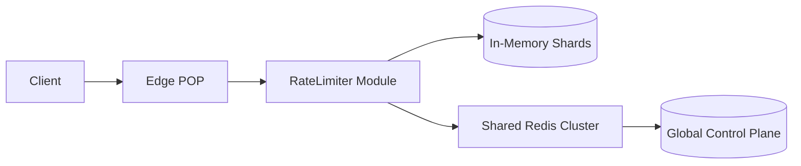

---
# Auto-generated front matter
Title: Faang Prompt Answers
LastUpdated: 2025-11-06T20:45:57.733954
Tags: []
Status: draft
---

# Exemplar System Design Answers (First 5 Prompts)

Front matter omitted for brevity; add before publishing.

---
## 1. Global Rate Limiter API Edge

### Problem Framing
Global rate limiting across multi-region API edges with tenant isolation and burst absorption.

### Requirements
| Type | Requirement |
|------|-------------|
| Functional | Enforce per-tenant QPS, global sliding window |
| Functional | Support emergency override (manual raise) |
| Functional | Provide metrics endpoint for monitoring |
| Non-Functional | p99 latency overhead < 8ms |
| Non-Functional | Accuracy drift < 2% under peak |
| Scale | 200K tenants, 50K peak RPS per tenant spikes |

### Capacity Planning (Example)
- Peak global RPS: 200K tenants * avg 10 RPS = 2M RPS (baseline); bursts to 5M RPS.
- Token state: approx 64 bytes per tenant (~12.8MB in memory) + replication logs.

### Architecture (Mermaid)

### Flow
1. Edge receives request; extracts tenant key.
2. Local shard check (fast path) – if tokens available: decrement & proceed.
3. If shard uncertain (sync lag) -> fallback to Redis atomic script.
4. Emit metrics + periodic reconciliation.

### Trade-offs
| Option | Pros | Cons |
|--------|------|------|
| Central Redis only | Simple | Higher cross-region latency |
| Local shard + async sync | Low latency | Complexity, eventual drift |

### Failure Modes
- Redis partition -> degrade to local shard soft limits.
- Shard desync -> periodic reconciliation job rebalances tokens.

### Evolution
- V1: Coarse per-tenant limits.
- V2: Endpoint + method dimension.
- V3: Dynamic limit adaptation (ML-informed).

---
## 2. Real-Time Notification Fan-out Service

### Highlights
Multi-channel delivery (push, email, SMS) with retry, prioritization, batching.

### Key Components
- Ingestion API
- Priority queue (Kafka + topic per class)
- Channel workers (per medium)
- Retry & DLQ subsystem
- Metrics & tracing exporter

### SLOs
| Metric | Target |
|--------|--------|
| Push p95 | < 150ms |
| Email p95 | < 2s |
| SMS success | > 99% |

### Simplified Data Flow
1. Producer publishes event (user_id, channel set, template_id).
2. Prioritizer assigns queue.
3. Workers fetch, render template, send via provider.
4. Failure -> retry with exponential jitter; after N attempts -> DLQ.

### Scaling Strategy
- Horizontal worker autoscaling based on lag + latency.
- Template cache in memory with version stamps.

### Resilience Patterns
- Circuit breaker per provider.
- Bulkhead isolation by channel.

### Evolution
Add user preference aggregation, per-user rate caps, adaptive quiet hours.

---
## 3. Payment Gateway & Ledger (High-Level)

### Core Concerns
Idempotency, ledger consistency, failure recovery, reconciliation.

### Data Entities
- payments(id, status, amount, currency, idempotency_key)
- ledger_entries(id, payment_id, type, delta_amount, created_at)

### Sequence
1. Validate + idempotency check.
2. Reserve funds (downstream call).
3. Write payment row (pending).
4. Append ledger entry (atomic DB txn).
5. Emit event.

### Idempotency Approach
- Unique constraint (idempotency_key + user_id).
- Replay returns existing payment state.

### Failure Recovery
- Outbox pattern ensures events only after commit.
- Reconciliation job aggregates daily mismatches.

### Performance Targets
| Metric | Goal |
|--------|-----|
| p99 create latency | < 250ms |
| double-spend errors | 0 |
| reconciliation diff | < 0.1% |

### Evolution
Add fraud scoring synchronous hook; multi-currency scaling; regional replication.

---
## 4. Multi-Region Config Distribution

### Pattern
Primary strong writes + eventual read replicas; versioned items with audit trail.

### Read Path
Edge cache -> regional Redis -> fallback primary.

### Consistency Strategy
- Version field increment -> publish invalidation message.
- Secondary regions apply updates asynchronously (target lag p95 < 5s).

### Failure Mode Handling
- Primary unreachable: reads continue (stale), writes queued.
- Replication lag spike: alert + throttle write bursts.

### Evolution
Add diff-based replication; config grouping; per-region overrides.

---
## 5. Feature Flag Platform with Experimentation

### Core Features
Flag definition, variant allocation, targeting rules, exposure logging, realtime invalidation.

### Request Flow
1. SDK request -> fetch flag set (cache).
2. Evaluate targeting rules (compiled JSON AST).
3. Variant decision (weighted RNG with deterministic seed for repeatability).
4. Exposure event buffered + batch flush.

### Data Integrity
- Schema versioning for rules.
- Exposure events idempotent via (user_id, flag_id, session_id).

### Key Metrics
| Metric | Target |
|--------|--------|
| Flag eval p99 | < 50ms |
| Exposure loss | < 0.5% |
| Invalidation latency | < 2s global |

### Evolution
Add experiment analysis service (false positive guardrails), multi-tenant isolation, dynamic rollout scripts.

---
## Answer Template Recap
Follow: Problem Framing → Requirements → Capacity → Architecture → Flow → Trade-offs → Failure Modes → Evolution → Metrics.
