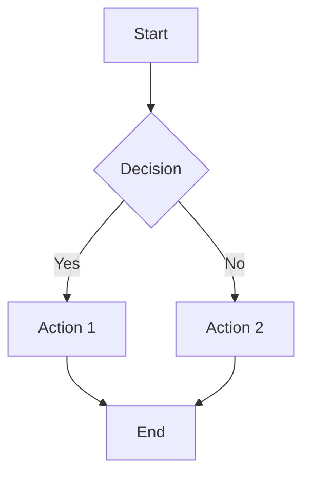
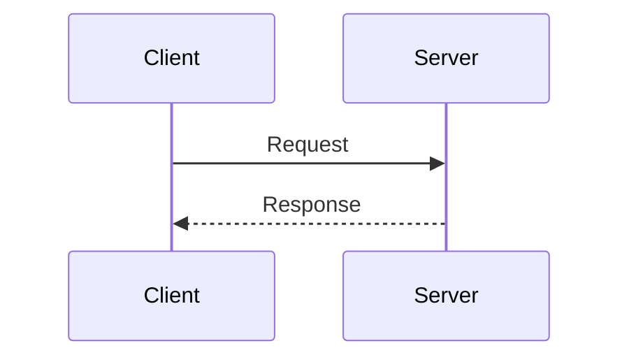
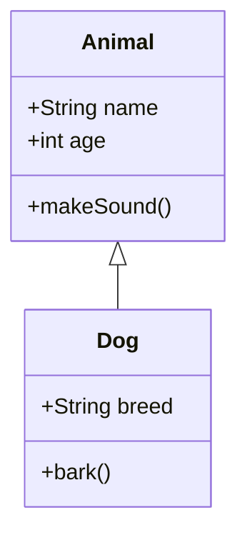
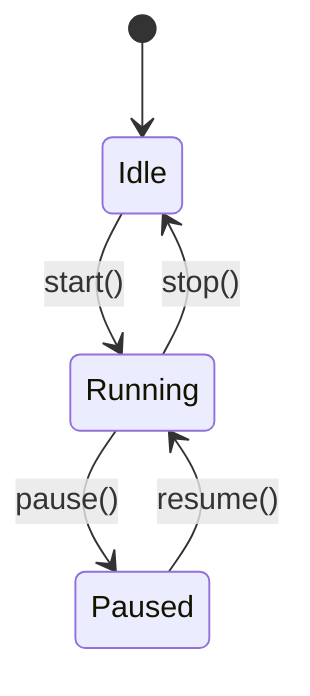
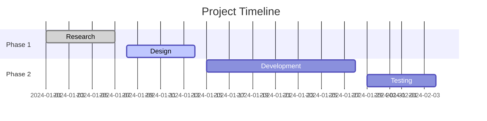
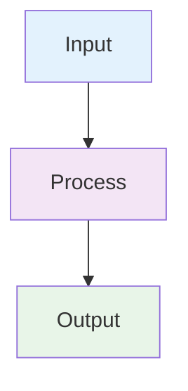
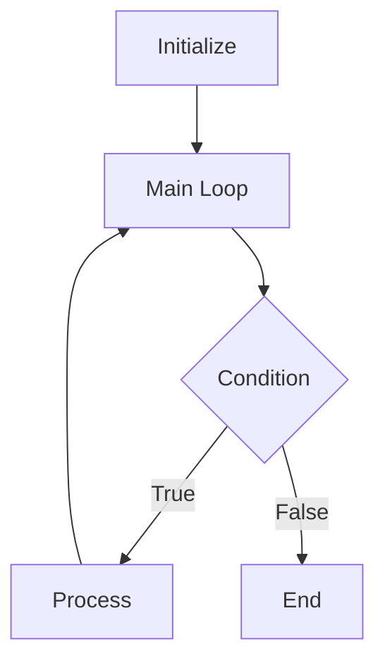
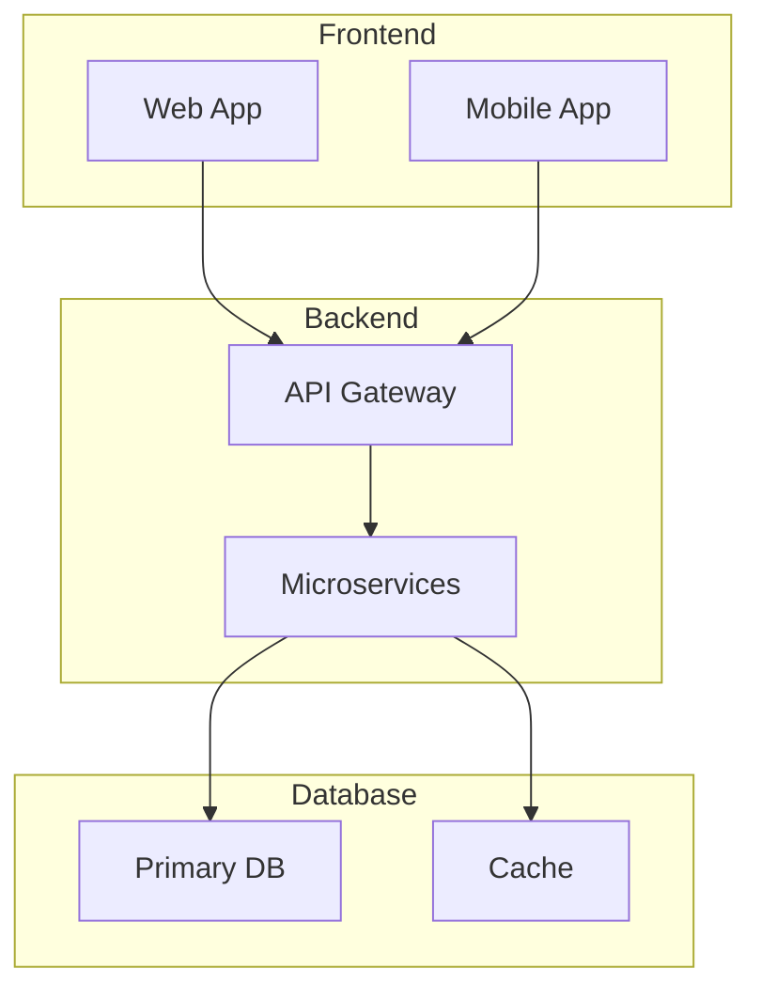
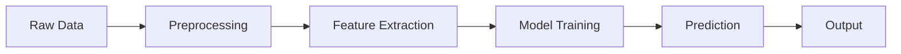

# Mermaid Diagrams Guide

## Overview

This guide explains how to use Mermaid diagrams throughout the Master Engineer Curriculum. Mermaid diagrams provide visual representations of complex concepts, making them easier to understand and remember.

## Installation Instructions

### VS Code Extension
1. Open VS Code
2. Go to Extensions (Ctrl+Shift+X)
3. Search for "Mermaid Preview" by Matt Bierner
4. Install the extension
5. Open any `.md` file with Mermaid diagrams
6. Use Ctrl+Shift+P and search "Mermaid: Preview" to see rendered diagrams

### Alternative: Online Mermaid Editor
- Visit [Mermaid Live Editor](https://mermaid.live/)
- Copy and paste Mermaid code to see rendered diagrams
- Export as PNG, SVG, or PDF

## Diagram Types Used in Curriculum

### 1. Flowcharts

### 2. Sequence Diagrams

### 3. Class Diagrams

### 4. State Diagrams

### 5. Gantt Charts

## Styling Guidelines

### Color Scheme
- **Blue (#e3f2fd)**: Input/Start nodes
- **Purple (#f3e5f5)**: Processing/Computation nodes
- **Green (#e8f5e8)**: Output/Success nodes
- **Orange (#fff3e0)**: Warning/Decision nodes
- **Red (#ffcdd2)**: Error/Failure nodes
- **Yellow (#ffeb3b)**: Important/Highlight nodes

### Example with Styling

## Common Patterns in Curriculum

### 1. Algorithm Flow

### 2. System Architecture

### 3. Data Flow

## Best Practices

1. **Keep diagrams simple**: Avoid overcrowding with too many elements
2. **Use consistent styling**: Apply the same color scheme throughout
3. **Add meaningful labels**: Use descriptive text for nodes and edges
4. **Group related elements**: Use subgraphs for logical grouping
5. **Test diagrams**: Always verify diagrams render correctly

## Troubleshooting

### Common Issues
1. **Syntax errors**: Check for missing semicolons, brackets, or quotes
2. **Rendering issues**: Ensure proper indentation and spacing
3. **Complex diagrams**: Break large diagrams into smaller, focused ones

### Validation
- Use [Mermaid Live Editor](https://mermaid.live/) to validate syntax
- Check for proper node and edge definitions
- Verify all references are properly defined

## Integration with Curriculum

All curriculum modules include Mermaid diagrams for:
- **Conceptual understanding**: Visual representation of abstract concepts
- **Algorithm visualization**: Step-by-step process flows
- **System architecture**: Component relationships and interactions
- **Data structures**: Visual representation of data organization
- **Process flows**: Workflow and decision trees

## Resources

- [Mermaid Documentation](https://mermaid-js.github.io/mermaid/)
- [Mermaid Live Editor](https://mermaid.live/)
- [Mermaid Examples](https://mermaid-js.github.io/mermaid/#/examples/)
- [VS Code Mermaid Extension](https://marketplace.visualstudio.com/items?itemName=bierner.markdown-mermaid/)

---

**Next**: [Phase 0 Fundamentals](phase0_fundamentals/README.md) | **Previous**: [Curriculum Overview](README.md) | **Up**: [Master Engineer Curriculum](README.md)
