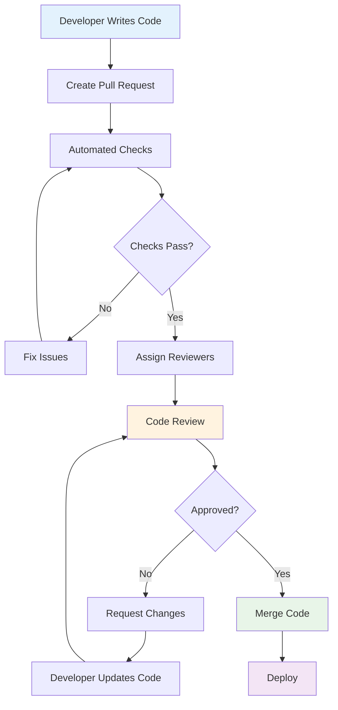
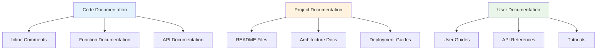

---
# Auto-generated front matter
Title: Code-Quality
LastUpdated: 2025-11-06T20:45:58.420278
Tags: []
Status: draft
---

# Code Quality

## Overview

This module covers code quality practices including code review, documentation, coding standards, and refactoring techniques. These concepts are essential for maintaining high-quality, maintainable code.

## Table of Contents

1. [Code Review](#code-review)
2. [Documentation](#documentation)
3. [Coding Standards](#coding-standards)
4. [Refactoring](#refactoring)
5. [Applications](#applications)
6. [Complexity Analysis](#complexity-analysis)
7. [Follow-up Questions](#follow-up-questions)

## Code Review

### Theory

Code review is the systematic examination of code by developers other than the author. It helps catch bugs, improve code quality, and share knowledge across the team.

### Code Review Process Diagram



### Code Review Implementation

#### Golang Implementation

```go
package main

import (
    "fmt"
    "strings"
    "time"
)

type CodeReview struct {
    ID          int
    Title       string
    Description string
    Author      string
    Reviewers   []string
    Status      string
    CreatedAt   time.Time
    UpdatedAt   time.Time
    Comments    []ReviewComment
    Files       []ReviewFile
}

type ReviewComment struct {
    ID        int
    File      string
    Line      int
    Content   string
    Author    string
    Type      string // "suggestion", "question", "issue"
    Resolved  bool
    CreatedAt time.Time
}

type ReviewFile struct {
    Path        string
    Changes     []FileChange
    Comments    []ReviewComment
    Status      string
}

type FileChange struct {
    LineNumber int
    OldContent string
    NewContent string
    Type       string // "added", "modified", "deleted"
}

type CodeReviewer struct {
    Reviews    []CodeReview
    mutex      sync.RWMutex
    nextID     int
}

func NewCodeReviewer() *CodeReviewer {
    return &CodeReviewer{
        Reviews: make([]CodeReview, 0),
    }
}

func (cr *CodeReviewer) CreateReview(title, description, author string, files []ReviewFile) *CodeReview {
    cr.mutex.Lock()
    defer cr.mutex.Unlock()
    
    review := &CodeReview{
        ID:          cr.nextID,
        Title:       title,
        Description: description,
        Author:      author,
        Reviewers:   make([]string, 0),
        Status:      "open",
        CreatedAt:   time.Now(),
        UpdatedAt:   time.Now(),
        Comments:    make([]ReviewComment, 0),
        Files:       files,
    }
    
    cr.nextID++
    cr.Reviews = append(cr.Reviews, *review)
    
    return review
}

func (cr *CodeReviewer) AddReviewer(reviewID int, reviewer string) bool {
    cr.mutex.Lock()
    defer cr.mutex.Unlock()
    
    for i, review := range cr.Reviews {
        if review.ID == reviewID {
            cr.Reviews[i].Reviewers = append(cr.Reviews[i].Reviewers, reviewer)
            cr.Reviews[i].UpdatedAt = time.Now()
            return true
        }
    }
    
    return false
}

func (cr *CodeReviewer) AddComment(reviewID int, comment ReviewComment) bool {
    cr.mutex.Lock()
    defer cr.mutex.Unlock()
    
    for i, review := range cr.Reviews {
        if review.ID == reviewID {
            comment.ID = len(review.Comments) + 1
            comment.CreatedAt = time.Now()
            cr.Reviews[i].Comments = append(cr.Reviews[i].Comments, comment)
            cr.Reviews[i].UpdatedAt = time.Now()
            return true
        }
    }
    
    return false
}

func (cr *CodeReviewer) ResolveComment(reviewID, commentID int) bool {
    cr.mutex.Lock()
    defer cr.mutex.Unlock()
    
    for i, review := range cr.Reviews {
        if review.ID == reviewID {
            for j, comment := range review.Comments {
                if comment.ID == commentID {
                    cr.Reviews[i].Comments[j].Resolved = true
                    cr.Reviews[i].UpdatedAt = time.Now()
                    return true
                }
            }
        }
    }
    
    return false
}

func (cr *CodeReviewer) ApproveReview(reviewID int, reviewer string) bool {
    cr.mutex.Lock()
    defer cr.mutex.Unlock()
    
    for i, review := range cr.Reviews {
        if review.ID == reviewID {
            // Check if reviewer is assigned
            for _, assignedReviewer := range review.Reviewers {
                if assignedReviewer == reviewer {
                    cr.Reviews[i].Status = "approved"
                    cr.Reviews[i].UpdatedAt = time.Now()
                    return true
                }
            }
        }
    }
    
    return false
}

func (cr *CodeReviewer) RequestChanges(reviewID int, reviewer string) bool {
    cr.mutex.Lock()
    defer cr.mutex.Unlock()
    
    for i, review := range cr.Reviews {
        if review.ID == reviewID {
            for _, assignedReviewer := range review.Reviewers {
                if assignedReviewer == reviewer {
                    cr.Reviews[i].Status = "changes_requested"
                    cr.Reviews[i].UpdatedAt = time.Now()
                    return true
                }
            }
        }
    }
    
    return false
}

func (cr *CodeReviewer) GetReview(reviewID int) *CodeReview {
    cr.mutex.RLock()
    defer cr.mutex.RUnlock()
    
    for _, review := range cr.Reviews {
        if review.ID == reviewID {
            return &review
        }
    }
    
    return nil
}

func (cr *CodeReviewer) GetReviewsByAuthor(author string) []CodeReview {
    cr.mutex.RLock()
    defer cr.mutex.RUnlock()
    
    var reviews []CodeReview
    for _, review := range cr.Reviews {
        if review.Author == author {
            reviews = append(reviews, review)
        }
    }
    
    return reviews
}

func (cr *CodeReviewer) GetReviewsByReviewer(reviewer string) []CodeReview {
    cr.mutex.RLock()
    defer cr.mutex.RUnlock()
    
    var reviews []CodeReview
    for _, review := range cr.Reviews {
        for _, assignedReviewer := range review.Reviewers {
            if assignedReviewer == reviewer {
                reviews = append(reviews, review)
                break
            }
        }
    }
    
    return reviews
}

func (cr *CodeReviewer) GetReviewStats() map[string]interface{} {
    cr.mutex.RLock()
    defer cr.mutex.RUnlock()
    
    totalReviews := len(cr.Reviews)
    openReviews := 0
    approvedReviews := 0
    changesRequested := 0
    totalComments := 0
    
    for _, review := range cr.Reviews {
        switch review.Status {
        case "open":
            openReviews++
        case "approved":
            approvedReviews++
        case "changes_requested":
            changesRequested++
        }
        totalComments += len(review.Comments)
    }
    
    return map[string]interface{}{
        "total_reviews":        totalReviews,
        "open_reviews":         openReviews,
        "approved_reviews":     approvedReviews,
        "changes_requested":    changesRequested,
        "total_comments":       totalComments,
    }
}

func main() {
    fmt.Println("Code Review Demo:")
    
    reviewer := NewCodeReviewer()
    
    // Create a code review
    files := []ReviewFile{
        {
            Path: "src/main.go",
            Changes: []FileChange{
                {
                    LineNumber: 10,
                    OldContent: "func oldFunction() {",
                    NewContent: "func newFunction() {",
                    Type:       "modified",
                },
            },
            Status: "modified",
        },
    }
    
    review := reviewer.CreateReview(
        "Refactor user authentication",
        "Refactored the user authentication logic to improve security and maintainability",
        "john.doe",
        files,
    )
    
    fmt.Printf("Created review %d: %s\n", review.ID, review.Title)
    
    // Add reviewers
    reviewer.AddReviewer(review.ID, "jane.smith")
    reviewer.AddReviewer(review.ID, "bob.wilson")
    
    // Add comments
    reviewer.AddComment(review.ID, ReviewComment{
        File:    "src/main.go",
        Line:    10,
        Content: "Consider adding error handling here",
        Author:  "jane.smith",
        Type:    "suggestion",
    })
    
    reviewer.AddComment(review.ID, ReviewComment{
        File:    "src/main.go",
        Line:    15,
        Content: "This looks good to me",
        Author:  "bob.wilson",
        Type:    "question",
    })
    
    // Approve review
    reviewer.ApproveReview(review.ID, "jane.smith")
    reviewer.ApproveReview(review.ID, "bob.wilson")
    
    // Get review details
    updatedReview := reviewer.GetReview(review.ID)
    if updatedReview != nil {
        fmt.Printf("Review status: %s\n", updatedReview.Status)
        fmt.Printf("Number of comments: %d\n", len(updatedReview.Comments))
    }
    
    // Get stats
    stats := reviewer.GetReviewStats()
    fmt.Printf("Review stats: %+v\n", stats)
}
```

## Documentation

### Theory

Good documentation is essential for code maintainability. It includes code comments, API documentation, README files, and architectural documentation.

### Documentation Types Diagram



### Documentation Implementation

#### Golang Implementation

```go
package main

import (
    "fmt"
    "strings"
    "time"
)

type Documentation struct {
    ID          int
    Title       string
    Content     string
    Type        string // "code", "api", "user", "architecture"
    Language    string
    Author      string
    CreatedAt   time.Time
    UpdatedAt   time.Time
    Version     string
    Tags        []string
}

type DocumentationManager struct {
    Docs    []Documentation
    mutex   sync.RWMutex
    nextID  int
}

func NewDocumentationManager() *DocumentationManager {
    return &DocumentationManager{
        Docs: make([]Documentation, 0),
    }
}

func (dm *DocumentationManager) CreateDocumentation(title, content, docType, language, author string) *Documentation {
    dm.mutex.Lock()
    defer dm.mutex.Unlock()
    
    doc := &Documentation{
        ID:        dm.nextID,
        Title:     title,
        Content:   content,
        Type:      docType,
        Language:  language,
        Author:    author,
        CreatedAt: time.Now(),
        UpdatedAt: time.Now(),
        Version:   "1.0.0",
        Tags:      make([]string, 0),
    }
    
    dm.nextID++
    dm.Docs = append(dm.Docs, *doc)
    
    return doc
}

func (dm *DocumentationManager) UpdateDocumentation(docID int, content string) bool {
    dm.mutex.Lock()
    defer dm.mutex.Unlock()
    
    for i, doc := range dm.Docs {
        if doc.ID == docID {
            dm.Docs[i].Content = content
            dm.Docs[i].UpdatedAt = time.Now()
            dm.Docs[i].Version = dm.incrementVersion(doc.Version)
            return true
        }
    }
    
    return false
}

func (dm *DocumentationManager) incrementVersion(version string) string {
    // Simple version increment (in real implementation, use proper semver)
    parts := strings.Split(version, ".")
    if len(parts) >= 3 {
        // Increment patch version
        return fmt.Sprintf("%s.%s.%s", parts[0], parts[1], "1")
    }
    return "1.0.1"
}

func (dm *DocumentationManager) AddTag(docID int, tag string) bool {
    dm.mutex.Lock()
    defer dm.mutex.Unlock()
    
    for i, doc := range dm.Docs {
        if doc.ID == docID {
            dm.Docs[i].Tags = append(dm.Docs[i].Tags, tag)
            dm.Docs[i].UpdatedAt = time.Now()
            return true
        }
    }
    
    return false
}

func (dm *DocumentationManager) SearchDocumentation(query string) []Documentation {
    dm.mutex.RLock()
    defer dm.mutex.RUnlock()
    
    var results []Documentation
    query = strings.ToLower(query)
    
    for _, doc := range dm.Docs {
        if strings.Contains(strings.ToLower(doc.Title), query) ||
           strings.Contains(strings.ToLower(doc.Content), query) {
            results = append(results, doc)
        }
    }
    
    return results
}

func (dm *DocumentationManager) GetDocumentationByType(docType string) []Documentation {
    dm.mutex.RLock()
    defer dm.mutex.RUnlock()
    
    var results []Documentation
    for _, doc := range dm.Docs {
        if doc.Type == docType {
            results = append(results, doc)
        }
    }
    
    return results
}

func (dm *DocumentationManager) GetDocumentationByLanguage(language string) []Documentation {
    dm.mutex.RLock()
    defer dm.mutex.RUnlock()
    
    var results []Documentation
    for _, doc := range dm.Docs {
        if doc.Language == language {
            results = append(results, doc)
        }
    }
    
    return results
}

func (dm *DocumentationManager) GenerateAPIDocumentation(code string) string {
    // Simple API documentation generation
    lines := strings.Split(code, "\n")
    var apiDoc strings.Builder
    
    apiDoc.WriteString("# API Documentation\n\n")
    
    for i, line := range lines {
        if strings.Contains(line, "func ") && strings.Contains(line, "(") {
            // Extract function signature
            funcName := dm.extractFunctionName(line)
            if funcName != "" {
                apiDoc.WriteString(fmt.Sprintf("## %s\n\n", funcName))
                apiDoc.WriteString(fmt.Sprintf("**Line %d**\n\n", i+1))
                apiDoc.WriteString("```go\n")
                apiDoc.WriteString(strings.TrimSpace(line))
                apiDoc.WriteString("\n```\n\n")
            }
        }
    }
    
    return apiDoc.String()
}

func (dm *DocumentationManager) extractFunctionName(line string) string {
    // Simple function name extraction
    if strings.Contains(line, "func ") {
        parts := strings.Fields(line)
        for i, part := range parts {
            if part == "func" && i+1 < len(parts) {
                funcName := parts[i+1]
                // Remove parentheses and parameters
                if idx := strings.Index(funcName, "("); idx != -1 {
                    funcName = funcName[:idx]
                }
                return funcName
            }
        }
    }
    return ""
}

func (dm *DocumentationManager) GetDocumentationStats() map[string]interface{} {
    dm.mutex.RLock()
    defer dm.mutex.RUnlock()
    
    totalDocs := len(dm.Docs)
    typeCount := make(map[string]int)
    languageCount := make(map[string]int)
    
    for _, doc := range dm.Docs {
        typeCount[doc.Type]++
        languageCount[doc.Language]++
    }
    
    return map[string]interface{}{
        "total_docs":     totalDocs,
        "by_type":        typeCount,
        "by_language":    languageCount,
    }
}

func main() {
    fmt.Println("Documentation Management Demo:")
    
    dm := NewDocumentationManager()
    
    // Create documentation
    doc1 := dm.CreateDocumentation(
        "User Authentication API",
        "This API provides user authentication functionality including login, logout, and token management.",
        "api",
        "go",
        "john.doe",
    )
    
    doc2 := dm.CreateDocumentation(
        "Database Schema",
        "Documentation for the database schema including tables, relationships, and indexes.",
        "architecture",
        "sql",
        "jane.smith",
    )
    
    // Add tags
    dm.AddTag(doc1.ID, "authentication")
    dm.AddTag(doc1.ID, "api")
    dm.AddTag(doc2.ID, "database")
    dm.AddTag(doc2.ID, "schema")
    
    // Search documentation
    results := dm.SearchDocumentation("authentication")
    fmt.Printf("Found %d documents for 'authentication'\n", len(results))
    
    // Get documentation by type
    apiDocs := dm.GetDocumentationByType("api")
    fmt.Printf("Found %d API documents\n", len(apiDocs))
    
    // Generate API documentation from code
    sampleCode := `
func Login(username, password string) (string, error) {
    // Implementation here
    return "token", nil
}

func Logout(token string) error {
    // Implementation here
    return nil
}
`
    
    apiDoc := dm.GenerateAPIDocumentation(sampleCode)
    fmt.Printf("Generated API documentation:\n%s\n", apiDoc)
    
    // Get stats
    stats := dm.GetDocumentationStats()
    fmt.Printf("Documentation stats: %+v\n", stats)
}
```

## Follow-up Questions

### 1. Code Review
**Q: What are the key benefits of code review?**
A: Code review helps catch bugs early, improves code quality, shares knowledge across the team, and ensures coding standards compliance.

### 2. Documentation
**Q: What types of documentation are most important for a software project?**
A: API documentation, README files, code comments, architecture documentation, and user guides are all important for different audiences.

### 3. Coding Standards
**Q: How do coding standards improve code quality?**
A: Coding standards ensure consistency, improve readability, reduce bugs, and make code easier to maintain and review.

## Complexity Analysis

| Operation | Code Review | Documentation | Coding Standards |
|-----------|-------------|---------------|------------------|
| Create | O(1) | O(1) | O(1) |
| Update | O(n) | O(n) | O(1) |
| Search | O(n) | O(n) | O(1) |
| Generate | N/A | O(n) | N/A |

## Applications

1. **Code Review**: Quality assurance, knowledge sharing, bug prevention
2. **Documentation**: Code maintainability, API usability, team onboarding
3. **Coding Standards**: Consistency, readability, maintainability
4. **Code Quality**: Software reliability, team productivity, technical debt reduction

---

**Next**: [Development Practices](development-practices.md) | **Previous**: [Software Engineering](README.md) | **Up**: [Software Engineering](README.md)


## Refactoring

<!-- AUTO-GENERATED ANCHOR: originally referenced as #refactoring -->

Placeholder content. Please replace with proper section.
