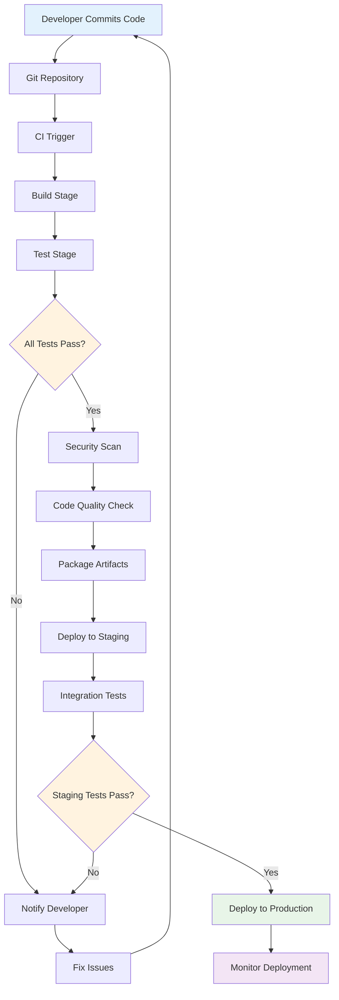
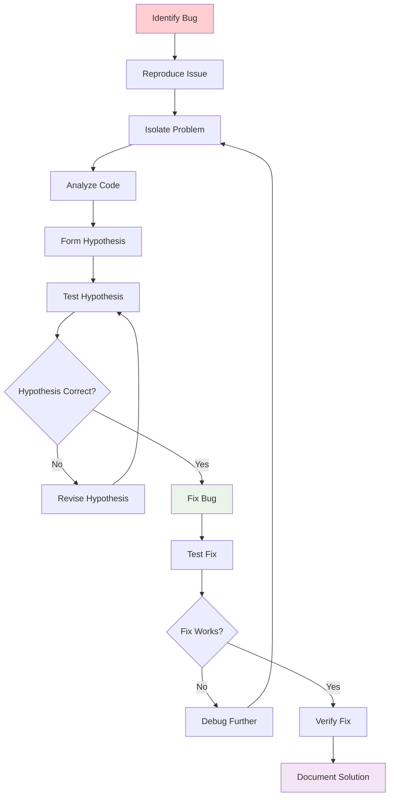

# Development Practices

## Overview

This module covers modern development practices including CI/CD, debugging, profiling, and performance optimization. These concepts are essential for efficient software development and deployment.

## Table of Contents

1. [Continuous Integration/Continuous Deployment](#continuous-integrationcontinuous-deployment)
2. [Debugging Techniques](#debugging-techniques)
3. [Performance Optimization](#performance-optimization)
4. [Monitoring and Logging](#monitoring-and-logging)
5. [Applications](#applications)
6. [Complexity Analysis](#complexity-analysis)
7. [Follow-up Questions](#follow-up-questions)

## Continuous Integration/Continuous Deployment

### Theory

CI/CD automates the process of integrating code changes, running tests, and deploying applications. It helps catch issues early and ensures reliable deployments.

### CI/CD Pipeline Diagram



### CI/CD Implementation

#### Golang Implementation

```go
package main

import (
    "fmt"
    "sync"
    "time"
)

type PipelineStage struct {
    Name        string
    Status      string // "pending", "running", "success", "failed"
    StartTime   time.Time
    EndTime     time.Time
    Duration    time.Duration
    Output      string
    Error       string
}

type CICDPipeline struct {
    ID          int
    Name        string
    Status      string
    Stages      []PipelineStage
    CreatedAt   time.Time
    UpdatedAt   time.Time
    Artifacts   []string
    mutex       sync.RWMutex
}

type CICDManager struct {
    Pipelines   []CICDPipeline
    mutex       sync.RWMutex
    nextID      int
}

func NewCICDManager() *CICDManager {
    return &CICDManager{
        Pipelines: make([]CICDPipeline, 0),
    }
}

func (cm *CICDManager) CreatePipeline(name string, stages []string) *CICDPipeline {
    cm.mutex.Lock()
    defer cm.mutex.Unlock()
    
    pipelineStages := make([]PipelineStage, len(stages))
    for i, stageName := range stages {
        pipelineStages[i] = PipelineStage{
            Name:   stageName,
            Status: "pending",
        }
    }
    
    pipeline := &CICDPipeline{
        ID:        cm.nextID,
        Name:      name,
        Status:    "pending",
        Stages:    pipelineStages,
        CreatedAt: time.Now(),
        UpdatedAt: time.Now(),
        Artifacts: make([]string, 0),
    }
    
    cm.nextID++
    cm.Pipelines = append(cm.Pipelines, *pipeline)
    
    return pipeline
}

func (cm *CICDManager) StartPipeline(pipelineID int) bool {
    cm.mutex.Lock()
    defer cm.mutex.Unlock()
    
    for i, pipeline := range cm.Pipelines {
        if pipeline.ID == pipelineID {
            cm.Pipelines[i].Status = "running"
            cm.Pipelines[i].UpdatedAt = time.Now()
            
            // Start pipeline execution
            go cm.executePipeline(&cm.Pipelines[i])
            
            return true
        }
    }
    
    return false
}

func (cm *CICDManager) executePipeline(pipeline *CICDPipeline) {
    for i := range pipeline.Stages {
        cm.mutex.Lock()
        pipeline.Stages[i].Status = "running"
        pipeline.Stages[i].StartTime = time.Now()
        cm.mutex.Unlock()
        
        // Simulate stage execution
        success := cm.executeStage(&pipeline.Stages[i])
        
        cm.mutex.Lock()
        pipeline.Stages[i].EndTime = time.Now()
        pipeline.Stages[i].Duration = pipeline.Stages[i].EndTime.Sub(pipeline.Stages[i].StartTime)
        
        if success {
            pipeline.Stages[i].Status = "success"
        } else {
            pipeline.Stages[i].Status = "failed"
            pipeline.Status = "failed"
            pipeline.UpdatedAt = time.Now()
            cm.mutex.Unlock()
            return
        }
        
        cm.mutex.Unlock()
    }
    
    // All stages completed successfully
    cm.mutex.Lock()
    pipeline.Status = "success"
    pipeline.UpdatedAt = time.Now()
    cm.mutex.Unlock()
}

func (cm *CICDManager) executeStage(stage *PipelineStage) bool {
    // Simulate different stage types
    switch stage.Name {
    case "build":
        return cm.executeBuildStage(stage)
    case "test":
        return cm.executeTestStage(stage)
    case "security-scan":
        return cm.executeSecurityScanStage(stage)
    case "deploy":
        return cm.executeDeployStage(stage)
    default:
        return cm.executeGenericStage(stage)
    }
}

func (cm *CICDManager) executeBuildStage(stage *PipelineStage) bool {
    // Simulate build process
    time.Sleep(2 * time.Second)
    
    // Simulate 90% success rate
    if time.Now().UnixNano()%10 < 9 {
        stage.Output = "Build completed successfully"
        return true
    } else {
        stage.Error = "Build failed: compilation error"
        return false
    }
}

func (cm *CICDManager) executeTestStage(stage *PipelineStage) bool {
    // Simulate test execution
    time.Sleep(3 * time.Second)
    
    // Simulate 95% success rate
    if time.Now().UnixNano()%20 < 19 {
        stage.Output = "All tests passed (42 tests, 0 failures)"
        return true
    } else {
        stage.Error = "Tests failed: 2 test failures"
        return false
    }
}

func (cm *CICDManager) executeSecurityScanStage(stage *PipelineStage) bool {
    // Simulate security scan
    time.Sleep(1 * time.Second)
    
    // Simulate 98% success rate
    if time.Now().UnixNano()%50 < 49 {
        stage.Output = "Security scan completed: no vulnerabilities found"
        return true
    } else {
        stage.Error = "Security scan failed: 1 high severity vulnerability found"
        return false
    }
}

func (cm *CICDManager) executeDeployStage(stage *PipelineStage) bool {
    // Simulate deployment
    time.Sleep(2 * time.Second)
    
    // Simulate 92% success rate
    if time.Now().UnixNano()%25 < 23 {
        stage.Output = "Deployment completed successfully"
        return true
    } else {
        stage.Error = "Deployment failed: service unavailable"
        return false
    }
}

func (cm *CICDManager) executeGenericStage(stage *PipelineStage) bool {
    // Simulate generic stage
    time.Sleep(1 * time.Second)
    
    stage.Output = fmt.Sprintf("Stage '%s' completed successfully", stage.Name)
    return true
}

func (cm *CICDManager) GetPipeline(pipelineID int) *CICDPipeline {
    cm.mutex.RLock()
    defer cm.mutex.RUnlock()
    
    for _, pipeline := range cm.Pipelines {
        if pipeline.ID == pipelineID {
            return &pipeline
        }
    }
    
    return nil
}

func (cm *CICDManager) GetPipelineStatus(pipelineID int) string {
    pipeline := cm.GetPipeline(pipelineID)
    if pipeline != nil {
        return pipeline.Status
    }
    return "not_found"
}

func (cm *CICDManager) GetPipelineStats() map[string]interface{} {
    cm.mutex.RLock()
    defer cm.mutex.RUnlock()
    
    totalPipelines := len(cm.Pipelines)
    successCount := 0
    failedCount := 0
    runningCount := 0
    
    for _, pipeline := range cm.Pipelines {
        switch pipeline.Status {
        case "success":
            successCount++
        case "failed":
            failedCount++
        case "running":
            runningCount++
        }
    }
    
    return map[string]interface{}{
        "total_pipelines":  totalPipelines,
        "success_count":    successCount,
        "failed_count":     failedCount,
        "running_count":    runningCount,
        "success_rate":     float64(successCount) / float64(totalPipelines) * 100,
    }
}

func main() {
    fmt.Println("CI/CD Pipeline Demo:")
    
    cm := NewCICDManager()
    
    // Create a pipeline
    stages := []string{"build", "test", "security-scan", "deploy"}
    pipeline := cm.CreatePipeline("Web Application Pipeline", stages)
    
    fmt.Printf("Created pipeline %d: %s\n", pipeline.ID, pipeline.Name)
    
    // Start pipeline
    if cm.StartPipeline(pipeline.ID) {
        fmt.Println("Pipeline started successfully")
        
        // Monitor pipeline status
        for i := 0; i < 10; i++ {
            status := cm.GetPipelineStatus(pipeline.ID)
            fmt.Printf("Pipeline status: %s\n", status)
            
            if status == "success" || status == "failed" {
                break
            }
            
            time.Sleep(1 * time.Second)
        }
        
        // Get final pipeline details
        finalPipeline := cm.GetPipeline(pipeline.ID)
        if finalPipeline != nil {
            fmt.Printf("\nPipeline Results:\n")
            fmt.Printf("Status: %s\n", finalPipeline.Status)
            fmt.Printf("Duration: %v\n", time.Since(finalPipeline.CreatedAt))
            
            for _, stage := range finalPipeline.Stages {
                fmt.Printf("Stage %s: %s (%v)\n", stage.Name, stage.Status, stage.Duration)
                if stage.Output != "" {
                    fmt.Printf("  Output: %s\n", stage.Output)
                }
                if stage.Error != "" {
                    fmt.Printf("  Error: %s\n", stage.Error)
                }
            }
        }
    }
    
    // Get pipeline stats
    stats := cm.GetPipelineStats()
    fmt.Printf("\nPipeline Stats: %+v\n", stats)
}
```

## Debugging Techniques

### Theory

Debugging is the process of finding and fixing bugs in software. Effective debugging requires systematic approaches, proper tools, and good practices.

### Debugging Process Diagram



### Debugging Implementation

#### Golang Implementation

```go
package main

import (
    "fmt"
    "runtime"
    "time"
)

type Debugger struct {
    Breakpoints map[string][]int
    Variables   map[string]interface{}
    CallStack   []string
    mutex       sync.RWMutex
}

type DebugSession struct {
    ID          int
    Program     string
    Status      string
    Breakpoints []Breakpoint
    Variables   map[string]interface{}
    CallStack   []string
    StartTime   time.Time
}

type Breakpoint struct {
    File        string
    Line        int
    Condition   string
    HitCount    int
    Enabled     bool
}

func NewDebugger() *Debugger {
    return &Debugger{
        Breakpoints: make(map[string][]int),
        Variables:   make(map[string]interface{}),
        CallStack:   make([]string, 0),
    }
}

func (d *Debugger) SetBreakpoint(file string, line int, condition string) {
    d.mutex.Lock()
    defer d.mutex.Unlock()
    
    if d.Breakpoints[file] == nil {
        d.Breakpoints[file] = make([]int, 0)
    }
    
    d.Breakpoints[file] = append(d.Breakpoints[file], line)
    
    fmt.Printf("Breakpoint set at %s:%d", file, line)
    if condition != "" {
        fmt.Printf(" (condition: %s)", condition)
    }
    fmt.Println()
}

func (d *Debugger) RemoveBreakpoint(file string, line int) {
    d.mutex.Lock()
    defer d.mutex.Unlock()
    
    if lines, exists := d.Breakpoints[file]; exists {
        for i, l := range lines {
            if l == line {
                d.Breakpoints[file] = append(lines[:i], lines[i+1:]...)
                fmt.Printf("Breakpoint removed from %s:%d\n", file, line)
                return
            }
        }
    }
}

func (d *Debugger) StepOver() {
    d.mutex.Lock()
    defer d.mutex.Unlock()
    
    fmt.Println("Stepping over...")
    // In a real debugger, this would execute the next line
    time.Sleep(100 * time.Millisecond)
}

func (d *Debugger) StepInto() {
    d.mutex.Lock()
    defer d.mutex.Unlock()
    
    fmt.Println("Stepping into...")
    // In a real debugger, this would step into function calls
    time.Sleep(100 * time.Millisecond)
}

func (d *Debugger) StepOut() {
    d.mutex.Lock()
    defer d.mutex.Unlock()
    
    fmt.Println("Stepping out...")
    // In a real debugger, this would step out of the current function
    time.Sleep(100 * time.Millisecond)
}

func (d *Debugger) Continue() {
    d.mutex.Lock()
    defer d.mutex.Unlock()
    
    fmt.Println("Continuing execution...")
    // In a real debugger, this would continue until next breakpoint
    time.Sleep(100 * time.Millisecond)
}

func (d *Debugger) InspectVariable(name string) interface{} {
    d.mutex.RLock()
    defer d.mutex.RUnlock()
    
    if value, exists := d.Variables[name]; exists {
        fmt.Printf("Variable %s: %v (type: %T)\n", name, value, value)
        return value
    }
    
    fmt.Printf("Variable %s not found\n", name)
    return nil
}

func (d *Debugger) SetVariable(name string, value interface{}) {
    d.mutex.Lock()
    defer d.mutex.Unlock()
    
    d.Variables[name] = value
    fmt.Printf("Variable %s set to %v\n", name, value)
}

func (d *Debugger) GetCallStack() []string {
    d.mutex.RLock()
    defer d.mutex.RUnlock()
    
    return d.CallStack
}

func (d *Debugger) PrintCallStack() {
    callStack := d.GetCallStack()
    fmt.Println("Call Stack:")
    for i, frame := range callStack {
        fmt.Printf("  %d. %s\n", i, frame)
    }
}

func (d *Debugger) GetMemoryUsage() map[string]interface{} {
    var m runtime.MemStats
    runtime.ReadMemStats(&m)
    
    return map[string]interface{}{
        "alloc":         m.Alloc,
        "total_alloc":   m.TotalAlloc,
        "sys":           m.Sys,
        "num_gc":        m.NumGC,
        "heap_objects":  m.HeapObjects,
    }
}

func (d *Debugger) ProfileFunction(name string, fn func()) {
    start := time.Now()
    startMem := d.GetMemoryUsage()
    
    fmt.Printf("Profiling function: %s\n", name)
    
    fn()
    
    end := time.Now()
    endMem := d.GetMemoryUsage()
    
    duration := end.Sub(start)
    memoryUsed := endMem["alloc"].(uint64) - startMem["alloc"].(uint64)
    
    fmt.Printf("Function %s completed in %v, used %d bytes\n", 
               name, duration, memoryUsed)
}

func (d *Debugger) TraceExecution(functionName string) {
    d.mutex.Lock()
    defer d.mutex.Unlock()
    
    d.CallStack = append(d.CallStack, functionName)
    fmt.Printf("Entering function: %s\n", functionName)
}

func (d *Debugger) ExitFunction(functionName string) {
    d.mutex.Lock()
    defer d.mutex.Unlock()
    
    if len(d.CallStack) > 0 {
        d.CallStack = d.CallStack[:len(d.CallStack)-1]
    }
    fmt.Printf("Exiting function: %s\n", functionName)
}

func main() {
    fmt.Println("Debugging Techniques Demo:")
    
    debugger := NewDebugger()
    
    // Set breakpoints
    debugger.SetBreakpoint("main.go", 10, "")
    debugger.SetBreakpoint("main.go", 20, "x > 5")
    
    // Set variables
    debugger.SetVariable("x", 10)
    debugger.SetVariable("y", "hello")
    debugger.SetVariable("z", []int{1, 2, 3})
    
    // Inspect variables
    debugger.InspectVariable("x")
    debugger.InspectVariable("y")
    debugger.InspectVariable("z")
    debugger.InspectVariable("nonexistent")
    
    // Trace execution
    debugger.TraceExecution("main")
    debugger.TraceExecution("processData")
    debugger.TraceExecution("validateInput")
    
    // Print call stack
    debugger.PrintCallStack()
    
    // Exit functions
    debugger.ExitFunction("validateInput")
    debugger.ExitFunction("processData")
    debugger.ExitFunction("main")
    
    // Profile a function
    debugger.ProfileFunction("testFunction", func() {
        time.Sleep(100 * time.Millisecond)
        // Simulate some work
        sum := 0
        for i := 0; i < 1000000; i++ {
            sum += i
        }
    })
    
    // Get memory usage
    memory := debugger.GetMemoryUsage()
    fmt.Printf("Memory usage: %+v\n", memory)
    
    // Debugging steps
    debugger.StepOver()
    debugger.StepInto()
    debugger.StepOut()
    debugger.Continue()
}
```

## Follow-up Questions

### 1. CI/CD
**Q: What are the benefits of implementing CI/CD?**
A: CI/CD provides faster feedback, reduces deployment risks, improves code quality, enables faster releases, and automates repetitive tasks.

### 2. Debugging
**Q: What are the most effective debugging techniques?**
A: Systematic debugging, using debuggers, logging, unit testing, code review, and understanding the problem before attempting to fix it.

### 3. Performance Optimization
**Q: How do you approach performance optimization?**
A: Measure first, identify bottlenecks, optimize critical paths, use profiling tools, and validate improvements with benchmarks.

## Complexity Analysis

| Operation | CI/CD | Debugging | Performance Optimization |
|-----------|-------|-----------|-------------------------|
| Create Pipeline | O(1) | N/A | N/A |
| Execute Stage | O(1) | N/A | N/A |
| Set Breakpoint | O(1) | O(1) | N/A |
| Profile Code | N/A | O(1) | O(n) |

## Applications

1. **CI/CD**: Automated testing, deployment, quality assurance
2. **Debugging**: Bug fixing, code maintenance, problem solving
3. **Performance Optimization**: System efficiency, user experience, resource utilization
4. **Development Practices**: Software engineering, team productivity, code quality

---

**Next**: [Phase 1 Intermediate](../../../README.md) | **Previous**: [Software Engineering](README.md/) | **Up**: [Phase 0 Fundamentals](README.md/)
