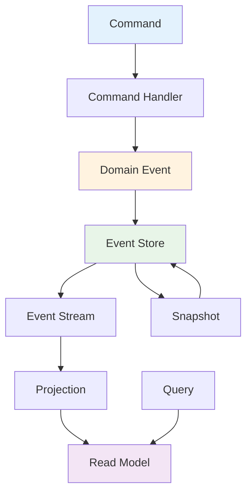

# Event Sourcing

## Overview

This module covers event sourcing patterns including event stores, event streams, snapshots, and CQRS (Command Query Responsibility Segregation). These concepts are essential for building scalable, auditable systems.

## Table of Contents

1. [Event Store](#event-store)
2. [Event Streams](#event-streams)
3. [Snapshots](#snapshots)
4. [CQRS Implementation](#cqrs-implementation)
5. [Applications](#applications)
6. [Complexity Analysis](#complexity-analysis)
7. [Follow-up Questions](#follow-up-questions)

## Event Store

### Theory

Event sourcing stores all changes to application state as a sequence of events. Instead of storing the current state, we store the events that led to that state.

### Event Sourcing Architecture Diagram



### Event Store Implementation

#### Golang Implementation

```go
package main

import (
    "encoding/json"
    "fmt"
    "sync"
    "time"
)

type Event struct {
    ID          string
    Type        string
    AggregateID string
    Version     int
    Data        map[string]interface{}
    Metadata    map[string]interface{}
    Timestamp   time.Time
}

type EventStore struct {
    Events      []Event
    mutex       sync.RWMutex
    nextVersion int
}

type Snapshot struct {
    AggregateID string
    Version     int
    Data        map[string]interface{}
    Timestamp   time.Time
}

type EventStream struct {
    AggregateID string
    Events      []Event
    Version     int
}

func NewEventStore() *EventStore {
    return &EventStore{
        Events:      make([]Event, 0),
        nextVersion: 1,
    }
}

func (es *EventStore) AppendEvent(event Event) error {
    es.mutex.Lock()
    defer es.mutex.Unlock()
    
    // Check version consistency
    if event.Version != es.nextVersion {
        return fmt.Errorf("version mismatch: expected %d, got %d", es.nextVersion, event.Version)
    }
    
    event.ID = fmt.Sprintf("event_%d", es.nextVersion)
    event.Timestamp = time.Now()
    
    es.Events = append(es.Events, event)
    es.nextVersion++
    
    return nil
}

func (es *EventStore) GetEvents(aggregateID string, fromVersion int) ([]Event, error) {
    es.mutex.RLock()
    defer es.mutex.RUnlock()
    
    var events []Event
    for _, event := range es.Events {
        if event.AggregateID == aggregateID && event.Version >= fromVersion {
            events = append(events, event)
        }
    }
    
    return events, nil
}

func (es *EventStore) GetEventStream(aggregateID string) *EventStream {
    es.mutex.RLock()
    defer es.mutex.RUnlock()
    
    var events []Event
    for _, event := range es.Events {
        if event.AggregateID == aggregateID {
            events = append(events, event)
        }
    }
    
    return &EventStream{
        AggregateID: aggregateID,
        Events:      events,
        Version:     len(events),
    }
}

func (es *EventStore) CreateSnapshot(aggregateID string, data map[string]interface{}) *Snapshot {
    es.mutex.RLock()
    defer es.mutex.RUnlock()
    
    // Find the latest version for this aggregate
    latestVersion := 0
    for _, event := range es.Events {
        if event.AggregateID == aggregateID && event.Version > latestVersion {
            latestVersion = event.Version
        }
    }
    
    return &Snapshot{
        AggregateID: aggregateID,
        Version:     latestVersion,
        Data:        data,
        Timestamp:   time.Now(),
    }
}

func (es *EventStore) GetSnapshot(aggregateID string) *Snapshot {
    es.mutex.RLock()
    defer es.mutex.RUnlock()
    
    // In a real implementation, snapshots would be stored separately
    // For this demo, we'll reconstruct from events
    events, _ := es.GetEvents(aggregateID, 1)
    
    if len(events) == 0 {
        return nil
    }
    
    // Reconstruct state from events
    state := make(map[string]interface{})
    for _, event := range events {
        for key, value := range event.Data {
            state[key] = value
        }
    }
    
    return &Snapshot{
        AggregateID: aggregateID,
        Version:     len(events),
        Data:        state,
        Timestamp:   time.Now(),
    }
}

func (es *EventStore) ReplayEvents(aggregateID string, fromVersion int) (map[string]interface{}, error) {
    events, err := es.GetEvents(aggregateID, fromVersion)
    if err != nil {
        return nil, err
    }
    
    state := make(map[string]interface{})
    for _, event := range events {
        for key, value := range event.Data {
            state[key] = value
        }
    }
    
    return state, nil
}

func (es *EventStore) GetEventCount() int {
    es.mutex.RLock()
    defer es.mutex.RUnlock()
    
    return len(es.Events)
}

func (es *EventStore) GetEventsByType(eventType string) []Event {
    es.mutex.RLock()
    defer es.mutex.RUnlock()
    
    var events []Event
    for _, event := range es.Events {
        if event.Type == eventType {
            events = append(events, event)
        }
    }
    
    return events
}

func (es *EventStore) GetEventsInTimeRange(start, end time.Time) []Event {
    es.mutex.RLock()
    defer es.mutex.RUnlock()
    
    var events []Event
    for _, event := range es.Events {
        if event.Timestamp.After(start) && event.Timestamp.Before(end) {
            events = append(events, event)
        }
    }
    
    return events
}

func main() {
    fmt.Println("Event Store Demo:")
    
    es := NewEventStore()
    
    // Create events
    event1 := Event{
        Type:        "UserCreated",
        AggregateID: "user_123",
        Version:     1,
        Data: map[string]interface{}{
            "name":  "John Doe",
            "email": "john@example.com",
        },
        Metadata: map[string]interface{}{
            "source": "web",
        },
    }
    
    event2 := Event{
        Type:        "UserUpdated",
        AggregateID: "user_123",
        Version:     2,
        Data: map[string]interface{}{
            "name": "John Smith",
        },
        Metadata: map[string]interface{}{
            "source": "mobile",
        },
    }
    
    event3 := Event{
        Type:        "UserDeleted",
        AggregateID: "user_123",
        Version:     3,
        Data: map[string]interface{}{
            "reason": "user_request",
        },
        Metadata: map[string]interface{}{
            "source": "web",
        },
    }
    
    // Append events
    es.AppendEvent(event1)
    es.AppendEvent(event2)
    es.AppendEvent(event3)
    
    // Get events for aggregate
    events, err := es.GetEvents("user_123", 1)
    if err != nil {
        fmt.Printf("Error getting events: %v\n", err)
        return
    }
    
    fmt.Printf("Found %d events for user_123:\n", len(events))
    for _, event := range events {
        fmt.Printf("- %s (v%d): %+v\n", event.Type, event.Version, event.Data)
    }
    
    // Get event stream
    stream := es.GetEventStream("user_123")
    fmt.Printf("Event stream version: %d\n", stream.Version)
    
    // Create snapshot
    snapshot := es.CreateSnapshot("user_123", map[string]interface{}{
        "name":  "John Smith",
        "email": "john@example.com",
        "status": "deleted",
    })
    fmt.Printf("Snapshot created: %+v\n", snapshot)
    
    // Replay events
    state, err := es.ReplayEvents("user_123", 1)
    if err != nil {
        fmt.Printf("Error replaying events: %v\n", err)
        return
    }
    fmt.Printf("Replayed state: %+v\n", state)
    
    // Get events by type
    userEvents := es.GetEventsByType("UserCreated")
    fmt.Printf("Found %d UserCreated events\n", len(userEvents))
    
    // Get event count
    fmt.Printf("Total events in store: %d\n", es.GetEventCount())
}
```

## Event Streams

### Theory

Event streams provide a way to process events in real-time. They enable event-driven architectures and can be used for analytics, notifications, and system integration.

### Event Stream Implementation

#### Golang Implementation

```go
package main

import (
    "fmt"
    "sync"
    "time"
)

type EventStreamProcessor struct {
    Streams     map[string]*EventStream
    Handlers    map[string][]EventHandler
    mutex       sync.RWMutex
}

type EventHandler func(Event) error

type EventStream struct {
    Name        string
    Events      []Event
    Subscribers []string
    mutex       sync.RWMutex
}

type StreamSubscription struct {
    ID          string
    StreamName  string
    Handler     EventHandler
    LastEventID string
    Active      bool
}

func NewEventStreamProcessor() *EventStreamProcessor {
    return &EventStreamProcessor{
        Streams:  make(map[string]*EventStream),
        Handlers: make(map[string][]EventHandler),
    }
}

func (esp *EventStreamProcessor) CreateStream(name string) *EventStream {
    esp.mutex.Lock()
    defer esp.mutex.Unlock()
    
    stream := &EventStream{
        Name:        name,
        Events:      make([]Event, 0),
        Subscribers: make([]string, 0),
    }
    
    esp.Streams[name] = stream
    return stream
}

func (esp *EventStreamProcessor) PublishEvent(streamName string, event Event) error {
    esp.mutex.RLock()
    stream, exists := esp.Streams[streamName]
    esp.mutex.RUnlock()
    
    if !exists {
        return fmt.Errorf("stream %s not found", streamName)
    }
    
    stream.mutex.Lock()
    event.ID = fmt.Sprintf("event_%d", len(stream.Events)+1)
    event.Timestamp = time.Now()
    stream.Events = append(stream.Events, event)
    stream.mutex.Unlock()
    
    // Notify handlers
    esp.mutex.RLock()
    handlers := esp.Handlers[streamName]
    esp.mutex.RUnlock()
    
    for _, handler := range handlers {
        go func(h EventHandler) {
            if err := h(event); err != nil {
                fmt.Printf("Error in event handler: %v\n", err)
            }
        }(handler)
    }
    
    return nil
}

func (esp *EventStreamProcessor) Subscribe(streamName string, handler EventHandler) string {
    esp.mutex.Lock()
    defer esp.mutex.Unlock()
    
    subscriptionID := fmt.Sprintf("sub_%d", time.Now().UnixNano())
    
    if esp.Handlers[streamName] == nil {
        esp.Handlers[streamName] = make([]EventHandler, 0)
    }
    
    esp.Handlers[streamName] = append(esp.Handlers[streamName], handler)
    
    return subscriptionID
}

func (esp *EventStreamProcessor) GetStreamEvents(streamName string, fromIndex int) ([]Event, error) {
    esp.mutex.RLock()
    stream, exists := esp.Streams[streamName]
    esp.mutex.RUnlock()
    
    if !exists {
        return nil, fmt.Errorf("stream %s not found", streamName)
    }
    
    stream.mutex.RLock()
    defer stream.mutex.RUnlock()
    
    if fromIndex >= len(stream.Events) {
        return []Event{}, nil
    }
    
    return stream.Events[fromIndex:], nil
}

func (esp *EventStreamProcessor) GetStreamStats(streamName string) map[string]interface{} {
    esp.mutex.RLock()
    stream, exists := esp.Streams[streamName]
    esp.mutex.RUnlock()
    
    if !exists {
        return map[string]interface{}{}
    }
    
    stream.mutex.RLock()
    defer stream.mutex.RUnlock()
    
    return map[string]interface{}{
        "name":           stream.Name,
        "event_count":    len(stream.Events),
        "subscriber_count": len(stream.Subscribers),
    }
}

func (esp *EventStreamProcessor) ProcessStream(streamName string, processor func(Event) error) error {
    esp.mutex.RLock()
    stream, exists := esp.Streams[streamName]
    esp.mutex.RUnlock()
    
    if !exists {
        return fmt.Errorf("stream %s not found", streamName)
    }
    
    stream.mutex.RLock()
    events := make([]Event, len(stream.Events))
    copy(events, stream.Events)
    stream.mutex.RUnlock()
    
    for _, event := range events {
        if err := processor(event); err != nil {
            return err
        }
    }
    
    return nil
}

func main() {
    fmt.Println("Event Stream Demo:")
    
    esp := NewEventStreamProcessor()
    
    // Create streams
    userStream := esp.CreateStream("users")
    orderStream := esp.CreateStream("orders")
    
    // Subscribe to streams
    esp.Subscribe("users", func(event Event) error {
        fmt.Printf("User event handler: %s - %+v\n", event.Type, event.Data)
        return nil
    })
    
    esp.Subscribe("orders", func(event Event) error {
        fmt.Printf("Order event handler: %s - %+v\n", event.Type, event.Data)
        return nil
    })
    
    // Publish events
    esp.PublishEvent("users", Event{
        Type:        "UserCreated",
        AggregateID: "user_123",
        Data: map[string]interface{}{
            "name":  "John Doe",
            "email": "john@example.com",
        },
    })
    
    esp.PublishEvent("orders", Event{
        Type:        "OrderCreated",
        AggregateID: "order_456",
        Data: map[string]interface{}{
            "user_id": "user_123",
            "amount":  100.50,
        },
    })
    
    // Get stream stats
    userStats := esp.GetStreamStats("users")
    orderStats := esp.GetStreamStats("orders")
    
    fmt.Printf("User stream stats: %+v\n", userStats)
    fmt.Printf("Order stream stats: %+v\n", orderStats)
    
    // Process stream
    esp.ProcessStream("users", func(event Event) error {
        fmt.Printf("Processing user event: %s\n", event.Type)
        return nil
    })
}
```

## Follow-up Questions

### 1. Event Store
**Q: What are the benefits of event sourcing?**
A: Event sourcing provides complete audit trail, enables time travel, supports event replay, and allows for flexible read models.

### 2. Event Streams
**Q: How do event streams enable event-driven architecture?**
A: Event streams allow decoupled components to communicate through events, enabling scalable, reactive systems with loose coupling.

### 3. CQRS
**Q: When should you use CQRS with event sourcing?**
A: Use CQRS when you have different read and write requirements, need to scale reads and writes independently, or want to optimize for different use cases.

## Complexity Analysis

| Operation | Event Store | Event Streams | CQRS |
|-----------|-------------|---------------|------|
| Append Event | O(1) | O(1) | O(1) |
| Get Events | O(n) | O(n) | O(n) |
| Replay Events | O(n) | O(n) | O(n) |
| Process Stream | O(n) | O(n) | O(n) |

## Applications

1. **Event Store**: Audit logging, state reconstruction, event replay
2. **Event Streams**: Real-time processing, event-driven architecture, system integration
3. **CQRS**: Scalable systems, complex domain models, performance optimization
4. **Event Sourcing**: Financial systems, audit requirements, complex business logic

---

**Next**: [Service Mesh](./service-mesh.md) | **Previous**: [Distributed Systems](../README.md) | **Up**: [Distributed Systems](../README.md)
