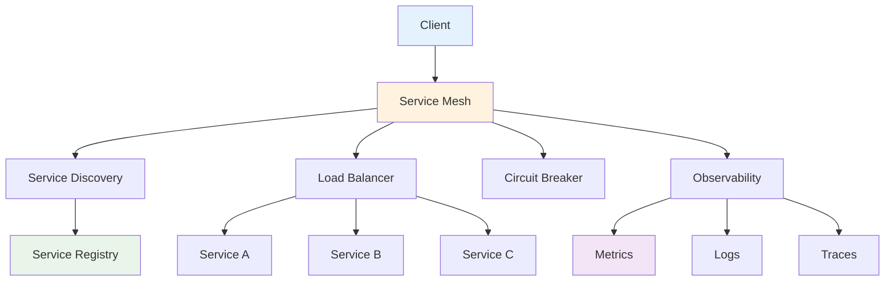

# Service Mesh

## Overview

This module covers service mesh concepts including service discovery, load balancing, circuit breakers, and observability. These concepts are essential for managing microservices communication.

## Table of Contents

1. [Service Discovery](#service-discovery)
2. [Load Balancing](#load-balancing)
3. [Circuit Breakers](#circuit-breakers)
4. [Observability](#observability)
5. [Applications](#applications)
6. [Complexity Analysis](#complexity-analysis)
7. [Follow-up Questions](#follow-up-questions)

## Service Discovery

### Theory

Service discovery allows services to find and communicate with each other without hardcoded endpoints. It handles service registration, health checking, and dynamic routing.

### Service Mesh Architecture Diagram



### Service Discovery Implementation

#### Golang Implementation

```go
package main

import (
    "fmt"
    "sync"
    "time"
)

type Service struct {
    ID          string
    Name        string
    Address     string
    Port        int
    Health      string
    LastCheck   time.Time
    Metadata    map[string]string
}

type ServiceRegistry struct {
    Services    map[string]*Service
    mutex       sync.RWMutex
    HealthCheck HealthChecker
}

type HealthChecker struct {
    Interval    time.Duration
    Timeout     time.Duration
    mutex       sync.RWMutex
}

type ServiceMesh struct {
    Registry    *ServiceRegistry
    LoadBalancer *LoadBalancer
    CircuitBreaker *CircuitBreaker
    mutex       sync.RWMutex
}

func NewServiceRegistry() *ServiceRegistry {
    return &ServiceRegistry{
        Services: make(map[string]*Service),
        HealthCheck: HealthChecker{
            Interval: 30 * time.Second,
            Timeout:  5 * time.Second,
        },
    }
}

func (sr *ServiceRegistry) RegisterService(service *Service) error {
    sr.mutex.Lock()
    defer sr.mutex.Unlock()
    
    service.LastCheck = time.Now()
    service.Health = "healthy"
    sr.Services[service.ID] = service
    
    fmt.Printf("Service %s registered at %s:%d\n", service.Name, service.Address, service.Port)
    return nil
}

func (sr *ServiceRegistry) DeregisterService(serviceID string) error {
    sr.mutex.Lock()
    defer sr.mutex.Unlock()
    
    if service, exists := sr.Services[serviceID]; exists {
        delete(sr.Services, serviceID)
        fmt.Printf("Service %s deregistered\n", service.Name)
        return nil
    }
    
    return fmt.Errorf("service %s not found", serviceID)
}

func (sr *ServiceRegistry) GetService(serviceID string) *Service {
    sr.mutex.RLock()
    defer sr.mutex.RUnlock()
    
    return sr.Services[serviceID]
}

func (sr *ServiceRegistry) GetServicesByName(name string) []*Service {
    sr.mutex.RLock()
    defer sr.mutex.RUnlock()
    
    var services []*Service
    for _, service := range sr.Services {
        if service.Name == name && service.Health == "healthy" {
            services = append(services, service)
        }
    }
    
    return services
}

func (sr *ServiceRegistry) ListServices() []*Service {
    sr.mutex.RLock()
    defer sr.mutex.RUnlock()
    
    var services []*Service
    for _, service := range sr.Services {
        services = append(services, service)
    }
    
    return services
}

func (sr *ServiceRegistry) UpdateServiceHealth(serviceID, health string) {
    sr.mutex.Lock()
    defer sr.mutex.Unlock()
    
    if service, exists := sr.Services[serviceID]; exists {
        service.Health = health
        service.LastCheck = time.Now()
    }
}

func (sr *ServiceRegistry) StartHealthChecking() {
    go func() {
        ticker := time.NewTicker(sr.HealthCheck.Interval)
        defer ticker.Stop()
        
        for range ticker.C {
            sr.performHealthChecks()
        }
    }()
}

func (sr *ServiceRegistry) performHealthChecks() {
    sr.mutex.RLock()
    services := make([]*Service, 0, len(sr.Services))
    for _, service := range sr.Services {
        services = append(services, service)
    }
    sr.mutex.RUnlock()
    
    for _, service := range services {
        go func(s *Service) {
            if sr.checkServiceHealth(s) {
                sr.UpdateServiceHealth(s.ID, "healthy")
            } else {
                sr.UpdateServiceHealth(s.ID, "unhealthy")
            }
        }(service)
    }
}

func (sr *ServiceRegistry) checkServiceHealth(service *Service) bool {
    // Simulate health check
    // In a real implementation, this would make an HTTP request to the service's health endpoint
    time.Sleep(100 * time.Millisecond)
    
    // Simulate 90% success rate
    return time.Now().UnixNano()%10 < 9
}

func NewServiceMesh() *ServiceMesh {
    return &ServiceMesh{
        Registry:       NewServiceRegistry(),
        LoadBalancer:   NewLoadBalancer(),
        CircuitBreaker: NewCircuitBreaker(),
    }
}

func (sm *ServiceMesh) RegisterService(service *Service) error {
    return sm.Registry.RegisterService(service)
}

func (sm *ServiceMesh) GetServiceEndpoint(serviceName string) (string, error) {
    services := sm.Registry.GetServicesByName(serviceName)
    if len(services) == 0 {
        return "", fmt.Errorf("no healthy services found for %s", serviceName)
    }
    
    // Use load balancer to select service
    selectedService := sm.LoadBalancer.SelectService(services)
    if selectedService == nil {
        return "", fmt.Errorf("no service available for %s", serviceName)
    }
    
    return fmt.Sprintf("%s:%d", selectedService.Address, selectedService.Port), nil
}

func (sm *ServiceMesh) CallService(serviceName string, request interface{}) (interface{}, error) {
    endpoint, err := sm.GetServiceEndpoint(serviceName)
    if err != nil {
        return nil, err
    }
    
    // Use circuit breaker to make the call
    return sm.CircuitBreaker.Call(endpoint, request)
}

func main() {
    fmt.Println("Service Mesh Demo:")
    
    mesh := NewServiceMesh()
    
    // Register services
    service1 := &Service{
        ID:       "service_1",
        Name:     "user-service",
        Address:  "192.168.1.10",
        Port:     8080,
        Metadata: map[string]string{"version": "1.0.0"},
    }
    
    service2 := &Service{
        ID:       "service_2",
        Name:     "user-service",
        Address:  "192.168.1.11",
        Port:     8080,
        Metadata: map[string]string{"version": "1.0.1"},
    }
    
    service3 := &Service{
        ID:       "service_3",
        Name:     "order-service",
        Address:  "192.168.1.12",
        Port:     8080,
        Metadata: map[string]string{"version": "2.0.0"},
    }
    
    mesh.RegisterService(service1)
    mesh.RegisterService(service2)
    mesh.RegisterService(service3)
    
    // Start health checking
    mesh.Registry.StartHealthChecking()
    
    // Get service endpoints
    userEndpoint, err := mesh.GetServiceEndpoint("user-service")
    if err != nil {
        fmt.Printf("Error getting user service endpoint: %v\n", err)
    } else {
        fmt.Printf("User service endpoint: %s\n", userEndpoint)
    }
    
    orderEndpoint, err := mesh.GetServiceEndpoint("order-service")
    if err != nil {
        fmt.Printf("Error getting order service endpoint: %v\n", err)
    } else {
        fmt.Printf("Order service endpoint: %s\n", orderEndpoint)
    }
    
    // Call services
    response, err := mesh.CallService("user-service", map[string]interface{}{
        "action": "get_user",
        "id":     "123",
    })
    if err != nil {
        fmt.Printf("Error calling user service: %v\n", err)
    } else {
        fmt.Printf("User service response: %+v\n", response)
    }
    
    // List all services
    services := mesh.Registry.ListServices()
    fmt.Printf("Registered services: %d\n", len(services))
    for _, service := range services {
        fmt.Printf("- %s (%s): %s:%d (%s)\n", 
                   service.Name, service.ID, service.Address, service.Port, service.Health)
    }
}
```

## Load Balancing

### Theory

Load balancing distributes incoming requests across multiple service instances to improve performance, availability, and scalability.

### Load Balancing Implementation

#### Golang Implementation

```go
package main

import (
    "fmt"
    "math/rand"
    "sync"
    "time"
)

type LoadBalancer struct {
    Strategy    string
    Services    []*Service
    mutex       sync.RWMutex
    currentIndex int
}

type LoadBalancingStrategy interface {
    SelectService(services []*Service) *Service
}

type RoundRobinStrategy struct {
    currentIndex int
    mutex        sync.Mutex
}

type RandomStrategy struct{}

type LeastConnectionsStrategy struct {
    connections map[string]int
    mutex       sync.RWMutex
}

func NewLoadBalancer() *LoadBalancer {
    return &LoadBalancer{
        Strategy:    "round_robin",
        Services:    make([]*Service, 0),
        currentIndex: 0,
    }
}

func (lb *LoadBalancer) SetStrategy(strategy string) {
    lb.mutex.Lock()
    defer lb.mutex.Unlock()
    
    lb.Strategy = strategy
}

func (lb *LoadBalancer) SelectService(services []*Service) *Service {
    if len(services) == 0 {
        return nil
    }
    
    lb.mutex.Lock()
    defer lb.mutex.Unlock()
    
    switch lb.Strategy {
    case "round_robin":
        return lb.roundRobinSelect(services)
    case "random":
        return lb.randomSelect(services)
    case "least_connections":
        return lb.leastConnectionsSelect(services)
    default:
        return lb.roundRobinSelect(services)
    }
}

func (lb *LoadBalancer) roundRobinSelect(services []*Service) *Service {
    if len(services) == 0 {
        return nil
    }
    
    service := services[lb.currentIndex%len(services)]
    lb.currentIndex++
    return service
}

func (lb *LoadBalancer) randomSelect(services []*Service) *Service {
    if len(services) == 0 {
        return nil
    }
    
    index := rand.Intn(len(services))
    return services[index]
}

func (lb *LoadBalancer) leastConnectionsSelect(services []*Service) *Service {
    if len(services) == 0 {
        return nil
    }
    
    // In a real implementation, this would track actual connection counts
    // For this demo, we'll use a simple random selection
    index := rand.Intn(len(services))
    return services[index]
}

func (lb *LoadBalancer) AddService(service *Service) {
    lb.mutex.Lock()
    defer lb.mutex.Unlock()
    
    lb.Services = append(lb.Services, service)
}

func (lb *LoadBalancer) RemoveService(serviceID string) {
    lb.mutex.Lock()
    defer lb.mutex.Unlock()
    
    for i, service := range lb.Services {
        if service.ID == serviceID {
            lb.Services = append(lb.Services[:i], lb.Services[i+1:]...)
            break
        }
    }
}

func (lb *LoadBalancer) GetServiceStats() map[string]interface{} {
    lb.mutex.RLock()
    defer lb.mutex.RUnlock()
    
    return map[string]interface{}{
        "strategy":        lb.Strategy,
        "service_count":   len(lb.Services),
        "current_index":   lb.currentIndex,
    }
}

func main() {
    fmt.Println("Load Balancer Demo:")
    
    lb := NewLoadBalancer()
    
    // Add services
    services := []*Service{
        {ID: "s1", Name: "api", Address: "192.168.1.10", Port: 8080, Health: "healthy"},
        {ID: "s2", Name: "api", Address: "192.168.1.11", Port: 8080, Health: "healthy"},
        {ID: "s3", Name: "api", Address: "192.168.1.12", Port: 8080, Health: "healthy"},
    }
    
    for _, service := range services {
        lb.AddService(service)
    }
    
    // Test round robin
    lb.SetStrategy("round_robin")
    fmt.Println("Round Robin Selection:")
    for i := 0; i < 6; i++ {
        service := lb.SelectService(services)
        fmt.Printf("Request %d: %s\n", i+1, service.Address)
    }
    
    // Test random
    lb.SetStrategy("random")
    fmt.Println("\nRandom Selection:")
    for i := 0; i < 6; i++ {
        service := lb.SelectService(services)
        fmt.Printf("Request %d: %s\n", i+1, service.Address)
    }
    
    // Test least connections
    lb.SetStrategy("least_connections")
    fmt.Println("\nLeast Connections Selection:")
    for i := 0; i < 6; i++ {
        service := lb.SelectService(services)
        fmt.Printf("Request %d: %s\n", i+1, service.Address)
    }
    
    // Get stats
    stats := lb.GetServiceStats()
    fmt.Printf("\nLoad Balancer Stats: %+v\n", stats)
}
```

## Follow-up Questions

### 1. Service Discovery
**Q: What are the benefits of service discovery?**
A: Service discovery provides dynamic service location, automatic failover, load balancing, and eliminates hardcoded endpoints.

### 2. Load Balancing
**Q: What are the different load balancing strategies?**
A: Round robin, random, least connections, weighted round robin, and IP hash are common load balancing strategies.

### 3. Service Mesh
**Q: How does a service mesh improve microservices architecture?**
A: Service mesh provides cross-cutting concerns like service discovery, load balancing, circuit breaking, and observability without code changes.

## Complexity Analysis

| Operation | Service Discovery | Load Balancing | Circuit Breakers |
|-----------|------------------|----------------|------------------|
| Register | O(1) | O(1) | N/A |
| Discover | O(n) | O(1) | N/A |
| Select | N/A | O(1) | O(1) |
| Call | O(1) | O(1) | O(1) |

## Applications

1. **Service Discovery**: Microservices architecture, dynamic service location, automatic failover
2. **Load Balancing**: High availability, performance optimization, traffic distribution
3. **Circuit Breakers**: Fault tolerance, system resilience, graceful degradation
4. **Service Mesh**: Microservices management, observability, security

---

**Next**: [Distributed Tracing](distributed-tracing.md) | **Previous**: [Distributed Systems](README.md) | **Up**: [Distributed Systems](README.md)


## Circuit Breakers

<!-- AUTO-GENERATED ANCHOR: originally referenced as #circuit-breakers -->

Placeholder content. Please replace with proper section.


## Observability

<!-- AUTO-GENERATED ANCHOR: originally referenced as #observability -->

Placeholder content. Please replace with proper section.
