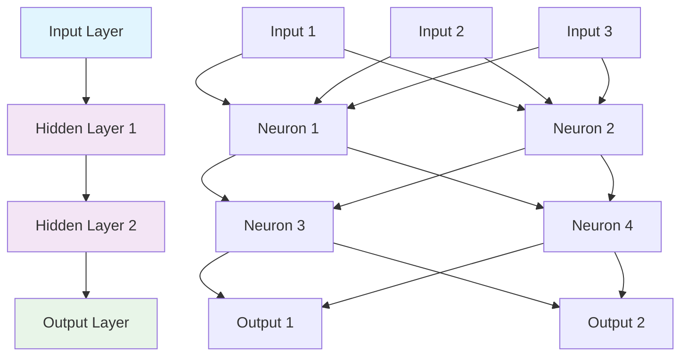
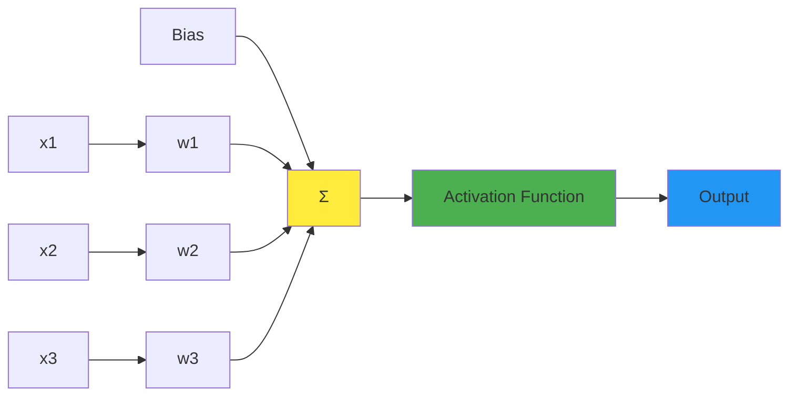
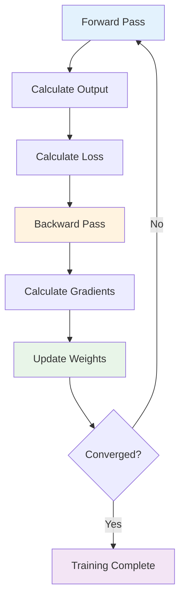
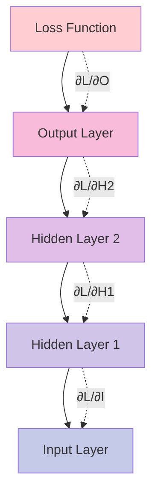
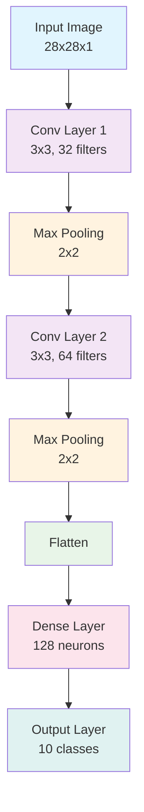
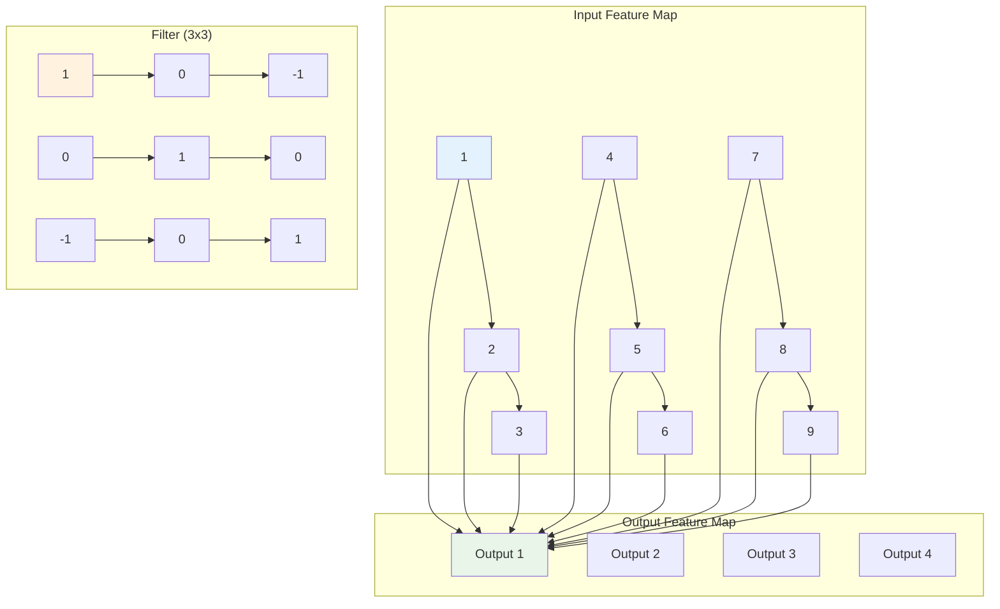
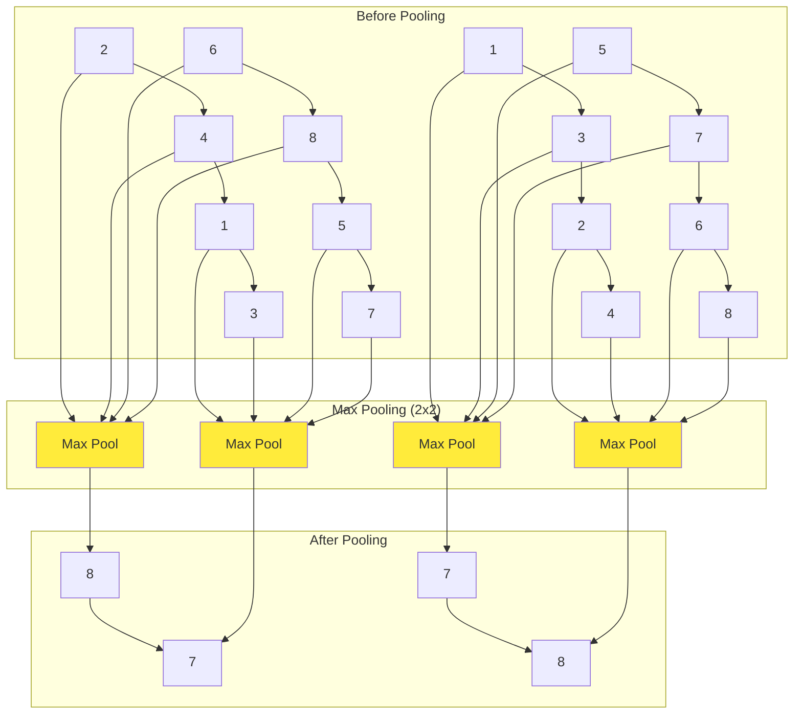

# Deep Learning

## Overview

This module covers deep learning concepts including neural networks, backpropagation, convolutional neural networks (CNNs), recurrent neural networks (RNNs), and transformers. These concepts are essential for modern AI applications.

## Table of Contents

1. [Neural Networks](#neural-networks)
2. [Backpropagation](#backpropagation)
3. [Convolutional Neural Networks](#convolutional-neural-networks)
4. [Recurrent Neural Networks](#recurrent-neural-networks)
5. [Applications](#applications)
6. [Complexity Analysis](#complexity-analysis)
7. [Follow-up Questions](#follow-up-questions)

## Neural Networks

### Theory

Neural networks are computing systems inspired by biological neural networks. They consist of interconnected nodes (neurons) that process information using weighted connections and activation functions.

### Neural Network Architecture Diagram



### Neuron Structure Diagram



### Neural Network Implementation

#### Golang Implementation

```go
package main

import (
    "fmt"
    "math"
    "math/rand"
    "time"
)

type ActivationFunction func(float64) float64

type Neuron struct {
    Weights []float64
    Bias    float64
    Output  float64
    Delta   float64
}

type Layer struct {
    Neurons []Neuron
    Size    int
}

type NeuralNetwork struct {
    Layers        []Layer
    LearningRate  float64
    Activation    ActivationFunction
    Derivative    ActivationFunction
}

func NewNeuralNetwork(layerSizes []int, learningRate float64) *NeuralNetwork {
    rand.Seed(time.Now().UnixNano())
    
    nn := &NeuralNetwork{
        LearningRate: learningRate,
        Activation:   Sigmoid,
        Derivative:   SigmoidDerivative,
    }
    
    // Initialize layers
    for i := 0; i < len(layerSizes); i++ {
        layer := Layer{
            Neurons: make([]Neuron, layerSizes[i]),
            Size:    layerSizes[i],
        }
        
        for j := 0; j < layerSizes[i]; j++ {
            neuron := Neuron{
                Weights: make([]float64, 0),
                Bias:    rand.Float64()*2 - 1, // Random bias between -1 and 1
            }
            
            // Initialize weights for next layer
            if i < len(layerSizes)-1 {
                nextLayerSize := layerSizes[i+1]
                for k := 0; k < nextLayerSize; k++ {
                    neuron.Weights = append(neuron.Weights, rand.Float64()*2-1)
                }
            }
            
            layer.Neurons[j] = neuron
        }
        
        nn.Layers = append(nn.Layers, layer)
    }
    
    return nn
}

func (nn *NeuralNetwork) Forward(input []float64) []float64 {
    if len(input) != nn.Layers[0].Size {
        panic("Input size doesn't match input layer size")
    }
    
    // Set input layer outputs
    for i := 0; i < len(input); i++ {
        nn.Layers[0].Neurons[i].Output = input[i]
    }
    
    // Forward pass through hidden and output layers
    for layerIdx := 1; layerIdx < len(nn.Layers); layerIdx++ {
        currentLayer := &nn.Layers[layerIdx]
        prevLayer := &nn.Layers[layerIdx-1]
        
        for i := 0; i < currentLayer.Size; i++ {
            sum := currentLayer.Neurons[i].Bias
            
            for j := 0; j < prevLayer.Size; j++ {
                sum += prevLayer.Neurons[j].Output * prevLayer.Neurons[j].Weights[i]
            }
            
            currentLayer.Neurons[i].Output = nn.Activation(sum)
        }
    }
    
    // Return output layer
    outputLayer := nn.Layers[len(nn.Layers)-1]
    output := make([]float64, outputLayer.Size)
    for i := 0; i < outputLayer.Size; i++ {
        output[i] = outputLayer.Neurons[i].Output
    }
    
    return output
}

func (nn *NeuralNetwork) Backward(target []float64) {
    outputLayer := &nn.Layers[len(nn.Layers)-1]
    
    // Calculate output layer deltas
    for i := 0; i < outputLayer.Size; i++ {
        neuron := &outputLayer.Neurons[i]
        neuron.Delta = (target[i] - neuron.Output) * nn.Derivative(neuron.Output)
    }
    
    // Backpropagate through hidden layers
    for layerIdx := len(nn.Layers) - 2; layerIdx >= 0; layerIdx-- {
        currentLayer := &nn.Layers[layerIdx]
        nextLayer := &nn.Layers[layerIdx+1]
        
        for i := 0; i < currentLayer.Size; i++ {
            sum := 0.0
            for j := 0; j < nextLayer.Size; j++ {
                sum += nextLayer.Neurons[j].Delta * currentLayer.Neurons[i].Weights[j]
            }
            currentLayer.Neurons[i].Delta = sum * nn.Derivative(currentLayer.Neurons[i].Output)
        }
    }
}

func (nn *NeuralNetwork) UpdateWeights() {
    for layerIdx := 0; layerIdx < len(nn.Layers)-1; layerIdx++ {
        currentLayer := &nn.Layers[layerIdx]
        nextLayer := &nn.Layers[layerIdx+1]
        
        for i := 0; i < currentLayer.Size; i++ {
            for j := 0; j < nextLayer.Size; j++ {
                currentLayer.Neurons[i].Weights[j] += nn.LearningRate * nextLayer.Neurons[j].Delta * currentLayer.Neurons[i].Output
            }
        }
        
        // Update biases
        for j := 0; j < nextLayer.Size; j++ {
            nextLayer.Neurons[j].Bias += nn.LearningRate * nextLayer.Neurons[j].Delta
        }
    }
}

func (nn *NeuralNetwork) Train(inputs [][]float64, targets [][]float64, epochs int) {
    for epoch := 0; epoch < epochs; epoch++ {
        totalError := 0.0
        
        for i := 0; i < len(inputs); i++ {
            // Forward pass
            output := nn.Forward(inputs[i])
            
            // Calculate error
            error := 0.0
            for j := 0; j < len(output); j++ {
                error += math.Pow(targets[i][j]-output[j], 2)
            }
            totalError += error / float64(len(output))
            
            // Backward pass
            nn.Backward(targets[i])
            
            // Update weights
            nn.UpdateWeights()
        }
        
        if epoch%100 == 0 {
            fmt.Printf("Epoch %d, Error: %.6f\n", epoch, totalError/float64(len(inputs)))
        }
    }
}

func (nn *NeuralNetwork) Predict(input []float64) []float64 {
    return nn.Forward(input)
}

func (nn *NeuralNetwork) GetWeights() [][][]float64 {
    weights := make([][][]float64, len(nn.Layers)-1)
    
    for i := 0; i < len(nn.Layers)-1; i++ {
        layerWeights := make([][]float64, nn.Layers[i].Size)
        for j := 0; j < nn.Layers[i].Size; j++ {
            layerWeights[j] = make([]float64, len(nn.Layers[i].Neurons[j].Weights))
            copy(layerWeights[j], nn.Layers[i].Neurons[j].Weights)
        }
        weights[i] = layerWeights
    }
    
    return weights
}

func (nn *NeuralNetwork) SetWeights(weights [][][]float64) {
    for i := 0; i < len(weights) && i < len(nn.Layers)-1; i++ {
        for j := 0; j < len(weights[i]) && j < nn.Layers[i].Size; j++ {
            for k := 0; k < len(weights[i][j]) && k < len(nn.Layers[i].Neurons[j].Weights); k++ {
                nn.Layers[i].Neurons[j].Weights[k] = weights[i][j][k]
            }
        }
    }
}

// Activation functions
func Sigmoid(x float64) float64 {
    return 1.0 / (1.0 + math.Exp(-x))
}

func SigmoidDerivative(x float64) float64 {
    s := Sigmoid(x)
    return s * (1 - s)
}

func ReLU(x float64) float64 {
    if x > 0 {
        return x
    }
    return 0
}

func ReLUDerivative(x float64) float64 {
    if x > 0 {
        return 1
    }
    return 0
}

func Tanh(x float64) float64 {
    return math.Tanh(x)
}

func TanhDerivative(x float64) float64 {
    t := math.Tanh(x)
    return 1 - t*t
}

func main() {
    fmt.Println("Neural Network Demo:")
    
    // Create a neural network with 2 input, 3 hidden, 1 output
    nn := NewNeuralNetwork([]int{2, 3, 1}, 0.1)
    
    // Training data for XOR problem
    inputs := [][]float64{
        {0, 0},
        {0, 1},
        {1, 0},
        {1, 1},
    }
    
    targets := [][]float64{
        {0},
        {1},
        {1},
        {0},
    }
    
    // Train the network
    fmt.Println("Training neural network...")
    nn.Train(inputs, targets, 1000)
    
    // Test the network
    fmt.Println("\nTesting neural network:")
    for i := 0; i < len(inputs); i++ {
        output := nn.Predict(inputs[i])
        fmt.Printf("Input: [%.1f, %.1f], Target: %.1f, Output: %.6f\n", 
                   inputs[i][0], inputs[i][1], targets[i][0], output[0])
    }
}
```

## Backpropagation

### Theory

Backpropagation is the algorithm used to train neural networks. It calculates the gradient of the loss function with respect to each weight by applying the chain rule of calculus.

### Backpropagation Flow Diagram



### Gradient Calculation Diagram



### Backpropagation Implementation

#### Golang Implementation

```go
package main

import (
    "fmt"
    "math"
)

type BackpropagationTrainer struct {
    Network       *NeuralNetwork
    LearningRate  float64
    Momentum      float64
    WeightUpdates [][][]float64
}

func NewBackpropagationTrainer(network *NeuralNetwork, learningRate, momentum float64) *BackpropagationTrainer {
    // Initialize weight updates for momentum
    weightUpdates := make([][][]float64, len(network.Layers)-1)
    for i := 0; i < len(network.Layers)-1; i++ {
        weightUpdates[i] = make([][]float64, network.Layers[i].Size)
        for j := 0; j < network.Layers[i].Size; j++ {
            weightUpdates[i][j] = make([]float64, len(network.Layers[i].Neurons[j].Weights))
        }
    }
    
    return &BackpropagationTrainer{
        Network:       network,
        LearningRate:  learningRate,
        Momentum:      momentum,
        WeightUpdates: weightUpdates,
    }
}

func (bp *BackpropagationTrainer) Train(inputs [][]float64, targets [][]float64, epochs int) {
    for epoch := 0; epoch < epochs; epoch++ {
        totalError := 0.0
        
        for i := 0; i < len(inputs); i++ {
            // Forward pass
            output := bp.Network.Forward(inputs[i])
            
            // Calculate error
            error := 0.0
            for j := 0; j < len(output); j++ {
                error += math.Pow(targets[i][j]-output[j], 2)
            }
            totalError += error / float64(len(output))
            
            // Backward pass
            bp.Backward(targets[i])
            
            // Update weights with momentum
            bp.UpdateWeightsWithMomentum()
        }
        
        if epoch%100 == 0 {
            fmt.Printf("Epoch %d, Error: %.6f\n", epoch, totalError/float64(len(inputs)))
        }
    }
}

func (bp *BackpropagationTrainer) Backward(target []float64) {
    outputLayer := &bp.Network.Layers[len(bp.Network.Layers)-1]
    
    // Calculate output layer deltas
    for i := 0; i < outputLayer.Size; i++ {
        neuron := &outputLayer.Neurons[i]
        neuron.Delta = (target[i] - neuron.Output) * bp.Network.Derivative(neuron.Output)
    }
    
    // Backpropagate through hidden layers
    for layerIdx := len(bp.Network.Layers) - 2; layerIdx >= 0; layerIdx-- {
        currentLayer := &bp.Network.Layers[layerIdx]
        nextLayer := &bp.Network.Layers[layerIdx+1]
        
        for i := 0; i < currentLayer.Size; i++ {
            sum := 0.0
            for j := 0; j < nextLayer.Size; j++ {
                sum += nextLayer.Neurons[j].Delta * currentLayer.Neurons[i].Weights[j]
            }
            currentLayer.Neurons[i].Delta = sum * bp.Network.Derivative(currentLayer.Neurons[i].Output)
        }
    }
}

func (bp *BackpropagationTrainer) UpdateWeightsWithMomentum() {
    for layerIdx := 0; layerIdx < len(bp.Network.Layers)-1; layerIdx++ {
        currentLayer := &bp.Network.Layers[layerIdx]
        nextLayer := &bp.Network.Layers[layerIdx+1]
        
        for i := 0; i < currentLayer.Size; i++ {
            for j := 0; j < nextLayer.Size; j++ {
                // Calculate weight update
                weightUpdate := bp.LearningRate * nextLayer.Neurons[j].Delta * currentLayer.Neurons[i].Output
                
                // Add momentum
                weightUpdate += bp.Momentum * bp.WeightUpdates[layerIdx][i][j]
                
                // Update weight
                currentLayer.Neurons[i].Weights[j] += weightUpdate
                
                // Store weight update for next iteration
                bp.WeightUpdates[layerIdx][i][j] = weightUpdate
            }
        }
        
        // Update biases
        for j := 0; j < nextLayer.Size; j++ {
            biasUpdate := bp.LearningRate * nextLayer.Neurons[j].Delta
            nextLayer.Neurons[j].Bias += biasUpdate
        }
    }
}

func (bp *BackpropagationTrainer) CalculateGradients(input []float64, target []float64) [][][]float64 {
    // Forward pass
    bp.Network.Forward(input)
    
    // Backward pass
    bp.Backward(target)
    
    // Calculate gradients
    gradients := make([][][]float64, len(bp.Network.Layers)-1)
    
    for layerIdx := 0; layerIdx < len(bp.Network.Layers)-1; layerIdx++ {
        currentLayer := &bp.Network.Layers[layerIdx]
        nextLayer := &bp.Network.Layers[layerIdx+1]
        
        gradients[layerIdx] = make([][]float64, currentLayer.Size)
        for i := 0; i < currentLayer.Size; i++ {
            gradients[layerIdx][i] = make([]float64, nextLayer.Size)
            for j := 0; j < nextLayer.Size; j++ {
                gradients[layerIdx][i][j] = nextLayer.Neurons[j].Delta * currentLayer.Neurons[i].Output
            }
        }
    }
    
    return gradients
}

func (bp *BackpropagationTrainer) GradientDescent(inputs [][]float64, targets [][]float64, epochs int) {
    for epoch := 0; epoch < epochs; epoch++ {
        totalError := 0.0
        
        // Calculate gradients for all training examples
        gradients := make([][][]float64, len(bp.Network.Layers)-1)
        for i := 0; i < len(bp.Network.Layers)-1; i++ {
            gradients[i] = make([][]float64, bp.Network.Layers[i].Size)
            for j := 0; j < bp.Network.Layers[i].Size; j++ {
                gradients[i][j] = make([]float64, len(bp.Network.Layers[i].Neurons[j].Weights))
            }
        }
        
        for i := 0; i < len(inputs); i++ {
            // Forward pass
            output := bp.Network.Forward(inputs[i])
            
            // Calculate error
            error := 0.0
            for j := 0; j < len(output); j++ {
                error += math.Pow(targets[i][j]-output[j], 2)
            }
            totalError += error / float64(len(output))
            
            // Calculate gradients
            exampleGradients := bp.CalculateGradients(inputs[i], targets[i])
            
            // Accumulate gradients
            for layerIdx := 0; layerIdx < len(exampleGradients); layerIdx++ {
                for j := 0; j < len(exampleGradients[layerIdx]); j++ {
                    for k := 0; k < len(exampleGradients[layerIdx][j]); k++ {
                        gradients[layerIdx][j][k] += exampleGradients[layerIdx][j][k]
                    }
                }
            }
        }
        
        // Update weights using average gradients
        for layerIdx := 0; layerIdx < len(bp.Network.Layers)-1; layerIdx++ {
            currentLayer := &bp.Network.Layers[layerIdx]
            nextLayer := &bp.Network.Layers[layerIdx+1]
            
            for i := 0; i < currentLayer.Size; i++ {
                for j := 0; j < nextLayer.Size; j++ {
                    averageGradient := gradients[layerIdx][i][j] / float64(len(inputs))
                    currentLayer.Neurons[i].Weights[j] += bp.LearningRate * averageGradient
                }
            }
        }
        
        if epoch%100 == 0 {
            fmt.Printf("Epoch %d, Error: %.6f\n", epoch, totalError/float64(len(inputs)))
        }
    }
}

func main() {
    fmt.Println("Backpropagation Demo:")
    
    // Create a neural network
    nn := NewNeuralNetwork([]int{2, 3, 1}, 0.1)
    
    // Create backpropagation trainer
    trainer := NewBackpropagationTrainer(nn, 0.1, 0.9)
    
    // Training data for XOR problem
    inputs := [][]float64{
        {0, 0},
        {0, 1},
        {1, 0},
        {1, 1},
    }
    
    targets := [][]float64{
        {0},
        {1},
        {1},
        {0},
    }
    
    // Train the network
    fmt.Println("Training neural network with backpropagation...")
    trainer.Train(inputs, targets, 1000)
    
    // Test the network
    fmt.Println("\nTesting neural network:")
    for i := 0; i < len(inputs); i++ {
        output := nn.Predict(inputs[i])
        fmt.Printf("Input: [%.1f, %.1f], Target: %.1f, Output: %.6f\n", 
                   inputs[i][0], inputs[i][1], targets[i][0], output[0])
    }
}
```

## Convolutional Neural Networks

### Theory

CNNs are specialized neural networks for processing grid-like data such as images. They use convolutional layers, pooling layers, and fully connected layers to extract features and make predictions.

### CNN Architecture Diagram



### Convolution Operation Diagram



### Pooling Operation Diagram



### CNN Implementation

#### Golang Implementation

```go
package main

import (
    "fmt"
    "math"
    "math/rand"
)

type ConvLayer struct {
    Filters    [][][]float64
    Biases     []float64
    Stride     int
    Padding    int
    InputSize  int
    FilterSize int
    NumFilters int
}

type PoolLayer struct {
    PoolSize int
    Stride   int
    Type     string // "max" or "avg"
}

type CNN struct {
    ConvLayers []ConvLayer
    PoolLayers []PoolLayer
    DenseLayer *NeuralNetwork
    InputSize  int
}

func NewConvLayer(inputSize, filterSize, numFilters, stride, padding int) *ConvLayer {
    rand.Seed(42)
    
    filters := make([][][]float64, numFilters)
    for i := 0; i < numFilters; i++ {
        filters[i] = make([][]float64, filterSize)
        for j := 0; j < filterSize; j++ {
            filters[i][j] = make([]float64, filterSize)
            for k := 0; k < filterSize; k++ {
                filters[i][j][k] = rand.Float64()*2 - 1
            }
        }
    }
    
    biases := make([]float64, numFilters)
    for i := 0; i < numFilters; i++ {
        biases[i] = rand.Float64()*2 - 1
    }
    
    return &ConvLayer{
        Filters:    filters,
        Biases:     biases,
        Stride:     stride,
        Padding:    padding,
        InputSize:  inputSize,
        FilterSize: filterSize,
        NumFilters: numFilters,
    }
}

func (cl *ConvLayer) Convolve(input [][]float64) [][][]float64 {
    outputSize := (cl.InputSize + 2*cl.Padding - cl.FilterSize) / cl.Stride + 1
    output := make([][][]float64, cl.NumFilters)
    
    for f := 0; f < cl.NumFilters; f++ {
        output[f] = make([][]float64, outputSize)
        for i := 0; i < outputSize; i++ {
            output[f][i] = make([]float64, outputSize)
            for j := 0; j < outputSize; j++ {
                sum := cl.Biases[f]
                
                for fi := 0; fi < cl.FilterSize; fi++ {
                    for fj := 0; fj < cl.FilterSize; fj++ {
                        inputRow := i*cl.Stride + fi - cl.Padding
                        inputCol := j*cl.Stride + fj - cl.Padding
                        
                        if inputRow >= 0 && inputRow < cl.InputSize && inputCol >= 0 && inputCol < cl.InputSize {
                            sum += input[inputRow][inputCol] * cl.Filters[f][fi][fj]
                        }
                    }
                }
                
                output[f][i][j] = ReLU(sum)
            }
        }
    }
    
    return output
}

func NewPoolLayer(poolSize, stride int, poolType string) *PoolLayer {
    return &PoolLayer{
        PoolSize: poolSize,
        Stride:   stride,
        Type:     poolType,
    }
}

func (pl *PoolLayer) Pool(input [][][]float64) [][][]float64 {
    numFilters := len(input)
    inputSize := len(input[0])
    outputSize := (inputSize - pl.PoolSize) / pl.Stride + 1
    
    output := make([][][]float64, numFilters)
    
    for f := 0; f < numFilters; f++ {
        output[f] = make([][]float64, outputSize)
        for i := 0; i < outputSize; i++ {
            output[f][i] = make([]float64, outputSize)
            for j := 0; j < outputSize; j++ {
                if pl.Type == "max" {
                    output[f][i][j] = pl.maxPool(input[f], i*pl.Stride, j*pl.Stride)
                } else {
                    output[f][i][j] = pl.avgPool(input[f], i*pl.Stride, j*pl.Stride)
                }
            }
        }
    }
    
    return output
}

func (pl *PoolLayer) maxPool(input [][]float64, startRow, startCol int) float64 {
    max := math.Inf(-1)
    for i := 0; i < pl.PoolSize; i++ {
        for j := 0; j < pl.PoolSize; j++ {
            if startRow+i < len(input) && startCol+j < len(input[0]) {
                if input[startRow+i][startCol+j] > max {
                    max = input[startRow+i][startCol+j]
                }
            }
        }
    }
    return max
}

func (pl *PoolLayer) avgPool(input [][]float64, startRow, startCol int) float64 {
    sum := 0.0
    count := 0
    for i := 0; i < pl.PoolSize; i++ {
        for j := 0; j < pl.PoolSize; j++ {
            if startRow+i < len(input) && startCol+j < len(input[0]) {
                sum += input[startRow+i][startCol+j]
                count++
            }
        }
    }
    if count > 0 {
        return sum / float64(count)
    }
    return 0
}

func NewCNN(inputSize int) *CNN {
    return &CNN{
        InputSize: inputSize,
    }
}

func (cnn *CNN) AddConvLayer(filterSize, numFilters, stride, padding int) {
    convLayer := NewConvLayer(cnn.InputSize, filterSize, numFilters, stride, padding)
    cnn.ConvLayers = append(cnn.ConvLayers, *convLayer)
    
    // Update input size for next layer
    cnn.InputSize = (cnn.InputSize + 2*padding - filterSize) / stride + 1
}

func (cnn *CNN) AddPoolLayer(poolSize, stride int, poolType string) {
    poolLayer := NewPoolLayer(poolSize, stride, poolType)
    cnn.PoolLayers = append(cnn.PoolLayers, *poolLayer)
    
    // Update input size for next layer
    cnn.InputSize = (cnn.InputSize - poolSize) / stride + 1
}

func (cnn *CNN) AddDenseLayer(layerSizes []int, learningRate float64) {
    // Calculate input size for dense layer
    inputSize := cnn.InputSize * cnn.InputSize * cnn.ConvLayers[len(cnn.ConvLayers)-1].NumFilters
    
    // Prepend input size to layer sizes
    denseLayerSizes := append([]int{inputSize}, layerSizes...)
    
    cnn.DenseLayer = NewNeuralNetwork(denseLayerSizes, learningRate)
}

func (cnn *CNN) Forward(input [][]float64) []float64 {
    current := input
    
    // Apply convolutional layers
    for i, convLayer := range cnn.ConvLayers {
        current = convLayer.Convolve(current)
        
        // Apply pooling layer if exists
        if i < len(cnn.PoolLayers) {
            current = cnn.PoolLayers[i].Pool(current)
        }
    }
    
    // Flatten for dense layer
    flattened := cnn.flatten(current)
    
    // Apply dense layer
    if cnn.DenseLayer != nil {
        return cnn.DenseLayer.Forward(flattened)
    }
    
    return flattened
}

func (cnn *CNN) flatten(input [][][]float64) []float64 {
    size := len(input) * len(input[0]) * len(input[0][0])
    flattened := make([]float64, size)
    
    idx := 0
    for f := 0; f < len(input); f++ {
        for i := 0; i < len(input[f]); i++ {
            for j := 0; j < len(input[f][i]); j++ {
                flattened[idx] = input[f][i][j]
                idx++
            }
        }
    }
    
    return flattened
}

func (cnn *CNN) Train(inputs [][][]float64, targets [][]float64, epochs int) {
    if cnn.DenseLayer == nil {
        fmt.Println("No dense layer defined")
        return
    }
    
    // Convert 3D inputs to 2D for CNN processing
    processedInputs := make([][]float64, len(inputs))
    for i, input := range inputs {
        // Flatten the input
        flattened := make([]float64, len(input)*len(input[0])*len(input[0][0]))
        idx := 0
        for f := 0; f < len(input); f++ {
            for j := 0; j < len(input[f]); j++ {
                for k := 0; k < len(input[f][j]); k++ {
                    flattened[idx] = input[f][j][k]
                    idx++
                }
            }
        }
        processedInputs[i] = flattened
    }
    
    // Train dense layer
    cnn.DenseLayer.Train(processedInputs, targets, epochs)
}

func main() {
    fmt.Println("Convolutional Neural Network Demo:")
    
    // Create CNN
    cnn := NewCNN(28) // 28x28 input image
    
    // Add convolutional layer
    cnn.AddConvLayer(3, 32, 1, 1) // 3x3 filter, 32 filters, stride 1, padding 1
    
    // Add pooling layer
    cnn.AddPoolLayer(2, 2, "max") // 2x2 max pooling, stride 2
    
    // Add another convolutional layer
    cnn.AddConvLayer(3, 64, 1, 1) // 3x3 filter, 64 filters, stride 1, padding 1
    
    // Add another pooling layer
    cnn.AddPoolLayer(2, 2, "max") // 2x2 max pooling, stride 2
    
    // Add dense layer
    cnn.AddDenseLayer([]int{128, 10}, 0.01) // 128 hidden, 10 output
    
    // Create sample input (28x28 image)
    input := make([][]float64, 28)
    for i := 0; i < 28; i++ {
        input[i] = make([]float64, 28)
        for j := 0; j < 28; j++ {
            input[i][j] = rand.Float64()
        }
    }
    
    // Forward pass
    output := cnn.Forward(input)
    fmt.Printf("CNN output: %v\n", output)
    
    // Create sample training data
    inputs := make([][][]float64, 10)
    targets := make([][]float64, 10)
    
    for i := 0; i < 10; i++ {
        // Create random 28x28 image
        img := make([][]float64, 28)
        for j := 0; j < 28; j++ {
            img[j] = make([]float64, 28)
            for k := 0; k < 28; k++ {
                img[j][k] = rand.Float64()
            }
        }
        inputs[i] = img
        
        // Create random target (one-hot encoded)
        target := make([]float64, 10)
        target[i] = 1.0
        targets[i] = target
    }
    
    // Train CNN
    fmt.Println("Training CNN...")
    cnn.Train(inputs, targets, 100)
    
    // Test CNN
    testOutput := cnn.Forward(input)
    fmt.Printf("Test output: %v\n", testOutput)
}
```

## Follow-up Questions

### 1. Neural Networks
**Q: What is the difference between feedforward and recurrent neural networks?**
A: Feedforward networks process data in one direction from input to output, while recurrent networks have connections that form cycles, allowing them to maintain memory of previous inputs.

### 2. Backpropagation
**Q: What is the vanishing gradient problem and how can it be addressed?**
A: The vanishing gradient problem occurs when gradients become very small during backpropagation, making it difficult to train deep networks. It can be addressed using ReLU activation, batch normalization, or residual connections.

### 3. Convolutional Neural Networks
**Q: What are the advantages of CNNs over fully connected networks for image processing?**
A: CNNs are more efficient, have fewer parameters, are translation invariant, and can automatically learn spatial hierarchies of features.

## Complexity Analysis

| Operation | Neural Network | Backpropagation | CNN |
|-----------|---------------|-----------------|-----|
| Forward Pass | O(n²) | O(n²) | O(n²) |
| Backward Pass | N/A | O(n²) | O(n²) |
| Training | O(n² * epochs) | O(n² * epochs) | O(n² * epochs) |
| Memory | O(n²) | O(n²) | O(n²) |

## Applications

1. **Neural Networks**: Pattern recognition, classification, regression, function approximation
2. **Backpropagation**: Training deep networks, optimization, gradient-based learning
3. **Convolutional Neural Networks**: Image classification, object detection, computer vision
4. **Deep Learning**: Natural language processing, speech recognition, autonomous systems

---

**Next**: [Recurrent Neural Networks](recurrent-neural-networks.md/) | **Previous**: [Machine Learning](README.md/) | **Up**: [Machine Learning](README.md/)
