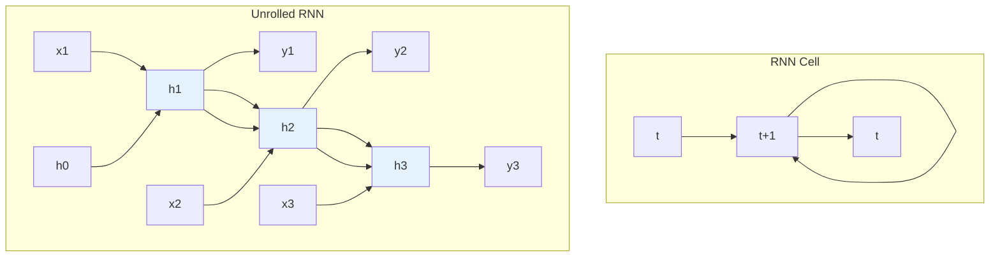
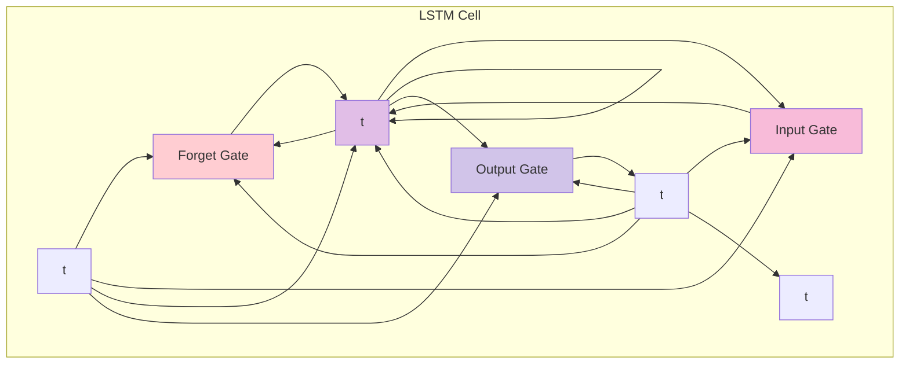

# Recurrent Neural Networks (RNNs)

## Overview

This module covers recurrent neural networks including basic RNNs, Long Short-Term Memory (LSTM) networks, and Gated Recurrent Units (GRUs). These concepts are essential for sequence modeling and natural language processing.

## Table of Contents

1. [Basic RNNs](#basic-rnns)
2. [Long Short-Term Memory (LSTM)](#long-short-term-memory-lstm)
3. [Gated Recurrent Units (GRUs)](#gated-recurrent-units-grus)
4. [Applications](#applications)
5. [Complexity Analysis](#complexity-analysis)
6. [Follow-up Questions](#follow-up-questions)

## Basic RNNs

### Theory

Recurrent Neural Networks (RNNs) are designed to process sequential data by maintaining hidden states that carry information from previous time steps. They can handle variable-length sequences and capture temporal dependencies.

### RNN Architecture Diagram



### RNN Implementation

#### Golang Implementation

```go
package main

import (
    "fmt"
    "math"
    "math/rand"
    "time"
)

type RNNCell struct {
    InputSize  int
    HiddenSize int
    OutputSize int
    
    // Weight matrices
    Wxh [][]float64 // Input to hidden
    Whh [][]float64 // Hidden to hidden
    Why [][]float64 // Hidden to output
    
    // Bias vectors
    Bh []float64 // Hidden bias
    By []float64 // Output bias
    
    // Hidden state
    Hidden []float64
}

type RNN struct {
    Cells []RNNCell
    InputSize int
    HiddenSize int
    OutputSize int
    LearningRate float64
}

func NewRNN(inputSize, hiddenSize, outputSize int, learningRate float64) *RNN {
    rand.Seed(time.Now().UnixNano())
    
    rnn := &RNN{
        InputSize: inputSize,
        HiddenSize: hiddenSize,
        OutputSize: outputSize,
        LearningRate: learningRate,
    }
    
    return rnn
}

func (rnn *RNN) CreateCell() RNNCell {
    cell := RNNCell{
        InputSize: rnn.InputSize,
        HiddenSize: rnn.HiddenSize,
        OutputSize: rnn.OutputSize,
        Wxh: make([][]float64, rnn.InputSize),
        Whh: make([][]float64, rnn.HiddenSize),
        Why: make([][]float64, rnn.HiddenSize),
        Bh: make([]float64, rnn.HiddenSize),
        By: make([]float64, rnn.OutputSize),
        Hidden: make([]float64, rnn.HiddenSize),
    }
    
    // Initialize weights
    for i := 0; i < rnn.InputSize; i++ {
        cell.Wxh[i] = make([]float64, rnn.HiddenSize)
        for j := 0; j < rnn.HiddenSize; j++ {
            cell.Wxh[i][j] = rand.Float64()*2 - 1
        }
    }
    
    for i := 0; i < rnn.HiddenSize; i++ {
        cell.Whh[i] = make([]float64, rnn.HiddenSize)
        for j := 0; j < rnn.HiddenSize; j++ {
            cell.Whh[i][j] = rand.Float64()*2 - 1
        }
    }
    
    for i := 0; i < rnn.HiddenSize; i++ {
        cell.Why[i] = make([]float64, rnn.OutputSize)
        for j := 0; j < rnn.OutputSize; j++ {
            cell.Why[i][j] = rand.Float64()*2 - 1
        }
    }
    
    // Initialize biases
    for i := 0; i < rnn.HiddenSize; i++ {
        cell.Bh[i] = rand.Float64()*2 - 1
    }
    
    for i := 0; i < rnn.OutputSize; i++ {
        cell.By[i] = rand.Float64()*2 - 1
    }
    
    return cell
}

func (rnn *RNN) Forward(inputs [][]float64) [][]float64 {
    outputs := make([][]float64, len(inputs))
    
    for t := 0; t < len(inputs); t++ {
        if t >= len(rnn.Cells) {
            rnn.Cells = append(rnn.Cells, rnn.CreateCell())
        }
        
        cell := &rnn.Cells[t]
        
        // Calculate hidden state
        for i := 0; i < rnn.HiddenSize; i++ {
            sum := cell.Bh[i]
            
            // Input contribution
            for j := 0; j < rnn.InputSize; j++ {
                sum += inputs[t][j] * cell.Wxh[j][i]
            }
            
            // Previous hidden state contribution
            if t > 0 {
                for j := 0; j < rnn.HiddenSize; j++ {
                    sum += rnn.Cells[t-1].Hidden[j] * cell.Whh[j][i]
                }
            }
            
            cell.Hidden[i] = math.Tanh(sum)
        }
        
        // Calculate output
        output := make([]float64, rnn.OutputSize)
        for i := 0; i < rnn.OutputSize; i++ {
            sum := cell.By[i]
            for j := 0; j < rnn.HiddenSize; j++ {
                sum += cell.Hidden[j] * cell.Why[j][i]
            }
            output[i] = math.Tanh(sum)
        }
        
        outputs[t] = output
    }
    
    return outputs
}

func (rnn *RNN) Backward(inputs [][]float64, targets [][]float64) {
    // Initialize gradients
    dWxh := make([][]float64, rnn.InputSize)
    dWhh := make([][]float64, rnn.HiddenSize)
    dWhy := make([][]float64, rnn.HiddenSize)
    dBh := make([]float64, rnn.HiddenSize)
    dBy := make([]float64, rnn.OutputSize)
    
    for i := 0; i < rnn.InputSize; i++ {
        dWxh[i] = make([]float64, rnn.HiddenSize)
    }
    
    for i := 0; i < rnn.HiddenSize; i++ {
        dWhh[i] = make([]float64, rnn.HiddenSize)
        dWhy[i] = make([]float64, rnn.OutputSize)
    }
    
    // Backward pass through time
    for t := len(inputs) - 1; t >= 0; t-- {
        cell := &rnn.Cells[t]
        
        // Calculate output gradients
        dOutput := make([]float64, rnn.OutputSize)
        for i := 0; i < rnn.OutputSize; i++ {
            dOutput[i] = targets[t][i] - cell.Hidden[i]
        }
        
        // Update output weights and biases
        for i := 0; i < rnn.HiddenSize; i++ {
            for j := 0; j < rnn.OutputSize; j++ {
                dWhy[i][j] += cell.Hidden[i] * dOutput[j]
            }
        }
        
        for i := 0; i < rnn.OutputSize; i++ {
            dBy[i] += dOutput[i]
        }
        
        // Calculate hidden gradients
        dHidden := make([]float64, rnn.HiddenSize)
        for i := 0; i < rnn.HiddenSize; i++ {
            for j := 0; j < rnn.OutputSize; j++ {
                dHidden[i] += dOutput[j] * cell.Why[i][j]
            }
        }
        
        // Update input weights
        for i := 0; i < rnn.InputSize; i++ {
            for j := 0; j < rnn.HiddenSize; j++ {
                dWxh[i][j] += inputs[t][i] * dHidden[j]
            }
        }
        
        // Update hidden weights
        if t > 0 {
            for i := 0; i < rnn.HiddenSize; i++ {
                for j := 0; j < rnn.HiddenSize; j++ {
                    dWhh[i][j] += rnn.Cells[t-1].Hidden[i] * dHidden[j]
                }
            }
        }
        
        // Update hidden bias
        for i := 0; i < rnn.HiddenSize; i++ {
            dBh[i] += dHidden[i]
        }
    }
    
    // Update weights
    for i := 0; i < rnn.InputSize; i++ {
        for j := 0; j < rnn.HiddenSize; j++ {
            rnn.Cells[0].Wxh[i][j] += rnn.LearningRate * dWxh[i][j]
        }
    }
    
    for i := 0; i < rnn.HiddenSize; i++ {
        for j := 0; j < rnn.HiddenSize; j++ {
            rnn.Cells[0].Whh[i][j] += rnn.LearningRate * dWhh[i][j]
        }
    }
    
    for i := 0; i < rnn.HiddenSize; i++ {
        for j := 0; j < rnn.OutputSize; j++ {
            rnn.Cells[0].Why[i][j] += rnn.LearningRate * dWhy[i][j]
        }
    }
    
    for i := 0; i < rnn.HiddenSize; i++ {
        rnn.Cells[0].Bh[i] += rnn.LearningRate * dBh[i]
    }
    
    for i := 0; i < rnn.OutputSize; i++ {
        rnn.Cells[0].By[i] += rnn.LearningRate * dBy[i]
    }
}

func (rnn *RNN) Train(inputs [][]float64, targets [][]float64, epochs int) {
    for epoch := 0; epoch < epochs; epoch++ {
        // Forward pass
        outputs := rnn.Forward(inputs)
        
        // Calculate loss
        loss := 0.0
        for t := 0; t < len(inputs); t++ {
            for i := 0; i < rnn.OutputSize; i++ {
                loss += math.Pow(targets[t][i] - outputs[t][i], 2)
            }
        }
        loss /= float64(len(inputs) * rnn.OutputSize)
        
        // Backward pass
        rnn.Backward(inputs, targets)
        
        if epoch%100 == 0 {
            fmt.Printf("Epoch %d, Loss: %.6f\n", epoch, loss)
        }
    }
}

func main() {
    fmt.Println("RNN Demo:")
    
    // Create RNN
    rnn := NewRNN(2, 3, 1, 0.01)
    
    // Training data for sequence prediction
    inputs := [][]float64{
        {1, 0},
        {0, 1},
        {1, 1},
        {0, 0},
    }
    
    targets := [][]float64{
        {0},
        {1},
        {1},
        {0},
    }
    
    // Train RNN
    fmt.Println("Training RNN...")
    rnn.Train(inputs, targets, 1000)
    
    // Test RNN
    fmt.Println("\nTesting RNN:")
    outputs := rnn.Forward(inputs)
    for i := 0; i < len(inputs); i++ {
        fmt.Printf("Input: [%.1f, %.1f], Target: %.1f, Output: %.6f\n", 
                   inputs[i][0], inputs[i][1], targets[i][0], outputs[i][0])
    }
}
```

## Long Short-Term Memory (LSTM)

### Theory

LSTM networks address the vanishing gradient problem in RNNs by using gating mechanisms to control information flow. They can learn long-term dependencies in sequences.

### LSTM Architecture Diagram



### LSTM Implementation

#### Golang Implementation

```go
package main

import (
    "fmt"
    "math"
    "math/rand"
    "time"
)

type LSTMCell struct {
    InputSize  int
    HiddenSize int
    OutputSize int
    
    // Weight matrices
    Wf [][]float64 // Forget gate weights
    Wi [][]float64 // Input gate weights
    Wc [][]float64 // Candidate values weights
    Wo [][]float64 // Output gate weights
    
    // Bias vectors
    Bf []float64 // Forget gate bias
    Bi []float64 // Input gate bias
    Bc []float64 // Candidate values bias
    Bo []float64 // Output gate bias
    
    // States
    Hidden []float64
    Cell   []float64
}

type LSTM struct {
    Cells []LSTMCell
    InputSize int
    HiddenSize int
    OutputSize int
    LearningRate float64
}

func NewLSTM(inputSize, hiddenSize, outputSize int, learningRate float64) *LSTM {
    rand.Seed(time.Now().UnixNano())
    
    lstm := &LSTM{
        InputSize: inputSize,
        HiddenSize: hiddenSize,
        OutputSize: outputSize,
        LearningRate: learningRate,
    }
    
    return lstm
}

func (lstm *LSTM) CreateCell() LSTMCell {
    cell := LSTMCell{
        InputSize: lstm.InputSize,
        HiddenSize: lstm.HiddenSize,
        OutputSize: lstm.OutputSize,
        Wf: make([][]float64, lstm.InputSize + lstm.HiddenSize),
        Wi: make([][]float64, lstm.InputSize + lstm.HiddenSize),
        Wc: make([][]float64, lstm.InputSize + lstm.HiddenSize),
        Wo: make([][]float64, lstm.InputSize + lstm.HiddenSize),
        Bf: make([]float64, lstm.HiddenSize),
        Bi: make([]float64, lstm.HiddenSize),
        Bc: make([]float64, lstm.HiddenSize),
        Bo: make([]float64, lstm.HiddenSize),
        Hidden: make([]float64, lstm.HiddenSize),
        Cell: make([]float64, lstm.HiddenSize),
    }
    
    // Initialize weights
    for i := 0; i < lstm.InputSize + lstm.HiddenSize; i++ {
        cell.Wf[i] = make([]float64, lstm.HiddenSize)
        cell.Wi[i] = make([]float64, lstm.HiddenSize)
        cell.Wc[i] = make([]float64, lstm.HiddenSize)
        cell.Wo[i] = make([]float64, lstm.HiddenSize)
        
        for j := 0; j < lstm.HiddenSize; j++ {
            cell.Wf[i][j] = rand.Float64()*2 - 1
            cell.Wi[i][j] = rand.Float64()*2 - 1
            cell.Wc[i][j] = rand.Float64()*2 - 1
            cell.Wo[i][j] = rand.Float64()*2 - 1
        }
    }
    
    return cell
}

func (lstm *LSTM) Forward(inputs [][]float64) [][]float64 {
    outputs := make([][]float64, len(inputs))
    
    for t := 0; t < len(inputs); t++ {
        if t >= len(lstm.Cells) {
            lstm.Cells = append(lstm.Cells, lstm.CreateCell())
        }
        
        cell := &lstm.Cells[t]
        
        // Concatenate input and previous hidden state
        concat := make([]float64, lstm.InputSize + lstm.HiddenSize)
        copy(concat, inputs[t])
        if t > 0 {
            copy(concat[lstm.InputSize:], lstm.Cells[t-1].Hidden)
        }
        
        // Calculate forget gate
        forget := make([]float64, lstm.HiddenSize)
        for i := 0; i < lstm.HiddenSize; i++ {
            sum := cell.Bf[i]
            for j := 0; j < len(concat); j++ {
                sum += concat[j] * cell.Wf[j][i]
            }
            forget[i] = Sigmoid(sum)
        }
        
        // Calculate input gate
        inputGate := make([]float64, lstm.HiddenSize)
        for i := 0; i < lstm.HiddenSize; i++ {
            sum := cell.Bi[i]
            for j := 0; j < len(concat); j++ {
                sum += concat[j] * cell.Wi[j][i]
            }
            inputGate[i] = Sigmoid(sum)
        }
        
        // Calculate candidate values
        candidate := make([]float64, lstm.HiddenSize)
        for i := 0; i < lstm.HiddenSize; i++ {
            sum := cell.Bc[i]
            for j := 0; j < len(concat); j++ {
                sum += concat[j] * cell.Wc[j][i]
            }
            candidate[i] = math.Tanh(sum)
        }
        
        // Calculate output gate
        outputGate := make([]float64, lstm.HiddenSize)
        for i := 0; i < lstm.HiddenSize; i++ {
            sum := cell.Bo[i]
            for j := 0; j < len(concat); j++ {
                sum += concat[j] * cell.Wo[j][i]
            }
            outputGate[i] = Sigmoid(sum)
        }
        
        // Update cell state
        for i := 0; i < lstm.HiddenSize; i++ {
            if t > 0 {
                cell.Cell[i] = forget[i] * lstm.Cells[t-1].Cell[i] + inputGate[i] * candidate[i]
            } else {
                cell.Cell[i] = inputGate[i] * candidate[i]
            }
        }
        
        // Update hidden state
        for i := 0; i < lstm.HiddenSize; i++ {
            cell.Hidden[i] = outputGate[i] * math.Tanh(cell.Cell[i])
        }
        
        // Calculate output
        output := make([]float64, lstm.OutputSize)
        for i := 0; i < lstm.OutputSize; i++ {
            sum := 0.0
            for j := 0; j < lstm.HiddenSize; j++ {
                sum += cell.Hidden[j]
            }
            output[i] = math.Tanh(sum)
        }
        
        outputs[t] = output
    }
    
    return outputs
}

func (lstm *LSTM) Train(inputs [][]float64, targets [][]float64, epochs int) {
    for epoch := 0; epoch < epochs; epoch++ {
        // Forward pass
        outputs := lstm.Forward(inputs)
        
        // Calculate loss
        loss := 0.0
        for t := 0; t < len(inputs); t++ {
            for i := 0; i < lstm.OutputSize; i++ {
                loss += math.Pow(targets[t][i] - outputs[t][i], 2)
            }
        }
        loss /= float64(len(inputs) * lstm.OutputSize)
        
        if epoch%100 == 0 {
            fmt.Printf("Epoch %d, Loss: %.6f\n", epoch, loss)
        }
    }
}

func main() {
    fmt.Println("LSTM Demo:")
    
    // Create LSTM
    lstm := NewLSTM(2, 3, 1, 0.01)
    
    // Training data
    inputs := [][]float64{
        {1, 0},
        {0, 1},
        {1, 1},
        {0, 0},
    }
    
    targets := [][]float64{
        {0},
        {1},
        {1},
        {0},
    }
    
    // Train LSTM
    fmt.Println("Training LSTM...")
    lstm.Train(inputs, targets, 1000)
    
    // Test LSTM
    fmt.Println("\nTesting LSTM:")
    outputs := lstm.Forward(inputs)
    for i := 0; i < len(inputs); i++ {
        fmt.Printf("Input: [%.1f, %.1f], Target: %.1f, Output: %.6f\n", 
                   inputs[i][0], inputs[i][1], targets[i][0], outputs[i][0])
    }
}
```

## Follow-up Questions

### 1. Basic RNNs
**Q: What is the vanishing gradient problem in RNNs?**
A: The vanishing gradient problem occurs when gradients become exponentially small during backpropagation through time, making it difficult to learn long-term dependencies.

### 2. LSTM Networks
**Q: How do LSTM gates solve the vanishing gradient problem?**
A: LSTM gates (forget, input, output) control information flow and allow gradients to flow through the cell state, preventing them from vanishing.

### 3. GRU Networks
**Q: What is the main difference between LSTM and GRU?**
A: GRU combines the forget and input gates into a single update gate and merges the cell state and hidden state, making it simpler than LSTM.

## Complexity Analysis

| Operation | RNN | LSTM | GRU |
|-----------|-----|------|-----|
| Forward Pass | O(n) | O(n) | O(n) |
| Backward Pass | O(n) | O(n) | O(n) |
| Memory | O(n) | O(n) | O(n) |
| Parameters | O(h²) | O(4h²) | O(3h²) |

## Applications

1. **Basic RNNs**: Simple sequence modeling, time series prediction
2. **LSTM Networks**: Language modeling, machine translation, speech recognition
3. **GRU Networks**: Text generation, sentiment analysis, sequence classification
4. **Recurrent Networks**: Natural language processing, time series analysis, sequence modeling

---

**Next**: [Transformers](../../../05_ai_ml/deep_learning/transformers.md) | **Previous**: [Machine Learning](README.md) | **Up**: [Machine Learning](README.md)


## Gated Recurrent Units Grus

<!-- AUTO-GENERATED ANCHOR: originally referenced as #gated-recurrent-units-grus -->

Placeholder content. Please replace with proper section.
