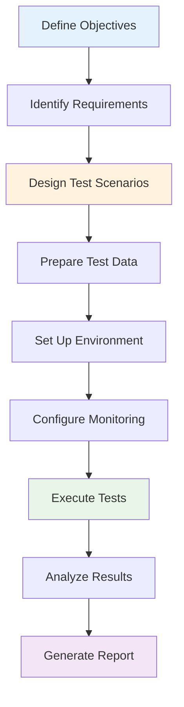
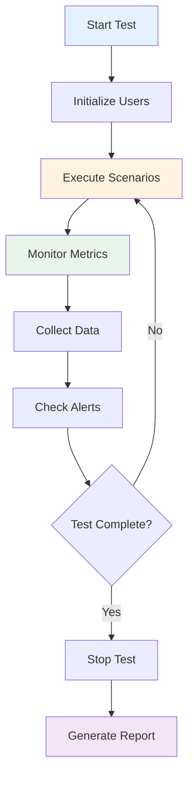

---
# Auto-generated front matter
Title: Load-Testing
LastUpdated: 2025-11-06T20:45:58.427410
Tags: []
Status: draft
---

# Load Testing

## Overview

This module covers load testing concepts including test planning, execution, monitoring, and analysis. These concepts are essential for ensuring system performance under various load conditions.

## Table of Contents

1. [Load Test Planning](#load-test-planning)
2. [Test Execution](#test-execution)
3. [Performance Monitoring](#performance-monitoring)
4. [Results Analysis](#results-analysis)
5. [Applications](#applications)
6. [Complexity Analysis](#complexity-analysis)
7. [Follow-up Questions](#follow-up-questions)

## Load Test Planning

### Theory

Load test planning involves defining test objectives, identifying performance requirements, designing test scenarios, and preparing the test environment. It's crucial for meaningful and actionable test results.

### Load Test Planning Flow Diagram



### Load Test Planning Implementation

#### Golang Implementation

```go
package main

import (
    "fmt"
    "math"
    "sync"
    "time"
)

type LoadTestPlan struct {
    Name            string
    Description     string
    Objectives      []string
    Requirements    PerformanceRequirements
    Scenarios       []TestScenario
    Environment     TestEnvironment
    Monitoring      MonitoringConfig
    Duration        time.Duration
    StartTime       time.Time
    EndTime         time.Time
}

type PerformanceRequirements struct {
    MaxResponseTime    time.Duration
    MinThroughput      int
    MaxErrorRate       float64
    MaxCPUUsage        float64
    MaxMemoryUsage     int64
    ConcurrentUsers    int
}

type TestScenario struct {
    Name        string
    Weight      float64
    Duration    time.Duration
    RampUp      time.Duration
    RampDown    time.Duration
    Operations  []Operation
}

type Operation struct {
    Name        string
    Method      string
    URL         string
    Headers     map[string]string
    Body        string
    ThinkTime   time.Duration
    Weight      float64
}

type TestEnvironment struct {
    BaseURL     string
    Environment string
    Config      map[string]string
    Headers     map[string]string
}

type MonitoringConfig struct {
    Metrics     []string
    Interval    time.Duration
    Alerts      []Alert
    Logging     bool
}

type Alert struct {
    Metric      string
    Threshold   float64
    Operator    string
    Message     string
}

type LoadTestPlanner struct {
    Plans map[string]*LoadTestPlan
    mutex sync.RWMutex
}

func NewLoadTestPlanner() *LoadTestPlanner {
    return &LoadTestPlanner{
        Plans: make(map[string]*LoadTestPlan),
    }
}

func (ltp *LoadTestPlanner) CreatePlan(name, description string) *LoadTestPlan {
    plan := &LoadTestPlan{
        Name:        name,
        Description: description,
        Objectives:  make([]string, 0),
        Requirements: PerformanceRequirements{},
        Scenarios:   make([]TestScenario, 0),
        Environment: TestEnvironment{},
        Monitoring:  MonitoringConfig{},
    }
    
    ltp.mutex.Lock()
    ltp.Plans[name] = plan
    ltp.mutex.Unlock()
    
    return plan
}

func (ltp *LoadTestPlanner) AddObjective(planName, objective string) {
    ltp.mutex.Lock()
    defer ltp.mutex.Unlock()
    
    if plan, exists := ltp.Plans[planName]; exists {
        plan.Objectives = append(plan.Objectives, objective)
    }
}

func (ltp *LoadTestPlanner) SetRequirements(planName string, req PerformanceRequirements) {
    ltp.mutex.Lock()
    defer ltp.mutex.Unlock()
    
    if plan, exists := ltp.Plans[planName]; exists {
        plan.Requirements = req
    }
}

func (ltp *LoadTestPlanner) AddScenario(planName string, scenario TestScenario) {
    ltp.mutex.Lock()
    defer ltp.mutex.Unlock()
    
    if plan, exists := ltp.Plans[planName]; exists {
        plan.Scenarios = append(plan.Scenarios, scenario)
    }
}

func (ltp *LoadTestPlanner) SetEnvironment(planName string, env TestEnvironment) {
    ltp.mutex.Lock()
    defer ltp.mutex.Unlock()
    
    if plan, exists := ltp.Plans[planName]; exists {
        plan.Environment = env
    }
}

func (ltp *LoadTestPlanner) SetMonitoring(planName string, config MonitoringConfig) {
    ltp.mutex.Lock()
    defer ltp.mutex.Unlock()
    
    if plan, exists := ltp.Plans[planName]; exists {
        plan.Monitoring = config
    }
}

func (ltp *LoadTestPlanner) ValidatePlan(planName string) []string {
    ltp.mutex.RLock()
    defer ltp.mutex.RUnlock()
    
    var errors []string
    
    if plan, exists := ltp.Plans[planName]; exists {
        if len(plan.Objectives) == 0 {
            errors = append(errors, "No objectives defined")
        }
        
        if plan.Requirements.MaxResponseTime == 0 {
            errors = append(errors, "No response time requirement defined")
        }
        
        if len(plan.Scenarios) == 0 {
            errors = append(errors, "No test scenarios defined")
        }
        
        if plan.Environment.BaseURL == "" {
            errors = append(errors, "No base URL defined")
        }
        
        if plan.Duration == 0 {
            errors = append(errors, "No test duration defined")
        }
    } else {
        errors = append(errors, "Plan not found")
    }
    
    return errors
}

func (ltp *LoadTestPlanner) GetPlan(planName string) *LoadTestPlan {
    ltp.mutex.RLock()
    defer ltp.mutex.RUnlock()
    
    return ltp.Plans[planName]
}

func (ltp *LoadTestPlanner) ListPlans() []string {
    ltp.mutex.RLock()
    defer ltp.mutex.RUnlock()
    
    plans := make([]string, 0, len(ltp.Plans))
    for name := range ltp.Plans {
        plans = append(plans, name)
    }
    
    return plans
}

func (ltp *LoadTestPlanner) GenerateTestScript(planName string) string {
    ltp.mutex.RLock()
    defer ltp.mutex.RUnlock()
    
    if plan, exists := ltp.Plans[planName]; exists {
        script := fmt.Sprintf("Load Test Script for: %s\n", plan.Name)
        script += fmt.Sprintf("Description: %s\n", plan.Description)
        script += fmt.Sprintf("Duration: %v\n", plan.Duration)
        script += fmt.Sprintf("Base URL: %s\n", plan.Environment.BaseURL)
        script += "\nObjectives:\n"
        for i, obj := range plan.Objectives {
            script += fmt.Sprintf("%d. %s\n", i+1, obj)
        }
        script += "\nScenarios:\n"
        for i, scenario := range plan.Scenarios {
            script += fmt.Sprintf("%d. %s (Weight: %.2f)\n", i+1, scenario.Name, scenario.Weight)
        }
        return script
    }
    
    return "Plan not found"
}

func main() {
    fmt.Println("Load Test Planning Demo:")
    
    planner := NewLoadTestPlanner()
    
    // Create a load test plan
    plan := planner.CreatePlan("API Load Test", "Test API performance under load")
    
    // Add objectives
    planner.AddObjective("API Load Test", "Measure response times under normal load")
    planner.AddObjective("API Load Test", "Identify performance bottlenecks")
    planner.AddObjective("API Load Test", "Validate system stability")
    
    // Set requirements
    requirements := PerformanceRequirements{
        MaxResponseTime: 500 * time.Millisecond,
        MinThroughput:   1000,
        MaxErrorRate:    0.01,
        MaxCPUUsage:     80.0,
        MaxMemoryUsage:  1024 * 1024 * 1024, // 1GB
        ConcurrentUsers: 100,
    }
    planner.SetRequirements("API Load Test", requirements)
    
    // Add scenarios
    scenario1 := TestScenario{
        Name:     "Login Scenario",
        Weight:   0.3,
        Duration: 5 * time.Minute,
        RampUp:   1 * time.Minute,
        RampDown: 1 * time.Minute,
        Operations: []Operation{
            {
                Name:      "Login",
                Method:    "POST",
                URL:       "/api/login",
                Headers:   map[string]string{"Content-Type": "application/json"},
                Body:      `{"username": "test", "password": "test"}`,
                ThinkTime: 2 * time.Second,
                Weight:    1.0,
            },
        },
    }
    planner.AddScenario("API Load Test", scenario1)
    
    scenario2 := TestScenario{
        Name:     "Data Retrieval Scenario",
        Weight:   0.7,
        Duration: 5 * time.Minute,
        RampUp:   1 * time.Minute,
        RampDown: 1 * time.Minute,
        Operations: []Operation{
            {
                Name:      "Get Data",
                Method:    "GET",
                URL:       "/api/data",
                Headers:   map[string]string{"Authorization": "Bearer token"},
                ThinkTime: 1 * time.Second,
                Weight:    1.0,
            },
        },
    }
    planner.AddScenario("API Load Test", scenario2)
    
    // Set environment
    environment := TestEnvironment{
        BaseURL:     "https://api.example.com",
        Environment: "staging",
        Config: map[string]string{
            "timeout": "30s",
            "retries": "3",
        },
        Headers: map[string]string{
            "User-Agent": "LoadTest/1.0",
        },
    }
    planner.SetEnvironment("API Load Test", environment)
    
    // Set monitoring
    monitoring := MonitoringConfig{
        Metrics:  []string{"response_time", "throughput", "error_rate", "cpu_usage", "memory_usage"},
        Interval: 1 * time.Second,
        Alerts: []Alert{
            {
                Metric:    "response_time",
                Threshold: 500,
                Operator:  ">",
                Message:   "Response time exceeded threshold",
            },
        },
        Logging: true,
    }
    planner.SetMonitoring("API Load Test", monitoring)
    
    // Validate plan
    errors := planner.ValidatePlan("API Load Test")
    if len(errors) > 0 {
        fmt.Println("Plan validation errors:")
        for _, err := range errors {
            fmt.Printf("- %s\n", err)
        }
    } else {
        fmt.Println("Plan validation passed")
    }
    
    // Generate test script
    script := planner.GenerateTestScript("API Load Test")
    fmt.Printf("\nTest Script:\n%s\n", script)
    
    // List plans
    plans := planner.ListPlans()
    fmt.Printf("Available plans: %v\n", plans)
}
```

## Test Execution

### Theory

Test execution involves running the load tests according to the plan, monitoring system behavior, and collecting performance metrics. It requires careful orchestration of test scenarios and real-time monitoring.

### Test Execution Flow Diagram



### Test Execution Implementation

#### Golang Implementation

```go
package main

import (
    "fmt"
    "math"
    "sync"
    "time"
)

type LoadTestExecutor struct {
    Plan        *LoadTestPlan
    Results     *TestResults
    mutex       sync.RWMutex
    isRunning   bool
    stopChan    chan bool
}

type TestResults struct {
    StartTime       time.Time
    EndTime         time.Time
    Duration        time.Duration
    TotalRequests   int
    SuccessfulRequests int
    FailedRequests  int
    ResponseTimes   []time.Duration
    Throughput      float64
    ErrorRate       float64
    Scenarios       map[string]*ScenarioResults
}

type ScenarioResults struct {
    Name            string
    TotalRequests   int
    SuccessfulRequests int
    FailedRequests  int
    ResponseTimes   []time.Duration
    Throughput      float64
    ErrorRate       float64
    StartTime       time.Time
    EndTime         time.Time
}

type VirtualUser struct {
    ID          int
    Scenario    TestScenario
    Results     *ScenarioResults
    mutex       sync.RWMutex
}

func NewLoadTestExecutor(plan *LoadTestPlan) *LoadTestExecutor {
    return &LoadTestExecutor{
        Plan:     plan,
        Results:  &TestResults{},
        stopChan: make(chan bool),
    }
}

func (lte *LoadTestExecutor) StartTest() error {
    lte.mutex.Lock()
    defer lte.mutex.Unlock()
    
    if lte.isRunning {
        return fmt.Errorf("test is already running")
    }
    
    lte.isRunning = true
    lte.Results.StartTime = time.Now()
    lte.Results.Scenarios = make(map[string]*ScenarioResults)
    
    // Initialize scenario results
    for _, scenario := range lte.Plan.Scenarios {
        lte.Results.Scenarios[scenario.Name] = &ScenarioResults{
            Name:      scenario.Name,
            StartTime: time.Now(),
        }
    }
    
    fmt.Println("Load test started")
    return nil
}

func (lte *LoadTestExecutor) StopTest() {
    lte.mutex.Lock()
    defer lte.mutex.Unlock()
    
    if !lte.isRunning {
        return
    }
    
    lte.isRunning = false
    lte.Results.EndTime = time.Now()
    lte.Results.Duration = lte.Results.EndTime.Sub(lte.Results.StartTime)
    
    // Calculate final metrics
    lte.calculateMetrics()
    
    fmt.Println("Load test stopped")
}

func (lte *LoadTestExecutor) ExecuteTest() error {
    if err := lte.StartTest(); err != nil {
        return err
    }
    
    defer lte.StopTest()
    
    // Create virtual users
    var wg sync.WaitGroup
    userCount := lte.Plan.Requirements.ConcurrentUsers
    
    for i := 0; i < userCount; i++ {
        wg.Add(1)
        go func(userID int) {
            defer wg.Done()
            lte.runVirtualUser(userID)
        }(i)
    }
    
    // Wait for test duration
    select {
    case <-time.After(lte.Plan.Duration):
        // Test completed
    case <-lte.stopChan:
        // Test stopped manually
    }
    
    wg.Wait()
    return nil
}

func (lte *LoadTestExecutor) runVirtualUser(userID int) {
    // Select scenario based on weight
    scenario := lte.selectScenario()
    
    user := &VirtualUser{
        ID:       userID,
        Scenario: scenario,
        Results:  lte.Results.Scenarios[scenario.Name],
    }
    
    // Execute scenario
    for lte.isRunning {
        for _, operation := range scenario.Operations {
            if !lte.isRunning {
                break
            }
            
            // Execute operation
            start := time.Now()
            success := lte.executeOperation(operation)
            duration := time.Since(start)
            
            // Record results
            user.mutex.Lock()
            user.Results.TotalRequests++
            if success {
                user.Results.SuccessfulRequests++
            } else {
                user.Results.FailedRequests++
            }
            user.Results.ResponseTimes = append(user.Results.ResponseTimes, duration)
            user.mutex.Unlock()
            
            // Think time
            time.Sleep(operation.ThinkTime)
        }
    }
}

func (lte *LoadTestExecutor) selectScenario() TestScenario {
    // Simple weighted selection
    totalWeight := 0.0
    for _, scenario := range lte.Plan.Scenarios {
        totalWeight += scenario.Weight
    }
    
    rand := math.Mod(float64(time.Now().UnixNano()), totalWeight)
    currentWeight := 0.0
    
    for _, scenario := range lte.Plan.Scenarios {
        currentWeight += scenario.Weight
        if rand <= currentWeight {
            return scenario
        }
    }
    
    return lte.Plan.Scenarios[0]
}

func (lte *LoadTestExecutor) executeOperation(operation Operation) bool {
    // Simulate operation execution
    // In a real implementation, this would make actual HTTP requests
    
    // Simulate response time based on operation complexity
    baseTime := 100 * time.Millisecond
    if operation.Method == "POST" {
        baseTime = 200 * time.Millisecond
    }
    
    // Add some randomness
    variation := time.Duration(math.Mod(float64(time.Now().UnixNano()), 100)) * time.Millisecond
    responseTime := baseTime + variation
    
    // Simulate occasional failures
    if math.Mod(float64(time.Now().UnixNano()), 100) < 5 { // 5% failure rate
        return false
    }
    
    time.Sleep(responseTime)
    return true
}

func (lte *LoadTestExecutor) calculateMetrics() {
    lte.mutex.Lock()
    defer lte.mutex.Unlock()
    
    // Calculate overall metrics
    totalRequests := 0
    successfulRequests := 0
    var allResponseTimes []time.Duration
    
    for _, scenario := range lte.Results.Scenarios {
        totalRequests += scenario.TotalRequests
        successfulRequests += scenario.SuccessfulRequests
        allResponseTimes = append(allResponseTimes, scenario.ResponseTimes...)
        
        // Calculate scenario metrics
        scenario.Throughput = float64(scenario.TotalRequests) / lte.Results.Duration.Seconds()
        if scenario.TotalRequests > 0 {
            scenario.ErrorRate = float64(scenario.FailedRequests) / float64(scenario.TotalRequests)
        }
    }
    
    lte.Results.TotalRequests = totalRequests
    lte.Results.SuccessfulRequests = successfulRequests
    lte.Results.FailedRequests = totalRequests - successfulRequests
    lte.Results.ResponseTimes = allResponseTimes
    lte.Results.Throughput = float64(totalRequests) / lte.Results.Duration.Seconds()
    lte.Results.ErrorRate = float64(lte.Results.FailedRequests) / float64(totalRequests)
}

func (lte *LoadTestExecutor) GetResults() *TestResults {
    lte.mutex.RLock()
    defer lte.mutex.RUnlock()
    
    return lte.Results
}

func (lte *LoadTestExecutor) GetRealTimeMetrics() map[string]interface{} {
    lte.mutex.RLock()
    defer lte.mutex.RUnlock()
    
    if !lte.isRunning {
        return map[string]interface{}{}
    }
    
    elapsed := time.Since(lte.Results.StartTime)
    
    return map[string]interface{}{
        "elapsed_time":    elapsed.String(),
        "total_requests":  lte.Results.TotalRequests,
        "throughput":      float64(lte.Results.TotalRequests) / elapsed.Seconds(),
        "error_rate":      lte.Results.ErrorRate,
        "is_running":      lte.isRunning,
    }
}

func (lte *LoadTestExecutor) Stop() {
    lte.mutex.Lock()
    defer lte.mutex.Unlock()
    
    if lte.isRunning {
        lte.stopChan <- true
    }
}

func main() {
    fmt.Println("Load Test Execution Demo:")
    
    // Create a simple test plan
    plan := &LoadTestPlan{
        Name:        "Demo Load Test",
        Description: "Simple load test for demonstration",
        Duration:    10 * time.Second,
        Requirements: PerformanceRequirements{
            ConcurrentUsers: 5,
        },
        Scenarios: []TestScenario{
            {
                Name:     "API Test",
                Weight:   1.0,
                Duration: 10 * time.Second,
                Operations: []Operation{
                    {
                        Name:      "GET Request",
                        Method:    "GET",
                        URL:       "/api/test",
                        ThinkTime: 1 * time.Second,
                        Weight:    1.0,
                    },
                },
            },
        },
    }
    
    // Create executor
    executor := NewLoadTestExecutor(plan)
    
    // Execute test
    fmt.Println("Starting load test...")
    if err := executor.ExecuteTest(); err != nil {
        fmt.Printf("Error executing test: %v\n", err)
        return
    }
    
    // Get results
    results := executor.GetResults()
    fmt.Printf("\nTest Results:\n")
    fmt.Printf("Duration: %v\n", results.Duration)
    fmt.Printf("Total Requests: %d\n", results.TotalRequests)
    fmt.Printf("Successful Requests: %d\n", results.SuccessfulRequests)
    fmt.Printf("Failed Requests: %d\n", results.FailedRequests)
    fmt.Printf("Throughput: %.2f req/s\n", results.Throughput)
    fmt.Printf("Error Rate: %.2f%%\n", results.ErrorRate*100)
    
    // Calculate response time statistics
    if len(results.ResponseTimes) > 0 {
        var total time.Duration
        var min, max time.Duration = results.ResponseTimes[0], results.ResponseTimes[0]
        
        for _, rt := range results.ResponseTimes {
            total += rt
            if rt < min {
                min = rt
            }
            if rt > max {
                max = rt
            }
        }
        
        avg := total / time.Duration(len(results.ResponseTimes))
        fmt.Printf("Response Times - Min: %v, Max: %v, Avg: %v\n", min, max, avg)
    }
}
```

## Follow-up Questions

### 1. Load Test Planning
**Q: What are the key components of a load test plan?**
A: Objectives, performance requirements, test scenarios, environment configuration, monitoring setup, and success criteria.

### 2. Test Execution
**Q: How do you handle test execution failures?**
A: Implement retry mechanisms, graceful error handling, real-time monitoring, and automatic test termination on critical failures.

### 3. Performance Monitoring
**Q: What metrics should be monitored during load testing?**
A: Response time, throughput, error rate, CPU usage, memory usage, database performance, and network latency.

## Complexity Analysis

| Operation | Load Test Planning | Test Execution | Results Analysis |
|-----------|-------------------|----------------|------------------|
| Create Plan | O(1) | N/A | N/A |
| Execute Test | N/A | O(n) | N/A |
| Analyze Results | N/A | N/A | O(n log n) |
| Generate Report | N/A | N/A | O(n) |

## Applications

1. **Load Test Planning**: Performance testing strategy, capacity planning, SLA validation
2. **Test Execution**: Automated testing, continuous integration, performance regression testing
3. **Performance Monitoring**: Real-time monitoring, alerting, system health checks
4. **Load Testing**: Web applications, APIs, microservices, database systems

---

**Next**: [Security Engineering](../../../README.md) | **Previous**: [Performance Engineering](README.md) | **Up**: [Phase 2 Advanced](README.md)


## Results Analysis

<!-- AUTO-GENERATED ANCHOR: originally referenced as #results-analysis -->

Placeholder content. Please replace with proper section.
