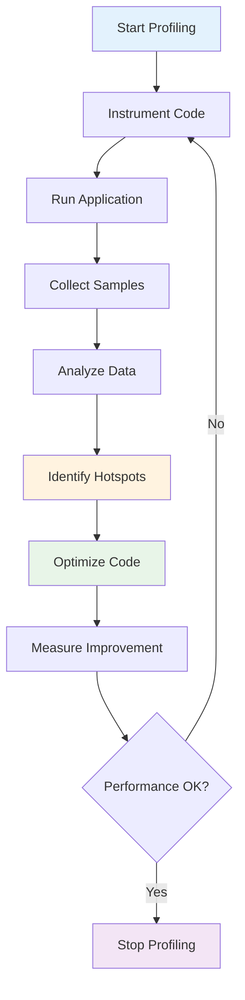
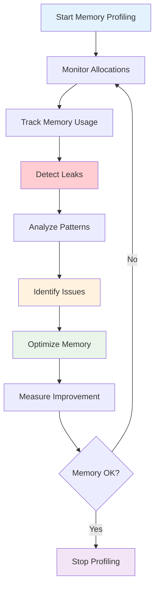

# Profiling and Optimization

## Overview

This module covers performance profiling and optimization techniques including CPU profiling, memory profiling, bottleneck identification, and optimization strategies. These concepts are essential for building high-performance systems.

## Table of Contents

1. [CPU Profiling](#cpu-profiling/)
2. [Memory Profiling](#memory-profiling/)
3. [Bottleneck Identification](#bottleneck-identification/)
4. [Optimization Strategies](#optimization-strategies/)
5. [Applications](#applications/)
6. [Complexity Analysis](#complexity-analysis/)
7. [Follow-up Questions](#follow-up-questions/)

## CPU Profiling

### Theory

CPU profiling helps identify performance bottlenecks by measuring where a program spends its time. It provides insights into function call frequencies, execution times, and resource utilization.

### CPU Profiling Flow Diagram



### CPU Profiling Implementation

#### Golang Implementation

```go
package main

import (
    "fmt"
    "math"
    "runtime"
    "runtime/pprof"
    "sort"
    "sync"
    "time"
)

type Profiler struct {
    StartTime time.Time
    EndTime   time.Time
    Samples   []ProfileSample
    mutex     sync.RWMutex
}

type ProfileSample struct {
    Function    string
    Duration    time.Duration
    CallCount   int
    CPUPercent  float64
    MemoryUsage int64
}

type FunctionStats struct {
    Name        string
    TotalTime   time.Duration
    CallCount   int
    AvgTime     time.Duration
    MaxTime     time.Duration
    MinTime     time.Duration
    CPUPercent  float64
}

type CPUProfiler struct {
    Profiler
    Functions map[string]*FunctionStats
    mutex     sync.RWMutex
}

func NewCPUProfiler() *CPUProfiler {
    return &CPUProfiler{
        Profiler: Profiler{
            Samples: make([]ProfileSample, 0),
        },
        Functions: make(map[string]*FunctionStats),
    }
}

func (cp *CPUProfiler) StartProfiling() {
    cp.mutex.Lock()
    defer cp.mutex.Unlock()
    
    cp.StartTime = time.Now()
    fmt.Println("CPU profiling started")
}

func (cp *CPUProfiler) StopProfiling() {
    cp.mutex.Lock()
    defer cp.mutex.Unlock()
    
    cp.EndTime = time.Now()
    fmt.Printf("CPU profiling stopped. Duration: %v\n", cp.EndTime.Sub(cp.StartTime))
}

func (cp *CPUProfiler) ProfileFunction(name string, fn func()) {
    start := time.Now()
    startCPU := cp.getCPUTime()
    startMem := cp.getMemoryUsage()
    
    fn()
    
    end := time.Now()
    endCPU := cp.getCPUTime()
    endMem := cp.getMemoryUsage()
    
    duration := end.Sub(start)
    cpuTime := endCPU - startCPU
    memoryUsed := endMem - startMem
    
    sample := ProfileSample{
        Function:    name,
        Duration:    duration,
        CallCount:   1,
        CPUPercent:  float64(cpuTime) / float64(duration.Nanoseconds()) * 100,
        MemoryUsage: memoryUsed,
    }
    
    cp.mutex.Lock()
    cp.Samples = append(cp.Samples, sample)
    
    // Update function stats
    if stats, exists := cp.Functions[name]; exists {
        stats.TotalTime += duration
        stats.CallCount++
        stats.AvgTime = stats.TotalTime / time.Duration(stats.CallCount)
        if duration > stats.MaxTime {
            stats.MaxTime = duration
        }
        if duration < stats.MinTime || stats.MinTime == 0 {
            stats.MinTime = duration
        }
        stats.CPUPercent = (stats.CPUPercent + sample.CPUPercent) / 2
    } else {
        cp.Functions[name] = &FunctionStats{
            Name:       name,
            TotalTime:  duration,
            CallCount:  1,
            AvgTime:    duration,
            MaxTime:    duration,
            MinTime:    duration,
            CPUPercent: sample.CPUPercent,
        }
    }
    cp.mutex.Unlock()
}

func (cp *CPUProfiler) getCPUTime() int64 {
    var rusage runtime.MemStats
    runtime.ReadMemStats(&rusage)
    return int64(rusage.NumGC)
}

func (cp *CPUProfiler) getMemoryUsage() int64 {
    var m runtime.MemStats
    runtime.ReadMemStats(&m)
    return int64(m.Alloc)
}

func (cp *CPUProfiler) GetTopFunctions(limit int) []FunctionStats {
    cp.mutex.RLock()
    defer cp.mutex.RUnlock()
    
    functions := make([]FunctionStats, 0, len(cp.Functions))
    for _, stats := range cp.Functions {
        functions = append(functions, *stats)
    }
    
    // Sort by total time
    sort.Slice(functions, func(i, j int) bool {
        return functions[i].TotalTime > functions[j].TotalTime
    })
    
    if limit > 0 && limit < len(functions) {
        return functions[:limit]
    }
    
    return functions
}

func (cp *CPUProfiler) GetFunctionStats(name string) *FunctionStats {
    cp.mutex.RLock()
    defer cp.mutex.RUnlock()
    
    if stats, exists := cp.Functions[name]; exists {
        return stats
    }
    return nil
}

func (cp *CPUProfiler) GetProfileReport() map[string]interface{} {
    cp.mutex.RLock()
    defer cp.mutex.RUnlock()
    
    totalTime := cp.EndTime.Sub(cp.StartTime)
    totalSamples := len(cp.Samples)
    
    report := map[string]interface{}{
        "total_time":     totalTime.String(),
        "total_samples":  totalSamples,
        "functions":      len(cp.Functions),
        "top_functions":  cp.GetTopFunctions(5),
    }
    
    return report
}

func (cp *CPUProfiler) ExportProfile(filename string) error {
    file, err := os.Create(filename)
    if err != nil {
        return err
    }
    defer file.Close()
    
    return pprof.StartCPUProfile(file)
}

func (cp *CPUProfiler) StopProfile() {
    pprof.StopCPUProfile()
}

// Example functions to profile
func fibonacci(n int) int {
    if n <= 1 {
        return n
    }
    return fibonacci(n-1) + fibonacci(n-2)
}

func bubbleSort(arr []int) {
    n := len(arr)
    for i := 0; i < n-1; i++ {
        for j := 0; j < n-i-1; j++ {
            if arr[j] > arr[j+1] {
                arr[j], arr[j+1] = arr[j+1], arr[j]
            }
        }
    }
}

func matrixMultiply(a, b [][]float64) [][]float64 {
    n := len(a)
    result := make([][]float64, n)
    for i := range result {
        result[i] = make([]float64, n)
    }
    
    for i := 0; i < n; i++ {
        for j := 0; j < n; j++ {
            for k := 0; k < n; k++ {
                result[i][j] += a[i][k] * b[k][j]
            }
        }
    }
    
    return result
}

func main() {
    fmt.Println("CPU Profiling Demo:")
    
    profiler := NewCPUProfiler()
    
    // Start profiling
    profiler.StartProfiling()
    
    // Profile different functions
    profiler.ProfileFunction("fibonacci", func() {
        fibonacci(30)
    })
    
    profiler.ProfileFunction("bubble_sort", func() {
        arr := make([]int, 1000)
        for i := range arr {
            arr[i] = 1000 - i
        }
        bubbleSort(arr)
    })
    
    profiler.ProfileFunction("matrix_multiply", func() {
        n := 100
        a := make([][]float64, n)
        b := make([][]float64, n)
        for i := 0; i < n; i++ {
            a[i] = make([]float64, n)
            b[i] = make([]float64, n)
            for j := 0; j < n; j++ {
                a[i][j] = float64(i + j)
                b[i][j] = float64(i - j)
            }
        }
        matrixMultiply(a, b)
    })
    
    // Stop profiling
    profiler.StopProfiling()
    
    // Get report
    report := profiler.GetProfileReport()
    fmt.Printf("Profile Report: %+v\n", report)
    
    // Get top functions
    topFunctions := profiler.GetTopFunctions(3)
    fmt.Println("\nTop Functions by Total Time:")
    for i, fn := range topFunctions {
        fmt.Printf("%d. %s: %v (calls: %d, avg: %v)\n", 
                   i+1, fn.Name, fn.TotalTime, fn.CallCount, fn.AvgTime)
    }
}
```

## Memory Profiling

### Theory

Memory profiling helps identify memory leaks, excessive allocations, and memory usage patterns. It provides insights into heap usage, garbage collection, and memory allocation patterns.

### Memory Profiling Flow Diagram



### Memory Profiling Implementation

#### Golang Implementation

```go
package main

import (
    "fmt"
    "runtime"
    "runtime/pprof"
    "sync"
    "time"
)

type MemoryProfiler struct {
    StartTime    time.Time
    EndTime      time.Time
    Samples      []MemorySample
    mutex        sync.RWMutex
    InitialStats runtime.MemStats
    FinalStats   runtime.MemStats
}

type MemorySample struct {
    Timestamp    time.Time
    Alloc        uint64
    TotalAlloc   uint64
    Sys          uint64
    NumGC        uint32
    PauseTotalNs uint64
    NumGoroutine int
}

type MemoryLeakDetector struct {
    Samples    []MemorySample
    Threshold  float64
    mutex      sync.RWMutex
}

func NewMemoryProfiler() *MemoryProfiler {
    var initialStats runtime.MemStats
    runtime.ReadMemStats(&initialStats)
    
    return &MemoryProfiler{
        InitialStats: initialStats,
        Samples:      make([]MemorySample, 0),
    }
}

func (mp *MemoryProfiler) StartProfiling() {
    mp.mutex.Lock()
    defer mp.mutex.Unlock()
    
    mp.StartTime = time.Now()
    runtime.ReadMemStats(&mp.InitialStats)
    fmt.Println("Memory profiling started")
}

func (mp *MemoryProfiler) StopProfiling() {
    mp.mutex.Lock()
    defer mp.mutex.Unlock()
    
    mp.EndTime = time.Now()
    runtime.ReadMemStats(&mp.FinalStats)
    fmt.Printf("Memory profiling stopped. Duration: %v\n", mp.EndTime.Sub(mp.StartTime))
}

func (mp *MemoryProfiler) SampleMemory() {
    mp.mutex.Lock()
    defer mp.mutex.Unlock()
    
    var stats runtime.MemStats
    runtime.ReadMemStats(&stats)
    
    sample := MemorySample{
        Timestamp:    time.Now(),
        Alloc:        stats.Alloc,
        TotalAlloc:   stats.TotalAlloc,
        Sys:          stats.Sys,
        NumGC:        stats.NumGC,
        PauseTotalNs: stats.PauseTotalNs,
        NumGoroutine: runtime.NumGoroutine(),
    }
    
    mp.Samples = append(mp.Samples, sample)
}

func (mp *MemoryProfiler) GetMemoryStats() map[string]interface{} {
    mp.mutex.RLock()
    defer mp.mutex.RUnlock()
    
    var currentStats runtime.MemStats
    runtime.ReadMemStats(&currentStats)
    
    return map[string]interface{}{
        "alloc":          currentStats.Alloc,
        "total_alloc":    currentStats.TotalAlloc,
        "sys":            currentStats.Sys,
        "num_gc":         currentStats.NumGC,
        "pause_total_ns": currentStats.PauseTotalNs,
        "num_goroutine":  runtime.NumGoroutine(),
        "heap_objects":   currentStats.HeapObjects,
        "stack_inuse":    currentStats.StackInuse,
    }
}

func (mp *MemoryProfiler) GetMemoryGrowth() map[string]interface{} {
    mp.mutex.RLock()
    defer mp.mutex.RUnlock()
    
    return map[string]interface{}{
        "alloc_growth":        mp.FinalStats.Alloc - mp.InitialStats.Alloc,
        "total_alloc_growth":  mp.FinalStats.TotalAlloc - mp.InitialStats.TotalAlloc,
        "sys_growth":          mp.FinalStats.Sys - mp.InitialStats.Sys,
        "gc_growth":           mp.FinalStats.NumGC - mp.InitialStats.NumGC,
        "pause_growth":        mp.FinalStats.PauseTotalNs - mp.InitialStats.PauseTotalNs,
    }
}

func (mp *MemoryProfiler) DetectMemoryLeaks() []string {
    mp.mutex.RLock()
    defer mp.mutex.RUnlock()
    
    var leaks []string
    
    if len(mp.Samples) < 2 {
        return leaks
    }
    
    // Check for continuous memory growth
    firstSample := mp.Samples[0]
    lastSample := mp.Samples[len(mp.Samples)-1]
    
    if lastSample.Alloc > firstSample.Alloc*2 {
        leaks = append(leaks, "Potential memory leak: continuous allocation growth")
    }
    
    // Check for increasing GC frequency
    if lastSample.NumGC > firstSample.NumGC*3 {
        leaks = append(leaks, "Potential memory leak: increasing GC frequency")
    }
    
    // Check for growing goroutine count
    if lastSample.NumGoroutine > firstSample.NumGoroutine*2 {
        leaks = append(leaks, "Potential goroutine leak: increasing goroutine count")
    }
    
    return leaks
}

func (mp *MemoryProfiler) GetMemoryReport() map[string]interface{} {
    mp.mutex.RLock()
    defer mp.mutex.RUnlock()
    
    totalSamples := len(mp.Samples)
    duration := mp.EndTime.Sub(mp.StartTime)
    
    report := map[string]interface{}{
        "duration":        duration.String(),
        "total_samples":   totalSamples,
        "initial_stats":   mp.InitialStats,
        "final_stats":     mp.FinalStats,
        "memory_growth":   mp.GetMemoryGrowth(),
        "memory_leaks":    mp.DetectMemoryLeaks(),
    }
    
    return report
}

func (mp *MemoryProfiler) ExportMemoryProfile(filename string) error {
    file, err := os.Create(filename)
    if err != nil {
        return err
    }
    defer file.Close()
    
    return pprof.WriteHeapProfile(file)
}

func (mp *MemoryProfiler) ForceGC() {
    runtime.GC()
    fmt.Println("Forced garbage collection")
}

func (mp *MemoryProfiler) GetGCStats() map[string]interface{} {
    var stats runtime.MemStats
    runtime.ReadMemStats(&stats)
    
    return map[string]interface{}{
        "num_gc":         stats.NumGC,
        "pause_total_ns": stats.PauseTotalNs,
        "pause_ns":       stats.PauseNs,
        "pause_end":      stats.PauseEnd,
        "gc_cpu_fraction": stats.GCCPUFraction,
    }
}

// Example functions that use memory
func createLargeSlice(size int) []int {
    slice := make([]int, size)
    for i := 0; i < size; i++ {
        slice[i] = i
    }
    return slice
}

func createLargeMap(size int) map[int]string {
    m := make(map[int]string)
    for i := 0; i < size; i++ {
        m[i] = fmt.Sprintf("value_%d", i)
    }
    return m
}

func createGoroutines(count int) {
    var wg sync.WaitGroup
    for i := 0; i < count; i++ {
        wg.Add(1)
        go func(id int) {
            defer wg.Done()
            time.Sleep(100 * time.Millisecond)
        }(i)
    }
    wg.Wait()
}

func main() {
    fmt.Println("Memory Profiling Demo:")
    
    profiler := NewMemoryProfiler()
    
    // Start profiling
    profiler.StartProfiling()
    
    // Sample memory periodically
    go func() {
        ticker := time.NewTicker(100 * time.Millisecond)
        defer ticker.Stop()
        for {
            select {
            case <-ticker.C:
                profiler.SampleMemory()
            }
        }
    }()
    
    // Perform memory-intensive operations
    profiler.ProfileFunction("create_large_slice", func() {
        createLargeSlice(1000000)
    })
    
    profiler.ProfileFunction("create_large_map", func() {
        createLargeMap(100000)
    })
    
    profiler.ProfileFunction("create_goroutines", func() {
        createGoroutines(1000)
    })
    
    // Wait a bit for sampling
    time.Sleep(1 * time.Second)
    
    // Stop profiling
    profiler.StopProfiling()
    
    // Get memory stats
    stats := profiler.GetMemoryStats()
    fmt.Printf("Current Memory Stats: %+v\n", stats)
    
    // Get memory growth
    growth := profiler.GetMemoryGrowth()
    fmt.Printf("Memory Growth: %+v\n", growth)
    
    // Detect memory leaks
    leaks := profiler.DetectMemoryLeaks()
    if len(leaks) > 0 {
        fmt.Println("Memory Leaks Detected:")
        for _, leak := range leaks {
            fmt.Printf("- %s\n", leak)
        }
    } else {
        fmt.Println("No memory leaks detected")
    }
    
    // Get GC stats
    gcStats := profiler.GetGCStats()
    fmt.Printf("GC Stats: %+v\n", gcStats)
    
    // Force GC
    profiler.ForceGC()
    
    // Get final memory stats
    finalStats := profiler.GetMemoryStats()
    fmt.Printf("Final Memory Stats: %+v\n", finalStats)
}
```

## Follow-up Questions

### 1. CPU Profiling
**Q: What are the different types of CPU profiling techniques?**
A: Sampling-based profiling, instrumentation-based profiling, and statistical profiling. Each has trade-offs between accuracy and overhead.

### 2. Memory Profiling
**Q: How do you identify memory leaks in a Go application?**
A: Monitor memory growth over time, check for increasing GC frequency, analyze heap profiles, and look for goroutine leaks.

### 3. Bottleneck Identification
**Q: What are the common performance bottlenecks in web applications?**
A: Database queries, network I/O, CPU-intensive computations, memory allocations, and inefficient algorithms.

## Complexity Analysis

| Operation | CPU Profiling | Memory Profiling | Bottleneck Analysis |
|-----------|---------------|------------------|-------------------|
| Start | O(1) | O(1) | O(1) |
| Sample | O(1) | O(1) | O(1) |
| Analyze | O(n log n) | O(n) | O(n) |
| Report | O(n) | O(n) | O(n) |

## Applications

1. **CPU Profiling**: Performance optimization, bottleneck identification, algorithm analysis
2. **Memory Profiling**: Memory leak detection, allocation optimization, garbage collection tuning
3. **Bottleneck Identification**: System optimization, capacity planning, performance monitoring
4. **Performance Engineering**: High-performance systems, real-time applications, scalable architectures

---

**Next**: [Load Testing](load-testing.md/) | **Previous**: [Performance Engineering](README.md/) | **Up**: [Performance Engineering](README.md/)
