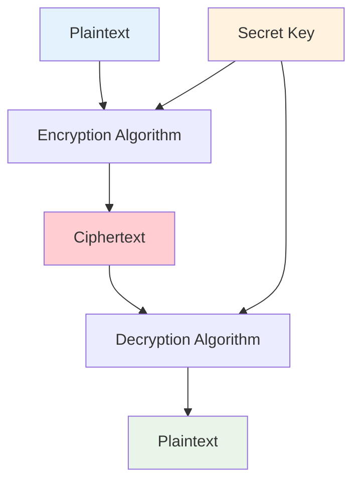
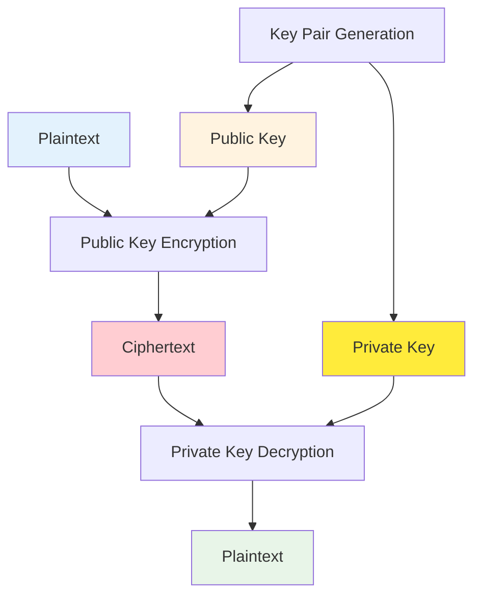

# Cryptography

## Overview

This module covers cryptographic concepts including symmetric encryption, asymmetric encryption, digital signatures, hash functions, and key management. These concepts are essential for secure communication and data protection.

## Table of Contents

1. [Symmetric Encryption](#symmetric-encryption/)
2. [Asymmetric Encryption](#asymmetric-encryption/)
3. [Digital Signatures](#digital-signatures/)
4. [Hash Functions](#hash-functions/)
5. [Applications](#applications/)
6. [Complexity Analysis](#complexity-analysis/)
7. [Follow-up Questions](#follow-up-questions/)

## Symmetric Encryption

### Theory

Symmetric encryption uses the same key for both encryption and decryption. It's fast and efficient but requires secure key distribution. Common algorithms include AES, DES, and ChaCha20.

### Symmetric Encryption Flow Diagram



### Symmetric Encryption Implementation

#### Golang Implementation

```go
package main

import (
    "crypto/aes"
    "crypto/cipher"
    "crypto/rand"
    "crypto/sha256"
    "fmt"
    "io"
)

type SymmetricCrypto struct {
    Key []byte
}

func NewSymmetricCrypto(key []byte) *SymmetricCrypto {
    return &SymmetricCrypto{
        Key: key,
    }
}

func (sc *SymmetricCrypto) GenerateKey(size int) ([]byte, error) {
    key := make([]byte, size)
    _, err := rand.Read(key)
    if err != nil {
        return nil, err
    }
    return key, nil
}

func (sc *SymmetricCrypto) DeriveKey(password string, salt []byte) []byte {
    hash := sha256.Sum256(append([]byte(password), salt...))
    return hash[:]
}

func (sc *SymmetricCrypto) EncryptAES(plaintext []byte) ([]byte, error) {
    block, err := aes.NewCipher(sc.Key)
    if err != nil {
        return nil, err
    }
    
    // Create GCM mode
    gcm, err := cipher.NewGCM(block)
    if err != nil {
        return nil, err
    }
    
    // Generate random nonce
    nonce := make([]byte, gcm.NonceSize())
    if _, err := io.ReadFull(rand.Reader, nonce); err != nil {
        return nil, err
    }
    
    // Encrypt and authenticate
    ciphertext := gcm.Seal(nonce, nonce, plaintext, nil)
    return ciphertext, nil
}

func (sc *SymmetricCrypto) DecryptAES(ciphertext []byte) ([]byte, error) {
    block, err := aes.NewCipher(sc.Key)
    if err != nil {
        return nil, err
    }
    
    // Create GCM mode
    gcm, err := cipher.NewGCM(block)
    if err != nil {
        return nil, err
    }
    
    // Extract nonce
    nonceSize := gcm.NonceSize()
    if len(ciphertext) < nonceSize {
        return nil, fmt.Errorf("ciphertext too short")
    }
    
    nonce, ciphertext := ciphertext[:nonceSize], ciphertext[nonceSize:]
    
    // Decrypt and verify
    plaintext, err := gcm.Open(nil, nonce, ciphertext, nil)
    if err != nil {
        return nil, err
    }
    
    return plaintext, nil
}

func (sc *SymmetricCrypto) EncryptCBC(plaintext []byte) ([]byte, error) {
    block, err := aes.NewCipher(sc.Key)
    if err != nil {
        return nil, err
    }
    
    // Pad plaintext
    padded := sc.pkcs7Padding(plaintext, aes.BlockSize)
    
    // Generate random IV
    iv := make([]byte, aes.BlockSize)
    if _, err := io.ReadFull(rand.Reader, iv); err != nil {
        return nil, err
    }
    
    // Encrypt
    ciphertext := make([]byte, len(padded))
    mode := cipher.NewCBCEncrypter(block, iv)
    mode.CryptBlocks(ciphertext, padded)
    
    // Prepend IV to ciphertext
    return append(iv, ciphertext...), nil
}

func (sc *SymmetricCrypto) DecryptCBC(ciphertext []byte) ([]byte, error) {
    block, err := aes.NewCipher(sc.Key)
    if err != nil {
        return nil, err
    }
    
    if len(ciphertext) < aes.BlockSize {
        return nil, fmt.Errorf("ciphertext too short")
    }
    
    // Extract IV
    iv := ciphertext[:aes.BlockSize]
    ciphertext = ciphertext[aes.BlockSize:]
    
    // Decrypt
    plaintext := make([]byte, len(ciphertext))
    mode := cipher.NewCBCDecrypter(block, iv)
    mode.CryptBlocks(plaintext, ciphertext)
    
    // Remove padding
    return sc.pkcs7Unpadding(plaintext), nil
}

func (sc *SymmetricCrypto) pkcs7Padding(data []byte, blockSize int) []byte {
    padding := blockSize - len(data)%blockSize
    padtext := make([]byte, len(data)+padding)
    copy(padtext, data)
    for i := len(data); i < len(padtext); i++ {
        padtext[i] = byte(padding)
    }
    return padtext
}

func (sc *SymmetricCrypto) pkcs7Unpadding(data []byte) []byte {
    length := len(data)
    if length == 0 {
        return data
    }
    padding := int(data[length-1])
    if padding > length {
        return data
    }
    return data[:length-padding]
}

func (sc *SymmetricCrypto) EncryptChaCha20(plaintext []byte) ([]byte, error) {
    // Generate random nonce
    nonce := make([]byte, 12)
    if _, err := io.ReadFull(rand.Reader, nonce); err != nil {
        return nil, err
    }
    
    // Create cipher
    cipher, err := cipher.NewChaCha20Poly1305(sc.Key)
    if err != nil {
        return nil, err
    }
    
    // Encrypt
    ciphertext := cipher.Seal(nil, nonce, plaintext, nil)
    
    // Prepend nonce to ciphertext
    return append(nonce, ciphertext...), nil
}

func (sc *SymmetricCrypto) DecryptChaCha20(ciphertext []byte) ([]byte, error) {
    if len(ciphertext) < 12 {
        return nil, fmt.Errorf("ciphertext too short")
    }
    
    // Extract nonce
    nonce := ciphertext[:12]
    ciphertext = ciphertext[12:]
    
    // Create cipher
    cipher, err := cipher.NewChaCha20Poly1305(sc.Key)
    if err != nil {
        return nil, err
    }
    
    // Decrypt
    plaintext, err := cipher.Open(nil, nonce, ciphertext, nil)
    if err != nil {
        return nil, err
    }
    
    return plaintext, nil
}

func main() {
    fmt.Println("Symmetric Encryption Demo:")
    
    // Generate key
    sc := NewSymmetricCrypto(nil)
    key, err := sc.GeneriveKey(32) // 256-bit key
    if err != nil {
        fmt.Printf("Error generating key: %v\n", err)
        return
    }
    sc.Key = key
    
    // Test data
    plaintext := []byte("Hello, World! This is a test message.")
    fmt.Printf("Original: %s\n", string(plaintext))
    
    // AES-GCM encryption
    fmt.Println("\nAES-GCM Encryption:")
    encrypted, err := sc.EncryptAES(plaintext)
    if err != nil {
        fmt.Printf("Encryption error: %v\n", err)
        return
    }
    fmt.Printf("Encrypted: %x\n", encrypted)
    
    decrypted, err := sc.DecryptAES(encrypted)
    if err != nil {
        fmt.Printf("Decryption error: %v\n", err)
        return
    }
    fmt.Printf("Decrypted: %s\n", string(decrypted))
    
    // AES-CBC encryption
    fmt.Println("\nAES-CBC Encryption:")
    encrypted, err = sc.EncryptCBC(plaintext)
    if err != nil {
        fmt.Printf("Encryption error: %v\n", err)
        return
    }
    fmt.Printf("Encrypted: %x\n", encrypted)
    
    decrypted, err = sc.DecryptCBC(encrypted)
    if err != nil {
        fmt.Printf("Decryption error: %v\n", err)
        return
    }
    fmt.Printf("Decrypted: %s\n", string(decrypted))
    
    // ChaCha20-Poly1305 encryption
    fmt.Println("\nChaCha20-Poly1305 Encryption:")
    encrypted, err = sc.EncryptChaCha20(plaintext)
    if err != nil {
        fmt.Printf("Encryption error: %v\n", err)
        return
    }
    fmt.Printf("Encrypted: %x\n", encrypted)
    
    decrypted, err = sc.DecryptChaCha20(encrypted)
    if err != nil {
        fmt.Printf("Decryption error: %v\n", err)
        return
    }
    fmt.Printf("Decrypted: %s\n", string(decrypted))
}
```

## Asymmetric Encryption

### Theory

Asymmetric encryption uses different keys for encryption and decryption. It solves the key distribution problem but is slower than symmetric encryption. Common algorithms include RSA, ECDSA, and Ed25519.

### Asymmetric Encryption Flow Diagram



### Asymmetric Encryption Implementation

#### Golang Implementation

```go
package main

import (
    "crypto/ecdsa"
    "crypto/elliptic"
    "crypto/rand"
    "crypto/rsa"
    "crypto/sha256"
    "crypto/x509"
    "encoding/pem"
    "fmt"
    "math/big"
)

type AsymmetricCrypto struct {
    PublicKey  interface{}
    PrivateKey interface{}
}

func NewAsymmetricCrypto() *AsymmetricCrypto {
    return &AsymmetricCrypto{}
}

func (ac *AsymmetricCrypto) GenerateRSAKeyPair(bits int) error {
    privateKey, err := rsa.GenerateKey(rand.Reader, bits)
    if err != nil {
        return err
    }
    
    ac.PrivateKey = privateKey
    ac.PublicKey = &privateKey.PublicKey
    
    return nil
}

func (ac *AsymmetricCrypto) GenerateECDSAKeyPair() error {
    privateKey, err := ecdsa.GenerateKey(elliptic.P256(), rand.Reader)
    if err != nil {
        return err
    }
    
    ac.PrivateKey = privateKey
    ac.PublicKey = &privateKey.PublicKey
    
    return nil
}

func (ac *AsymmetricCrypto) EncryptRSA(plaintext []byte) ([]byte, error) {
    publicKey, ok := ac.PublicKey.(*rsa.PublicKey)
    if !ok {
        return nil, fmt.Errorf("invalid public key type")
    }
    
    // Hash the plaintext
    hash := sha256.New()
    hash.Write(plaintext)
    hashed := hash.Sum(nil)
    
    // Encrypt
    ciphertext, err := rsa.EncryptOAEP(hash, rand.Reader, publicKey, plaintext, nil)
    if err != nil {
        return nil, err
    }
    
    return ciphertext, nil
}

func (ac *AsymmetricCrypto) DecryptRSA(ciphertext []byte) ([]byte, error) {
    privateKey, ok := ac.PrivateKey.(*rsa.PrivateKey)
    if !ok {
        return nil, fmt.Errorf("invalid private key type")
    }
    
    // Hash for decryption
    hash := sha256.New()
    
    // Decrypt
    plaintext, err := rsa.DecryptOAEP(hash, rand.Reader, privateKey, ciphertext, nil)
    if err != nil {
        return nil, err
    }
    
    return plaintext, nil
}

func (ac *AsymmetricCrypto) SignECDSA(message []byte) ([]byte, error) {
    privateKey, ok := ac.PrivateKey.(*ecdsa.PrivateKey)
    if !ok {
        return nil, fmt.Errorf("invalid private key type")
    }
    
    // Hash the message
    hash := sha256.Sum256(message)
    
    // Sign
    r, s, err := ecdsa.Sign(rand.Reader, privateKey, hash[:])
    if err != nil {
        return nil, err
    }
    
    // Encode signature
    signature := append(r.Bytes(), s.Bytes()...)
    return signature, nil
}

func (ac *AsymmetricCrypto) VerifyECDSA(message, signature []byte) bool {
    publicKey, ok := ac.PublicKey.(*ecdsa.PublicKey)
    if !ok {
        return false
    }
    
    // Hash the message
    hash := sha256.Sum256(message)
    
    // Decode signature
    if len(signature) != 64 {
        return false
    }
    
    r := new(big.Int).SetBytes(signature[:32])
    s := new(big.Int).SetBytes(signature[32:])
    
    // Verify
    return ecdsa.Verify(publicKey, hash[:], r, s)
}

func (ac *AsymmetricCrypto) ExportPrivateKey() ([]byte, error) {
    privateKeyBytes, err := x509.MarshalPKCS8PrivateKey(ac.PrivateKey)
    if err != nil {
        return nil, err
    }
    
    privateKeyPEM := pem.EncodeToMemory(&pem.Block{
        Type:  "PRIVATE KEY",
        Bytes: privateKeyBytes,
    })
    
    return privateKeyPEM, nil
}

func (ac *AsymmetricCrypto) ExportPublicKey() ([]byte, error) {
    publicKeyBytes, err := x509.MarshalPKIXPublicKey(ac.PublicKey)
    if err != nil {
        return nil, err
    }
    
    publicKeyPEM := pem.EncodeToMemory(&pem.Block{
        Type:  "PUBLIC KEY",
        Bytes: publicKeyBytes,
    })
    
    return publicKeyPEM, nil
}

func (ac *AsymmetricCrypto) ImportPrivateKey(privateKeyPEM []byte) error {
    block, _ := pem.Decode(privateKeyPEM)
    if block == nil {
        return fmt.Errorf("failed to decode PEM block")
    }
    
    privateKey, err := x509.ParsePKCS8PrivateKey(block.Bytes)
    if err != nil {
        return err
    }
    
    ac.PrivateKey = privateKey
    
    // Extract public key
    switch key := privateKey.(type) {
    case *rsa.PrivateKey:
        ac.PublicKey = &key.PublicKey
    case *ecdsa.PrivateKey:
        ac.PublicKey = &key.PublicKey
    default:
        return fmt.Errorf("unsupported private key type")
    }
    
    return nil
}

func (ac *AsymmetricCrypto) ImportPublicKey(publicKeyPEM []byte) error {
    block, _ := pem.Decode(publicKeyPEM)
    if block == nil {
        return fmt.Errorf("failed to decode PEM block")
    }
    
    publicKey, err := x509.ParsePKIXPublicKey(block.Bytes)
    if err != nil {
        return err
    }
    
    ac.PublicKey = publicKey
    return nil
}

func main() {
    fmt.Println("Asymmetric Encryption Demo:")
    
    ac := NewAsymmetricCrypto()
    
    // Generate RSA key pair
    fmt.Println("Generating RSA key pair...")
    if err := ac.GenerateRSAKeyPair(2048); err != nil {
        fmt.Printf("Error generating RSA keys: %v\n", err)
        return
    }
    
    // Test data
    plaintext := []byte("Hello, World! This is a test message.")
    fmt.Printf("Original: %s\n", string(plaintext))
    
    // RSA encryption
    fmt.Println("\nRSA Encryption:")
    encrypted, err := ac.EncryptRSA(plaintext)
    if err != nil {
        fmt.Printf("Encryption error: %v\n", err)
        return
    }
    fmt.Printf("Encrypted: %x\n", encrypted)
    
    decrypted, err := ac.DecryptRSA(encrypted)
    if err != nil {
        fmt.Printf("Decryption error: %v\n", err)
        return
    }
    fmt.Printf("Decrypted: %s\n", string(decrypted))
    
    // Generate ECDSA key pair
    fmt.Println("\nGenerating ECDSA key pair...")
    if err := ac.GenerateECDSAKeyPair(); err != nil {
        fmt.Printf("Error generating ECDSA keys: %v\n", err)
        return
    }
    
    // ECDSA signing
    fmt.Println("\nECDSA Signing:")
    signature, err := ac.SignECDSA(plaintext)
    if err != nil {
        fmt.Printf("Signing error: %v\n", err)
        return
    }
    fmt.Printf("Signature: %x\n", signature)
    
    // ECDSA verification
    valid := ac.VerifyECDSA(plaintext, signature)
    fmt.Printf("Signature valid: %v\n", valid)
    
    // Test with modified message
    modifiedMessage := []byte("Modified message")
    valid = ac.VerifyECDSA(modifiedMessage, signature)
    fmt.Printf("Modified message signature valid: %v\n", valid)
    
    // Export keys
    fmt.Println("\nExporting keys...")
    privateKeyPEM, err := ac.ExportPrivateKey()
    if err != nil {
        fmt.Printf("Error exporting private key: %v\n", err)
        return
    }
    fmt.Printf("Private Key:\n%s\n", string(privateKeyPEM))
    
    publicKeyPEM, err := ac.ExportPublicKey()
    if err != nil {
        fmt.Printf("Error exporting public key: %v\n", err)
        return
    }
    fmt.Printf("Public Key:\n%s\n", string(publicKeyPEM))
}
```

## Follow-up Questions

### 1. Symmetric Encryption
**Q: What are the advantages and disadvantages of symmetric encryption?**
A: Advantages: Fast, efficient, suitable for large data. Disadvantages: Key distribution problem, key management complexity.

### 2. Asymmetric Encryption
**Q: When would you use RSA vs ECDSA?**
A: Use RSA for encryption and key exchange, ECDSA for digital signatures. ECDSA is more efficient and provides equivalent security with smaller key sizes.

### 3. Digital Signatures
**Q: What properties should a good digital signature have?**
A: Authenticity (proves identity), integrity (detects tampering), non-repudiation (cannot be denied), and verifiability (can be verified by anyone).

## Complexity Analysis

| Operation | Symmetric Encryption | Asymmetric Encryption | Digital Signatures |
|-----------|---------------------|----------------------|-------------------|
| Key Generation | O(1) | O(n²) | O(n²) |
| Encryption | O(n) | O(n²) | N/A |
| Decryption | O(n) | O(n²) | N/A |
| Signing | N/A | N/A | O(n²) |
| Verification | N/A | N/A | O(n²) |

## Applications

1. **Symmetric Encryption**: Data encryption, secure communication, file encryption
2. **Asymmetric Encryption**: Key exchange, secure communication, digital certificates
3. **Digital Signatures**: Authentication, integrity verification, non-repudiation
4. **Cryptography**: Secure systems, privacy protection, data security

---

**Next**: [Network Security](network-security.md/) | **Previous**: [Security Engineering](README.md/) | **Up**: [Security Engineering](README.md/)
