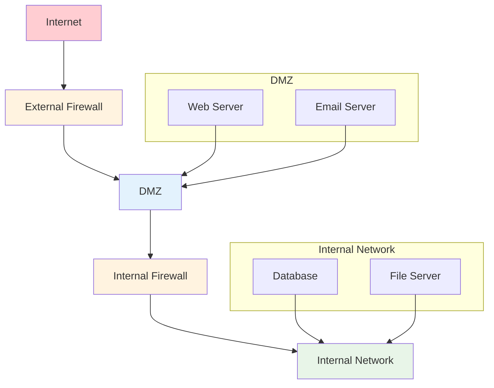
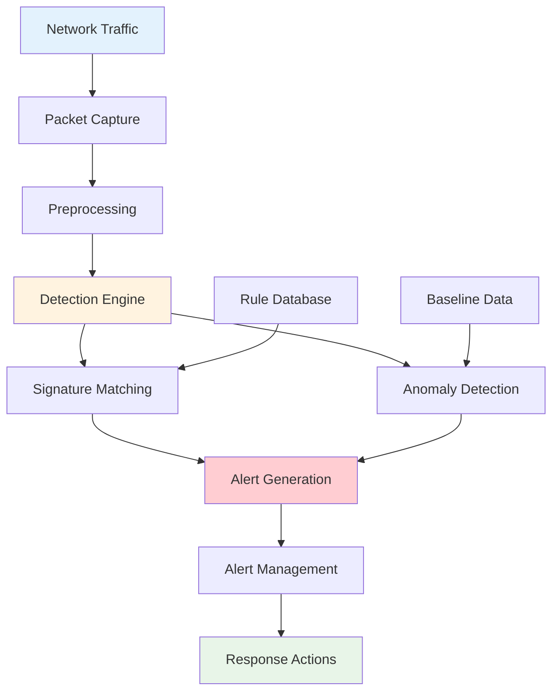

# Network Security

## Overview

This module covers network security concepts including firewalls, intrusion detection, VPNs, secure protocols, and network monitoring. These concepts are essential for protecting network infrastructure and communications.

## Table of Contents

1. [Firewall Management](#firewall-management/)
2. [Intrusion Detection](#intrusion-detection/)
3. [VPN Implementation](#vpn-implementation/)
4. [Secure Protocols](#secure-protocols/)
5. [Applications](#applications/)
6. [Complexity Analysis](#complexity-analysis/)
7. [Follow-up Questions](#follow-up-questions/)

## Firewall Management

### Theory

Firewalls control network traffic based on predefined rules. They can be packet-filtering, stateful, or application-level firewalls. Proper firewall configuration is crucial for network security.

### Firewall Architecture Diagram



### Firewall Management Implementation

#### Golang Implementation

```go
package main

import (
    "fmt"
    "net"
    "sort"
    "sync"
    "time"
)

type FirewallRule struct {
    ID          int
    Action      string // "ALLOW", "DENY", "DROP"
    Protocol    string // "TCP", "UDP", "ICMP", "ALL"
    SourceIP    string
    SourcePort  int
    DestIP      string
    DestPort    int
    Interface   string
    Direction   string // "IN", "OUT", "BOTH"
    Priority    int
    CreatedAt   time.Time
    Enabled     bool
}

type Firewall struct {
    Rules       []FirewallRule
    mutex       sync.RWMutex
    nextID      int
    Logging     bool
    Logs        []FirewallLog
}

type FirewallLog struct {
    Timestamp   time.Time
    RuleID      int
    Action      string
    SourceIP    string
    DestIP      string
    Protocol    string
    Port        int
    Message     string
}

type Packet struct {
    SourceIP    string
    SourcePort  int
    DestIP      string
    DestPort    int
    Protocol    string
    Payload     []byte
    Timestamp   time.Time
}

func NewFirewall() *Firewall {
    return &Firewall{
        Rules:   make([]FirewallRule, 0),
        Logging: true,
        Logs:    make([]FirewallLog, 0),
    }
}

func (fw *Firewall) AddRule(rule FirewallRule) int {
    fw.mutex.Lock()
    defer fw.mutex.Unlock()
    
    rule.ID = fw.nextID
    fw.nextID++
    rule.CreatedAt = time.Now()
    rule.Enabled = true
    
    fw.Rules = append(fw.Rules, rule)
    
    // Sort rules by priority (higher priority first)
    sort.Slice(fw.Rules, func(i, j int) bool {
        return fw.Rules[i].Priority > fw.Rules[j].Priority
    })
    
    fw.log(fmt.Sprintf("Added rule %d: %s %s from %s:%d to %s:%d", 
           rule.ID, rule.Action, rule.Protocol, rule.SourceIP, rule.SourcePort, 
           rule.DestIP, rule.DestPort))
    
    return rule.ID
}

func (fw *Firewall) RemoveRule(ruleID int) bool {
    fw.mutex.Lock()
    defer fw.mutex.Unlock()
    
    for i, rule := range fw.Rules {
        if rule.ID == ruleID {
            fw.Rules = append(fw.Rules[:i], fw.Rules[i+1:]...)
            fw.log(fmt.Sprintf("Removed rule %d", ruleID))
            return true
        }
    }
    
    return false
}

func (fw *Firewall) UpdateRule(ruleID int, updates FirewallRule) bool {
    fw.mutex.Lock()
    defer fw.mutex.Unlock()
    
    for i, rule := range fw.Rules {
        if rule.ID == ruleID {
            if updates.Action != "" {
                fw.Rules[i].Action = updates.Action
            }
            if updates.Protocol != "" {
                fw.Rules[i].Protocol = updates.Protocol
            }
            if updates.SourceIP != "" {
                fw.Rules[i].SourceIP = updates.SourceIP
            }
            if updates.SourcePort != 0 {
                fw.Rules[i].SourcePort = updates.SourcePort
            }
            if updates.DestIP != "" {
                fw.Rules[i].DestIP = updates.DestIP
            }
            if updates.DestPort != 0 {
                fw.Rules[i].DestPort = updates.DestPort
            }
            if updates.Interface != "" {
                fw.Rules[i].Interface = updates.Interface
            }
            if updates.Direction != "" {
                fw.Rules[i].Direction = updates.Direction
            }
            if updates.Priority != 0 {
                fw.Rules[i].Priority = updates.Priority
            }
            if updates.Enabled != rule.Enabled {
                fw.Rules[i].Enabled = updates.Enabled
            }
            
            fw.log(fmt.Sprintf("Updated rule %d", ruleID))
            return true
        }
    }
    
    return false
}

func (fw *Firewall) ProcessPacket(packet Packet) bool {
    fw.mutex.RLock()
    defer fw.mutex.RUnlock()
    
    for _, rule := range fw.Rules {
        if !rule.Enabled {
            continue
        }
        
        if fw.matchesRule(packet, rule) {
            fw.log(fmt.Sprintf("Rule %d matched: %s packet from %s:%d to %s:%d", 
                   rule.ID, rule.Action, packet.SourceIP, packet.SourcePort, 
                   packet.DestIP, packet.DestPort))
            
            return rule.Action == "ALLOW"
        }
    }
    
    // Default deny
    fw.log(fmt.Sprintf("No rule matched: DENY packet from %s:%d to %s:%d", 
           packet.SourceIP, packet.SourcePort, packet.DestIP, packet.DestPort))
    
    return false
}

func (fw *Firewall) matchesRule(packet Packet, rule FirewallRule) bool {
    // Check protocol
    if rule.Protocol != "ALL" && rule.Protocol != packet.Protocol {
        return false
    }
    
    // Check source IP
    if rule.SourceIP != "0.0.0.0/0" && !fw.ipMatches(packet.SourceIP, rule.SourceIP) {
        return false
    }
    
    // Check source port
    if rule.SourcePort != 0 && rule.SourcePort != packet.SourcePort {
        return false
    }
    
    // Check destination IP
    if rule.DestIP != "0.0.0.0/0" && !fw.ipMatches(packet.DestIP, rule.DestIP) {
        return false
    }
    
    // Check destination port
    if rule.DestPort != 0 && rule.DestPort != packet.DestPort {
        return false
    }
    
    return true
}

func (fw *Firewall) ipMatches(ip, cidr string) bool {
    if cidr == "0.0.0.0/0" {
        return true
    }
    
    _, network, err := net.ParseCIDR(cidr)
    if err != nil {
        return false
    }
    
    return network.Contains(net.ParseIP(ip))
}

func (fw *Firewall) log(message string) {
    if !fw.Logging {
        return
    }
    
    log := FirewallLog{
        Timestamp: time.Now(),
        Message:   message,
    }
    
    fw.Logs = append(fw.Logs, log)
    
    // Keep only last 1000 logs
    if len(fw.Logs) > 1000 {
        fw.Logs = fw.Logs[1:]
    }
}

func (fw *Firewall) GetRules() []FirewallRule {
    fw.mutex.RLock()
    defer fw.mutex.RUnlock()
    
    rules := make([]FirewallRule, len(fw.Rules))
    copy(rules, fw.Rules)
    return rules
}

func (fw *Firewall) GetLogs() []FirewallLog {
    fw.mutex.RLock()
    defer fw.mutex.RUnlock()
    
    logs := make([]FirewallLog, len(fw.Logs))
    copy(logs, fw.Logs)
    return logs
}

func (fw *Firewall) GetStats() map[string]interface{} {
    fw.mutex.RLock()
    defer fw.mutex.RUnlock()
    
    totalRules := len(fw.Rules)
    enabledRules := 0
    allowRules := 0
    denyRules := 0
    
    for _, rule := range fw.Rules {
        if rule.Enabled {
            enabledRules++
        }
        if rule.Action == "ALLOW" {
            allowRules++
        } else if rule.Action == "DENY" || rule.Action == "DROP" {
            denyRules++
        }
    }
    
    return map[string]interface{}{
        "total_rules":    totalRules,
        "enabled_rules":  enabledRules,
        "allow_rules":    allowRules,
        "deny_rules":     denyRules,
        "total_logs":     len(fw.Logs),
    }
}

func main() {
    fmt.Println("Firewall Management Demo:")
    
    fw := NewFirewall()
    
    // Add firewall rules
    fw.AddRule(FirewallRule{
        Action:     "ALLOW",
        Protocol:   "TCP",
        SourceIP:   "0.0.0.0/0",
        SourcePort: 0,
        DestIP:     "192.168.1.100",
        DestPort:   80,
        Direction:  "IN",
        Priority:   100,
    })
    
    fw.AddRule(FirewallRule{
        Action:     "ALLOW",
        Protocol:   "TCP",
        SourceIP:   "0.0.0.0/0",
        SourcePort: 0,
        DestIP:     "192.168.1.100",
        DestPort:   443,
        Direction:  "IN",
        Priority:   100,
    })
    
    fw.AddRule(FirewallRule{
        Action:     "DENY",
        Protocol:   "ALL",
        SourceIP:   "10.0.0.0/8",
        SourcePort: 0,
        DestIP:     "0.0.0.0/0",
        DestPort:   0,
        Direction:  "OUT",
        Priority:   50,
    })
    
    fw.AddRule(FirewallRule{
        Action:     "ALLOW",
        Protocol:   "ALL",
        SourceIP:   "0.0.0.0/0",
        SourcePort: 0,
        DestIP:     "0.0.0.0/0",
        DestPort:   0,
        Direction:  "BOTH",
        Priority:   1,
    })
    
    // Test packets
    packets := []Packet{
        {
            SourceIP:   "192.168.1.50",
            SourcePort: 12345,
            DestIP:     "192.168.1.100",
            DestPort:   80,
            Protocol:   "TCP",
            Timestamp:  time.Now(),
        },
        {
            SourceIP:   "10.0.0.5",
            SourcePort: 12345,
            DestIP:     "8.8.8.8",
            DestPort:   53,
            Protocol:   "UDP",
            Timestamp:  time.Now(),
        },
        {
            SourceIP:   "192.168.1.50",
            SourcePort: 12345,
            DestIP:     "192.168.1.100",
            DestPort:   22,
            Protocol:   "TCP",
            Timestamp:  time.Now(),
        },
    }
    
    // Process packets
    for i, packet := range packets {
        allowed := fw.ProcessPacket(packet)
        fmt.Printf("Packet %d: %s:%d -> %s:%d (%s) - %s\n", 
                   i+1, packet.SourceIP, packet.SourcePort, 
                   packet.DestIP, packet.DestPort, packet.Protocol,
                   map[bool]string{true: "ALLOWED", false: "DENIED"}[allowed])
    }
    
    // Get firewall stats
    stats := fw.GetStats()
    fmt.Printf("\nFirewall Stats: %+v\n", stats)
    
    // Get recent logs
    logs := fw.GetLogs()
    fmt.Printf("\nRecent Logs:\n")
    for i, log := range logs {
        if i >= 5 { // Show only last 5 logs
            break
        }
        fmt.Printf("%s: %s\n", log.Timestamp.Format("15:04:05"), log.Message)
    }
}
```

## Intrusion Detection

### Theory

Intrusion Detection Systems (IDS) monitor network traffic and system activities to identify malicious behavior. They can be signature-based, anomaly-based, or hybrid systems.

### IDS Architecture Diagram



### Intrusion Detection Implementation

#### Golang Implementation

```go
package main

import (
    "fmt"
    "regexp"
    "sync"
    "time"
)

type IDS struct {
    Rules           []DetectionRule
    Alerts          []Alert
    mutex           sync.RWMutex
    nextAlertID     int
    BaselineData    map[string]float64
    AnomalyThreshold float64
}

type DetectionRule struct {
    ID          int
    Name        string
    Description string
    Pattern     string
    Severity    string // "LOW", "MEDIUM", "HIGH", "CRITICAL"
    Action      string // "LOG", "ALERT", "BLOCK"
    Enabled     bool
    CreatedAt   time.Time
}

type Alert struct {
    ID          int
    RuleID      int
    Severity    string
    Message     string
    SourceIP    string
    DestIP      string
    Protocol    string
    Port        int
    Timestamp   time.Time
    Acknowledged bool
}

type NetworkEvent struct {
    SourceIP    string
    DestIP      string
    Protocol    string
    Port        int
    Payload     string
    Timestamp   time.Time
    Size        int
}

func NewIDS() *IDS {
    return &IDS{
        Rules:            make([]DetectionRule, 0),
        Alerts:           make([]Alert, 0),
        BaselineData:     make(map[string]float64),
        AnomalyThreshold: 2.0, // 2 standard deviations
    }
}

func (ids *IDS) AddRule(rule DetectionRule) int {
    ids.mutex.Lock()
    defer ids.mutex.Unlock()
    
    rule.ID = ids.nextAlertID
    ids.nextAlertID++
    rule.CreatedAt = time.Now()
    rule.Enabled = true
    
    ids.Rules = append(ids.Rules, rule)
    
    ids.log(fmt.Sprintf("Added rule %d: %s", rule.ID, rule.Name))
    
    return rule.ID
}

func (ids *IDS) RemoveRule(ruleID int) bool {
    ids.mutex.Lock()
    defer ids.mutex.Unlock()
    
    for i, rule := range ids.Rules {
        if rule.ID == ruleID {
            ids.Rules = append(ids.Rules[:i], ids.Rules[i+1:]...)
            ids.log(fmt.Sprintf("Removed rule %d", ruleID))
            return true
        }
    }
    
    return false
}

func (ids *IDS) ProcessEvent(event NetworkEvent) {
    ids.mutex.Lock()
    defer ids.mutex.Unlock()
    
    // Signature-based detection
    for _, rule := range ids.Rules {
        if !rule.Enabled {
            continue
        }
        
        if ids.matchesRule(event, rule) {
            ids.generateAlert(rule, event)
        }
    }
    
    // Anomaly-based detection
    if ids.isAnomaly(event) {
        ids.generateAnomalyAlert(event)
    }
    
    // Update baseline
    ids.updateBaseline(event)
}

func (ids *IDS) matchesRule(event NetworkEvent, rule DetectionRule) bool {
    // Simple pattern matching (in real implementation, use more sophisticated matching)
    matched, err := regexp.MatchString(rule.Pattern, event.Payload)
    if err != nil {
        return false
    }
    
    return matched
}

func (ids *IDS) isAnomaly(event NetworkEvent) bool {
    // Simple anomaly detection based on traffic volume
    key := fmt.Sprintf("%s:%d", event.SourceIP, event.Port)
    
    if baseline, exists := ids.BaselineData[key]; exists {
        // Check if current traffic is significantly higher than baseline
        if float64(event.Size) > baseline*ids.AnomalyThreshold {
            return true
        }
    }
    
    return false
}

func (ids *IDS) generateAlert(rule DetectionRule, event NetworkEvent) {
    alert := Alert{
        ID:          ids.nextAlertID,
        RuleID:      rule.ID,
        Severity:    rule.Severity,
        Message:     fmt.Sprintf("Rule '%s' triggered: %s", rule.Name, rule.Description),
        SourceIP:    event.SourceIP,
        DestIP:      event.DestIP,
        Protocol:    event.Protocol,
        Port:        event.Port,
        Timestamp:   time.Now(),
        Acknowledged: false,
    }
    
    ids.nextAlertID++
    ids.Alerts = append(ids.Alerts, alert)
    
    ids.log(fmt.Sprintf("Alert generated: %s from %s to %s", 
           rule.Name, event.SourceIP, event.DestIP))
}

func (ids *IDS) generateAnomalyAlert(event NetworkEvent) {
    alert := Alert{
        ID:          ids.nextAlertID,
        RuleID:      0, // Anomaly alert
        Severity:    "MEDIUM",
        Message:     fmt.Sprintf("Anomaly detected: unusual traffic from %s", event.SourceIP),
        SourceIP:    event.SourceIP,
        DestIP:      event.DestIP,
        Protocol:    event.Protocol,
        Port:        event.Port,
        Timestamp:   time.Now(),
        Acknowledged: false,
    }
    
    ids.nextAlertID++
    ids.Alerts = append(ids.Alerts, alert)
    
    ids.log(fmt.Sprintf("Anomaly alert generated: unusual traffic from %s", event.SourceIP))
}

func (ids *IDS) updateBaseline(event NetworkEvent) {
    key := fmt.Sprintf("%s:%d", event.SourceIP, event.Port)
    
    if baseline, exists := ids.BaselineData[key]; exists {
        // Update baseline with exponential moving average
        ids.BaselineData[key] = baseline*0.9 + float64(event.Size)*0.1
    } else {
        // Initialize baseline
        ids.BaselineData[key] = float64(event.Size)
    }
}

func (ids *IDS) GetAlerts() []Alert {
    ids.mutex.RLock()
    defer ids.mutex.RUnlock()
    
    alerts := make([]Alert, len(ids.Alerts))
    copy(alerts, ids.Alerts)
    return alerts
}

func (ids *IDS) GetUnacknowledgedAlerts() []Alert {
    ids.mutex.RLock()
    defer ids.mutex.RUnlock()
    
    var unacknowledged []Alert
    for _, alert := range ids.Alerts {
        if !alert.Acknowledged {
            unacknowledged = append(unacknowledged, alert)
        }
    }
    
    return unacknowledged
}

func (ids *IDS) AcknowledgeAlert(alertID int) bool {
    ids.mutex.Lock()
    defer ids.mutex.Unlock()
    
    for i, alert := range ids.Alerts {
        if alert.ID == alertID {
            ids.Alerts[i].Acknowledged = true
            ids.log(fmt.Sprintf("Alert %d acknowledged", alertID))
            return true
        }
    }
    
    return false
}

func (ids *IDS) GetStats() map[string]interface{} {
    ids.mutex.RLock()
    defer ids.mutex.RUnlock()
    
    totalAlerts := len(ids.Alerts)
    unacknowledgedAlerts := 0
    criticalAlerts := 0
    highAlerts := 0
    mediumAlerts := 0
    lowAlerts := 0
    
    for _, alert := range ids.Alerts {
        if !alert.Acknowledged {
            unacknowledgedAlerts++
        }
        
        switch alert.Severity {
        case "CRITICAL":
            criticalAlerts++
        case "HIGH":
            highAlerts++
        case "MEDIUM":
            mediumAlerts++
        case "LOW":
            lowAlerts++
        }
    }
    
    return map[string]interface{}{
        "total_alerts":         totalAlerts,
        "unacknowledged_alerts": unacknowledgedAlerts,
        "critical_alerts":      criticalAlerts,
        "high_alerts":          highAlerts,
        "medium_alerts":        mediumAlerts,
        "low_alerts":           lowAlerts,
        "total_rules":          len(ids.Rules),
    }
}

func (ids *IDS) log(message string) {
    fmt.Printf("[IDS] %s: %s\n", time.Now().Format("15:04:05"), message)
}

func main() {
    fmt.Println("Intrusion Detection System Demo:")
    
    ids := NewIDS()
    
    // Add detection rules
    ids.AddRule(DetectionRule{
        Name:        "SQL Injection",
        Description: "Detects SQL injection attempts",
        Pattern:     "(?i)(union|select|insert|update|delete|drop|create|alter).*from",
        Severity:    "HIGH",
        Action:      "ALERT",
    })
    
    ids.AddRule(DetectionRule{
        Name:        "XSS Attack",
        Description: "Detects cross-site scripting attempts",
        Pattern:     "(?i)<script.*>.*</script>",
        Severity:    "MEDIUM",
        Action:      "ALERT",
    })
    
    ids.AddRule(DetectionRule{
        Name:        "Port Scan",
        Description: "Detects port scanning attempts",
        Pattern:     ".*",
        Severity:    "LOW",
        Action:      "LOG",
    })
    
    // Simulate network events
    events := []NetworkEvent{
        {
            SourceIP:  "192.168.1.100",
            DestIP:    "192.168.1.200",
            Protocol:  "TCP",
            Port:      80,
            Payload:   "SELECT * FROM users WHERE id = 1",
            Timestamp: time.Now(),
            Size:      100,
        },
        {
            SourceIP:  "192.168.1.100",
            DestIP:    "192.168.1.200",
            Protocol:  "TCP",
            Port:      80,
            Payload:   "<script>alert('XSS')</script>",
            Timestamp: time.Now(),
            Size:      50,
        },
        {
            SourceIP:  "192.168.1.100",
            DestIP:    "192.168.1.200",
            Protocol:  "TCP",
            Port:      22,
            Payload:   "SSH connection attempt",
            Timestamp: time.Now(),
            Size:      200,
        },
        {
            SourceIP:  "192.168.1.100",
            DestIP:    "192.168.1.200",
            Protocol:  "TCP",
            Port:      80,
            Payload:   "Normal HTTP request",
            Timestamp: time.Now(),
            Size:      150,
        },
    }
    
    // Process events
    for _, event := range events {
        ids.ProcessEvent(event)
    }
    
    // Get alerts
    alerts := ids.GetAlerts()
    fmt.Printf("\nGenerated Alerts:\n")
    for _, alert := range alerts {
        fmt.Printf("Alert %d: %s (%s) - %s\n", 
                   alert.ID, alert.Message, alert.Severity, alert.Timestamp.Format("15:04:05"))
    }
    
    // Get stats
    stats := ids.GetStats()
    fmt.Printf("\nIDS Stats: %+v\n", stats)
    
    // Acknowledge an alert
    if len(alerts) > 0 {
        ids.AcknowledgeAlert(alerts[0].ID)
        fmt.Printf("Acknowledged alert %d\n", alerts[0].ID)
    }
    
    // Get unacknowledged alerts
    unacknowledged := ids.GetUnacknowledgedAlerts()
    fmt.Printf("Unacknowledged alerts: %d\n", len(unacknowledged))
}
```

## Follow-up Questions

### 1. Firewall Management
**Q: What are the different types of firewalls and their use cases?**
A: Packet-filtering (basic filtering), stateful (connection tracking), application-level (deep inspection), and next-generation (integrated security features).

### 2. Intrusion Detection
**Q: What are the advantages of signature-based vs anomaly-based detection?**
A: Signature-based: accurate for known attacks, low false positives. Anomaly-based: detects unknown attacks, higher false positives, requires training.

### 3. Network Security
**Q: How do you implement defense in depth for network security?**
A: Multiple layers of security including firewalls, IDS/IPS, VPNs, secure protocols, network segmentation, and monitoring.

## Complexity Analysis

| Operation | Firewall Management | Intrusion Detection | VPN Implementation |
|-----------|-------------------|-------------------|-------------------|
| Add Rule | O(1) | O(1) | O(1) |
| Process Packet | O(n) | O(n) | O(1) |
| Update Rule | O(n) | O(n) | O(1) |
| Generate Alert | N/A | O(1) | N/A |

## Applications

1. **Firewall Management**: Network security, access control, traffic filtering
2. **Intrusion Detection**: Threat detection, security monitoring, incident response
3. **VPN Implementation**: Secure remote access, site-to-site connectivity
4. **Network Security**: Infrastructure protection, secure communications, compliance

---

**Next**: [Phase 3 Expert](phase3_expert/README.md/) | **Previous**: [Security Engineering](README.md/) | **Up**: [Phase 2 Advanced](README.md/)
