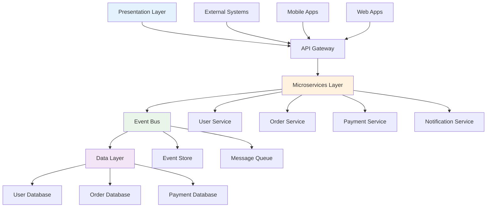

---
# Auto-generated front matter
Title: Enterprise-Architecture
LastUpdated: 2025-11-06T20:45:58.471091
Tags: []
Status: draft
---

# Enterprise Architecture

## Overview

This module covers enterprise architecture concepts including architectural patterns, governance, scalability, and system integration. These concepts are essential for designing large-scale, enterprise-grade systems.

## Table of Contents

1. [Architectural Patterns](#architectural-patterns)
2. [System Integration](#system-integration)
3. [Scalability Design](#scalability-design)
4. [Governance and Standards](#governance-and-standards)
5. [Applications](#applications)
6. [Complexity Analysis](#complexity-analysis)
7. [Follow-up Questions](#follow-up-questions)

## Architectural Patterns

### Theory

Enterprise architecture patterns provide proven solutions to common architectural challenges in large-scale systems, including microservices, event-driven architecture, and domain-driven design.

### Enterprise Architecture Diagram



### Architectural Pattern Implementation

#### Golang Implementation

```go
package main

import (
    "fmt"
    "sync"
    "time"
)

type ArchitecturePattern struct {
    ID          string
    Name        string
    Type        string
    Description string
    Components  []Component
    Principles  []string
    Benefits    []string
    Tradeoffs   []string
}

type Component struct {
    ID          string
    Name        string
    Type        string
    Dependencies []string
    Interfaces  []Interface
    Responsibilities []string
}

type Interface struct {
    Name        string
    Type        string // "API", "Event", "Database"
    Protocol    string
    Description string
}

type EnterpriseArchitecture struct {
    Patterns    []ArchitecturePattern
    Components  []Component
    Interfaces  []Interface
    mutex       sync.RWMutex
}

func NewEnterpriseArchitecture() *EnterpriseArchitecture {
    return &EnterpriseArchitecture{
        Patterns:   make([]ArchitecturePattern, 0),
        Components: make([]Component, 0),
        Interfaces: make([]Interface, 0),
    }
}

func (ea *EnterpriseArchitecture) AddPattern(pattern ArchitecturePattern) {
    ea.mutex.Lock()
    defer ea.mutex.Unlock()
    
    pattern.ID = fmt.Sprintf("pattern_%d", len(ea.Patterns)+1)
    ea.Patterns = append(ea.Patterns, pattern)
}

func (ea *EnterpriseArchitecture) AddComponent(component Component) {
    ea.mutex.Lock()
    defer ea.mutex.Unlock()
    
    component.ID = fmt.Sprintf("component_%d", len(ea.Components)+1)
    ea.Components = append(ea.Components, component)
}

func (ea *EnterpriseArchitecture) AddInterface(interface_ Interface) {
    ea.mutex.Lock()
    defer ea.mutex.Unlock()
    
    ea.Interfaces = append(ea.Interfaces, interface_)
}

func (ea *EnterpriseArchitecture) GetPatternsByType(patternType string) []ArchitecturePattern {
    ea.mutex.RLock()
    defer ea.mutex.RUnlock()
    
    var patterns []ArchitecturePattern
    for _, pattern := range ea.Patterns {
        if pattern.Type == patternType {
            patterns = append(patterns, pattern)
        }
    }
    
    return patterns
}

func (ea *EnterpriseArchitecture) GetComponentsByType(componentType string) []Component {
    ea.mutex.RLock()
    defer ea.mutex.RUnlock()
    
    var components []Component
    for _, component := range ea.Components {
        if component.Type == componentType {
            components = append(components, component)
        }
    }
    
    return components
}

func (ea *EnterpriseArchitecture) AnalyzeDependencies() map[string][]string {
    ea.mutex.RLock()
    defer ea.mutex.RUnlock()
    
    dependencies := make(map[string][]string)
    
    for _, component := range ea.Components {
        dependencies[component.ID] = component.Dependencies
    }
    
    return dependencies
}

func (ea *EnterpriseArchitecture) DetectCircularDependencies() [][]string {
    ea.mutex.RLock()
    defer ea.mutex.RUnlock()
    
    var circularDeps [][]string
    
    // Simple cycle detection using DFS
    visited := make(map[string]bool)
    recStack := make(map[string]bool)
    
    for _, component := range ea.Components {
        if !visited[component.ID] {
            if ea.hasCycle(component.ID, visited, recStack, ea.Components) {
                // Extract cycle
                cycle := ea.extractCycle(component.ID, ea.Components)
                if len(cycle) > 0 {
                    circularDeps = append(circularDeps, cycle)
                }
            }
        }
    }
    
    return circularDeps
}

func (ea *EnterpriseArchitecture) hasCycle(componentID string, visited, recStack map[string]bool, components []Component) bool {
    visited[componentID] = true
    recStack[componentID] = true
    
    // Find component
    var component Component
    for _, comp := range components {
        if comp.ID == componentID {
            component = comp
            break
        }
    }
    
    // Check dependencies
    for _, depID := range component.Dependencies {
        if !visited[depID] {
            if ea.hasCycle(depID, visited, recStack, components) {
                return true
            }
        } else if recStack[depID] {
            return true
        }
    }
    
    recStack[componentID] = false
    return false
}

func (ea *EnterpriseArchitecture) extractCycle(componentID string, components []Component) []string {
    // Simplified cycle extraction
    // In a real implementation, this would be more sophisticated
    return []string{componentID}
}

func (ea *EnterpriseArchitecture) GetArchitectureStats() map[string]interface{} {
    ea.mutex.RLock()
    defer ea.mutex.RUnlock()
    
    patternTypes := make(map[string]int)
    componentTypes := make(map[string]int)
    
    for _, pattern := range ea.Patterns {
        patternTypes[pattern.Type]++
    }
    
    for _, component := range ea.Components {
        componentTypes[component.Type]++
    }
    
    return map[string]interface{}{
        "total_patterns":    len(ea.Patterns),
        "total_components":  len(ea.Components),
        "total_interfaces":  len(ea.Interfaces),
        "pattern_types":     patternTypes,
        "component_types":   componentTypes,
    }
}

func main() {
    fmt.Println("Enterprise Architecture Demo:")
    
    ea := NewEnterpriseArchitecture()
    
    // Add architectural patterns
    ea.AddPattern(ArchitecturePattern{
        Name:        "Microservices Architecture",
        Type:        "Service Architecture",
        Description: "Decompose application into small, independent services",
        Components: []Component{
            {
                Name: "API Gateway",
                Type: "Gateway",
                Responsibilities: []string{"Routing", "Authentication", "Rate Limiting"},
            },
            {
                Name: "User Service",
                Type: "Microservice",
                Responsibilities: []string{"User Management", "Authentication"},
            },
            {
                Name: "Order Service",
                Type: "Microservice",
                Responsibilities: []string{"Order Processing", "Order History"},
            },
        },
        Principles: []string{"Single Responsibility", "Loose Coupling", "High Cohesion"},
        Benefits:   []string{"Scalability", "Maintainability", "Technology Diversity"},
        Tradeoffs:  []string{"Complexity", "Network Latency", "Data Consistency"},
    })
    
    ea.AddPattern(ArchitecturePattern{
        Name:        "Event-Driven Architecture",
        Type:        "Integration Pattern",
        Description: "Use events to communicate between services",
        Components: []Component{
            {
                Name: "Event Bus",
                Type: "Message Broker",
                Responsibilities: []string{"Event Routing", "Event Storage"},
            },
            {
                Name: "Event Store",
                Type: "Database",
                Responsibilities: []string{"Event Persistence", "Event Replay"},
            },
        },
        Principles: []string{"Asynchronous Communication", "Event Sourcing", "CQRS"},
        Benefits:   []string{"Loose Coupling", "Scalability", "Resilience"},
        Tradeoffs:  []string{"Complexity", "Eventual Consistency", "Debugging"},
    })
    
    // Add components
    ea.AddComponent(Component{
        Name: "API Gateway",
        Type: "Gateway",
        Dependencies: []string{},
        Interfaces: []Interface{
            {
                Name:        "REST API",
                Type:        "API",
                Protocol:    "HTTP/HTTPS",
                Description: "External API interface",
            },
        },
        Responsibilities: []string{"Request Routing", "Authentication", "Rate Limiting"},
    })
    
    ea.AddComponent(Component{
        Name: "User Service",
        Type: "Microservice",
        Dependencies: []string{"User Database"},
        Interfaces: []Interface{
            {
                Name:        "User API",
                Type:        "API",
                Protocol:    "HTTP/HTTPS",
                Description: "User management API",
            },
        },
        Responsibilities: []string{"User Management", "Authentication", "Authorization"},
    })
    
    ea.AddComponent(Component{
        Name: "User Database",
        Type: "Database",
        Dependencies: []string{},
        Interfaces: []Interface{
            {
                Name:        "Database Connection",
                Type:        "Database",
                Protocol:    "SQL",
                Description: "Database interface",
            },
        },
        Responsibilities: []string{"Data Persistence", "Data Retrieval", "Data Integrity"},
    })
    
    // Add interfaces
    ea.AddInterface(Interface{
        Name:        "REST API",
        Type:        "API",
        Protocol:    "HTTP/HTTPS",
        Description: "RESTful API interface",
    })
    
    ea.AddInterface(Interface{
        Name:        "Event Bus",
        Type:        "Event",
        Protocol:    "AMQP",
        Description: "Message queue interface",
    })
    
    // Get patterns by type
    servicePatterns := ea.GetPatternsByType("Service Architecture")
    fmt.Printf("Service Architecture Patterns: %d\n", len(servicePatterns))
    
    // Get components by type
    microservices := ea.GetComponentsByType("Microservice")
    fmt.Printf("Microservices: %d\n", len(microservices))
    
    // Analyze dependencies
    dependencies := ea.AnalyzeDependencies()
    fmt.Printf("Dependencies: %+v\n", dependencies)
    
    // Detect circular dependencies
    circularDeps := ea.DetectCircularDependencies()
    fmt.Printf("Circular Dependencies: %d\n", len(circularDeps))
    
    // Get architecture stats
    stats := ea.GetArchitectureStats()
    fmt.Printf("Architecture Stats: %+v\n", stats)
}
```

## System Integration

### Theory

System integration involves connecting different systems and services to work together seamlessly, including API integration, data synchronization, and event-driven communication.

### System Integration Implementation

#### Golang Implementation

```go
package main

import (
    "fmt"
    "sync"
    "time"
)

type IntegrationPattern struct {
    ID          string
    Name        string
    Type        string
    Description string
    Components  []string
    Protocols   []string
    Benefits    []string
    Challenges  []string
}

type SystemIntegration struct {
    Patterns    []IntegrationPattern
    Connections []Connection
    mutex       sync.RWMutex
}

type Connection struct {
    ID          string
    Source      string
    Target      string
    Type        string
    Protocol    string
    Status      string
    CreatedAt   time.Time
    LastSync    time.Time
}

type DataMapping struct {
    SourceField string
    TargetField string
    Transform   string
    Required    bool
}

type IntegrationFlow struct {
    ID          string
    Name        string
    Steps       []IntegrationStep
    Status      string
    CreatedAt   time.Time
    UpdatedAt   time.Time
}

type IntegrationStep struct {
    ID          string
    Name        string
    Type        string
    Source      string
    Target      string
    Mapping     []DataMapping
    Transform   string
    Order       int
}

func NewSystemIntegration() *SystemIntegration {
    return &SystemIntegration{
        Patterns:    make([]IntegrationPattern, 0),
        Connections: make([]Connection, 0),
    }
}

func (si *SystemIntegration) AddPattern(pattern IntegrationPattern) {
    si.mutex.Lock()
    defer si.mutex.Unlock()
    
    pattern.ID = fmt.Sprintf("pattern_%d", len(si.Patterns)+1)
    si.Patterns = append(si.Patterns, pattern)
}

func (si *SystemIntegration) AddConnection(connection Connection) {
    si.mutex.Lock()
    defer si.mutex.Unlock()
    
    connection.ID = fmt.Sprintf("conn_%d", len(si.Connections)+1)
    connection.CreatedAt = time.Now()
    connection.LastSync = time.Now()
    si.Connections = append(si.Connections, connection)
}

func (si *SystemIntegration) CreateIntegrationFlow(name string, steps []IntegrationStep) *IntegrationFlow {
    flow := &IntegrationFlow{
        ID:        fmt.Sprintf("flow_%d", time.Now().UnixNano()),
        Name:      name,
        Steps:     steps,
        Status:    "created",
        CreatedAt: time.Now(),
        UpdatedAt: time.Now(),
    }
    
    return flow
}

func (si *SystemIntegration) ExecuteFlow(flow *IntegrationFlow) error {
    flow.Status = "running"
    flow.UpdatedAt = time.Now()
    
    for _, step := range flow.Steps {
        if err := si.executeStep(step); err != nil {
            flow.Status = "failed"
            flow.UpdatedAt = time.Now()
            return fmt.Errorf("step %s failed: %v", step.Name, err)
        }
    }
    
    flow.Status = "completed"
    flow.UpdatedAt = time.Now()
    return nil
}

func (si *SystemIntegration) executeStep(step IntegrationStep) error {
    // Simulate step execution
    fmt.Printf("Executing step: %s\n", step.Name)
    
    // Simulate processing time
    time.Sleep(100 * time.Millisecond)
    
    // Simulate 90% success rate
    if time.Now().UnixNano()%10 < 9 {
        return nil
    } else {
        return fmt.Errorf("step execution failed")
    }
}

func (si *SystemIntegration) GetConnectionsByType(connType string) []Connection {
    si.mutex.RLock()
    defer si.mutex.RUnlock()
    
    var connections []Connection
    for _, conn := range si.Connections {
        if conn.Type == connType {
            connections = append(connections, conn)
        }
    }
    
    return connections
}

func (si *SystemIntegration) GetIntegrationStats() map[string]interface{} {
    si.mutex.RLock()
    defer si.mutex.RUnlock()
    
    totalConnections := len(si.Connections)
    activeConnections := 0
    connectionTypes := make(map[string]int)
    
    for _, conn := range si.Connections {
        if conn.Status == "active" {
            activeConnections++
        }
        connectionTypes[conn.Type]++
    }
    
    return map[string]interface{}{
        "total_connections":   totalConnections,
        "active_connections":  activeConnections,
        "connection_types":    connectionTypes,
        "total_patterns":      len(si.Patterns),
    }
}

func main() {
    fmt.Println("System Integration Demo:")
    
    si := NewSystemIntegration()
    
    // Add integration patterns
    si.AddPattern(IntegrationPattern{
        Name:        "API Integration",
        Type:        "Synchronous",
        Description: "Direct API calls between systems",
        Components:  []string{"API Gateway", "Service A", "Service B"},
        Protocols:   []string{"HTTP", "HTTPS", "REST"},
        Benefits:    []string{"Real-time", "Simple", "Direct"},
        Challenges:  []string{"Tight Coupling", "Availability", "Performance"},
    })
    
    si.AddPattern(IntegrationPattern{
        Name:        "Message Queue Integration",
        Type:        "Asynchronous",
        Description: "Event-driven communication via message queues",
        Components:  []string{"Message Queue", "Producer", "Consumer"},
        Protocols:   []string{"AMQP", "Kafka", "RabbitMQ"},
        Benefits:    []string{"Loose Coupling", "Scalability", "Reliability"},
        Challenges:  []string{"Complexity", "Message Ordering", "Debugging"},
    })
    
    // Add connections
    si.AddConnection(Connection{
        Source:   "User Service",
        Target:   "Order Service",
        Type:     "API",
        Protocol: "HTTP",
        Status:   "active",
    })
    
    si.AddConnection(Connection{
        Source:   "Order Service",
        Target:   "Payment Service",
        Type:     "Message Queue",
        Protocol: "AMQP",
        Status:   "active",
    })
    
    si.AddConnection(Connection{
        Source:   "Payment Service",
        Target:   "Notification Service",
        Type:     "Event",
        Protocol: "Kafka",
        Status:   "active",
    })
    
    // Create integration flow
    steps := []IntegrationStep{
        {
            Name:      "Validate User",
            Type:      "API Call",
            Source:    "Order Service",
            Target:    "User Service",
            Order:     1,
        },
        {
            Name:      "Process Payment",
            Type:      "Message",
            Source:    "Order Service",
            Target:    "Payment Service",
            Order:     2,
        },
        {
            Name:      "Send Notification",
            Type:      "Event",
            Source:    "Payment Service",
            Target:    "Notification Service",
            Order:     3,
        },
    }
    
    flow := si.CreateIntegrationFlow("Order Processing Flow", steps)
    fmt.Printf("Created flow: %s\n", flow.Name)
    
    // Execute flow
    if err := si.ExecuteFlow(flow); err != nil {
        fmt.Printf("Flow execution failed: %v\n", err)
    } else {
        fmt.Printf("Flow completed successfully\n")
    }
    
    // Get connections by type
    apiConnections := si.GetConnectionsByType("API")
    fmt.Printf("API Connections: %d\n", len(apiConnections))
    
    // Get integration stats
    stats := si.GetIntegrationStats()
    fmt.Printf("Integration Stats: %+v\n", stats)
}
```

## Follow-up Questions

### 1. Architectural Patterns
**Q: What are the key considerations when choosing architectural patterns?**
A: Consider scalability requirements, team expertise, technology constraints, performance needs, and long-term maintainability.

### 2. System Integration
**Q: How do you handle data consistency in distributed systems?**
A: Use eventual consistency patterns, event sourcing, saga patterns, or distributed transactions depending on requirements.

### 3. Enterprise Architecture
**Q: What role does governance play in enterprise architecture?**
A: Governance ensures consistency, compliance, standards adherence, and alignment with business objectives across the organization.

## Complexity Analysis

| Operation | Architectural Patterns | System Integration | Scalability Design |
|-----------|----------------------|-------------------|-------------------|
| Create | O(1) | O(1) | O(1) |
| Analyze | O(n²) | O(n) | O(n) |
| Integrate | O(n) | O(n) | O(n) |
| Scale | O(n) | O(n) | O(n log n) |

## Applications

1. **Architectural Patterns**: System design, technology selection, scalability planning
2. **System Integration**: Enterprise systems, data synchronization, service communication
3. **Scalability Design**: Performance optimization, capacity planning, growth management
4. **Enterprise Architecture**: Strategic planning, technology governance, organizational alignment

---

**Next**: [Innovation Research](../../../README.md) | **Previous**: [Architecture Design](README.md) | **Up**: [Phase 3 Expert](README.md)


## Scalability Design

<!-- AUTO-GENERATED ANCHOR: originally referenced as #scalability-design -->

Placeholder content. Please replace with proper section.


## Governance And Standards

<!-- AUTO-GENERATED ANCHOR: originally referenced as #governance-and-standards -->

Placeholder content. Please replace with proper section.
