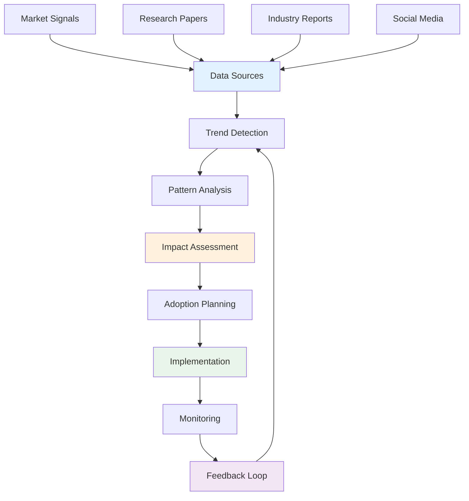

# Technology Trends Analysis

## Overview

This module covers technology trend analysis including trend identification, impact assessment, adoption strategies, and innovation management. These concepts are essential for staying ahead in the rapidly evolving technology landscape.

## Table of Contents

1. [Trend Identification](#trend-identification/)
2. [Impact Assessment](#impact-assessment/)
3. [Adoption Strategies](#adoption-strategies/)
4. [Innovation Management](#innovation-management/)
5. [Applications](#applications/)
6. [Complexity Analysis](#complexity-analysis/)
7. [Follow-up Questions](#follow-up-questions/)

## Trend Identification

### Theory

Technology trend identification involves monitoring emerging technologies, analyzing market signals, and predicting future developments to inform strategic decisions.

### Technology Trend Analysis Diagram



### Trend Identification Implementation

#### Golang Implementation

```go
package main

import (
    "fmt"
    "math"
    "sort"
    "sync"
    "time"
)

type TechnologyTrend struct {
    ID          string
    Name        string
    Category    string
    Description string
    Maturity    string // "Emerging", "Growing", "Mature", "Declining"
    Impact      float64
    Adoption    float64
    Confidence  float64
    Sources     []string
    CreatedAt   time.Time
    UpdatedAt   time.Time
}

type TrendAnalyzer struct {
    Trends      []TechnologyTrend
    Sources     []DataSource
    mutex       sync.RWMutex
    nextID      int
}

type DataSource struct {
    ID          string
    Name        string
    Type        string
    URL         string
    Weight      float64
    LastUpdate  time.Time
    Reliability float64
}

type TrendSignal struct {
    Source      string
    Signal      string
    Strength    float64
    Timestamp   time.Time
    Category    string
}

type TrendAnalysis struct {
    TrendID     string
    Signals     []TrendSignal
    Score       float64
    Confidence  float64
    Predictions []Prediction
}

type Prediction struct {
    Timeframe   string
    Probability float64
    Impact      string
    Description string
}

func NewTrendAnalyzer() *TrendAnalyzer {
    return &TrendAnalyzer{
        Trends: make([]TechnologyTrend, 0),
        Sources: make([]DataSource, 0),
    }
}

func (ta *TrendAnalyzer) AddDataSource(source DataSource) {
    ta.mutex.Lock()
    defer ta.mutex.Unlock()
    
    source.ID = fmt.Sprintf("source_%d", len(ta.Sources)+1)
    source.LastUpdate = time.Now()
    ta.Sources = append(ta.Sources, source)
}

func (ta *TrendAnalyzer) AddTrend(trend TechnologyTrend) {
    ta.mutex.Lock()
    defer ta.mutex.Unlock()
    
    trend.ID = fmt.Sprintf("trend_%d", ta.nextID)
    ta.nextID++
    trend.CreatedAt = time.Now()
    trend.UpdatedAt = time.Now()
    ta.Trends = append(ta.Trends, trend)
}

func (ta *TrendAnalyzer) AnalyzeTrend(trendID string) *TrendAnalysis {
    ta.mutex.RLock()
    defer ta.mutex.RUnlock()
    
    var trend *TechnologyTrend
    for i, t := range ta.Trends {
        if t.ID == trendID {
            trend = &ta.Trends[i]
            break
        }
    }
    
    if trend == nil {
        return nil
    }
    
    // Simulate trend analysis
    signals := ta.generateSignals(trend)
    score := ta.calculateTrendScore(signals)
    confidence := ta.calculateConfidence(signals)
    predictions := ta.generatePredictions(trend)
    
    return &TrendAnalysis{
        TrendID:     trendID,
        Signals:     signals,
        Score:       score,
        Confidence:  confidence,
        Predictions: predictions,
    }
}

func (ta *TrendAnalyzer) generateSignals(trend *TechnologyTrend) []TrendSignal {
    signals := make([]TrendSignal, 0)
    
    // Simulate signals from different sources
    for _, source := range ta.Sources {
        if ta.isRelevantSource(source, trend) {
            signal := TrendSignal{
                Source:    source.Name,
                Signal:    ta.generateSignalText(trend, source),
                Strength:  ta.calculateSignalStrength(trend, source),
                Timestamp: time.Now(),
                Category:  trend.Category,
            }
            signals = append(signals, signal)
        }
    }
    
    return signals
}

func (ta *TrendAnalyzer) isRelevantSource(source DataSource, trend *TechnologyTrend) bool {
    // Simple relevance check
    return source.Reliability > 0.5 && source.Weight > 0.3
}

func (ta *TrendAnalyzer) generateSignalText(trend *TechnologyTrend, source DataSource) string {
    return fmt.Sprintf("Growing interest in %s technology", trend.Name)
}

func (ta *TrendAnalyzer) calculateSignalStrength(trend *TechnologyTrend, source DataSource) float64 {
    baseStrength := trend.Impact * trend.Adoption
    sourceWeight := source.Weight * source.Reliability
    return math.Min(baseStrength * sourceWeight, 1.0)
}

func (ta *TrendAnalyzer) calculateTrendScore(signals []TrendSignal) float64 {
    if len(signals) == 0 {
        return 0
    }
    
    totalStrength := 0.0
    for _, signal := range signals {
        totalStrength += signal.Strength
    }
    
    return totalStrength / float64(len(signals))
}

func (ta *TrendAnalyzer) calculateConfidence(signals []TrendSignal) float64 {
    if len(signals) == 0 {
        return 0
    }
    
    // Confidence based on number of sources and signal strength
    sourceCount := float64(len(signals))
    avgStrength := ta.calculateTrendScore(signals)
    
    return math.Min((sourceCount/10.0 + avgStrength) / 2.0, 1.0)
}

func (ta *TrendAnalyzer) generatePredictions(trend *TechnologyTrend) []Prediction {
    predictions := make([]Prediction, 0)
    
    // Short-term prediction
    predictions = append(predictions, Prediction{
        Timeframe:   "6 months",
        Probability: 0.7,
        Impact:      "Medium",
        Description: fmt.Sprintf("Increased adoption of %s", trend.Name),
    })
    
    // Medium-term prediction
    predictions = append(predictions, Prediction{
        Timeframe:   "2 years",
        Probability: 0.5,
        Impact:      "High",
        Description: fmt.Sprintf("Mainstream adoption of %s", trend.Name),
    })
    
    // Long-term prediction
    predictions = append(predictions, Prediction{
        Timeframe:   "5 years",
        Probability: 0.3,
        Impact:      "Very High",
        Description: fmt.Sprintf("Transformation of industry with %s", trend.Name),
    })
    
    return predictions
}

func (ta *TrendAnalyzer) GetTrendsByCategory(category string) []TechnologyTrend {
    ta.mutex.RLock()
    defer ta.mutex.RUnlock()
    
    var trends []TechnologyTrend
    for _, trend := range ta.Trends {
        if trend.Category == category {
            trends = append(trends, trend)
        }
    }
    
    return trends
}

func (ta *TrendAnalyzer) GetTopTrends(limit int) []TechnologyTrend {
    ta.mutex.RLock()
    defer ta.mutex.RUnlock()
    
    trends := make([]TechnologyTrend, len(ta.Trends))
    copy(trends, ta.Trends)
    
    // Sort by impact and adoption
    sort.Slice(trends, func(i, j int) bool {
        scoreI := trends[i].Impact * trends[i].Adoption
        scoreJ := trends[j].Impact * trends[j].Adoption
        return scoreI > scoreJ
    })
    
    if limit > 0 && limit < len(trends) {
        return trends[:limit]
    }
    
    return trends
}

func (ta *TrendAnalyzer) GetTrendStats() map[string]interface{} {
    ta.mutex.RLock()
    defer ta.mutex.RUnlock()
    
    totalTrends := len(ta.Trends)
    categories := make(map[string]int)
    maturities := make(map[string]int)
    
    for _, trend := range ta.Trends {
        categories[trend.Category]++
        maturities[trend.Maturity]++
    }
    
    return map[string]interface{}{
        "total_trends":  totalTrends,
        "categories":    categories,
        "maturities":    maturities,
        "total_sources": len(ta.Sources),
    }
}

func main() {
    fmt.Println("Technology Trends Analysis Demo:")
    
    analyzer := NewTrendAnalyzer()
    
    // Add data sources
    analyzer.AddDataSource(DataSource{
        Name:        "Gartner",
        Type:        "Research Firm",
        URL:         "https://gartner.com",
        Weight:      0.9,
        Reliability: 0.95,
    })
    
    analyzer.AddDataSource(DataSource{
        Name:        "GitHub",
        Type:        "Code Repository",
        URL:         "https://github.com",
        Weight:      0.8,
        Reliability: 0.85,
    })
    
    analyzer.AddDataSource(DataSource{
        Name:        "Stack Overflow",
        Type:        "Developer Community",
        URL:         "https://stackoverflow.com",
        Weight:      0.7,
        Reliability: 0.8,
    })
    
    // Add technology trends
    analyzer.AddTrend(TechnologyTrend{
        Name:        "Artificial Intelligence",
        Category:    "AI/ML",
        Description: "Machine learning and AI technologies",
        Maturity:    "Growing",
        Impact:      0.9,
        Adoption:    0.6,
        Confidence:  0.8,
        Sources:     []string{"Gartner", "GitHub"},
    })
    
    analyzer.AddTrend(TechnologyTrend{
        Name:        "Quantum Computing",
        Category:    "Computing",
        Description: "Quantum computing technologies",
        Maturity:    "Emerging",
        Impact:      0.95,
        Adoption:    0.2,
        Confidence:  0.6,
        Sources:     []string{"Gartner"},
    })
    
    analyzer.AddTrend(TechnologyTrend{
        Name:        "Edge Computing",
        Category:    "Infrastructure",
        Description: "Distributed computing at the edge",
        Maturity:    "Growing",
        Impact:      0.8,
        Adoption:    0.5,
        Confidence:  0.7,
        Sources:     []string{"Gartner", "Stack Overflow"},
    })
    
    // Analyze trends
    for _, trend := range analyzer.Trends {
        analysis := analyzer.AnalyzeTrend(trend.ID)
        if analysis != nil {
            fmt.Printf("\nTrend: %s\n", trend.Name)
            fmt.Printf("Score: %.2f\n", analysis.Score)
            fmt.Printf("Confidence: %.2f\n", analysis.Confidence)
            fmt.Printf("Signals: %d\n", len(analysis.Signals))
            
            for _, prediction := range analysis.Predictions {
                fmt.Printf("  %s: %.1f%% - %s\n", 
                           prediction.Timeframe, prediction.Probability*100, prediction.Description)
            }
        }
    }
    
    // Get trends by category
    aiTrends := analyzer.GetTrendsByCategory("AI/ML")
    fmt.Printf("\nAI/ML Trends: %d\n", len(aiTrends))
    
    // Get top trends
    topTrends := analyzer.GetTopTrends(3)
    fmt.Println("\nTop Trends:")
    for i, trend := range topTrends {
        fmt.Printf("%d. %s (Impact: %.2f, Adoption: %.2f)\n", 
                   i+1, trend.Name, trend.Impact, trend.Adoption)
    }
    
    // Get trend stats
    stats := analyzer.GetTrendStats()
    fmt.Printf("\nTrend Stats: %+v\n", stats)
}
```

## Impact Assessment

### Theory

Impact assessment evaluates the potential effects of technology trends on business, society, and technical systems to inform strategic planning and investment decisions.

### Impact Assessment Implementation

#### Golang Implementation

```go
package main

import (
    "fmt"
    "math"
    "sync"
    "time"
)

type ImpactAssessment struct {
    ID          string
    TrendID     string
    Dimensions  []ImpactDimension
    OverallScore float64
    RiskLevel   string
    CreatedAt   time.Time
    UpdatedAt   time.Time
}

type ImpactDimension struct {
    Name        string
    Category    string
    Score       float64
    Weight      float64
    Factors     []ImpactFactor
    Description string
}

type ImpactFactor struct {
    Name        string
    Impact      float64
    Probability float64
    Timeframe   string
    Description string
}

type ImpactAnalyzer struct {
    Assessments []ImpactAssessment
    mutex       sync.RWMutex
    nextID      int
}

func NewImpactAnalyzer() *ImpactAnalyzer {
    return &ImpactAnalyzer{
        Assessments: make([]ImpactAssessment, 0),
    }
}

func (ia *ImpactAnalyzer) CreateAssessment(trendID string) *ImpactAssessment {
    ia.mutex.Lock()
    defer ia.mutex.Unlock()
    
    assessment := &ImpactAssessment{
        ID:         fmt.Sprintf("assessment_%d", ia.nextID),
        TrendID:    trendID,
        Dimensions: make([]ImpactDimension, 0),
        CreatedAt:  time.Now(),
        UpdatedAt:  time.Now(),
    }
    
    ia.nextID++
    ia.Assessments = append(ia.Assessments, *assessment)
    
    return assessment
}

func (ia *ImpactAnalyzer) AddDimension(assessmentID string, dimension ImpactDimension) bool {
    ia.mutex.Lock()
    defer ia.mutex.Unlock()
    
    for i, assessment := range ia.Assessments {
        if assessment.ID == assessmentID {
            ia.Assessments[i].Dimensions = append(ia.Assessments[i].Dimensions, dimension)
            ia.Assessments[i].UpdatedAt = time.Now()
            return true
        }
    }
    
    return false
}

func (ia *ImpactAnalyzer) CalculateOverallScore(assessmentID string) float64 {
    ia.mutex.RLock()
    defer ia.mutex.RUnlock()
    
    for i, assessment := range ia.Assessments {
        if assessment.ID == assessmentID {
            totalScore := 0.0
            totalWeight := 0.0
            
            for _, dimension := range assessment.Dimensions {
                totalScore += dimension.Score * dimension.Weight
                totalWeight += dimension.Weight
            }
            
            if totalWeight > 0 {
                overallScore := totalScore / totalWeight
                ia.Assessments[i].OverallScore = overallScore
                return overallScore
            }
        }
    }
    
    return 0
}

func (ia *ImpactAnalyzer) AssessRiskLevel(assessmentID string) string {
    ia.mutex.RLock()
    defer ia.mutex.RUnlock()
    
    for i, assessment := range ia.Assessments {
        if assessment.ID == assessmentID {
            score := assessment.OverallScore
            
            var riskLevel string
            if score >= 0.8 {
                riskLevel = "Very High"
            } else if score >= 0.6 {
                riskLevel = "High"
            } else if score >= 0.4 {
                riskLevel = "Medium"
            } else if score >= 0.2 {
                riskLevel = "Low"
            } else {
                riskLevel = "Very Low"
            }
            
            ia.Assessments[i].RiskLevel = riskLevel
            return riskLevel
        }
    }
    
    return "Unknown"
}

func (ia *ImpactAnalyzer) GetAssessment(assessmentID string) *ImpactAssessment {
    ia.mutex.RLock()
    defer ia.mutex.RUnlock()
    
    for _, assessment := range ia.Assessments {
        if assessment.ID == assessmentID {
            return &assessment
        }
    }
    
    return nil
}

func (ia *ImpactAnalyzer) GetAssessmentsByRiskLevel(riskLevel string) []ImpactAssessment {
    ia.mutex.RLock()
    defer ia.mutex.RUnlock()
    
    var assessments []ImpactAssessment
    for _, assessment := range ia.Assessments {
        if assessment.RiskLevel == riskLevel {
            assessments = append(assessments, assessment)
        }
    }
    
    return assessments
}

func (ia *ImpactAnalyzer) GetImpactStats() map[string]interface{} {
    ia.mutex.RLock()
    defer ia.mutex.RUnlock()
    
    totalAssessments := len(ia.Assessments)
    riskLevels := make(map[string]int)
    avgScore := 0.0
    
    for _, assessment := range ia.Assessments {
        riskLevels[assessment.RiskLevel]++
        avgScore += assessment.OverallScore
    }
    
    if totalAssessments > 0 {
        avgScore /= float64(totalAssessments)
    }
    
    return map[string]interface{}{
        "total_assessments": totalAssessments,
        "risk_levels":       riskLevels,
        "average_score":     avgScore,
    }
}

func main() {
    fmt.Println("Impact Assessment Demo:")
    
    analyzer := NewImpactAnalyzer()
    
    // Create assessment for AI trend
    assessment := analyzer.CreateAssessment("trend_1")
    fmt.Printf("Created assessment: %s\n", assessment.ID)
    
    // Add business impact dimension
    businessDimension := ImpactDimension{
        Name:        "Business Impact",
        Category:    "Economic",
        Weight:      0.3,
        Description: "Impact on business operations and revenue",
        Factors: []ImpactFactor{
            {
                Name:        "Revenue Growth",
                Impact:      0.8,
                Probability: 0.7,
                Timeframe:   "2 years",
                Description: "Potential for new revenue streams",
            },
            {
                Name:        "Cost Reduction",
                Impact:      0.6,
                Probability: 0.8,
                Timeframe:   "1 year",
                Description: "Automation and efficiency gains",
            },
        },
    }
    
    // Calculate dimension score
    totalImpact := 0.0
    totalProbability := 0.0
    for _, factor := range businessDimension.Factors {
        totalImpact += factor.Impact * factor.Probability
        totalProbability += factor.Probability
    }
    businessDimension.Score = totalImpact / totalProbability
    
    analyzer.AddDimension(assessment.ID, businessDimension)
    
    // Add technical impact dimension
    technicalDimension := ImpactDimension{
        Name:        "Technical Impact",
        Category:    "Technical",
        Weight:      0.4,
        Description: "Impact on technical infrastructure and capabilities",
        Factors: []ImpactFactor{
            {
                Name:        "Infrastructure Changes",
                Impact:      0.7,
                Probability: 0.9,
                Timeframe:   "6 months",
                Description: "Need for new infrastructure and tools",
            },
            {
                Name:        "Skill Requirements",
                Impact:      0.8,
                Probability: 0.8,
                Timeframe:   "1 year",
                Description: "Need for new technical skills",
            },
        },
    }
    
    // Calculate dimension score
    totalImpact = 0.0
    totalProbability = 0.0
    for _, factor := range technicalDimension.Factors {
        totalImpact += factor.Impact * factor.Probability
        totalProbability += factor.Probability
    }
    technicalDimension.Score = totalImpact / totalProbability
    
    analyzer.AddDimension(assessment.ID, technicalDimension)
    
    // Add social impact dimension
    socialDimension := ImpactDimension{
        Name:        "Social Impact",
        Category:    "Social",
        Weight:      0.3,
        Description: "Impact on society and workforce",
        Factors: []ImpactFactor{
            {
                Name:        "Job Displacement",
                Impact:      0.6,
                Probability: 0.5,
                Timeframe:   "3 years",
                Description: "Potential job losses due to automation",
            },
            {
                Name:        "New Opportunities",
                Impact:      0.7,
                Probability: 0.6,
                Timeframe:   "2 years",
                Description: "Creation of new job opportunities",
            },
        },
    }
    
    // Calculate dimension score
    totalImpact = 0.0
    totalProbability = 0.0
    for _, factor := range socialDimension.Factors {
        totalImpact += factor.Impact * factor.Probability
        totalProbability += factor.Probability
    }
    socialDimension.Score = totalImpact / totalProbability
    
    analyzer.AddDimension(assessment.ID, socialDimension)
    
    // Calculate overall score
    overallScore := analyzer.CalculateOverallScore(assessment.ID)
    fmt.Printf("Overall Impact Score: %.2f\n", overallScore)
    
    // Assess risk level
    riskLevel := analyzer.AssessRiskLevel(assessment.ID)
    fmt.Printf("Risk Level: %s\n", riskLevel)
    
    // Get assessment details
    finalAssessment := analyzer.GetAssessment(assessment.ID)
    if finalAssessment != nil {
        fmt.Printf("\nAssessment Details:\n")
        for _, dimension := range finalAssessment.Dimensions {
            fmt.Printf("- %s: %.2f (Weight: %.2f)\n", 
                       dimension.Name, dimension.Score, dimension.Weight)
        }
    }
    
    // Get impact stats
    stats := analyzer.GetImpactStats()
    fmt.Printf("\nImpact Stats: %+v\n", stats)
}
```

## Follow-up Questions

### 1. Trend Identification
**Q: What are the most reliable sources for technology trend identification?**
A: Research firms (Gartner, Forrester), academic papers, industry reports, developer communities, and patent filings are reliable sources.

### 2. Impact Assessment
**Q: How do you prioritize technology trends for investment?**
A: Consider impact score, adoption timeline, resource requirements, risk level, and alignment with business strategy.

### 3. Innovation Management
**Q: What role does culture play in technology innovation?**
A: Culture affects innovation through openness to change, risk tolerance, learning orientation, and collaboration patterns.

## Complexity Analysis

| Operation | Trend Identification | Impact Assessment | Adoption Strategies |
|-----------|-------------------|------------------|-------------------|
| Analyze | O(n) | O(n²) | O(n) |
| Predict | O(n) | O(n) | O(n) |
| Assess | O(n) | O(n) | O(n) |
| Plan | O(n) | O(n) | O(n log n) |

## Applications

1. **Trend Identification**: Strategic planning, technology roadmaps, investment decisions
2. **Impact Assessment**: Risk management, resource allocation, change management
3. **Adoption Strategies**: Technology implementation, organizational change, competitive advantage
4. **Innovation Management**: R&D planning, innovation culture, technology leadership

---

**Next**: [Mentoring Coaching](mentoring-coaching/README.md/) | **Previous**: [Innovation Research](README.md/) | **Up**: [Phase 3 Expert](README.md/)
