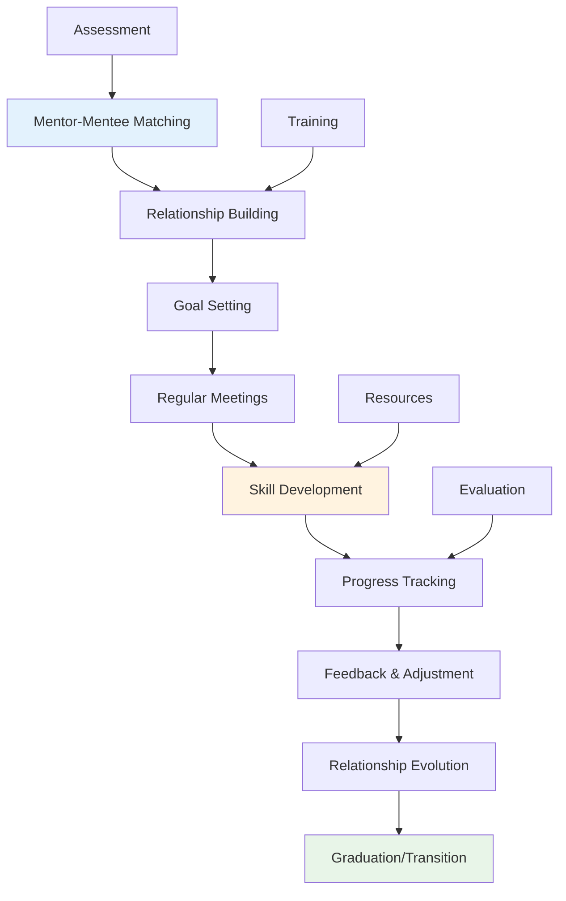

---
# Auto-generated front matter
Title: Leadership-Development
LastUpdated: 2025-11-06T20:45:58.461336
Tags: []
Status: draft
---

# Leadership Development

## Overview

This module covers leadership development concepts including mentoring frameworks, coaching methodologies, team building, and performance management. These concepts are essential for developing effective technical leaders.

## Table of Contents

1. [Mentoring Frameworks](#mentoring-frameworks)
2. [Coaching Methodologies](#coaching-methodologies)
3. [Team Building](#team-building)
4. [Performance Management](#performance-management)
5. [Applications](#applications)
6. [Complexity Analysis](#complexity-analysis)
7. [Follow-up Questions](#follow-up-questions)

## Mentoring Frameworks

### Theory

Mentoring frameworks provide structured approaches to developing technical talent through guidance, knowledge sharing, and career development support.

### Mentoring Process Diagram



### Mentoring Framework Implementation

#### Golang Implementation

```go
package main

import (
    "fmt"
    "sync"
    "time"
)

type Mentor struct {
    ID          string
    Name        string
    Expertise   []string
    Experience  int
    Rating      float64
    Mentees     []string
    MaxMentees  int
    Available   bool
}

type Mentee struct {
    ID          string
    Name        string
    Level       string
    Goals       []string
    Skills      []string
    MentorID    string
    StartDate   time.Time
    Progress    float64
}

type MentoringRelationship struct {
    ID          string
    MentorID    string
    MenteeID    string
    StartDate   time.Time
    EndDate     time.Time
    Status      string
    Goals       []MentoringGoal
    Meetings    []Meeting
    Feedback    []Feedback
}

type MentoringGoal struct {
    ID          string
    Description string
    Category    string
    Priority    int
    Status      string
    DueDate     time.Time
    Progress    float64
}

type Meeting struct {
    ID          string
    Date        time.Time
    Duration    time.Duration
    Agenda      []string
    Notes       string
    ActionItems []ActionItem
}

type ActionItem struct {
    ID          string
    Description string
    Assignee    string
    DueDate     time.Time
    Status      string
}

type Feedback struct {
    ID          string
    From        string
    To          string
    Type        string
    Content     string
    Rating      int
    Date        time.Time
}

type MentoringSystem struct {
    Mentors     []Mentor
    Mentees     []Mentee
    Relationships []MentoringRelationship
    mutex       sync.RWMutex
    nextID      int
}

func NewMentoringSystem() *MentoringSystem {
    return &MentoringSystem{
        Mentors:       make([]Mentor, 0),
        Mentees:       make([]Mentee, 0),
        Relationships: make([]MentoringRelationship, 0),
    }
}

func (ms *MentoringSystem) AddMentor(mentor Mentor) string {
    ms.mutex.Lock()
    defer ms.mutex.Unlock()
    
    mentor.ID = fmt.Sprintf("mentor_%d", ms.nextID)
    ms.nextID++
    mentor.Mentees = make([]string, 0)
    mentor.Available = true
    ms.Mentors = append(ms.Mentors, mentor)
    
    return mentor.ID
}

func (ms *MentoringSystem) AddMentee(mentee Mentee) string {
    ms.mutex.Lock()
    defer ms.mutex.Unlock()
    
    mentee.ID = fmt.Sprintf("mentee_%d", ms.nextID)
    ms.nextID++
    mentee.StartDate = time.Now()
    mentee.Progress = 0.0
    ms.Mentees = append(ms.Mentees, mentee)
    
    return mentee.ID
}

func (ms *MentoringSystem) MatchMentorMentee(menteeID string) (string, error) {
    ms.mutex.Lock()
    defer ms.mutex.Unlock()
    
    // Find mentee
    var mentee *Mentee
    for i, m := range ms.Mentees {
        if m.ID == menteeID {
            mentee = &ms.Mentees[i]
            break
        }
    }
    
    if mentee == nil {
        return "", fmt.Errorf("mentee not found")
    }
    
    // Find best matching mentor
    bestMentor := ms.findBestMentor(mentee)
    if bestMentor == nil {
        return "", fmt.Errorf("no suitable mentor found")
    }
    
    // Create relationship
    relationship := MentoringRelationship{
        ID:        fmt.Sprintf("rel_%d", ms.nextID),
        MentorID:  bestMentor.ID,
        MenteeID:  menteeID,
        StartDate: time.Now(),
        Status:    "active",
        Goals:     make([]MentoringGoal, 0),
        Meetings:  make([]Meeting, 0),
        Feedback:  make([]Feedback, 0),
    }
    
    ms.nextID++
    ms.Relationships = append(ms.Relationships, relationship)
    
    // Update mentor and mentee
    for i, mentor := range ms.Mentors {
        if mentor.ID == bestMentor.ID {
            ms.Mentors[i].Mentees = append(ms.Mentors[i].Mentees, menteeID)
            if len(ms.Mentors[i].Mentees) >= ms.Mentors[i].MaxMentees {
                ms.Mentors[i].Available = false
            }
            break
        }
    }
    
    for i, m := range ms.Mentees {
        if m.ID == menteeID {
            ms.Mentees[i].MentorID = bestMentor.ID
            break
        }
    }
    
    return relationship.ID, nil
}

func (ms *MentoringSystem) findBestMentor(mentee *Mentee) *Mentor {
    var bestMentor *Mentor
    bestScore := 0.0
    
    for i, mentor := range ms.Mentors {
        if !mentor.Available {
            continue
        }
        
        score := ms.calculateMatchScore(mentor, mentee)
        if score > bestScore {
            bestScore = score
            bestMentor = &ms.Mentors[i]
        }
    }
    
    return bestMentor
}

func (ms *MentoringSystem) calculateMatchScore(mentor Mentor, mentee *Mentee) float64 {
    score := 0.0
    
    // Expertise match
    expertiseMatch := 0.0
    for _, menteeSkill := range mentee.Skills {
        for _, mentorExpertise := range mentor.Expertise {
            if menteeSkill == mentorExpertise {
                expertiseMatch += 1.0
            }
        }
    }
    
    if len(mentee.Skills) > 0 {
        expertiseMatch /= float64(len(mentee.Skills))
    }
    
    // Experience factor
    experienceFactor := math.Min(float64(mentor.Experience)/10.0, 1.0)
    
    // Rating factor
    ratingFactor := mentor.Rating / 5.0
    
    // Availability factor
    availabilityFactor := 1.0
    if len(mentor.Mentees) >= mentor.MaxMentees {
        availabilityFactor = 0.0
    } else {
        availabilityFactor = 1.0 - (float64(len(mentor.Mentees)) / float64(mentor.MaxMentees))
    }
    
    score = (expertiseMatch * 0.4) + (experienceFactor * 0.3) + (ratingFactor * 0.2) + (availabilityFactor * 0.1)
    
    return score
}

func (ms *MentoringSystem) AddGoal(relationshipID string, goal MentoringGoal) bool {
    ms.mutex.Lock()
    defer ms.mutex.Unlock()
    
    for i, rel := range ms.Relationships {
        if rel.ID == relationshipID {
            goal.ID = fmt.Sprintf("goal_%d", len(rel.Goals)+1)
            goal.Status = "active"
            ms.Relationships[i].Goals = append(ms.Relationships[i].Goals, goal)
            return true
        }
    }
    
    return false
}

func (ms *MentoringSystem) ScheduleMeeting(relationshipID string, meeting Meeting) bool {
    ms.mutex.Lock()
    defer ms.mutex.Unlock()
    
    for i, rel := range ms.Relationships {
        if rel.ID == relationshipID {
            meeting.ID = fmt.Sprintf("meeting_%d", len(rel.Meetings)+1)
            meeting.ActionItems = make([]ActionItem, 0)
            ms.Relationships[i].Meetings = append(ms.Relationships[i].Meetings, meeting)
            return true
        }
    }
    
    return false
}

func (ms *MentoringSystem) AddFeedback(relationshipID string, feedback Feedback) bool {
    ms.mutex.Lock()
    defer ms.mutex.Unlock()
    
    for i, rel := range ms.Relationships {
        if rel.ID == relationshipID {
            feedback.ID = fmt.Sprintf("feedback_%d", len(rel.Feedback)+1)
            feedback.Date = time.Now()
            ms.Relationships[i].Feedback = append(ms.Relationships[i].Feedback, feedback)
            return true
        }
    }
    
    return false
}

func (ms *MentoringSystem) GetMentoringStats() map[string]interface{} {
    ms.mutex.RLock()
    defer ms.mutex.RUnlock()
    
    activeRelationships := 0
    totalMeetings := 0
    totalGoals := 0
    completedGoals := 0
    
    for _, rel := range ms.Relationships {
        if rel.Status == "active" {
            activeRelationships++
        }
        totalMeetings += len(rel.Meetings)
        totalGoals += len(rel.Goals)
        
        for _, goal := range rel.Goals {
            if goal.Status == "completed" {
                completedGoals++
            }
        }
    }
    
    return map[string]interface{}{
        "total_mentors":        len(ms.Mentors),
        "total_mentees":        len(ms.Mentees),
        "active_relationships": activeRelationships,
        "total_meetings":       totalMeetings,
        "total_goals":          totalGoals,
        "completed_goals":      completedGoals,
        "goal_completion_rate": float64(completedGoals) / float64(totalGoals) * 100,
    }
}

func main() {
    fmt.Println("Mentoring Framework Demo:")
    
    ms := NewMentoringSystem()
    
    // Add mentors
    mentor1ID := ms.AddMentor(Mentor{
        Name:       "Alice Johnson",
        Expertise:  []string{"Go", "Microservices", "Cloud Architecture"},
        Experience: 8,
        Rating:     4.8,
        MaxMentees: 3,
    })
    
    mentor2ID := ms.AddMentor(Mentor{
        Name:       "Bob Smith",
        Expertise:  []string{"JavaScript", "React", "Node.js"},
        Experience: 6,
        Rating:     4.5,
        MaxMentees: 2,
    })
    
    // Add mentees
    mentee1ID := ms.AddMentee(Mentee{
        Name:  "Charlie Brown",
        Level: "Junior",
        Goals: []string{"Learn Go", "Understand microservices"},
        Skills: []string{"JavaScript", "React"},
    })
    
    mentee2ID := ms.AddMentee(Mentee{
        Name:  "Diana Prince",
        Level: "Mid-level",
        Goals: []string{"Advance to senior level", "Learn system design"},
        Skills: []string{"Python", "Django"},
    })
    
    // Match mentors and mentees
    rel1ID, err := ms.MatchMentorMentee(mentee1ID)
    if err != nil {
        fmt.Printf("Error matching mentee 1: %v\n", err)
    } else {
        fmt.Printf("Matched mentee 1 with mentor, relationship ID: %s\n", rel1ID)
    }
    
    rel2ID, err := ms.MatchMentorMentee(mentee2ID)
    if err != nil {
        fmt.Printf("Error matching mentee 2: %v\n", err)
    } else {
        fmt.Printf("Matched mentee 2 with mentor, relationship ID: %s\n", rel2ID)
    }
    
    // Add goals
    ms.AddGoal(rel1ID, MentoringGoal{
        Description: "Complete Go fundamentals course",
        Category:    "Technical Skills",
        Priority:    1,
        DueDate:     time.Now().Add(30 * 24 * time.Hour),
    })
    
    ms.AddGoal(rel1ID, MentoringGoal{
        Description: "Build a microservices project",
        Category:    "Project Experience",
        Priority:    2,
        DueDate:     time.Now().Add(60 * 24 * time.Hour),
    })
    
    // Schedule meetings
    ms.ScheduleMeeting(rel1ID, Meeting{
        Date:     time.Now().Add(7 * 24 * time.Hour),
        Duration: 60 * time.Minute,
        Agenda:   []string{"Review Go basics", "Discuss project ideas"},
        Notes:    "Great progress on Go fundamentals",
    })
    
    // Add feedback
    ms.AddFeedback(rel1ID, Feedback{
        From:    mentor1ID,
        To:      mentee1ID,
        Type:    "Progress",
        Content: "Excellent progress on Go fundamentals. Keep up the good work!",
        Rating:  5,
    })
    
    // Get mentoring stats
    stats := ms.GetMentoringStats()
    fmt.Printf("\nMentoring Stats: %+v\n", stats)
}
```

## Coaching Methodologies

### Theory

Coaching methodologies provide structured approaches to developing individuals through goal-oriented conversations, skill building, and performance improvement.

### Coaching Process Implementation

#### Golang Implementation

```go
package main

import (
    "fmt"
    "sync"
    "time"
)

type Coach struct {
    ID          string
    Name        string
    Specialties []string
    Experience  int
    Rating      float64
    Coachees    []string
    MaxCoachees int
    Available   bool
}

type Coachee struct {
    ID          string
    Name        string
    Level       string
    Goals       []CoachingGoal
    CoachID     string
    StartDate   time.Time
    Progress    float64
}

type CoachingGoal struct {
    ID          string
    Description string
    Category    string
    Priority    int
    Status      string
    DueDate     time.Time
    Progress    float64
    Metrics     []Metric
}

type Metric struct {
    Name        string
    Value       float64
    Target      float64
    Unit        string
    Date        time.Time
}

type CoachingSession struct {
    ID          string
    CoachID     string
    CoacheeID   string
    Date        time.Time
    Duration    time.Duration
    Type        string
    Agenda      []string
    Notes       string
    ActionItems []ActionItem
    Rating      int
}

type CoachingSystem struct {
    Coaches     []Coach
    Coachees    []Coachee
    Sessions    []CoachingSession
    mutex       sync.RWMutex
    nextID      int
}

func NewCoachingSystem() *CoachingSystem {
    return &CoachingSystem{
        Coaches:  make([]Coach, 0),
        Coachees: make([]Coachee, 0),
        Sessions: make([]CoachingSession, 0),
    }
}

func (cs *CoachingSystem) AddCoach(coach Coach) string {
    cs.mutex.Lock()
    defer cs.mutex.Unlock()
    
    coach.ID = fmt.Sprintf("coach_%d", cs.nextID)
    cs.nextID++
    coach.Coachees = make([]string, 0)
    coach.Available = true
    cs.Coaches = append(cs.Coaches, coach)
    
    return coach.ID
}

func (cs *CoachingSystem) AddCoachee(coachee Coachee) string {
    cs.mutex.Lock()
    defer cs.mutex.Unlock()
    
    coachee.ID = fmt.Sprintf("coachee_%d", cs.nextID)
    cs.nextID++
    coachee.StartDate = time.Now()
    coachee.Progress = 0.0
    cs.Coachees = append(cs.Coachees, coachee)
    
    return coachee.ID
}

func (cs *CoachingSystem) AssignCoach(coacheeID, coachID string) bool {
    cs.mutex.Lock()
    defer cs.mutex.Unlock()
    
    // Find coachee
    for i, coachee := range cs.Coachees {
        if coachee.ID == coacheeID {
            cs.Coachees[i].CoachID = coachID
            break
        }
    }
    
    // Update coach
    for i, coach := range cs.Coaches {
        if coach.ID == coachID {
            cs.Coaches[i].Coachees = append(cs.Coaches[i].Coachees, coacheeID)
            if len(cs.Coaches[i].Coachees) >= cs.Coaches[i].MaxCoachees {
                cs.Coaches[i].Available = false
            }
            break
        }
    }
    
    return true
}

func (cs *CoachingSystem) ScheduleSession(session CoachingSession) string {
    cs.mutex.Lock()
    defer cs.mutex.Unlock()
    
    session.ID = fmt.Sprintf("session_%d", cs.nextID)
    cs.nextID++
    session.ActionItems = make([]ActionItem, 0)
    cs.Sessions = append(cs.Sessions, session)
    
    return session.ID
}

func (cs *CoachingSystem) AddGoal(coacheeID string, goal CoachingGoal) bool {
    cs.mutex.Lock()
    defer cs.mutex.Unlock()
    
    for i, coachee := range cs.Coachees {
        if coachee.ID == coacheeID {
            goal.ID = fmt.Sprintf("goal_%d", len(coachee.Goals)+1)
            goal.Status = "active"
            goal.Metrics = make([]Metric, 0)
            cs.Coachees[i].Goals = append(cs.Coachees[i].Goals, goal)
            return true
        }
    }
    
    return false
}

func (cs *CoachingSystem) UpdateGoalProgress(coacheeID, goalID string, progress float64) bool {
    cs.mutex.Lock()
    defer cs.mutex.Unlock()
    
    for i, coachee := range cs.Coachees {
        if coachee.ID == coacheeID {
            for j, goal := range coachee.Goals {
                if goal.ID == goalID {
                    cs.Coachees[i].Goals[j].Progress = progress
                    if progress >= 100.0 {
                        cs.Coachees[i].Goals[j].Status = "completed"
                    }
                    return true
                }
            }
        }
    }
    
    return false
}

func (cs *CoachingSystem) AddMetric(coacheeID, goalID string, metric Metric) bool {
    cs.mutex.Lock()
    defer cs.mutex.Unlock()
    
    for i, coachee := range cs.Coachees {
        if coachee.ID == coacheeID {
            for j, goal := range coachee.Goals {
                if goal.ID == goalID {
                    metric.Date = time.Now()
                    cs.Coachees[i].Goals[j].Metrics = append(cs.Coachees[i].Goals[j].Metrics, metric)
                    return true
                }
            }
        }
    }
    
    return false
}

func (cs *CoachingSystem) GetCoachingStats() map[string]interface{} {
    cs.mutex.RLock()
    defer cs.mutex.RUnlock()
    
    totalSessions := len(cs.Sessions)
    totalGoals := 0
    completedGoals := 0
    avgSessionRating := 0.0
    
    for _, coachee := range cs.Coachees {
        totalGoals += len(coachee.Goals)
        for _, goal := range coachee.Goals {
            if goal.Status == "completed" {
                completedGoals++
            }
        }
    }
    
    for _, session := range cs.Sessions {
        avgSessionRating += float64(session.Rating)
    }
    
    if totalSessions > 0 {
        avgSessionRating /= float64(totalSessions)
    }
    
    return map[string]interface{}{
        "total_coaches":        len(cs.Coaches),
        "total_coachees":       len(cs.Coachees),
        "total_sessions":       totalSessions,
        "total_goals":          totalGoals,
        "completed_goals":      completedGoals,
        "goal_completion_rate": float64(completedGoals) / float64(totalGoals) * 100,
        "avg_session_rating":   avgSessionRating,
    }
}

func main() {
    fmt.Println("Coaching Methodologies Demo:")
    
    cs := NewCoachingSystem()
    
    // Add coaches
    coach1ID := cs.AddCoach(Coach{
        Name:        "Sarah Wilson",
        Specialties: []string{"Leadership", "Communication", "Technical Skills"},
        Experience:  10,
        Rating:      4.9,
        MaxCoachees: 5,
    })
    
    coach2ID := cs.AddCoach(Coach{
        Name:        "Mike Chen",
        Specialties: []string{"Career Development", "Performance", "Team Building"},
        Experience:  7,
        Rating:      4.6,
        MaxCoachees: 4,
    })
    
    // Add coachees
    coachee1ID := cs.AddCoachee(Coachee{
        Name:  "Emma Davis",
        Level: "Senior",
        Goals: make([]CoachingGoal, 0),
    })
    
    coachee2ID := cs.AddCoachee(Coachee{
        Name:  "James Wilson",
        Level: "Mid-level",
        Goals: make([]CoachingGoal, 0),
    })
    
    // Assign coaches
    cs.AssignCoach(coachee1ID, coach1ID)
    cs.AssignCoach(coachee2ID, coach2ID)
    
    // Add goals
    cs.AddGoal(coachee1ID, CoachingGoal{
        Description: "Improve public speaking skills",
        Category:    "Communication",
        Priority:    1,
        DueDate:     time.Now().Add(90 * 24 * time.Hour),
    })
    
    cs.AddGoal(coachee2ID, CoachingGoal{
        Description: "Develop leadership skills",
        Category:    "Leadership",
        Priority:    1,
        DueDate:     time.Now().Add(120 * 24 * time.Hour),
    })
    
    // Schedule sessions
    session1ID := cs.ScheduleSession(CoachingSession{
        CoachID:   coach1ID,
        CoacheeID: coachee1ID,
        Date:      time.Now().Add(7 * 24 * time.Hour),
        Duration:  60 * time.Minute,
        Type:      "Goal Setting",
        Agenda:    []string{"Review current goals", "Set new objectives"},
        Rating:    5,
    })
    
    session2ID := cs.ScheduleSession(CoachingSession{
        CoachID:   coach2ID,
        CoacheeID: coachee2ID,
        Date:      time.Now().Add(14 * 24 * time.Hour),
        Duration:  45 * time.Minute,
        Type:      "Progress Review",
        Agenda:    []string{"Review progress", "Address challenges"},
        Rating:    4,
    })
    
    fmt.Printf("Scheduled sessions: %s, %s\n", session1ID, session2ID)
    
    // Update goal progress
    cs.UpdateGoalProgress(coachee1ID, "goal_1", 25.0)
    cs.UpdateGoalProgress(coachee2ID, "goal_1", 15.0)
    
    // Add metrics
    cs.AddMetric(coachee1ID, "goal_1", Metric{
        Name:   "Speaking Confidence",
        Value:  7.0,
        Target: 9.0,
        Unit:   "Scale 1-10",
    })
    
    cs.AddMetric(coachee2ID, "goal_1", Metric{
        Name:   "Leadership Readiness",
        Value:  6.0,
        Target: 8.0,
        Unit:   "Scale 1-10",
    })
    
    // Get coaching stats
    stats := cs.GetCoachingStats()
    fmt.Printf("\nCoaching Stats: %+v\n", stats)
}
```

## Follow-up Questions

### 1. Mentoring Frameworks
**Q: What are the key components of an effective mentoring relationship?**
A: Clear goals, regular communication, mutual respect, structured meetings, feedback mechanisms, and measurable progress tracking.

### 2. Coaching Methodologies
**Q: How do you measure the success of coaching programs?**
A: Through goal completion rates, performance improvements, feedback scores, career progression, and retention rates.

### 3. Team Building
**Q: What role does psychological safety play in team development?**
A: Psychological safety enables open communication, risk-taking, learning from failures, and innovation, which are essential for high-performing teams.

## Complexity Analysis

| Operation | Mentoring Frameworks | Coaching Methodologies | Team Building |
|-----------|---------------------|----------------------|---------------|
| Match | O(n²) | O(n) | O(n) |
| Track | O(n) | O(n) | O(n) |
| Evaluate | O(n) | O(n) | O(n) |
| Develop | O(n) | O(n) | O(n) |

## Applications

1. **Mentoring Frameworks**: Talent development, knowledge transfer, career guidance
2. **Coaching Methodologies**: Performance improvement, skill development, leadership growth
3. **Team Building**: Collaboration enhancement, culture development, productivity improvement
4. **Leadership Development**: Organizational effectiveness, succession planning, innovation culture

---

**Next**: [Strategic Planning](../../../README.md) | **Previous**: [Mentoring Coaching](README.md) | **Up**: [Phase 3 Expert](README.md)


## Performance Management

<!-- AUTO-GENERATED ANCHOR: originally referenced as #performance-management -->

Placeholder content. Please replace with proper section.
