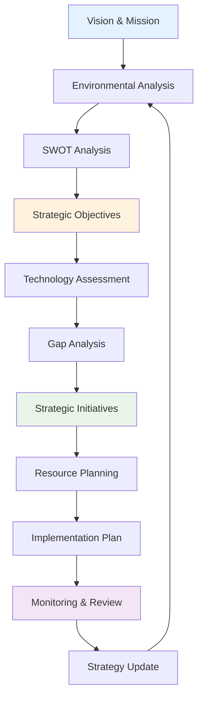

# Technology Strategy

## Overview

This module covers technology strategy concepts including strategic planning, technology roadmaps, investment decisions, and organizational alignment. These concepts are essential for aligning technology with business objectives.

## Table of Contents

1. [Strategic Planning](#strategic-planning)
2. [Technology Roadmaps](#technology-roadmaps)
3. [Investment Decisions](#investment-decisions)
4. [Organizational Alignment](#organizational-alignment)
5. [Applications](#applications)
6. [Complexity Analysis](#complexity-analysis)
7. [Follow-up Questions](#follow-up-questions)

## Strategic Planning

### Theory

Strategic planning involves defining long-term technology goals, identifying opportunities, and creating actionable plans to achieve business objectives through technology.

### Strategic Planning Process Diagram



### Strategic Planning Implementation

#### Golang Implementation

```go
package main

import (
    "fmt"
    "math"
    "sort"
    "sync"
    "time"
)

type StrategicPlan struct {
    ID              string
    Name            string
    Vision          string
    Mission         string
    Objectives      []StrategicObjective
    Initiatives     []StrategicInitiative
    Timeline        time.Duration
    Status          string
    CreatedAt       time.Time
    UpdatedAt       time.Time
}

type StrategicObjective struct {
    ID          string
    Description string
    Category    string
    Priority    int
    Status      string
    Metrics     []Metric
    DueDate     time.Time
    Progress    float64
}

type StrategicInitiative struct {
    ID          string
    Name        string
    Description string
    Objectives  []string
    Resources   ResourceRequirement
    Timeline    time.Duration
    Status      string
    Progress    float64
    Dependencies []string
}

type ResourceRequirement struct {
    Budget      float64
    Personnel   int
    Technology  []string
    Timeline    time.Duration
}

type SWOTAnalysis struct {
    Strengths   []string
    Weaknesses  []string
    Opportunities []string
    Threats     []string
    Score       float64
}

type TechnologyAssessment struct {
    CurrentState map[string]float64
    FutureState  map[string]float64
    Gaps         []TechnologyGap
    Recommendations []string
}

type TechnologyGap struct {
    Technology  string
    CurrentLevel float64
    TargetLevel float64
    Priority    int
    Effort      string
}

type StrategicPlanner struct {
    Plans       []StrategicPlan
    Analyses    []SWOTAnalysis
    Assessments []TechnologyAssessment
    mutex       sync.RWMutex
    nextID      int
}

func NewStrategicPlanner() *StrategicPlanner {
    return &StrategicPlanner{
        Plans:       make([]StrategicPlan, 0),
        Analyses:    make([]SWOTAnalysis, 0),
        Assessments: make([]TechnologyAssessment, 0),
    }
}

func (sp *StrategicPlanner) CreatePlan(name, vision, mission string, timeline time.Duration) *StrategicPlan {
    sp.mutex.Lock()
    defer sp.mutex.Unlock()
    
    plan := &StrategicPlan{
        ID:         fmt.Sprintf("plan_%d", sp.nextID),
        Name:       name,
        Vision:     vision,
        Mission:    mission,
        Objectives: make([]StrategicObjective, 0),
        Initiatives: make([]StrategicInitiative, 0),
        Timeline:   timeline,
        Status:     "draft",
        CreatedAt:  time.Now(),
        UpdatedAt:  time.Now(),
    }
    
    sp.nextID++
    sp.Plans = append(sp.Plans, *plan)
    
    return plan
}

func (sp *StrategicPlanner) AddObjective(planID string, objective StrategicObjective) bool {
    sp.mutex.Lock()
    defer sp.mutex.Unlock()
    
    for i, plan := range sp.Plans {
        if plan.ID == planID {
            objective.ID = fmt.Sprintf("obj_%d", len(plan.Objectives)+1)
            objective.Status = "active"
            objective.Progress = 0.0
            objective.Metrics = make([]Metric, 0)
            sp.Plans[i].Objectives = append(sp.Plans[i].Objectives, objective)
            sp.Plans[i].UpdatedAt = time.Now()
            return true
        }
    }
    
    return false
}

func (sp *StrategicPlanner) AddInitiative(planID string, initiative StrategicInitiative) bool {
    sp.mutex.Lock()
    defer sp.mutex.Unlock()
    
    for i, plan := range sp.Plans {
        if plan.ID == planID {
            initiative.ID = fmt.Sprintf("init_%d", len(plan.Initiatives)+1)
            initiative.Status = "planned"
            initiative.Progress = 0.0
            initiative.Dependencies = make([]string, 0)
            sp.Plans[i].Initiatives = append(sp.Plans[i].Initiatives, initiative)
            sp.Plans[i].UpdatedAt = time.Now()
            return true
        }
    }
    
    return false
}

func (sp *StrategicPlanner) PerformSWOTAnalysis(planID string) *SWOTAnalysis {
    sp.mutex.Lock()
    defer sp.mutex.Unlock()
    
    analysis := &SWOTAnalysis{
        Strengths: []string{
            "Strong technical team",
            "Modern technology stack",
            "Agile development process",
        },
        Weaknesses: []string{
            "Limited cloud expertise",
            "Legacy system dependencies",
            "Insufficient automation",
        },
        Opportunities: []string{
            "Cloud migration",
            "AI/ML adoption",
            "Microservices architecture",
        },
        Threats: []string{
            "Competition",
            "Technology obsolescence",
            "Security vulnerabilities",
        },
    }
    
    // Calculate SWOT score
    analysis.Score = sp.calculateSWOTScore(analysis)
    
    sp.Analyses = append(sp.Analyses, *analysis)
    return analysis
}

func (sp *StrategicPlanner) calculateSWOTScore(analysis *SWOTAnalysis) float64 {
    // Simple scoring based on number of items in each category
    strengths := float64(len(analysis.Strengths))
    weaknesses := float64(len(analysis.Weaknesses))
    opportunities := float64(len(analysis.Opportunities))
    threats := float64(len(analysis.Threats))
    
    // Higher score is better (more strengths and opportunities, fewer weaknesses and threats)
    score := (strengths + opportunities) / (weaknesses + threats + 1)
    return math.Min(score, 10.0)
}

func (sp *StrategicPlanner) AssessTechnology(planID string) *TechnologyAssessment {
    sp.mutex.Lock()
    defer sp.mutex.Unlock()
    
    assessment := &TechnologyAssessment{
        CurrentState: map[string]float64{
            "Cloud Adoption":     0.3,
            "Microservices":      0.4,
            "DevOps":            0.6,
            "AI/ML":             0.2,
            "Security":          0.7,
        },
        FutureState: map[string]float64{
            "Cloud Adoption":     0.9,
            "Microservices":      0.8,
            "DevOps":            0.9,
            "AI/ML":             0.6,
            "Security":          0.9,
        },
        Gaps: make([]TechnologyGap, 0),
        Recommendations: make([]string, 0),
    }
    
    // Identify gaps
    for tech, current := range assessment.CurrentState {
        target := assessment.FutureState[tech]
        if target > current {
            gap := TechnologyGap{
                Technology:   tech,
                CurrentLevel: current,
                TargetLevel:  target,
                Priority:     sp.calculatePriority(target - current),
                Effort:       sp.calculateEffort(target - current),
            }
            assessment.Gaps = append(assessment.Gaps, gap)
        }
    }
    
    // Generate recommendations
    assessment.Recommendations = sp.generateRecommendations(assessment.Gaps)
    
    sp.Assessments = append(sp.Assessments, *assessment)
    return assessment
}

func (sp *StrategicPlanner) calculatePriority(gap float64) int {
    if gap >= 0.7 {
        return 1 // High priority
    } else if gap >= 0.4 {
        return 2 // Medium priority
    } else {
        return 3 // Low priority
    }
}

func (sp *StrategicPlanner) calculateEffort(gap float64) string {
    if gap >= 0.7 {
        return "High"
    } else if gap >= 0.4 {
        return "Medium"
    } else {
        return "Low"
    }
}

func (sp *StrategicPlanner) generateRecommendations(gaps []TechnologyGap) []string {
    recommendations := make([]string, 0)
    
    for _, gap := range gaps {
        switch gap.Technology {
        case "Cloud Adoption":
            recommendations = append(recommendations, "Develop cloud migration strategy and training program")
        case "Microservices":
            recommendations = append(recommendations, "Implement microservices architecture gradually")
        case "DevOps":
            recommendations = append(recommendations, "Enhance CI/CD pipelines and automation")
        case "AI/ML":
            recommendations = append(recommendations, "Invest in AI/ML capabilities and data infrastructure")
        case "Security":
            recommendations = append(recommendations, "Strengthen security practices and compliance")
        }
    }
    
    return recommendations
}

func (sp *StrategicPlanner) GetPlan(planID string) *StrategicPlan {
    sp.mutex.RLock()
    defer sp.mutex.RUnlock()
    
    for _, plan := range sp.Plans {
        if plan.ID == planID {
            return &plan
        }
    }
    
    return nil
}

func (sp *StrategicPlanner) GetPlanStats() map[string]interface{} {
    sp.mutex.RLock()
    defer sp.mutex.RUnlock()
    
    totalPlans := len(sp.Plans)
    activePlans := 0
    totalObjectives := 0
    totalInitiatives := 0
    completedObjectives := 0
    
    for _, plan := range sp.Plans {
        if plan.Status == "active" {
            activePlans++
        }
        totalObjectives += len(plan.Objectives)
        totalInitiatives += len(plan.Initiatives)
        
        for _, objective := range plan.Objectives {
            if objective.Status == "completed" {
                completedObjectives++
            }
        }
    }
    
    return map[string]interface{}{
        "total_plans":           totalPlans,
        "active_plans":          activePlans,
        "total_objectives":      totalObjectives,
        "total_initiatives":     totalInitiatives,
        "completed_objectives":  completedObjectives,
        "objective_completion_rate": float64(completedObjectives) / float64(totalObjectives) * 100,
    }
}

func main() {
    fmt.Println("Strategic Planning Demo:")
    
    planner := NewStrategicPlanner()
    
    // Create strategic plan
    plan := planner.CreatePlan(
        "Digital Transformation 2024",
        "Become a technology leader in our industry",
        "Leverage technology to drive innovation and growth",
        365*24*time.Hour, // 1 year
    )
    
    fmt.Printf("Created plan: %s\n", plan.Name)
    
    // Add objectives
    planner.AddObjective(plan.ID, StrategicObjective{
        Description: "Migrate to cloud infrastructure",
        Category:    "Infrastructure",
        Priority:    1,
        DueDate:     time.Now().Add(180 * 24 * time.Hour),
    })
    
    planner.AddObjective(plan.ID, StrategicObjective{
        Description: "Implement microservices architecture",
        Category:    "Architecture",
        Priority:    2,
        DueDate:     time.Now().Add(270 * 24 * time.Hour),
    })
    
    planner.AddObjective(plan.ID, StrategicObjective{
        Description: "Enhance security posture",
        Category:    "Security",
        Priority:    1,
        DueDate:     time.Now().Add(120 * 24 * time.Hour),
    })
    
    // Add initiatives
    planner.AddInitiative(plan.ID, StrategicInitiative{
        Name:        "Cloud Migration Program",
        Description: "Migrate all applications to cloud",
        Resources: ResourceRequirement{
            Budget:     500000,
            Personnel:  10,
            Technology: []string{"AWS", "Kubernetes", "Terraform"},
            Timeline:   180 * 24 * time.Hour,
        },
    })
    
    planner.AddInitiative(plan.ID, StrategicInitiative{
        Name:        "Microservices Implementation",
        Description: "Break down monolith into microservices",
        Resources: ResourceRequirement{
            Budget:     300000,
            Personnel:  8,
            Technology: []string{"Docker", "Kubernetes", "API Gateway"},
            Timeline:   270 * 24 * time.Hour,
        },
    })
    
    // Perform SWOT analysis
    swot := planner.PerformSWOTAnalysis(plan.ID)
    fmt.Printf("SWOT Analysis Score: %.2f\n", swot.Score)
    fmt.Printf("Strengths: %d, Weaknesses: %d, Opportunities: %d, Threats: %d\n",
               len(swot.Strengths), len(swot.Weaknesses), len(swot.Opportunities), len(swot.Threats))
    
    // Assess technology
    assessment := planner.AssessTechnology(plan.ID)
    fmt.Printf("Technology Gaps: %d\n", len(assessment.Gaps))
    fmt.Printf("Recommendations: %d\n", len(assessment.Recommendations))
    
    for _, gap := range assessment.Gaps {
        fmt.Printf("- %s: %.1f -> %.1f (Priority: %d, Effort: %s)\n",
                   gap.Technology, gap.CurrentLevel, gap.TargetLevel, gap.Priority, gap.Effort)
    }
    
    // Get plan stats
    stats := planner.GetPlanStats()
    fmt.Printf("\nPlan Stats: %+v\n", stats)
}
```

## Technology Roadmaps

### Theory

Technology roadmaps provide a visual representation of planned technology evolution over time, helping align technology investments with business objectives.

### Technology Roadmap Implementation

#### Golang Implementation

```go
package main

import (
    "fmt"
    "sort"
    "sync"
    "time"
)

type TechnologyRoadmap struct {
    ID          string
    Name        string
    Timeline    time.Duration
    Phases      []RoadmapPhase
    Technologies []RoadmapTechnology
    Dependencies []Dependency
    Status      string
    CreatedAt   time.Time
    UpdatedAt   time.Time
}

type RoadmapPhase struct {
    ID          string
    Name        string
    StartDate   time.Time
    EndDate     time.Time
    Objectives  []string
    Technologies []string
    Status      string
    Progress    float64
}

type RoadmapTechnology struct {
    ID          string
    Name        string
    Category    string
    Maturity    string
    Adoption    float64
    Timeline    time.Duration
    Dependencies []string
    Benefits    []string
    Risks       []string
}

type Dependency struct {
    ID          string
    From        string
    To          string
    Type        string
    Critical    bool
    Description string
}

type RoadmapBuilder struct {
    Roadmaps    []TechnologyRoadmap
    mutex       sync.RWMutex
    nextID      int
}

func NewRoadmapBuilder() *RoadmapBuilder {
    return &RoadmapBuilder{
        Roadmaps: make([]TechnologyRoadmap, 0),
    }
}

func (rb *RoadmapBuilder) CreateRoadmap(name string, timeline time.Duration) *TechnologyRoadmap {
    rb.mutex.Lock()
    defer rb.mutex.Unlock()
    
    roadmap := &TechnologyRoadmap{
        ID:           fmt.Sprintf("roadmap_%d", rb.nextID),
        Name:         name,
        Timeline:     timeline,
        Phases:       make([]RoadmapPhase, 0),
        Technologies: make([]RoadmapTechnology, 0),
        Dependencies: make([]Dependency, 0),
        Status:       "draft",
        CreatedAt:    time.Now(),
        UpdatedAt:    time.Now(),
    }
    
    rb.nextID++
    rb.Roadmaps = append(rb.Roadmaps, *roadmap)
    
    return roadmap
}

func (rb *RoadmapBuilder) AddPhase(roadmapID string, phase RoadmapPhase) bool {
    rb.mutex.Lock()
    defer rb.mutex.Unlock()
    
    for i, roadmap := range rb.Roadmaps {
        if roadmap.ID == roadmapID {
            phase.ID = fmt.Sprintf("phase_%d", len(roadmap.Phases)+1)
            phase.Status = "planned"
            phase.Progress = 0.0
            phase.Objectives = make([]string, 0)
            phase.Technologies = make([]string, 0)
            rb.Roadmaps[i].Phases = append(rb.Roadmaps[i].Phases, phase)
            rb.Roadmaps[i].UpdatedAt = time.Now()
            return true
        }
    }
    
    return false
}

func (rb *RoadmapBuilder) AddTechnology(roadmapID string, technology RoadmapTechnology) bool {
    rb.mutex.Lock()
    defer rb.mutex.Unlock()
    
    for i, roadmap := range rb.Roadmaps {
        if roadmap.ID == roadmapID {
            technology.ID = fmt.Sprintf("tech_%d", len(roadmap.Technologies)+1)
            technology.Dependencies = make([]string, 0)
            technology.Benefits = make([]string, 0)
            technology.Risks = make([]string, 0)
            rb.Roadmaps[i].Technologies = append(rb.Roadmaps[i].Technologies, technology)
            rb.Roadmaps[i].UpdatedAt = time.Now()
            return true
        }
    }
    
    return false
}

func (rb *RoadmapBuilder) AddDependency(roadmapID string, dependency Dependency) bool {
    rb.mutex.Lock()
    defer rb.mutex.Unlock()
    
    for i, roadmap := range rb.Roadmaps {
        if roadmap.ID == roadmapID {
            dependency.ID = fmt.Sprintf("dep_%d", len(roadmap.Dependencies)+1)
            rb.Roadmaps[i].Dependencies = append(rb.Roadmaps[i].Dependencies, dependency)
            rb.Roadmaps[i].UpdatedAt = time.Now()
            return true
        }
    }
    
    return false
}

func (rb *RoadmapBuilder) GetRoadmap(roadmapID string) *TechnologyRoadmap {
    rb.mutex.RLock()
    defer rb.mutex.RUnlock()
    
    for _, roadmap := range rb.Roadmaps {
        if roadmap.ID == roadmapID {
            return &roadmap
        }
    }
    
    return nil
}

func (rb *RoadmapBuilder) GetRoadmapStats() map[string]interface{} {
    rb.mutex.RLock()
    defer rb.mutex.RUnlock()
    
    totalRoadmaps := len(rb.Roadmaps)
    totalPhases := 0
    totalTechnologies := 0
    totalDependencies := 0
    
    for _, roadmap := range rb.Roadmaps {
        totalPhases += len(roadmap.Phases)
        totalTechnologies += len(roadmap.Technologies)
        totalDependencies += len(roadmap.Dependencies)
    }
    
    return map[string]interface{}{
        "total_roadmaps":     totalRoadmaps,
        "total_phases":       totalPhases,
        "total_technologies": totalTechnologies,
        "total_dependencies": totalDependencies,
    }
}

func main() {
    fmt.Println("Technology Roadmap Demo:")
    
    builder := NewRoadmapBuilder()
    
    // Create roadmap
    roadmap := builder.CreateRoadmap("Cloud Migration Roadmap", 365*24*time.Hour)
    fmt.Printf("Created roadmap: %s\n", roadmap.Name)
    
    // Add phases
    builder.AddPhase(roadmap.ID, RoadmapPhase{
        Name:      "Foundation",
        StartDate: time.Now(),
        EndDate:   time.Now().Add(90 * 24 * time.Hour),
        Objectives: []string{"Set up cloud infrastructure", "Train team"},
    })
    
    builder.AddPhase(roadmap.ID, RoadmapPhase{
        Name:      "Migration",
        StartDate: time.Now().Add(90 * 24 * time.Hour),
        EndDate:   time.Now().Add(270 * 24 * time.Hour),
        Objectives: []string{"Migrate applications", "Implement monitoring"},
    })
    
    builder.AddPhase(roadmap.ID, RoadmapPhase{
        Name:      "Optimization",
        StartDate: time.Now().Add(270 * 24 * time.Hour),
        EndDate:   time.Now().Add(365 * 24 * time.Hour),
        Objectives: []string{"Optimize performance", "Enhance security"},
    })
    
    // Add technologies
    builder.AddTechnology(roadmap.ID, RoadmapTechnology{
        Name:     "Kubernetes",
        Category: "Container Orchestration",
        Maturity: "Mature",
        Adoption: 0.8,
        Timeline: 180 * 24 * time.Hour,
        Benefits: []string{"Scalability", "Portability", "Automation"},
        Risks:    []string{"Complexity", "Learning curve"},
    })
    
    builder.AddTechnology(roadmap.ID, RoadmapTechnology{
        Name:     "Terraform",
        Category: "Infrastructure as Code",
        Maturity: "Mature",
        Adoption: 0.7,
        Timeline: 120 * 24 * time.Hour,
        Benefits: []string{"Automation", "Consistency", "Version control"},
        Risks:    []string{"State management", "Provider dependencies"},
    })
    
    // Add dependencies
    builder.AddDependency(roadmap.ID, Dependency{
        From:        "Kubernetes",
        To:          "Terraform",
        Type:        "Technical",
        Critical:    true,
        Description: "Kubernetes deployment requires Terraform infrastructure",
    })
    
    // Get roadmap details
    finalRoadmap := builder.GetRoadmap(roadmap.ID)
    if finalRoadmap != nil {
        fmt.Printf("Roadmap phases: %d\n", len(finalRoadmap.Phases))
        fmt.Printf("Roadmap technologies: %d\n", len(finalRoadmap.Technologies))
        fmt.Printf("Roadmap dependencies: %d\n", len(finalRoadmap.Dependencies))
    }
    
    // Get roadmap stats
    stats := builder.GetRoadmapStats()
    fmt.Printf("\nRoadmap Stats: %+v\n", stats)
}
```

## Follow-up Questions

### 1. Strategic Planning
**Q: What are the key components of an effective technology strategy?**
A: Clear vision, aligned objectives, resource allocation, timeline, risk assessment, and regular review cycles.

### 2. Technology Roadmaps
**Q: How do you prioritize technologies in a roadmap?**
A: Consider business value, technical feasibility, resource requirements, dependencies, and market readiness.

### 3. Investment Decisions
**Q: What factors should influence technology investment decisions?**
A: ROI, strategic alignment, risk level, resource availability, competitive advantage, and long-term sustainability.

## Complexity Analysis

| Operation | Strategic Planning | Technology Roadmaps | Investment Decisions |
|-----------|------------------|-------------------|-------------------|
| Create | O(1) | O(1) | O(1) |
| Analyze | O(n²) | O(n) | O(n) |
| Plan | O(n log n) | O(n) | O(n) |
| Execute | O(n) | O(n) | O(n) |

## Applications

1. **Strategic Planning**: Long-term vision, goal setting, resource allocation
2. **Technology Roadmaps**: Technology evolution, investment planning, timeline management
3. **Investment Decisions**: Technology selection, budget allocation, risk management
4. **Organizational Alignment**: Strategy communication, change management, performance measurement

---

**Next**: [Phase 3 Expert Overview](README.md/) | **Previous**: [Strategic Planning](README.md/) | **Up**: [Phase 3 Expert](README.md/)
