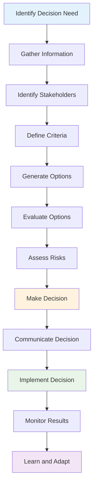

# Advanced Decision Making

## Overview

This module covers advanced decision-making frameworks for technical leaders including data-driven decisions, risk assessment, stakeholder management, and decision implementation strategies.

## Table of Contents

1. [Decision Frameworks](#decision-frameworks)
2. [Risk Assessment](#risk-assessment)
3. [Stakeholder Management](#stakeholder-management)
4. [Decision Implementation](#decision-implementation)
5. [Applications](#applications)
6. [Complexity Analysis](#complexity-analysis)
7. [Follow-up Questions](#follow-up-questions)

## Decision Frameworks

### Theory

Advanced decision-making involves structured approaches to complex technical and business decisions, considering multiple factors, stakeholders, and potential outcomes.

### Decision Making Process Diagram



### Decision Framework Implementation

#### Golang Implementation

```go
package main

import (
    "fmt"
    "math"
    "sort"
    "time"
)

type Decision struct {
    ID          string
    Title       string
    Description string
    Type        string
    Priority    int
    Status      string
    CreatedAt   time.Time
    DecidedAt   time.Time
    Options     []Option
    Criteria    []Criterion
    Stakeholders []Stakeholder
    Risks       []Risk
}

type Option struct {
    ID          string
    Name        string
    Description string
    Score       float64
    Pros        []string
    Cons        []string
    Cost        float64
    Timeline    time.Duration
    Probability float64
}

type Criterion struct {
    Name        string
    Weight      float64
    Description string
    Type        string // "benefit", "cost", "risk"
}

type Stakeholder struct {
    ID          string
    Name        string
    Role        string
    Influence   float64
    Interest    float64
    Position    string // "support", "neutral", "oppose"
    Concerns    []string
}

type Risk struct {
    ID          string
    Description string
    Probability float64
    Impact      float64
    Mitigation  string
    Owner       string
}

type DecisionMaker struct {
    Decisions    []Decision
    mutex        sync.RWMutex
    nextID       int
}

func NewDecisionMaker() *DecisionMaker {
    return &DecisionMaker{
        Decisions: make([]Decision, 0),
    }
}

func (dm *DecisionMaker) CreateDecision(title, description, decisionType string, priority int) *Decision {
    dm.mutex.Lock()
    defer dm.mutex.Unlock()
    
    decision := &Decision{
        ID:          fmt.Sprintf("decision_%d", dm.nextID),
        Title:       title,
        Description: description,
        Type:        decisionType,
        Priority:    priority,
        Status:      "pending",
        CreatedAt:   time.Now(),
        Options:     make([]Option, 0),
        Criteria:    make([]Criterion, 0),
        Stakeholders: make([]Stakeholder, 0),
        Risks:       make([]Risk, 0),
    }
    
    dm.nextID++
    dm.Decisions = append(dm.Decisions, *decision)
    
    return decision
}

func (dm *DecisionMaker) AddOption(decisionID string, option Option) bool {
    dm.mutex.Lock()
    defer dm.mutex.Unlock()
    
    for i, decision := range dm.Decisions {
        if decision.ID == decisionID {
            option.ID = fmt.Sprintf("option_%d", len(decision.Options)+1)
            dm.Decisions[i].Options = append(dm.Decisions[i].Options, option)
            return true
        }
    }
    
    return false
}

func (dm *DecisionMaker) AddCriterion(decisionID string, criterion Criterion) bool {
    dm.mutex.Lock()
    defer dm.mutex.Unlock()
    
    for i, decision := range dm.Decisions {
        if decision.ID == decisionID {
            dm.Decisions[i].Criteria = append(dm.Decisions[i].Criteria, criterion)
            return true
        }
    }
    
    return false
}

func (dm *DecisionMaker) AddStakeholder(decisionID string, stakeholder Stakeholder) bool {
    dm.mutex.Lock()
    defer dm.mutex.Unlock()
    
    for i, decision := range dm.Decisions {
        if decision.ID == decisionID {
            stakeholder.ID = fmt.Sprintf("stakeholder_%d", len(decision.Stakeholders)+1)
            dm.Decisions[i].Stakeholders = append(dm.Decisions[i].Stakeholders, stakeholder)
            return true
        }
    }
    
    return false
}

func (dm *DecisionMaker) AddRisk(decisionID string, risk Risk) bool {
    dm.mutex.Lock()
    defer dm.mutex.Unlock()
    
    for i, decision := range dm.Decisions {
        if decision.ID == decisionID {
            risk.ID = fmt.Sprintf("risk_%d", len(decision.Risks)+1)
            dm.Decisions[i].Risks = append(dm.Decisions[i].Risks, risk)
            return true
        }
    }
    
    return false
}

func (dm *DecisionMaker) EvaluateOptions(decisionID string) ([]Option, error) {
    dm.mutex.RLock()
    decision, exists := dm.getDecision(decisionID)
    dm.mutex.RUnlock()
    
    if !exists {
        return nil, fmt.Errorf("decision %s not found", decisionID)
    }
    
    if len(decision.Options) == 0 {
        return nil, fmt.Errorf("no options available for decision %s", decisionID)
    }
    
    if len(decision.Criteria) == 0 {
        return nil, fmt.Errorf("no criteria defined for decision %s", decisionID)
    }
    
    // Calculate weighted scores for each option
    for i := range decision.Options {
        score := 0.0
        for _, criterion := range decision.Criteria {
            // Simple scoring based on criterion type
            switch criterion.Type {
            case "benefit":
                score += criterion.Weight * dm.calculateBenefitScore(decision.Options[i], criterion)
            case "cost":
                score += criterion.Weight * dm.calculateCostScore(decision.Options[i], criterion)
            case "risk":
                score += criterion.Weight * dm.calculateRiskScore(decision.Options[i], criterion)
            }
        }
        decision.Options[i].Score = score
    }
    
    // Sort options by score (descending)
    sort.Slice(decision.Options, func(i, j int) bool {
        return decision.Options[i].Score > decision.Options[j].Score
    })
    
    return decision.Options, nil
}

func (dm *DecisionMaker) calculateBenefitScore(option Option, criterion Criterion) float64 {
    // Simple benefit scoring based on option characteristics
    baseScore := 0.5
    
    // Adjust based on option properties
    if option.Probability > 0.8 {
        baseScore += 0.2
    }
    if option.Timeline < 30*24*time.Hour {
        baseScore += 0.1
    }
    if option.Cost < 100000 {
        baseScore += 0.1
    }
    
    return math.Min(baseScore, 1.0)
}

func (dm *DecisionMaker) calculateCostScore(option Option, criterion Criterion) float64 {
    // Cost scoring (lower cost = higher score)
    if option.Cost == 0 {
        return 1.0
    }
    
    // Normalize cost score (assuming max cost of 1M)
    maxCost := 1000000.0
    normalizedCost := option.Cost / maxCost
    return 1.0 - normalizedCost
}

func (dm *DecisionMaker) calculateRiskScore(option Option, criterion Criterion) float64 {
    // Risk scoring (lower risk = higher score)
    if option.Probability > 0.8 {
        return 0.8
    }
    return option.Probability
}

func (dm *DecisionMaker) MakeDecision(decisionID string) (*Option, error) {
    dm.mutex.Lock()
    defer dm.mutex.Unlock()
    
    for i, decision := range dm.Decisions {
        if decision.ID == decisionID {
            if len(decision.Options) == 0 {
                return nil, fmt.Errorf("no options available for decision %s", decisionID)
            }
            
            // Select the highest scoring option
            bestOption := decision.Options[0]
            for _, option := range decision.Options {
                if option.Score > bestOption.Score {
                    bestOption = option
                }
            }
            
            dm.Decisions[i].Status = "decided"
            dm.Decisions[i].DecidedAt = time.Now()
            
            return &bestOption, nil
        }
    }
    
    return nil, fmt.Errorf("decision %s not found", decisionID)
}

func (dm *DecisionMaker) getDecision(decisionID string) (*Decision, bool) {
    for i, decision := range dm.Decisions {
        if decision.ID == decisionID {
            return &dm.Decisions[i], true
        }
    }
    return nil, false
}

func (dm *DecisionMaker) GetDecision(decisionID string) *Decision {
    dm.mutex.RLock()
    defer dm.mutex.RUnlock()
    
    if decision, exists := dm.getDecision(decisionID); exists {
        return decision
    }
    return nil
}

func (dm *DecisionMaker) GetDecisionsByStatus(status string) []Decision {
    dm.mutex.RLock()
    defer dm.mutex.RUnlock()
    
    var decisions []Decision
    for _, decision := range dm.Decisions {
        if decision.Status == status {
            decisions = append(decisions, decision)
        }
    }
    
    return decisions
}

func (dm *DecisionMaker) GetDecisionStats() map[string]interface{} {
    dm.mutex.RLock()
    defer dm.mutex.RUnlock()
    
    totalDecisions := len(dm.Decisions)
    pendingDecisions := 0
    decidedDecisions := 0
    
    for _, decision := range dm.Decisions {
        switch decision.Status {
        case "pending":
            pendingDecisions++
        case "decided":
            decidedDecisions++
        }
    }
    
    return map[string]interface{}{
        "total_decisions":    totalDecisions,
        "pending_decisions":  pendingDecisions,
        "decided_decisions":  decidedDecisions,
        "decision_rate":      float64(decidedDecisions) / float64(totalDecisions) * 100,
    }
}

func main() {
    fmt.Println("Advanced Decision Making Demo:")
    
    dm := NewDecisionMaker()
    
    // Create a decision
    decision := dm.CreateDecision(
        "Technology Stack Selection",
        "Choose the best technology stack for our new microservices platform",
        "technical",
        1,
    )
    
    fmt.Printf("Created decision: %s\n", decision.Title)
    
    // Add criteria
    dm.AddCriterion(decision.ID, Criterion{
        Name:        "Performance",
        Weight:      0.3,
        Description: "System performance and scalability",
        Type:        "benefit",
    })
    
    dm.AddCriterion(decision.ID, Criterion{
        Name:        "Development Speed",
        Weight:      0.25,
        Description: "Time to market and development efficiency",
        Type:        "benefit",
    })
    
    dm.AddCriterion(decision.ID, Criterion{
        Name:        "Cost",
        Weight:      0.2,
        Description: "Total cost of ownership",
        Type:        "cost",
    })
    
    dm.AddCriterion(decision.ID, Criterion{
        Name:        "Risk",
        Weight:      0.25,
        Description: "Technical and business risk",
        Type:        "risk",
    })
    
    // Add options
    dm.AddOption(decision.ID, Option{
        Name:        "Go + Kubernetes",
        Description: "Go microservices with Kubernetes orchestration",
        Cost:        500000,
        Timeline:    6 * 30 * 24 * time.Hour,
        Probability: 0.9,
        Pros:        []string{"High performance", "Good ecosystem", "Cloud native"},
        Cons:        []string{"Learning curve", "Complexity"},
    })
    
    dm.AddOption(decision.ID, Option{
        Name:        "Java + Spring Boot",
        Description: "Java microservices with Spring Boot framework",
        Cost:        400000,
        Timeline:    4 * 30 * 24 * time.Hour,
        Probability: 0.95,
        Pros:        []string{"Mature ecosystem", "Team expertise", "Enterprise ready"},
        Cons:        []string{"Higher resource usage", "Slower startup"},
    })
    
    dm.AddOption(decision.ID, Option{
        Name:        "Node.js + Docker",
        Description: "Node.js microservices with Docker containers",
        Cost:        300000,
        Timeline:    3 * 30 * 24 * time.Hour,
        Probability: 0.8,
        Pros:        []string{"Fast development", "JavaScript everywhere", "Lightweight"},
        Cons:        []string{"Single-threaded", "Less mature for enterprise"},
    })
    
    // Add stakeholders
    dm.AddStakeholder(decision.ID, Stakeholder{
        Name:      "Engineering Team",
        Role:      "Implementers",
        Influence: 0.8,
        Interest:  0.9,
        Position:  "support",
        Concerns:  []string{"Learning curve", "Development speed"},
    })
    
    dm.AddStakeholder(decision.ID, Stakeholder{
        Name:      "Product Team",
        Role:      "Users",
        Influence: 0.6,
        Interest:  0.7,
        Position:  "neutral",
        Concerns:  []string{"Time to market", "Feature delivery"},
    })
    
    dm.AddStakeholder(decision.ID, Stakeholder{
        Name:      "Finance Team",
        Role:      "Budget Holders",
        Influence: 0.4,
        Interest:  0.8,
        Position:  "oppose",
        Concerns:  []string{"Cost", "ROI"},
    })
    
    // Evaluate options
    options, err := dm.EvaluateOptions(decision.ID)
    if err != nil {
        fmt.Printf("Error evaluating options: %v\n", err)
        return
    }
    
    fmt.Println("\nEvaluated Options:")
    for i, option := range options {
        fmt.Printf("%d. %s (Score: %.2f)\n", i+1, option.Name, option.Score)
    }
    
    // Make decision
    bestOption, err := dm.MakeDecision(decision.ID)
    if err != nil {
        fmt.Printf("Error making decision: %v\n", err)
        return
    }
    
    fmt.Printf("\nDecision Made: %s (Score: %.2f)\n", bestOption.Name, bestOption.Score)
    
    // Get decision stats
    stats := dm.GetDecisionStats()
    fmt.Printf("\nDecision Stats: %+v\n", stats)
}
```

## Risk Assessment

### Theory

Risk assessment involves identifying, analyzing, and evaluating potential risks associated with technical decisions and implementing mitigation strategies.

### Risk Assessment Implementation

#### Golang Implementation

```go
package main

import (
    "fmt"
    "math"
    "sort"
    "time"
)

type RiskAssessment struct {
    ID          string
    DecisionID  string
    Risks       []Risk
    Mitigations []Mitigation
    CreatedAt   time.Time
    UpdatedAt   time.Time
}

type Mitigation struct {
    ID          string
    RiskID      string
    Description string
    Cost        float64
    Effectiveness float64
    Timeline    time.Duration
    Owner       string
    Status      string
}

type RiskMatrix struct {
    Risks       []Risk
    Mitigations []Mitigation
    mutex       sync.RWMutex
}

func NewRiskMatrix() *RiskMatrix {
    return &RiskMatrix{
        Risks:       make([]Risk, 0),
        Mitigations: make([]Mitigation, 0),
    }
}

func (rm *RiskMatrix) AddRisk(risk Risk) {
    rm.mutex.Lock()
    defer rm.mutex.Unlock()
    
    risk.ID = fmt.Sprintf("risk_%d", len(rm.Risks)+1)
    rm.Risks = append(rm.Risks, risk)
}

func (rm *RiskMatrix) AddMitigation(mitigation Mitigation) {
    rm.mutex.Lock()
    defer rm.mutex.Unlock()
    
    mitigation.ID = fmt.Sprintf("mitigation_%d", len(rm.Mitigations)+1)
    rm.Mitigations = append(rm.Mitigations, mitigation)
}

func (rm *RiskMatrix) CalculateRiskScore(risk Risk) float64 {
    return risk.Probability * risk.Impact
}

func (rm *RiskMatrix) GetRiskLevel(risk Risk) string {
    score := rm.CalculateRiskScore(risk)
    
    if score >= 0.8 {
        return "Critical"
    } else if score >= 0.6 {
        return "High"
    } else if score >= 0.4 {
        return "Medium"
    } else if score >= 0.2 {
        return "Low"
    } else {
        return "Very Low"
    }
}

func (rm *RiskMatrix) GetTopRisks(limit int) []Risk {
    rm.mutex.RLock()
    defer rm.mutex.RUnlock()
    
    risks := make([]Risk, len(rm.Risks))
    copy(risks, rm.Risks)
    
    // Sort by risk score (descending)
    sort.Slice(risks, func(i, j int) bool {
        return rm.CalculateRiskScore(risks[i]) > rm.CalculateRiskScore(risks[j])
    })
    
    if limit > 0 && limit < len(risks) {
        return risks[:limit]
    }
    
    return risks
}

func (rm *RiskMatrix) GetRisksByLevel(level string) []Risk {
    rm.mutex.RLock()
    defer rm.mutex.RUnlock()
    
    var risks []Risk
    for _, risk := range rm.Risks {
        if rm.GetRiskLevel(risk) == level {
            risks = append(risks, risk)
        }
    }
    
    return risks
}

func (rm *RiskMatrix) GetMitigationEffectiveness(riskID string) float64 {
    rm.mutex.RLock()
    defer rm.mutex.RUnlock()
    
    var totalEffectiveness float64
    count := 0
    
    for _, mitigation := range rm.Mitigations {
        if mitigation.RiskID == riskID {
            totalEffectiveness += mitigation.Effectiveness
            count++
        }
    }
    
    if count == 0 {
        return 0
    }
    
    return totalEffectiveness / float64(count)
}

func (rm *RiskMatrix) GetRiskStats() map[string]interface{} {
    rm.mutex.RLock()
    defer rm.mutex.RUnlock()
    
    totalRisks := len(rm.Risks)
    criticalRisks := 0
    highRisks := 0
    mediumRisks := 0
    lowRisks := 0
    veryLowRisks := 0
    
    for _, risk := range rm.Risks {
        level := rm.GetRiskLevel(risk)
        switch level {
        case "Critical":
            criticalRisks++
        case "High":
            highRisks++
        case "Medium":
            mediumRisks++
        case "Low":
            lowRisks++
        case "Very Low":
            veryLowRisks++
        }
    }
    
    return map[string]interface{}{
        "total_risks":     totalRisks,
        "critical_risks":  criticalRisks,
        "high_risks":      highRisks,
        "medium_risks":    mediumRisks,
        "low_risks":       lowRisks,
        "very_low_risks":  veryLowRisks,
    }
}

func main() {
    fmt.Println("Risk Assessment Demo:")
    
    rm := NewRiskMatrix()
    
    // Add risks
    rm.AddRisk(Risk{
        Description: "Technology learning curve",
        Probability: 0.7,
        Impact:      0.6,
        Mitigation:  "Training and documentation",
        Owner:       "Engineering Team",
    })
    
    rm.AddRisk(Risk{
        Description: "Performance issues",
        Probability: 0.4,
        Impact:      0.8,
        Mitigation:  "Load testing and optimization",
        Owner:       "Engineering Team",
    })
    
    rm.AddRisk(Risk{
        Description: "Security vulnerabilities",
        Probability: 0.3,
        Impact:      0.9,
        Mitigation:  "Security audits and testing",
        Owner:       "Security Team",
    })
    
    rm.AddRisk(Risk{
        Description: "Budget overrun",
        Probability: 0.5,
        Impact:      0.7,
        Mitigation:  "Regular budget reviews",
        Owner:       "Finance Team",
    })
    
    // Add mitigations
    rm.AddMitigation(Mitigation{
        RiskID:        "risk_1",
        Description:   "Comprehensive training program",
        Cost:          50000,
        Effectiveness: 0.8,
        Timeline:      30 * 24 * time.Hour,
        Owner:         "HR Team",
        Status:        "planned",
    })
    
    rm.AddMitigation(Mitigation{
        RiskID:        "risk_2",
        Description:   "Performance testing suite",
        Cost:          30000,
        Effectiveness: 0.9,
        Timeline:      14 * 24 * time.Hour,
        Owner:         "QA Team",
        Status:        "in_progress",
    })
    
    // Get top risks
    topRisks := rm.GetTopRisks(3)
    fmt.Println("Top Risks:")
    for i, risk := range topRisks {
        score := rm.CalculateRiskScore(risk)
        level := rm.GetRiskLevel(risk)
        fmt.Printf("%d. %s (Score: %.2f, Level: %s)\n", 
                   i+1, risk.Description, score, level)
    }
    
    // Get risks by level
    criticalRisks := rm.GetRisksByLevel("Critical")
    fmt.Printf("\nCritical Risks: %d\n", len(criticalRisks))
    
    // Get risk stats
    stats := rm.GetRiskStats()
    fmt.Printf("\nRisk Stats: %+v\n", stats)
    
    // Get mitigation effectiveness
    effectiveness := rm.GetMitigationEffectiveness("risk_1")
    fmt.Printf("Mitigation effectiveness for risk_1: %.2f\n", effectiveness)
}
```

## Follow-up Questions

### 1. Decision Frameworks
**Q: What are the key components of a good decision framework?**
A: Clear criteria, stakeholder input, risk assessment, option evaluation, and implementation monitoring are essential components.

### 2. Risk Assessment
**Q: How do you prioritize risks in technical decisions?**
A: Risks should be prioritized based on probability and impact, with critical risks requiring immediate attention and mitigation.

### 3. Stakeholder Management
**Q: How do you handle conflicting stakeholder interests?**
A: Use structured approaches like stakeholder mapping, influence-interest matrices, and transparent communication to address conflicts.

## Complexity Analysis

| Operation | Decision Frameworks | Risk Assessment | Stakeholder Management |
|-----------|-------------------|-----------------|----------------------|
| Create | O(1) | O(1) | O(1) |
| Evaluate | O(n²) | O(n) | O(n) |
| Decide | O(n log n) | O(n) | O(n) |
| Monitor | O(n) | O(n) | O(n) |

## Applications

1. **Decision Frameworks**: Strategic planning, technology selection, resource allocation
2. **Risk Assessment**: Project management, technology adoption, business continuity
3. **Stakeholder Management**: Change management, project success, organizational alignment
4. **Advanced Decision Making**: Leadership effectiveness, organizational success, strategic outcomes

---

**Next**: [Strategic Planning](../../../README.md) | **Previous**: [Technical Leadership](README.md/) | **Up**: [Phase 3 Expert](README.md/)
