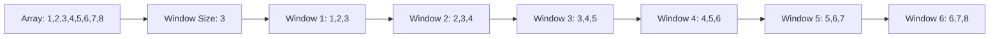
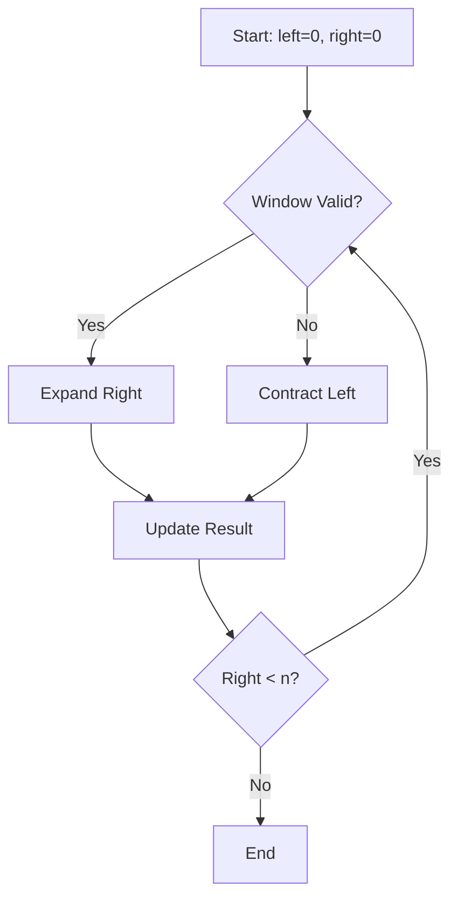
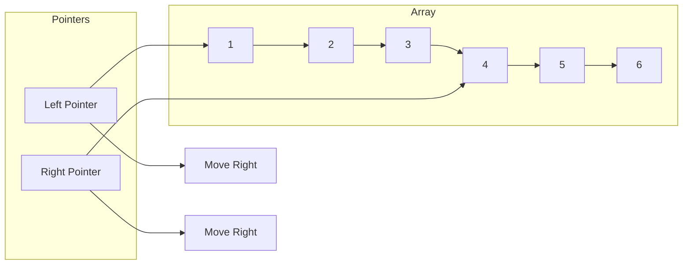

# 🪟 **Sliding Window Pattern**

## 📘 **Theory**

The Sliding Window pattern is a technique used to solve problems involving arrays or strings where we need to find a subarray or substring that satisfies certain conditions. It maintains a "window" of elements and slides it across the data structure, avoiding redundant calculations.

### **Why Sliding Window Matters**
- **Efficiency**: Reduces time complexity from O(n²) to O(n) for many problems
- **Optimization**: Avoids recalculating overlapping elements
- **Common Pattern**: Used in many real-world problems like data streaming
- **Interview Favorite**: Frequently asked in technical interviews
- **Foundation**: Basis for more complex algorithms
- **Performance**: Significantly improves performance for large datasets

### **Key Concepts**
1. **Fixed Window**: Window size remains constant
2. **Variable Window**: Window size changes based on conditions
3. **Two Pointers**: Left and right pointers define window boundaries
4. **Window State**: Maintains information about current window
5. **Expansion**: Moving right pointer to include new elements
6. **Contraction**: Moving left pointer to exclude elements
7. **Optimization**: Reusing calculations from previous window

### **Common Pitfalls and Best Practices**
- **Boundary Conditions**: Handle edge cases like empty arrays
- **Window Size**: Ensure window size doesn't exceed array bounds
- **State Updates**: Properly update window state during expansion/contraction
- **Index Management**: Be careful with 0-based vs 1-based indexing
- **Overflow**: Handle integer overflow in sum calculations
- **Memory**: Use efficient data structures for window state

## 📊 **Diagrams**

### **Fixed Window Sliding**


### **Variable Window Sliding**


### **Two Pointers Technique**


## 🧩 **Example**

**Scenario**: Find the maximum sum of any contiguous subarray of size k

**Input**: Array [1, 4, 2, 10, 23, 3, 1, 0, 20], k = 4
**Expected Output**: 39 (subarray [4, 2, 10, 23])

**Step-by-step**:
1. Calculate sum of first k elements
2. Slide window by removing leftmost element and adding rightmost element
3. Update maximum sum if current window sum is greater
4. Continue until window reaches end of array

## 💻 **Implementation (Golang)**

```go
package main

import (
    "fmt"
    "math"
)

// SlidingWindowSolver provides various sliding window algorithms
type SlidingWindowSolver struct{}

// NewSlidingWindowSolver creates a new solver
func NewSlidingWindowSolver() *SlidingWindowSolver {
    return &SlidingWindowSolver{}
}

// MaxSumSubarrayOfSizeK finds maximum sum of subarray of size k
func (sws *SlidingWindowSolver) MaxSumSubarrayOfSizeK(arr []int, k int) int {
    if len(arr) < k {
        return 0
    }

    // Calculate sum of first window
    windowSum := 0
    for i := 0; i < k; i++ {
        windowSum += arr[i]
    }

    maxSum := windowSum

    // Slide the window
    for i := k; i < len(arr); i++ {
        // Remove leftmost element and add rightmost element
        windowSum = windowSum - arr[i-k] + arr[i]
        if windowSum > maxSum {
            maxSum = windowSum
        }
    }

    return maxSum
}

// FirstNegativeInWindow finds first negative number in each window of size k
func (sws *SlidingWindowSolver) FirstNegativeInWindow(arr []int, k int) []int {
    if len(arr) < k {
        return []int{}
    }

    var result []int
    var negativeIndices []int

    // Process first window
    for i := 0; i < k; i++ {
        if arr[i] < 0 {
            negativeIndices = append(negativeIndices, i)
        }
    }

    // Add first negative of first window
    if len(negativeIndices) > 0 {
        result = append(result, arr[negativeIndices[0]])
    } else {
        result = append(result, 0)
    }

    // Process remaining windows
    for i := k; i < len(arr); i++ {
        // Remove elements outside current window
        for len(negativeIndices) > 0 && negativeIndices[0] <= i-k {
            negativeIndices = negativeIndices[1:]
        }

        // Add new element if negative
        if arr[i] < 0 {
            negativeIndices = append(negativeIndices, i)
        }

        // Add first negative of current window
        if len(negativeIndices) > 0 {
            result = append(result, arr[negativeIndices[0]])
        } else {
            result = append(result, 0)
        }
    }

    return result
}

// CountAnagrams counts anagrams of pattern in text
func (sws *SlidingWindowSolver) CountAnagrams(text, pattern string) int {
    if len(text) < len(pattern) {
        return 0
    }

    patternFreq := make(map[byte]int)
    windowFreq := make(map[byte]int)
    count := 0

    // Count frequency of pattern characters
    for i := 0; i < len(pattern); i++ {
        patternFreq[pattern[i]]++
    }

    // Count frequency of first window
    for i := 0; i < len(pattern); i++ {
        windowFreq[text[i]]++
    }

    // Check if first window is anagram
    if sws.mapsEqual(patternFreq, windowFreq) {
        count++
    }

    // Slide the window
    for i := len(pattern); i < len(text); i++ {
        // Remove leftmost character
        leftChar := text[i-len(pattern)]
        windowFreq[leftChar]--
        if windowFreq[leftChar] == 0 {
            delete(windowFreq, leftChar)
        }

        // Add rightmost character
        rightChar := text[i]
        windowFreq[rightChar]++

        // Check if current window is anagram
        if sws.mapsEqual(patternFreq, windowFreq) {
            count++
        }
    }

    return count
}

// LongestSubstringWithoutRepeating finds longest substring without repeating characters
func (sws *SlidingWindowSolver) LongestSubstringWithoutRepeating(s string) int {
    if len(s) == 0 {
        return 0
    }

    charMap := make(map[byte]int)
    left := 0
    maxLen := 0

    for right := 0; right < len(s); right++ {
        char := s[right]
        
        // If character is already in window, move left pointer
        if lastIndex, exists := charMap[char]; exists && lastIndex >= left {
            left = lastIndex + 1
        }

        charMap[char] = right
        maxLen = int(math.Max(float64(maxLen), float64(right-left+1)))
    }

    return maxLen
}

// MinWindowSubstring finds minimum window substring containing all characters of pattern
func (sws *SlidingWindowSolver) MinWindowSubstring(s, t string) string {
    if len(s) < len(t) {
        return ""
    }

    // Count frequency of pattern characters
    patternFreq := make(map[byte]int)
    for i := 0; i < len(t); i++ {
        patternFreq[t[i]]++
    }

    windowFreq := make(map[byte]int)
    left := 0
    minLen := math.MaxInt32
    minStart := 0
    matched := 0

    for right := 0; right < len(s); right++ {
        char := s[right]
        windowFreq[char]++

        // Check if current character is needed
        if patternFreq[char] > 0 && windowFreq[char] <= patternFreq[char] {
            matched++
        }

        // Try to contract window from left
        for matched == len(t) {
            if right-left+1 < minLen {
                minLen = right - left + 1
                minStart = left
            }

            leftChar := s[left]
            windowFreq[leftChar]--
            
            if patternFreq[leftChar] > 0 && windowFreq[leftChar] < patternFreq[leftChar] {
                matched--
            }
            
            left++
        }
    }

    if minLen == math.MaxInt32 {
        return ""
    }

    return s[minStart : minStart+minLen]
}

// MaxSumSubarray finds maximum sum of any contiguous subarray
func (sws *SlidingWindowSolver) MaxSumSubarray(arr []int) int {
    if len(arr) == 0 {
        return 0
    }

    maxSum := arr[0]
    currentSum := arr[0]

    for i := 1; i < len(arr); i++ {
        // Either extend existing subarray or start new one
        currentSum = int(math.Max(float64(arr[i]), float64(currentSum+arr[i])))
        maxSum = int(math.Max(float64(maxSum), float64(currentSum)))
    }

    return maxSum
}

// FindAllAnagrams finds all starting indices of anagrams of pattern in text
func (sws *SlidingWindowSolver) FindAllAnagrams(text, pattern string) []int {
    if len(text) < len(pattern) {
        return []int{}
    }

    var result []int
    patternFreq := make(map[byte]int)
    windowFreq := make(map[byte]int)

    // Count frequency of pattern characters
    for i := 0; i < len(pattern); i++ {
        patternFreq[pattern[i]]++
    }

    // Count frequency of first window
    for i := 0; i < len(pattern); i++ {
        windowFreq[text[i]]++
    }

    // Check if first window is anagram
    if sws.mapsEqual(patternFreq, windowFreq) {
        result = append(result, 0)
    }

    // Slide the window
    for i := len(pattern); i < len(text); i++ {
        // Remove leftmost character
        leftChar := text[i-len(pattern)]
        windowFreq[leftChar]--
        if windowFreq[leftChar] == 0 {
            delete(windowFreq, leftChar)
        }

        // Add rightmost character
        rightChar := text[i]
        windowFreq[rightChar]++

        // Check if current window is anagram
        if sws.mapsEqual(patternFreq, windowFreq) {
            result = append(result, i-len(pattern)+1)
        }
    }

    return result
}

// LongestSubstringWithKDistinct finds longest substring with at most k distinct characters
func (sws *SlidingWindowSolver) LongestSubstringWithKDistinct(s string, k int) int {
    if len(s) == 0 || k == 0 {
        return 0
    }

    charMap := make(map[byte]int)
    left := 0
    maxLen := 0

    for right := 0; right < len(s); right++ {
        char := s[right]
        charMap[char]++

        // If we have more than k distinct characters, contract window
        for len(charMap) > k {
            leftChar := s[left]
            charMap[leftChar]--
            if charMap[leftChar] == 0 {
                delete(charMap, leftChar)
            }
            left++
        }

        maxLen = int(math.Max(float64(maxLen), float64(right-left+1)))
    }

    return maxLen
}

// SubarraySum finds subarrays with given sum
func (sws *SlidingWindowSolver) SubarraySum(arr []int, targetSum int) [][]int {
    var result [][]int
    currentSum := 0
    left := 0

    for right := 0; right < len(arr); right++ {
        currentSum += arr[right]

        // If sum exceeds target, contract window from left
        for currentSum > targetSum && left <= right {
            currentSum -= arr[left]
            left++
        }

        // If sum equals target, add to result
        if currentSum == targetSum {
            result = append(result, arr[left:right+1])
        }
    }

    return result
}

// Helper function to compare two maps
func (sws *SlidingWindowSolver) mapsEqual(map1, map2 map[byte]int) bool {
    if len(map1) != len(map2) {
        return false
    }

    for key, value := range map1 {
        if map2[key] != value {
            return false
        }
    }

    return true
}

// Advanced sliding window with custom conditions
func (sws *SlidingWindowSolver) SlidingWindowWithCondition(arr []int, condition func([]int) bool) []int {
    if len(arr) == 0 {
        return []int{}
    }

    left := 0
    var result []int

    for right := 0; right < len(arr); right++ {
        // Expand window
        window := arr[left : right+1]
        
        // Check if current window satisfies condition
        if condition(window) {
            result = append(result, right-left+1)
        } else {
            // Contract window from left
            for left <= right && !condition(window) {
                left++
                if left <= right {
                    window = arr[left : right+1]
                }
            }
        }
    }

    return result
}

// Example usage
func main() {
    solver := NewSlidingWindowSolver()

    // Test cases
    fmt.Println("=== Sliding Window Pattern Tests ===")

    // Test 1: Maximum sum of subarray of size k
    arr1 := []int{1, 4, 2, 10, 23, 3, 1, 0, 20}
    k1 := 4
    result1 := solver.MaxSumSubarrayOfSizeK(arr1, k1)
    fmt.Printf("Max sum of subarray of size %d: %d\n", k1, result1)

    // Test 2: First negative in each window
    arr2 := []int{12, -1, -7, 8, -15, 30, 16, 28}
    k2 := 3
    result2 := solver.FirstNegativeInWindow(arr2, k2)
    fmt.Printf("First negative in each window of size %d: %v\n", k2, result2)

    // Test 3: Count anagrams
    text3 := "forxxorfxdofr"
    pattern3 := "for"
    result3 := solver.CountAnagrams(text3, pattern3)
    fmt.Printf("Count of anagrams of '%s' in '%s': %d\n", pattern3, text3, result3)

    // Test 4: Longest substring without repeating characters
    s4 := "abcabcbb"
    result4 := solver.LongestSubstringWithoutRepeating(s4)
    fmt.Printf("Longest substring without repeating characters in '%s': %d\n", s4, result4)

    // Test 5: Minimum window substring
    s5 := "ADOBECODEBANC"
    t5 := "ABC"
    result5 := solver.MinWindowSubstring(s5, t5)
    fmt.Printf("Minimum window substring of '%s' in '%s': '%s'\n", t5, s5, result5)

    // Test 6: Maximum sum subarray
    arr6 := []int{-2, 1, -3, 4, -1, 2, 1, -5, 4}
    result6 := solver.MaxSumSubarray(arr6)
    fmt.Printf("Maximum sum subarray: %d\n", result6)

    // Test 7: Find all anagrams
    text7 := "cbaebabacd"
    pattern7 := "abc"
    result7 := solver.FindAllAnagrams(text7, pattern7)
    fmt.Printf("Starting indices of anagrams of '%s' in '%s': %v\n", pattern7, text7, result7)

    // Test 8: Longest substring with k distinct characters
    s8 := "eceba"
    k8 := 2
    result8 := solver.LongestSubstringWithKDistinct(s8, k8)
    fmt.Printf("Longest substring with %d distinct characters in '%s': %d\n", k8, s8, result8)

    // Test 9: Subarray sum
    arr9 := []int{1, 4, 20, 3, 10, 5}
    targetSum := 33
    result9 := solver.SubarraySum(arr9, targetSum)
    fmt.Printf("Subarrays with sum %d: %v\n", targetSum, result9)

    // Test 10: Custom condition
    arr10 := []int{1, 2, 3, 4, 5, 6, 7, 8, 9, 10}
    condition := func(window []int) bool {
        sum := 0
        for _, num := range window {
            sum += num
        }
        return sum <= 15
    }
    result10 := solver.SlidingWindowWithCondition(arr10, condition)
    fmt.Printf("Window sizes satisfying custom condition: %v\n", result10)
}
```

## 💻 **Implementation (Node.js)**

```javascript
// SlidingWindowSolver provides various sliding window algorithms
class SlidingWindowSolver {
  constructor() {}

  // MaxSumSubarrayOfSizeK finds maximum sum of subarray of size k
  maxSumSubarrayOfSizeK(arr, k) {
    if (arr.length < k) {
      return 0;
    }

    // Calculate sum of first window
    let windowSum = 0;
    for (let i = 0; i < k; i++) {
      windowSum += arr[i];
    }

    let maxSum = windowSum;

    // Slide the window
    for (let i = k; i < arr.length; i++) {
      // Remove leftmost element and add rightmost element
      windowSum = windowSum - arr[i - k] + arr[i];
      if (windowSum > maxSum) {
        maxSum = windowSum;
      }
    }

    return maxSum;
  }

  // FirstNegativeInWindow finds first negative number in each window of size k
  firstNegativeInWindow(arr, k) {
    if (arr.length < k) {
      return [];
    }

    const result = [];
    const negativeIndices = [];

    // Process first window
    for (let i = 0; i < k; i++) {
      if (arr[i] < 0) {
        negativeIndices.push(i);
      }
    }

    // Add first negative of first window
    if (negativeIndices.length > 0) {
      result.push(arr[negativeIndices[0]]);
    } else {
      result.push(0);
    }

    // Process remaining windows
    for (let i = k; i < arr.length; i++) {
      // Remove elements outside current window
      while (negativeIndices.length > 0 && negativeIndices[0] <= i - k) {
        negativeIndices.shift();
      }

      // Add new element if negative
      if (arr[i] < 0) {
        negativeIndices.push(i);
      }

      // Add first negative of current window
      if (negativeIndices.length > 0) {
        result.push(arr[negativeIndices[0]]);
      } else {
        result.push(0);
      }
    }

    return result;
  }

  // CountAnagrams counts anagrams of pattern in text
  countAnagrams(text, pattern) {
    if (text.length < pattern.length) {
      return 0;
    }

    const patternFreq = new Map();
    const windowFreq = new Map();
    let count = 0;

    // Count frequency of pattern characters
    for (let i = 0; i < pattern.length; i++) {
      const char = pattern[i];
      patternFreq.set(char, (patternFreq.get(char) || 0) + 1);
    }

    // Count frequency of first window
    for (let i = 0; i < pattern.length; i++) {
      const char = text[i];
      windowFreq.set(char, (windowFreq.get(char) || 0) + 1);
    }

    // Check if first window is anagram
    if (this.mapsEqual(patternFreq, windowFreq)) {
      count++;
    }

    // Slide the window
    for (let i = pattern.length; i < text.length; i++) {
      // Remove leftmost character
      const leftChar = text[i - pattern.length];
      windowFreq.set(leftChar, windowFreq.get(leftChar) - 1);
      if (windowFreq.get(leftChar) === 0) {
        windowFreq.delete(leftChar);
      }

      // Add rightmost character
      const rightChar = text[i];
      windowFreq.set(rightChar, (windowFreq.get(rightChar) || 0) + 1);

      // Check if current window is anagram
      if (this.mapsEqual(patternFreq, windowFreq)) {
        count++;
      }
    }

    return count;
  }

  // LongestSubstringWithoutRepeating finds longest substring without repeating characters
  longestSubstringWithoutRepeating(s) {
    if (s.length === 0) {
      return 0;
    }

    const charMap = new Map();
    let left = 0;
    let maxLen = 0;

    for (let right = 0; right < s.length; right++) {
      const char = s[right];

      // If character is already in window, move left pointer
      if (charMap.has(char) && charMap.get(char) >= left) {
        left = charMap.get(char) + 1;
      }

      charMap.set(char, right);
      maxLen = Math.max(maxLen, right - left + 1);
    }

    return maxLen;
  }

  // MinWindowSubstring finds minimum window substring containing all characters of pattern
  minWindowSubstring(s, t) {
    if (s.length < t.length) {
      return '';
    }

    // Count frequency of pattern characters
    const patternFreq = new Map();
    for (let i = 0; i < t.length; i++) {
      const char = t[i];
      patternFreq.set(char, (patternFreq.get(char) || 0) + 1);
    }

    const windowFreq = new Map();
    let left = 0;
    let minLen = Infinity;
    let minStart = 0;
    let matched = 0;

    for (let right = 0; right < s.length; right++) {
      const char = s[right];
      windowFreq.set(char, (windowFreq.get(char) || 0) + 1);

      // Check if current character is needed
      if (patternFreq.has(char) && windowFreq.get(char) <= patternFreq.get(char)) {
        matched++;
      }

      // Try to contract window from left
      while (matched === t.length) {
        if (right - left + 1 < minLen) {
          minLen = right - left + 1;
          minStart = left;
        }

        const leftChar = s[left];
        windowFreq.set(leftChar, windowFreq.get(leftChar) - 1);

        if (patternFreq.has(leftChar) && windowFreq.get(leftChar) < patternFreq.get(leftChar)) {
          matched--;
        }

        left++;
      }
    }

    if (minLen === Infinity) {
      return '';
    }

    return s.substring(minStart, minStart + minLen);
  }

  // MaxSumSubarray finds maximum sum of any contiguous subarray
  maxSumSubarray(arr) {
    if (arr.length === 0) {
      return 0;
    }

    let maxSum = arr[0];
    let currentSum = arr[0];

    for (let i = 1; i < arr.length; i++) {
      // Either extend existing subarray or start new one
      currentSum = Math.max(arr[i], currentSum + arr[i]);
      maxSum = Math.max(maxSum, currentSum);
    }

    return maxSum;
  }

  // FindAllAnagrams finds all starting indices of anagrams of pattern in text
  findAllAnagrams(text, pattern) {
    if (text.length < pattern.length) {
      return [];
    }

    const result = [];
    const patternFreq = new Map();
    const windowFreq = new Map();

    // Count frequency of pattern characters
    for (let i = 0; i < pattern.length; i++) {
      const char = pattern[i];
      patternFreq.set(char, (patternFreq.get(char) || 0) + 1);
    }

    // Count frequency of first window
    for (let i = 0; i < pattern.length; i++) {
      const char = text[i];
      windowFreq.set(char, (windowFreq.get(char) || 0) + 1);
    }

    // Check if first window is anagram
    if (this.mapsEqual(patternFreq, windowFreq)) {
      result.push(0);
    }

    // Slide the window
    for (let i = pattern.length; i < text.length; i++) {
      // Remove leftmost character
      const leftChar = text[i - pattern.length];
      windowFreq.set(leftChar, windowFreq.get(leftChar) - 1);
      if (windowFreq.get(leftChar) === 0) {
        windowFreq.delete(leftChar);
      }

      // Add rightmost character
      const rightChar = text[i];
      windowFreq.set(rightChar, (windowFreq.get(rightChar) || 0) + 1);

      // Check if current window is anagram
      if (this.mapsEqual(patternFreq, windowFreq)) {
        result.push(i - pattern.length + 1);
      }
    }

    return result;
  }

  // LongestSubstringWithKDistinct finds longest substring with at most k distinct characters
  longestSubstringWithKDistinct(s, k) {
    if (s.length === 0 || k === 0) {
      return 0;
    }

    const charMap = new Map();
    let left = 0;
    let maxLen = 0;

    for (let right = 0; right < s.length; right++) {
      const char = s[right];
      charMap.set(char, (charMap.get(char) || 0) + 1);

      // If we have more than k distinct characters, contract window
      while (charMap.size > k) {
        const leftChar = s[left];
        charMap.set(leftChar, charMap.get(leftChar) - 1);
        if (charMap.get(leftChar) === 0) {
          charMap.delete(leftChar);
        }
        left++;
      }

      maxLen = Math.max(maxLen, right - left + 1);
    }

    return maxLen;
  }

  // SubarraySum finds subarrays with given sum
  subarraySum(arr, targetSum) {
    const result = [];
    let currentSum = 0;
    let left = 0;

    for (let right = 0; right < arr.length; right++) {
      currentSum += arr[right];

      // If sum exceeds target, contract window from left
      while (currentSum > targetSum && left <= right) {
        currentSum -= arr[left];
        left++;
      }

      // If sum equals target, add to result
      if (currentSum === targetSum) {
        result.push(arr.slice(left, right + 1));
      }
    }

    return result;
  }

  // Helper function to compare two maps
  mapsEqual(map1, map2) {
    if (map1.size !== map2.size) {
      return false;
    }

    for (const [key, value] of map1) {
      if (map2.get(key) !== value) {
        return false;
      }
    }

    return true;
  }

  // Advanced sliding window with custom conditions
  slidingWindowWithCondition(arr, condition) {
    if (arr.length === 0) {
      return [];
    }

    let left = 0;
    const result = [];

    for (let right = 0; right < arr.length; right++) {
      // Expand window
      let window = arr.slice(left, right + 1);

      // Check if current window satisfies condition
      if (condition(window)) {
        result.push(right - left + 1);
      } else {
        // Contract window from left
        while (left <= right && !condition(window)) {
          left++;
          if (left <= right) {
            window = arr.slice(left, right + 1);
          }
        }
      }
    }

    return result;
  }
}

// Example usage
function main() {
  const solver = new SlidingWindowSolver();

  // Test cases
  console.log('=== Sliding Window Pattern Tests ===');

  // Test 1: Maximum sum of subarray of size k
  const arr1 = [1, 4, 2, 10, 23, 3, 1, 0, 20];
  const k1 = 4;
  const result1 = solver.maxSumSubarrayOfSizeK(arr1, k1);
  console.log(`Max sum of subarray of size ${k1}: ${result1}`);

  // Test 2: First negative in each window
  const arr2 = [12, -1, -7, 8, -15, 30, 16, 28];
  const k2 = 3;
  const result2 = solver.firstNegativeInWindow(arr2, k2);
  console.log(`First negative in each window of size ${k2}: [${result2.join(', ')}]`);

  // Test 3: Count anagrams
  const text3 = 'forxxorfxdofr';
  const pattern3 = 'for';
  const result3 = solver.countAnagrams(text3, pattern3);
  console.log(`Count of anagrams of '${pattern3}' in '${text3}': ${result3}`);

  // Test 4: Longest substring without repeating characters
  const s4 = 'abcabcbb';
  const result4 = solver.longestSubstringWithoutRepeating(s4);
  console.log(`Longest substring without repeating characters in '${s4}': ${result4}`);

  // Test 5: Minimum window substring
  const s5 = 'ADOBECODEBANC';
  const t5 = 'ABC';
  const result5 = solver.minWindowSubstring(s5, t5);
  console.log(`Minimum window substring of '${t5}' in '${s5}': '${result5}'`);

  // Test 6: Maximum sum subarray
  const arr6 = [-2, 1, -3, 4, -1, 2, 1, -5, 4];
  const result6 = solver.maxSumSubarray(arr6);
  console.log(`Maximum sum subarray: ${result6}`);

  // Test 7: Find all anagrams
  const text7 = 'cbaebabacd';
  const pattern7 = 'abc';
  const result7 = solver.findAllAnagrams(text7, pattern7);
  console.log(`Starting indices of anagrams of '${pattern7}' in '${text7}': [${result7.join(', ')}]`);

  // Test 8: Longest substring with k distinct characters
  const s8 = 'eceba';
  const k8 = 2;
  const result8 = solver.longestSubstringWithKDistinct(s8, k8);
  console.log(`Longest substring with ${k8} distinct characters in '${s8}': ${result8}`);

  // Test 9: Subarray sum
  const arr9 = [1, 4, 20, 3, 10, 5];
  const targetSum = 33;
  const result9 = solver.subarraySum(arr9, targetSum);
  console.log(`Subarrays with sum ${targetSum}:`, result9);

  // Test 10: Custom condition
  const arr10 = [1, 2, 3, 4, 5, 6, 7, 8, 9, 10];
  const condition = (window) => {
    const sum = window.reduce((acc, num) => acc + num, 0);
    return sum <= 15;
  };
  const result10 = solver.slidingWindowWithCondition(arr10, condition);
  console.log(`Window sizes satisfying custom condition: [${result10.join(', ')}]`);
}

// Run the example
main();
```

## ⏱ **Complexity Analysis**

### **Time Complexity**
- **Fixed Window**: O(n) where n is array length
- **Variable Window**: O(n) where n is array length
- **Two Pointers**: O(n) where n is array length
- **Anagram Detection**: O(n) where n is text length

### **Space Complexity**
- **Fixed Window**: O(1) for most algorithms
- **Variable Window**: O(k) where k is maximum window size
- **Character Frequency**: O(26) for lowercase English letters
- **General Case**: O(m) where m is character set size

## 🚀 **Optimal Solution**

The optimal sliding window solution includes:

1. **Algorithm Selection**: Choose appropriate sliding window technique
2. **Boundary Management**: Handle edge cases and boundary conditions
3. **State Maintenance**: Efficiently maintain window state
4. **Memory Optimization**: Use minimal extra space
5. **Index Management**: Proper pointer/index management
6. **Condition Handling**: Efficient condition checking

### **Production Considerations**
- Handle edge cases like empty arrays and single elements
- Use appropriate data structures for window state
- Implement proper error handling and validation
- Consider memory constraints for large datasets
- Optimize for specific use cases and patterns

## ❓ **Follow-up Questions**

### **How would this scale with X?**
- **Large Arrays**: Use efficient data structures and optimize memory usage
- **Real-time Data**: Use streaming algorithms and sliding window techniques
- **Memory Constraints**: Use space-optimized algorithms and data structures

### **How can we optimize further if Y changes?**
- **Performance**: Use more efficient data structures and algorithms
- **Memory**: Use space-optimized techniques and data structures
- **Accuracy**: Use more precise algorithms and validation techniques

### **What trade-offs exist in different approaches?**
- **Time vs Space**: Faster algorithms vs Memory usage
- **Simplicity vs Performance**: Simple code vs Optimized performance
- **Accuracy vs Speed**: Precise results vs Fast approximation
