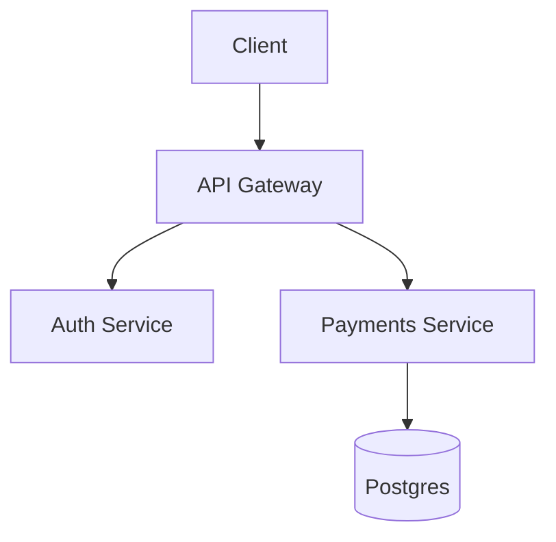

# Repository Style Guide

## File Naming
- Use `snake_case` for new markdown files (e.g. `multi_region_failover.md`).
- Avoid spaces, parentheses, uppercase acronyms unless standard (e.g. `api_design.md`).
- Use consistent suffix `*_guide.md` only for true comprehensive deep dives.

## Front Matter (Required for new guides)
```yaml
---
title: "Microservices Architecture"
slug: microservices_architecture
level: advanced
last_updated: 2025-11-07
tags: [microservices, architecture, scalability]
summary: "Core principles and patterns for designing resilient microservices at scale."
---
```

## Heading Hierarchy
- One H1 per file (`# Title`).
- Start sections with H2 (`##`) and sub-sections with H3 (`###`).
- Blank line before headings and lists.

## Code Blocks
- Always specify language: ```go, ```js, ```bash, ```sql.
- Include only runnable snippets or clearly mark pseudo-code.

## Architecture Diagrams
- Prefer Mermaid inside fenced blocks:


## Patterns Documentation Template
```markdown
## Intent
Explain the problem solved.

## Context
Where it applies (latency-sensitive, high-throughput, consistency-critical).

## Forces & Trade-offs
| Force | Option | Trade-off |
|-------|--------|-----------|

## Reference Architecture
Diagram + component list.

## Failure Modes & Mitigations
Bullet list.

## Evolution
V1 -> V2 -> Scale stage.
```

## System Design Answer Scaffold
```markdown
### 1. Problem Framing
### 2. Functional Requirements
### 3. Non-Functional (SLOs, scale, latency targets)
### 4. Capacity Estimates (QPS, storage, throughput)
### 5. High-Level Architecture
### 6. Detailed Components
### 7. Data Model & Storage Strategy
### 8. Performance & Bottlenecks
### 9. Reliability & Failure Handling
### 10. Trade-off Analysis Table
### 11. Evolution / Roadmap
```

## Glossary
Maintain `_meta/glossary.md` for specialized terms.

## Prohibited
- Duplicated guides under multiple folders.
- Unattributed external verbatim text.
- Files without front matter if > 150 lines.

## Review Checklist (Per PR)
- Front matter present
- Links relative and valid
- No duplicate content hash
- Code examples compile (where applicable)
- Trade-off table included for pattern/architecture docs
