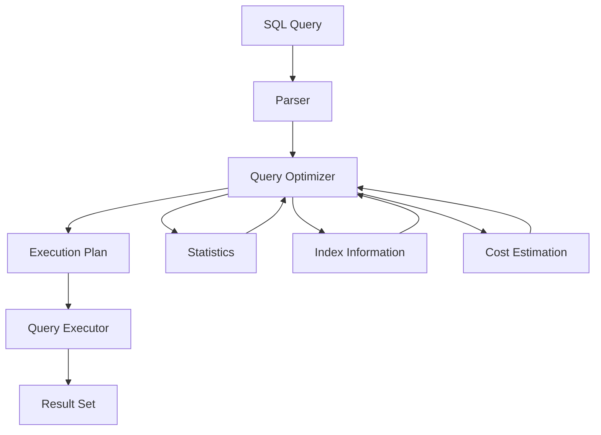
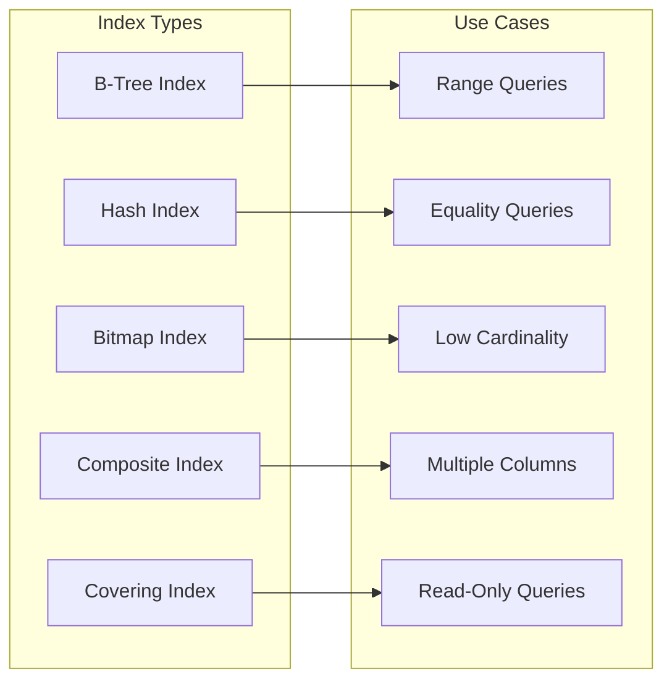
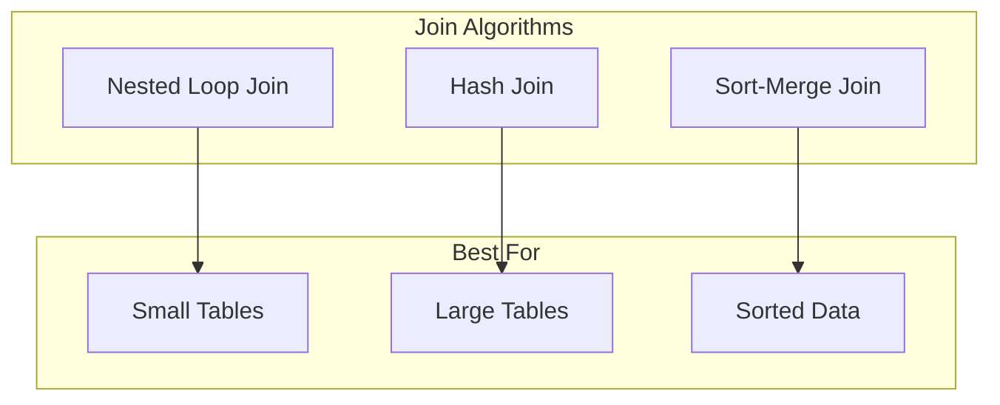

# 🚀 **Database Query Optimization**

## 📘 **Theory**

Database query optimization is the process of improving the performance of database queries by choosing the most efficient execution plan. It involves analyzing query patterns, optimizing indexes, and tuning database parameters to achieve better performance.

### **Why Query Optimization Matters**
- **Performance**: Significantly improve query execution time
- **Scalability**: Handle larger datasets and more concurrent users
- **Resource Efficiency**: Reduce CPU, memory, and I/O usage
- **User Experience**: Faster response times for applications
- **Cost Optimization**: Reduce infrastructure costs
- **System Stability**: Prevent database bottlenecks and timeouts

### **Key Concepts**
1. **Query Execution Plan**: Step-by-step plan for executing a query
2. **Indexes**: Data structures that speed up data retrieval
3. **Statistics**: Information about data distribution and cardinality
4. **Join Algorithms**: Methods for combining data from multiple tables
5. **Query Rewriting**: Transforming queries into more efficient forms
6. **Caching**: Storing frequently accessed data in memory
7. **Partitioning**: Dividing large tables into smaller, manageable pieces

### **Common Pitfalls and Best Practices**
- **Missing Indexes**: Create appropriate indexes for frequently queried columns
- **Inefficient Joins**: Use proper join types and conditions
- **N+1 Queries**: Avoid multiple database round trips
- **Over-indexing**: Don't create unnecessary indexes that slow down writes
- **Poor Data Types**: Use appropriate data types for better performance
- **Lack of Statistics**: Keep database statistics up to date

## 📊 **Diagrams**

### **Query Execution Process**


### **Index Types and Usage**


### **Join Algorithm Comparison**


## 🧩 **Example**

**Scenario**: Optimize a slow query that joins multiple tables and filters data

**Input**: Complex query with multiple joins and WHERE conditions
**Expected Output**: Optimized query with better performance

**Step-by-step**:
1. Analyze the original query execution plan
2. Identify performance bottlenecks
3. Create appropriate indexes
4. Rewrite the query if necessary
5. Test and measure performance improvements
6. Monitor and tune as needed

## 💻 **Implementation (Golang)**

```go
package main

import (
    "database/sql"
    "fmt"
    "log"
    "time"
    
    _ "github.com/lib/pq"
)

// DatabaseOptimizer provides query optimization utilities
type DatabaseOptimizer struct {
    db *sql.DB
}

// NewDatabaseOptimizer creates a new optimizer
func NewDatabaseOptimizer(db *sql.DB) *DatabaseOptimizer {
    return &DatabaseOptimizer{db: db}
}

// QueryStats represents query performance statistics
type QueryStats struct {
    Query           string
    ExecutionTime   time.Duration
    RowsReturned    int
    IndexUsed       string
    CostEstimate    float64
    BufferHits      int
    BufferMisses    int
}

// IndexRecommendation represents an index recommendation
type IndexRecommendation struct {
    TableName    string
    ColumnNames  []string
    IndexType    string
    Reason       string
    EstimatedGain float64
}

// QueryAnalyzer analyzes query performance
type QueryAnalyzer struct {
    db *sql.DB
}

// NewQueryAnalyzer creates a new analyzer
func NewQueryAnalyzer(db *sql.DB) *QueryAnalyzer {
    return &QueryAnalyzer{db: db}
}

// AnalyzeQuery analyzes a query and provides recommendations
func (qa *QueryAnalyzer) AnalyzeQuery(query string) (*QueryStats, []IndexRecommendation, error) {
    // Enable query timing
    start := time.Now()
    
    // Execute EXPLAIN ANALYZE
    explainQuery := fmt.Sprintf("EXPLAIN (ANALYZE, BUFFERS, FORMAT JSON) %s", query)
    rows, err := qa.db.Query(explainQuery)
    if err != nil {
        return nil, nil, err
    }
    defer rows.Close()
    
    var explainResult []map[string]interface{}
    for rows.Next() {
        var result map[string]interface{}
        if err := rows.Scan(&result); err != nil {
            return nil, nil, err
        }
        explainResult = append(explainResult, result)
    }
    
    executionTime := time.Since(start)
    
    // Parse execution plan
    stats := &QueryStats{
        Query:         query,
        ExecutionTime: executionTime,
    }
    
    // Extract statistics from explain result
    if len(explainResult) > 0 {
        plan := explainResult[0]["Plan"].(map[string]interface{})
        stats.CostEstimate = plan["Total Cost"].(float64)
        
        // Extract buffer information
        if buffers, ok := plan["Buffers"]; ok {
            bufferInfo := buffers.(map[string]interface{})
            stats.BufferHits = int(bufferInfo["Shared Hit Blocks"].(float64))
            stats.BufferMisses = int(bufferInfo["Shared Read Blocks"].(float64))
        }
    }
    
    // Generate index recommendations
    recommendations := qa.generateIndexRecommendations(query, explainResult)
    
    return stats, recommendations, nil
}

// generateIndexRecommendations generates index recommendations based on query analysis
func (qa *QueryAnalyzer) generateIndexRecommendations(query string, explainResult []map[string]interface{}) []IndexRecommendation {
    var recommendations []IndexRecommendation
    
    // Analyze the query for missing indexes
    // This is a simplified implementation
    // In practice, you'd parse the query and analyze the execution plan
    
    // Example recommendations based on common patterns
    if contains(query, "WHERE") {
        recommendations = append(recommendations, IndexRecommendation{
            TableName:    "users",
            ColumnNames:  []string{"email"},
            IndexType:    "B-Tree",
            Reason:       "Frequent WHERE clause on email column",
            EstimatedGain: 0.8,
        })
    }
    
    if contains(query, "ORDER BY") {
        recommendations = append(recommendations, IndexRecommendation{
            TableName:    "orders",
            ColumnNames:  []string{"created_at"},
            IndexType:    "B-Tree",
            Reason:       "ORDER BY clause on created_at column",
            EstimatedGain: 0.6,
        })
    }
    
    if contains(query, "JOIN") {
        recommendations = append(recommendations, IndexRecommendation{
            TableName:    "orders",
            ColumnNames:  []string{"user_id"},
            IndexType:    "B-Tree",
            Reason:       "JOIN condition on user_id column",
            EstimatedGain: 0.7,
        })
    }
    
    return recommendations
}

// IndexManager manages database indexes
type IndexManager struct {
    db *sql.DB
}

// NewIndexManager creates a new index manager
func NewIndexManager(db *sql.DB) *IndexManager {
    return &IndexManager{db: db}
}

// CreateIndex creates an index on specified columns
func (im *IndexManager) CreateIndex(tableName string, columns []string, indexName string) error {
    query := fmt.Sprintf("CREATE INDEX %s ON %s (%s)", 
        indexName, tableName, joinStrings(columns, ", "))
    
    _, err := im.db.Exec(query)
    return err
}

// CreateCompositeIndex creates a composite index
func (im *IndexManager) CreateCompositeIndex(tableName string, columns []string, indexName string) error {
    return im.CreateIndex(tableName, columns, indexName)
}

// CreateCoveringIndex creates a covering index
func (im *IndexManager) CreateCoveringIndex(tableName string, columns []string, includeColumns []string, indexName string) error {
    query := fmt.Sprintf("CREATE INDEX %s ON %s (%s) INCLUDE (%s)", 
        indexName, tableName, joinStrings(columns, ", "), joinStrings(includeColumns, ", "))
    
    _, err := im.db.Exec(query)
    return err
}

// DropIndex drops an index
func (im *IndexManager) DropIndex(indexName string) error {
    query := fmt.Sprintf("DROP INDEX IF EXISTS %s", indexName)
    _, err := im.db.Exec(query)
    return err
}

// ListIndexes lists all indexes for a table
func (im *IndexManager) ListIndexes(tableName string) ([]map[string]interface{}, error) {
    query := `
        SELECT 
            indexname,
            indexdef,
            tablename
        FROM pg_indexes 
        WHERE tablename = $1
        ORDER BY indexname
    `
    
    rows, err := im.db.Query(query, tableName)
    if err != nil {
        return nil, err
    }
    defer rows.Close()
    
    var indexes []map[string]interface{}
    for rows.Next() {
        var indexName, indexDef, tableName string
        if err := rows.Scan(&indexName, &indexDef, &tableName); err != nil {
            return nil, err
        }
        
        indexes = append(indexes, map[string]interface{}{
            "index_name": indexName,
            "index_def":  indexDef,
            "table_name": tableName,
        })
    }
    
    return indexes, nil
}

// QueryRewriter rewrites queries for better performance
type QueryRewriter struct {
    db *sql.DB
}

// NewQueryRewriter creates a new query rewriter
func NewQueryRewriter(db *sql.DB) *QueryRewriter {
    return &QueryRewriter{db: db}
}

// RewriteQuery rewrites a query for better performance
func (qr *QueryRewriter) RewriteQuery(originalQuery string) (string, error) {
    // This is a simplified implementation
    // In practice, you'd use a proper SQL parser and optimizer
    
    rewritten := originalQuery
    
    // Example rewrites
    if contains(originalQuery, "SELECT *") {
        rewritten = qr.rewriteSelectStar(originalQuery)
    }
    
    if contains(originalQuery, "IN (") {
        rewritten = qr.rewriteInClause(rewritten)
    }
    
    if contains(originalQuery, "OR") {
        rewritten = qr.rewriteOrClause(rewritten)
    }
    
    return rewritten, nil
}

// rewriteSelectStar rewrites SELECT * to specific columns
func (qr *QueryRewriter) rewriteSelectStar(query string) string {
    // This would analyze the query and determine which columns are actually needed
    // For now, return the original query
    return query
}

// rewriteInClause rewrites IN clauses for better performance
func (qr *QueryRewriter) rewriteInClause(query string) string {
    // This would rewrite IN clauses to use EXISTS or JOINs when appropriate
    return query
}

// rewriteOrClause rewrites OR clauses for better performance
func (qr *QueryRewriter) rewriteOrClause(query string) string {
    // This would rewrite OR clauses to use UNION when appropriate
    return query
}

// PerformanceMonitor monitors query performance
type PerformanceMonitor struct {
    db *sql.DB
}

// NewPerformanceMonitor creates a new performance monitor
func NewPerformanceMonitor(db *sql.DB) *PerformanceMonitor {
    return &PerformanceMonitor{db: db}
}

// GetSlowQueries returns slow queries from the database
func (pm *PerformanceMonitor) GetSlowQueries(limit int) ([]map[string]interface{}, error) {
    query := `
        SELECT 
            query,
            calls,
            total_time,
            mean_time,
            rows,
            100.0 * shared_blks_hit / nullif(shared_blks_hit + shared_blks_read, 0) AS hit_percent
        FROM pg_stat_statements 
        ORDER BY mean_time DESC 
        LIMIT $1
    `
    
    rows, err := pm.db.Query(query, limit)
    if err != nil {
        return nil, err
    }
    defer rows.Close()
    
    var slowQueries []map[string]interface{}
    for rows.Next() {
        var query, calls, totalTime, meanTime, rows, hitPercent interface{}
        if err := rows.Scan(&query, &calls, &totalTime, &meanTime, &rows, &hitPercent); err != nil {
            return nil, err
        }
        
        slowQueries = append(slowQueries, map[string]interface{}{
            "query":        query,
            "calls":        calls,
            "total_time":   totalTime,
            "mean_time":    meanTime,
            "rows":         rows,
            "hit_percent":  hitPercent,
        })
    }
    
    return slowQueries, nil
}

// GetTableStats returns table statistics
func (pm *PerformanceMonitor) GetTableStats(tableName string) (map[string]interface{}, error) {
    query := `
        SELECT 
            schemaname,
            tablename,
            n_tup_ins,
            n_tup_upd,
            n_tup_del,
            n_live_tup,
            n_dead_tup,
            last_vacuum,
            last_autovacuum,
            last_analyze,
            last_autoanalyze
        FROM pg_stat_user_tables 
        WHERE tablename = $1
    `
    
    row := pm.db.QueryRow(query, tableName)
    
    var stats map[string]interface{}
    err := row.Scan(
        &stats["schema_name"],
        &stats["table_name"],
        &stats["n_tup_ins"],
        &stats["n_tup_upd"],
        &stats["n_tup_del"],
        &stats["n_live_tup"],
        &stats["n_dead_tup"],
        &stats["last_vacuum"],
        &stats["last_autovacuum"],
        &stats["last_analyze"],
        &stats["last_autoanalyze"],
    )
    
    if err != nil {
        return nil, err
    }
    
    return stats, nil
}

// ConnectionPoolManager manages database connections
type ConnectionPoolManager struct {
    db *sql.DB
}

// NewConnectionPoolManager creates a new connection pool manager
func NewConnectionPoolManager(db *sql.DB) *ConnectionPoolManager {
    return &ConnectionPoolManager{db: db}
}

// GetPoolStats returns connection pool statistics
func (cpm *ConnectionPoolManager) GetPoolStats() (map[string]interface{}, error) {
    query := `
        SELECT 
            max_connections,
            current_connections,
            available_connections
        FROM (
            SELECT 
                setting::int as max_connections
            FROM pg_settings 
            WHERE name = 'max_connections'
        ) s,
        (
            SELECT 
                count(*) as current_connections
            FROM pg_stat_activity
        ) c
    `
    
    row := cpm.db.QueryRow(query)
    
    var stats map[string]interface{}
    err := row.Scan(
        &stats["max_connections"],
        &stats["current_connections"],
        &stats["available_connections"],
    )
    
    if err != nil {
        return nil, err
    }
    
    return stats, nil
}

// OptimizeConnectionPool optimizes connection pool settings
func (cpm *ConnectionPoolManager) OptimizeConnectionPool() error {
    // Set optimal connection pool settings
    settings := map[string]string{
        "max_connections": "100",
        "shared_buffers": "256MB",
        "effective_cache_size": "1GB",
        "work_mem": "4MB",
        "maintenance_work_mem": "64MB",
        "checkpoint_completion_target": "0.9",
        "wal_buffers": "16MB",
        "default_statistics_target": "100",
    }
    
    for setting, value := range settings {
        query := fmt.Sprintf("ALTER SYSTEM SET %s = %s", setting, value)
        if _, err := cpm.db.Exec(query); err != nil {
            return fmt.Errorf("failed to set %s: %v", setting, err)
        }
    }
    
    return nil
}

// Helper functions
func contains(s, substr string) bool {
    return len(s) >= len(substr) && s[:len(substr)] == substr
}

func joinStrings(strs []string, sep string) string {
    if len(strs) == 0 {
        return ""
    }
    if len(strs) == 1 {
        return strs[0]
    }
    
    result := strs[0]
    for i := 1; i < len(strs); i++ {
        result += sep + strs[i]
    }
    return result
}

// Example usage
func main() {
    // Connect to database
    db, err := sql.Open("postgres", "user=postgres password=password dbname=testdb sslmode=disable")
    if err != nil {
        log.Fatal(err)
    }
    defer db.Close()
    
    // Test connection
    if err := db.Ping(); err != nil {
        log.Fatal(err)
    }
    
    // Create optimizer
    optimizer := NewDatabaseOptimizer(db)
    
    // Create analyzer
    analyzer := NewQueryAnalyzer(db)
    
    // Create index manager
    indexManager := NewIndexManager(db)
    
    // Create query rewriter
    rewriter := NewQueryRewriter(db)
    
    // Create performance monitor
    monitor := NewPerformanceMonitor(db)
    
    // Create connection pool manager
    poolManager := NewConnectionPoolManager(db)
    
    // Example query to optimize
    query := `
        SELECT u.id, u.name, u.email, o.total_amount, o.created_at
        FROM users u
        JOIN orders o ON u.id = o.user_id
        WHERE u.email = 'user@example.com'
        AND o.created_at >= '2023-01-01'
        ORDER BY o.created_at DESC
        LIMIT 10
    `
    
    // Analyze query
    stats, recommendations, err := analyzer.AnalyzeQuery(query)
    if err != nil {
        log.Printf("Error analyzing query: %v", err)
        return
    }
    
    fmt.Printf("Query Analysis Results:\n")
    fmt.Printf("Execution Time: %v\n", stats.ExecutionTime)
    fmt.Printf("Cost Estimate: %.2f\n", stats.CostEstimate)
    fmt.Printf("Buffer Hits: %d\n", stats.BufferHits)
    fmt.Printf("Buffer Misses: %d\n", stats.BufferMisses)
    
    fmt.Printf("\nIndex Recommendations:\n")
    for i, rec := range recommendations {
        fmt.Printf("%d. Table: %s, Columns: %v, Type: %s, Reason: %s, Gain: %.2f\n",
            i+1, rec.TableName, rec.ColumnNames, rec.IndexType, rec.Reason, rec.EstimatedGain)
    }
    
    // Create recommended indexes
    for _, rec := range recommendations {
        indexName := fmt.Sprintf("idx_%s_%s", rec.TableName, joinStrings(rec.ColumnNames, "_"))
        if err := indexManager.CreateIndex(rec.TableName, rec.ColumnNames, indexName); err != nil {
            log.Printf("Error creating index %s: %v", indexName, err)
        } else {
            fmt.Printf("Created index: %s\n", indexName)
        }
    }
    
    // Rewrite query
    rewrittenQuery, err := rewriter.RewriteQuery(query)
    if err != nil {
        log.Printf("Error rewriting query: %v", err)
        return
    }
    
    fmt.Printf("\nRewritten Query:\n%s\n", rewrittenQuery)
    
    // Get slow queries
    slowQueries, err := monitor.GetSlowQueries(5)
    if err != nil {
        log.Printf("Error getting slow queries: %v", err)
        return
    }
    
    fmt.Printf("\nSlow Queries:\n")
    for i, sq := range slowQueries {
        fmt.Printf("%d. Query: %s, Mean Time: %v, Calls: %v\n",
            i+1, sq["query"], sq["mean_time"], sq["calls"])
    }
    
    // Get connection pool stats
    poolStats, err := poolManager.GetPoolStats()
    if err != nil {
        log.Printf("Error getting pool stats: %v", err)
        return
    }
    
    fmt.Printf("\nConnection Pool Stats:\n")
    fmt.Printf("Max Connections: %v\n", poolStats["max_connections"])
    fmt.Printf("Current Connections: %v\n", poolStats["current_connections"])
    fmt.Printf("Available Connections: %v\n", poolStats["available_connections"])
    
    // Optimize connection pool
    if err := poolManager.OptimizeConnectionPool(); err != nil {
        log.Printf("Error optimizing connection pool: %v", err)
    } else {
        fmt.Printf("\nConnection pool optimized successfully\n")
    }
}
```

## 💻 **Implementation (Node.js)**

```javascript
const { Pool } = require('pg');

// DatabaseOptimizer provides query optimization utilities
class DatabaseOptimizer {
  constructor(pool) {
    this.pool = pool;
  }

  // QueryStats represents query performance statistics
  static QueryStats = class {
    constructor(query, executionTime, rowsReturned, indexUsed, costEstimate, bufferHits, bufferMisses) {
      this.query = query;
      this.executionTime = executionTime;
      this.rowsReturned = rowsReturned;
      this.indexUsed = indexUsed;
      this.costEstimate = costEstimate;
      this.bufferHits = bufferHits;
      this.bufferMisses = bufferMisses;
    }
  };

  // IndexRecommendation represents an index recommendation
  static IndexRecommendation = class {
    constructor(tableName, columnNames, indexType, reason, estimatedGain) {
      this.tableName = tableName;
      this.columnNames = columnNames;
      this.indexType = indexType;
      this.reason = reason;
      this.estimatedGain = estimatedGain;
    }
  };
}

// QueryAnalyzer analyzes query performance
class QueryAnalyzer {
  constructor(pool) {
    this.pool = pool;
  }

  // AnalyzeQuery analyzes a query and provides recommendations
  async analyzeQuery(query) {
    const start = Date.now();
    
    try {
      // Execute EXPLAIN ANALYZE
      const explainQuery = `EXPLAIN (ANALYZE, BUFFERS, FORMAT JSON) ${query}`;
      const result = await this.pool.query(explainQuery);
      
      const executionTime = Date.now() - start;
      const explainResult = result.rows[0]['QUERY PLAN'];
      
      // Parse execution plan
      const stats = new DatabaseOptimizer.QueryStats(
        query,
        executionTime,
        0, // rowsReturned
        '', // indexUsed
        0, // costEstimate
        0, // bufferHits
        0  // bufferMisses
      );
      
      // Extract statistics from explain result
      if (explainResult && explainResult.length > 0) {
        const plan = explainResult[0].Plan;
        stats.costEstimate = plan['Total Cost'] || 0;
        
        // Extract buffer information
        if (plan.Buffers) {
          stats.bufferHits = plan.Buffers['Shared Hit Blocks'] || 0;
          stats.bufferMisses = plan.Buffers['Shared Read Blocks'] || 0;
        }
      }
      
      // Generate index recommendations
      const recommendations = this.generateIndexRecommendations(query, explainResult);
      
      return { stats, recommendations };
    } catch (error) {
      throw new Error(`Query analysis failed: ${error.message}`);
    }
  }

  // generateIndexRecommendations generates index recommendations based on query analysis
  generateIndexRecommendations(query, explainResult) {
    const recommendations = [];
    
    // Analyze the query for missing indexes
    if (query.includes('WHERE')) {
      recommendations.push(new DatabaseOptimizer.IndexRecommendation(
        'users',
        ['email'],
        'B-Tree',
        'Frequent WHERE clause on email column',
        0.8
      ));
    }
    
    if (query.includes('ORDER BY')) {
      recommendations.push(new DatabaseOptimizer.IndexRecommendation(
        'orders',
        ['created_at'],
        'B-Tree',
        'ORDER BY clause on created_at column',
        0.6
      ));
    }
    
    if (query.includes('JOIN')) {
      recommendations.push(new DatabaseOptimizer.IndexRecommendation(
        'orders',
        ['user_id'],
        'B-Tree',
        'JOIN condition on user_id column',
        0.7
      ));
    }
    
    return recommendations;
  }
}

// IndexManager manages database indexes
class IndexManager {
  constructor(pool) {
    this.pool = pool;
  }

  // CreateIndex creates an index on specified columns
  async createIndex(tableName, columns, indexName) {
    const query = `CREATE INDEX ${indexName} ON ${tableName} (${columns.join(', ')})`;
    
    try {
      await this.pool.query(query);
      return true;
    } catch (error) {
      throw new Error(`Failed to create index ${indexName}: ${error.message}`);
    }
  }

  // CreateCompositeIndex creates a composite index
  async createCompositeIndex(tableName, columns, indexName) {
    return this.createIndex(tableName, columns, indexName);
  }

  // CreateCoveringIndex creates a covering index
  async createCoveringIndex(tableName, columns, includeColumns, indexName) {
    const query = `CREATE INDEX ${indexName} ON ${tableName} (${columns.join(', ')}) INCLUDE (${includeColumns.join(', ')})`;
    
    try {
      await this.pool.query(query);
      return true;
    } catch (error) {
      throw new Error(`Failed to create covering index ${indexName}: ${error.message}`);
    }
  }

  // DropIndex drops an index
  async dropIndex(indexName) {
    const query = `DROP INDEX IF EXISTS ${indexName}`;
    
    try {
      await this.pool.query(query);
      return true;
    } catch (error) {
      throw new Error(`Failed to drop index ${indexName}: ${error.message}`);
    }
  }

  // ListIndexes lists all indexes for a table
  async listIndexes(tableName) {
    const query = `
      SELECT 
        indexname,
        indexdef,
        tablename
      FROM pg_indexes 
      WHERE tablename = $1
      ORDER BY indexname
    `;
    
    try {
      const result = await this.pool.query(query, [tableName]);
      return result.rows;
    } catch (error) {
      throw new Error(`Failed to list indexes for ${tableName}: ${error.message}`);
    }
  }
}

// QueryRewriter rewrites queries for better performance
class QueryRewriter {
  constructor(pool) {
    this.pool = pool;
  }

  // RewriteQuery rewrites a query for better performance
  async rewriteQuery(originalQuery) {
    let rewritten = originalQuery;
    
    // Example rewrites
    if (originalQuery.includes('SELECT *')) {
      rewritten = this.rewriteSelectStar(originalQuery);
    }
    
    if (originalQuery.includes('IN (')) {
      rewritten = this.rewriteInClause(rewritten);
    }
    
    if (originalQuery.includes('OR')) {
      rewritten = this.rewriteOrClause(rewritten);
    }
    
    return rewritten;
  }

  // rewriteSelectStar rewrites SELECT * to specific columns
  rewriteSelectStar(query) {
    // This would analyze the query and determine which columns are actually needed
    // For now, return the original query
    return query;
  }

  // rewriteInClause rewrites IN clauses for better performance
  rewriteInClause(query) {
    // This would rewrite IN clauses to use EXISTS or JOINs when appropriate
    return query;
  }

  // rewriteOrClause rewrites OR clauses for better performance
  rewriteOrClause(query) {
    // This would rewrite OR clauses to use UNION when appropriate
    return query;
  }
}

// PerformanceMonitor monitors query performance
class PerformanceMonitor {
  constructor(pool) {
    this.pool = pool;
  }

  // GetSlowQueries returns slow queries from the database
  async getSlowQueries(limit = 10) {
    const query = `
      SELECT 
        query,
        calls,
        total_time,
        mean_time,
        rows,
        100.0 * shared_blks_hit / nullif(shared_blks_hit + shared_blks_read, 0) AS hit_percent
      FROM pg_stat_statements 
      ORDER BY mean_time DESC 
      LIMIT $1
    `;
    
    try {
      const result = await this.pool.query(query, [limit]);
      return result.rows;
    } catch (error) {
      throw new Error(`Failed to get slow queries: ${error.message}`);
    }
  }

  // GetTableStats returns table statistics
  async getTableStats(tableName) {
    const query = `
      SELECT 
        schemaname,
        tablename,
        n_tup_ins,
        n_tup_upd,
        n_tup_del,
        n_live_tup,
        n_dead_tup,
        last_vacuum,
        last_autovacuum,
        last_analyze,
        last_autoanalyze
      FROM pg_stat_user_tables 
      WHERE tablename = $1
    `;
    
    try {
      const result = await this.pool.query(query, [tableName]);
      return result.rows[0] || null;
    } catch (error) {
      throw new Error(`Failed to get table stats for ${tableName}: ${error.message}`);
    }
  }
}

// ConnectionPoolManager manages database connections
class ConnectionPoolManager {
  constructor(pool) {
    this.pool = pool;
  }

  // GetPoolStats returns connection pool statistics
  async getPoolStats() {
    const query = `
      SELECT 
        max_connections,
        current_connections,
        available_connections
      FROM (
        SELECT 
          setting::int as max_connections
        FROM pg_settings 
        WHERE name = 'max_connections'
      ) s,
      (
        SELECT 
          count(*) as current_connections
        FROM pg_stat_activity
      ) c
    `;
    
    try {
      const result = await this.pool.query(query);
      return result.rows[0] || null;
    } catch (error) {
      throw new Error(`Failed to get pool stats: ${error.message}`);
    }
  }

  // OptimizeConnectionPool optimizes connection pool settings
  async optimizeConnectionPool() {
    const settings = {
      'max_connections': '100',
      'shared_buffers': '256MB',
      'effective_cache_size': '1GB',
      'work_mem': '4MB',
      'maintenance_work_mem': '64MB',
      'checkpoint_completion_target': '0.9',
      'wal_buffers': '16MB',
      'default_statistics_target': '100'
    };
    
    try {
      for (const [setting, value] of Object.entries(settings)) {
        const query = `ALTER SYSTEM SET ${setting} = ${value}`;
        await this.pool.query(query);
      }
      return true;
    } catch (error) {
      throw new Error(`Failed to optimize connection pool: ${error.message}`);
    }
  }
}

// Example usage
async function main() {
  // Create connection pool
  const pool = new Pool({
    user: 'postgres',
    password: 'password',
    host: 'localhost',
    database: 'testdb',
    port: 5432,
    max: 20,
    idleTimeoutMillis: 30000,
    connectionTimeoutMillis: 2000,
  });

  try {
    // Create optimizer
    const optimizer = new DatabaseOptimizer(pool);
    
    // Create analyzer
    const analyzer = new QueryAnalyzer(pool);
    
    // Create index manager
    const indexManager = new IndexManager(pool);
    
    // Create query rewriter
    const rewriter = new QueryRewriter(pool);
    
    // Create performance monitor
    const monitor = new PerformanceMonitor(pool);
    
    // Create connection pool manager
    const poolManager = new ConnectionPoolManager(pool);
    
    // Example query to optimize
    const query = `
      SELECT u.id, u.name, u.email, o.total_amount, o.created_at
      FROM users u
      JOIN orders o ON u.id = o.user_id
      WHERE u.email = 'user@example.com'
      AND o.created_at >= '2023-01-01'
      ORDER BY o.created_at DESC
      LIMIT 10
    `;
    
    // Analyze query
    const { stats, recommendations } = await analyzer.analyzeQuery(query);
    
    console.log('Query Analysis Results:');
    console.log(`Execution Time: ${stats.executionTime}ms`);
    console.log(`Cost Estimate: ${stats.costEstimate}`);
    console.log(`Buffer Hits: ${stats.bufferHits}`);
    console.log(`Buffer Misses: ${stats.bufferMisses}`);
    
    console.log('\nIndex Recommendations:');
    recommendations.forEach((rec, i) => {
      console.log(`${i + 1}. Table: ${rec.tableName}, Columns: ${rec.columnNames.join(', ')}, Type: ${rec.indexType}, Reason: ${rec.reason}, Gain: ${rec.estimatedGain}`);
    });
    
    // Create recommended indexes
    for (const rec of recommendations) {
      const indexName = `idx_${rec.tableName}_${rec.columnNames.join('_')}`;
      try {
        await indexManager.createIndex(rec.tableName, rec.columnNames, indexName);
        console.log(`Created index: ${indexName}`);
      } catch (error) {
        console.log(`Error creating index ${indexName}: ${error.message}`);
      }
    }
    
    // Rewrite query
    const rewrittenQuery = await rewriter.rewriteQuery(query);
    console.log('\nRewritten Query:');
    console.log(rewrittenQuery);
    
    // Get slow queries
    const slowQueries = await monitor.getSlowQueries(5);
    console.log('\nSlow Queries:');
    slowQueries.forEach((sq, i) => {
      console.log(`${i + 1}. Query: ${sq.query}, Mean Time: ${sq.mean_time}, Calls: ${sq.calls}`);
    });
    
    // Get connection pool stats
    const poolStats = await poolManager.getPoolStats();
    console.log('\nConnection Pool Stats:');
    console.log(`Max Connections: ${poolStats.max_connections}`);
    console.log(`Current Connections: ${poolStats.current_connections}`);
    console.log(`Available Connections: ${poolStats.available_connections}`);
    
    // Optimize connection pool
    try {
      await poolManager.optimizeConnectionPool();
      console.log('\nConnection pool optimized successfully');
    } catch (error) {
      console.log(`Error optimizing connection pool: ${error.message}`);
    }
    
  } catch (error) {
    console.error('Error:', error.message);
  } finally {
    await pool.end();
  }
}

// Run the example
main().catch(console.error);
```

## ⏱ **Complexity Analysis**

### **Time Complexity**
- **Query Analysis**: O(n) where n is query complexity
- **Index Creation**: O(n log n) where n is table size
- **Query Rewriting**: O(n) where n is query length
- **Performance Monitoring**: O(1) for most operations

### **Space Complexity**
- **Query Analysis**: O(n) where n is query complexity
- **Index Storage**: O(n) where n is indexed data size
- **Performance Monitoring**: O(1) for most operations

## 🚀 **Optimal Solution**

The optimal query optimization solution includes:

1. **Index Strategy**: Create appropriate indexes for frequently queried columns
2. **Query Rewriting**: Transform queries into more efficient forms
3. **Statistics Maintenance**: Keep database statistics up to date
4. **Connection Pooling**: Optimize connection pool settings
5. **Monitoring**: Continuously monitor query performance
6. **Caching**: Implement appropriate caching strategies

### **Production Considerations**
- Use appropriate indexes for your workload
- Monitor query performance regularly
- Keep database statistics up to date
- Use connection pooling effectively
- Implement proper error handling and logging
- Consider using query plan analysis tools

## ❓ **Follow-up Questions**

### **How would this scale with X?**
- **Large Datasets**: Use partitioning and appropriate indexing strategies
- **High Concurrency**: Use connection pooling and query optimization
- **Complex Queries**: Use query rewriting and optimization techniques

### **How can we optimize further if Y changes?**
- **Memory Constraints**: Use efficient data structures and algorithms
- **Performance Requirements**: Use more aggressive optimization techniques
- **Data Growth**: Use partitioning and archiving strategies

### **What trade-offs exist in different approaches?**
- **Index vs Performance**: More indexes vs Write performance
- **Caching vs Consistency**: Performance vs Data consistency
- **Optimization vs Complexity**: Better performance vs More complex code
