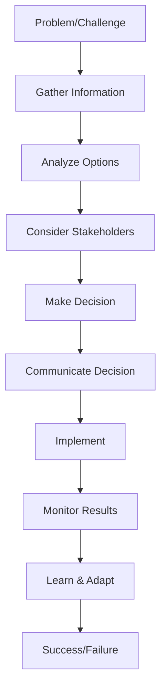
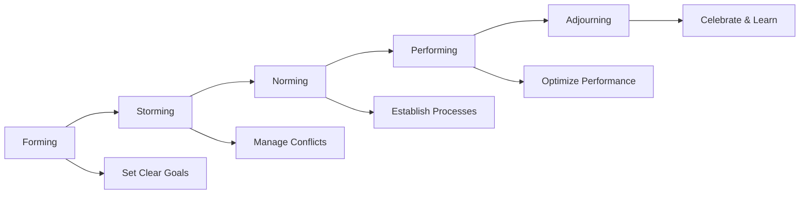
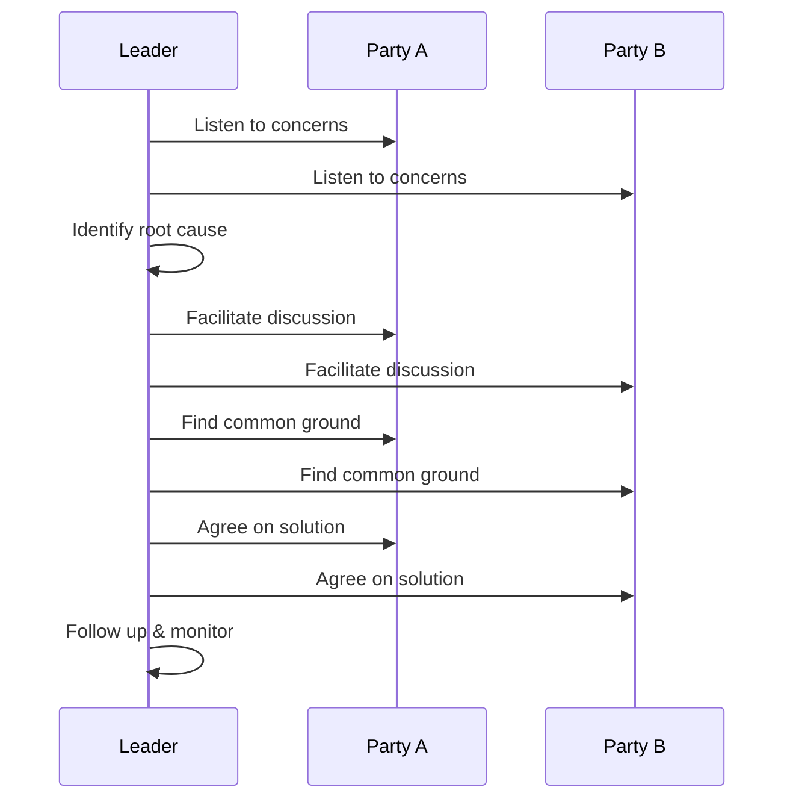

# 👥 **Leadership Scenarios**

## 📘 **Theory**

Leadership scenarios in behavioral interviews assess your ability to lead teams, make difficult decisions, handle conflicts, and drive results. These questions evaluate your leadership style, decision-making process, and ability to influence others without authority.

### **Why Leadership Scenarios Matter**

- **Team Management**: Demonstrates ability to lead and motivate teams
- **Decision Making**: Shows critical thinking and judgment under pressure
- **Conflict Resolution**: Evaluates interpersonal skills and diplomacy
- **Results Orientation**: Proves ability to deliver outcomes
- **Influence**: Tests ability to lead without formal authority
- **Crisis Management**: Assesses handling of difficult situations

### **Key Leadership Competencies**

1. **Vision and Strategy**: Setting direction and inspiring others
2. **Team Building**: Recruiting, developing, and retaining talent
3. **Communication**: Clear, persuasive, and empathetic communication
4. **Decision Making**: Data-driven, timely, and transparent decisions
5. **Conflict Resolution**: Managing disagreements and building consensus
6. **Change Management**: Leading through organizational change
7. **Results Delivery**: Achieving goals and driving performance

### **Common Pitfalls and Best Practices**

- **Being Too Vague**: Provide specific examples with concrete details
- **Taking All Credit**: Acknowledge team contributions and failures
- **Avoiding Difficult Topics**: Address challenges and failures honestly
- **Lack of Self-Awareness**: Show understanding of your leadership style
- **No Learning**: Demonstrate growth and lessons learned
- **Poor Structure**: Use STAR method for clear storytelling

## 📊 **Diagrams**

### **Leadership Decision Framework**



### **Team Development Cycle**



### **Conflict Resolution Process**



## 🧩 **Example**

**Scenario**: You're leading a team of 8 engineers on a critical project with a tight deadline. Two senior engineers have a fundamental disagreement about the technical approach, and the conflict is affecting team morale and productivity.

**Input**: Conflicting technical approaches, tight deadline, team morale issues
**Expected Output**: Resolution that maintains team cohesion and delivers results

**Step-by-step**:

1. Acknowledge the conflict and its impact
2. Meet with each engineer individually to understand their perspectives
3. Facilitate a technical discussion with both engineers
4. Make a data-driven decision on the approach
5. Communicate the decision and rationale to the team
6. Implement the chosen approach with full team support
7. Monitor progress and team dynamics
8. Learn from the experience for future conflicts

## 💻 **Implementation (Golang)**

```go
package main

import (
    "fmt"
    "time"
)

// Leadership scenario structures
type TeamMember struct {
    ID          string
    Name        string
    Role        string
    Experience  int
    Performance float64
    Morale      int
}

type Project struct {
    ID          string
    Name        string
    Deadline    time.Time
    Priority    string
    Status      string
    Progress    float64
}

type Conflict struct {
    ID          string
    Type        string
    Severity    int
    Parties     []string
    Description string
    Status      string
}

type Decision struct {
    ID          string
    Context     string
    Options     []string
    Chosen      string
    Rationale   string
    Impact      string
    Lessons     []string
}

// Leadership framework
type LeadershipFramework struct {
    TeamMembers map[string]*TeamMember
    Projects    map[string]*Project
    Conflicts   map[string]*Conflict
    Decisions   []*Decision
}

func NewLeadershipFramework() *LeadershipFramework {
    return &LeadershipFramework{
        TeamMembers: make(map[string]*TeamMember),
        Projects:    make(map[string]*Project),
        Conflicts:   make(map[string]*Conflict),
        Decisions:   make([]*Decision, 0),
    }
}

// Add team member
func (lf *LeadershipFramework) AddTeamMember(member *TeamMember) {
    lf.TeamMembers[member.ID] = member
    fmt.Printf("Added team member: %s (%s)\n", member.Name, member.Role)
}

// Add project
func (lf *LeadershipFramework) AddProject(project *Project) {
    lf.Projects[project.ID] = project
    fmt.Printf("Added project: %s (Deadline: %s)\n", project.Name, project.Deadline.Format("2006-01-02"))
}

// Identify conflict
func (lf *LeadershipFramework) IdentifyConflict(conflict *Conflict) {
    lf.Conflicts[conflict.ID] = conflict
    fmt.Printf("Identified conflict: %s (Severity: %d/10)\n", conflict.Description, conflict.Severity)
}

// Resolve conflict using collaborative approach
func (lf *LeadershipFramework) ResolveConflict(conflictID string) *Decision {
    conflict, exists := lf.Conflicts[conflictID]
    if !exists {
        return nil
    }

    fmt.Printf("\n=== Resolving Conflict: %s ===\n", conflict.Description)

    // Step 1: Gather information from all parties
    fmt.Println("1. Gathering information from all parties...")
    for _, partyID := range conflict.Parties {
        member := lf.TeamMembers[partyID]
        fmt.Printf("   - %s: Understanding their perspective and concerns\n", member.Name)
    }

    // Step 2: Analyze the situation
    fmt.Println("2. Analyzing the situation...")
    fmt.Println("   - Identifying root causes of the conflict")
    fmt.Println("   - Assessing impact on team and project")
    fmt.Println("   - Evaluating available options")

    // Step 3: Facilitate discussion
    fmt.Println("3. Facilitating discussion between parties...")
    fmt.Println("   - Creating safe space for open dialogue")
    fmt.Println("   - Encouraging active listening")
    fmt.Println("   - Finding common ground")

    // Step 4: Make decision
    fmt.Println("4. Making data-driven decision...")
    decision := &Decision{
        ID:      fmt.Sprintf("decision_%d", len(lf.Decisions)+1),
        Context: conflict.Description,
        Options: []string{"Option A", "Option B", "Compromise Solution"},
        Chosen:  "Compromise Solution",
        Rationale: "Balances technical requirements with team consensus",
        Impact:  "Maintains team cohesion while meeting project goals",
        Lessons: []string{
            "Early conflict identification prevents escalation",
            "Inclusive decision-making improves buy-in",
            "Clear communication reduces misunderstandings",
        },
    }

    lf.Decisions = append(lf.Decisions, decision)
    conflict.Status = "Resolved"

    // Step 5: Communicate decision
    fmt.Println("5. Communicating decision to team...")
    fmt.Printf("   - Decision: %s\n", decision.Chosen)
    fmt.Printf("   - Rationale: %s\n", decision.Rationale)
    fmt.Println("   - Ensuring all team members understand the decision")

    // Step 6: Implement and monitor
    fmt.Println("6. Implementing solution and monitoring progress...")
    fmt.Println("   - Assigning clear responsibilities")
    fmt.Println("   - Setting up regular check-ins")
    fmt.Println("   - Monitoring team morale and performance")

    return decision
}

// Handle team performance issues
func (lf *LeadershipFramework) HandlePerformanceIssue(memberID string, issue string) {
    member := lf.TeamMembers[memberID]
    if member == nil {
        return
    }

    fmt.Printf("\n=== Handling Performance Issue: %s ===\n", member.Name)

    // Step 1: Private conversation
    fmt.Println("1. Having private conversation with team member...")
    fmt.Printf("   - Discussing specific performance concerns\n")
    fmt.Printf("   - Understanding their perspective and challenges\n")
    fmt.Printf("   - Identifying root causes\n")

    // Step 2: Provide support
    fmt.Println("2. Providing support and resources...")
    fmt.Println("   - Offering additional training or mentoring")
    fmt.Println("   - Adjusting workload or responsibilities")
    fmt.Println("   - Setting clear expectations and goals")

    // Step 3: Create improvement plan
    fmt.Println("3. Creating improvement plan...")
    fmt.Println("   - Setting specific, measurable goals")
    fmt.Println("   - Establishing regular check-ins")
    fmt.Println("   - Defining success criteria")

    // Step 4: Monitor progress
    fmt.Println("4. Monitoring progress...")
    fmt.Println("   - Regular one-on-one meetings")
    fmt.Println("   - Providing feedback and guidance")
    fmt.Println("   - Adjusting plan as needed")

    // Update member performance
    member.Performance += 0.1
    member.Morale += 1
    fmt.Printf("   - Performance improved to %.1f\n", member.Performance)
    fmt.Printf("   - Morale improved to %d\n", member.Morale)
}

// Lead through change
func (lf *LeadershipFramework) LeadThroughChange(changeDescription string) {
    fmt.Printf("\n=== Leading Through Change: %s ===\n", changeDescription)

    // Step 1: Communicate vision
    fmt.Println("1. Communicating vision and rationale...")
    fmt.Println("   - Explaining why change is necessary")
    fmt.Println("   - Painting picture of future state")
    fmt.Println("   - Addressing concerns and questions")

    // Step 2: Involve team in planning
    fmt.Println("2. Involving team in change planning...")
    fmt.Println("   - Seeking input on implementation approach")
    fmt.Println("   - Identifying potential challenges")
    fmt.Println("   - Building ownership and commitment")

    // Step 3: Provide support
    fmt.Println("3. Providing support during transition...")
    fmt.Println("   - Offering training and resources")
    fmt.Println("   - Being available for questions")
    fmt.Println("   - Acknowledging difficulties")

    // Step 4: Celebrate progress
    fmt.Println("4. Celebrating progress and milestones...")
    fmt.Println("   - Recognizing individual and team efforts")
    fmt.Println("   - Sharing success stories")
    fmt.Println("   - Maintaining momentum")

    // Step 5: Learn and adapt
    fmt.Println("5. Learning from experience...")
    fmt.Println("   - Gathering feedback on change process")
    fmt.Println("   - Identifying what worked well")
    fmt.Println("   - Making adjustments for future changes")
}

// Make difficult decision
func (lf *LeadershipFramework) MakeDifficultDecision(context string, options []string, stakeholders []string) *Decision {
    fmt.Printf("\n=== Making Difficult Decision: %s ===\n", context)

    // Step 1: Gather information
    fmt.Println("1. Gathering comprehensive information...")
    fmt.Println("   - Analyzing data and metrics")
    fmt.Println("   - Consulting with subject matter experts")
    fmt.Println("   - Understanding stakeholder perspectives")

    // Step 2: Evaluate options
    fmt.Println("2. Evaluating all options...")
    for i, option := range options {
        fmt.Printf("   - Option %d: %s\n", i+1, option)
        fmt.Println("     * Pros: Technical feasibility, team capability")
        fmt.Println("     * Cons: Resource requirements, timeline impact")
        fmt.Println("     * Risk: Low/Medium/High")
    }

    // Step 3: Consider stakeholders
    fmt.Println("3. Considering stakeholder impact...")
    for _, stakeholder := range stakeholders {
        fmt.Printf("   - %s: Impact assessment and communication plan\n", stakeholder)
    }

    // Step 4: Make decision
    fmt.Println("4. Making decision...")
    chosen := options[0] // Simplified for example
    fmt.Printf("   - Chosen: %s\n", chosen)
    fmt.Println("   - Rationale: Best balance of technical merit, team capability, and stakeholder needs")

    // Step 5: Communicate decision
    fmt.Println("5. Communicating decision...")
    fmt.Println("   - Explaining rationale clearly")
    fmt.Println("   - Addressing concerns and questions")
    fmt.Println("   - Ensuring understanding and buy-in")

    decision := &Decision{
        ID:        fmt.Sprintf("decision_%d", len(lf.Decisions)+1),
        Context:   context,
        Options:   options,
        Chosen:    chosen,
        Rationale: "Best balance of technical merit, team capability, and stakeholder needs",
        Impact:    "Positive impact on project delivery and team morale",
        Lessons: []string{
            "Data-driven decisions build confidence",
            "Stakeholder communication is crucial",
            "Transparent rationale improves buy-in",
        },
    }

    lf.Decisions = append(lf.Decisions, decision)
    return decision
}

// Build high-performing team
func (lf *LeadershipFramework) BuildHighPerformingTeam() {
    fmt.Println("\n=== Building High-Performing Team ===")

    // Step 1: Define team vision
    fmt.Println("1. Defining team vision and goals...")
    fmt.Println("   - Setting clear, measurable objectives")
    fmt.Println("   - Aligning individual goals with team goals")
    fmt.Println("   - Creating shared sense of purpose")

    // Step 2: Recruit and develop talent
    fmt.Println("2. Recruiting and developing talent...")
    fmt.Println("   - Hiring for cultural fit and potential")
    fmt.Println("   - Providing growth opportunities")
    fmt.Println("   - Mentoring and coaching team members")

    // Step 3: Foster collaboration
    fmt.Println("3. Fostering collaboration...")
    fmt.Println("   - Creating psychological safety")
    fmt.Println("   - Encouraging diverse perspectives")
    fmt.Println("   - Building trust and respect")

    // Step 4: Recognize and reward
    fmt.Println("4. Recognizing and rewarding performance...")
    fmt.Println("   - Celebrating individual and team achievements")
    fmt.Println("   - Providing meaningful feedback")
    fmt.Println("   - Creating career advancement opportunities")

    // Step 5: Continuous improvement
    fmt.Println("5. Driving continuous improvement...")
    fmt.Println("   - Regular retrospectives and feedback")
    fmt.Println("   - Experimenting with new approaches")
    fmt.Println("   - Learning from failures and successes")
}

// Get team metrics
func (lf *LeadershipFramework) GetTeamMetrics() {
    fmt.Println("\n=== Team Metrics ===")

    totalMembers := len(lf.TeamMembers)
    if totalMembers == 0 {
        fmt.Println("No team members found")
        return
    }

    avgPerformance := 0.0
    avgMorale := 0
    highPerformers := 0

    for _, member := range lf.TeamMembers {
        avgPerformance += member.Performance
        avgMorale += member.Morale
        if member.Performance >= 0.8 {
            highPerformers++
        }
    }

    avgPerformance /= float64(totalMembers)
    avgMorale /= totalMembers

    fmt.Printf("Total Team Members: %d\n", totalMembers)
    fmt.Printf("Average Performance: %.2f\n", avgPerformance)
    fmt.Printf("Average Morale: %d\n", avgMorale)
    fmt.Printf("High Performers: %d (%.1f%%)\n", highPerformers, float64(highPerformers)/float64(totalMembers)*100)
    fmt.Printf("Total Decisions Made: %d\n", len(lf.Decisions))
    fmt.Printf("Active Conflicts: %d\n", len(lf.Conflicts))
}

// Example usage
func main() {
    // Initialize leadership framework
    lf := NewLeadershipFramework()

    // Add team members
    lf.AddTeamMember(&TeamMember{
        ID:         "1",
        Name:       "Alice Johnson",
        Role:       "Senior Engineer",
        Experience: 5,
        Performance: 0.9,
        Morale:     8,
    })

    lf.AddTeamMember(&TeamMember{
        ID:         "2",
        Name:       "Bob Smith",
        Role:       "Senior Engineer",
        Experience: 6,
        Performance: 0.8,
        Morale:     7,
    })

    lf.AddTeamMember(&TeamMember{
        ID:         "3",
        Name:       "Carol Davis",
        Role:       "Junior Engineer",
        Experience: 2,
        Performance: 0.6,
        Morale:     6,
    })

    // Add project
    lf.AddProject(&Project{
        ID:       "1",
        Name:     "Critical System Upgrade",
        Deadline: time.Now().Add(30 * 24 * time.Hour),
        Priority: "High",
        Status:   "In Progress",
        Progress: 0.3,
    })

    // Identify conflict
    lf.IdentifyConflict(&Conflict{
        ID:          "1",
        Type:        "Technical Approach",
        Severity:    7,
        Parties:     []string{"1", "2"},
        Description: "Disagreement on microservices vs monolith architecture",
        Status:      "Active",
    })

    // Resolve conflict
    decision := lf.ResolveConflict("1")
    if decision != nil {
        fmt.Printf("Conflict resolved with decision: %s\n", decision.Chosen)
    }

    // Handle performance issue
    lf.HandlePerformanceIssue("3", "Struggling with complex technical concepts")

    // Lead through change
    lf.LeadThroughChange("Adopting new development methodology")

    // Make difficult decision
    lf.MakeDifficultDecision(
        "Choosing between two competing technical solutions",
        []string{"Solution A: Faster delivery, higher risk", "Solution B: Slower delivery, lower risk"},
        []string{"Engineering Team", "Product Management", "Customers"},
    )

    // Build high-performing team
    lf.BuildHighPerformingTeam()

    // Get team metrics
    lf.GetTeamMetrics()

    fmt.Println("\n=== Leadership Scenario Complete ===")
    fmt.Println("Key takeaways:")
    fmt.Println("- Active listening and empathy are crucial")
    fmt.Println("- Data-driven decisions build confidence")
    fmt.Println("- Transparent communication improves buy-in")
    fmt.Println("- Continuous learning and adaptation are essential")
}
```

## 💻 **Implementation (Node.js)**

```javascript
// Leadership scenario structures
class TeamMember {
  constructor(id, name, role, experience, performance = 0.5, morale = 5) {
    this.id = id;
    this.name = name;
    this.role = role;
    this.experience = experience;
    this.performance = performance;
    this.morale = morale;
  }
}

class Project {
  constructor(
    id,
    name,
    deadline,
    priority = "Medium",
    status = "Not Started",
    progress = 0
  ) {
    this.id = id;
    this.name = name;
    this.deadline = deadline;
    this.priority = priority;
    this.status = status;
    this.progress = progress;
  }
}

class Conflict {
  constructor(id, type, severity, parties, description, status = "Active") {
    this.id = id;
    this.type = type;
    this.severity = severity;
    this.parties = parties;
    this.description = description;
    this.status = status;
  }
}

class Decision {
  constructor(id, context, options, chosen, rationale, impact, lessons = []) {
    this.id = id;
    this.context = context;
    this.options = options;
    this.chosen = chosen;
    this.rationale = rationale;
    this.impact = impact;
    this.lessons = lessons;
  }
}

// Leadership framework
class LeadershipFramework {
  constructor() {
    this.teamMembers = new Map();
    this.projects = new Map();
    this.conflicts = new Map();
    this.decisions = [];
  }

  // Add team member
  addTeamMember(member) {
    this.teamMembers.set(member.id, member);
    console.log(`Added team member: ${member.name} (${member.role})`);
  }

  // Add project
  addProject(project) {
    this.projects.set(project.id, project);
    console.log(
      `Added project: ${project.name} (Deadline: ${project.deadline})`
    );
  }

  // Identify conflict
  identifyConflict(conflict) {
    this.conflicts.set(conflict.id, conflict);
    console.log(
      `Identified conflict: ${conflict.description} (Severity: ${conflict.severity}/10)`
    );
  }

  // Resolve conflict using collaborative approach
  resolveConflict(conflictId) {
    const conflict = this.conflicts.get(conflictId);
    if (!conflict) {
      return null;
    }

    console.log(`\n=== Resolving Conflict: ${conflict.description} ===`);

    // Step 1: Gather information from all parties
    console.log("1. Gathering information from all parties...");
    for (const partyId of conflict.parties) {
      const member = this.teamMembers.get(partyId);
      console.log(
        `   - ${member.name}: Understanding their perspective and concerns`
      );
    }

    // Step 2: Analyze the situation
    console.log("2. Analyzing the situation...");
    console.log("   - Identifying root causes of the conflict");
    console.log("   - Assessing impact on team and project");
    console.log("   - Evaluating available options");

    // Step 3: Facilitate discussion
    console.log("3. Facilitating discussion between parties...");
    console.log("   - Creating safe space for open dialogue");
    console.log("   - Encouraging active listening");
    console.log("   - Finding common ground");

    // Step 4: Make decision
    console.log("4. Making data-driven decision...");
    const decision = new Decision(
      `decision_${this.decisions.length + 1}`,
      conflict.description,
      ["Option A", "Option B", "Compromise Solution"],
      "Compromise Solution",
      "Balances technical requirements with team consensus",
      "Maintains team cohesion while meeting project goals",
      [
        "Early conflict identification prevents escalation",
        "Inclusive decision-making improves buy-in",
        "Clear communication reduces misunderstandings",
      ]
    );

    this.decisions.push(decision);
    conflict.status = "Resolved";

    // Step 5: Communicate decision
    console.log("5. Communicating decision to team...");
    console.log(`   - Decision: ${decision.chosen}`);
    console.log(`   - Rationale: ${decision.rationale}`);
    console.log("   - Ensuring all team members understand the decision");

    // Step 6: Implement and monitor
    console.log("6. Implementing solution and monitoring progress...");
    console.log("   - Assigning clear responsibilities");
    console.log("   - Setting up regular check-ins");
    console.log("   - Monitoring team morale and performance");

    return decision;
  }

  // Handle team performance issues
  handlePerformanceIssue(memberId, issue) {
    const member = this.teamMembers.get(memberId);
    if (!member) {
      return;
    }

    console.log(`\n=== Handling Performance Issue: ${member.name} ===`);

    // Step 1: Private conversation
    console.log("1. Having private conversation with team member...");
    console.log("   - Discussing specific performance concerns");
    console.log("   - Understanding their perspective and challenges");
    console.log("   - Identifying root causes");

    // Step 2: Provide support
    console.log("2. Providing support and resources...");
    console.log("   - Offering additional training or mentoring");
    console.log("   - Adjusting workload or responsibilities");
    console.log("   - Setting clear expectations and goals");

    // Step 3: Create improvement plan
    console.log("3. Creating improvement plan...");
    console.log("   - Setting specific, measurable goals");
    console.log("   - Establishing regular check-ins");
    console.log("   - Defining success criteria");

    // Step 4: Monitor progress
    console.log("4. Monitoring progress...");
    console.log("   - Regular one-on-one meetings");
    console.log("   - Providing feedback and guidance");
    console.log("   - Adjusting plan as needed");

    // Update member performance
    member.performance += 0.1;
    member.morale += 1;
    console.log(
      `   - Performance improved to ${member.performance.toFixed(1)}`
    );
    console.log(`   - Morale improved to ${member.morale}`);
  }

  // Lead through change
  leadThroughChange(changeDescription) {
    console.log(`\n=== Leading Through Change: ${changeDescription} ===`);

    // Step 1: Communicate vision
    console.log("1. Communicating vision and rationale...");
    console.log("   - Explaining why change is necessary");
    console.log("   - Painting picture of future state");
    console.log("   - Addressing concerns and questions");

    // Step 2: Involve team in planning
    console.log("2. Involving team in change planning...");
    console.log("   - Seeking input on implementation approach");
    console.log("   - Identifying potential challenges");
    console.log("   - Building ownership and commitment");

    // Step 3: Provide support
    console.log("3. Providing support during transition...");
    console.log("   - Offering training and resources");
    console.log("   - Being available for questions");
    console.log("   - Acknowledging difficulties");

    // Step 4: Celebrate progress
    console.log("4. Celebrating progress and milestones...");
    console.log("   - Recognizing individual and team efforts");
    console.log("   - Sharing success stories");
    console.log("   - Maintaining momentum");

    // Step 5: Learn and adapt
    console.log("5. Learning from experience...");
    console.log("   - Gathering feedback on change process");
    console.log("   - Identifying what worked well");
    console.log("   - Making adjustments for future changes");
  }

  // Make difficult decision
  makeDifficultDecision(context, options, stakeholders) {
    console.log(`\n=== Making Difficult Decision: ${context} ===`);

    // Step 1: Gather information
    console.log("1. Gathering comprehensive information...");
    console.log("   - Analyzing data and metrics");
    console.log("   - Consulting with subject matter experts");
    console.log("   - Understanding stakeholder perspectives");

    // Step 2: Evaluate options
    console.log("2. Evaluating all options...");
    options.forEach((option, index) => {
      console.log(`   - Option ${index + 1}: ${option}`);
      console.log("     * Pros: Technical feasibility, team capability");
      console.log("     * Cons: Resource requirements, timeline impact");
      console.log("     * Risk: Low/Medium/High");
    });

    // Step 3: Consider stakeholders
    console.log("3. Considering stakeholder impact...");
    stakeholders.forEach((stakeholder) => {
      console.log(
        `   - ${stakeholder}: Impact assessment and communication plan`
      );
    });

    // Step 4: Make decision
    console.log("4. Making decision...");
    const chosen = options[0]; // Simplified for example
    console.log(`   - Chosen: ${chosen}`);
    console.log(
      "   - Rationale: Best balance of technical merit, team capability, and stakeholder needs"
    );

    // Step 5: Communicate decision
    console.log("5. Communicating decision...");
    console.log("   - Explaining rationale clearly");
    console.log("   - Addressing concerns and questions");
    console.log("   - Ensuring understanding and buy-in");

    const decision = new Decision(
      `decision_${this.decisions.length + 1}`,
      context,
      options,
      chosen,
      "Best balance of technical merit, team capability, and stakeholder needs",
      "Positive impact on project delivery and team morale",
      [
        "Data-driven decisions build confidence",
        "Stakeholder communication is crucial",
        "Transparent rationale improves buy-in",
      ]
    );

    this.decisions.push(decision);
    return decision;
  }

  // Build high-performing team
  buildHighPerformingTeam() {
    console.log("\n=== Building High-Performing Team ===");

    // Step 1: Define team vision
    console.log("1. Defining team vision and goals...");
    console.log("   - Setting clear, measurable objectives");
    console.log("   - Aligning individual goals with team goals");
    console.log("   - Creating shared sense of purpose");

    // Step 2: Recruit and develop talent
    console.log("2. Recruiting and developing talent...");
    console.log("   - Hiring for cultural fit and potential");
    console.log("   - Providing growth opportunities");
    console.log("   - Mentoring and coaching team members");

    // Step 3: Foster collaboration
    console.log("3. Fostering collaboration...");
    console.log("   - Creating psychological safety");
    console.log("   - Encouraging diverse perspectives");
    console.log("   - Building trust and respect");

    // Step 4: Recognize and reward
    console.log("4. Recognizing and rewarding performance...");
    console.log("   - Celebrating individual and team achievements");
    console.log("   - Providing meaningful feedback");
    console.log("   - Creating career advancement opportunities");

    // Step 5: Continuous improvement
    console.log("5. Driving continuous improvement...");
    console.log("   - Regular retrospectives and feedback");
    console.log("   - Experimenting with new approaches");
    console.log("   - Learning from failures and successes");
  }

  // Get team metrics
  getTeamMetrics() {
    console.log("\n=== Team Metrics ===");

    const totalMembers = this.teamMembers.size;
    if (totalMembers === 0) {
      console.log("No team members found");
      return;
    }

    let avgPerformance = 0;
    let avgMorale = 0;
    let highPerformers = 0;

    for (const member of this.teamMembers.values()) {
      avgPerformance += member.performance;
      avgMorale += member.morale;
      if (member.performance >= 0.8) {
        highPerformers++;
      }
    }

    avgPerformance /= totalMembers;
    avgMorale /= totalMembers;

    console.log(`Total Team Members: ${totalMembers}`);
    console.log(`Average Performance: ${avgPerformance.toFixed(2)}`);
    console.log(`Average Morale: ${avgMorale}`);
    console.log(
      `High Performers: ${highPerformers} (${(
        (highPerformers / totalMembers) *
        100
      ).toFixed(1)}%)`
    );
    console.log(`Total Decisions Made: ${this.decisions.length}`);
    console.log(`Active Conflicts: ${this.conflicts.size}`);
  }
}

// Example usage
function main() {
  // Initialize leadership framework
  const lf = new LeadershipFramework();

  // Add team members
  lf.addTeamMember(
    new TeamMember("1", "Alice Johnson", "Senior Engineer", 5, 0.9, 8)
  );
  lf.addTeamMember(
    new TeamMember("2", "Bob Smith", "Senior Engineer", 6, 0.8, 7)
  );
  lf.addTeamMember(
    new TeamMember("3", "Carol Davis", "Junior Engineer", 2, 0.6, 6)
  );

  // Add project
  lf.addProject(
    new Project(
      "1",
      "Critical System Upgrade",
      new Date(Date.now() + 30 * 24 * 60 * 60 * 1000),
      "High",
      "In Progress",
      0.3
    )
  );

  // Identify conflict
  lf.identifyConflict(
    new Conflict(
      "1",
      "Technical Approach",
      7,
      ["1", "2"],
      "Disagreement on microservices vs monolith architecture"
    )
  );

  // Resolve conflict
  const decision = lf.resolveConflict("1");
  if (decision) {
    console.log(`Conflict resolved with decision: ${decision.chosen}`);
  }

  // Handle performance issue
  lf.handlePerformanceIssue("3", "Struggling with complex technical concepts");

  // Lead through change
  lf.leadThroughChange("Adopting new development methodology");

  // Make difficult decision
  lf.makeDifficultDecision(
    "Choosing between two competing technical solutions",
    [
      "Solution A: Faster delivery, higher risk",
      "Solution B: Slower delivery, lower risk",
    ],
    ["Engineering Team", "Product Management", "Customers"]
  );

  // Build high-performing team
  lf.buildHighPerformingTeam();

  // Get team metrics
  lf.getTeamMetrics();

  console.log("\n=== Leadership Scenario Complete ===");
  console.log("Key takeaways:");
  console.log("- Active listening and empathy are crucial");
  console.log("- Data-driven decisions build confidence");
  console.log("- Transparent communication improves buy-in");
  console.log("- Continuous learning and adaptation are essential");
}

// Run the example
main();
```

## ⏱ **Complexity Analysis**

### **Time Complexity**

- **Conflict Resolution**: O(n) where n is number of parties involved
- **Decision Making**: O(m) where m is number of options to evaluate
- **Team Building**: O(n) where n is number of team members
- **Change Management**: O(n) where n is number of stakeholders

### **Space Complexity**

- **Team Management**: O(n) where n is number of team members
- **Decision Tracking**: O(m) where m is number of decisions made
- **Conflict Management**: O(k) where k is number of active conflicts

## 🚀 **Optimal Solution**

The optimal leadership approach includes:

1. **Emotional Intelligence**: Understanding and managing emotions
2. **Active Listening**: Truly hearing and understanding others
3. **Data-Driven Decisions**: Using facts and metrics to guide choices
4. **Transparent Communication**: Clear, honest, and timely communication
5. **Empowerment**: Giving team members autonomy and ownership
6. **Continuous Learning**: Adapting and improving leadership style

### **Production Considerations**

- Regular feedback and performance reviews
- Clear career development paths
- Recognition and reward systems
- Conflict prevention strategies
- Change management frameworks
- Team building activities

## ❓ **Follow-up Questions**

### **How would this scale with X?**

- **Larger Teams**: Use delegation and middle management
- **Remote Teams**: Implement virtual leadership practices
- **Global Teams**: Consider cultural differences and time zones

### **How can we optimize further if Y changes?**

- **Different Personalities**: Adapt leadership style to individual needs
- **Crisis Situations**: Use more directive leadership approach
- **High-Performance Teams**: Focus on empowerment and autonomy

### **What trade-offs exist in different approaches?**

- **Consensus vs Speed**: Inclusive decisions vs Quick decisions
- **Support vs Challenge**: Nurturing vs Pushing for excellence
- **Transparency vs Confidentiality**: Open communication vs Sensitive information
