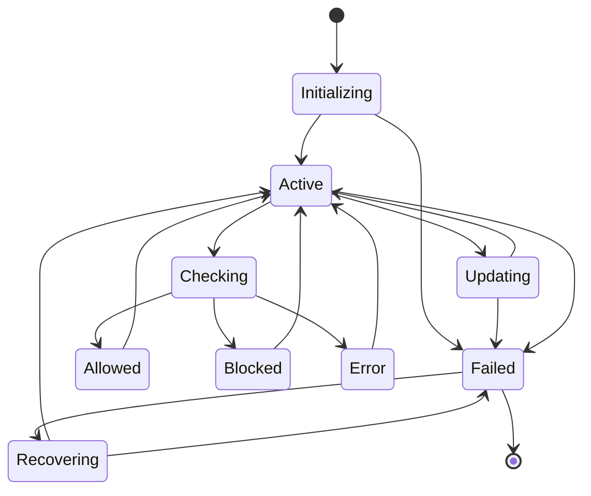
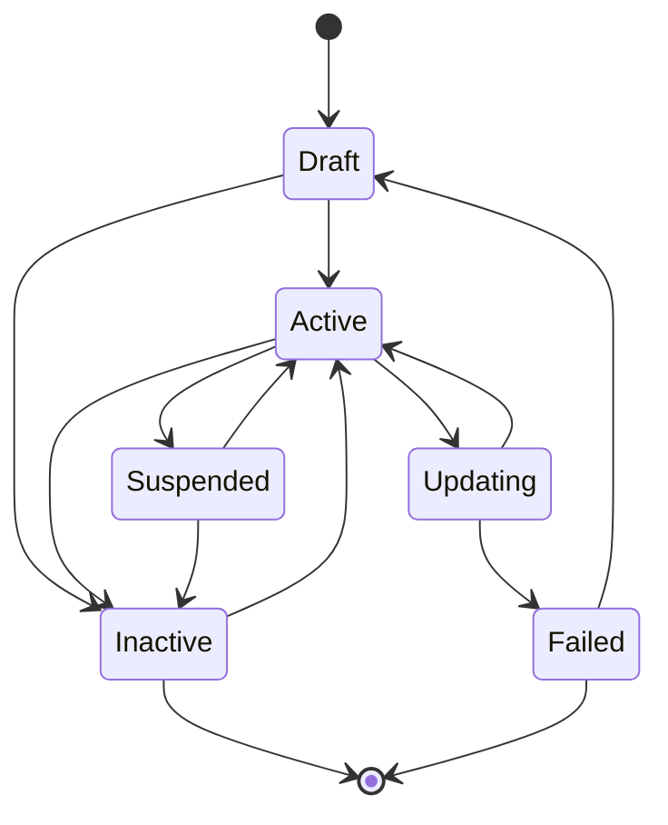

# 07. Rate Limiter - API Throttling System

## Title & Summary
Design and implement a distributed rate limiter that handles API throttling with multiple algorithms (token bucket, sliding window, fixed window) and supports different rate limiting strategies.

## Problem Statement

Build a rate limiting system that:

1. **Multiple Algorithms**: Support token bucket, sliding window, and fixed window algorithms
2. **Distributed Limiting**: Handle rate limiting across multiple service instances
3. **Flexible Policies**: Support different rate limiting policies per user/API
4. **Real-time Monitoring**: Provide real-time rate limiting metrics
5. **Graceful Degradation**: Handle rate limiter failures gracefully
6. **Configuration Management**: Dynamic rate limit configuration updates

## Requirements & Constraints

### Functional Requirements
- Multiple rate limiting algorithms
- Per-user and per-API rate limiting
- Distributed rate limiting with Redis
- Real-time metrics and monitoring
- Dynamic configuration updates
- Graceful failure handling

### Non-Functional Requirements
- **Latency**: < 1ms for rate limit checks
- **Consistency**: Eventually consistent across instances
- **Memory**: Support 1M concurrent users
- **Scalability**: Handle 100K requests per second
- **Reliability**: 99.9% rate limiter availability

## API / Interfaces

### REST Endpoints

```go
// Rate Limiting
GET    /api/rate-limit/check
POST   /api/rate-limit/reset
GET    /api/rate-limit/status

// Configuration
GET    /api/config/rate-limits
POST   /api/config/rate-limits
PUT    /api/config/rate-limits/{policyID}

// Monitoring
GET    /api/metrics/rate-limits
GET    /api/metrics/rate-limits/{userID}
```

### Request/Response Examples

```json
// Rate Limit Check
GET /api/rate-limit/check?userID=user123&api=payment&algorithm=token_bucket
{
  "allowed": true,
  "remaining": 95,
  "resetTime": "2024-01-15T10:35:00Z",
  "retryAfter": 0
}

// Rate Limit Exceeded
{
  "allowed": false,
  "remaining": 0,
  "resetTime": "2024-01-15T10:35:00Z",
  "retryAfter": 60
}
```

## Data Model

### Core Entities

```go
type RateLimitPolicy struct {
    ID          string            `json:"id"`
    Name        string            `json:"name"`
    Algorithm   Algorithm         `json:"algorithm"`
    Limit       int64             `json:"limit"`
    Window      time.Duration     `json:"window"`
    Burst       int64             `json:"burst,omitempty"`
    Scope       Scope             `json:"scope"`
    IsActive    bool              `json:"isActive"`
    CreatedAt   time.Time         `json:"createdAt"`
    UpdatedAt   time.Time         `json:"updatedAt"`
}

type RateLimitResult struct {
    Allowed     bool          `json:"allowed"`
    Remaining   int64         `json:"remaining"`
    ResetTime   time.Time     `json:"resetTime"`
    RetryAfter  int64         `json:"retryAfter"`
    PolicyID    string        `json:"policyID"`
}

type RateLimitMetrics struct {
    UserID      string    `json:"userID"`
    API         string    `json:"api"`
    Requests    int64     `json:"requests"`
    Blocked     int64     `json:"blocked"`
    Timestamp   time.Time `json:"timestamp"`
}
```

## State Machine

### Rate Limiter State Machine



### Rate Limit Policy State Machine



## Approach Overview

### Simple Solution (MVP)
1. In-memory rate limiting with simple counters
2. Single algorithm (token bucket)
3. Basic configuration
4. No distributed support

### Production-Ready Design
1. **Distributed Architecture**: Redis-based distributed rate limiting
2. **Multiple Algorithms**: Token bucket, sliding window, fixed window
3. **Dynamic Configuration**: Real-time policy updates
4. **Monitoring**: Comprehensive metrics and alerting
5. **Circuit Breaker**: Graceful degradation on failures
6. **Caching**: Local caching for performance

## Detailed Design

### Modular Decomposition

```go
ratelimiter/
├── algorithms/    # Rate limiting algorithms
├── policies/      # Policy management
├── storage/       # Redis storage layer
├── metrics/       # Metrics collection
├── config/        # Configuration management
└── middleware/    # HTTP middleware
```

### Concurrency Model

```go
type RateLimiter struct {
    policies      map[string]*RateLimitPolicy
    algorithms    map[Algorithm]AlgorithmInterface
    storage       StorageInterface
    metrics       *MetricsCollector
    config        *ConfigManager
    mutex         sync.RWMutex
    policyChan    chan PolicyUpdate
    metricsChan   chan MetricsEvent
}

// Goroutines for:
// 1. Policy updates
// 2. Metrics collection
// 3. Configuration sync
// 4. Health checks
```

## Optimal Golang Implementation

```go
package main

import (
    "context"
    "encoding/json"
    "fmt"
    "log"
    "net/http"
    "sync"
    "time"

    "github.com/go-redis/redis/v8"
)

type Algorithm string
const (
    TokenBucket    Algorithm = "token_bucket"
    SlidingWindow  Algorithm = "sliding_window"
    FixedWindow    Algorithm = "fixed_window"
)

type Scope string
const (
    ScopeUser Scope = "user"
    ScopeAPI  Scope = "api"
    ScopeIP   Scope = "ip"
    ScopeGlobal Scope = "global"
)

type RateLimitPolicy struct {
    ID          string            `json:"id"`
    Name        string            `json:"name"`
    Algorithm   Algorithm         `json:"algorithm"`
    Limit       int64             `json:"limit"`
    Window      time.Duration     `json:"window"`
    Burst       int64             `json:"burst,omitempty"`
    Scope       Scope             `json:"scope"`
    IsActive    bool              `json:"isActive"`
    CreatedAt   time.Time         `json:"createdAt"`
    UpdatedAt   time.Time         `json:"updatedAt"`
}

type RateLimitResult struct {
    Allowed     bool          `json:"allowed"`
    Remaining   int64         `json:"remaining"`
    ResetTime   time.Time     `json:"resetTime"`
    RetryAfter  int64         `json:"retryAfter"`
    PolicyID    string        `json:"policyID"`
}

type RateLimitMetrics struct {
    UserID      string    `json:"userID"`
    API         string    `json:"api"`
    Requests    int64     `json:"requests"`
    Blocked     int64     `json:"blocked"`
    Timestamp   time.Time `json:"timestamp"`
}

type AlgorithmInterface interface {
    Check(ctx context.Context, key string, policy *RateLimitPolicy) (*RateLimitResult, error)
    Reset(ctx context.Context, key string, policy *RateLimitPolicy) error
}

type StorageInterface interface {
    Get(ctx context.Context, key string) (string, error)
    Set(ctx context.Context, key string, value interface{}, expiration time.Duration) error
    Increment(ctx context.Context, key string) (int64, error)
    Expire(ctx context.Context, key string, expiration time.Duration) error
}

type RedisStorage struct {
    client *redis.Client
}

func (rs *RedisStorage) Get(ctx context.Context, key string) (string, error) {
    return rs.client.Get(ctx, key).Result()
}

func (rs *RedisStorage) Set(ctx context.Context, key string, value interface{}, expiration time.Duration) error {
    return rs.client.Set(ctx, key, value, expiration).Err()
}

func (rs *RedisStorage) Increment(ctx context.Context, key string) (int64, error) {
    return rs.client.Incr(ctx, key).Result()
}

func (rs *RedisStorage) Expire(ctx context.Context, key string, expiration time.Duration) error {
    return rs.client.Expire(ctx, key, expiration).Err()
}

type TokenBucketAlgorithm struct {
    storage StorageInterface
}

func (tba *TokenBucketAlgorithm) Check(ctx context.Context, key string, policy *RateLimitPolicy) (*RateLimitResult, error) {
    now := time.Now()
    
    // Get current bucket state
    bucketKey := fmt.Sprintf("bucket:%s", key)
    bucketData, err := tba.storage.Get(ctx, bucketKey)
    
    var tokens int64
    var lastRefill time.Time
    
    if err == nil {
        var bucket struct {
            Tokens    int64     `json:"tokens"`
            LastRefill time.Time `json:"lastRefill"`
        }
        json.Unmarshal([]byte(bucketData), &bucket)
        tokens = bucket.Tokens
        lastRefill = bucket.LastRefill
    } else {
        tokens = policy.Burst
        lastRefill = now
    }
    
    // Calculate tokens to add
    timePassed := now.Sub(lastRefill)
    tokensToAdd := int64(timePassed.Seconds()) * policy.Limit / int64(policy.Window.Seconds())
    
    if tokensToAdd > 0 {
        tokens = min(tokens+tokensToAdd, policy.Burst)
        lastRefill = now
    }
    
    // Check if request is allowed
    allowed := tokens > 0
    remaining := max(0, tokens-1)
    
    if allowed {
        tokens--
    }
    
    // Update bucket state
    bucketState := struct {
        Tokens    int64     `json:"tokens"`
        LastRefill time.Time `json:"lastRefill"`
    }{
        Tokens:    tokens,
        LastRefill: lastRefill,
    }
    
    bucketDataBytes, _ := json.Marshal(bucketState)
    tba.storage.Set(ctx, bucketKey, string(bucketDataBytes), policy.Window)
    
    resetTime := now.Add(policy.Window)
    retryAfter := int64(0)
    
    if !allowed {
        retryAfter = int64(policy.Window.Seconds())
    }
    
    return &RateLimitResult{
        Allowed:    allowed,
        Remaining:  remaining,
        ResetTime:  resetTime,
        RetryAfter: retryAfter,
        PolicyID:   policy.ID,
    }, nil
}

func (tba *TokenBucketAlgorithm) Reset(ctx context.Context, key string, policy *RateLimitPolicy) error {
    bucketKey := fmt.Sprintf("bucket:%s", key)
    return tba.storage.Set(ctx, bucketKey, "", 0)
}

type SlidingWindowAlgorithm struct {
    storage StorageInterface
}

func (swa *SlidingWindowAlgorithm) Check(ctx context.Context, key string, policy *RateLimitPolicy) (*RateLimitResult, error) {
    now := time.Now()
    windowStart := now.Add(-policy.Window)
    
    // Use sorted set to store requests with timestamps
    windowKey := fmt.Sprintf("window:%s", key)
    
    // Remove old entries
    swa.storage.Set(ctx, fmt.Sprintf("%s:cleanup", windowKey), now.Unix(), 0)
    
    // Add current request
    requestKey := fmt.Sprintf("%s:%d", windowKey, now.UnixNano())
    swa.storage.Set(ctx, requestKey, now.Unix(), policy.Window)
    
    // Count requests in window
    count, err := swa.storage.Increment(ctx, fmt.Sprintf("%s:count", windowKey))
    if err != nil {
        count = 1
    }
    
    allowed := count <= policy.Limit
    remaining := max(0, policy.Limit-count)
    
    resetTime := now.Add(policy.Window)
    retryAfter := int64(0)
    
    if !allowed {
        retryAfter = int64(policy.Window.Seconds())
    }
    
    return &RateLimitResult{
        Allowed:    allowed,
        Remaining:  remaining,
        ResetTime:  resetTime,
        RetryAfter: retryAfter,
        PolicyID:   policy.ID,
    }, nil
}

func (swa *SlidingWindowAlgorithm) Reset(ctx context.Context, key string, policy *RateLimitPolicy) error {
    windowKey := fmt.Sprintf("window:%s", key)
    return swa.storage.Set(ctx, windowKey, "", 0)
}

type FixedWindowAlgorithm struct {
    storage StorageInterface
}

func (fwa *FixedWindowAlgorithm) Check(ctx context.Context, key string, policy *RateLimitPolicy) (*RateLimitResult, error) {
    now := time.Now()
    
    // Calculate window start
    windowStart := now.Truncate(policy.Window)
    windowKey := fmt.Sprintf("fixed:%s:%d", key, windowStart.Unix())
    
    // Increment counter
    count, err := fwa.storage.Increment(ctx, windowKey)
    if err != nil {
        count = 1
    }
    
    // Set expiration
    fwa.storage.Expire(ctx, windowKey, policy.Window)
    
    allowed := count <= policy.Limit
    remaining := max(0, policy.Limit-count)
    
    resetTime := windowStart.Add(policy.Window)
    retryAfter := int64(0)
    
    if !allowed {
        retryAfter = int64(resetTime.Sub(now).Seconds())
    }
    
    return &RateLimitResult{
        Allowed:    allowed,
        Remaining:  remaining,
        ResetTime:  resetTime,
        RetryAfter: retryAfter,
        PolicyID:   policy.ID,
    }, nil
}

func (fwa *FixedWindowAlgorithm) Reset(ctx context.Context, key string, policy *RateLimitPolicy) error {
    now := time.Now()
    windowStart := now.Truncate(policy.Window)
    windowKey := fmt.Sprintf("fixed:%s:%d", key, windowStart.Unix())
    return fwa.storage.Set(ctx, windowKey, "0", policy.Window)
}

type RateLimiter struct {
    policies      map[string]*RateLimitPolicy
    algorithms    map[Algorithm]AlgorithmInterface
    storage       StorageInterface
    metrics       *MetricsCollector
    mutex         sync.RWMutex
    policyChan    chan PolicyUpdate
    metricsChan   chan MetricsEvent
}

type PolicyUpdate struct {
    Policy *RateLimitPolicy
    Action string // "create", "update", "delete"
}

type MetricsEvent struct {
    UserID    string
    API       string
    Allowed   bool
    Timestamp time.Time
}

type MetricsCollector struct {
    metrics map[string]*RateLimitMetrics
    mutex   sync.RWMutex
}

func NewRateLimiter(storage StorageInterface) *RateLimiter {
    rl := &RateLimiter{
        policies:   make(map[string]*RateLimitPolicy),
        algorithms: make(map[Algorithm]AlgorithmInterface),
        storage:    storage,
        metrics:    &MetricsCollector{metrics: make(map[string]*RateLimitMetrics)},
        policyChan: make(chan PolicyUpdate, 1000),
        metricsChan: make(chan MetricsEvent, 1000),
    }
    
    // Register algorithms
    rl.algorithms[TokenBucket] = &TokenBucketAlgorithm{storage: storage}
    rl.algorithms[SlidingWindow] = &SlidingWindowAlgorithm{storage: storage}
    rl.algorithms[FixedWindow] = &FixedWindowAlgorithm{storage: storage}
    
    return rl
}

func (rl *RateLimiter) CheckRateLimit(ctx context.Context, userID, api string, policyID string) (*RateLimitResult, error) {
    rl.mutex.RLock()
    policy, exists := rl.policies[policyID]
    rl.mutex.RUnlock()
    
    if !exists || !policy.IsActive {
        return &RateLimitResult{Allowed: true}, nil
    }
    
    // Generate key based on scope
    key := rl.generateKey(userID, api, policy)
    
    // Get algorithm
    algorithm, exists := rl.algorithms[policy.Algorithm]
    if !exists {
        return nil, fmt.Errorf("algorithm not found: %s", policy.Algorithm)
    }
    
    // Check rate limit
    result, err := algorithm.Check(ctx, key, policy)
    if err != nil {
        return nil, err
    }
    
    // Record metrics
    rl.metricsChan <- MetricsEvent{
        UserID:    userID,
        API:       api,
        Allowed:   result.Allowed,
        Timestamp: time.Now(),
    }
    
    return result, nil
}

func (rl *RateLimiter) generateKey(userID, api string, policy *RateLimitPolicy) string {
    switch policy.Scope {
    case ScopeUser:
        return fmt.Sprintf("user:%s", userID)
    case ScopeAPI:
        return fmt.Sprintf("api:%s", api)
    case ScopeIP:
        return fmt.Sprintf("ip:%s", userID) // Assuming userID is IP for this example
    case ScopeGlobal:
        return "global"
    default:
        return fmt.Sprintf("user:%s:api:%s", userID, api)
    }
}

func (rl *RateLimiter) AddPolicy(policy *RateLimitPolicy) {
    rl.mutex.Lock()
    defer rl.mutex.Unlock()
    
    policy.CreatedAt = time.Now()
    policy.UpdatedAt = time.Now()
    rl.policies[policy.ID] = policy
    
    rl.policyChan <- PolicyUpdate{
        Policy: policy,
        Action: "create",
    }
}

func (rl *RateLimiter) UpdatePolicy(policy *RateLimitPolicy) {
    rl.mutex.Lock()
    defer rl.mutex.Unlock()
    
    policy.UpdatedAt = time.Now()
    rl.policies[policy.ID] = policy
    
    rl.policyChan <- PolicyUpdate{
        Policy: policy,
        Action: "update",
    }
}

func (rl *RateLimiter) DeletePolicy(policyID string) {
    rl.mutex.Lock()
    defer rl.mutex.Unlock()
    
    delete(rl.policies, policyID)
    
    rl.policyChan <- PolicyUpdate{
        Policy: &RateLimitPolicy{ID: policyID},
        Action: "delete",
    }
}

func (rl *RateLimiter) ProcessPolicyUpdates() {
    for update := range rl.policyChan {
        log.Printf("Policy update: %s %s", update.Action, update.Policy.ID)
        // In production, this would sync with external configuration store
    }
}

func (rl *RateLimiter) ProcessMetrics() {
    for event := range rl.metricsChan {
        rl.metrics.RecordEvent(event)
    }
}

func (mc *MetricsCollector) RecordEvent(event MetricsEvent) {
    mc.mutex.Lock()
    defer mc.mutex.Unlock()
    
    key := fmt.Sprintf("%s:%s", event.UserID, event.API)
    metrics, exists := mc.metrics[key]
    
    if !exists {
        metrics = &RateLimitMetrics{
            UserID:    event.UserID,
            API:       event.API,
            Timestamp: event.Timestamp,
        }
        mc.metrics[key] = metrics
    }
    
    metrics.Requests++
    if !event.Allowed {
        metrics.Blocked++
    }
    metrics.Timestamp = event.Timestamp
}

func (mc *MetricsCollector) GetMetrics(userID, api string) *RateLimitMetrics {
    mc.mutex.RLock()
    defer mc.mutex.RUnlock()
    
    key := fmt.Sprintf("%s:%s", userID, api)
    return mc.metrics[key]
}

// HTTP Handlers
func (rl *RateLimiter) CheckRateLimitHandler(w http.ResponseWriter, r *http.Request) {
    if r.Method != http.MethodGet {
        http.Error(w, "Method not allowed", http.StatusMethodNotAllowed)
        return
    }

    userID := r.URL.Query().Get("userID")
    api := r.URL.Query().Get("api")
    policyID := r.URL.Query().Get("policyID")
    
    if userID == "" || api == "" || policyID == "" {
        http.Error(w, "userID, api, and policyID required", http.StatusBadRequest)
        return
    }

    result, err := rl.CheckRateLimit(r.Context(), userID, api, policyID)
    if err != nil {
        http.Error(w, err.Error(), http.StatusInternalServerError)
        return
    }

    w.Header().Set("Content-Type", "application/json")
    json.NewEncoder(w).Encode(result)
}

func (rl *RateLimiter) AddPolicyHandler(w http.ResponseWriter, r *http.Request) {
    if r.Method != http.MethodPost {
        http.Error(w, "Method not allowed", http.StatusMethodNotAllowed)
        return
    }

    var policy RateLimitPolicy
    if err := json.NewDecoder(r.Body).Decode(&policy); err != nil {
        http.Error(w, "Invalid request", http.StatusBadRequest)
        return
    }

    policy.ID = fmt.Sprintf("policy_%d", time.Now().UnixNano())
    rl.AddPolicy(&policy)

    w.Header().Set("Content-Type", "application/json")
    json.NewEncoder(w).Encode(policy)
}

func (rl *RateLimiter) GetMetricsHandler(w http.ResponseWriter, r *http.Request) {
    if r.Method != http.MethodGet {
        http.Error(w, "Method not allowed", http.StatusMethodNotAllowed)
        return
    }

    userID := r.URL.Query().Get("userID")
    api := r.URL.Query().Get("api")

    metrics := rl.metrics.GetMetrics(userID, api)
    if metrics == nil {
        http.Error(w, "Metrics not found", http.StatusNotFound)
        return
    }

    w.Header().Set("Content-Type", "application/json")
    json.NewEncoder(w).Encode(metrics)
}

func min(a, b int64) int64 {
    if a < b {
        return a
    }
    return b
}

func max(a, b int64) int64 {
    if a > b {
        return a
    }
    return b
}

func main() {
    // Initialize Redis client
    rdb := redis.NewClient(&redis.Options{
        Addr: "localhost:6379",
    })

    storage := &RedisStorage{client: rdb}
    rateLimiter := NewRateLimiter(storage)

    // Start background workers
    go rateLimiter.ProcessPolicyUpdates()
    go rateLimiter.ProcessMetrics()

    // Add default policies
    rateLimiter.AddPolicy(&RateLimitPolicy{
        ID:        "default_user",
        Name:      "Default User Rate Limit",
        Algorithm: TokenBucket,
        Limit:     100,
        Window:    time.Minute,
        Burst:     100,
        Scope:     ScopeUser,
        IsActive:  true,
    })

    // HTTP routes
    http.HandleFunc("/api/rate-limit/check", rateLimiter.CheckRateLimitHandler)
    http.HandleFunc("/api/config/rate-limits", rateLimiter.AddPolicyHandler)
    http.HandleFunc("/api/metrics/rate-limits", rateLimiter.GetMetricsHandler)

    log.Println("Rate limiter service starting on :8080")
    log.Fatal(http.ListenAndServe(":8080", nil))
}
```

## Unit Tests

```go
func TestRateLimiter_TokenBucket(t *testing.T) {
    storage := &MockStorage{}
    rateLimiter := NewRateLimiter(storage)

    policy := &RateLimitPolicy{
        ID:        "test_policy",
        Algorithm: TokenBucket,
        Limit:     10,
        Window:    time.Minute,
        Burst:     10,
        Scope:     ScopeUser,
        IsActive:  true,
    }
    rateLimiter.AddPolicy(policy)

    // First request should be allowed
    result, err := rateLimiter.CheckRateLimit(context.Background(), "user1", "api1", "test_policy")
    if err != nil {
        t.Fatalf("CheckRateLimit() error = %v", err)
    }

    if !result.Allowed {
        t.Error("Expected first request to be allowed")
    }

    if result.Remaining != 9 {
        t.Errorf("Expected remaining 9, got %d", result.Remaining)
    }
}

func TestRateLimiter_SlidingWindow(t *testing.T) {
    storage := &MockStorage{}
    rateLimiter := NewRateLimiter(storage)

    policy := &RateLimitPolicy{
        ID:        "test_policy",
        Algorithm: SlidingWindow,
        Limit:     5,
        Window:    time.Minute,
        Scope:     ScopeUser,
        IsActive:  true,
    }
    rateLimiter.AddPolicy(policy)

    // Make 5 requests
    for i := 0; i < 5; i++ {
        result, err := rateLimiter.CheckRateLimit(context.Background(), "user1", "api1", "test_policy")
        if err != nil {
            t.Fatalf("CheckRateLimit() error = %v", err)
        }

        if !result.Allowed {
            t.Errorf("Request %d should be allowed", i+1)
        }
    }

    // 6th request should be blocked
    result, err := rateLimiter.CheckRateLimit(context.Background(), "user1", "api1", "test_policy")
    if err != nil {
        t.Fatalf("CheckRateLimit() error = %v", err)
    }

    if result.Allowed {
        t.Error("Expected 6th request to be blocked")
    }
}

type MockStorage struct {
    data map[string]string
    mutex sync.RWMutex
}

func (ms *MockStorage) Get(ctx context.Context, key string) (string, error) {
    ms.mutex.RLock()
    defer ms.mutex.RUnlock()
    
    value, exists := ms.data[key]
    if !exists {
        return "", fmt.Errorf("key not found")
    }
    return value, nil
}

func (ms *MockStorage) Set(ctx context.Context, key string, value interface{}, expiration time.Duration) error {
    ms.mutex.Lock()
    defer ms.mutex.Unlock()
    
    if ms.data == nil {
        ms.data = make(map[string]string)
    }
    
    ms.data[key] = fmt.Sprintf("%v", value)
    return nil
}

func (ms *MockStorage) Increment(ctx context.Context, key string) (int64, error) {
    ms.mutex.Lock()
    defer ms.mutex.Unlock()
    
    if ms.data == nil {
        ms.data = make(map[string]string)
    }
    
    current, _ := strconv.ParseInt(ms.data[key], 10, 64)
    current++
    ms.data[key] = strconv.FormatInt(current, 10)
    return current, nil
}

func (ms *MockStorage) Expire(ctx context.Context, key string, expiration time.Duration) error {
    return nil
}
```

## Complexity Analysis

### Time Complexity
- **Token Bucket**: O(1) - Constant time operations
- **Sliding Window**: O(log n) - Sorted set operations
- **Fixed Window**: O(1) - Simple counter operations
- **Policy Lookup**: O(1) - Hash map lookup

### Space Complexity
- **Policy Storage**: O(P) where P is number of policies
- **Rate Limit Data**: O(K) where K is number of unique keys
- **Metrics Storage**: O(M) where M is number of metric combinations
- **Total**: O(P + K + M)

## Edge Cases & Validation

### Input Validation
- Invalid policy configurations
- Negative rate limits
- Invalid time windows
- Missing required fields
- Invalid algorithm types

### Error Scenarios
- Redis connection failures
- Policy configuration errors
- Algorithm implementation errors
- Storage operation failures
- Network timeouts

### Boundary Conditions
- Zero rate limits
- Very large rate limits
- Minimum time windows
- Maximum burst sizes
- Concurrent policy updates

## Extension Ideas (Scaling)

### Horizontal Scaling
1. **Load Balancing**: Multiple rate limiter instances
2. **Redis Clustering**: Distributed Redis for high availability
3. **Policy Sharding**: Distribute policies across instances
4. **Metrics Aggregation**: Centralized metrics collection

### Performance Optimization
1. **Local Caching**: Cache policies locally for faster access
2. **Batch Operations**: Batch Redis operations for efficiency
3. **Connection Pooling**: Optimize Redis connection usage
4. **Algorithm Optimization**: Optimize algorithm implementations

### Advanced Features
1. **Dynamic Policies**: Real-time policy updates
2. **Machine Learning**: Adaptive rate limiting based on patterns
3. **Geographic Limiting**: Location-based rate limiting
4. **API Versioning**: Different limits for different API versions

## 20 Follow-up Questions

### 1. How would you handle Redis failures in distributed rate limiting?
**Answer**: Implement circuit breaker pattern with fallback to local rate limiting. Use multiple Redis instances for redundancy. Implement graceful degradation with reduced functionality. Consider using in-memory fallback with eventual consistency.

### 2. What's your strategy for handling rate limit bypassing?
**Answer**: Implement multiple rate limiting layers (IP, user, API). Use request fingerprinting for duplicate detection. Implement behavioral analysis for suspicious patterns. Consider using machine learning for anomaly detection.

### 3. How do you ensure rate limit accuracy across time zones?
**Answer**: Use UTC for all time calculations. Implement timezone-aware window calculations. Use consistent time synchronization across instances. Consider using atomic clocks for high-precision timing.

### 4. What's your approach to handling rate limit configuration updates?
**Answer**: Implement hot-reload for configuration changes. Use versioned configuration with rollback capability. Implement configuration validation before deployment. Consider using feature flags for gradual rollout.

### 5. How would you implement rate limiting for different user tiers?
**Answer**: Implement tier-based rate limiting policies. Use user metadata for policy selection. Implement dynamic policy assignment based on user behavior. Consider using subscription-based rate limiting.

### 6. What's your strategy for handling rate limit monitoring?
**Answer**: Implement real-time monitoring dashboards. Use metrics aggregation for trend analysis. Implement alerting for rate limit violations. Consider using APM tools for performance monitoring.

### 7. How do you handle rate limiting for API versioning?
**Answer**: Implement version-specific rate limiting policies. Use API version in rate limit key generation. Implement backward compatibility for old versions. Consider using semantic versioning for policy management.

### 8. What's your approach to handling rate limiting for mobile apps?
**Answer**: Implement device-based rate limiting. Use app version for policy selection. Implement offline rate limiting for mobile apps. Consider using push notifications for rate limit alerts.

### 9. How would you implement rate limiting for real-time applications?
**Answer**: Use sliding window algorithms for smooth rate limiting. Implement burst handling for real-time traffic. Use WebSocket-specific rate limiting. Consider using connection-based rate limiting.

### 10. What's your strategy for handling rate limiting for batch operations?
**Answer**: Implement batch-specific rate limiting policies. Use batch size for rate limit calculations. Implement batch queuing for rate limit compliance. Consider using batch optimization algorithms.

### 11. How do you handle rate limiting for different geographic regions?
**Answer**: Implement region-specific rate limiting policies. Use CDN-based rate limiting for global distribution. Implement timezone-aware rate limiting. Consider using regional data centers for compliance.

### 12. What's your approach to handling rate limiting for third-party integrations?
**Answer**: Implement partner-specific rate limiting policies. Use API key-based rate limiting. Implement quota management for partners. Consider using SLA-based rate limiting.

### 13. How would you implement rate limiting for microservices?
**Answer**: Implement service-to-service rate limiting. Use service mesh for rate limiting. Implement distributed rate limiting across services. Consider using API gateway for centralized rate limiting.

### 14. What's your strategy for handling rate limiting for data processing?
**Answer**: Implement data volume-based rate limiting. Use processing time for rate limit calculations. Implement batch processing rate limiting. Consider using stream processing rate limiting.

### 15. How do you handle rate limiting for file uploads?
**Answer**: Implement file size-based rate limiting. Use upload bandwidth for rate limit calculations. Implement chunked upload rate limiting. Consider using progressive upload rate limiting.

### 16. What's your approach to handling rate limiting for search operations?
**Answer**: Implement query complexity-based rate limiting. Use result set size for rate limit calculations. Implement search frequency rate limiting. Consider using query optimization for rate limiting.

### 17. How would you implement rate limiting for notification systems?
**Answer**: Implement notification frequency rate limiting. Use user preferences for rate limit customization. Implement notification channel rate limiting. Consider using notification queuing for rate limiting.

### 18. What's your strategy for handling rate limiting for analytics?
**Answer**: Implement analytics query rate limiting. Use data volume for rate limit calculations. Implement analytics dashboard rate limiting. Consider using analytics caching for rate limiting.

### 19. How do you handle rate limiting for machine learning models?
**Answer**: Implement model inference rate limiting. Use model complexity for rate limit calculations. Implement batch inference rate limiting. Consider using model versioning for rate limiting.

### 20. What's your approach to handling rate limiting for blockchain operations?
**Answer**: Implement transaction-based rate limiting. Use gas fees for rate limit calculations. Implement block-based rate limiting. Consider using consensus-based rate limiting.

## Evaluation Checklist

### Code Quality (25%)
- [ ] Clean, readable Go code with proper error handling
- [ ] Appropriate use of interfaces and structs
- [ ] Proper concurrency patterns (goroutines, channels)
- [ ] Good separation of concerns

### Architecture (25%)
- [ ] Scalable design with multiple algorithms
- [ ] Proper distributed rate limiting
- [ ] Efficient storage layer
- [ ] Comprehensive monitoring

### Functionality (25%)
- [ ] Multiple rate limiting algorithms working
- [ ] Distributed rate limiting functional
- [ ] Policy management implemented
- [ ] Metrics collection working

### Testing (15%)
- [ ] Unit tests for core functionality
- [ ] Integration tests for API endpoints
- [ ] Edge case testing
- [ ] Performance testing

### Discussion (10%)
- [ ] Clear explanation of design decisions
- [ ] Understanding of rate limiting algorithms
- [ ] Knowledge of distributed systems
- [ ] Ability to discuss trade-offs

## Discussion Pointers

### Key Points to Highlight
1. **Algorithm Selection**: Explain the trade-offs between different rate limiting algorithms
2. **Distributed Design**: Discuss the challenges of distributed rate limiting
3. **Performance Optimization**: Explain the performance considerations for high-throughput systems
4. **Monitoring**: Discuss the importance of comprehensive monitoring and alerting
5. **Configuration Management**: Explain the need for dynamic configuration updates

### Trade-offs to Discuss
1. **Accuracy vs Performance**: Precise rate limiting vs high performance trade-offs
2. **Memory vs CPU**: Memory usage vs CPU optimization trade-offs
3. **Consistency vs Availability**: Strong consistency vs high availability trade-offs
4. **Simplicity vs Features**: Simple design vs advanced features trade-offs
5. **Latency vs Throughput**: Low latency vs high throughput trade-offs

### Extension Scenarios
1. **Multi-region Deployment**: How to handle geographic distribution
2. **Advanced Algorithms**: Machine learning-based rate limiting
3. **Real-time Analytics**: Live rate limiting dashboards and monitoring
4. **Compliance Integration**: Regulatory compliance and audit requirements
5. **Enterprise Features**: Multi-tenant and white-label solutions
