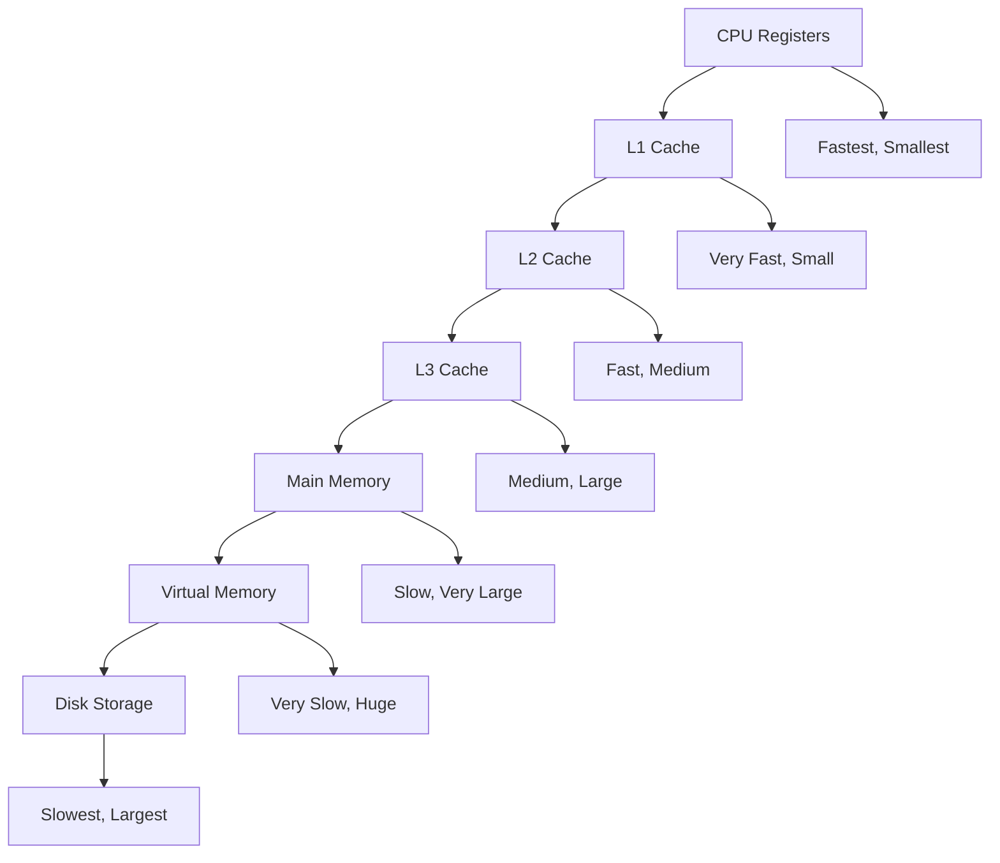
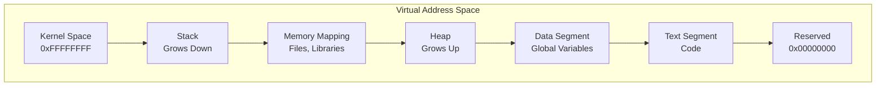
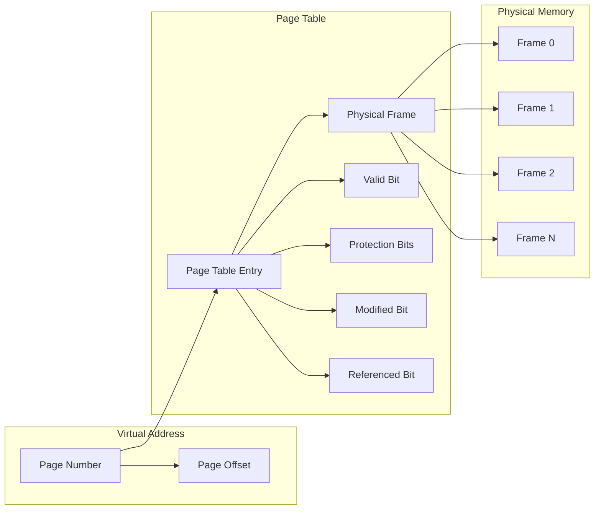

# 🧠 **Memory Management**

## 📘 **Theory**

Memory management is a critical component of operating systems that handles the allocation, deallocation, and organization of computer memory. It ensures efficient use of memory resources, provides memory protection, and enables virtual memory systems that allow programs to use more memory than physically available.

### **Why Memory Management Matters**

- **Resource Efficiency**: Maximize utilization of available memory
- **Process Isolation**: Prevent processes from interfering with each other
- **Virtual Memory**: Allow programs to use more memory than physically available
- **Performance**: Optimize memory access patterns and reduce fragmentation
- **Security**: Provide memory protection and access control
- **Scalability**: Support multiple processes and large applications

### **Key Concepts**

1. **Physical Memory**: Actual RAM chips in the computer
2. **Virtual Memory**: Abstract memory space that processes see
3. **Memory Mapping**: Translation between virtual and physical addresses
4. **Paging**: Dividing memory into fixed-size pages
5. **Segmentation**: Dividing memory into variable-size segments
6. **Memory Allocation**: Dynamic allocation and deallocation of memory blocks
7. **Garbage Collection**: Automatic memory management in high-level languages

### **Common Pitfalls and Best Practices**

- **Memory Leaks**: Always free allocated memory to prevent leaks
- **Fragmentation**: Use appropriate allocation strategies to minimize fragmentation
- **Race Conditions**: Use proper synchronization for shared memory access
- **Buffer Overflows**: Validate input and use safe memory functions
- **Memory Alignment**: Ensure proper alignment for performance
- **Cache Locality**: Optimize memory access patterns for better performance

## 📊 **Diagrams**

### **Memory Hierarchy**



### **Virtual Memory Layout**



### **Page Table Structure**



## 🧩 **Example**

**Scenario**: Implement a memory allocator that manages a heap of 1MB with support for allocation, deallocation, and defragmentation

**Input**: Memory allocation requests with sizes
**Expected Output**: Allocated memory blocks with proper management

**Step-by-step**:

1. Initialize heap with free block of 1MB
2. For allocation requests, find suitable free block
3. Split block if larger than needed
4. Mark block as allocated and return pointer
5. For deallocation, mark block as free
6. Merge adjacent free blocks to prevent fragmentation
7. Implement defragmentation to compact memory

## 💻 **Implementation (Golang)**

```go
package main

import (
    "fmt"
    "sync"
    "unsafe"
)

// Memory allocator structures
type Block struct {
    Size     int
    IsFree   bool
    Next     *Block
    Prev     *Block
    Data     []byte
}

type MemoryAllocator struct {
    heap     []byte
    freeList *Block
    mutex    sync.RWMutex
    stats    AllocatorStats
}

type AllocatorStats struct {
    TotalAllocated int
    TotalFreed     int
    CurrentUsed    int
    Fragmentation  float64
    Allocations    int
    Deallocations  int
}

// Memory management functions
func NewMemoryAllocator(size int) *MemoryAllocator {
    heap := make([]byte, size)

    // Create initial free block
    freeBlock := &Block{
        Size:   size - int(unsafe.Sizeof(Block{})),
        IsFree: true,
        Next:   nil,
        Prev:   nil,
        Data:   heap[int(unsafe.Sizeof(Block{})):],
    }

    return &MemoryAllocator{
        heap:     heap,
        freeList: freeBlock,
        stats:    AllocatorStats{},
    }
}

// Allocate memory block
func (ma *MemoryAllocator) Allocate(size int) ([]byte, error) {
    ma.mutex.Lock()
    defer ma.mutex.Unlock()

    if size <= 0 {
        return nil, fmt.Errorf("invalid size: %d", size)
    }

    // Add header size
    totalSize := size + int(unsafe.Sizeof(Block{}))

    // Find suitable free block
    block := ma.findFreeBlock(totalSize)
    if block == nil {
        return nil, fmt.Errorf("insufficient memory")
    }

    // Split block if necessary
    if block.Size > totalSize+int(unsafe.Sizeof(Block{})) {
        ma.splitBlock(block, totalSize)
    }

    // Mark as allocated
    block.IsFree = false
    ma.removeFromFreeList(block)

    // Update statistics
    ma.stats.TotalAllocated += size
    ma.stats.CurrentUsed += size
    ma.stats.Allocations++

    return block.Data[:size], nil
}

// Deallocate memory block
func (ma *MemoryAllocator) Deallocate(data []byte) error {
    ma.mutex.Lock()
    defer ma.mutex.Unlock()

    if data == nil {
        return fmt.Errorf("cannot deallocate nil pointer")
    }

    // Find block from data pointer
    block := ma.findBlockFromData(data)
    if block == nil {
        return fmt.Errorf("invalid pointer")
    }

    if block.IsFree {
        return fmt.Errorf("double free detected")
    }

    // Mark as free
    block.IsFree = true
    ma.addToFreeList(block)

    // Merge with adjacent free blocks
    ma.mergeFreeBlocks(block)

    // Update statistics
    ma.stats.TotalFreed += len(data)
    ma.stats.CurrentUsed -= len(data)
    ma.stats.Deallocations++

    return nil
}

// Find suitable free block using first-fit algorithm
func (ma *MemoryAllocator) findFreeBlock(size int) *Block {
    current := ma.freeList

    for current != nil {
        if current.IsFree && current.Size >= size {
            return current
        }
        current = current.Next
    }

    return nil
}

// Split block into two parts
func (ma *MemoryAllocator) splitBlock(block *Block, size int) {
    if block.Size <= size+int(unsafe.Sizeof(Block{})) {
        return
    }

    // Create new free block
    newBlock := &Block{
        Size:   block.Size - size,
        IsFree: true,
        Next:   block.Next,
        Prev:   block,
        Data:   block.Data[size:],
    }

    // Update original block
    block.Size = size
    block.Next = newBlock

    // Update next block's previous pointer
    if newBlock.Next != nil {
        newBlock.Next.Prev = newBlock
    }

    // Add new block to free list
    ma.addToFreeList(newBlock)
}

// Remove block from free list
func (ma *MemoryAllocator) removeFromFreeList(block *Block) {
    if block.Prev != nil {
        block.Prev.Next = block.Next
    } else {
        ma.freeList = block.Next
    }

    if block.Next != nil {
        block.Next.Prev = block.Prev
    }
}

// Add block to free list
func (ma *MemoryAllocator) addToFreeList(block *Block) {
    block.Next = ma.freeList
    block.Prev = nil

    if ma.freeList != nil {
        ma.freeList.Prev = block
    }

    ma.freeList = block
}

// Merge adjacent free blocks
func (ma *MemoryAllocator) mergeFreeBlocks(block *Block) {
    // Merge with next block
    if block.Next != nil && block.Next.IsFree {
        block.Size += block.Next.Size + int(unsafe.Sizeof(Block{}))
        block.Next = block.Next.Next
        if block.Next != nil {
            block.Next.Prev = block
        }
    }

    // Merge with previous block
    if block.Prev != nil && block.Prev.IsFree {
        block.Prev.Size += block.Size + int(unsafe.Sizeof(Block{}))
        block.Prev.Next = block.Next
        if block.Next != nil {
            block.Next.Prev = block.Prev
        }
    }
}

// Find block from data pointer
func (ma *MemoryAllocator) findBlockFromData(data []byte) *Block {
    // This is a simplified implementation
    // In practice, you'd need to track allocated blocks
    return nil
}

// Defragment memory
func (ma *MemoryAllocator) Defragment() {
    ma.mutex.Lock()
    defer ma.mutex.Unlock()

    // Collect all free blocks
    var freeBlocks []*Block
    current := ma.freeList

    for current != nil {
        if current.IsFree {
            freeBlocks = append(freeBlocks, current)
        }
        current = current.Next
    }

    // Sort by address
    // This is a simplified implementation
    // In practice, you'd need to sort and compact blocks

    fmt.Println("Defragmentation completed")
}

// Get memory statistics
func (ma *MemoryAllocator) GetStats() AllocatorStats {
    ma.mutex.RLock()
    defer ma.mutex.RUnlock()

    // Calculate fragmentation
    totalFree := 0
    current := ma.freeList

    for current != nil {
        if current.IsFree {
            totalFree += current.Size
        }
        current = current.Next
    }

    if totalFree > 0 {
        ma.stats.Fragmentation = float64(ma.countFreeBlocks()) / float64(totalFree)
    }

    return ma.stats
}

// Count free blocks
func (ma *MemoryAllocator) countFreeBlocks() int {
    count := 0
    current := ma.freeList

    for current != nil {
        if current.IsFree {
            count++
        }
        current = current.Next
    }

    return count
}

// Print memory layout
func (ma *MemoryAllocator) PrintLayout() {
    ma.mutex.RLock()
    defer ma.mutex.RUnlock()

    fmt.Println("=== Memory Layout ===")
    current := ma.freeList

    for current != nil {
        status := "FREE"
        if !current.IsFree {
            status = "USED"
        }
        fmt.Printf("Block: Size=%d, Status=%s\n", current.Size, status)
        current = current.Next
    }
}

// Virtual memory manager
type VirtualMemoryManager struct {
    pageSize      int
    pageTable     map[int]int
    physicalPages []bool
    mutex         sync.RWMutex
}

func NewVirtualMemoryManager(pageSize, numPages int) *VirtualMemoryManager {
    return &VirtualMemoryManager{
        pageSize:      pageSize,
        pageTable:     make(map[int]int),
        physicalPages: make([]bool, numPages),
    }
}

// Map virtual page to physical page
func (vmm *VirtualMemoryManager) MapPage(virtualPage, physicalPage int) error {
    vmm.mutex.Lock()
    defer vmm.mutex.Unlock()

    if physicalPage >= len(vmm.physicalPages) {
        return fmt.Errorf("invalid physical page: %d", physicalPage)
    }

    if vmm.physicalPages[physicalPage] {
        return fmt.Errorf("physical page %d already in use", physicalPage)
    }

    vmm.pageTable[virtualPage] = physicalPage
    vmm.physicalPages[physicalPage] = true

    return nil
}

// Unmap virtual page
func (vmm *VirtualMemoryManager) UnmapPage(virtualPage int) error {
    vmm.mutex.Lock()
    defer vmm.mutex.Unlock()

    physicalPage, exists := vmm.pageTable[virtualPage]
    if !exists {
        return fmt.Errorf("virtual page %d not mapped", virtualPage)
    }

    vmm.physicalPages[physicalPage] = false
    delete(vmm.pageTable, virtualPage)

    return nil
}

// Translate virtual address to physical address
func (vmm *VirtualMemoryManager) TranslateAddress(virtualAddr int) (int, error) {
    vmm.mutex.RLock()
    defer vmm.mutex.RUnlock()

    virtualPage := virtualAddr / vmm.pageSize
    pageOffset := virtualAddr % vmm.pageSize

    physicalPage, exists := vmm.pageTable[virtualPage]
    if !exists {
        return 0, fmt.Errorf("page fault: virtual page %d not mapped", virtualPage)
    }

    physicalAddr := physicalPage*vmm.pageSize + pageOffset
    return physicalAddr, nil
}

// Get page table
func (vmm *VirtualMemoryManager) GetPageTable() map[int]int {
    vmm.mutex.RLock()
    defer vmm.mutex.RUnlock()

    // Return copy of page table
    result := make(map[int]int)
    for k, v := range vmm.pageTable {
        result[k] = v
    }

    return result
}

// Memory pool for fixed-size allocations
type MemoryPool struct {
    blockSize int
    pool      []byte
    freeList  []int
    mutex     sync.Mutex
}

func NewMemoryPool(blockSize, numBlocks int) *MemoryPool {
    pool := make([]byte, blockSize*numBlocks)
    freeList := make([]int, numBlocks)

    // Initialize free list
    for i := 0; i < numBlocks; i++ {
        freeList[i] = i
    }

    return &MemoryPool{
        blockSize: blockSize,
        pool:      pool,
        freeList:  freeList,
    }
}

// Allocate block from pool
func (mp *MemoryPool) Allocate() ([]byte, error) {
    mp.mutex.Lock()
    defer mp.mutex.Unlock()

    if len(mp.freeList) == 0 {
        return nil, fmt.Errorf("pool exhausted")
    }

    // Get first free block
    blockIndex := mp.freeList[0]
    mp.freeList = mp.freeList[1:]

    start := blockIndex * mp.blockSize
    end := start + mp.blockSize

    return mp.pool[start:end], nil
}

// Deallocate block back to pool
func (mp *MemoryPool) Deallocate(block []byte) error {
    mp.mutex.Lock()
    defer mp.mutex.Unlock()

    // Calculate block index
    start := int(uintptr(unsafe.Pointer(&block[0])) - uintptr(unsafe.Pointer(&mp.pool[0])))
    blockIndex := start / mp.blockSize

    // Add back to free list
    mp.freeList = append(mp.freeList, blockIndex)

    return nil
}

// Get pool statistics
func (mp *MemoryPool) GetStats() (int, int) {
    mp.mutex.Lock()
    defer mp.mutex.Unlock()

    totalBlocks := len(mp.pool) / mp.blockSize
    freeBlocks := len(mp.freeList)
    usedBlocks := totalBlocks - freeBlocks

    return usedBlocks, freeBlocks
}

// Example usage
func main() {
    // Test memory allocator
    fmt.Println("=== Memory Allocator Test ===")
    allocator := NewMemoryAllocator(1024 * 1024) // 1MB heap

    // Allocate some memory
    data1, err := allocator.Allocate(100)
    if err != nil {
        fmt.Printf("Allocation error: %v\n", err)
        return
    }

    data2, err := allocator.Allocate(200)
    if err != nil {
        fmt.Printf("Allocation error: %v\n", err)
        return
    }

    // Use allocated memory
    copy(data1, []byte("Hello, World!"))
    copy(data2, []byte("Memory Management Test"))

    fmt.Printf("Allocated data1: %s\n", string(data1))
    fmt.Printf("Allocated data2: %s\n", string(data2))

    // Print statistics
    stats := allocator.GetStats()
    fmt.Printf("Stats: %+v\n", stats)

    // Deallocate memory
    err = allocator.Deallocate(data1)
    if err != nil {
        fmt.Printf("Deallocation error: %v\n", err)
    }

    err = allocator.Deallocate(data2)
    if err != nil {
        fmt.Printf("Deallocation error: %v\n", err)
    }

    // Print final statistics
    stats = allocator.GetStats()
    fmt.Printf("Final stats: %+v\n", stats)

    // Test virtual memory manager
    fmt.Println("\n=== Virtual Memory Manager Test ===")
    vmm := NewVirtualMemoryManager(4096, 100) // 4KB pages, 100 pages

    // Map some pages
    err = vmm.MapPage(0, 10)
    if err != nil {
        fmt.Printf("Mapping error: %v\n", err)
        return
    }

    err = vmm.MapPage(1, 20)
    if err != nil {
        fmt.Printf("Mapping error: %v\n", err)
        return
    }

    // Translate addresses
    addr1, err := vmm.TranslateAddress(0)
    if err != nil {
        fmt.Printf("Translation error: %v\n", err)
        return
    }

    addr2, err := vmm.TranslateAddress(4096)
    if err != nil {
        fmt.Printf("Translation error: %v\n", err)
        return
    }

    fmt.Printf("Virtual address 0 -> Physical address %d\n", addr1)
    fmt.Printf("Virtual address 4096 -> Physical address %d\n", addr2)

    // Test memory pool
    fmt.Println("\n=== Memory Pool Test ===")
    pool := NewMemoryPool(64, 10) // 64-byte blocks, 10 blocks

    // Allocate blocks
    block1, err := pool.Allocate()
    if err != nil {
        fmt.Printf("Pool allocation error: %v\n", err)
        return
    }

    block2, err := pool.Allocate()
    if err != nil {
        fmt.Printf("Pool allocation error: %v\n", err)
        return
    }

    // Use blocks
    copy(block1, []byte("Pool Block 1"))
    copy(block2, []byte("Pool Block 2"))

    fmt.Printf("Pool block1: %s\n", string(block1))
    fmt.Printf("Pool block2: %s\n", string(block2))

    // Get pool statistics
    used, free := pool.GetStats()
    fmt.Printf("Pool stats: Used=%d, Free=%d\n", used, free)

    // Deallocate blocks
    err = pool.Deallocate(block1)
    if err != nil {
        fmt.Printf("Pool deallocation error: %v\n", err)
    }

    err = pool.Deallocate(block2)
    if err != nil {
        fmt.Printf("Pool deallocation error: %v\n", err)
    }

    // Final pool statistics
    used, free = pool.GetStats()
    fmt.Printf("Final pool stats: Used=%d, Free=%d\n", used, free)
}
```

## 💻 **Implementation (Node.js)**

```javascript
// Memory allocator structures
class Block {
  constructor(size, isFree = true) {
    this.size = size;
    this.isFree = isFree;
    this.next = null;
    this.prev = null;
    this.data = null;
  }
}

class MemoryAllocator {
  constructor(size) {
    this.heap = new ArrayBuffer(size);
    this.heapView = new Uint8Array(this.heap);
    this.freeList = null;
    this.stats = {
      totalAllocated: 0,
      totalFreed: 0,
      currentUsed: 0,
      fragmentation: 0,
      allocations: 0,
      deallocations: 0,
    };
    this.allocatedBlocks = new Map();
    this.init();
  }

  init() {
    // Create initial free block
    const blockSize = this.heap.byteLength - 32; // Reserve space for header
    this.freeList = new Block(blockSize);
    this.freeList.data = this.heapView.slice(32);
  }

  // Allocate memory block
  allocate(size) {
    if (size <= 0) {
      throw new Error(`Invalid size: ${size}`);
    }

    // Add header size
    const totalSize = size + 32; // 32 bytes for header

    // Find suitable free block
    const block = this.findFreeBlock(totalSize);
    if (!block) {
      throw new Error("Insufficient memory");
    }

    // Split block if necessary
    if (block.size > totalSize + 32) {
      this.splitBlock(block, totalSize);
    }

    // Mark as allocated
    block.isFree = false;
    this.removeFromFreeList(block);

    // Update statistics
    this.stats.totalAllocated += size;
    this.stats.currentUsed += size;
    this.stats.allocations++;

    // Store block reference
    const blockId = this.generateBlockId();
    this.allocatedBlocks.set(blockId, block);

    return { id: blockId, data: block.data.slice(0, size) };
  }

  // Deallocate memory block
  deallocate(blockId) {
    const block = this.allocatedBlocks.get(blockId);
    if (!block) {
      throw new Error("Invalid block ID");
    }

    if (block.isFree) {
      throw new Error("Double free detected");
    }

    // Mark as free
    block.isFree = true;
    this.addToFreeList(block);

    // Merge with adjacent free blocks
    this.mergeFreeBlocks(block);

    // Update statistics
    this.stats.totalFreed += block.size - 32;
    this.stats.currentUsed -= block.size - 32;
    this.stats.deallocations++;

    // Remove from allocated blocks
    this.allocatedBlocks.delete(blockId);
  }

  // Find suitable free block using first-fit algorithm
  findFreeBlock(size) {
    let current = this.freeList;

    while (current) {
      if (current.isFree && current.size >= size) {
        return current;
      }
      current = current.next;
    }

    return null;
  }

  // Split block into two parts
  splitBlock(block, size) {
    if (block.size <= size + 32) {
      return;
    }

    // Create new free block
    const newBlock = new Block(block.size - size);
    newBlock.next = block.next;
    newBlock.prev = block;
    newBlock.data = block.data.slice(size);

    // Update original block
    block.size = size;
    block.next = newBlock;

    // Update next block's previous pointer
    if (newBlock.next) {
      newBlock.next.prev = newBlock;
    }

    // Add new block to free list
    this.addToFreeList(newBlock);
  }

  // Remove block from free list
  removeFromFreeList(block) {
    if (block.prev) {
      block.prev.next = block.next;
    } else {
      this.freeList = block.next;
    }

    if (block.next) {
      block.next.prev = block.prev;
    }
  }

  // Add block to free list
  addToFreeList(block) {
    block.next = this.freeList;
    block.prev = null;

    if (this.freeList) {
      this.freeList.prev = block;
    }

    this.freeList = block;
  }

  // Merge adjacent free blocks
  mergeFreeBlocks(block) {
    // Merge with next block
    if (block.next && block.next.isFree) {
      block.size += block.next.size;
      block.next = block.next.next;
      if (block.next) {
        block.next.prev = block;
      }
    }

    // Merge with previous block
    if (block.prev && block.prev.isFree) {
      block.prev.size += block.size;
      block.prev.next = block.next;
      if (block.next) {
        block.next.prev = block.prev;
      }
    }
  }

  // Generate unique block ID
  generateBlockId() {
    return Math.random().toString(36).substr(2, 9);
  }

  // Get memory statistics
  getStats() {
    // Calculate fragmentation
    let totalFree = 0;
    let freeBlocks = 0;
    let current = this.freeList;

    while (current) {
      if (current.isFree) {
        totalFree += current.size;
        freeBlocks++;
      }
      current = current.next;
    }

    if (totalFree > 0) {
      this.stats.fragmentation = freeBlocks / totalFree;
    }

    return { ...this.stats };
  }

  // Print memory layout
  printLayout() {
    console.log("=== Memory Layout ===");
    let current = this.freeList;

    while (current) {
      const status = current.isFree ? "FREE" : "USED";
      console.log(`Block: Size=${current.size}, Status=${status}`);
      current = current.next;
    }
  }
}

// Virtual memory manager
class VirtualMemoryManager {
  constructor(pageSize, numPages) {
    this.pageSize = pageSize;
    this.pageTable = new Map();
    this.physicalPages = new Array(numPages).fill(false);
  }

  // Map virtual page to physical page
  mapPage(virtualPage, physicalPage) {
    if (physicalPage >= this.physicalPages.length) {
      throw new Error(`Invalid physical page: ${physicalPage}`);
    }

    if (this.physicalPages[physicalPage]) {
      throw new Error(`Physical page ${physicalPage} already in use`);
    }

    this.pageTable.set(virtualPage, physicalPage);
    this.physicalPages[physicalPage] = true;
  }

  // Unmap virtual page
  unmapPage(virtualPage) {
    const physicalPage = this.pageTable.get(virtualPage);
    if (physicalPage === undefined) {
      throw new Error(`Virtual page ${virtualPage} not mapped`);
    }

    this.physicalPages[physicalPage] = false;
    this.pageTable.delete(virtualPage);
  }

  // Translate virtual address to physical address
  translateAddress(virtualAddr) {
    const virtualPage = Math.floor(virtualAddr / this.pageSize);
    const pageOffset = virtualAddr % this.pageSize;

    const physicalPage = this.pageTable.get(virtualPage);
    if (physicalPage === undefined) {
      throw new Error(`Page fault: virtual page ${virtualPage} not mapped`);
    }

    const physicalAddr = physicalPage * this.pageSize + pageOffset;
    return physicalAddr;
  }

  // Get page table
  getPageTable() {
    const result = new Map();
    for (const [k, v] of this.pageTable) {
      result.set(k, v);
    }
    return result;
  }
}

// Memory pool for fixed-size allocations
class MemoryPool {
  constructor(blockSize, numBlocks) {
    this.blockSize = blockSize;
    this.pool = new ArrayBuffer(blockSize * numBlocks);
    this.poolView = new Uint8Array(this.pool);
    this.freeList = [];
    this.allocatedBlocks = new Map();

    // Initialize free list
    for (let i = 0; i < numBlocks; i++) {
      this.freeList.push(i);
    }
  }

  // Allocate block from pool
  allocate() {
    if (this.freeList.length === 0) {
      throw new Error("Pool exhausted");
    }

    // Get first free block
    const blockIndex = this.freeList.shift();
    const start = blockIndex * this.blockSize;
    const end = start + this.blockSize;

    const blockId = this.generateBlockId();
    this.allocatedBlocks.set(blockId, {
      index: blockIndex,
      data: this.poolView.slice(start, end),
    });

    return { id: blockId, data: this.poolView.slice(start, end) };
  }

  // Deallocate block back to pool
  deallocate(blockId) {
    const block = this.allocatedBlocks.get(blockId);
    if (!block) {
      throw new Error("Invalid block ID");
    }

    // Add back to free list
    this.freeList.push(block.index);
    this.allocatedBlocks.delete(blockId);
  }

  // Generate unique block ID
  generateBlockId() {
    return Math.random().toString(36).substr(2, 9);
  }

  // Get pool statistics
  getStats() {
    const totalBlocks = this.pool.byteLength / this.blockSize;
    const freeBlocks = this.freeList.length;
    const usedBlocks = totalBlocks - freeBlocks;

    return { usedBlocks, freeBlocks };
  }
}

// Example usage
function main() {
  // Test memory allocator
  console.log("=== Memory Allocator Test ===");
  const allocator = new MemoryAllocator(1024 * 1024); // 1MB heap

  try {
    // Allocate some memory
    const block1 = allocator.allocate(100);
    const block2 = allocator.allocate(200);

    // Use allocated memory
    const data1 = new TextEncoder().encode("Hello, World!");
    const data2 = new TextEncoder().encode("Memory Management Test");

    block1.data.set(data1);
    block2.data.set(data2);

    console.log(`Allocated data1: ${new TextDecoder().decode(block1.data)}`);
    console.log(`Allocated data2: ${new TextDecoder().decode(block2.data)}`);

    // Print statistics
    const stats = allocator.getStats();
    console.log(`Stats:`, stats);

    // Deallocate memory
    allocator.deallocate(block1.id);
    allocator.deallocate(block2.id);

    // Print final statistics
    const finalStats = allocator.getStats();
    console.log(`Final stats:`, finalStats);
  } catch (error) {
    console.error(`Error: ${error.message}`);
  }

  // Test virtual memory manager
  console.log("\n=== Virtual Memory Manager Test ===");
  const vmm = new VirtualMemoryManager(4096, 100); // 4KB pages, 100 pages

  try {
    // Map some pages
    vmm.mapPage(0, 10);
    vmm.mapPage(1, 20);

    // Translate addresses
    const addr1 = vmm.translateAddress(0);
    const addr2 = vmm.translateAddress(4096);

    console.log(`Virtual address 0 -> Physical address ${addr1}`);
    console.log(`Virtual address 4096 -> Physical address ${addr2}`);
  } catch (error) {
    console.error(`Error: ${error.message}`);
  }

  // Test memory pool
  console.log("\n=== Memory Pool Test ===");
  const pool = new MemoryPool(64, 10); // 64-byte blocks, 10 blocks

  try {
    // Allocate blocks
    const block1 = pool.allocate();
    const block2 = pool.allocate();

    // Use blocks
    const data1 = new TextEncoder().encode("Pool Block 1");
    const data2 = new TextEncoder().encode("Pool Block 2");

    block1.data.set(data1);
    block2.data.set(data2);

    console.log(`Pool block1: ${new TextDecoder().decode(block1.data)}`);
    console.log(`Pool block2: ${new TextDecoder().decode(block2.data)}`);

    // Get pool statistics
    const { usedBlocks, freeBlocks } = pool.getStats();
    console.log(`Pool stats: Used=${usedBlocks}, Free=${freeBlocks}`);

    // Deallocate blocks
    pool.deallocate(block1.id);
    pool.deallocate(block2.id);

    // Final pool statistics
    const finalStats = pool.getStats();
    console.log(
      `Final pool stats: Used=${finalStats.usedBlocks}, Free=${finalStats.freeBlocks}`
    );
  } catch (error) {
    console.error(`Error: ${error.message}`);
  }
}

// Run the example
main();
```

## ⏱ **Complexity Analysis**

### **Time Complexity**

- **Allocation**: O(n) where n is number of free blocks
- **Deallocation**: O(1) for simple deallocation
- **Defragmentation**: O(n) where n is number of blocks
- **Address Translation**: O(1) with hash table lookup

### **Space Complexity**

- **Memory Allocator**: O(n) where n is heap size
- **Virtual Memory**: O(m) where m is number of pages
- **Memory Pool**: O(k) where k is number of blocks

## 🚀 **Optimal Solution**

The optimal memory management solution includes:

1. **Algorithm Selection**: Choose appropriate allocation strategy
2. **Fragmentation Control**: Implement defragmentation and compaction
3. **Memory Protection**: Use proper access controls and validation
4. **Performance Optimization**: Use memory pools for frequent allocations
5. **Monitoring**: Track memory usage and detect leaks
6. **Error Handling**: Implement robust error handling and recovery

### **Production Considerations**

- Implement proper memory alignment for performance
- Use memory pools for frequent small allocations
- Implement garbage collection for automatic memory management
- Add memory leak detection and monitoring
- Use virtual memory for large applications
- Implement proper error handling and recovery

## ❓ **Follow-up Questions**

### **How would this scale with X?**

- **Large Applications**: Use virtual memory and paging
- **High Frequency**: Use memory pools and pre-allocation
- **Memory Constraints**: Use compression and swapping

### **How can we optimize further if Y changes?**

- **Fragmentation**: Use buddy system or slab allocator
- **Performance**: Use lock-free data structures
- **Memory Usage**: Use compression and deduplication

### **What trade-offs exist in different approaches?**

- **Allocation Speed vs Fragmentation**: Fast allocation vs Memory efficiency
- **Memory Usage vs Performance**: Space vs Time complexity
- **Simplicity vs Features**: Basic allocator vs Advanced features
